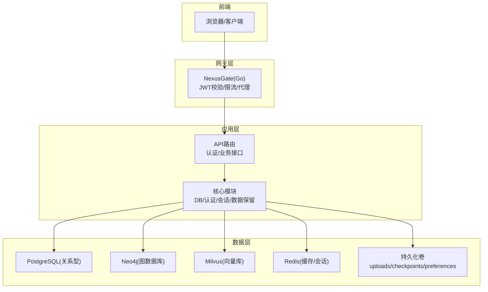
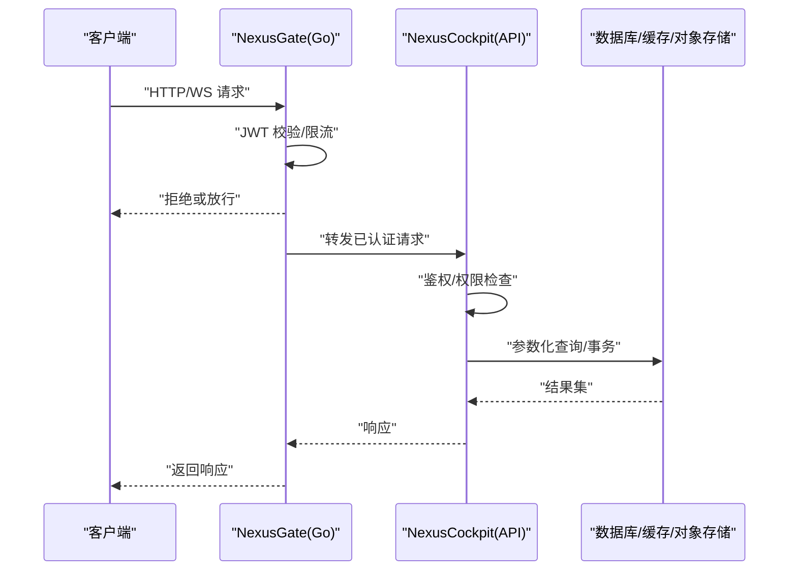
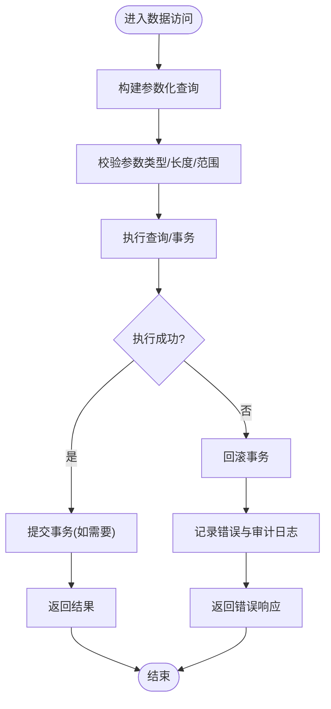
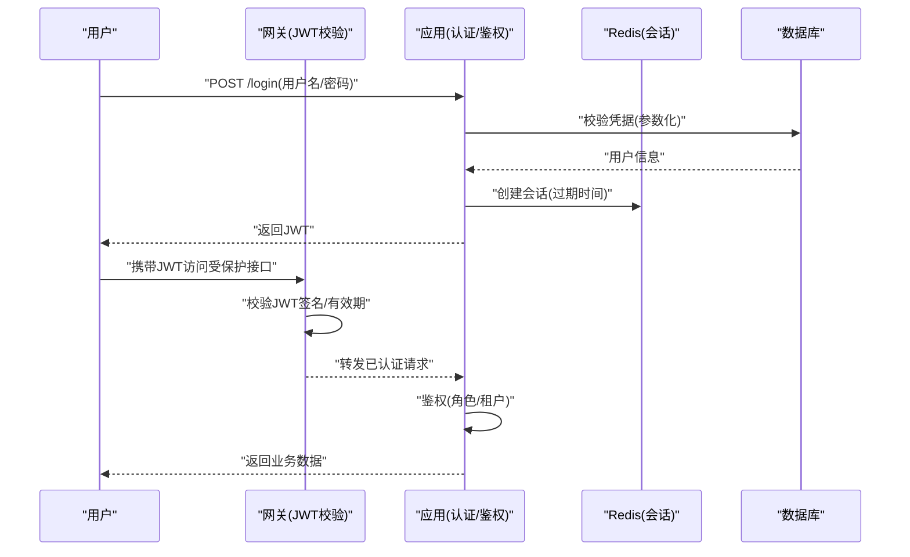
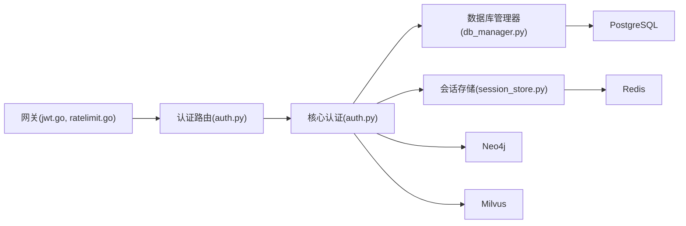

# 数据安全与备份

<cite>
**本文引用的文件**   
- [backend_design/nexus/core/db_manager.py](file://backend_design/nexus/core/db_manager.py)
- [backend_design/nexus/core/auth.py](file://backend_design/nexus/core/auth.py)
- [backend_design/nexus/api/routes/auth.py](file://backend_design/nexus/api/routes/auth.py)
- [backend_design/nexus/config.py](file://backend_design/nexus/config.py)
- [backend_design/nexus/middleware/session_store.py](file://backend_design/nexus/middleware/session_store.py)
- [backend_design/nexus/observability/data_retention.py](file://backend_design/nexus/observability/data_retention.py)
- [backend_design/nexus_gate/internal/auth/jwt.go](file://backend_design/nexus_gate/internal/auth/jwt.go)
- [backend_design/nexus_gate/internal/ratelimit/ratelimit.go](file://backend_design/nexus_gate/internal/ratelimit/ratelimit.go)
- [docker-compose.yml](file://docker-compose.yml)
- [config/grafana/provisioning/dashboards/nexuscockpit-overview.json](file://config/grafana/provisioning/dashboards/nexuscockpit-overview.json)
- [scripts/init_neo4j.py](file://scripts/init_neo4j.py)
- [scripts/init_milvus.py](file://scripts/init_milvus.py)
</cite>

## 目录
1. [简介](#简介)
2. [项目结构](#项目结构)
3. [核心组件](#核心组件)
4. [架构总览](#架构总览)
5. [详细组件分析](#详细组件分析)
6. [依赖分析](#依赖分析)
7. [性能考虑](#性能考虑)
8. [故障排查指南](#故障排查指南)
9. [结论](#结论)
10. [附录](#附录)

## 简介
本指南聚焦 NexusCockpit 的数据安全与备份，覆盖数据库访问控制、权限管理、SQL注入防护、敏感数据加密存储（密码、密钥、传输）、备份策略（全量/增量/定时）、恢复流程（灾难恢复、迁移、回滚）、合规要求（GDPR、脱敏、审计日志）以及存储卷管理与容量规划。文档以仓库现有实现为依据，结合部署配置与可观测性能力，提供从设计到落地的完整参考。

## 项目结构
与安全与备份相关的代码主要分布在后端 Python 服务、Go 网关、配置与脚本中：
- 后端服务（Python）：数据库连接与事务、认证鉴权、会话存储、数据保留策略等
- 网关（Go）：JWT 校验、限流、代理转发
- 配置与编排：Docker Compose、Grafana 仪表盘
- 初始化脚本：图数据库与向量库初始化

图表来源
- [backend_design/nexus/api/routes/auth.py](file://backend_design/nexus/api/routes/auth.py)
- [backend_design/nexus/core/auth.py](file://backend_design/nexus/core/auth.py)
- [backend_design/nexus/core/db_manager.py](file://backend_design/nexus/core/db_manager.py)
- [backend_design/nexus/middleware/session_store.py](file://backend_design/nexus/middleware/session_store.py)
- [backend_design/nexus_gate/internal/auth/jwt.go](file://backend_design/nexus_gate/internal/auth/jwt.go)
- [backend_design/nexus_gate/internal/ratelimit/ratelimit.go](file://backend_design/nexus_gate/internal/ratelimit/ratelimit.go)
- [docker-compose.yml](file://docker-compose.yml)

章节来源
- [docker-compose.yml](file://docker-compose.yml)
- [backend_design/nexus/core/db_manager.py](file://backend_design/nexus/core/db_manager.py)
- [backend_design/nexus/core/auth.py](file://backend_design/nexus/core/auth.py)
- [backend_design/nexus/api/routes/auth.py](file://backend_design/nexus/api/routes/auth.py)
- [backend_design/nexus/middleware/session_store.py](file://backend_design/nexus/middleware/session_store.py)
- [backend_design/nexus_gate/internal/auth/jwt.go](file://backend_design/nexus_gate/internal/auth/jwt.go)
- [backend_design/nexus_gate/internal/ratelimit/ratelimit.go](file://backend_design/nexus_gate/internal/ratelimit/ratelimit.go)

## 核心组件
- 数据库管理器：负责连接池、事务、参数化查询与错误处理，是 SQL 注入防护的关键点
- 认证与授权：基于 JWT 的无状态鉴权，配合网关层统一校验
- 会话存储：使用 Redis 作为会话载体，支持过期与隔离
- 数据保留策略：定义数据生命周期与清理规则，支撑合规与容量治理
- 网关安全：JWT 校验、速率限制、反向代理

章节来源
- [backend_design/nexus/core/db_manager.py](file://backend_design/nexus/core/db_manager.py)
- [backend_design/nexus/core/auth.py](file://backend_design/nexus/core/auth.py)
- [backend_design/nexus/api/routes/auth.py](file://backend_design/nexus/api/routes/auth.py)
- [backend_design/nexus/middleware/session_store.py](file://backend_design/nexus/middleware/session_store.py)
- [backend_design/nexus/observability/data_retention.py](file://backend_design/nexus/observability/data_retention.py)
- [backend_design/nexus_gate/internal/auth/jwt.go](file://backend_design/nexus_gate/internal/auth/jwt.go)
- [backend_design/nexus_gate/internal/ratelimit/ratelimit.go](file://backend_design/nexus_gate/internal/ratelimit/ratelimit.go)

## 架构总览
下图展示请求在网关与应用之间的流转，以及关键安全控制点的位置。

图表来源
- [backend_design/nexus_gate/internal/auth/jwt.go](file://backend_design/nexus_gate/internal/auth/jwt.go)
- [backend_design/nexus_gate/internal/ratelimit/ratelimit.go](file://backend_design/nexus_gate/internal/ratelimit/ratelimit.go)
- [backend_design/nexus/api/routes/auth.py](file://backend_design/nexus/api/routes/auth.py)
- [backend_design/nexus/core/auth.py](file://backend_design/nexus/core/auth.py)
- [backend_design/nexus/core/db_manager.py](file://backend_design/nexus/core/db_manager.py)

## 详细组件分析

### 数据库安全与访问控制
- 连接与凭据：通过配置加载数据库连接信息，建议在生产环境使用环境变量注入，避免硬编码
- 参数化查询：所有 SQL 使用参数绑定，禁止字符串拼接，从根本上防止 SQL 注入
- 最小权限原则：为应用账户授予必要的最小权限，禁用 DDL/DROP 等高危操作
- 连接池与超时：合理设置最大连接数、空闲回收与超时，避免资源耗尽
- 事务边界：对写操作使用显式事务，确保一致性；失败时回滚并记录审计日志

图表来源
- [backend_design/nexus/core/db_manager.py](file://backend_design/nexus/core/db_manager.py)

章节来源
- [backend_design/nexus/core/db_manager.py](file://backend_design/nexus/core/db_manager.py)

### 认证与权限管理
- 网关层 JWT 校验：统一验证签名、有效期与受众，未通过则直接拒绝
- 应用层鉴权：根据用户角色/租户上下文进行细粒度权限控制
- 会话管理：将会话信息存储在 Redis，支持过期与隔离，避免本地状态泄露
- 登录流程：认证成功后签发 JWT，后续请求携带令牌访问受保护资源

图表来源
- [backend_design/nexus_gate/internal/auth/jwt.go](file://backend_design/nexus_gate/internal/auth/jwt.go)
- [backend_design/nexus/api/routes/auth.py](file://backend_design/nexus/api/routes/auth.py)
- [backend_design/nexus/core/auth.py](file://backend_design/nexus/core/auth.py)
- [backend_design/nexus/middleware/session_store.py](file://backend_design/nexus/middleware/session_store.py)

章节来源
- [backend_design/nexus_gate/internal/auth/jwt.go](file://backend_design/nexus_gate/internal/auth/jwt.go)
- [backend_design/nexus/api/routes/auth.py](file://backend_design/nexus/api/routes/auth.py)
- [backend_design/nexus/core/auth.py](file://backend_design/nexus/core/auth.py)
- [backend_design/nexus/middleware/session_store.py](file://backend_design/nexus/middleware/session_store.py)

### 敏感数据加密与密钥管理
- 密码存储：对用户密码采用强哈希算法加盐存储，禁止明文保存
- 密钥管理：使用环境变量或外部密钥管理服务注入，避免写入镜像或源码
- 数据传输加密：对外暴露 HTTPS/TLS，内部服务间通信建议使用 mTLS 或内网加密通道
- 敏感字段加密：对高敏感数据（如个人身份信息）在入库前进行加密，出库后解密，密钥与数据分离

章节来源
- [backend_design/nexus/config.py](file://backend_design/nexus/config.py)
- [backend_design/nexus/core/auth.py](file://backend_design/nexus/core/auth.py)

### 数据备份策略
- 全量备份：定期导出关系型数据库快照，并归档至对象存储或独立备份卷
- 增量备份：基于 WAL/变更日志的增量复制，缩短恢复窗口
- 定时任务：通过系统调度或容器编排工具触发备份脚本，记录执行结果与告警
- 多副本与异地容灾：至少保留两份不同位置的副本，满足 RPO/RTO 目标

章节来源
- [docker-compose.yml](file://docker-compose.yml)

### 数据恢复流程
- 灾难恢复：从最近的全量备份恢复，再回放增量日志至指定时间点
- 数据迁移：在预生产环境验证迁移脚本与回滚方案，灰度发布
- 版本回滚：保持向后兼容的迁移策略，必要时提供逆向迁移脚本

章节来源
- [docker-compose.yml](file://docker-compose.yml)

### 数据合规与审计
- GDPR 合规：提供数据删除与导出能力，遵循“被遗忘权”与最小化采集原则
- 数据脱敏：在日志与监控中屏蔽敏感字段，仅保留必要上下文
- 审计日志：记录关键操作（登录、权限变更、数据导出），不可篡改且可追溯

章节来源
- [backend_design/nexus/observability/data_retention.py](file://backend_design/nexus/observability/data_retention.py)

### 存储卷管理与容量规划
- 持久化配置：将上传文件、检查点、偏好设置等挂载到持久卷，避免容器重启丢失
- 空间监控：通过 Grafana 仪表盘监控磁盘使用率与增长趋势
- 容量规划：设定阈值告警，自动清理临时文件与过期数据，预留扩容空间

章节来源
- [docker-compose.yml](file://docker-compose.yml)
- [config/grafana/provisioning/dashboards/nexuscockpit-overview.json](file://config/grafana/provisioning/dashboards/nexuscockpit-overview.json)

## 依赖分析
- 组件耦合
  - API 路由依赖认证与数据库管理器
  - 网关依赖 JWT 校验与限流
  - 会话存储依赖 Redis
- 外部依赖
  - PostgreSQL、Neo4j、Milvus、Redis
  - 对象存储（用于备份归档）
- 潜在风险
  - 循环依赖需避免
  - 第三方库升级需评估安全影响

图表来源
- [backend_design/nexus/api/routes/auth.py](file://backend_design/nexus/api/routes/auth.py)
- [backend_design/nexus/core/auth.py](file://backend_design/nexus/core/auth.py)
- [backend_design/nexus/core/db_manager.py](file://backend_design/nexus/core/db_manager.py)
- [backend_design/nexus/middleware/session_store.py](file://backend_design/nexus/middleware/session_store.py)
- [backend_design/nexus_gate/internal/auth/jwt.go](file://backend_design/nexus_gate/internal/auth/jwt.go)
- [backend_design/nexus_gate/internal/ratelimit/ratelimit.go](file://backend_design/nexus_gate/internal/ratelimit/ratelimit.go)

章节来源
- [backend_design/nexus/api/routes/auth.py](file://backend_design/nexus/api/routes/auth.py)
- [backend_design/nexus/core/auth.py](file://backend_design/nexus/core/auth.py)
- [backend_design/nexus/core/db_manager.py](file://backend_design/nexus/core/db_manager.py)
- [backend_design/nexus/middleware/session_store.py](file://backend_design/nexus/middleware/session_store.py)
- [backend_design/nexus_gate/internal/auth/jwt.go](file://backend_design/nexus_gate/internal/auth/jwt.go)
- [backend_design/nexus_gate/internal/ratelimit/ratelimit.go](file://backend_design/nexus_gate/internal/ratelimit/ratelimit.go)

## 性能考虑
- 数据库连接池大小与并发模型匹配，避免锁竞争
- 读写分离与只读副本提升查询吞吐
- 缓存热点数据，减少数据库压力
- 备份与恢复在非高峰时段执行，降低对在线服务的影响

## 故障排查指南
- 认证失败
  - 检查 JWT 签名与有效期
  - 核对网关与应用配置的公钥/私钥一致
- 数据库连接异常
  - 确认凭据、网络可达、连接池上限
  - 查看慢查询与锁等待
- 会话丢失
  - 检查 Redis 连通性与键空间是否被清理
- 备份失败
  - 核对备份路径权限、存储空间、网络带宽
  - 校验备份完整性与可恢复性

章节来源
- [backend_design/nexus_gate/internal/auth/jwt.go](file://backend_design/nexus_gate/internal/auth/jwt.go)
- [backend_design/nexus/core/db_manager.py](file://backend_design/nexus/core/db_manager.py)
- [backend_design/nexus/middleware/session_store.py](file://backend_design/nexus/middleware/session_store.py)
- [docker-compose.yml](file://docker-compose.yml)

## 结论
通过网关层统一鉴权与限流、应用层参数化查询与最小权限、会话与密钥的安全管理、完善的备份与恢复策略、以及合规与可观测性保障，NexusCockpit 能够在生产环境中提供稳健的数据安全与可靠性。建议持续完善自动化备份校验、异地容灾演练与合规审计闭环。

## 附录

### 初始化与运维脚本
- 图数据库初始化：用于创建必要的节点与索引
- 向量库初始化：用于建立集合与索引，优化检索性能

章节来源
- [scripts/init_neo4j.py](file://scripts/init_neo4j.py)
- [scripts/init_milvus.py](file://scripts/init_milvus.py)