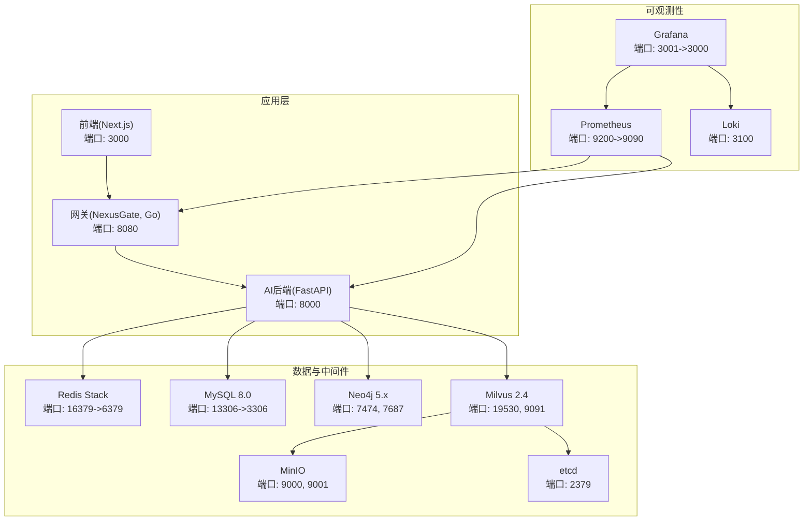
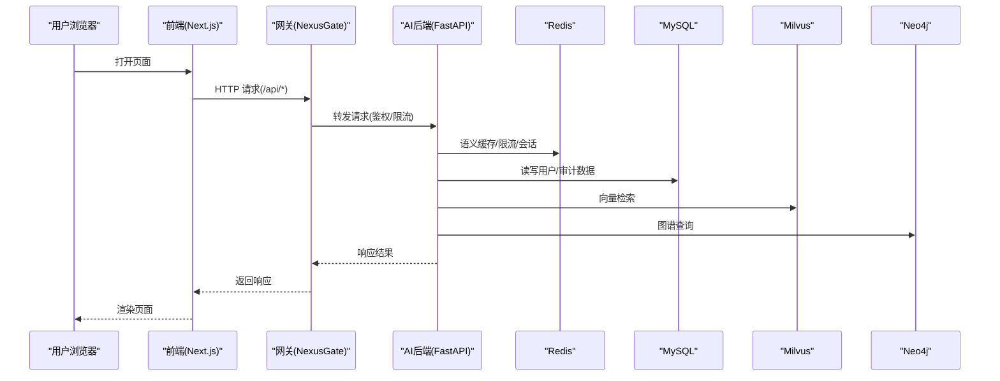
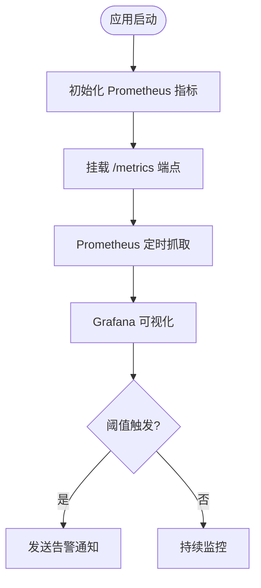
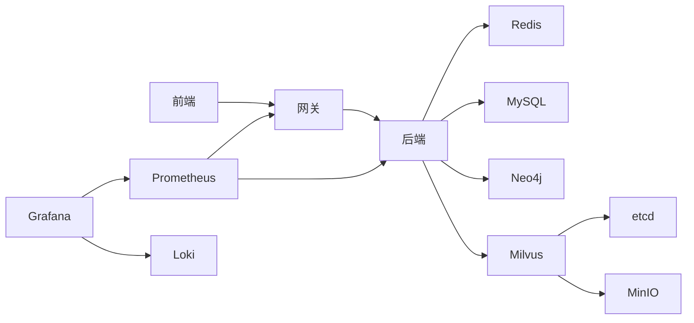
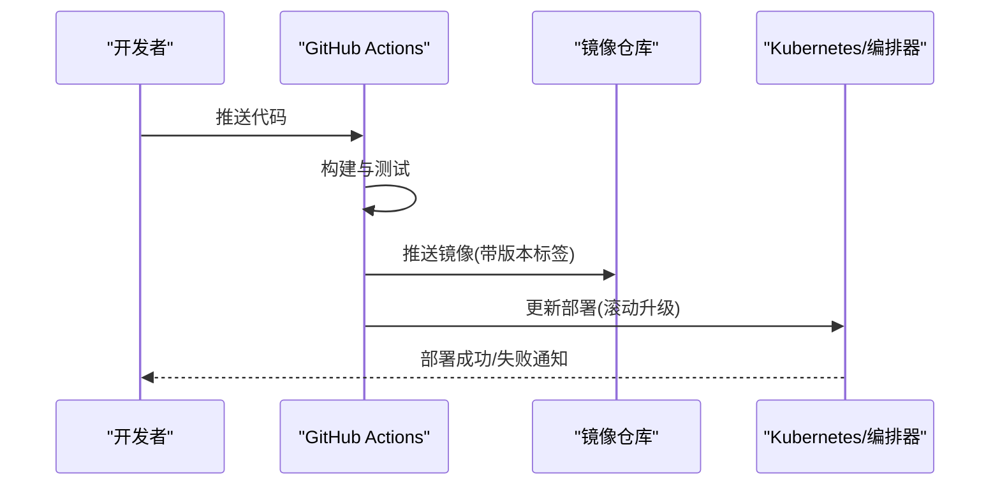

# 生产环境部署

<cite>
**本文引用的文件**   
- [docker-compose.yml](file://docker-compose.yml)
- [backend_design/Dockerfile](file://backend_design/Dockerfile)
- [frontend_design/Dockerfile](file://frontend_design/Dockerfile)
- [backend_design/nexus_gate/Dockerfile](file://backend_design/nexus_gate/Dockerfile)
- [.github/workflows/ci.yml](file://.github/workflows/ci.yml)
- [backend_design/nexus/config.py](file://backend_design/nexus/config.py)
- [backend_design/nexus/main.py](file://backend_design/nexus/main.py)
- [config/prometheus/prometheus.yml](file://config/prometheus/prometheus.yml)
- [config/grafana/provisioning/dashboards/nexuscockpit-overview.json](file://config/grafana/provisioning/dashboards/nexuscockpit-overview.json)
- [config/grafana/provisioning/datasources/prometheus.yml](file://config/grafana/provisioning/datasources/prometheus.yml)
- [backend_design/nexus/observability/metrics.py](file://backend_design/nexus/observability/metrics.py)
- [backend_design/nexus/core/ssl_fix.py](file://backend_design/nexus/core/ssl_fix.py)
- [Makefile](file://Makefile)
- [docs/deployment/SETUP.md](file://docs/deployment/SETUP.md)
- [docs/architecture/README.md](file://docs/architecture/README.md)
</cite>

## 目录
1. [简介](#简介)
2. [项目结构](#项目结构)
3. [核心组件](#核心组件)
4. [架构总览](#架构总览)
5. [详细组件分析](#详细组件分析)
6. [依赖关系分析](#依赖关系分析)
7. [性能与容量规划](#性能与容量规划)
8. [高可用与弹性伸缩](#高可用与弹性伸缩)
9. [网络安全与访问控制](#网络安全与访问控制)
10. [数据存储与容灾](#数据存储与容灾)
11. [CI/CD 流水线与自动化部署](#cicd-流水线与自动化部署)
12. [故障排查指南](#故障排查指南)
13. [结论](#结论)

## 简介
本指南面向生产环境，聚焦 NexusCockpit 的容器化最佳实践、安全加固、资源限制、高可用架构、可观测性、数据持久化与容灾、网络安全以及 CI/CD 集成。文档基于仓库现有配置与代码进行系统化梳理，并提供可直接落地的部署建议与排障要点。

## 项目结构
NexusCockpit 采用“Go 网关 + Python AI 后端 + Next.js 前端”的多服务架构，配合 Milvus、Neo4j、Redis、MySQL、MinIO、etcd、Prometheus、Grafana、Loki 等中间件，通过 Docker Compose 编排。

图示来源
- [docker-compose.yml:1-246](file://docker-compose.yml#L1-L246)
- [config/prometheus/prometheus.yml:1-35](file://config/prometheus/prometheus.yml#L1-L35)
- [config/grafana/provisioning/datasources/prometheus.yml:1-14](file://config/grafana/provisioning/datasources/prometheus.yml#L1-L14)

章节来源
- [docker-compose.yml:1-246](file://docker-compose.yml#L1-L246)
- [docs/architecture/README.md:1-126](file://docs/architecture/README.md#L1-L126)

## 核心组件
- 网关（NexusGate）：Go 实现，负责反向代理、鉴权、限流、跨域等，暴露 /health 健康检查。
- AI 后端（FastAPI）：Python 实现，提供 REST/SSE/WebSocket 接口，挂载 /metrics 指标端点，启动时初始化向量库、图谱、缓存、会话、Agent 工作流等。
- 前端（Next.js）：构建产物以 standalone 模式运行，默认监听 3000。
- 中间件：Redis Stack（缓存/限流/向量检索）、MySQL（结构化数据）、Neo4j（知识图谱）、Milvus（向量存储）、MinIO（对象存储）、etcd（分布式一致性）。
- 可观测性：Prometheus 抓取 /metrics，Grafana 预置仪表盘，Loki 聚合日志。

章节来源
- [backend_design/nexus/main.py:294-437](file://backend_design/nexus/main.py#L294-L437)
- [backend_design/nexus/observability/metrics.py:1-113](file://backend_design/nexus/observability/metrics.py#L1-L113)
- [config/prometheus/prometheus.yml:1-35](file://config/prometheus/prometheus.yml#L1-L35)
- [config/grafana/provisioning/dashboards/nexuscockpit-overview.json:1-200](file://config/grafana/provisioning/dashboards/nexuscockpit-overview.json#L1-L200)

## 架构总览
下图展示请求从前端到网关再到后端的完整链路，以及关键中间件的交互。

图示来源
- [docker-compose.yml:14-89](file://docker-compose.yml#L14-L89)
- [backend_design/nexus/main.py:318-343](file://backend_design/nexus/main.py#L318-L343)
- [config/prometheus/prometheus.yml:6-20](file://config/prometheus/prometheus.yml#L6-L20)

## 详细组件分析

### 容器镜像优化与安全加固
- 多阶段构建
  - Python 后端：builder 安装依赖，runner 仅包含运行时与包，减小镜像体积。
  - Go 网关：静态编译二进制，runner 使用 alpine 最小镜像。
  - 前端：Node builder 构建 .next/standalone，runner 仅运行产物。
- 安全加固建议
  - 非 root 运行容器；只读根文件系统；最小权限网络。
  - 使用私有镜像仓库并启用签名校验；定期扫描漏洞。
  - 将敏感信息（密钥、密码）注入为环境变量或 Secret，避免写入镜像。
  - 关闭不必要的调试开关（如 DEBUG），严格 CORS 白名单。
  - 在 Windows 环境下注意 SSL 证书加载问题，必要时引入修复逻辑。

章节来源
- [backend_design/Dockerfile:1-41](file://backend_design/Dockerfile#L1-L41)
- [backend_design/nexus_gate/Dockerfile:1-22](file://backend_design/nexus_gate/Dockerfile#L1-L22)
- [frontend_design/Dockerfile:1-32](file://frontend_design/Dockerfile#L1-L32)
- [backend_design/nexus/core/ssl_fix.py:1-35](file://backend_design/nexus/core/ssl_fix.py#L1-L35)

### 资源限制与进程模型
- 容器资源限制
  - 建议在编排层为各服务设置 CPU/内存上限与下限，防止争抢与 OOM。
  - Redis 已配置 maxmemory 与淘汰策略，需结合业务峰值评估。
- 进程模型
  - FastAPI 生产模式建议使用多 worker 进程（例如 uvicorn --workers N），并结合网关水平扩展。
  - Go 网关天然支持并发，可通过副本数提升吞吐。

章节来源
- [docker-compose.yml:162-174](file://docker-compose.yml#L162-L174)
- [docs/deployment/SETUP.md:410-415](file://docs/deployment/SETUP.md#L410-L415)

### 健康检查与服务发现
- 健康检查
  - 网关与后端均定义 /health 健康检查，编排工具据此判定就绪。
- 服务发现
  - 当前为单机 Compose 场景，服务间通过容器名解析。生产上建议迁移至 Kubernetes Service 或云托管服务发现。

章节来源
- [docker-compose.yml:33-37](file://docker-compose.yml#L33-L37)
- [docker-compose.yml:70-74](file://docker-compose.yml#L70-L74)

### 可观测性与告警
- 指标采集
  - 后端暴露 /metrics，Prometheus 按 job 抓取；Grafana 预置仪表盘。
- 日志与追踪
  - Loki 聚合日志；Langfuse 可选开启用于 LLM 调用链追踪。

图示来源
- [backend_design/nexus/main.py:341-343](file://backend_design/nexus/main.py#L341-L343)
- [backend_design/nexus/observability/metrics.py:104-113](file://backend_design/nexus/observability/metrics.py#L104-L113)
- [config/prometheus/prometheus.yml:1-35](file://config/prometheus/prometheus.yml#L1-L35)
- [config/grafana/provisioning/dashboards/nexuscockpit-overview.json:1-200](file://config/grafana/provisioning/dashboards/nexuscockpit-overview.json#L1-L200)

章节来源
- [backend_design/nexus/main.py:341-343](file://backend_design/nexus/main.py#L341-L343)
- [config/prometheus/prometheus.yml:1-35](file://config/prometheus/prometheus.yml#L1-L35)
- [config/grafana/provisioning/datasources/prometheus.yml:1-14](file://config/grafana/provisioning/datasources/prometheus.yml#L1-L14)

## 依赖关系分析
- 应用依赖
  - 前端 → 网关 → 后端
  - 后端 → Redis、MySQL、Neo4j、Milvus
  - Milvus → etcd、MinIO
- 可观测性依赖
  - Prometheus → 后端/网关/Milvus
  - Grafana → Prometheus/Loki

图示来源
- [docker-compose.yml:14-233](file://docker-compose.yml#L14-L233)
- [config/prometheus/prometheus.yml:6-20](file://config/prometheus/prometheus.yml#L6-L20)

章节来源
- [docker-compose.yml:14-233](file://docker-compose.yml#L14-L233)

## 性能与容量规划
- 后端
  - 合理设置 uvicorn workers 数量（CPU 核数×2 作为起点），结合压测调优。
  - 调整 Redis 语义缓存相似度阈值与 TTL，降低 LLM 调用成本。
- 向量与图谱
  - Milvus HNSW 索引参数（M、efConstruction、ef）根据召回率与延迟权衡。
  - Neo4j 按需创建约束与索引，避免全图扫描。
- 存储
  - MinIO 与 MySQL 卷空间预留充足，监控磁盘水位。
- 可观测性
  - Prometheus scrape_interval 与保留周期按数据量与预算设定。

章节来源
- [backend_design/nexus/config.py:167-198](file://backend_design/nexus/config.py#L167-L198)
- [docker-compose.yml:125-143](file://docker-compose.yml#L125-L143)
- [docker-compose.yml:176-196](file://docker-compose.yml#L176-L196)
- [config/prometheus/prometheus.yml:1-4](file://config/prometheus/prometheus.yml#L1-L4)

## 高可用与弹性伸缩
- 负载均衡
  - 在生产中前置 Ingress/LoadBalancer，对网关与后端进行多副本分发。
- 服务发现与健康检查
  - 使用平台原生服务发现；健康检查路径复用 /health。
- 自动扩缩容
  - 基于 CPU/内存/P95 延迟等指标触发 HPA；结合 Prometheus 自定义指标。
- 无状态设计
  - 会话与缓存外置 Redis，确保实例可横向扩展。

[本节为通用指导，不直接分析具体文件]

## 网络安全与访问控制
- HTTPS 与证书
  - 在网关前部署 TLS 终止（Ingress/Nginx），证书由外部 CA 管理。
- 防火墙与 ACL
  - 仅开放必要端口（如 80/443），数据库与中间件端口内网访问。
- 访问控制
  - JWT 密钥必须强随机并在生产覆盖；CORS 限定可信域名。
  - 控制台（Grafana/MinIO/Neo4j）修改默认口令并限制访问。

章节来源
- [backend_design/nexus/config.py:277-292](file://backend_design/nexus/config.py#L277-L292)
- [backend_design/nexus/config.py:416-432](file://backend_design/nexus/config.py#L416-L432)
- [docker-compose.yml:146-158](file://docker-compose.yml#L146-L158)
- [docker-compose.yml:219-233](file://docker-compose.yml#L219-L233)

## 数据存储与容灾
- 主从复制
  - MySQL：启用主从复制与半同步，读写分离；连接串指向主库写、从库读。
  - Neo4j：启用集群或备份策略，定期导出快照。
  - Milvus：etcd+MinIO 持久化，定期快照与异地备份。
- 备份策略
  - 定时全量+增量备份，保留多份离线副本；验证恢复流程。
- 灾难恢复
  - 制定 RTO/RPO 目标；演练切换与回滚；跨可用区部署。

章节来源
- [docker-compose.yml:176-196](file://docker-compose.yml#L176-L196)
- [docker-compose.yml:146-158](file://docker-compose.yml#L146-L158)
- [docker-compose.yml:125-143](file://docker-compose.yml#L125-L143)

## CI/CD 流水线与自动化部署
- 流水线
  - GitHub Actions 执行后端 lint/typecheck/test 与前端的类型检查与构建。
- 构建与发布
  - 多阶段构建镜像，推送至私有仓库；版本标签与镜像哈希绑定。
- 部署脚本
  - 使用 Makefile 统一入口；生产环境通过编排模板拉起服务。
- 版本回滚
  - 基于镜像版本快速回滚；数据库变更需具备向下兼容或迁移回滚脚本。

图示来源
- [.github/workflows/ci.yml:1-50](file://.github/workflows/ci.yml#L1-L50)
- [Makefile:75-88](file://Makefile#L75-L88)

章节来源
- [.github/workflows/ci.yml:1-50](file://.github/workflows/ci.yml#L1-L50)
- [Makefile:75-88](file://Makefile#L75-L88)

## 故障排查指南
- 常见问题定位
  - 健康检查失败：查看对应服务的 healthcheck 命令与日志。
  - 指标不可用：确认 /metrics 端点可达与 Prometheus 抓取目标。
  - 模型加载失败：核对模型路径与环境变量，确认挂载卷存在。
  - GPU 不可用：检查驱动与 CUDA 版本匹配。
- 诊断工具
  - docker compose logs 查看中间件日志；Grafana 面板观察 P95 延迟与缓存命中率。
  - 使用 curl 探测 /health 与 /metrics。

章节来源
- [docker-compose.yml:33-37](file://docker-compose.yml#L33-L37)
- [docker-compose.yml:70-74](file://docker-compose.yml#L70-L74)
- [config/prometheus/prometheus.yml:6-20](file://config/prometheus/prometheus.yml#L6-L20)
- [docs/deployment/SETUP.md:464-528](file://docs/deployment/SETUP.md#L464-L528)

## 结论
通过多阶段镜像优化、严格的配置管理与安全加固、完善的可观测体系与数据容灾方案，NexusCockpit 可在生产环境中稳定运行。结合负载均衡、服务发现与自动扩缩容，可实现高可用与弹性伸缩。CI/CD 与版本回滚策略保障交付质量与快速恢复能力。