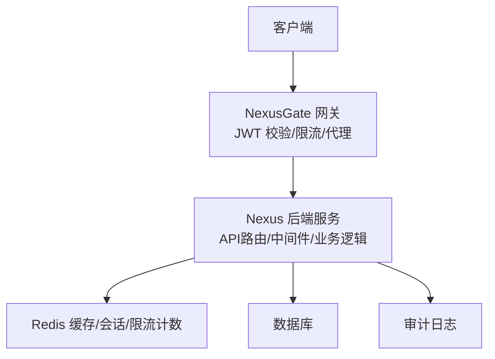
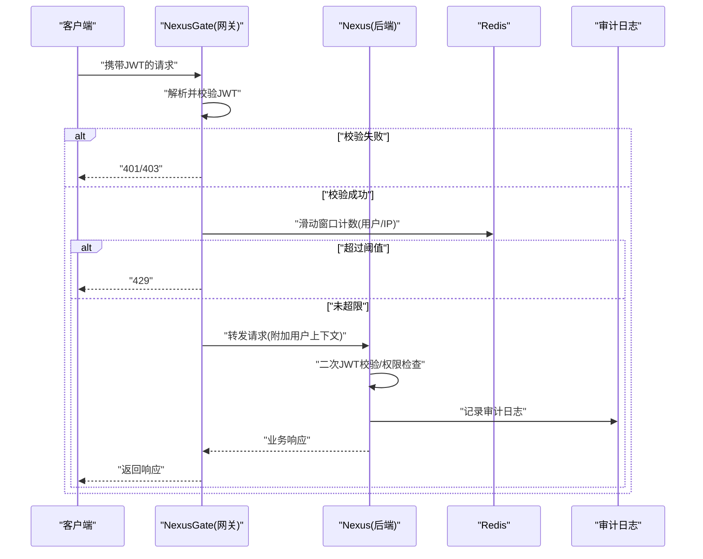
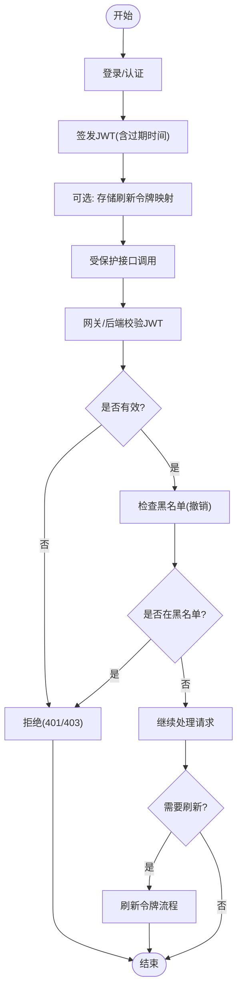
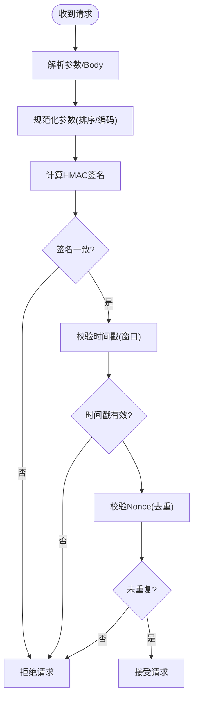
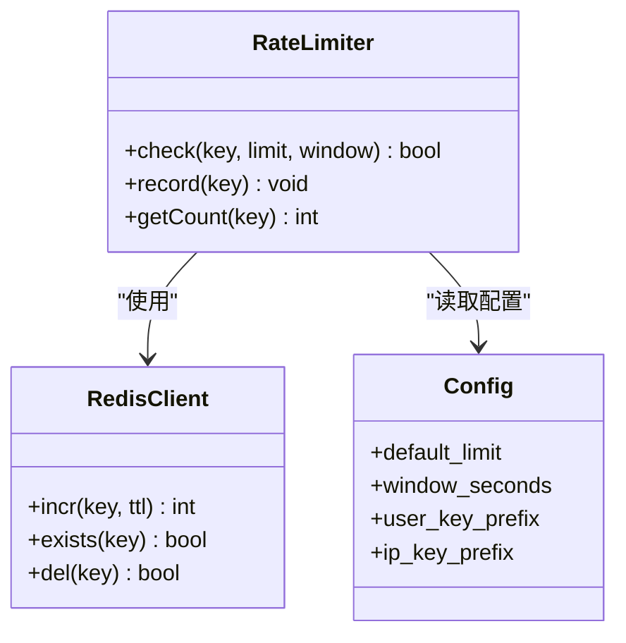
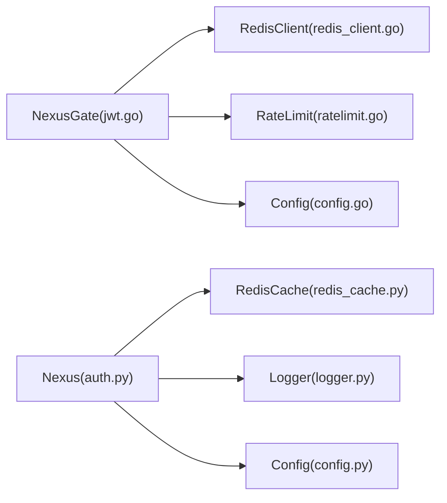

# API安全防护

<cite>
**本文引用的文件**   
- [backend_design/nexus/api/routes/auth.py](file://backend_design/nexus/api/routes/auth.py)
- [backend_design/nexus/core/auth.py](file://backend_design/nexus/core/auth.py)
- [backend_design/nexus/middleware/rate_limiter.py](file://backend_design/nexus/middleware/rate_limiter.py)
- [backend_design/nexus/middleware/redis_cache.py](file://backend_design/nexus/middleware/redis_cache.py)
- [backend_design/nexus/config.py](file://backend_design/nexus/config.py)
- [backend_design/nexus/models/schemas.py](file://backend_design/nexus/models/schemas.py)
- [backend_design/nexus/core/logger.py](file://backend_design/nexus/core/logger.py)
- [backend_design/nexus_gate/internal/auth/jwt.go](file://backend_design/nexus_gate/internal/auth/jwt.go)
- [backend_design/nexus_gate/internal/ratelimit/ratelimit.go](file://backend_design/nexus_gate/internal/ratelimit/ratelimit.go)
- [backend_design/nexus_gate/internal/handlers/redis_client.go](file://backend_design/nexus_gate/internal/handlers/redis_client.go)
- [backend_design/nexus_gate/internal/config/config.go](file://backend_design/nexus_gate/internal/config/config.go)
</cite>

## 目录
1. [简介](#简介)
2. [项目结构](#项目结构)
3. [核心组件](#核心组件)
4. [架构总览](#架构总览)
5. [详细组件分析](#详细组件分析)
6. [依赖关系分析](#依赖关系分析)
7. [性能考虑](#性能考虑)
8. [故障排查指南](#故障排查指南)
9. [结论](#结论)
10. [附录](#附录)

## 简介
本指南聚焦 NexusCockpit 的 API 安全防护，覆盖以下关键主题：
- JWT 认证机制：令牌签发、验证、刷新与撤销
- 请求签名验证：HMAC 签名算法、时间戳防重放、参数完整性校验
- 速率限制策略：Redis 滑动窗口、用户级限流、IP 级限流
- API 版本控制与向后兼容
- 敏感数据保护：输入验证、SQL 注入防护、XSS 防护、CSRF 防护
- API 审计日志与安全事件记录

## 项目结构
NexusCockpit 采用前后端分离与网关分层架构。后端 Python 服务提供业务 API，Go 网关负责鉴权、限流与代理转发；安全能力在网关与后端中间件协同实现。

**图示来源**
- [backend_design/nexus_gate/internal/auth/jwt.go](file://backend_design/nexus_gate/internal/auth/jwt.go)
- [backend_design/nexus_gate/internal/ratelimit/ratelimit.go](file://backend_design/nexus_gate/internal/ratelimit/ratelimit.go)
- [backend_design/nexus_gate/internal/handlers/redis_client.go](file://backend_design/nexus_gate/internal/handlers/redis_client.go)
- [backend_design/nexus/api/routes/auth.py](file://backend_design/nexus/api/routes/auth.py)
- [backend_design/nexus/middleware/rate_limiter.py](file://backend_design/nexus/middleware/rate_limiter.py)
- [backend_design/nexus/middleware/redis_cache.py](file://backend_design/nexus/middleware/redis_cache.py)

**章节来源**
- [backend_design/nexus/api/routes/auth.py](file://backend_design/nexus/api/routes/auth.py)
- [backend_design/nexus/middleware/rate_limiter.py](file://backend_design/nexus/middleware/rate_limiter.py)
- [backend_design/nexus/middleware/redis_cache.py](file://backend_design/nexus/middleware/redis_cache.py)
- [backend_design/nexus_gate/internal/auth/jwt.go](file://backend_design/nexus_gate/internal/auth/jwt.go)
- [backend_design/nexus_gate/internal/ratelimit/ratelimit.go](file://backend_design/nexus_gate/internal/ratelimit/ratelimit.go)
- [backend_design/nexus_gate/internal/handlers/redis_client.go](file://backend_design/nexus_gate/internal/handlers/redis_client.go)

## 核心组件
- 认证与授权
  - 网关侧 JWT 签发与校验（Go）
  - 后端侧 JWT 校验与上下文注入（Python）
- 速率限制
  - 网关层基于 Redis 的滑动窗口限流（Go）
  - 应用层可选限流中间件（Python）
- 配置与模型
  - 统一配置加载（Go/Python）
  - 请求/响应 Schema 校验（Pydantic）
- 可观测性
  - 结构化审计日志（Python）

**章节来源**
- [backend_design/nexus_gate/internal/auth/jwt.go](file://backend_design/nexus_gate/internal/auth/jwt.go)
- [backend_design/nexus/core/auth.py](file://backend_design/nexus/core/auth.py)
- [backend_design/nexus/middleware/rate_limiter.py](file://backend_design/nexus/middleware/rate_limiter.py)
- [backend_design/nexus/middleware/redis_cache.py](file://backend_design/nexus/middleware/redis_cache.py)
- [backend_design/nexus/config.py](file://backend_design/nexus/config.py)
- [backend_design/nexus/models/schemas.py](file://backend_design/nexus/models/schemas.py)
- [backend_design/nexus/core/logger.py](file://backend_design/nexus/core/logger.py)
- [backend_design/nexus_gate/internal/config/config.go](file://backend_design/nexus_gate/internal/config/config.go)

## 架构总览
下图展示从客户端到后端的完整安全链路：网关完成 JWT 校验与限流，后端进行二次校验、输入验证与审计记录。

**图示来源**
- [backend_design/nexus_gate/internal/auth/jwt.go](file://backend_design/nexus_gate/internal/auth/jwt.go)
- [backend_design/nexus_gate/internal/ratelimit/ratelimit.go](file://backend_design/nexus_gate/internal/ratelimit/ratelimit.go)
- [backend_design/nexus_gate/internal/handlers/redis_client.go](file://backend_design/nexus_gate/internal/handlers/redis_client.go)
- [backend_design/nexus/core/auth.py](file://backend_design/nexus/core/auth.py)
- [backend_design/nexus/core/logger.py](file://backend_design/nexus/core/logger.py)

## 详细组件分析

### JWT 认证机制（签发、验证、刷新、撤销）
- 令牌签发
  - 网关或认证服务使用对称密钥签发 JWT，包含必要声明（如用户标识、租户、过期时间等）。
  - 建议将最小化必要信息放入载荷，敏感信息通过服务端查询获取。
- 令牌验证
  - 网关层对每个受保护接口进行 JWT 验签与过期检查。
  - 后端层进行二次校验，确保跨进程一致性。
- 令牌刷新
  - 提供独立的刷新接口，校验旧令牌有效性后签发新令牌。
  - 支持短生命周期访问令牌 + 长生命周期刷新令牌的组合策略。
- 令牌撤销
  - 维护黑名单集合（Redis），在注销、密码重置、异常检测时加入黑名单。
  - 网关与后端均需在验证阶段检查黑名单。

**图示来源**
- [backend_design/nexus_gate/internal/auth/jwt.go](file://backend_design/nexus_gate/internal/auth/jwt.go)
- [backend_design/nexus/core/auth.py](file://backend_design/nexus/core/auth.py)
- [backend_design/nexus/middleware/redis_cache.py](file://backend_design/nexus/middleware/redis_cache.py)

**章节来源**
- [backend_design/nexus_gate/internal/auth/jwt.go](file://backend_design/nexus_gate/internal/auth/jwt.go)
- [backend_design/nexus/core/auth.py](file://backend_design/nexus/core/auth.py)
- [backend_design/nexus/middleware/redis_cache.py](file://backend_design/nexus/middleware/redis_cache.py)

### 请求签名验证（HMAC、时间戳防重放、参数完整性）
- HMAC 签名算法
  - 客户端按约定顺序拼接关键参数，使用共享密钥生成 HMAC 摘要，随请求头或查询参数发送。
  - 服务端以相同规则计算签名并比对。
- 时间戳防重放
  - 请求携带时间戳与随机数（nonce），服务端校验时间窗口与 nonce 唯一性（Redis 去重）。
- 参数完整性校验
  - 对关键字段进行白名单过滤与类型校验，避免篡改。
  - 对 JSON Body 或表单字段进行规范化后再参与签名计算。

[本节为概念性说明，不直接分析具体文件]

### 速率限制策略（Redis 滑动窗口、用户级、IP级）
- 滑动窗口实现
  - 使用 Redis 有序集合或计数器配合 TTL 实现滑动窗口统计。
  - 支持按用户 ID、IP 地址、API 路径等多维度限流。
- 用户级限流
  - 基于 JWT 中的用户标识进行计数，防止单账号滥用。
- IP 级限流
  - 基于客户端真实 IP（考虑反向代理透传）进行计数，防止恶意扫描。
- 网关与应用层协同
  - 网关层做粗粒度快速拦截，应用层可做细粒度业务限流。

**图示来源**
- [backend_design/nexus_gate/internal/ratelimit/ratelimit.go](file://backend_design/nexus_gate/internal/ratelimit/ratelimit.go)
- [backend_design/nexus_gate/internal/handlers/redis_client.go](file://backend_design/nexus_gate/internal/handlers/redis_client.go)
- [backend_design/nexus/middleware/rate_limiter.py](file://backend_design/nexus/middleware/rate_limiter.py)
- [backend_design/nexus/middleware/redis_cache.py](file://backend_design/nexus/middleware/redis_cache.py)
- [backend_design/nexus_gate/internal/config/config.go](file://backend_design/nexus_gate/internal/config/config.go)
- [backend_design/nexus/config.py](file://backend_design/nexus/config.py)

**章节来源**
- [backend_design/nexus_gate/internal/ratelimit/ratelimit.go](file://backend_design/nexus_gate/internal/ratelimit/ratelimit.go)
- [backend_design/nexus_gate/internal/handlers/redis_client.go](file://backend_design/nexus_gate/internal/handlers/redis_client.go)
- [backend_design/nexus/middleware/rate_limiter.py](file://backend_design/nexus/middleware/rate_limiter.py)
- [backend_design/nexus/middleware/redis_cache.py](file://backend_design/nexus/middleware/redis_cache.py)
- [backend_design/nexus_gate/internal/config/config.go](file://backend_design/nexus_gate/internal/config/config.go)
- [backend_design/nexus/config.py](file://backend_design/nexus/config.py)

### API 版本控制与向后兼容性保障
- 版本策略
  - URL 前缀或请求头指定版本（如 /v1/...），便于并行演进。
- 向后兼容
  - 新增字段默认可选，废弃字段保留一段时间并输出告警日志。
  - 变更遵循语义化版本管理，重大破坏性更新升级主版本。
- 灰度与回滚
  - 结合网关路由与特性开关，逐步放量新版本，出现问题快速回滚。

[本节为通用实践说明，不直接分析具体文件]

### 敏感数据保护（输入验证、SQL注入防护、XSS防护、CSRF防护）
- 输入验证
  - 使用 Pydantic Schema 对请求体、查询参数、路径参数进行强类型校验与约束。
- SQL 注入防护
  - 强制使用参数化查询或 ORM，禁止字符串拼接 SQL。
- XSS 防护
  - 输出编码、设置 CSP、禁用危险 HTML 标签。
- CSRF 防护
  - 对状态变更接口启用 SameSite Cookie、Referer 校验或自定义 Token。

**章节来源**
- [backend_design/nexus/models/schemas.py](file://backend_design/nexus/models/schemas.py)

### API 审计日志与安全事件记录
- 审计内容
  - 请求元数据（方法、路径、客户端IP、UA）、用户标识、结果码、耗时、错误信息。
- 安全事件
  - 认证失败、限流触发、签名校验失败、黑名单命中等。
- 日志格式
  - 结构化 JSON，便于集中采集与分析。

**章节来源**
- [backend_design/nexus/core/logger.py](file://backend_design/nexus/core/logger.py)

## 依赖关系分析
- 网关与后端
  - 网关依赖 JWT 库与 Redis 客户端；后端依赖 Pydantic 校验与 Redis 缓存。
- 配置中心
  - Go/Python 两侧分别加载配置，保证密钥、限流阈值等一致。
- 外部依赖
  - Redis 用于会话、黑名单、限流计数；数据库用于持久化。

**图示来源**
- [backend_design/nexus_gate/internal/auth/jwt.go](file://backend_design/nexus_gate/internal/auth/jwt.go)
- [backend_design/nexus_gate/internal/handlers/redis_client.go](file://backend_design/nexus_gate/internal/handlers/redis_client.go)
- [backend_design/nexus_gate/internal/ratelimit/ratelimit.go](file://backend_design/nexus_gate/internal/ratelimit/ratelimit.go)
- [backend_design/nexus_gate/internal/config/config.go](file://backend_design/nexus_gate/internal/config/config.go)
- [backend_design/nexus/core/auth.py](file://backend_design/nexus/core/auth.py)
- [backend_design/nexus/middleware/redis_cache.py](file://backend_design/nexus/middleware/redis_cache.py)
- [backend_design/nexus/core/logger.py](file://backend_design/nexus/core/logger.py)
- [backend_design/nexus/config.py](file://backend_design/nexus/config.py)

**章节来源**
- [backend_design/nexus_gate/internal/auth/jwt.go](file://backend_design/nexus_gate/internal/auth/jwt.go)
- [backend_design/nexus_gate/internal/ratelimit/ratelimit.go](file://backend_design/nexus_gate/internal/ratelimit/ratelimit.go)
- [backend_design/nexus_gate/internal/handlers/redis_client.go](file://backend_design/nexus_gate/internal/handlers/redis_client.go)
- [backend_design/nexus_gate/internal/config/config.go](file://backend_design/nexus_gate/internal/config/config.go)
- [backend_design/nexus/core/auth.py](file://backend_design/nexus/core/auth.py)
- [backend_design/nexus/middleware/redis_cache.py](file://backend_design/nexus/middleware/redis_cache.py)
- [backend_design/nexus/core/logger.py](file://backend_design/nexus/core/logger.py)
- [backend_design/nexus/config.py](file://backend_design/nexus/config.py)

## 性能考虑
- 网关层优先拦截，减少无效请求到达后端。
- 限流计数使用原子操作与合理 TTL，降低 Redis 压力。
- JWT 校验尽量无状态，必要时仅校验签名与过期时间，避免频繁查库。
- 审计日志异步写入，避免阻塞主流程。

[本节为通用指导，不直接分析具体文件]

## 故障排查指南
- 认证失败
  - 检查 JWT 密钥、过期时间、签名算法是否一致。
  - 确认黑名单是否误命中。
- 限流触发
  - 核对限流键（用户/IP）是否正确生成。
  - 观察 Redis 计数与 TTL 是否符合预期。
- 签名校验失败
  - 核对参数排序、编码方式、时间戳窗口与 nonce 去重逻辑。
- 日志定位
  - 检索审计日志中的错误码与关联追踪 ID。

**章节来源**
- [backend_design/nexus/core/logger.py](file://backend_design/nexus/core/logger.py)
- [backend_design/nexus_gate/internal/auth/jwt.go](file://backend_design/nexus_gate/internal/auth/jwt.go)
- [backend_design/nexus_gate/internal/ratelimit/ratelimit.go](file://backend_design/nexus_gate/internal/ratelimit/ratelimit.go)
- [backend_design/nexus/middleware/rate_limiter.py](file://backend_design/nexus/middleware/rate_limiter.py)

## 结论
通过网关与后端协同的 JWT 校验、Redis 驱动的滑动窗口限流、严格的输入验证与审计日志，NexusCockpit 构建了较为完善的 API 安全防护体系。建议在后续迭代中持续完善请求签名验证、细化限流策略与增强可观测性，以提升整体安全性与稳定性。

## 附录
- 最佳实践清单
  - 使用短生命周期访问令牌与刷新令牌组合
  - 对所有外部输入进行强类型校验
  - 开启 HTTPS 与严格的安全头
  - 定期轮换密钥与审查审计日志

[本节为通用建议，不直接分析具体文件]