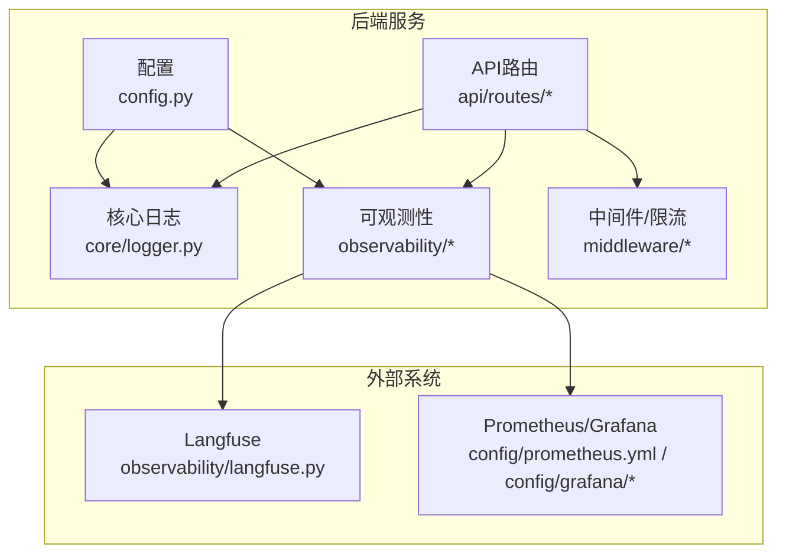
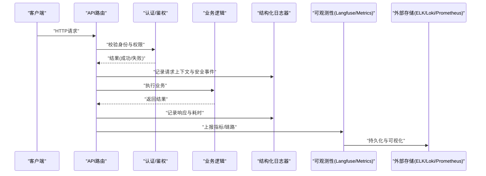
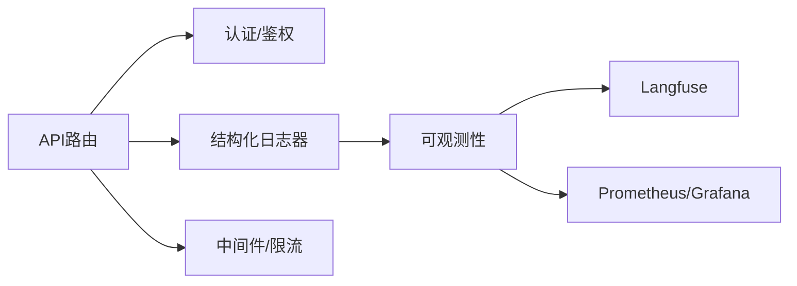

# API审计日志

<cite>
**本文引用的文件**   
- [backend_design/nexus/core/logger.py](file://backend_design/nexus/core/logger.py)
- [backend_design/nexus/api/routes/auth.py](file://backend_design/nexus/api/routes/auth.py)
- [backend_design/nexus/observability/langfuse.py](file://backend_design/nexus/observability/langfuse.py)
- [backend_design/nexus/config.py](file://backend_design/nexus/config.py)
- [config/grafana/provisioning/dashboards/nexuscockpit-overview.json](file://config/grafana/provisioning/dashboards/nexuscockpit-overview.json)
- [config/prometheus/prometheus.yml](file://config/prometheus/prometheus.yml)
- [backend_design/nexus/middleware/rate_limiter.py](file://backend_design/nexus/middleware/rate_limiter.py)
- [backend_design/nexus/core/circuit_breaker.py](file://backend_design/nexus/core/circuit_breaker.py)
- [backend_design/nexus/observability/metrics.py](file://backend_design/nexus/observability/metrics.py)
- [backend_design/nexus/observability/data_retention.py](file://backend_design/nexus/observability/data_retention.py)
</cite>

## 目录
1. [简介](#简介)
2. [项目结构](#项目结构)
3. [核心组件](#核心组件)
4. [架构总览](#架构总览)
5. [详细组件分析](#详细组件分析)
6. [依赖关系分析](#依赖关系分析)
7. [性能考虑](#性能考虑)
8. [故障排查指南](#故障排查指南)
9. [结论](#结论)
10. [附录](#附录)

## 简介
本文件面向API审计日志系统的实现与使用，覆盖以下目标：
- 结构化日志记录：请求上下文捕获、用户行为追踪、操作审计记录
- 安全事件日志：认证失败、权限拒绝、异常访问、可疑行为检测
- 日志聚合与分析：ELK栈集成、日志轮转、性能影响优化
- Langfuse集成：AI调用追踪、对话质量评估、模型性能监控
- 日志安全：敏感信息过滤、日志加密、访问控制
- 查询分析与告警：日志查询工具与告警规则配置

## 项目结构
本项目在后端Python服务中提供可观测性与审计能力，关键位置如下：
- 日志与可观测性：core/logger.py、observability/*
- API路由与安全：api/routes/*（含auth等）
- 中间件与限流：middleware/*（含rate_limiter等）
- 配置与指标：config.py、observability/metrics.py
- 外部集成：Langfuse（observability/langfuse.py）、Grafana/Prometheus（config/*）

图表来源
- [backend_design/nexus/core/logger.py](file://backend_design/nexus/core/logger.py)
- [backend_design/nexus/observability/langfuse.py](file://backend_design/nexus/observability/langfuse.py)
- [backend_design/nexus/config.py](file://backend_design/nexus/config.py)
- [config/prometheus/prometheus.yml](file://config/prometheus/prometheus.yml)
- [config/grafana/provisioning/dashboards/nexuscockpit-overview.json](file://config/grafana/provisioning/dashboards/nexuscockpit-overview.json)

章节来源
- [backend_design/nexus/core/logger.py](file://backend_design/nexus/core/logger.py)
- [backend_design/nexus/observability/langfuse.py](file://backend_design/nexus/observability/langfuse.py)
- [backend_design/nexus/config.py](file://backend_design/nexus/config.py)
- [config/prometheus/prometheus.yml](file://config/prometheus/prometheus.yml)
- [config/grafana/provisioning/dashboards/nexuscockpit-overview.json](file://config/grafana/provisioning/dashboards/nexuscockpit-overview.json)

## 核心组件
- 结构化日志器：负责统一输出JSON格式日志，包含请求ID、租户、用户、方法、路径、状态码、耗时等字段，便于集中采集与检索。
- 安全事件日志：在认证、鉴权、限流、熔断等关键路径记录安全相关事件，如认证失败、权限拒绝、异常访问、可疑行为。
- 可观测性集成：将指标与链路数据上报至Langfuse（AI调用追踪）与Prometheus/Grafana（指标与可视化）。
- 配置中心：集中管理日志级别、采样率、输出目标、Langfuse密钥、指标开关等。
- 中间件与策略：限流、缓存、会话存储等模块配合日志记录，形成完整的审计闭环。

章节来源
- [backend_design/nexus/core/logger.py](file://backend_design/nexus/core/logger.py)
- [backend_design/nexus/observability/metrics.py](file://backend_design/nexus/observability/metrics.py)
- [backend_design/nexus/config.py](file://backend_design/nexus/config.py)
- [backend_design/nexus/middleware/rate_limiter.py](file://backend_design/nexus/middleware/rate_limiter.py)
- [backend_design/nexus/core/circuit_breaker.py](file://backend_design/nexus/core/circuit_breaker.py)

## 架构总览
下图展示从请求进入、安全校验、业务处理到审计与可观测性上报的端到端流程。

图表来源
- [backend_design/nexus/api/routes/auth.py](file://backend_design/nexus/api/routes/auth.py)
- [backend_design/nexus/core/logger.py](file://backend_design/nexus/core/logger.py)
- [backend_design/nexus/observability/langfuse.py](file://backend_design/nexus/observability/langfuse.py)
- [backend_design/nexus/observability/metrics.py](file://backend_design/nexus/observability/metrics.py)

## 详细组件分析

### 结构化日志记录
- 设计要点
  - 统一JSON格式，包含固定字段：时间戳、级别、服务名、请求ID、租户ID、用户ID、方法、路径、状态码、耗时、错误码、消息等。
  - 上下文注入：在请求生命周期内自动附加上下文（如trace_id、span_id、用户会话、设备信息等）。
  - 分层记录：入口层记录请求/响应摘要；业务层记录关键动作；安全层记录风险事件。
- 建议字段规范
  - 基础：timestamp, level, service, trace_id, span_id, tenant_id, user_id, method, path, status_code, duration_ms, error_code, message
  - 扩展：client_ip, ua, referer, request_size, response_size, feature_flag, risk_score
- 示例路径参考
  - 日志器定义与使用：[backend_design/nexus/core/logger.py](file://backend_design/nexus/core/logger.py)

章节来源
- [backend_design/nexus/core/logger.py](file://backend_design/nexus/core/logger.py)

### 请求上下文捕获
- 捕获时机
  - 请求进入时生成trace_id并注入上下文；响应结束时关闭span并记录耗时。
- 上下文内容
  - 网络信息：client_ip、UA、Referer
  - 会话信息：tenant_id、user_id、session_id
  - 链路信息：trace_id、span_id、parent_span_id
- 实现建议
  - 通过中间件或装饰器统一注入；避免在业务代码中散落上下文拼装逻辑。
- 示例路径参考
  - 中间件/限流上下文记录：[backend_design/nexus/middleware/rate_limiter.py](file://backend_design/nexus/middleware/rate_limiter.py)

章节来源
- [backend_design/nexus/middleware/rate_limiter.py](file://backend_design/nexus/middleware/rate_limiter.py)
- [backend_design/nexus/core/logger.py](file://backend_design/nexus/core/logger.py)

### 用户行为追踪与操作审计
- 追踪范围
  - 登录/登出、角色变更、资源访问、数据导出、配置修改等高风险操作。
- 审计字段
  - actor、action、resource、result、risk_level、policy_id、reason
- 触发点
  - 在认证/鉴权成功后记录“成功”事件；在权限拒绝时记录“拒绝”事件；对批量/高价值操作增加额外上下文。
- 示例路径参考
  - 认证路由中的安全事件记录：[backend_design/nexus/api/routes/auth.py](file://backend_design/nexus/api/routes/auth.py)

章节来源
- [backend_design/nexus/api/routes/auth.py](file://backend_design/nexus/api/routes/auth.py)
- [backend_design/nexus/core/logger.py](file://backend_design/nexus/core/logger.py)

### 安全事件日志
- 事件类型
  - 认证失败：无效凭证、过期令牌、多因素失败
  - 权限拒绝：越权访问、资源不存在、策略不匹配
  - 异常访问：非法参数、注入攻击、频率异常
  - 可疑行为：异地登录、频繁失败、异常UA/IP段
- 记录策略
  - 高优先级级别（warn/error），附带风险评分与策略命中详情；必要时脱敏敏感字段。
- 示例路径参考
  - 认证失败与权限拒绝记录：[backend_design/nexus/api/routes/auth.py](file://backend_design/nexus/api/routes/auth.py)
  - 限流触发记录：[backend_design/nexus/middleware/rate_limiter.py](file://backend_design/nexus/middleware/rate_limiter.py)
  - 熔断触发记录：[backend_design/nexus/core/circuit_breaker.py](file://backend_design/nexus/core/circuit_breaker.py)

章节来源
- [backend_design/nexus/api/routes/auth.py](file://backend_design/nexus/api/routes/auth.py)
- [backend_design/nexus/middleware/rate_limiter.py](file://backend_design/nexus/middleware/rate_limiter.py)
- [backend_design/nexus/core/circuit_breaker.py](file://backend_design/nexus/core/circuit_breaker.py)

### 日志聚合与分析（ELK/Loki + Prometheus/Grafana）
- 日志聚合
  - 推荐以Filebeat/Fluent Bit收集JSON日志，投递至Elasticsearch或Loki；按service、level、tenant_id等维度索引。
- 指标与可视化
  - Prometheus抓取应用指标，Grafana提供仪表盘与告警；现有配置文件已包含Prometheus与Grafana的基本设置。
- 日志轮转
  - 服务端侧采用滚动策略（按大小/时间），结合外部采集器进行归档与清理。
- 示例路径参考
  - Prometheus抓取配置：[config/prometheus/prometheus.yml](file://config/prometheus/prometheus.yml)
  - Grafana仪表盘配置：[config/grafana/provisioning/dashboards/nexuscockpit-overview.json](file://config/grafana/provisioning/dashboards/nexuscockpit-overview.json)

章节来源
- [config/prometheus/prometheus.yml](file://config/prometheus/prometheus.yml)
- [config/grafana/provisioning/dashboards/nexuscockpit-overview.json](file://config/grafana/provisioning/dashboards/nexuscockpit-overview.json)

### Langfuse集成（AI调用追踪、对话质量评估、模型性能监控）
- 功能定位
  - 追踪LLM调用链路与Token用量，记录输入/输出摘要、延迟、错误与成本估算；支持对话质量评估与模型性能对比。
- 集成方式
  - 在服务启动时初始化Langfuse客户端，为每次AI调用创建trace/span，并在关键节点记录指标与元数据。
- 示例路径参考
  - Langfuse集成实现：[backend_design/nexus/observability/langfuse.py](file://backend_design/nexus/observability/langfuse.py)

章节来源
- [backend_design/nexus/observability/langfuse.py](file://backend_design/nexus/observability/langfuse.py)

### 日志安全考虑
- 敏感信息过滤
  - 在日志写入前对密码、令牌、身份证号、银行卡号等进行正则替换或掩码处理。
- 日志加密
  - 传输阶段使用TLS；静态存储启用磁盘加密；对高敏感字段进行字段级加密后再落盘。
- 访问控制
  - 基于RBAC限制审计日志的读取与导出权限；对外暴露的查询接口需二次鉴权与审计。
- 合规与留存
  - 依据法规设定保留周期与删除策略，确保最小必要原则与可追溯性平衡。

章节来源
- [backend_design/nexus/core/logger.py](file://backend_design/nexus/core/logger.py)
- [backend_design/nexus/observability/data_retention.py](file://backend_design/nexus/observability/data_retention.py)

### 日志查询分析工具与告警规则
- 查询分析
  - 在Kibana/Loki Explore中构建常用视图：按租户/用户/资源维度的操作流水、失败率趋势、高危事件列表。
- 告警规则
  - 认证失败阈值、权限拒绝突增、异常IP/UA、限流/熔断触发、慢请求比例等。
- 示例路径参考
  - Prometheus抓取配置（用于指标告警）：[config/prometheus/prometheus.yml](file://config/prometheus/prometheus.yml)
  - Grafana仪表盘（用于可视化）：[config/grafana/provisioning/dashboards/nexuscockpit-overview.json](file://config/grafana/provisioning/dashboards/nexuscockpit-overview.json)

章节来源
- [config/prometheus/prometheus.yml](file://config/prometheus/prometheus.yml)
- [config/grafana/provisioning/dashboards/nexuscockpit-overview.json](file://config/grafana/provisioning/dashboards/nexuscockpit-overview.json)

## 依赖关系分析
- 组件耦合
  - API路由依赖认证/鉴权与日志器；中间件与核心模块共同产出审计事件；可观测性模块汇总指标与链路数据。
- 外部依赖
  - Langfuse（AI追踪）、Prometheus/Grafana（指标与可视化）、ELK/Loki（日志聚合）。
- 潜在循环依赖
  - 应避免在日志器中反向依赖业务模块；通过接口抽象解耦。

图表来源
- [backend_design/nexus/api/routes/auth.py](file://backend_design/nexus/api/routes/auth.py)
- [backend_design/nexus/core/logger.py](file://backend_design/nexus/core/logger.py)
- [backend_design/nexus/observability/langfuse.py](file://backend_design/nexus/observability/langfuse.py)
- [backend_design/nexus/observability/metrics.py](file://backend_design/nexus/observability/metrics.py)
- [backend_design/nexus/middleware/rate_limiter.py](file://backend_design/nexus/middleware/rate_limiter.py)

章节来源
- [backend_design/nexus/api/routes/auth.py](file://backend_design/nexus/api/routes/auth.py)
- [backend_design/nexus/core/logger.py](file://backend_design/nexus/core/logger.py)
- [backend_design/nexus/observability/langfuse.py](file://backend_design/nexus/observability/langfuse.py)
- [backend_design/nexus/observability/metrics.py](file://backend_design/nexus/observability/metrics.py)
- [backend_design/nexus/middleware/rate_limiter.py](file://backend_design/nexus/middleware/rate_limiter.py)

## 性能考虑
- 异步写入与批处理：将日志写入改为异步队列+批量提交，降低主线程阻塞。
- 采样与降采样：对高频低价值日志进行采样；仅对高风险事件全量记录。
- 字段裁剪：默认只记录必要字段，按需开启扩展字段。
- 指标合并：将多个计数器/直方图合并上报，减少I/O次数。
- 外部依赖降级：当Langfuse或指标服务不可用时，本地缓冲并稍后重试，避免雪崩。

章节来源
- [backend_design/nexus/observability/metrics.py](file://backend_design/nexus/observability/metrics.py)
- [backend_design/nexus/core/circuit_breaker.py](file://backend_design/nexus/core/circuit_breaker.py)

## 故障排查指南
- 常见问题
  - 日志缺失：检查日志器初始化、输出目标可达性、权限与磁盘空间。
  - 字段不一致：确认各模块遵循统一的字段命名与类型规范。
  - 告警风暴：调整阈值与去抖策略，合并相似告警。
  - 性能抖动：查看是否因同步写入或过度记录导致CPU/IO飙升。
- 快速定位
  - 通过trace_id串联请求全链路；结合Grafana/Prometheus观察错误率与延迟分布。
- 示例路径参考
  - 指标与数据保留策略：[backend_design/nexus/observability/metrics.py](file://backend_design/nexus/observability/metrics.py)、[backend_design/nexus/observability/data_retention.py](file://backend_design/nexus/observability/data_retention.py)

章节来源
- [backend_design/nexus/observability/metrics.py](file://backend_design/nexus/observability/metrics.py)
- [backend_design/nexus/observability/data_retention.py](file://backend_design/nexus/observability/data_retention.py)

## 结论
通过统一的日志器、完善的安全事件记录、与Langfuse及Prometheus/Grafana的深度集成，本项目构建了覆盖“请求上下文—用户行为—安全审计—AI可观测性”的完整体系。配合合理的采样、异步写入与告警策略，可在保障安全与合规的同时，将对性能的影响控制在可接受范围内。

## 附录
- 字段字典与样例：建议在内部Wiki维护，保持与代码一致。
- 部署清单：包括ELK/Loki、Prometheus、Grafana、Langfuse的环境变量与端口规划。
- 演练计划：定期开展安全事件回放与告警演练，验证可观测性与响应效率。