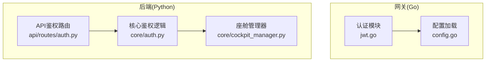
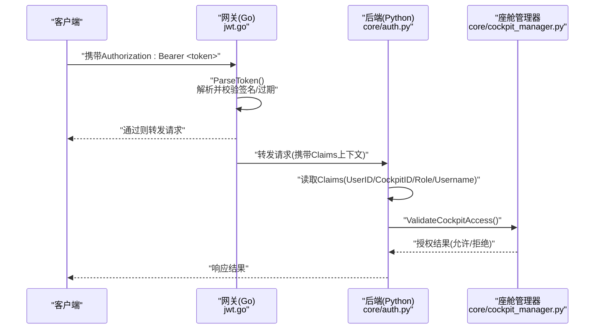
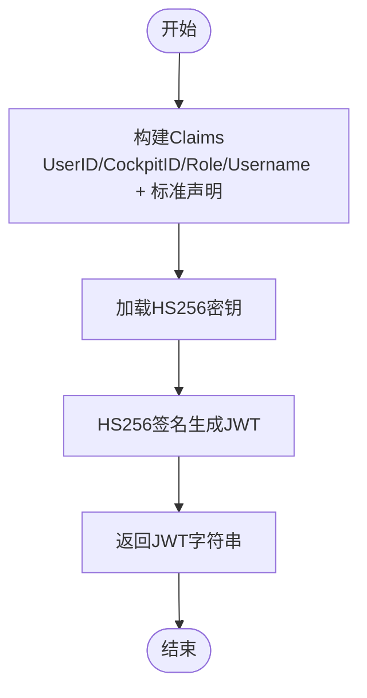
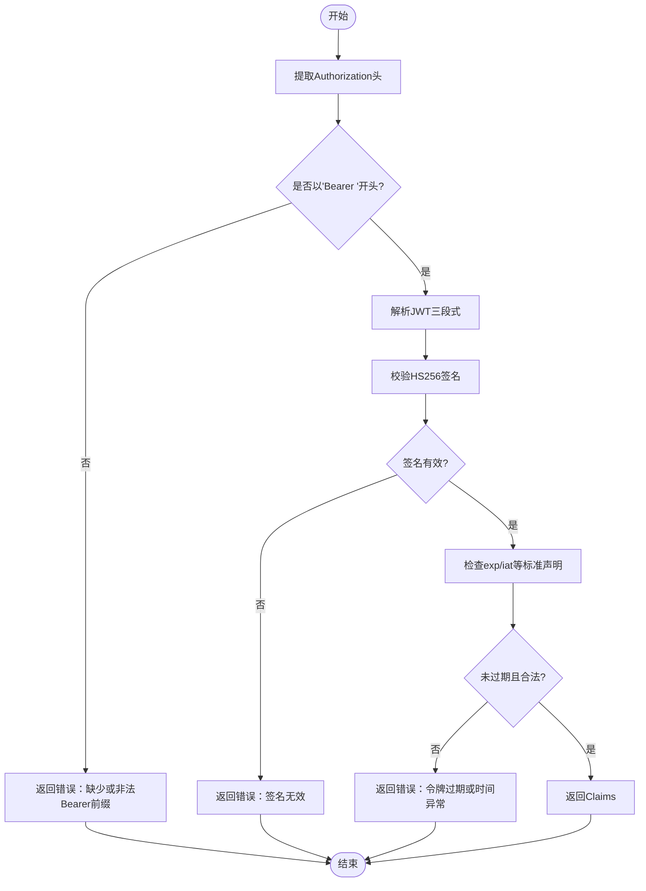
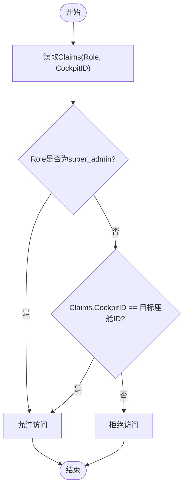
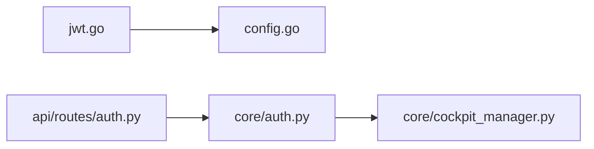

# JWT认证机制

<cite>
**本文引用的文件**   
- [jwt.go](file://backend_design/nexus_gate/internal/auth/jwt.go)
- [jwt_test.go](file://backend_design/nexus_gate/internal/auth/jwt_test.go)
- [auth.py](file://backend_design/nexus/api/routes/auth.py)
- [auth.py](file://backend_design/nexus/core/auth.py)
- [cockpit_manager.py](file://backend_design/nexus/core/cockpit_manager.py)
- [config.go](file://backend_design/nexus_gate/internal/config/config.go)
</cite>

## 目录
1. [简介](#简介)
2. [项目结构](#项目结构)
3. [核心组件](#核心组件)
4. [架构总览](#架构总览)
5. [详细组件分析](#详细组件分析)
6. [依赖关系分析](#依赖关系分析)
7. [性能考虑](#性能考虑)
8. [故障排查指南](#故障排查指南)
9. [结论](#结论)
10. [附录](#附录)

## 简介
本文件面向NexusCockpit项目的JWT认证机制，聚焦Go网关侧的令牌签发与解析、以及后端Python侧的座舱访问控制。文档涵盖：
- JWT载荷字段定义（UserID、CockpitID、Role、Username）与标准声明
- 令牌签发流程（GenerateToken、HS256签名、过期时间配置）
- 令牌验证流程（ParseToken、签名校验、Bearer前缀处理）
- 座舱访问控制（ValidateCockpitAccess，含super_admin特权与座舱绑定校验）
- 安全最佳实践（密钥管理、刷新策略、撤销机制）
- 错误处理方案与可观测性建议

## 项目结构
本项目在网关层使用Go实现JWT签发与解析，在后端服务使用Python进行业务鉴权与座舱访问控制。关键位置如下：
- Go网关认证模块：backend_design/nexus_gate/internal/auth
- Python API路由与核心鉴权：backend_design/nexus/api/routes/auth.py、backend_design/nexus/core/auth.py
- 座舱管理器（用于座舱权限校验）：backend_design/nexus/core/cockpit_manager.py
- 网关配置加载：backend_design/nexus_gate/internal/config/config.go

图表来源
- [jwt.go:1-200](file://backend_design/nexus_gate/internal/auth/jwt.go#L1-L200)
- [config.go:1-200](file://backend_design/nexus_gate/internal/config/config.go#L1-L200)
- [auth.py](file://backend_design/nexus/api/routes/auth.py)
- [auth.py](file://backend_design/nexus/core/auth.py)
- [cockpit_manager.py](file://backend_design/nexus/core/cockpit_manager.py)

章节来源
- [jwt.go:1-200](file://backend_design/nexus_gate/internal/auth/jwt.go#L1-L200)
- [config.go:1-200](file://backend_design/nexus_gate/internal/config/config.go#L1-L200)
- [auth.py](file://backend_design/nexus/api/routes/auth.py)
- [auth.py](file://backend_design/nexus/core/auth.py)
- [cockpit_manager.py](file://backend_design/nexus/core/cockpit_manager.py)

## 核心组件
- 令牌签发（GenerateToken）
  - 负责构造Claims（包含UserID、CockpitID、Role、Username及标准声明如exp、iat等），并使用HS256算法签名生成JWT字符串。
- 令牌解析（ParseToken）
  - 负责从请求头提取Bearer Token，解析并校验签名、过期时间，返回Claims或错误。
- 座舱访问控制（ValidateCockpitAccess）
  - 基于Claims中的角色与座舱ID进行授权判断，支持super_admin特权绕过与座舱绑定校验。

章节来源
- [jwt.go:1-200](file://backend_design/nexus_gate/internal/auth/jwt.go#L1-L200)
- [auth.py](file://backend_design/nexus/api/routes/auth.py)
- [auth.py](file://backend_design/nexus/core/auth.py)
- [cockpit_manager.py](file://backend_design/nexus/core/cockpit_manager.py)

## 架构总览
下图展示了从客户端发起请求到网关鉴权、再到后端座舱访问控制的完整流程。

图表来源
- [jwt.go:1-200](file://backend_design/nexus_gate/internal/auth/jwt.go#L1-L200)
- [auth.py](file://backend_design/nexus/core/auth.py)
- [cockpit_manager.py](file://backend_design/nexus/core/cockpit_manager.py)

## 详细组件分析

### JWT载荷结构与标准声明
- 自定义字段
  - UserID：用户唯一标识
  - CockpitID：座舱唯一标识
  - Role：角色（例如普通用户、管理员、super_admin）
  - Username：用户名
- 标准声明
  - exp：过期时间戳
  - iat：签发时间戳
  - iss：签发者（可选）
  - sub：主题（可选）
  - aud：受众（可选）

说明：
- Claims应仅包含必要的最小信息，避免敏感数据泄露。
- 所有时间字段采用UTC秒级时间戳。

章节来源
- [jwt.go:1-200](file://backend_design/nexus_gate/internal/auth/jwt.go#L1-L200)

### 令牌签发流程（GenerateToken）
- 输入参数
  - UserID、CockpitID、Role、Username
  - 过期时长（TTL）
  - HS256密钥（从配置加载）
- 处理步骤
  - 构建Claims对象，填充自定义字段与标准声明（exp、iat等）
  - 使用HS256算法对Header+Payload进行签名
  - 输出Base64URL编码的三段式JWT字符串
- 关键要点
  - 密钥长度与强度需满足HS256要求
  - TTL不宜过长，结合刷新策略降低风险
  - 记录必要的审计日志（不记录敏感内容）

图表来源
- [jwt.go:1-200](file://backend_design/nexus_gate/internal/auth/jwt.go#L1-L200)
- [config.go:1-200](file://backend_design/nexus_gate/internal/config/config.go#L1-L200)

章节来源
- [jwt.go:1-200](file://backend_design/nexus_gate/internal/auth/jwt.go#L1-L200)
- [config.go:1-200](file://backend_design/nexus_gate/internal/config/config.go#L1-L200)

### 令牌验证流程（ParseToken）
- 输入
  - Authorization请求头（期望格式：Bearer <token>）
- 处理步骤
  - 提取并校验Bearer前缀
  - 解析JWT三段式结构
  - 使用相同HS256密钥校验签名
  - 校验exp是否过期、iat是否合理
  - 返回Claims或错误码
- 错误处理
  - 缺少或非法Bearer前缀
  - 签名无效或篡改
  - 令牌过期或时间异常
  - 解析失败或格式错误

图表来源
- [jwt.go:1-200](file://backend_design/nexus_gate/internal/auth/jwt.go#L1-L200)

章节来源
- [jwt.go:1-200](file://backend_design/nexus_gate/internal/auth/jwt.go#L1-L200)

### 座舱访问控制（ValidateCockpitAccess）
- 输入
  - Claims（含Role、CockpitID）
  - 目标座舱ID（可能来自路径参数或请求体）
- 处理步骤
  - 若Role为super_admin，直接放行（特权绕过）
  - 否则校验Claims.CockpitID与目标座舱ID是否一致
  - 根据校验结果返回允许或拒绝
- 扩展点
  - 可接入外部权限系统或缓存（如Redis）做动态策略
  - 可结合租户隔离与多域场景扩展

图表来源
- [auth.py](file://backend_design/nexus/core/auth.py)
- [cockpit_manager.py](file://backend_design/nexus/core/cockpit_manager.py)

章节来源
- [auth.py](file://backend_design/nexus/core/auth.py)
- [cockpit_manager.py](file://backend_design/nexus/core/cockpit_manager.py)

### API鉴权路由（登录与令牌获取）
- 功能
  - 接收登录凭据，校验用户身份后调用GenerateToken签发JWT
  - 将JWT写入响应头或响应体，供前端保存并在后续请求中携带
- 注意事项
  - 登录接口需防重放与暴力破解（限流、验证码、账户锁定）
  - 返回的JWT不应包含敏感信息，避免日志泄露

章节来源
- [auth.py](file://backend_design/nexus/api/routes/auth.py)

## 依赖关系分析
- 网关层
  - jwt.go依赖config.go加载HS256密钥与过期时间等配置
- 后端层
  - core/auth.py依赖cockpit_manager.py进行座舱权限判定
  - api/routes/auth.py作为对外入口，协调登录与令牌签发

图表来源
- [jwt.go:1-200](file://backend_design/nexus_gate/internal/auth/jwt.go#L1-L200)
- [config.go:1-200](file://backend_design/nexus_gate/internal/config/config.go#L1-L200)
- [auth.py](file://backend_design/nexus/api/routes/auth.py)
- [auth.py](file://backend_design/nexus/core/auth.py)
- [cockpit_manager.py](file://backend_design/nexus/core/cockpit_manager.py)

章节来源
- [jwt.go:1-200](file://backend_design/nexus_gate/internal/auth/jwt.go#L1-L200)
- [config.go:1-200](file://backend_design/nexus_gate/internal/config/config.go#L1-L200)
- [auth.py](file://backend_design/nexus/api/routes/auth.py)
- [auth.py](file://backend_design/nexus/core/auth.py)
- [cockpit_manager.py](file://backend_design/nexus/core/cockpit_manager.py)

## 性能考虑
- 签名与验签开销
  - HS256计算轻量，但应避免在热点路径重复解析；可在网关层缓存已解析的Claims（短期）
- 令牌大小
  - Claims尽量精简，减少网络传输与序列化开销
- 并发与锁
  - 密钥加载与配置更新需线程安全；避免频繁I/O
- 监控与指标
  - 记录签发/验签成功率、失败原因分布、平均耗时

[本节为通用指导，无需代码来源]

## 故障排查指南
- 常见错误与定位
  - 缺少或非法Bearer前缀：检查客户端Authorization头格式
  - 签名无效：核对HS256密钥一致性、是否被轮换
  - 令牌过期：调整TTL或实现刷新机制
  - 解析失败：确认JWT格式正确、未损坏
- 日志与追踪
  - 记录请求ID、用户ID、座舱ID、错误码与简要原因
  - 避免记录敏感字段（如密码、完整令牌）
- 快速自检清单
  - 密钥是否与配置一致
  - 服务器时间是否同步（NTP）
  - 网关与后端版本兼容

章节来源
- [jwt.go:1-200](file://backend_design/nexus_gate/internal/auth/jwt.go#L1-L200)
- [jwt_test.go:1-200](file://backend_design/nexus_gate/internal/auth/jwt_test.go#L1-L200)

## 结论
本JWT认证机制在网关层完成高效的签发与校验，在后端层实现细粒度的座舱访问控制。通过最小化Claims、严格的签名与过期校验、以及超管特权与座舱绑定的双重保障，系统在安全性与可用性之间取得平衡。建议在生产环境引入密钥轮换、令牌刷新与黑名单撤销机制，并完善监控与告警。

[本节为总结，无需代码来源]

## 附录

### 安全最佳实践
- 密钥管理
  - 使用强随机密钥，定期轮换；密钥存储于安全配置中心或KMS
  - 禁止将密钥硬编码或提交至版本库
- 令牌刷新策略
  - 短TTL访问令牌 + 长时效刷新令牌；刷新时校验原令牌有效性
  - 刷新接口需严格限流与风控
- 撤销机制
  - 维护令牌黑名单（Redis/内存表），支持按用户或会话粒度撤销
  - 登出或异常检测时主动加入黑名单
- 传输与存储
  - 全链路HTTPS；前端安全存储（HttpOnly Cookie或安全存储）
  - 避免在URL、日志中暴露令牌
- 审计与合规
  - 记录关键操作审计日志，保留必要证据
  - 遵循最小权限原则与数据保护法规

[本节为通用指导，无需代码来源]