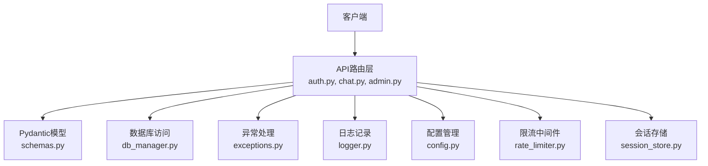
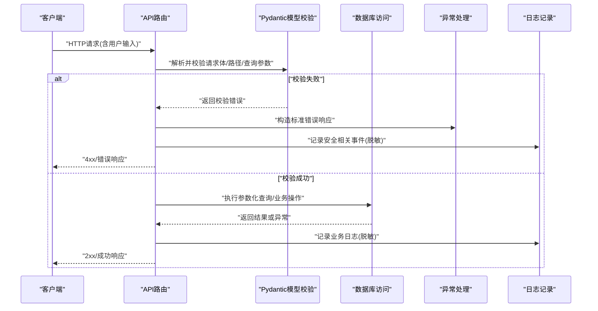
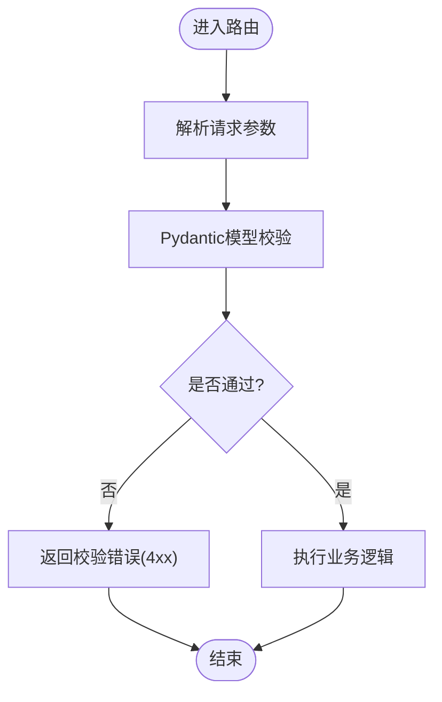
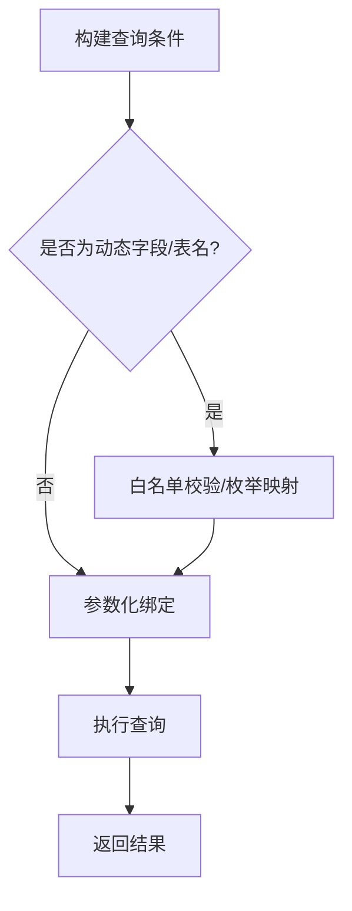
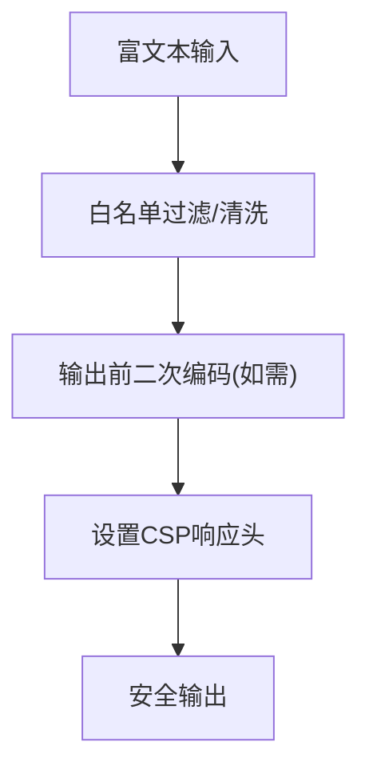
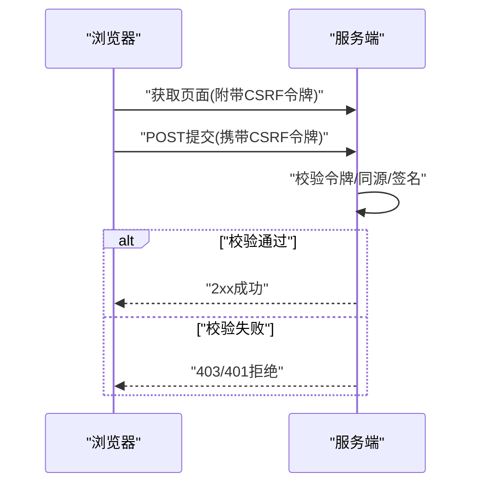
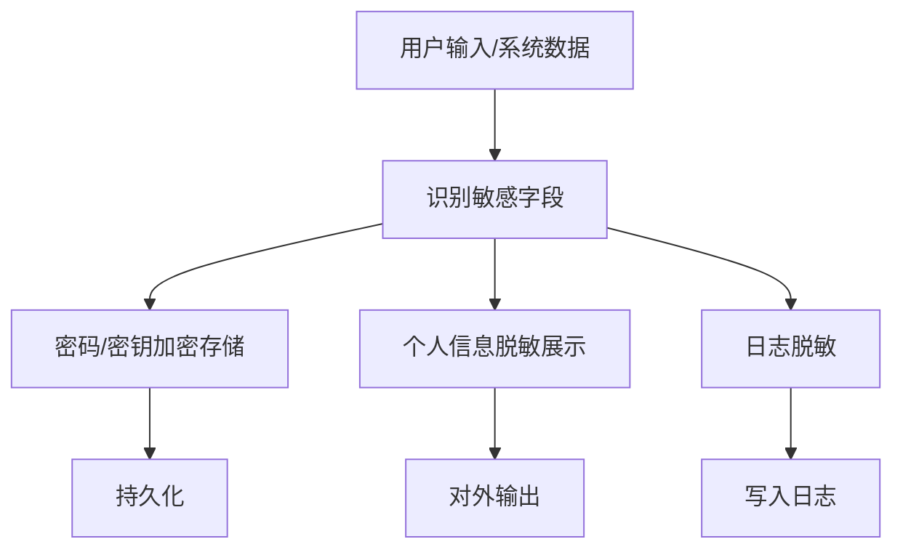
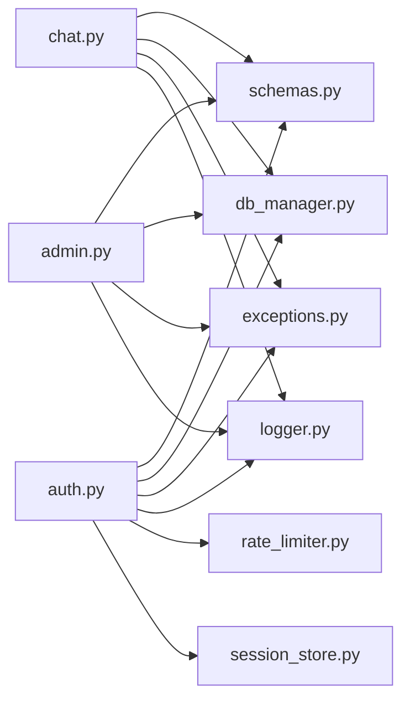

# 输入验证与防护

<cite>
**本文引用的文件**   
- [backend_design/nexus/models/schemas.py](file://backend_design/nexus/models/schemas.py)
- [backend_design/nexus/core/db_manager.py](file://backend_design/nexus/core/db_manager.py)
- [backend_design/nexus/api/routes/auth.py](file://backend_design/nexus/api/routes/auth.py)
- [backend_design/nexus/api/routes/chat.py](file://backend_design/nexus/api/routes/chat.py)
- [backend_design/nexus/api/routes/admin.py](file://backend_design/nexus/api/routes/admin.py)
- [backend_design/nexus/middleware/rate_limiter.py](file://backend_design/nexus/middleware/rate_limiter.py)
- [backend_design/nexus/middleware/session_store.py](file://backend_design/nexus/middleware/session_store.py)
- [backend_design/nexus/core/exceptions.py](file://backend_design/nexus/core/exceptions.py)
- [backend_design/nexus/core/logger.py](file://backend_design/nexus/core/logger.py)
- [backend_design/nexus/config.py](file://backend_design/nexus/config.py)
- [backend_design/nexus/main.py](file://backend_design/nexus/main.py)
</cite>

## 目录
1. [简介](#简介)
2. [项目结构](#项目结构)
3. [核心组件](#核心组件)
4. [架构总览](#架构总览)
5. [详细组件分析](#详细组件分析)
6. [依赖关系分析](#依赖关系分析)
7. [性能考虑](#性能考虑)
8. [故障排查指南](#故障排查指南)
9. [结论](#结论)
10. [附录](#附录)

## 简介
本指南聚焦于输入验证与安全防护，围绕以下主题展开：
- Pydantic模型验证：数据格式校验、类型检查、自定义验证器
- SQL注入防护：参数化查询、ORM使用规范、原生SQL安全注意事项
- XSS攻击防护：输出编码、内容安全策略(CSP)、富文本过滤
- CSRF防护机制：令牌验证、同源策略、跨域请求处理
- 敏感数据处理：密码加密、个人信息脱敏、日志安全
- 常见攻击向量防护与输入清理最佳实践

## 项目结构
本项目后端采用分层设计，输入验证与安全控制主要分布在以下位置：
- API路由层：负责接收请求、解析入参、调用业务逻辑并返回响应
- 模型层：定义Pydantic模型，统一进行数据校验与转换
- 核心服务层：数据库访问、认证授权、异常与日志等横切关注点
- 中间件层：限流、会话存储等通用能力

图表来源
- [backend_design/nexus/api/routes/auth.py](file://backend_design/nexus/api/routes/auth.py)
- [backend_design/nexus/api/routes/chat.py](file://backend_design/nexus/api/routes/chat.py)
- [backend_design/nexus/api/routes/admin.py](file://backend_design/nexus/api/routes/admin.py)
- [backend_design/nexus/models/schemas.py](file://backend_design/nexus/models/schemas.py)
- [backend_design/nexus/core/db_manager.py](file://backend_design/nexus/core/db_manager.py)
- [backend_design/nexus/core/exceptions.py](file://backend_design/nexus/core/exceptions.py)
- [backend_design/nexus/core/logger.py](file://backend_design/nexus/core/logger.py)
- [backend_design/nexus/config.py](file://backend_design/nexus/config.py)
- [backend_design/nexus/middleware/rate_limiter.py](file://backend_design/nexus/middleware/rate_limiter.py)
- [backend_design/nexus/middleware/session_store.py](file://backend_design/nexus/middleware/session_store.py)

章节来源
- [backend_design/nexus/main.py](file://backend_design/nexus/main.py)
- [backend_design/nexus/config.py](file://backend_design/nexus/config.py)

## 核心组件
- Pydantic模型与校验：通过统一的Schema定义，集中完成字段类型、长度、正则、枚举等校验，并提供自定义验证器扩展复杂规则。
- 数据库访问：封装参数化查询与事务边界，避免字符串拼接导致的SQL注入风险。
- 认证与鉴权：在路由层前置校验身份与权限，结合会话与令牌机制保障访问安全。
- 限流与会话：对高频接口实施速率限制，会话存储确保状态一致性。
- 异常与日志：标准化错误码与消息，避免泄露内部细节；日志脱敏防止敏感信息外泄。

章节来源
- [backend_design/nexus/models/schemas.py](file://backend_design/nexus/models/schemas.py)
- [backend_design/nexus/core/db_manager.py](file://backend_design/nexus/core/db_manager.py)
- [backend_design/nexus/api/routes/auth.py](file://backend_design/nexus/api/routes/auth.py)
- [backend_design/nexus/middleware/rate_limiter.py](file://backend_design/nexus/middleware/rate_limiter.py)
- [backend_design/nexus/middleware/session_store.py](file://backend_design/nexus/middleware/session_store.py)
- [backend_design/nexus/core/exceptions.py](file://backend_design/nexus/core/exceptions.py)
- [backend_design/nexus/core/logger.py](file://backend_design/nexus/core/logger.py)

## 架构总览
下图展示了从请求进入路由到返回响应的关键路径，以及输入验证与安全防护的落点。

图表来源
- [backend_design/nexus/api/routes/auth.py](file://backend_design/nexus/api/routes/auth.py)
- [backend_design/nexus/api/routes/chat.py](file://backend_design/nexus/api/routes/chat.py)
- [backend_design/nexus/api/routes/admin.py](file://backend_design/nexus/api/routes/admin.py)
- [backend_design/nexus/models/schemas.py](file://backend_design/nexus/models/schemas.py)
- [backend_design/nexus/core/db_manager.py](file://backend_design/nexus/core/db_manager.py)
- [backend_design/nexus/core/exceptions.py](file://backend_design/nexus/core/exceptions.py)
- [backend_design/nexus/core/logger.py](file://backend_design/nexus/core/logger.py)

## 详细组件分析

### Pydantic模型验证（数据格式校验、类型检查、自定义验证器）
- 职责与范围
  - 统一入口：所有外部输入在进入业务逻辑前必须通过Pydantic模型校验。
  - 类型与格式：强制字段类型、必填项、默认值、正则表达式、数值范围、枚举约束等。
  - 自定义验证器：针对业务规则实现复杂校验（如密码强度、手机号格式、邮箱白名单等）。
- 建议实践
  - 将每个接口的入参与出参分别建模，避免复用导致误用。
  - 对富文本输入增加长度上限与字符集白名单。
  - 对时间戳、ID、URL等字段使用专用类型或正则约束。
  - 在模型层抛出明确的校验错误，便于上层统一处理。

图表来源
- [backend_design/nexus/models/schemas.py](file://backend_design/nexus/models/schemas.py)
- [backend_design/nexus/api/routes/auth.py](file://backend_design/nexus/api/routes/auth.py)
- [backend_design/nexus/api/routes/chat.py](file://backend_design/nexus/api/routes/chat.py)
- [backend_design/nexus/api/routes/admin.py](file://backend_design/nexus/api/routes/admin.py)

章节来源
- [backend_design/nexus/models/schemas.py](file://backend_design/nexus/models/schemas.py)
- [backend_design/nexus/api/routes/auth.py](file://backend_design/nexus/api/routes/auth.py)
- [backend_design/nexus/api/routes/chat.py](file://backend_design/nexus/api/routes/chat.py)
- [backend_design/nexus/api/routes/admin.py](file://backend_design/nexus/api/routes/admin.py)

### SQL注入防护（参数化查询、ORM使用规范、原生SQL安全注意事项）
- 原则
  - 禁止字符串拼接SQL；一律使用参数化查询或ORM提供的安全方法。
  - 严格限定可接受的排序字段、表名、列名等元数据为白名单枚举。
  - 最小权限原则：数据库账号仅授予必要权限。
- 落地要点
  - 在数据库访问层统一封装参数化方法，对外暴露安全的查询接口。
  - 对动态条件进行严格校验与类型转换。
  - 对原生SQL进行审计与审批，必要时引入SQL模板引擎与静态扫描。

图表来源
- [backend_design/nexus/core/db_manager.py](file://backend_design/nexus/core/db_manager.py)

章节来源
- [backend_design/nexus/core/db_manager.py](file://backend_design/nexus/core/db_manager.py)

### XSS攻击防护（输出编码、内容安全策略CSP、富文本过滤）
- 输出编码
  - 前端渲染时对所有用户可控内容进行HTML实体编码或框架级自动转义。
  - 后端返回JSON时避免直接嵌入未转义的HTML片段。
- 内容安全策略(CSP)
  - 通过响应头限制脚本来源、内联脚本、不安全源等，降低XSS影响面。
- 富文本过滤
  - 对富文本输入使用白名单标签与属性过滤，移除危险协议与事件处理器。
  - 对图片、链接等外部资源进行域名白名单校验。

[本节为概念性说明，不直接分析具体文件，故无“章节来源”]

### CSRF防护机制（令牌验证、同源策略、跨域请求处理）
- 令牌验证
  - 表单提交类接口需携带一次性CSRF令牌，服务端校验令牌有效性及过期时间。
- 同源策略
  - 严格校验Referer/Origin，拒绝非预期来源的请求。
- 跨域处理
  - 谨慎配置CORS，仅允许可信域名与方法；对敏感接口禁用凭据共享或加强校验。

[本节为概念性说明，不直接分析具体文件，故无“章节来源”]

### 敏感数据处理（密码加密、个人信息脱敏、日志安全）
- 密码加密
  - 使用强哈希算法加盐存储，禁止明文保存；登录时仅比对哈希。
- 个人信息脱敏
  - 展示与导出时对姓名、电话、身份证等字段进行掩码处理。
- 日志安全
  - 禁止记录敏感字段；对必要的调试信息做脱敏后再写入日志。

章节来源
- [backend_design/nexus/core/logger.py](file://backend_design/nexus/core/logger.py)
- [backend_design/nexus/api/routes/auth.py](file://backend_design/nexus/api/routes/auth.py)

### 常见攻击向量防护与输入清理最佳实践
- 输入清理
  - 基于白名单的正则与类型约束；去除首尾空白；限制长度与字节数。
- 命令注入防护
  - 禁止将用户输入拼接到系统命令；若不可避免，使用受限沙箱与严格白名单。
- 路径遍历防护
  - 对文件路径进行规范化与根目录校验，拒绝包含“..”的路径。
- 反序列化安全
  - 避免反序列化不可信数据；如必须，使用安全格式与白名单类型。
- 速率限制与防重放
  - 对登录、注册、重置密码等敏感接口实施限流与验证码；对幂等接口支持防重放令牌。

章节来源
- [backend_design/nexus/middleware/rate_limiter.py](file://backend_design/nexus/middleware/rate_limiter.py)
- [backend_design/nexus/api/routes/auth.py](file://backend_design/nexus/api/routes/auth.py)

## 依赖关系分析
- 耦合与内聚
  - 路由层依赖模型层进行输入校验，依赖数据库访问层进行数据操作，依赖异常与日志模块进行错误与审计。
  - 中间件提供横向能力（限流、会话），被路由层按需组合。
- 外部依赖
  - 数据库驱动、缓存/会话存储、第三方认证服务等。

图表来源
- [backend_design/nexus/api/routes/auth.py](file://backend_design/nexus/api/routes/auth.py)
- [backend_design/nexus/api/routes/chat.py](file://backend_design/nexus/api/routes/chat.py)
- [backend_design/nexus/api/routes/admin.py](file://backend_design/nexus/api/routes/admin.py)
- [backend_design/nexus/models/schemas.py](file://backend_design/nexus/models/schemas.py)
- [backend_design/nexus/core/db_manager.py](file://backend_design/nexus/core/db_manager.py)
- [backend_design/nexus/core/exceptions.py](file://backend_design/nexus/core/exceptions.py)
- [backend_design/nexus/core/logger.py](file://backend_design/nexus/core/logger.py)
- [backend_design/nexus/middleware/rate_limiter.py](file://backend_design/nexus/middleware/rate_limiter.py)
- [backend_design/nexus/middleware/session_store.py](file://backend_design/nexus/middleware/session_store.py)

章节来源
- [backend_design/nexus/main.py](file://backend_design/nexus/main.py)

## 性能考虑
- 校验成本
  - 合理拆分模型，避免在大型对象上重复校验；对热路径使用轻量校验。
- 数据库访问
  - 合理使用索引与分页；避免N+1查询；批量操作减少往返。
- 限流与缓存
  - 对热点接口启用缓存与限流，降低恶意流量冲击。
- 日志开销
  - 异步写入与采样策略，避免阻塞主流程。

[本节为通用指导，不直接分析具体文件，故无“章节来源”]

## 故障排查指南
- 常见问题定位
  - 校验失败：查看模型字段约束与错误信息，确认入参是否符合Schema。
  - 权限问题：检查认证与鉴权流程，确认令牌与会话有效。
  - 数据库异常：核对参数化绑定与白名单映射，确认权限与连接池状态。
  - 日志缺失：检查日志级别与脱敏规则，确认写入通道可用。
- 快速恢复
  - 临时放宽限流阈值以恢复服务；回滚可疑变更；隔离问题接口。

章节来源
- [backend_design/nexus/core/exceptions.py](file://backend_design/nexus/core/exceptions.py)
- [backend_design/nexus/core/logger.py](file://backend_design/nexus/core/logger.py)
- [backend_design/nexus/middleware/rate_limiter.py](file://backend_design/nexus/middleware/rate_limiter.py)

## 结论
通过统一的Pydantic模型校验、严格的数据库访问规范、完善的XSS/CSRF防护策略、以及对敏感数据的加密与脱敏，可以显著降低输入侧的安全风险。配合限流、会话管理与标准化的异常与日志体系，能够形成纵深防御，提升系统的整体安全性与可观测性。

## 附录
- 建议清单
  - 所有外部输入必须经过模型校验
  - 禁止字符串拼接SQL
  - 输出前进行编码与CSP保护
  - 敏感字段脱敏与加密存储
  - 对敏感接口实施限流与验证码
  - 定期安全扫描与渗透测试

[本节为总结性内容，不直接分析具体文件，故无“章节来源”]