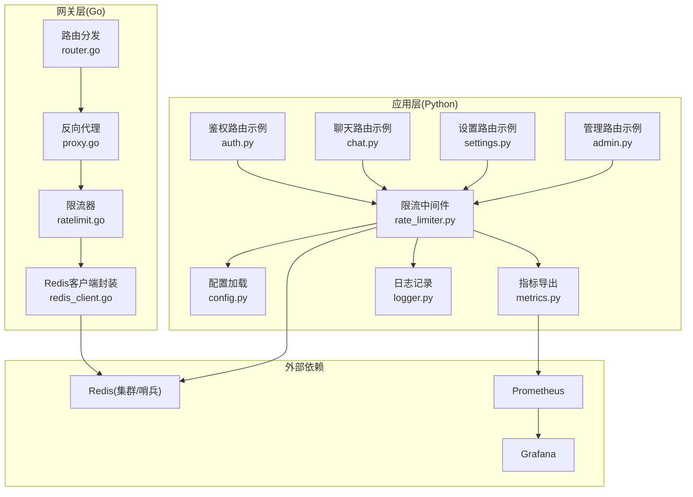
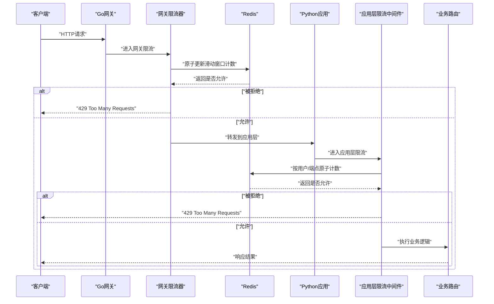
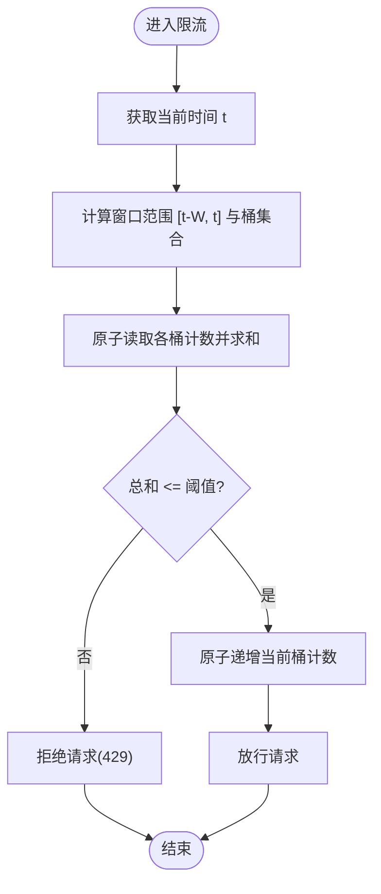
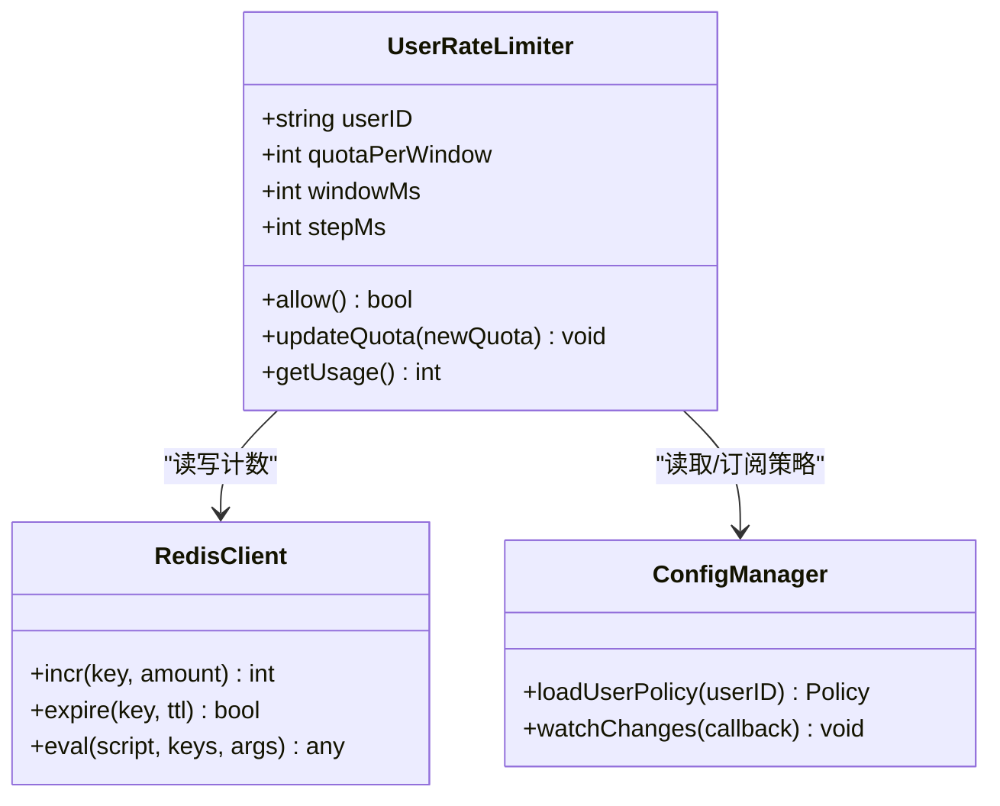
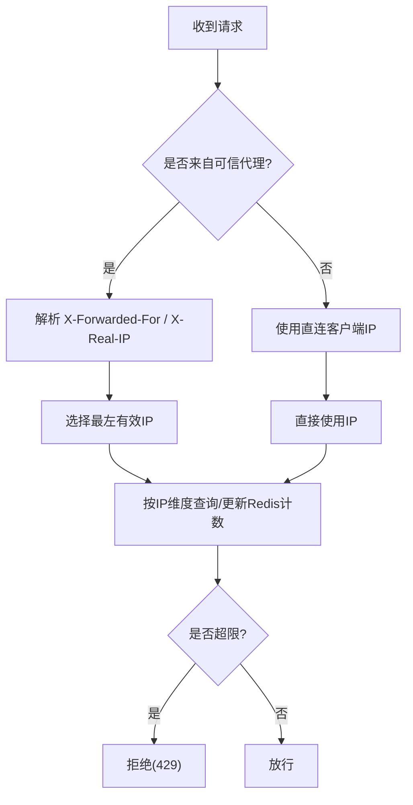
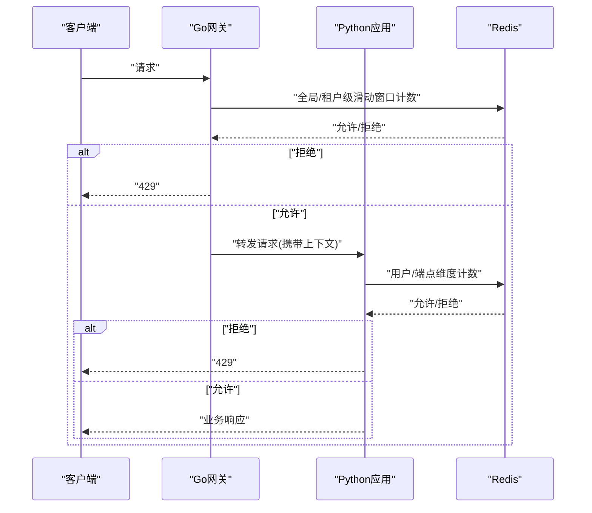
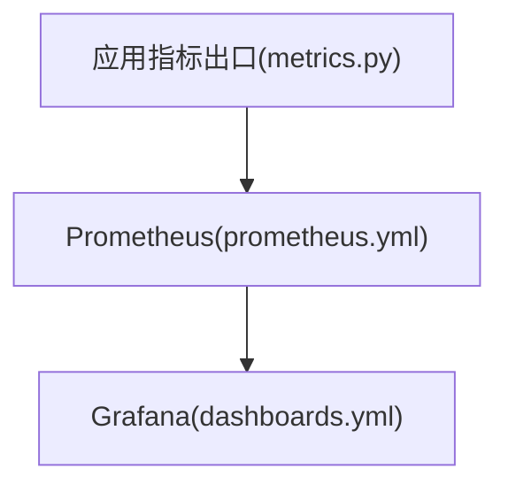
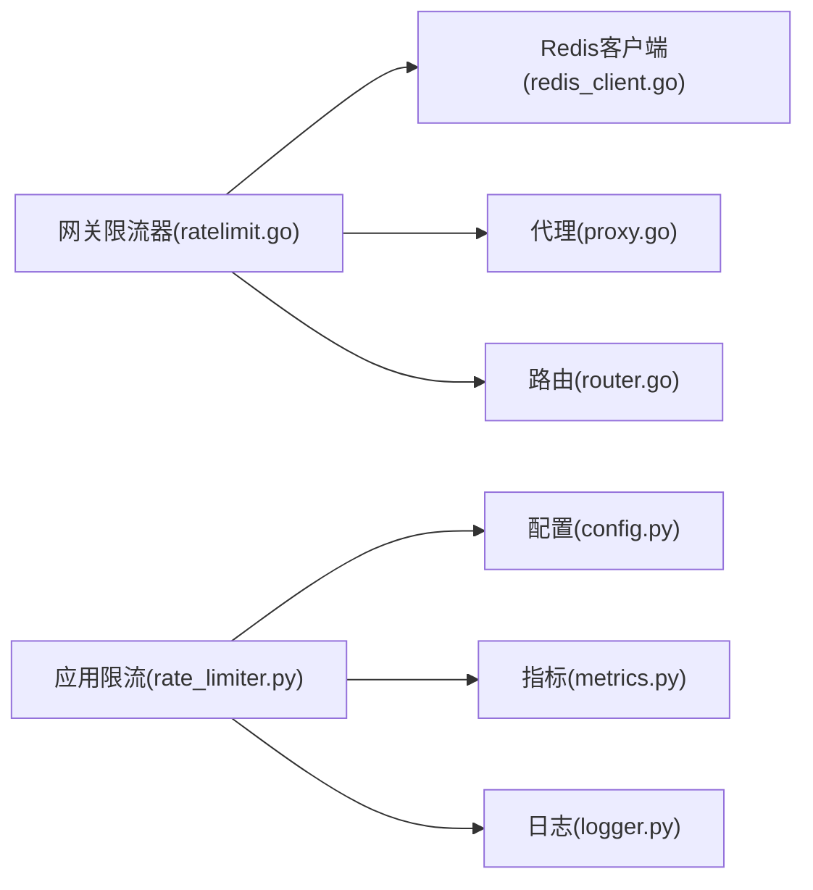

# 速率限制策略

<cite>
**本文引用的文件**   
- [backend_design/nexus/middleware/rate_limiter.py](file://backend_design/nexus/middleware/rate_limiter.py)
- [backend_design/nexus_gate/internal/ratelimit/ratelimit.go](file://backend_design/nexus_gate/internal/ratelimit/ratelimit.go)
- [backend_design/nexus_gate/internal/handlers/redis_client.go](file://backend_design/nexus_gate/internal/handlers/redis_client.go)
- [backend_design/nexus/config.py](file://backend_design/nexus/config.py)
- [backend_design/nexus/core/logger.py](file://backend_design/nexus/core/logger.py)
- [backend_design/nexus/observability/metrics.py](file://backend_design/nexus/observability/metrics.py)
- [backend_design/nexus/api/routes/auth.py](file://backend_design/nexus/api/routes/auth.py)
- [backend_design/nexus/api/routes/chat.py](file://backend_design/nexus/api/routes/chat.py)
- [backend_design/nexus/api/routes/settings.py](file://backend_design/nexus/api/routes/settings.py)
- [backend_design/nexus/api/routes/admin.py](file://backend_design/nexus/api/routes/admin.py)
- [backend_design/nexus_gate/internal/proxy/proxy.go](file://backend_design/nexus_gate/internal/proxy/proxy.go)
- [backend_design/nexus_gate/internal/router/router.go](file://backend_design/nexus_gate/internal/router/router.go)
- [config/prometheus/prometheus.yml](file://config/prometheus/prometheus.yml)
- [config/grafana/provisioning/dashboards/dashboards.yml](file://config/grafana/provisioning/dashboards/dashboards.yml)
</cite>

## 目录
1. [简介](#简介)
2. [项目结构](#项目结构)
3. [核心组件](#核心组件)
4. [架构总览](#架构总览)
5. [详细组件分析](#详细组件分析)
6. [依赖分析](#依赖分析)
7. [性能考虑](#性能考虑)
8. [故障排查指南](#故障排查指南)
9. [结论](#结论)
10. [附录](#附录)

## 简介
本文件面向“速率限制策略”的完整实现与使用，覆盖以下目标：
- Redis 滑动窗口算法实现细节：计数器存储、窗口计算、原子操作保证。
- 用户级别限流：基于用户ID的规则、配额管理与动态调整。
- IP 级别限流：客户端IP识别、代理支持、分布式一致性。
- 限流中间件架构：Go 网关层限流与 Python 应用层限流的协作机制。
- 限流配置选项：不同API端点的限流策略、突发流量处理、降级策略。
- 监控指标与告警配置：Prometheus/Grafana 集成建议。

## 项目结构
本项目在 Go 网关层与 Python 应用层均实现了限流能力，并通过 Redis 作为分布式共享状态存储，确保多实例一致性与高吞吐。

图表来源
- [backend_design/nexus_gate/internal/router/router.go](file://backend_design/nexus_gate/internal/router/router.go)
- [backend_design/nexus_gate/internal/proxy/proxy.go](file://backend_design/nexus_gate/internal/proxy/proxy.go)
- [backend_design/nexus_gate/internal/ratelimit/ratelimit.go](file://backend_design/nexus_gate/internal/ratelimit/ratelimit.go)
- [backend_design/nexus_gate/internal/handlers/redis_client.go](file://backend_design/nexus_gate/internal/handlers/redis_client.go)
- [backend_design/nexus/middleware/rate_limiter.py](file://backend_design/nexus/middleware/rate_limiter.py)
- [backend_design/nexus/config.py](file://backend_design/nexus/config.py)
- [backend_design/nexus/observability/metrics.py](file://backend_design/nexus/observability/metrics.py)
- [backend_design/nexus/core/logger.py](file://backend_design/nexus/core/logger.py)
- [backend_design/nexus/api/routes/auth.py](file://backend_design/nexus/api/routes/auth.py)
- [backend_design/nexus/api/routes/chat.py](file://backend_design/nexus/api/routes/chat.py)
- [backend_design/nexus/api/routes/settings.py](file://backend_design/nexus/api/routes/settings.py)
- [backend_design/nexus/api/routes/admin.py](file://backend_design/nexus/api/routes/admin.py)

章节来源
- [backend_design/nexus_gate/internal/router/router.go](file://backend_design/nexus_gate/internal/router/router.go)
- [backend_design/nexus_gate/internal/proxy/proxy.go](file://backend_design/nexus_gate/internal/proxy/proxy.go)
- [backend_design/nexus_gate/internal/ratelimit/ratelimit.go](file://backend_design/nexus_gate/internal/ratelimit/ratelimit.go)
- [backend_design/nexus_gate/internal/handlers/redis_client.go](file://backend_design/nexus_gate/internal/handlers/redis_client.go)
- [backend_design/nexus/middleware/rate_limiter.py](file://backend_design/nexus/middleware/rate_limiter.py)
- [backend_design/nexus/config.py](file://backend_design/nexus/config.py)
- [backend_design/nexus/observability/metrics.py](file://backend_design/nexus/observability/metrics.py)
- [backend_design/nexus/core/logger.py](file://backend_design/nexus/core/logger.py)
- [backend_design/nexus/api/routes/auth.py](file://backend_design/nexus/api/routes/auth.py)
- [backend_design/nexus/api/routes/chat.py](file://backend_design/nexus/api/routes/chat.py)
- [backend_design/nexus/api/routes/settings.py](file://backend_design/nexus/api/routes/settings.py)
- [backend_design/nexus/api/routes/admin.py](file://backend_design/nexus/api/routes/admin.py)

## 核心组件
- Go 网关层限流器：负责请求入口的快速拦截与全局/租户级配额控制，通过 Lua 脚本或原子命令在 Redis 中执行滑动窗口计数，避免竞争条件。
- Python 应用层限流中间件：在业务路由前进行细粒度用户维度限流，支持按 API 端点、用户等级、动态配额等规则组合。
- Redis 客户端封装：统一连接池、超时、重试与错误分类，屏蔽底层差异。
- 配置中心：集中管理限流策略、阈值、白名单、黑白名单、代理头映射等。
- 可观测性：指标采集（QPS、拒绝率、延迟分位）、日志与链路追踪。

章节来源
- [backend_design/nexus_gate/internal/ratelimit/ratelimit.go](file://backend_design/nexus_gate/internal/ratelimit/ratelimit.go)
- [backend_design/nexus_gate/internal/handlers/redis_client.go](file://backend_design/nexus_gate/internal/handlers/redis_client.go)
- [backend_design/nexus/middleware/rate_limiter.py](file://backend_design/nexus/middleware/rate_limiter.py)
- [backend_design/nexus/config.py](file://backend_design/nexus/config.py)
- [backend_design/nexus/observability/metrics.py](file://backend_design/nexus/observability/metrics.py)

## 架构总览
整体采用“双层限流 + 共享状态”的架构：
- 第一层（网关层）：粗粒度、低开销，保护后端免受突发洪峰冲击。
- 第二层（应用层）：细粒度、业务感知，结合用户身份、租户、端点策略进行精准控制。
- 共享状态：Redis 提供跨实例一致的计数与窗口状态。

图表来源
- [backend_design/nexus_gate/internal/ratelimit/ratelimit.go](file://backend_design/nexus_gate/internal/ratelimit/ratelimit.go)
- [backend_design/nexus_gate/internal/handlers/redis_client.go](file://backend_design/nexus_gate/internal/handlers/redis_client.go)
- [backend_design/nexus/middleware/rate_limiter.py](file://backend_design/nexus/middleware/rate_limiter.py)
- [backend_design/nexus/api/routes/auth.py](file://backend_design/nexus/api/routes/auth.py)
- [backend_design/nexus/api/routes/chat.py](file://backend_design/nexus/api/routes/chat.py)

## 详细组件分析

### Redis 滑动窗口算法实现
- 计数器存储
  - 键空间设计：以“维度+时间片”为键，如 user_id、ip、api_path 等维度，结合毫秒级时间戳切片，形成滑动窗口内的多个桶。
  - 值类型：整型计数器，表示该时间片内已发生的请求数。
- 窗口计算
  - 滑动窗口长度 W（毫秒），步长 S（毫秒）。每次请求计算当前时间所属窗口及历史窗口集合，累加计数得到窗口内总量。
  - 若总量超过阈值 Q，则拒绝；否则允许并写入当前时间片计数。
- 原子操作保证
  - 使用 Redis 事务或 Lua 脚本将“读取历史窗口计数 + 判断 + 写入当前窗口计数”合并为一次原子执行，避免并发竞态。
  - 对过期键采用惰性删除与定期清理相结合的策略，降低内存占用。
- 复杂度与扩展性
  - 单次请求 O(K)，K 为窗口内桶数量（W/S）。可通过增大步长减少 K，但会牺牲精度。
  - 支持水平扩展：Redis 集群分片，键空间按维度哈希分布。

图表来源
- [backend_design/nexus_gate/internal/ratelimit/ratelimit.go](file://backend_design/nexus_gate/internal/ratelimit/ratelimit.go)
- [backend_design/nexus_gate/internal/handlers/redis_client.go](file://backend_design/nexus_gate/internal/handlers/redis_client.go)
- [backend_design/nexus/middleware/rate_limiter.py](file://backend_design/nexus/middleware/rate_limiter.py)

章节来源
- [backend_design/nexus_gate/internal/ratelimit/ratelimit.go](file://backend_design/nexus_gate/internal/ratelimit/ratelimit.go)
- [backend_design/nexus_gate/internal/handlers/redis_client.go](file://backend_design/nexus_gate/internal/handlers/redis_client.go)
- [backend_design/nexus/middleware/rate_limiter.py](file://backend_design/nexus/middleware/rate_limiter.py)

### 用户级别限流
- 基于用户ID的限流规则
  - 维度：user_id（或 token 解析后的主体标识）。
  - 策略：按用户维度独立配额，支持按角色/等级差异化阈值。
- 配额管理
  - 静态配额：配置文件定义默认配额与端点配额。
  - 动态配额：通过管理接口或配置中心实时调整用户配额，无需重启服务。
- 动态调整
  - 支持热更新：监听配置变更事件，刷新内存中的策略表。
  - 灰度与回滚：对新策略进行小流量验证，异常时快速回滚。

图表来源
- [backend_design/nexus/middleware/rate_limiter.py](file://backend_design/nexus/middleware/rate_limiter.py)
- [backend_design/nexus/config.py](file://backend_design/nexus/config.py)
- [backend_design/nexus_gate/internal/handlers/redis_client.go](file://backend_design/nexus_gate/internal/handlers/redis_client.go)

章节来源
- [backend_design/nexus/middleware/rate_limiter.py](file://backend_design/nexus/middleware/rate_limiter.py)
- [backend_design/nexus/config.py](file://backend_design/nexus/config.py)

### IP 级别限流
- 客户端IP识别
  - 优先从可信代理头（如 X-Forwarded-For、X-Real-IP）提取真实客户端IP。
  - 若未配置可信代理或头部缺失，回退到直连地址。
- 代理支持
  - 维护可信代理列表，仅信任来自这些代理的头部，防止伪造。
  - 支持多级代理场景下的最左有效IP选择。
- 分布式限流一致性
  - 所有节点共用同一 Redis 命名空间，确保跨实例一致。
  - 使用原子操作保证计数正确性。

图表来源
- [backend_design/nexus_gate/internal/ratelimit/ratelimit.go](file://backend_design/nexus_gate/internal/ratelimit/ratelimit.go)
- [backend_design/nexus/middleware/rate_limiter.py](file://backend_design/nexus/middleware/rate_limiter.py)

章节来源
- [backend_design/nexus_gate/internal/ratelimit/ratelimit.go](file://backend_design/nexus_gate/internal/ratelimit/ratelimit.go)
- [backend_design/nexus/middleware/rate_limiter.py](file://backend_design/nexus/middleware/rate_limiter.py)

### 限流中间件架构（Go 网关层与 Python 应用层协作）
- 职责划分
  - Go 网关层：快速拦截、全局/租户级配额、防抖与熔断前置检查。
  - Python 应用层：用户维度、端点维度、业务语义感知的精细化限流。
- 协作机制
  - 网关层通过后，携带必要上下文（如用户ID、租户ID、端点信息）转发至应用层。
  - 应用层根据上下文选择对应策略，必要时与网关层共享 Redis 键空间，避免重复计数。
- 错误与降级
  - 当 Redis 不可用时，网关层与应用层均可配置降级策略（如放宽限制、本地缓存近似计数、直接放行并事后审计）。

图表来源
- [backend_design/nexus_gate/internal/ratelimit/ratelimit.go](file://backend_design/nexus_gate/internal/ratelimit/ratelimit.go)
- [backend_design/nexus_gate/internal/proxy/proxy.go](file://backend_design/nexus_gate/internal/proxy/proxy.go)
- [backend_design/nexus/middleware/rate_limiter.py](file://backend_design/nexus/middleware/rate_limiter.py)

章节来源
- [backend_design/nexus_gate/internal/ratelimit/ratelimit.go](file://backend_design/nexus_gate/internal/ratelimit/ratelimit.go)
- [backend_design/nexus_gate/internal/proxy/proxy.go](file://backend_design/nexus_gate/internal/proxy/proxy.go)
- [backend_design/nexus/middleware/rate_limiter.py](file://backend_design/nexus/middleware/rate_limiter.py)

### 限流配置选项
- 全局与端点策略
  - 全局默认配额、步长、窗口大小。
  - 按端点（如 /auth、/chat、/settings、/admin）覆盖策略。
- 用户与IP维度
  - 用户等级对应的配额倍数。
  - IP 维度的独立阈值与白名单。
- 突发流量处理
  - 令牌桶/漏桶平滑突发（可选）。
  - 瞬时突发容忍窗口与惩罚系数。
- 降级策略
  - Redis 不可用时的行为：放宽限制、本地近似计数、直接放行并记录审计日志。
- 动态调整
  - 支持热更新策略，无需重启服务。

章节来源
- [backend_design/nexus/config.py](file://backend_design/nexus/config.py)
- [backend_design/nexus/middleware/rate_limiter.py](file://backend_design/nexus/middleware/rate_limiter.py)
- [backend_design/nexus_gate/internal/ratelimit/ratelimit.go](file://backend_design/nexus_gate/internal/ratelimit/ratelimit.go)

### 监控指标与告警配置
- 指标采集
  - 限流相关指标：请求总数、允许数、拒绝数、拒绝率、P95/P99 延迟、Redis 调用耗时。
  - 维度标签：用户ID、IP、端点、租户、策略版本。
- 导出与可视化
  - Prometheus 抓取应用暴露的指标端点。
  - Grafana 仪表盘展示关键视图与趋势。
- 告警规则
  - 拒绝率突增告警。
  - Redis 延迟或错误率告警。
  - 特定端点或用户异常限流告警。

图表来源
- [backend_design/nexus/observability/metrics.py](file://backend_design/nexus/observability/metrics.py)
- [config/prometheus/prometheus.yml](file://config/prometheus/prometheus.yml)
- [config/grafana/provisioning/dashboards/dashboards.yml](file://config/grafana/provisioning/dashboards/dashboards.yml)

章节来源
- [backend_design/nexus/observability/metrics.py](file://backend_design/nexus/observability/metrics.py)
- [config/prometheus/prometheus.yml](file://config/prometheus/prometheus.yml)
- [config/grafana/provisioning/dashboards/dashboards.yml](file://config/grafana/provisioning/dashboards/dashboards.yml)

## 依赖分析
- 内部依赖
  - Go 网关限流器依赖 Redis 客户端封装，用于原子计数与窗口管理。
  - Python 应用层限流中间件依赖配置模块与指标模块，同时访问 Redis。
- 外部依赖
  - Redis：分布式状态存储，需保证高可用与低延迟。
  - Prometheus/Grafana：监控与可视化。
- 耦合与内聚
  - 限流逻辑与业务路由解耦，通过中间件/网关插件形式接入。
  - 配置与策略分离，便于热更新与灰度发布。

图表来源
- [backend_design/nexus_gate/internal/ratelimit/ratelimit.go](file://backend_design/nexus_gate/internal/ratelimit/ratelimit.go)
- [backend_design/nexus_gate/internal/handlers/redis_client.go](file://backend_design/nexus_gate/internal/handlers/redis_client.go)
- [backend_design/nexus/middleware/rate_limiter.py](file://backend_design/nexus/middleware/rate_limiter.py)
- [backend_design/nexus/config.py](file://backend_design/nexus/config.py)
- [backend_design/nexus/observability/metrics.py](file://backend_design/nexus/observability/metrics.py)
- [backend_design/nexus/core/logger.py](file://backend_design/nexus/core/logger.py)
- [backend_design/nexus_gate/internal/proxy/proxy.go](file://backend_design/nexus_gate/internal/proxy/proxy.go)
- [backend_design/nexus_gate/internal/router/router.go](file://backend_design/nexus_gate/internal/router/router.go)

章节来源
- [backend_design/nexus_gate/internal/ratelimit/ratelimit.go](file://backend_design/nexus_gate/internal/ratelimit/ratelimit.go)
- [backend_design/nexus_gate/internal/handlers/redis_client.go](file://backend_design/nexus_gate/internal/handlers/redis_client.go)
- [backend_design/nexus/middleware/rate_limiter.py](file://backend_design/nexus/middleware/rate_limiter.py)
- [backend_design/nexus/config.py](file://backend_design/nexus/config.py)
- [backend_design/nexus/observability/metrics.py](file://backend_design/nexus/observability/metrics.py)
- [backend_design/nexus/core/logger.py](file://backend_design/nexus/core/logger.py)
- [backend_design/nexus_gate/internal/proxy/proxy.go](file://backend_design/nexus_gate/internal/proxy/proxy.go)
- [backend_design/nexus_gate/internal/router/router.go](file://backend_design/nexus_gate/internal/router/router.go)

## 性能考虑
- 原子操作与Lua脚本：减少网络往返与竞争条件，提升吞吐。
- 窗口步长与桶数量权衡：增大步长降低Redis压力，但可能引入计数误差。
- 连接池与超时：合理设置连接池大小、读写超时与重试次数，避免雪崩。
- 内存优化：及时清理过期键，避免键空间膨胀。
- 热点键分散：对高频维度（如热门用户/IP）进行哈希打散或子键拆分，缓解热点。

[本节为通用指导，不直接分析具体文件]

## 故障排查指南
- 常见问题
  - Redis 不可用：检查连接配置、网络连通、权限与集群健康；确认降级策略生效。
  - 误判限流：核对键空间命名、维度参数（用户ID/IP/端点）是否正确传递。
  - 代理IP问题：确认可信代理列表与头部解析顺序。
- 定位方法
  - 查看限流中间件与网关层的日志输出，关注拒绝原因与维度信息。
  - 检查 Prometheus 指标，观察拒绝率与延迟变化。
  - 使用 Redis 客户端查看键空间与计数值，验证窗口计算是否符合预期。

章节来源
- [backend_design/nexus/core/logger.py](file://backend_design/nexus/core/logger.py)
- [backend_design/nexus/observability/metrics.py](file://backend_design/nexus/observability/metrics.py)
- [backend_design/nexus/middleware/rate_limiter.py](file://backend_design/nexus/middleware/rate_limiter.py)
- [backend_design/nexus_gate/internal/ratelimit/ratelimit.go](file://backend_design/nexus_gate/internal/ratelimit/ratelimit.go)

## 结论
通过“网关层粗粒度 + 应用层细粒度 + Redis 共享状态”的双层限流架构，系统能够在高并发与分布式环境下稳定运行。配合完善的配置管理、动态调整与监控告警，可有效应对突发流量与恶意滥用，保障核心业务的可用性与用户体验。

[本节为总结性内容，不直接分析具体文件]

## 附录
- 典型端点限流策略参考
  - 认证接口：严格限制，防止暴力破解。
  - 聊天接口：按用户等级与消息复杂度差异化配额。
  - 设置与管理接口：最小化配额，仅对内网或管理员开放。
- 最佳实践
  - 先上线网关层限流，再逐步细化应用层策略。
  - 持续监控与调优，结合业务峰值与容量规划设定阈值。
  - 建立灰度与回滚流程，确保策略变更安全可控。

[本节为概念性内容，不直接分析具体文件]