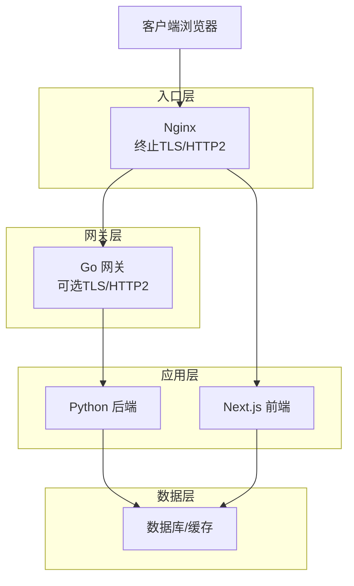
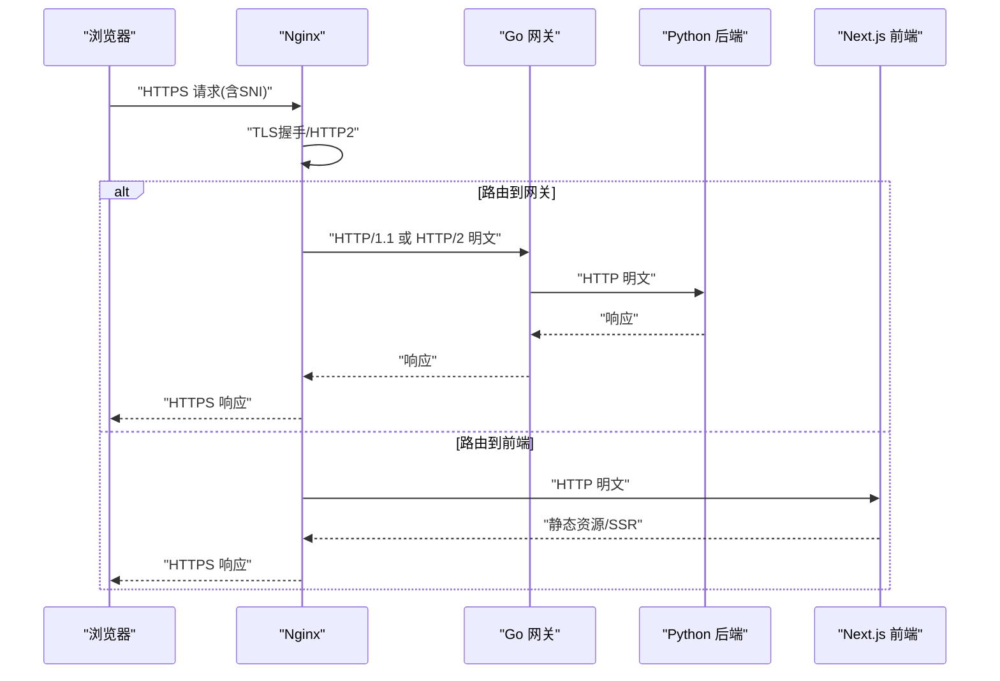
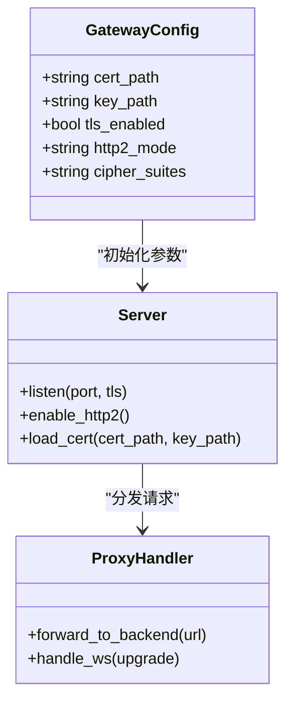
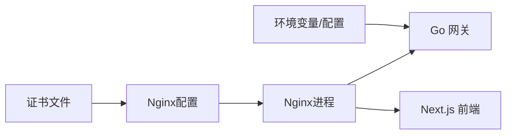

# HTTPS与SSL配置

<cite>
**本文引用的文件**   
- [docker-compose.yml](file://docker-compose.yml)
- [backend_design/nexus_gate/cmd/main.go](file://backend_design/nexus_gate/cmd/main.go)
- [backend_design/nexus_gate/internal/config/config.go](file://backend_design/nexus_gate/internal/config/config.go)
- [backend_design/nexus_gate/internal/proxy/proxy.go](file://backend_design/nexus_gate/internal/proxy/proxy.go)
- [backend_design/nexus_gate/Dockerfile](file://backend_design/nexus_gate/Dockerfile)
- [frontend_design/next.config.js](file://frontend_design/next.config.js)
- [frontend_design/Dockerfile](file://frontend_design/Dockerfile)
- [config/nginx/](file://config/nginx/)
</cite>

## 目录
1. [简介](#简介)
2. [项目结构](#项目结构)
3. [核心组件](#核心组件)
4. [架构总览](#架构总览)
5. [详细组件分析](#详细组件分析)
6. [依赖关系分析](#依赖关系分析)
7. [性能考虑](#性能考虑)
8. [故障排查指南](#故障排查指南)
9. [结论](#结论)
10. [附录](#附录)

## 简介
本指南面向NexusCockpit的HTTPS与SSL部署，覆盖以下关键主题：
- Nginx反向代理的SSL证书配置（自签名、Let's Encrypt自动续期、多域名）
- Go网关的TLS配置（证书加载、加密套件、HTTP/2）
- 前端Next.js应用的HTTPS部署（环境变量、CORS、安全头）
- 容器化环境下的证书管理（卷挂载、动态更新、密钥存储）
- SSL性能优化与故障排查

## 项目结构
本项目包含Go网关、Python后端、Next.js前端以及Nginx等组件。与HTTPS/SSL相关的关键位置如下：
- Nginx配置目录：config/nginx/
- Go网关源码：backend_design/nexus_gate/
- Next.js前端源码与构建：frontend_design/
- 容器编排：docker-compose.yml

[此图为概念性架构图，未直接映射具体源文件]

## 核心组件
- Nginx：作为外部入口，负责TLS终止、HTTP/2、静态资源服务、反向代理到网关与前端。
- Go网关：提供鉴权、限流、WebSocket转发等能力；可选择在进程内启用TLS或仅处理内部明文流量。
- Next.js前端：生产构建后由Nginx或内置服务器提供；需正确设置环境变量以支持HTTPS与跨域。
- 容器编排：通过docker-compose将证书卷挂载至各组件，实现统一证书生命周期管理。

章节来源
- [docker-compose.yml](file://docker-compose.yml)
- [backend_design/nexus_gate/cmd/main.go](file://backend_design/nexus_gate/cmd/main.go)
- [backend_design/nexus_gate/internal/config/config.go](file://backend_design/nexus_gate/internal/config/config.go)
- [backend_design/nexus_gate/internal/proxy/proxy.go](file://backend_design/nexus_gate/internal/proxy/proxy.go)
- [frontend_design/next.config.js](file://frontend_design/next.config.js)
- [frontend_design/Dockerfile](file://frontend_design/Dockerfile)
- [config/nginx/](file://config/nginx/)

## 架构总览
下图展示从浏览器到后端的数据流与TLS边界。推荐将TLS终止放在Nginx，Go网关与后端之间使用内网明文传输以降低开销；若需要端到端加密，可在Go网关再开启TLS。

[此图为概念性流程图，未直接映射具体源文件]

## 详细组件分析

### Nginx反向代理与SSL配置
- 证书放置与卷挂载
  - 将证书与私钥放入宿主机的证书目录，并通过docker-compose将目录挂载到Nginx容器内的固定路径。
  - 建议为每个域名准备独立证书或使用SAN多域名证书。
- TLS与HTTP/2
  - 启用TLS并指定协议版本（如TLS1.2/1.3）。
  - 开启HTTP/2以提升性能。
- SNI与多域名
  - 使用server_name匹配不同域名，并为每个域名配置对应的证书路径。
- Let's Encrypt自动续期
  - 在宿主机运行certbot获取/续期证书，并将新证书写入被Nginx挂载的目录。
  - 配置Nginx热重载策略，使证书更新无需重启容器。
- 安全头与HSTS
  - 添加严格传输安全、内容类型嗅探防护、点击劫持防护等头部。
- 日志与监控
  - 记录访问日志与错误日志，便于定位证书问题。

章节来源
- [docker-compose.yml](file://docker-compose.yml)
- [config/nginx/](file://config/nginx/)

### Go网关TLS配置
- 证书加载
  - 通过配置文件或环境变量指定证书与私钥路径，并在启动时加载。
  - 若采用进程内TLS，确保容器内可读取证书卷。
- 加密套件与协议
  - 限制为现代加密套件，禁用弱算法，优先使用TLS1.2/1.3。
- HTTP/2支持
  - 在监听端口启用HTTP/2，提升并发性能。
- 内部通信
  - 网关与后端之间建议使用内网明文，减少加解密开销；如需端到端加密，可在网关再次开启TLS。

图表来源
- [backend_design/nexus_gate/internal/config/config.go](file://backend_design/nexus_gate/internal/config/config.go)
- [backend_design/nexus_gate/cmd/main.go](file://backend_design/nexus_gate/cmd/main.go)
- [backend_design/nexus_gate/internal/proxy/proxy.go](file://backend_design/nexus_gate/internal/proxy/proxy.go)

章节来源
- [backend_design/nexus_gate/internal/config/config.go](file://backend_design/nexus_gate/internal/config/config.go)
- [backend_design/nexus_gate/cmd/main.go](file://backend_design/nexus_gate/cmd/main.go)
- [backend_design/nexus_gate/internal/proxy/proxy.go](file://backend_design/nexus_gate/internal/proxy/proxy.go)

### Next.js前端HTTPS部署
- 环境变量
  - 设置NEXT_PUBLIC_BASE_URL指向HTTPS域名，确保API调用走HTTPS。
  - 若使用SSR/ISR，确保构建时与运行时一致的环境变量。
- CORS与安全头
  - 在Nginx层统一设置CORS与安全头，避免前后端重复配置。
  - 明确允许的源、方法与头部，最小化暴露面。
- 静态资源与缓存
  - 对静态资源启用强缓存与CDN，减少TLS握手次数。
- 容器化
  - 前端镜像不包含敏感证书，由Nginx统一提供HTTPS。

章节来源
- [frontend_design/next.config.js](file://frontend_design/next.config.js)
- [frontend_design/Dockerfile](file://frontend_design/Dockerfile)

### 容器化证书管理方案
- 证书卷挂载
  - 在docker-compose中定义证书卷，将宿主机的证书目录挂载到Nginx与Go网关容器。
- 动态更新
  - 使用inotify或定时任务检测证书变更，触发Nginx平滑重载与Go网关热加载。
- 密钥存储
  - 生产环境建议使用受控的密钥管理系统或云厂商KMS，定期轮换证书。
- 权限控制
  - 限制证书目录的读写权限，仅允许特定用户或容器访问。

章节来源
- [docker-compose.yml](file://docker-compose.yml)
- [backend_design/nexus_gate/Dockerfile](file://backend_design/nexus_gate/Dockerfile)

## 依赖关系分析
- Nginx依赖证书文件与配置文件，通过卷挂载与外部工具（如certbot）协作。
- Go网关依赖配置文件与环境变量，用于加载证书与网络参数。
- Next.js前端依赖构建产物与运行时环境变量，不直接持有证书。

图表来源
- [docker-compose.yml](file://docker-compose.yml)
- [backend_design/nexus_gate/internal/config/config.go](file://backend_design/nexus_gate/internal/config/config.go)
- [config/nginx/](file://config/nginx/)

章节来源
- [docker-compose.yml](file://docker-compose.yml)
- [backend_design/nexus_gate/internal/config/config.go](file://backend_design/nexus_gate/internal/config/config.go)
- [config/nginx/](file://config/nginx/)

## 性能考虑
- 启用HTTP/2与TLS1.3，减少握手延迟。
- 合理设置会话复用与会话票据，降低重复握手成本。
- 选择高性能加密套件，避免过度消耗CPU。
- 对静态资源启用缓存与压缩，减少带宽占用。
- 在Nginx层进行TLS终止，Go网关专注业务逻辑，提高吞吐。

[本节为通用指导，不直接分析具体文件]

## 故障排查指南
- 证书链不完整
  - 检查证书链顺序与中间证书是否齐全。
- SNI不匹配
  - 确认server_name与客户端请求的SNI一致。
- 证书过期
  - 查看证书有效期与自动续期任务状态。
- 权限问题
  - 验证容器对证书文件的读取权限。
- 端口冲突
  - 检查443端口是否被其他进程占用。
- 日志定位
  - 查看Nginx错误日志与Go网关日志，定位握手失败原因。

章节来源
- [docker-compose.yml](file://docker-compose.yml)
- [config/nginx/](file://config/nginx/)
- [backend_design/nexus_gate/cmd/main.go](file://backend_design/nexus_gate/cmd/main.go)

## 结论
通过将TLS终止置于Nginx，结合合理的证书管理与自动化续期，可以在保证安全性的同时获得良好的性能。Go网关专注于业务转发与鉴权，Next.js前端通过环境变量与Nginx安全头完成HTTPS适配。容器化环境下，统一的证书卷挂载与动态更新机制是稳定运行的关键。

[本节为总结性内容，不直接分析具体文件]

## 附录
- 自签名证书生成步骤（概念流程）
  - 生成私钥与CSR
  - 签发自签名证书
  - 将证书与私钥放入挂载目录
  - 在Nginx中引用证书并重启
- Let's Encrypt自动续期（概念流程）
  - 安装certbot并申请证书
  - 配置定时任务执行续期
  - 续期成功后触发Nginx平滑重载
- 多域名证书管理（概念流程）
  - 使用SAN扩展为多个域名颁发同一证书
  - 或在Nginx中为每个域名配置独立证书

[本节为概念性说明，未直接分析具体文件]