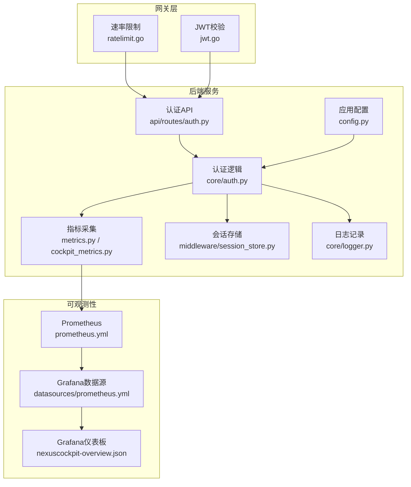
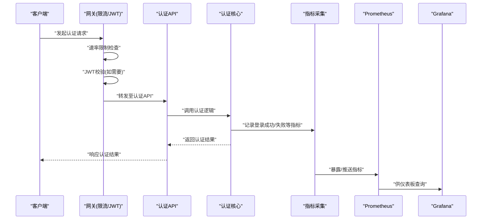
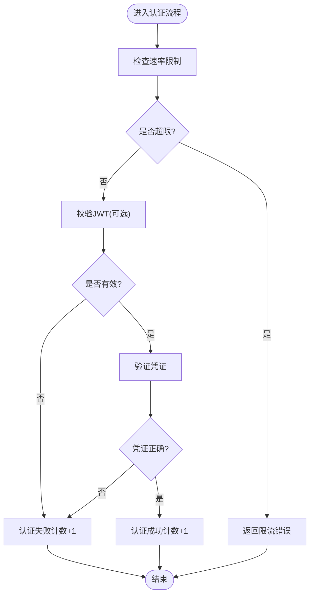
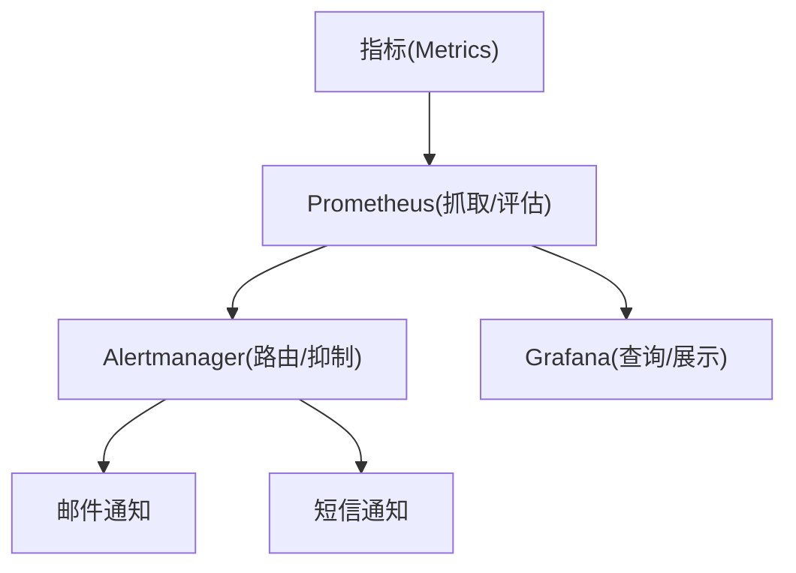
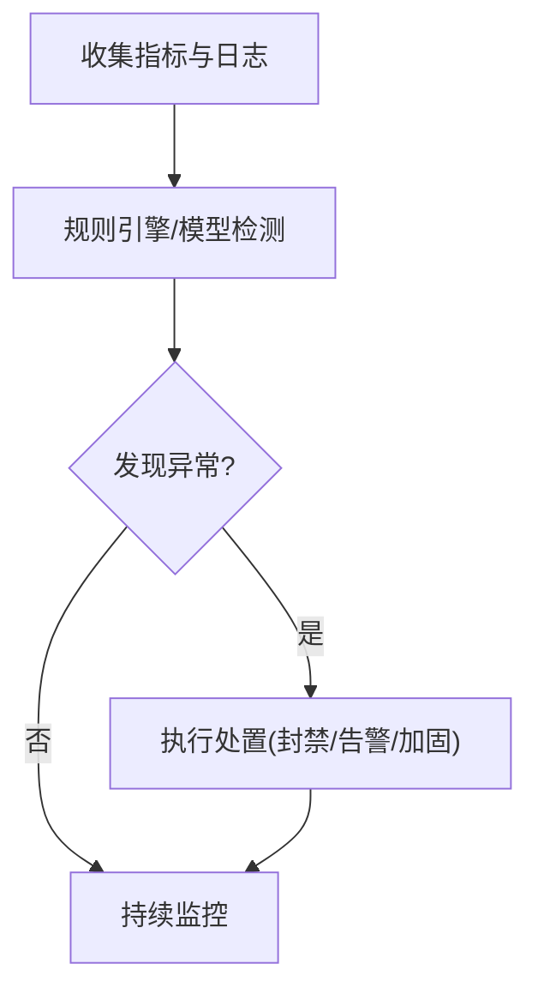
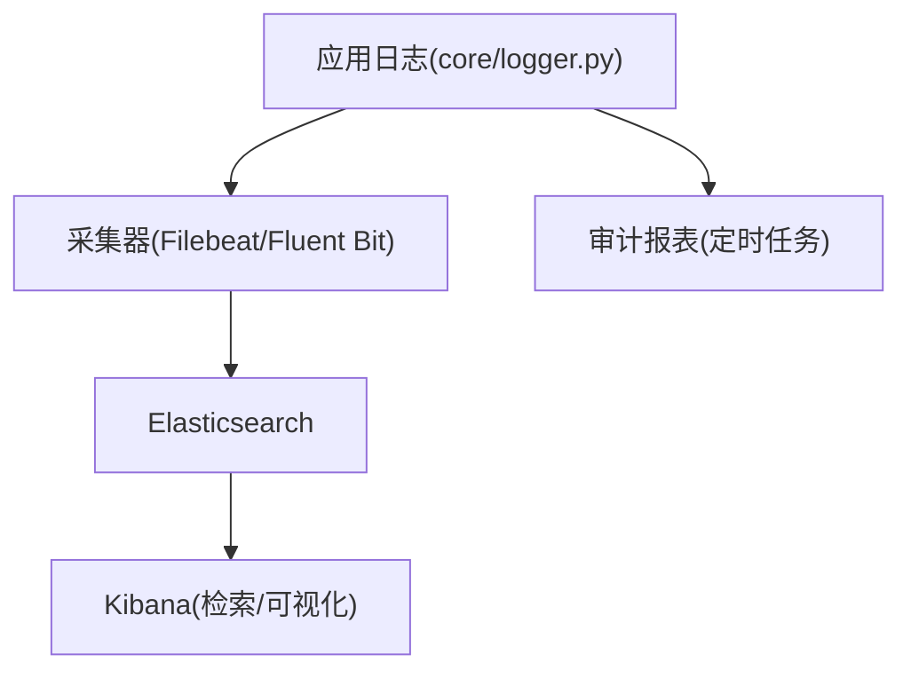
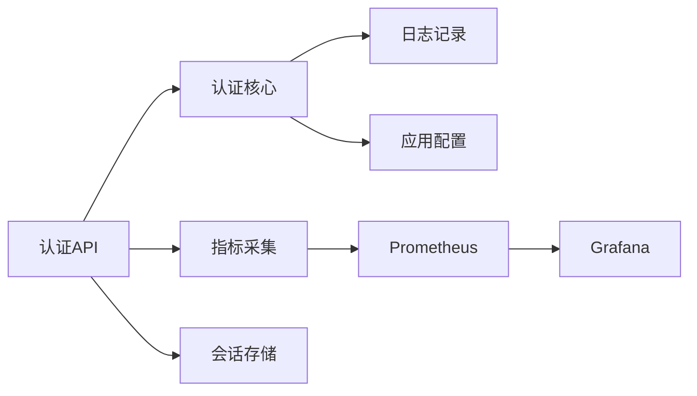

# 安全监控与审计

<cite>
**本文引用的文件**   
- [backend_design/nexus/core/auth.py](file://backend_design/nexus/core/auth.py)
- [backend_design/nexus/api/routes/auth.py](file://backend_design/nexus/api/routes/auth.py)
- [backend_design/nexus/observability/metrics.py](file://backend_design/nexus/observability/metrics.py)
- [backend_design/nexus/observability/cockpit_metrics.py](file://backend_design/nexus/observability/cockpit_metrics.py)
- [config/prometheus/prometheus.yml](file://config/prometheus/prometheus.yml)
- [config/grafana/provisioning/dashboards/nexuscockpit-overview.json](file://config/grafana/provisioning/dashboards/nexuscockpit-overview.json)
- [config/grafana/provisioning/datasources/prometheus.yml](file://config/grafana/provisioning/datasources/prometheus.yml)
- [backend_design/nexus_gate/internal/ratelimit/ratelimit.go](file://backend_design/nexus_gate/internal/ratelimit/ratelimit.go)
- [backend_design/nexus_gate/internal/auth/jwt.go](file://backend_design/nexus_gate/internal/auth/jwt.go)
- [backend_design/nexus/middleware/session_store.py](file://backend_design/nexus/middleware/session_store.py)
- [backend_design/nexus/core/logger.py](file://backend_design/nexus/core/logger.py)
- [backend_design/nexus/config.py](file://backend_design/nexus/config.py)
</cite>

## 目录
1. [简介](#简介)
2. [项目结构](#项目结构)
3. [核心组件](#核心组件)
4. [架构总览](#架构总览)
5. [详细组件分析](#详细组件分析)
6. [依赖分析](#依赖分析)
7. [性能考虑](#性能考虑)
8. [故障排查指南](#故障排查指南)
9. [结论](#结论)
10. [附录](#附录)

## 简介
本指南聚焦 NexusCockpit 的安全监控与审计能力，覆盖以下方面：
- 安全指标采集：登录失败统计、异常请求检测、资源访问审计
- 安全事件告警配置：Prometheus 告警规则、Grafana 安全仪表板、邮件/短信通知
- 入侵检测系统配置：异常行为识别、恶意IP封禁、攻击模式检测
- 安全日志聚合分析：ELK Stack 集成、日志脱敏、合规性报告
- 安全基线检查与漏洞扫描自动化流程

说明：本项目在网关层（Go）提供速率限制与JWT校验，在后端（Python）暴露认证接口并采集指标；可观测性通过 Prometheus/Grafana 进行可视化。日志聚合与告警策略建议基于现有指标与日志输出进行扩展。

## 项目结构
与安全监控和审计相关的代码与配置主要分布在如下位置：
- 后端认证与指标：backend_design/nexus/core/auth.py、backend_design/nexus/api/routes/auth.py、backend_design/nexus/observability/metrics.py、backend_design/nexus/observability/cockpit_metrics.py
- 网关限流与鉴权：backend_design/nexus_gate/internal/ratelimit/ratelimit.go、backend_design/nexus_gate/internal/auth/jwt.go
- 会话存储与日志：backend_design/nexus/middleware/session_store.py、backend_design/nexus/core/logger.py
- 可观测性配置：config/prometheus/prometheus.yml、config/grafana/provisioning/datasources/prometheus.yml、config/grafana/provisioning/dashboards/nexuscockpit-overview.json
- 应用配置：backend_design/nexus/config.py

图表来源
- [backend_design/nexus_gate/internal/ratelimit/ratelimit.go](file://backend_design/nexus_gate/internal/ratelimit/ratelimit.go)
- [backend_design/nexus_gate/internal/auth/jwt.go](file://backend_design/nexus_gate/internal/auth/jwt.go)
- [backend_design/nexus/api/routes/auth.py](file://backend_design/nexus/api/routes/auth.py)
- [backend_design/nexus/core/auth.py](file://backend_design/nexus/core/auth.py)
- [backend_design/nexus/observability/metrics.py](file://backend_design/nexus/observability/metrics.py)
- [backend_design/nexus/observability/cockpit_metrics.py](file://backend_design/nexus/observability/cockpit_metrics.py)
- [backend_design/nexus/middleware/session_store.py](file://backend_design/nexus/middleware/session_store.py)
- [backend_design/nexus/core/logger.py](file://backend_design/nexus/core/logger.py)
- [backend_design/nexus/config.py](file://backend_design/nexus/config.py)
- [config/prometheus/prometheus.yml](file://config/prometheus/prometheus.yml)
- [config/grafana/provisioning/datasources/prometheus.yml](file://config/grafana/provisioning/datasources/prometheus.yml)
- [config/grafana/provisioning/dashboards/nexuscockpit-overview.json](file://config/grafana/provisioning/dashboards/nexuscockpit-overview.json)

章节来源
- [backend_design/nexus/api/routes/auth.py](file://backend_design/nexus/api/routes/auth.py)
- [backend_design/nexus/core/auth.py](file://backend_design/nexus/core/auth.py)
- [backend_design/nexus/observability/metrics.py](file://backend_design/nexus/observability/metrics.py)
- [backend_design/nexus/observability/cockpit_metrics.py](file://backend_design/nexus/observability/cockpit_metrics.py)
- [backend_design/nexus_gate/internal/ratelimit/ratelimit.go](file://backend_design/nexus_gate/internal/ratelimit/ratelimit.go)
- [backend_design/nexus_gate/internal/auth/jwt.go](file://backend_design/nexus_gate/internal/auth/jwt.go)
- [backend_design/nexus/middleware/session_store.py](file://backend_design/nexus/middleware/session_store.py)
- [backend_design/nexus/core/logger.py](file://backend_design/nexus/core/logger.py)
- [backend_design/nexus/config.py](file://backend_design/nexus/config.py)
- [config/prometheus/prometheus.yml](file://config/prometheus/prometheus.yml)
- [config/grafana/provisioning/datasources/prometheus.yml](file://config/grafana/provisioning/datasources/prometheus.yml)
- [config/grafana/provisioning/dashboards/nexuscockpit-overview.json](file://config/grafana/provisioning/dashboards/nexuscockpit-overview.json)

## 核心组件
- 认证与授权
  - 网关层：JWT 校验与速率限制，用于前置防护与基础鉴权。
  - 后端层：认证路由与核心认证逻辑，负责用户凭证验证与会话管理。
- 指标与可观测性
  - 指标采集：在认证关键路径上计数登录成功/失败、异常请求等。
  - 采集与导出：通过 Prometheus 抓取指标，Grafana 展示安全相关面板。
- 会话与日志
  - 会话存储：维护用户会话状态，支撑审计追踪。
  - 日志记录：统一日志输出，便于后续聚合与脱敏处理。
- 配置
  - 应用配置：集中管理安全相关开关与阈值。

章节来源
- [backend_design/nexus_gate/internal/auth/jwt.go](file://backend_design/nexus_gate/internal/auth/jwt.go)
- [backend_design/nexus_gate/internal/ratelimit/ratelimit.go](file://backend_design/nexus_gate/internal/ratelimit/ratelimit.go)
- [backend_design/nexus/api/routes/auth.py](file://backend_design/nexus/api/routes/auth.py)
- [backend_design/nexus/core/auth.py](file://backend_design/nexus/core/auth.py)
- [backend_design/nexus/observability/metrics.py](file://backend_design/nexus/observability/metrics.py)
- [backend_design/nexus/observability/cockpit_metrics.py](file://backend_design/nexus/observability/cockpit_metrics.py)
- [backend_design/nexus/middleware/session_store.py](file://backend_design/nexus/middleware/session_store.py)
- [backend_design/nexus/core/logger.py](file://backend_design/nexus/core/logger.py)
- [backend_design/nexus/config.py](file://backend_design/nexus/config.py)

## 架构总览
下图展示了从客户端到网关、后端、指标与可视化的整体链路，以及安全控制点的位置。

图表来源
- [backend_design/nexus_gate/internal/ratelimit/ratelimit.go](file://backend_design/nexus_gate/internal/ratelimit/ratelimit.go)
- [backend_design/nexus_gate/internal/auth/jwt.go](file://backend_design/nexus_gate/internal/auth/jwt.go)
- [backend_design/nexus/api/routes/auth.py](file://backend_design/nexus/api/routes/auth.py)
- [backend_design/nexus/core/auth.py](file://backend_design/nexus/core/auth.py)
- [backend_design/nexus/observability/metrics.py](file://backend_design/nexus/observability/metrics.py)
- [config/prometheus/prometheus.yml](file://config/prometheus/prometheus.yml)
- [config/grafana/provisioning/datasources/prometheus.yml](file://config/grafana/provisioning/datasources/prometheus.yml)
- [config/grafana/provisioning/dashboards/nexuscockpit-overview.json](file://config/grafana/provisioning/dashboards/nexuscockpit-overview.json)

## 详细组件分析

### 安全指标采集
- 登录失败统计
  - 在认证失败路径中增加失败计数指标，按用户或来源维度打标签，便于定位暴力破解与异常账号。
  - 建议在认证核心处统一埋点，确保前后端一致。
- 异常请求检测
  - 对高频错误码、非法参数、越权访问等场景计数，形成“异常请求”指标。
  - 结合网关的速率限制与JWT校验结果，区分“被拦截”与“业务拒绝”。
- 资源访问审计
  - 对敏感资源的访问进行计数与采样，记录方法、路径、状态码、耗时等。
  - 将审计指标与用户标识关联，支持事后溯源。

图表来源
- [backend_design/nexus_gate/internal/ratelimit/ratelimit.go](file://backend_design/nexus_gate/internal/ratelimit/ratelimit.go)
- [backend_design/nexus_gate/internal/auth/jwt.go](file://backend_design/nexus_gate/internal/auth/jwt.go)
- [backend_design/nexus/api/routes/auth.py](file://backend_design/nexus/api/routes/auth.py)
- [backend_design/nexus/core/auth.py](file://backend_design/nexus/core/auth.py)
- [backend_design/nexus/observability/metrics.py](file://backend_design/nexus/observability/metrics.py)
- [backend_design/nexus/observability/cockpit_metrics.py](file://backend_design/nexus/observability/cockpit_metrics.py)

章节来源
- [backend_design/nexus/observability/metrics.py](file://backend_design/nexus/observability/metrics.py)
- [backend_design/nexus/observability/cockpit_metrics.py](file://backend_design/nexus/observability/cockpit_metrics.py)
- [backend_design/nexus/api/routes/auth.py](file://backend_design/nexus/api/routes/auth.py)
- [backend_design/nexus/core/auth.py](file://backend_design/nexus/core/auth.py)

### 安全事件告警配置
- Prometheus 告警规则
  - 基于指标定义告警规则，例如：单位时间内登录失败次数超过阈值、异常请求比例突增、特定资源访问频率异常。
  - 建议为不同严重级别设置多档阈值，避免误报。
- Grafana 安全仪表板
  - 使用预置数据源连接 Prometheus，创建安全主题面板：登录成功率、失败分布、异常请求趋势、资源访问TopN。
  - 将现有概览仪表板扩展为安全视图，突出关键风险指标。
- 邮件/短信通知
  - 在 Prometheus Alertmanager 中配置通知渠道（邮件、短信），按告警级别路由到不同接收人。
  - 建议与工单系统集成，实现告警闭环。

图表来源
- [config/prometheus/prometheus.yml](file://config/prometheus/prometheus.yml)
- [config/grafana/provisioning/datasources/prometheus.yml](file://config/grafana/provisioning/datasources/prometheus.yml)
- [config/grafana/provisioning/dashboards/nexuscockpit-overview.json](file://config/grafana/provisioning/dashboards/nexuscockpit-overview.json)

章节来源
- [config/prometheus/prometheus.yml](file://config/prometheus/prometheus.yml)
- [config/grafana/provisioning/datasources/prometheus.yml](file://config/grafana/provisioning/datasources/prometheus.yml)
- [config/grafana/provisioning/dashboards/nexuscockpit-overview.json](file://config/grafana/provisioning/dashboards/nexuscockpit-overview.json)

### 入侵检测系统配置
- 异常行为识别
  - 基于指标与日志构建规则：短时间内大量失败登录、来自同一IP的高频异常请求、非工作时间敏感操作。
  - 结合用户画像与历史基线，识别偏离正常模式的访问。
- 恶意IP封禁
  - 在网关层根据速率限制与黑名单动态封禁恶意IP，降低攻击面。
  - 与外部威胁情报联动，自动更新封禁列表。
- 攻击模式检测
  - 针对常见攻击（暴力破解、注入、越权）建立检测规则，结合WAF与网关策略进行拦截。
  - 对高危动作进行强审计与二次确认。

[此图为概念流程图，不直接映射具体源码文件]

章节来源
- [backend_design/nexus_gate/internal/ratelimit/ratelimit.go](file://backend_design/nexus_gate/internal/ratelimit/ratelimit.go)
- [backend_design/nexus_gate/internal/auth/jwt.go](file://backend_design/nexus_gate/internal/auth/jwt.go)
- [backend_design/nexus/core/logger.py](file://backend_design/nexus/core/logger.py)

### 安全日志聚合分析
- ELK Stack 集成
  - 将应用日志输出到标准格式，由 Filebeat/Fluent Bit 采集并发送至 Elasticsearch。
  - Kibana 提供检索、过滤与可视化，支持安全事件回溯。
- 日志脱敏
  - 在日志输出前对敏感字段（密码、令牌、个人信息）进行脱敏或哈希化。
  - 统一脱敏策略，避免泄露风险。
- 合规性报告
  - 定期生成安全审计报告，包括登录失败统计、异常请求汇总、资源访问审计清单。
  - 报告模板标准化，满足内审与外审要求。

[此图为概念流程图，不直接映射具体源码文件]

章节来源
- [backend_design/nexus/core/logger.py](file://backend_design/nexus/core/logger.py)

### 安全基线检查与漏洞扫描自动化
- 安全基线检查
  - 对系统配置、依赖版本、密钥管理等进行基线核查，纳入CI流水线。
  - 使用工具对容器镜像、配置文件进行合规性扫描。
- 漏洞扫描自动化
  - 在构建阶段执行静态分析与依赖漏洞扫描，阻断高风险变更。
  - 定期全量扫描并生成修复建议，跟踪整改进度。

[本节为通用实践指导，无需源码引用]

## 依赖分析
- 组件耦合
  - 认证API依赖认证核心、指标采集与会话存储。
  - 网关层依赖速率限制与JWT模块，作为前置安全控制点。
- 外部依赖
  - Prometheus 与 Grafana 构成可观测性底座，承载指标采集与可视化。
- 潜在风险
  - 指标写入路径需保证高可用与低开销，避免影响主流程。
  - 日志脱敏需在统一入口实施，防止遗漏。

图表来源
- [backend_design/nexus/api/routes/auth.py](file://backend_design/nexus/api/routes/auth.py)
- [backend_design/nexus/core/auth.py](file://backend_design/nexus/core/auth.py)
- [backend_design/nexus/observability/metrics.py](file://backend_design/nexus/observability/metrics.py)
- [backend_design/nexus/middleware/session_store.py](file://backend_design/nexus/middleware/session_store.py)
- [backend_design/nexus/core/logger.py](file://backend_design/nexus/core/logger.py)
- [backend_design/nexus/config.py](file://backend_design/nexus/config.py)
- [config/prometheus/prometheus.yml](file://config/prometheus/prometheus.yml)
- [config/grafana/provisioning/datasources/prometheus.yml](file://config/grafana/provisioning/datasources/prometheus.yml)

章节来源
- [backend_design/nexus/api/routes/auth.py](file://backend_design/nexus/api/routes/auth.py)
- [backend_design/nexus/core/auth.py](file://backend_design/nexus/core/auth.py)
- [backend_design/nexus/observability/metrics.py](file://backend_design/nexus/observability/metrics.py)
- [backend_design/nexus/middleware/session_store.py](file://backend_design/nexus/middleware/session_store.py)
- [backend_design/nexus/core/logger.py](file://backend_design/nexus/core/logger.py)
- [backend_design/nexus/config.py](file://backend_design/nexus/config.py)
- [config/prometheus/prometheus.yml](file://config/prometheus/prometheus.yml)
- [config/grafana/provisioning/datasources/prometheus.yml](file://config/grafana/provisioning/datasources/prometheus.yml)

## 性能考虑
- 指标采集应轻量且异步，避免阻塞主流程。
- 日志输出采用批量与压缩策略，减少I/O压力。
- 告警规则需去抖与抑制，防止风暴式告警。
- 速率限制与封禁策略应在网关层生效，降低后端负载。

[本节为通用性能建议，无需源码引用]

## 故障排查指南
- 认证失败率高
  - 检查网关速率限制与JWT校验是否过于严格。
  - 查看认证核心中的失败计数指标与日志，定位问题账号或来源。
- 指标缺失或延迟
  - 确认 Prometheus 抓取配置与目标可达性。
  - 检查指标写入路径是否存在异常或超时。
- 告警未触发
  - 核对告警规则阈值与时间窗口。
  - 验证 Alertmanager 通知渠道配置与连通性。
- 日志脱敏失效
  - 审查日志输出前的脱敏逻辑是否覆盖所有敏感字段。
  - 检查采集器是否对日志进行了二次处理导致脱敏丢失。

章节来源
- [backend_design/nexus_gate/internal/ratelimit/ratelimit.go](file://backend_design/nexus_gate/internal/ratelimit/ratelimit.go)
- [backend_design/nexus_gate/internal/auth/jwt.go](file://backend_design/nexus_gate/internal/auth/jwt.go)
- [backend_design/nexus/core/auth.py](file://backend_design/nexus/core/auth.py)
- [backend_design/nexus/observability/metrics.py](file://backend_design/nexus/observability/metrics.py)
- [config/prometheus/prometheus.yml](file://config/prometheus/prometheus.yml)
- [backend_design/nexus/core/logger.py](file://backend_design/nexus/core/logger.py)

## 结论
通过网关层的速率限制与JWT校验、后端的认证与指标采集、以及 Prometheus/Grafana 的可观测性体系，NexusCockpit 已具备安全监控与审计的基础能力。建议在此基础上完善告警规则、日志脱敏与合规报告，并结合入侵检测与漏洞扫描自动化，持续提升整体安全水位。

[本节为总结性内容，无需源码引用]

## 附录
- 术语
  - 指标：系统运行状态的量化数据，用于监控与告警。
  - 告警：当指标超过阈值时触发的通知机制。
  - 审计：对关键操作的记录与分析，用于追溯与合规。
- 参考
  - 现有概览仪表板可作为安全视图的起点，逐步扩展安全主题面板。
  - 应用配置集中管理安全开关与阈值，便于运维调整。

[本节为补充信息，无需源码引用]