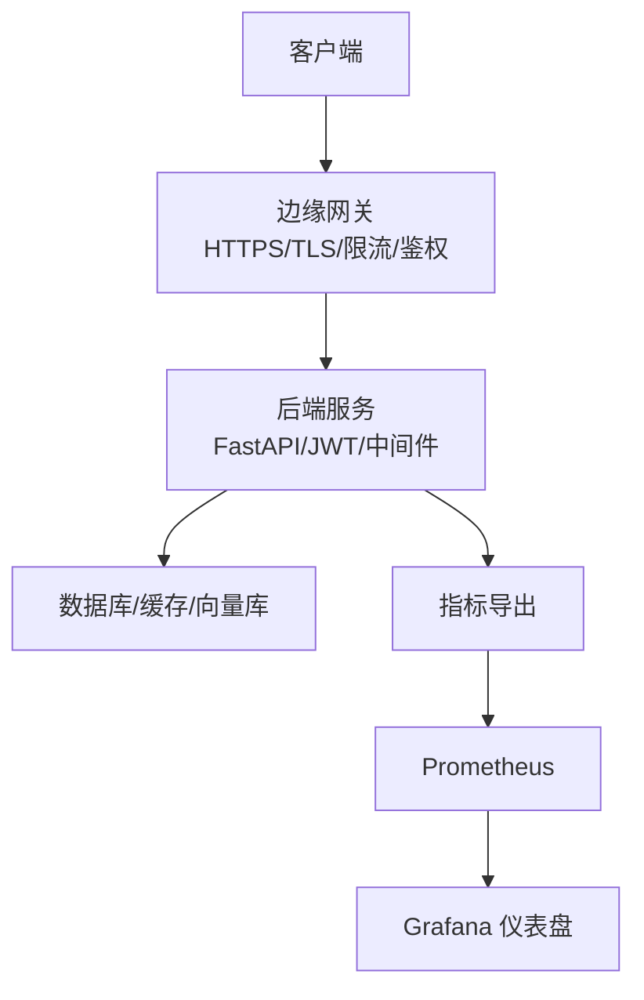
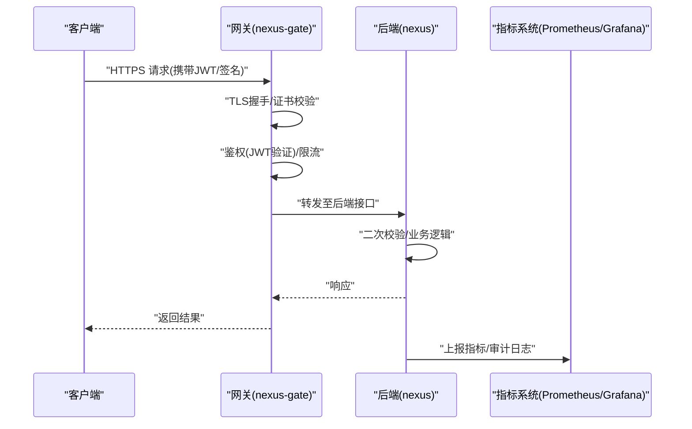
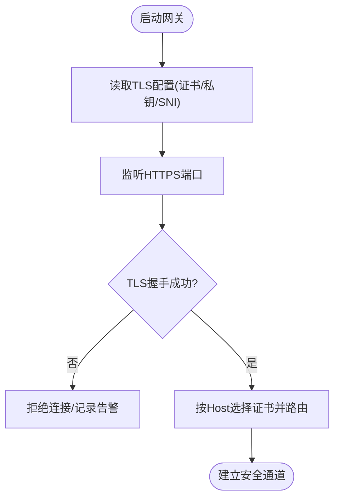
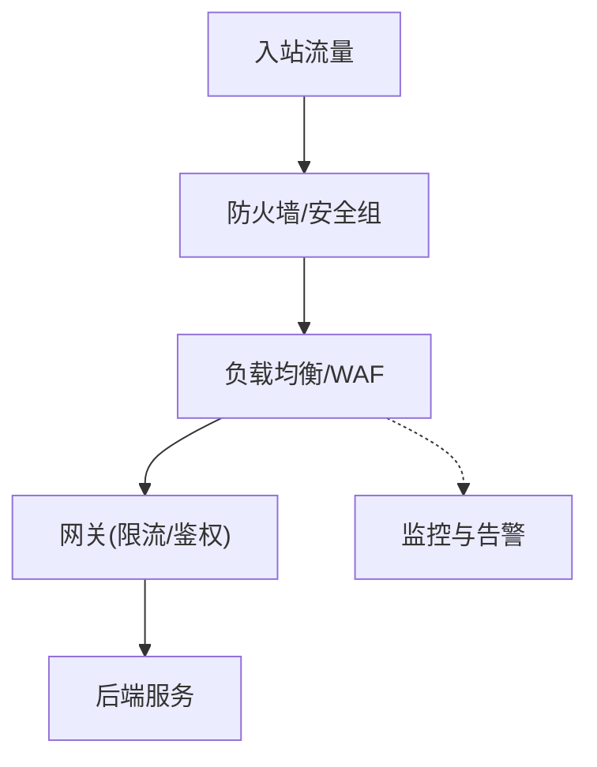
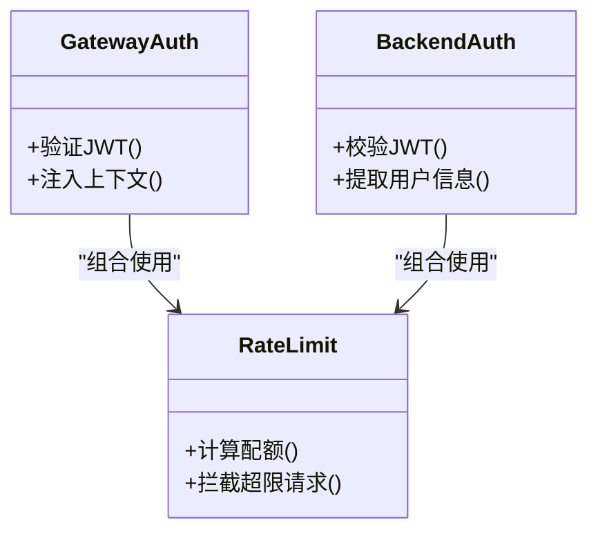
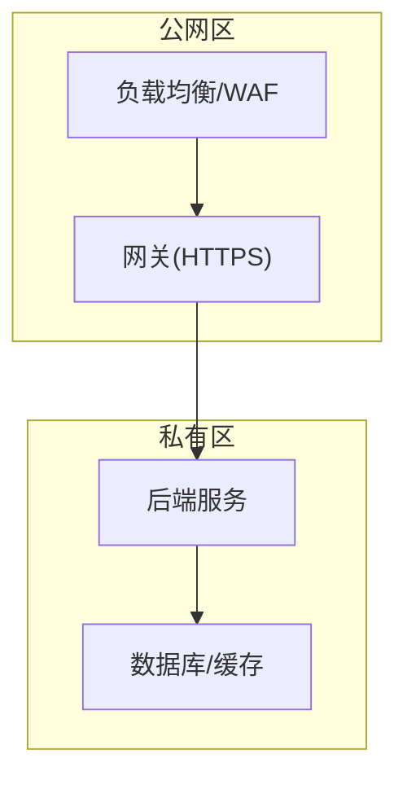
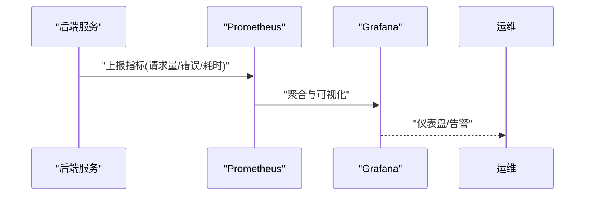
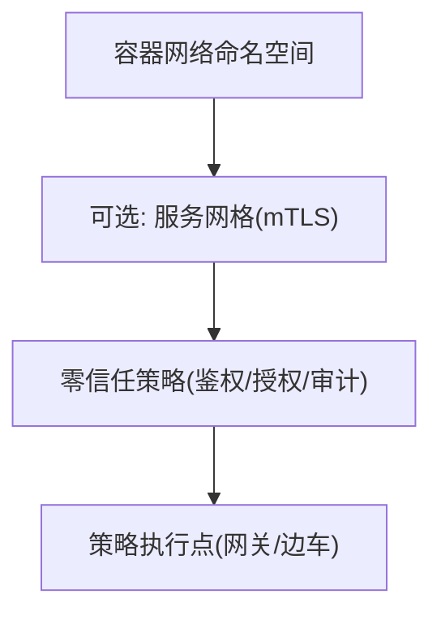
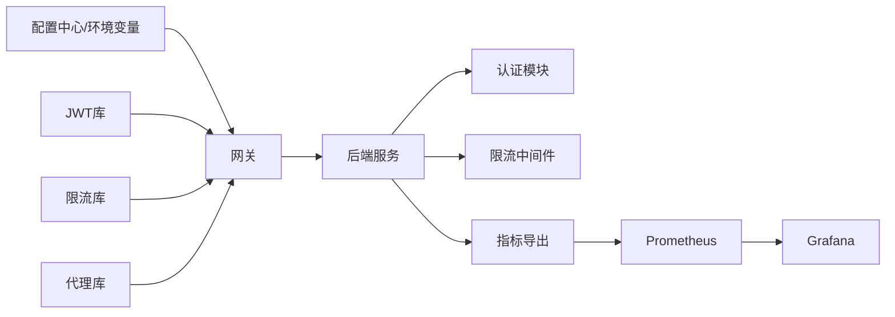

# 网络安全配置

<cite>
**本文引用的文件**   
- [docker-compose.yml](file://docker-compose.yml)
- [backend_design/nexus/main.py](file://backend_design/nexus/main.py)
- [backend_design/nexus/config.py](file://backend_design/nexus/config.py)
- [backend_design/nexus/core/auth.py](file://backend_design/nexus/core/auth.py)
- [backend_design/nexus/middleware/rate_limiter.py](file://backend_design/nexus/middleware/rate_limiter.py)
- [backend_design/nexus/api/routes/auth.py](file://backend_design/nexus/api/routes/auth.py)
- [backend_design/nexus_gate/cmd/main.go](file://backend_design/nexus_gate/cmd/main.go)
- [backend_design/nexus_gate/internal/config/config.go](file://backend_design/nexus_gate/internal/config/config.go)
- [backend_design/nexus_gate/internal/auth/jwt.go](file://backend_design/nexus_gate/internal/auth/jwt.go)
- [backend_design/nexus_gate/internal/ratelimit/ratelimit.go](file://backend_design/nexus_gate/internal/ratelimit/ratelimit.go)
- [backend_design/nexus_gate/internal/proxy/proxy.go](file://backend_design/nexus_gate/internal/proxy/proxy.go)
- [config/prometheus/prometheus.yml](file://config/prometheus/prometheus.yml)
- [config/grafana/provisioning/dashboards/dashboards.yml](file://config/grafana/provisioning/dashboards/dashboards.yml)
- [config/grafana/provisioning/dashboards/nexuscockpit-overview.json](file://config/grafana/provisioning/dashboards/nexuscockpit-overview.json)
</cite>

## 目录
1. [简介](#简介)
2. [项目结构](#项目结构)
3. [核心组件](#核心组件)
4. [架构总览](#架构总览)
5. [详细组件分析](#详细组件分析)
6. [依赖关系分析](#依赖关系分析)
7. [性能与安全权衡](#性能与安全权衡)
8. [故障排查指南](#故障排查指南)
9. [结论](#结论)
10. [附录](#附录)

## 简介
本指南聚焦 NexusCockpit 的网络安全配置，覆盖以下主题：
- HTTPS 证书与 TLS 设置、自动续期策略、多域名支持
- 防火墙规则与访问控制（端口、IP 白名单、DDoS 防护）
- API 安全防护（JWT 认证、请求签名、速率限制）
- 网络隔离策略（微服务间通信、VPC、安全组）
- 安全监控与审计（入侵检测、异常流量分析、事件记录）
- 容器网络安全（网络命名空间、服务网格、零信任）

说明：本文所有实现细节均基于仓库中现有代码与配置文件进行解读与归纳。对于未在仓库中直接实现的通用能力（如外部证书自动续期），提供部署层面的建议与实践路径。

## 项目结构
NexusCockpit 由后端服务（Python/FastAPI）、网关（Go/gRPC/HTTP 代理）、前端（Next.js）以及可观测性组件（Prometheus/Grafana）组成。网络安全相关的关键位置包括：
- 网关层：入口 TLS、鉴权、限流、反向代理
- 应用层：JWT 校验、中间件限流、日志与指标
- 编排层：Docker Compose 暴露端口与服务发现
- 可观测性：指标采集与仪表盘

**图表来源**
- [docker-compose.yml](file://docker-compose.yml)
- [backend_design/nexus_gate/cmd/main.go](file://backend_design/nexus_gate/cmd/main.go)
- [backend_design/nexus_gate/internal/proxy/proxy.go](file://backend_design/nexus_gate/internal/proxy/proxy.go)
- [backend_design/nexus_gate/internal/ratelimit/ratelimit.go](file://backend_design/nexus_gate/internal/ratelimit/ratelimit.go)
- [backend_design/nexus_gate/internal/auth/jwt.go](file://backend_design/nexus_gate/internal/auth/jwt.go)
- [backend_design/nexus/main.py](file://backend_design/nexus/main.py)
- [backend_design/nexus/middleware/rate_limiter.py](file://backend_design/nexus/middleware/rate_limiter.py)
- [config/prometheus/prometheus.yml](file://config/prometheus/prometheus.yml)
- [config/grafana/provisioning/dashboards/dashboards.yml](file://config/grafana/provisioning/dashboards/dashboards.yml)

**章节来源**
- [docker-compose.yml](file://docker-compose.yml)
- [backend_design/nexus/main.py](file://backend_design/nexus/main.py)
- [backend_design/nexus_gate/cmd/main.go](file://backend_design/nexus_gate/cmd/main.go)
- [config/prometheus/prometheus.yml](file://config/prometheus/prometheus.yml)
- [config/grafana/provisioning/dashboards/dashboards.yml](file://config/grafana/provisioning/dashboards/dashboards.yml)

## 核心组件
- 网关（nexus-gate）
  - 负责对外暴露 HTTPS、统一鉴权、限流、转发到后端
  - 关键文件：入口、配置、鉴权、限流、代理
- 后端服务（nexus）
  - FastAPI 应用，包含 JWT 校验、中间件限流、日志与指标
  - 关键文件：主程序、配置、认证、限流中间件、路由
- 可观测性
  - Prometheus 抓取指标，Grafana 展示仪表盘
  - 关键文件：Prometheus 配置、Grafana 数据源与仪表盘

**章节来源**
- [backend_design/nexus_gate/cmd/main.go](file://backend_design/nexus_gate/cmd/main.go)
- [backend_design/nexus_gate/internal/config/config.go](file://backend_design/nexus_gate/internal/config/config.go)
- [backend_design/nexus_gate/internal/auth/jwt.go](file://backend_design/nexus_gate/internal/auth/jwt.go)
- [backend_design/nexus_gate/internal/ratelimit/ratelimit.go](file://backend_design/nexus_gate/internal/ratelimit/ratelimit.go)
- [backend_design/nexus_gate/internal/proxy/proxy.go](file://backend_design/nexus_gate/internal/proxy/proxy.go)
- [backend_design/nexus/main.py](file://backend_design/nexus/main.py)
- [backend_design/nexus/config.py](file://backend_design/nexus/config.py)
- [backend_design/nexus/core/auth.py](file://backend_design/nexus/core/auth.py)
- [backend_design/nexus/middleware/rate_limiter.py](file://backend_design/nexus/middleware/rate_limiter.py)
- [config/prometheus/prometheus.yml](file://config/prometheus/prometheus.yml)
- [config/grafana/provisioning/dashboards/dashboards.yml](file://config/grafana/provisioning/dashboards/dashboards.yml)

## 架构总览
从安全视角看，请求流经“边缘网关 → 后端服务 → 存储/外部依赖”，并在各层实施鉴权、限流、加密与审计。

**图表来源**
- [backend_design/nexus_gate/cmd/main.go](file://backend_design/nexus_gate/cmd/main.go)
- [backend_design/nexus_gate/internal/auth/jwt.go](file://backend_design/nexus_gate/internal/auth/jwt.go)
- [backend_design/nexus_gate/internal/ratelimit/ratelimit.go](file://backend_design/nexus_gate/internal/ratelimit/ratelimit.go)
- [backend_design/nexus_gate/internal/proxy/proxy.go](file://backend_design/nexus_gate/internal/proxy/proxy.go)
- [backend_design/nexus/main.py](file://backend_design/nexus/main.py)
- [config/prometheus/prometheus.yml](file://config/prometheus/prometheus.yml)

## 详细组件分析

### HTTPS 证书与 TLS 配置
- 网关侧
  - 通过配置加载证书与私钥，启用 HTTPS 监听
  - 支持 SNI 多域名绑定（在证书与域名解析层面配合）
- 自动续期
  - 仓库未内置证书自动续期逻辑；建议在编排层使用外部工具（如 certbot/cert-manager）生成并挂载证书，或通过进程外热重载机制更新
- 多域名支持
  - 在网关配置中为不同域名指定对应证书，结合 DNS 与负载均衡器实现

**图表来源**
- [backend_design/nexus_gate/internal/config/config.go](file://backend_design/nexus_gate/internal/config/config.go)
- [backend_design/nexus_gate/cmd/main.go](file://backend_design/nexus_gate/cmd/main.go)

**章节来源**
- [backend_design/nexus_gate/internal/config/config.go](file://backend_design/nexus_gate/internal/config/config.go)
- [backend_design/nexus_gate/cmd/main.go](file://backend_design/nexus_gate/cmd/main.go)

### 防火墙与访问控制
- 端口暴露
  - 通过编排文件对外暴露网关端口，生产环境建议仅开放必要端口（如 443/8443）
- IP 白名单
  - 可在网关或前置 LB/WAF 层实现；仓库未提供内置 IP 白名单模块，建议在网关配置或前置设备中配置
- DDoS 防护
  - 网关层具备基础限流能力；更完善的防护需结合云厂商 WAF/CDN 或专用抗 DDoS 设备

**图表来源**
- [docker-compose.yml](file://docker-compose.yml)
- [backend_design/nexus_gate/internal/ratelimit/ratelimit.go](file://backend_design/nexus_gate/internal/ratelimit/ratelimit.go)

**章节来源**
- [docker-compose.yml](file://docker-compose.yml)
- [backend_design/nexus_gate/internal/ratelimit/ratelimit.go](file://backend_design/nexus_gate/internal/ratelimit/ratelimit.go)

### API 安全防护（JWT、签名、速率限制）
- JWT 认证
  - 网关与后端均实现 JWT 校验，确保令牌有效性与权限范围
- 请求签名
  - 仓库未提供统一的请求签名中间件；如需强防篡改，建议在网关层增加签名校验中间件或在调用方/网关之间约定 HMAC 签名
- 速率限制
  - 网关与后端均有限流实现，可按 IP/用户维度限制 QPS

**图表来源**
- [backend_design/nexus_gate/internal/auth/jwt.go](file://backend_design/nexus_gate/internal/auth/jwt.go)
- [backend_design/nexus/core/auth.py](file://backend_design/nexus/core/auth.py)
- [backend_design/nexus_gate/internal/ratelimit/ratelimit.go](file://backend_design/nexus_gate/internal/ratelimit/ratelimit.go)
- [backend_design/nexus/middleware/rate_limiter.py](file://backend_design/nexus/middleware/rate_limiter.py)

**章节来源**
- [backend_design/nexus_gate/internal/auth/jwt.go](file://backend_design/nexus_gate/internal/auth/jwt.go)
- [backend_design/nexus/core/auth.py](file://backend_design/nexus/core/auth.py)
- [backend_design/nexus_gate/internal/ratelimit/ratelimit.go](file://backend_design/nexus_gate/internal/ratelimit/ratelimit.go)
- [backend_design/nexus/middleware/rate_limiter.py](file://backend_design/nexus/middleware/rate_limiter.py)
- [backend_design/nexus/api/routes/auth.py](file://backend_design/nexus/api/routes/auth.py)

### 网络隔离策略（微服务、VPC、安全组）
- 微服务间通信
  - 通过 Docker Compose 内部网络互通，避免直接暴露到宿主机网络
- VPC 与安全组
  - 在生产环境中，将网关置于公网子网，后端置于私有子网，并通过安全组/ACL 限制入站来源
- 最小暴露面
  - 仅对网关开放必要端口，后端服务不直接暴露

[此图为概念图，无需图表来源]

**章节来源**
- [docker-compose.yml](file://docker-compose.yml)

### 安全监控与审计（IDS、异常流量、事件记录）
- 指标与日志
  - 后端导出指标，Prometheus 抓取，Grafana 展示
- 异常流量分析
  - 结合网关限流计数、错误率、延迟等指标进行阈值告警
- 入侵检测
  - 仓库未内置 IDS；建议结合 WAF/IDS 系统与 SIEM 平台联动

**图表来源**
- [config/prometheus/prometheus.yml](file://config/prometheus/prometheus.yml)
- [config/grafana/provisioning/dashboards/dashboards.yml](file://config/grafana/provisioning/dashboards/dashboards.yml)
- [config/grafana/provisioning/dashboards/nexuscockpit-overview.json](file://config/grafana/provisioning/dashboards/nexuscockpit-overview.json)

**章节来源**
- [config/prometheus/prometheus.yml](file://config/prometheus/prometheus.yml)
- [config/grafana/provisioning/dashboards/dashboards.yml](file://config/grafana/provisioning/dashboards/dashboards.yml)
- [config/grafana/provisioning/dashboards/nexuscockpit-overview.json](file://config/grafana/provisioning/dashboards/nexuscockpit-overview.json)

### 容器网络安全（命名空间、服务网格、零信任）
- 网络命名空间
  - 通过容器编排的网络模型隔离服务间通信
- 服务网格
  - 仓库未集成服务网格；可在网关与后端之间引入 mTLS 与细粒度访问控制
- 零信任
  - 以“默认拒绝”为原则，对所有跨域/跨服务请求强制鉴权与最小权限

[此图为概念图，无需图表来源]

## 依赖关系分析
- 网关依赖
  - 配置加载、JWT 校验、限流、反向代理
- 后端依赖
  - 配置、认证、限流中间件、指标导出
- 可观测性依赖
  - Prometheus 抓取后端指标，Grafana 消费数据源并渲染仪表盘

**图表来源**
- [backend_design/nexus_gate/internal/config/config.go](file://backend_design/nexus_gate/internal/config/config.go)
- [backend_design/nexus_gate/internal/auth/jwt.go](file://backend_design/nexus_gate/internal/auth/jwt.go)
- [backend_design/nexus_gate/internal/ratelimit/ratelimit.go](file://backend_design/nexus_gate/internal/ratelimit/ratelimit.go)
- [backend_design/nexus_gate/internal/proxy/proxy.go](file://backend_design/nexus_gate/internal/proxy/proxy.go)
- [backend_design/nexus/main.py](file://backend_design/nexus/main.py)
- [backend_design/nexus/core/auth.py](file://backend_design/nexus/core/auth.py)
- [backend_design/nexus/middleware/rate_limiter.py](file://backend_design/nexus/middleware/rate_limiter.py)
- [config/prometheus/prometheus.yml](file://config/prometheus/prometheus.yml)

**章节来源**
- [backend_design/nexus_gate/internal/config/config.go](file://backend_design/nexus_gate/internal/config/config.go)
- [backend_design/nexus_gate/internal/auth/jwt.go](file://backend_design/nexus_gate/internal/auth/jwt.go)
- [backend_design/nexus_gate/internal/ratelimit/ratelimit.go](file://backend_design/nexus_gate/internal/ratelimit/ratelimit.go)
- [backend_design/nexus_gate/internal/proxy/proxy.go](file://backend_design/nexus_gate/internal/proxy/proxy.go)
- [backend_design/nexus/main.py](file://backend_design/nexus/main.py)
- [backend_design/nexus/core/auth.py](file://backend_design/nexus/core/auth.py)
- [backend_design/nexus/middleware/rate_limiter.py](file://backend_design/nexus/middleware/rate_limiter.py)
- [config/prometheus/prometheus.yml](file://config/prometheus/prometheus.yml)

## 性能与安全权衡
- 限流粒度
  - 网关层粗粒度保护整体吞吐，后端层细粒度保护业务热点接口
- TLS 开销
  - 在高并发场景下，合理复用连接与会话票据，必要时启用硬件加速
- 鉴权链路
  - 网关与后端双重校验提升安全性，但会增加时延；可通过缓存公钥/令牌黑名单优化

[本节为通用指导，无需章节来源]

## 故障排查指南
- HTTPS 无法建立
  - 检查证书与私钥路径、权限、SNI 匹配与域名解析
- 鉴权失败
  - 核对 JWT 密钥、过期时间、算法与签发者声明
- 限流触发
  - 查看限流统计与阈值，确认是否被恶意刷量
- 指标缺失
  - 检查 Prometheus 抓取目标与网络连通性，确认端口与标签

**章节来源**
- [backend_design/nexus_gate/internal/config/config.go](file://backend_design/nexus_gate/internal/config/config.go)
- [backend_design/nexus_gate/internal/auth/jwt.go](file://backend_design/nexus_gate/internal/auth/jwt.go)
- [backend_design/nexus_gate/internal/ratelimit/ratelimit.go](file://backend_design/nexus_gate/internal/ratelimit/ratelimit.go)
- [config/prometheus/prometheus.yml](file://config/prometheus/prometheus.yml)

## 结论
NexusCockpit 在网关与后端层实现了基础的 HTTPS、JWT 鉴权与限流能力，并结合 Prometheus/Grafana 提供可观测性。生产环境应在此基础上完善证书自动续期、WAF/DDoS 防护、IP 白名单、网络隔离与零信任策略，形成纵深防御体系。

[本节为总结，无需章节来源]

## 附录
- 部署参考
  - 通过编排文件管理端口暴露与服务发现
- 仪表盘
  - 使用提供的 Grafana 仪表盘快速掌握运行状态与安全指标

**章节来源**
- [docker-compose.yml](file://docker-compose.yml)
- [config/grafana/provisioning/dashboards/nexuscockpit-overview.json](file://config/grafana/provisioning/dashboards/nexuscockpit-overview.json)