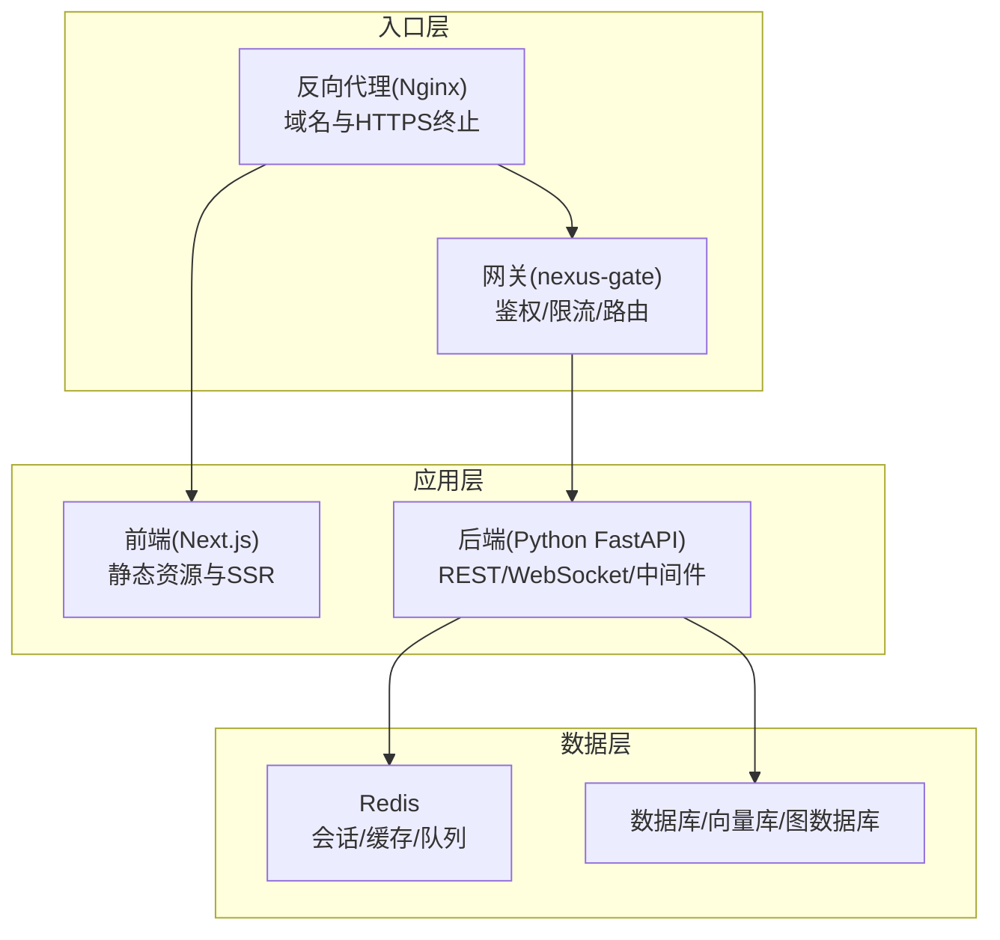
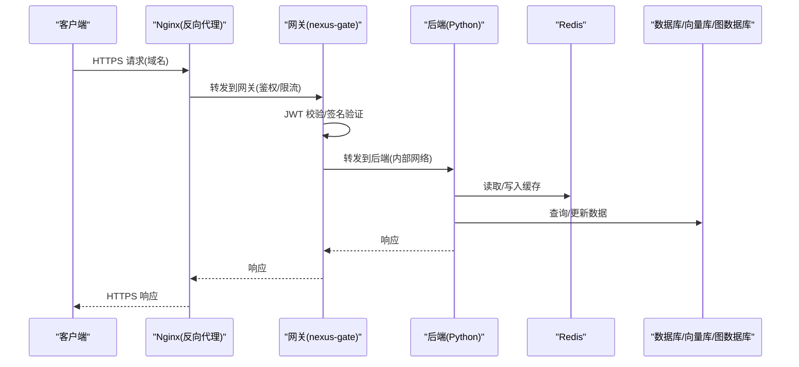
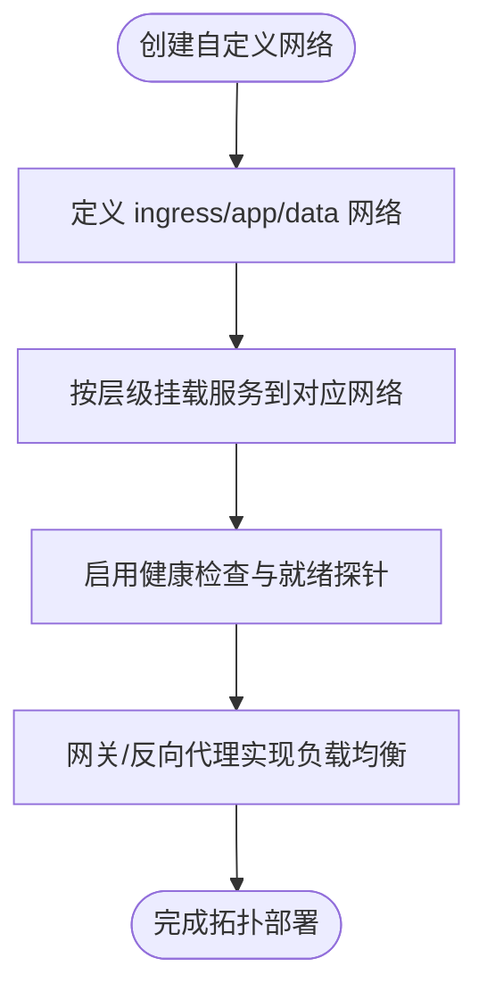
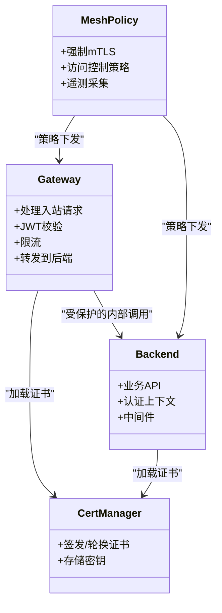
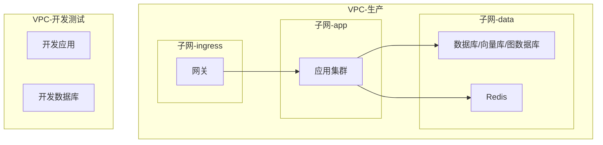
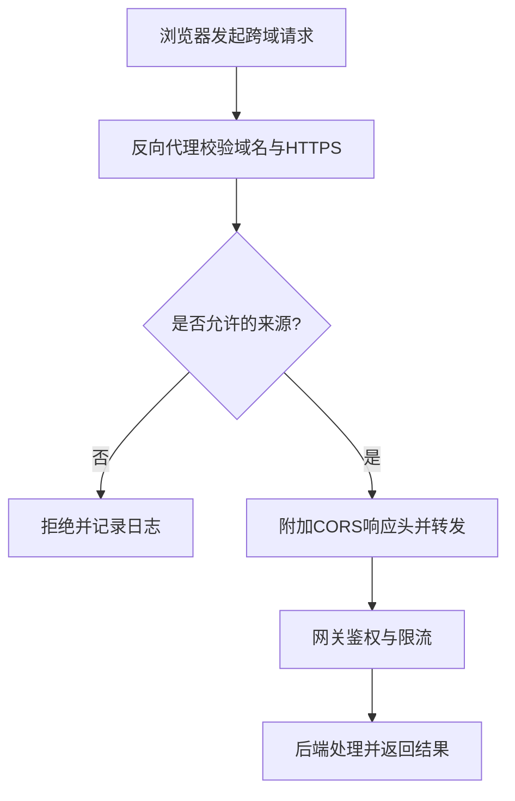
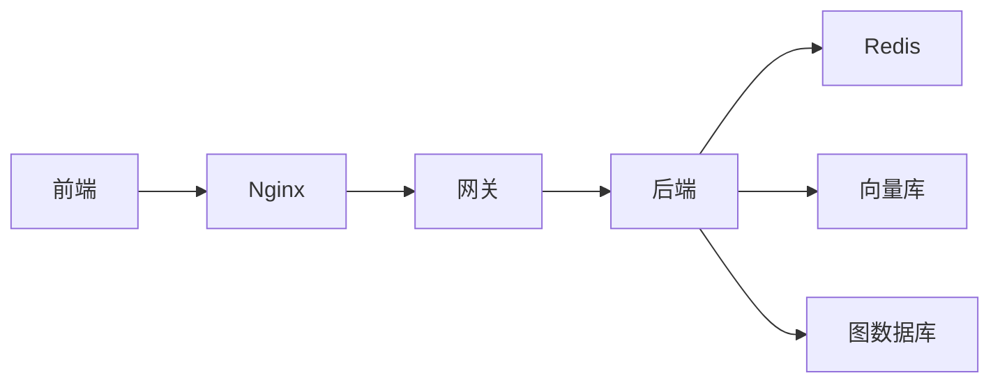

# 网络隔离策略

<cite>
**本文引用的文件**   
- [docker-compose.yml](file://docker-compose.yml)
- [backend_design/nexus/main.py](file://backend_design/nexus/main.py)
- [backend_design/nexus/config.py](file://backend_design/nexus/config.py)
- [backend_design/nexus/core/auth.py](file://backend_design/nexus/core/auth.py)
- [backend_design/nexus/api/routes/auth.py](file://backend_design/nexus/api/routes/auth.py)
- [backend_design/nexus_gate/cmd/main.go](file://backend_design/nexus_gate/cmd/main.go)
- [backend_design/nexus_gate/internal/proxy/proxy.go](file://backend_design/nexus_gate/internal/proxy/proxy.go)
- [backend_design/nexus_gate/internal/auth/jwt.go](file://backend_design/nexus_gate/internal/auth/jwt.go)
- [backend_design/nexus_gate/internal/ratelimit/ratelimit.go](file://backend_design/nexus_gate/internal/ratelimit/ratelimit.go)
- [config/nginx/...](file://config/nginx/)
- [backend_design/Dockerfile](file://backend_design/Dockerfile)
- [frontend_design/Dockerfile](file://frontend_design/Dockerfile)
- [backend_design/nexus_gate/Dockerfile](file://backend_design/nexus_gate/Dockerfile)
- [docs/architecture/L0-infrastructure.md](file://docs/architecture/L0-infrastructure.md)
- [docs/architecture/L1-core.md](file://docs/architecture/L1-core.md)
- [docs/architecture/L2-data.md](file://docs/architecture/L2-data.md)
- [docs/architecture/L3-service.md](file://docs/architecture/L3-service.md)
- [docs/architecture/L5-middleware.md](file://docs/architecture/L5-middleware.md)
- [docs/architecture/L6-api.md](file://docs/architecture/L6-api.md)
- [docs/architecture/L7-observability.md](file://docs/architecture/L7-observability.md)
</cite>

## 目录
1. [简介](#简介)
2. [项目结构](#项目结构)
3. [核心组件](#核心组件)
4. [架构总览](#架构总览)
5. [详细组件分析](#详细组件分析)
6. [依赖关系分析](#依赖关系分析)
7. [性能与可扩展性](#性能与可扩展性)
8. [故障排查指南](#故障排查指南)
9. [结论](#结论)
10. [附录](#附录)

## 简介
本指南聚焦 NexusCockpit 的网络隔离策略，围绕以下目标展开：
- Docker 网络命名空间隔离、自定义网络拓扑、服务发现与负载均衡
- 微服务间通信安全：mTLS 双向认证、服务网格配置、零信任架构
- VPC 与网络分段：生产环境隔离、开发测试分离、数据库网络隔离
- 容器网络安全最佳实践：最小权限原则、网络策略、安全组配置
- 跨域资源共享（CORS）的安全配置与域名绑定策略

本指南既提供高层架构说明，也给出与代码映射的落地建议，帮助读者在生产环境中实现可验证、可运维、可审计的网络隔离。

## 项目结构
NexusCockpit 采用前后端分离与网关代理的分层架构：
- 前端 Next.js 应用通过反向代理对外暴露
- Go 编写的网关负责鉴权、限流、路由与转发
- Python 后端提供业务 API、WebSocket 与中间件能力
- 数据层包含向量库、图数据库、缓存等外部依赖
- 编排与镜像构建由 docker-compose 与 Dockerfile 管理

图表来源
- [docker-compose.yml](file://docker-compose.yml)
- [backend_design/nexus_gate/cmd/main.go](file://backend_design/nexus_gate/cmd/main.go)
- [backend_design/nexus/main.py](file://backend_design/nexus/main.py)

章节来源
- [docker-compose.yml](file://docker-compose.yml)
- [backend_design/Dockerfile](file://backend_design/Dockerfile)
- [frontend_design/Dockerfile](file://frontend_design/Dockerfile)
- [backend_design/nexus_gate/Dockerfile](file://backend_design/nexus_gate/Dockerfile)

## 核心组件
- 网关（nexus-gate）
  - 职责：统一入口、JWT 鉴权、请求限流、路径路由、到后端的透明转发
  - 关键模块：主程序入口、代理转发、鉴权、限流
- 后端（Python）
  - 职责：业务 API、WebSocket、中间件（速率限制、缓存、任务队列）、模型与工具集成
  - 关键模块：应用启动、认证上下文、API 路由、中间件
- 前端（Next.js）
  - 职责：用户界面、SSR/静态资源、与后端 API 交互
- 反向代理（Nginx）
  - 职责：域名解析、HTTPS 终止、静态资源托管、将流量分发至网关或前端
- 数据与中间件
  - Redis：会话、缓存、任务队列
  - 其他数据源：向量库、图数据库、关系型数据库

章节来源
- [backend_design/nexus_gate/cmd/main.go](file://backend_design/nexus_gate/cmd/main.go)
- [backend_design/nexus_gate/internal/proxy/proxy.go](file://backend_design/nexus_gate/internal/proxy/proxy.go)
- [backend_design/nexus_gate/internal/auth/jwt.go](file://backend_design/nexus_gate/internal/auth/jwt.go)
- [backend_design/nexus_gate/internal/ratelimit/ratelimit.go](file://backend_design/nexus_gate/internal/ratelimit/ratelimit.go)
- [backend_design/nexus/main.py](file://backend_design/nexus/main.py)
- [backend_design/nexus/core/auth.py](file://backend_design/nexus/core/auth.py)
- [backend_design/nexus/api/routes/auth.py](file://backend_design/nexus/api/routes/auth.py)

## 架构总览
下图展示了从浏览器到数据层的端到端调用链，以及各层在网络上的边界与隔离点。

图表来源
- [backend_design/nexus_gate/cmd/main.go](file://backend_design/nexus_gate/cmd/main.go)
- [backend_design/nexus_gate/internal/proxy/proxy.go](file://backend_design/nexus_gate/internal/proxy/proxy.go)
- [backend_design/nexus/main.py](file://backend_design/nexus/main.py)
- [docker-compose.yml](file://docker-compose.yml)

## 详细组件分析

### Docker 网络命名空间与自定义拓扑
- 网络命名空间
  - 每个容器拥有独立网络栈，默认桥接网络用于同主机容器互通
  - 使用自定义网络实现逻辑隔离，避免默认网络的广播风暴与不可控访问
- 自定义网络拓扑
  - 为不同层级创建独立网络：如 ingress、app、data
  - 仅允许必要端口在相邻层级之间互通，禁止跨层直连
- 服务发现
  - 基于 Docker Compose 的服务名解析，容器间通过服务名访问
  - 结合健康检查确保只将流量导向可用实例
- 负载均衡
  - 网关侧对后端多实例进行轮询或加权转发
  - 前端静态资源可由反向代理直接返回，减少网关压力

章节来源
- [docker-compose.yml](file://docker-compose.yml)

### 微服务间通信安全（mTLS、服务网格、零信任）
- mTLS 双向认证
  - 在网关与后端之间启用 TLS，证书由可信 CA 签发
  - 服务端校验客户端证书，客户端校验服务端证书
  - 密钥与证书集中管理，定期轮换
- 服务网格配置
  - 若引入 Sidecar 模式，可在网格中强制 mTLS、细粒度访问控制与遥测
  - 未引入网格时，可通过网关与反向代理实现等效的访问控制与加密
- 零信任架构
  - 不信任任何内网流量，所有请求均需鉴权与授权
  - 基于 JWT 的无状态鉴权，结合短期令牌与刷新机制
  - 最小权限：按角色与资源维度限制访问范围

图表来源
- [backend_design/nexus_gate/cmd/main.go](file://backend_design/nexus_gate/cmd/main.go)
- [backend_design/nexus_gate/internal/auth/jwt.go](file://backend_design/nexus_gate/internal/auth/jwt.go)
- [backend_design/nexus/core/auth.py](file://backend_design/nexus/core/auth.py)

章节来源
- [backend_design/nexus_gate/internal/auth/jwt.go](file://backend_design/nexus_gate/internal/auth/jwt.go)
- [backend_design/nexus/core/auth.py](file://backend_design/nexus/core/auth.py)

### VPC 与网络分段
- 生产环境隔离
  - 将网关、应用、数据分别置于不同子网与安全组
  - 仅开放必要的公网入口（网关），其余流量走私有网络
- 开发测试环境分离
  - 使用独立 VPC 或命名空间，避免与生产共享资源
  - 通过环境变量区分配置，防止误用生产凭据
- 数据库网络隔离
  - 数据库仅对应用层开放端口，禁止直接对外暴露
  - 使用只读副本与备份网络，进一步降低风险

章节来源
- [docs/architecture/L0-infrastructure.md](file://docs/architecture/L0-infrastructure.md)
- [docs/architecture/L2-data.md](file://docs/architecture/L2-data.md)

### 容器网络安全最佳实践
- 最小权限原则
  - 容器仅暴露必要端口；使用非 root 用户运行
  - 文件系统只读挂载，敏感信息通过密钥管理注入
- 网络策略
  - 使用 Kubernetes NetworkPolicy 或云厂商安全组限制入出站规则
  - 白名单机制：仅允许已知服务与端口通信
- 安全组配置
  - 入口层仅放行 443/80，且限制来源 IP 段
  - 应用层仅对网关开放；数据层仅对应用层开放

章节来源
- [docs/architecture/L0-infrastructure.md](file://docs/architecture/L0-infrastructure.md)
- [docs/architecture/L3-service.md](file://docs/architecture/L3-service.md)

### CORS 安全配置与域名绑定策略
- CORS 安全配置
  - 明确允许的源（Origin）、方法、头部与凭据策略
  - 禁止通配符源与任意方法，结合网关或反向代理统一管控
- 域名绑定策略
  - 使用固定域名与 HTTPS，开启 HSTS
  - 通过反向代理进行域名与路径匹配，将流量精准分发到网关或前端
  - 多租户或多环境场景下，使用子域名或路径前缀隔离

章节来源
- [backend_design/nexus/main.py](file://backend_design/nexus/main.py)
- [backend_design/nexus/api/routes/auth.py](file://backend_design/nexus/api/routes/auth.py)
- [config/nginx/...](file://config/nginx/)

## 依赖关系分析
- 组件耦合
  - 网关强依赖鉴权与限流模块；后端依赖认证上下文与中间件
  - 前端与后端通过 REST/WebSocket 交互，需保证接口契约稳定
- 外部依赖
  - Redis 作为会话与缓存，需高可用与持久化策略
  - 向量库与图数据库需网络隔离与访问控制
- 潜在循环依赖
  - 网关不应反向依赖后端业务逻辑；后端不应反向依赖网关实现细节

图表来源
- [docker-compose.yml](file://docker-compose.yml)
- [backend_design/nexus_gate/cmd/main.go](file://backend_design/nexus_gate/cmd/main.go)
- [backend_design/nexus/main.py](file://backend_design/nexus/main.py)

章节来源
- [backend_design/nexus_gate/cmd/main.go](file://backend_design/nexus_gate/cmd/main.go)
- [backend_design/nexus/main.py](file://backend_design/nexus/main.py)

## 性能与可扩展性
- 水平扩展
  - 网关与后端均支持多实例部署，配合负载均衡提升吞吐
  - 前端静态资源通过 CDN 加速，减少回源压力
- 缓存与队列
  - 热点数据缓存于 Redis，降低数据库压力
  - 异步任务通过队列解耦，提高系统弹性
- 监控与可观测性
  - 指标、日志与链路追踪贯穿各层，便于定位瓶颈与异常

章节来源
- [docs/architecture/L7-observability.md](file://docs/architecture/L7-observability.md)
- [backend_design/nexus/middleware/task_queue.py](file://backend_design/nexus/middleware/task_queue.py)
- [backend_design/nexus/middleware/redis_cache.py](file://backend_design/nexus/middleware/redis_cache.py)

## 故障排查指南
- 鉴权失败
  - 检查 JWT 签名与有效期，确认密钥一致
  - 查看网关与后端的鉴权日志，定位具体失败原因
- 连接超时
  - 核对网络策略与安全组，确认端口与来源 IP 白名单
  - 检查健康检查与就绪探针，确保实例可用
- CORS 错误
  - 校验 Origin、方法与头部是否在允许列表中
  - 确认反向代理是否正确附加响应头
- 限流触发
  - 调整限流阈值与窗口大小，观察 QPS 与延迟变化
  - 针对热点接口实施缓存与降级策略

章节来源
- [backend_design/nexus_gate/internal/auth/jwt.go](file://backend_design/nexus_gate/internal/auth/jwt.go)
- [backend_design/nexus_gate/internal/ratelimit/ratelimit.go](file://backend_design/nexus_gate/internal/ratelimit/ratelimit.go)
- [backend_design/nexus/core/auth.py](file://backend_design/nexus/core/auth.py)

## 结论
通过分层网络隔离、严格的鉴权与 mTLS、最小权限与白名单策略，NexusCockpit 能够在生产环境中实现高安全、高可用的网络架构。建议在引入服务网格后进一步强化零信任与细粒度访问控制，并结合可观测性体系持续优化性能与稳定性。

## 附录
- 参考文档
  - 基础设施与网络设计
  - 核心服务与数据层设计
  - 中间件与可观测性

章节来源
- [docs/architecture/L0-infrastructure.md](file://docs/architecture/L0-infrastructure.md)
- [docs/architecture/L1-core.md](file://docs/architecture/L1-core.md)
- [docs/architecture/L2-data.md](file://docs/architecture/L2-data.md)
- [docs/architecture/L3-service.md](file://docs/architecture/L3-service.md)
- [docs/architecture/L5-middleware.md](file://docs/architecture/L5-middleware.md)
- [docs/architecture/L6-api.md](file://docs/architecture/L6-api.md)
- [docs/architecture/L7-observability.md](file://docs/architecture/L7-observability.md)