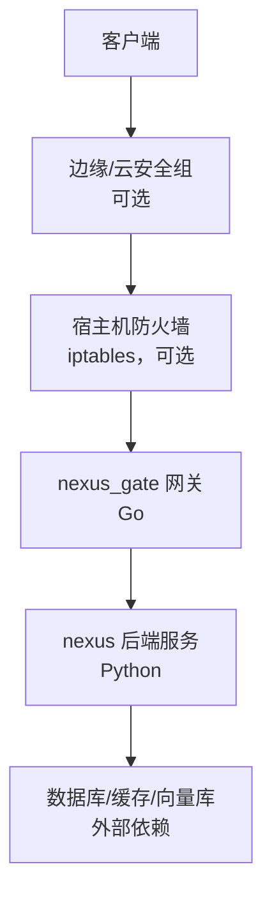
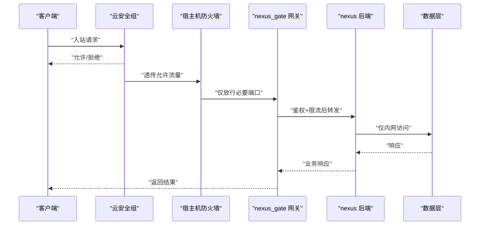
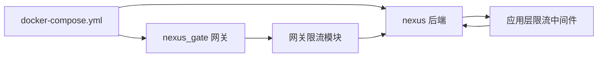

# 防火墙规则配置

<cite>
**本文引用的文件**   
- [docker-compose.yml](file://docker-compose.yml)
- [backend_design/nexus/main.py](file://backend_design/nexus/main.py)
- [backend_design/nexus/config.py](file://backend_design/nexus/config.py)
- [backend_design/nexus/middleware/rate_limiter.py](file://backend_design/nexus/middleware/rate_limiter.py)
- [backend_design/nexus_gate/internal/ratelimit/ratelimit.go](file://backend_design/nexus_gate/internal/ratelimit/ratelimit.go)
- [backend_design/nexus_gate/internal/proxy/proxy.go](file://backend_design/nexus_gate/internal/proxy/proxy.go)
- [config/nginx/README.md](file://config/nginx/README.md)
- [docs/deployment/SETUP.md](file://docs/deployment/SETUP.md)
</cite>

## 目录
1. [简介](#简介)
2. [项目结构](#项目结构)
3. [核心组件](#核心组件)
4. [架构总览](#架构总览)
5. [详细组件分析](#详细组件分析)
6. [依赖关系分析](#依赖关系分析)
7. [性能考虑](#性能考虑)
8. [故障排查指南](#故障排查指南)
9. [结论](#结论)
10. [附录](#附录)

## 简介
本指南面向 NexusCockpit 的部署与运维人员，聚焦于“防火墙规则配置”主题，覆盖以下方面：
- Docker 网络隔离与服务间通信控制、端口暴露策略
- 宿主机防火墙（iptables）基础规则、端口访问控制与 IP 白名单
- DDoS 防护思路：连接数限制、请求频率控制、异常流量识别
- 云环境网络安全组示例：AWS、阿里云、腾讯云
- 网络监控与入侵检测集成建议：Fail2ban、OSSEC 等

说明：本项目仓库未包含现成的 iptables/Fail2ban/OSSEC 脚本或云厂商安全组模板。本节提供基于仓库现有组件（网关、限流中间件、Docker Compose）的安全加固实践与参考配置方法，便于在真实环境中落地。

## 项目结构
NexusCockpit 采用前后端分离与微服务化设计，关键与安全相关的入口包括：
- 反向代理/网关层：Go 实现的 nexus_gate，负责鉴权、限流、转发
- Python 后端：nexus 应用，提供 API 与业务逻辑
- 编排与网络：docker-compose.yml 定义容器网络与端口映射
- 文档与部署指引：docs/deployment/SETUP.md 提供运行与验证步骤

图示来源
- [docker-compose.yml](file://docker-compose.yml)
- [backend_design/nexus_gate/internal/proxy/proxy.go](file://backend_design/nexus_gate/internal/proxy/proxy.go)
- [backend_design/nexus/main.py](file://backend_design/nexus/main.py)

章节来源
- [docker-compose.yml](file://docker-compose.yml)
- [docs/deployment/SETUP.md](file://docs/deployment/SETUP.md)

## 核心组件
- 网关与限流
  - Go 网关提供鉴权与限流能力，限流实现位于独立模块中，用于保护后端接口免受滥用。
  - 参考路径：[ratelimit 实现](file://backend_design/nexus_gate/internal/ratelimit/ratelimit.go)、[网关代理转发](file://backend_design/nexus_gate/internal/proxy/proxy.go)。
- 后端限流中间件
  - Python 侧提供速率限制中间件，可在应用层对特定路由进行二次限速与熔断保护。
  - 参考路径：[rate_limiter 中间件](file://backend_design/nexus/middleware/rate_limiter.py)。
- 应用启动与配置
  - 主入口与配置加载位置，便于结合环境变量注入安全参数（如监听地址、TLS、超时等）。
  - 参考路径：[main 入口](file://backend_design/nexus/main.py)、[配置模块](file://backend_design/nexus/config.py)。
- 容器编排与网络
  - docker-compose.yml 定义服务网络、端口映射与内部通信方式，是实施网络隔离与最小暴露面的关键。
  - 参考路径：[编排文件](file://docker-compose.yml)。

章节来源
- [backend_design/nexus_gate/internal/ratelimit/ratelimit.go](file://backend_design/nexus_gate/internal/ratelimit/ratelimit.go)
- [backend_design/nexus_gate/internal/proxy/proxy.go](file://backend_design/nexus_gate/internal/proxy/proxy.go)
- [backend_design/nexus/middleware/rate_limiter.py](file://backend_design/nexus/middleware/rate_limiter.py)
- [backend_design/nexus/main.py](file://backend_design/nexus/main.py)
- [backend_design/nexus/config.py](file://backend_design/nexus/config.py)
- [docker-compose.yml](file://docker-compose.yml)

## 架构总览
下图展示从客户端到后端的请求链路，以及各层可落地的安全控制点：
- 云安全组：在云厂商层面仅放行必要端口（如 443/80），屏蔽管理端口
- 宿主机防火墙：进一步收紧入站规则，限制来源 IP 段
- 网关层：鉴权、限流、协议校验、请求大小限制
- 应用层：中间件级限流、会话与上下文校验
- 数据层：仅允许通过内网访问，禁止直接暴露

图示来源
- [docker-compose.yml](file://docker-compose.yml)
- [backend_design/nexus_gate/internal/proxy/proxy.go](file://backend_design/nexus_gate/internal/proxy/proxy.go)
- [backend_design/nexus/middleware/rate_limiter.py](file://backend_design/nexus/middleware/rate_limiter.py)

## 详细组件分析

### Docker 网络隔离与端口暴露策略
- 自定义网络
  - 使用独立的 Docker 网络将业务容器与外部隔离，避免默认 bridge 网络的广播域风险。
  - 在编排文件中为服务分配固定子网与别名，便于服务发现与访问控制。
- 服务间通信控制
  - 仅开放必要的内部端口；对外暴露面尽量收敛至网关端口。
  - 通过标签或网络策略限制跨网络访问（若使用支持网络策略的编排器）。
- 端口暴露策略
  - 仅暴露 Web 管理端口（如 443/80）给公网；数据库、缓存、向量库等仅绑定 127.0.0.1 或仅在内网网络可见。
  - 对调试与管理端口严格限制来源 IP 或使用跳板机访问。

章节来源
- [docker-compose.yml](file://docker-compose.yml)

### 宿主机防火墙规则（iptables）
- 基本原则
  - 默认拒绝入站，仅放行必要端口；记录并告警可疑流量。
- 典型规则要点
  - 放行已建立连接的回包（状态跟踪）
  - 仅允许来自可信网段的 SSH 与管理端口
  - 仅开放网关对外端口（如 443/80）
  - 对高频失败连接进行计数与封禁（配合 fail2ban 更佳）
- 建议流程
  - 先以日志模式试运行，确认无误后再生效
  - 定期审计规则，清理过期条目

章节来源
- [docs/deployment/SETUP.md](file://docs/deployment/SETUP.md)

### DDoS 防护措施
- 连接数限制
  - 在网关层限制单 IP 并发连接数与每秒新建连接数，防止资源耗尽。
- 请求频率控制
  - 网关与应用层双重限流：网关做粗粒度限制，应用层针对敏感接口做细粒度限制。
  - 参考路径：
    - [网关限流实现](file://backend_design/nexus_gate/internal/ratelimit/ratelimit.go)
    - [应用层限流中间件](file://backend_design/nexus/middleware/rate_limiter.py)
- 异常流量识别
  - 结合日志与指标（QPS、错误率、延迟分布）设置阈值告警
  - 对异常 UA、超大请求体、畸形路径进行拦截
  - 在网关层启用请求体大小限制与超时控制

章节来源
- [backend_design/nexus_gate/internal/ratelimit/ratelimit.go](file://backend_design/nexus_gate/internal/ratelimit/ratelimit.go)
- [backend_design/nexus/middleware/rate_limiter.py](file://backend_design/nexus/middleware/rate_limiter.py)

### 云环境网络安全组配置示例
- AWS 安全组
  - 入站仅允许 443/80 来自公网；SSH 仅允许企业出口 IP
  - 出站允许访问内网网段与必要的外部依赖（如对象存储、第三方 API）
- 阿里云安全组
  - 入站放行 443/80；管理端口仅对堡垒机网段开放
  - 开启“自动封禁恶意扫描”与“CC 防护”增强
- 腾讯云安全组
  - 入站仅开放 Web 端口；数据库与缓存不对外开放
  - 结合 WAF 与 DDoS 高防产品提升抗攻击能力

说明：以上为通用最佳实践示例，具体需根据实际端口与网段调整。

章节来源
- [docs/deployment/SETUP.md](file://docs/deployment/SETUP.md)

### 网络监控与入侵检测集成
- Fail2ban
  - 监控 Nginx/Gateway 日志，对频繁失败的登录或管理接口触发临时封禁
  - 与 iptables 联动，动态更新黑名单
- OSSEC/HIDS
  - 安装主机入侵检测系统，监控关键文件完整性与异常进程
  - 结合 SIEM 集中告警
- 指标与日志
  - 采集网关与应用层的 QPS、错误码、延迟分位值
  - 对突发流量与异常模式设置告警阈值

章节来源
- [docs/deployment/SETUP.md](file://docs/deployment/SETUP.md)

## 依赖关系分析
- 网关与后端
  - 网关作为统一入口，承担鉴权与限流职责，降低后端暴露面
  - 后端仅在内部网络提供服务，减少被直接探测的风险
- 编排与网络
  - docker-compose.yml 决定端口暴露范围与网络拓扑，是安全基线的重要部分
- 限流与中间件
  - 网关与应用层限流形成双层防护，有效缓解突发流量与暴力破解

图示来源
- [docker-compose.yml](file://docker-compose.yml)
- [backend_design/nexus_gate/internal/ratelimit/ratelimit.go](file://backend_design/nexus_gate/internal/ratelimit/ratelimit.go)
- [backend_design/nexus/middleware/rate_limiter.py](file://backend_design/nexus/middleware/rate_limiter.py)

章节来源
- [docker-compose.yml](file://docker-compose.yml)
- [backend_design/nexus_gate/internal/ratelimit/ratelimit.go](file://backend_design/nexus_gate/internal/ratelimit/ratelimit.go)
- [backend_design/nexus/middleware/rate_limiter.py](file://backend_design/nexus/middleware/rate_limiter.py)

## 性能考虑
- 合理设置限流阈值，避免误伤正常用户
- 对热点接口启用缓存与降级策略
- 在网关层启用连接复用与超时控制，减少资源占用
- 对大请求体与长连接进行限制，防止慢速攻击

## 故障排查指南
- 无法访问
  - 检查云安全组与宿主机防火墙是否放行必要端口
  - 核对 docker-compose.yml 中的端口映射与网络绑定
- 频繁限流
  - 查看网关与应用层限流日志，定位触发阈值与来源 IP
  - 评估是否需要放宽阈值或引入更精细的路由策略
- 异常流量
  - 结合日志与指标定位异常来源，必要时在网关层或防火墙层临时封禁
  - 启用更详细的访问日志与请求采样，辅助取证

章节来源
- [docs/deployment/SETUP.md](file://docs/deployment/SETUP.md)

## 结论
通过“云安全组 + 宿主机防火墙 + 网关限流 + 应用层中间件”的分层防护体系，NexusCockpit 可在多环境下实现最小暴露面与较强的抗攻击能力。建议在上线前完成规则演练与压测，确保限流阈值与告警策略与实际负载匹配。

## 附录
- 相关参考路径
  - [网关代理转发](file://backend_design/nexus_gate/internal/proxy/proxy.go)
  - [应用主入口与配置](file://backend_design/nexus/main.py)
  - [配置模块](file://backend_design/nexus/config.py)
  - [Nginx 配置说明](file://config/nginx/README.md)