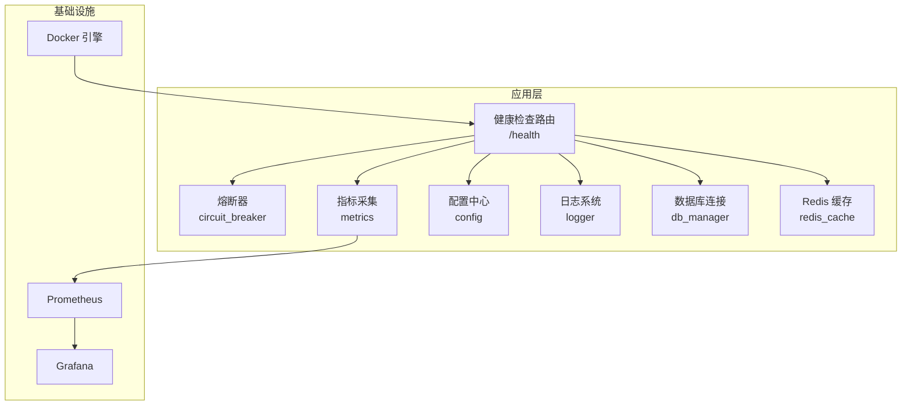
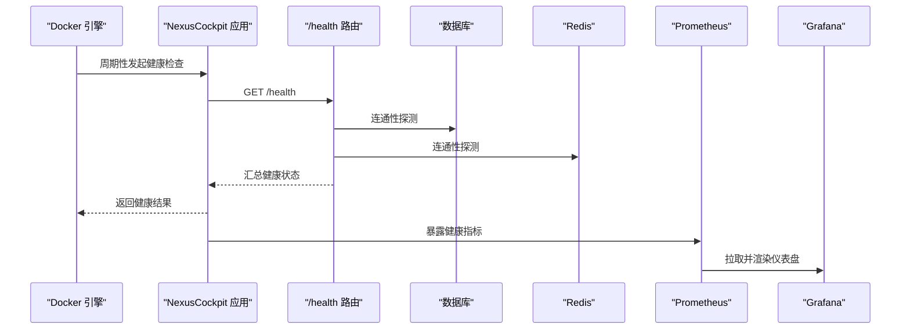
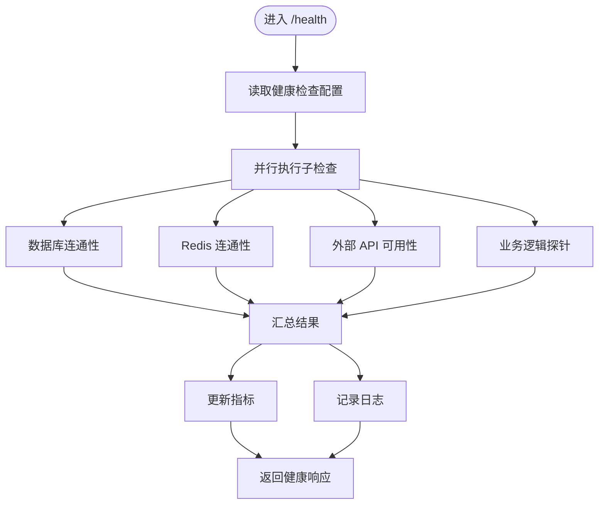
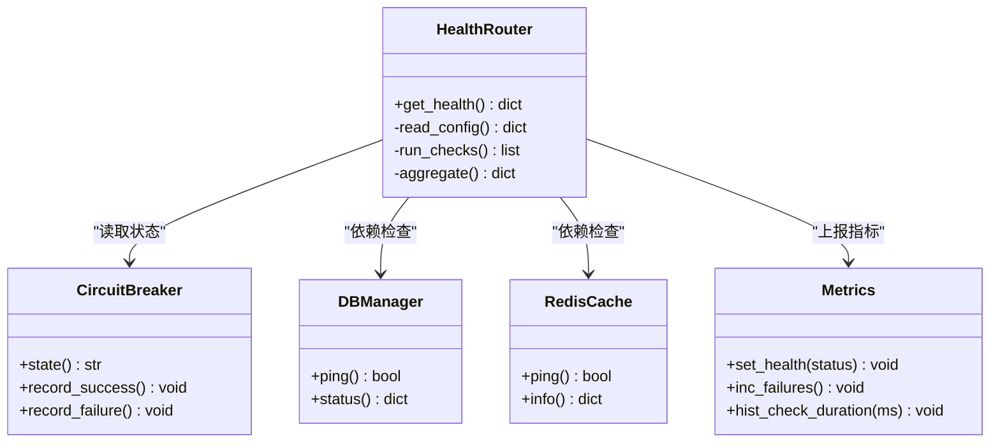
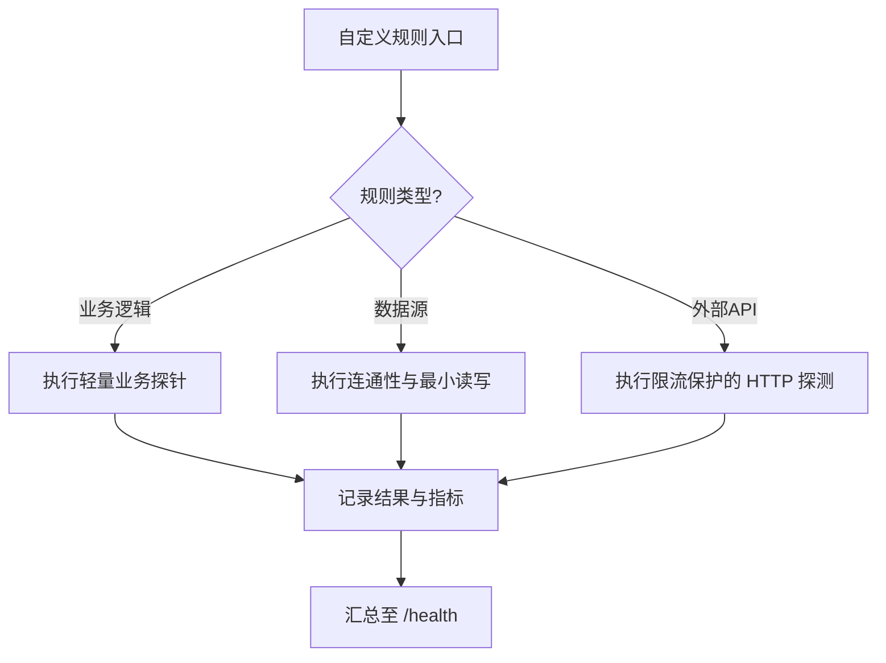
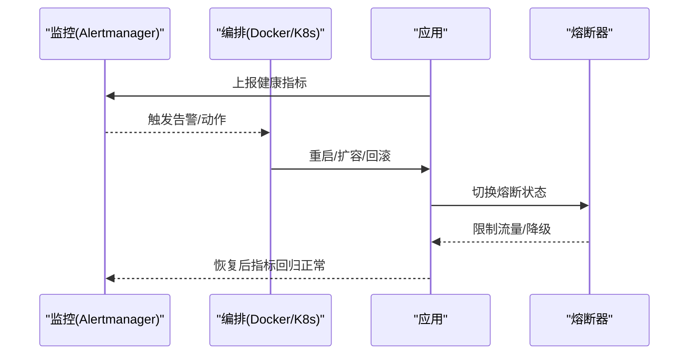
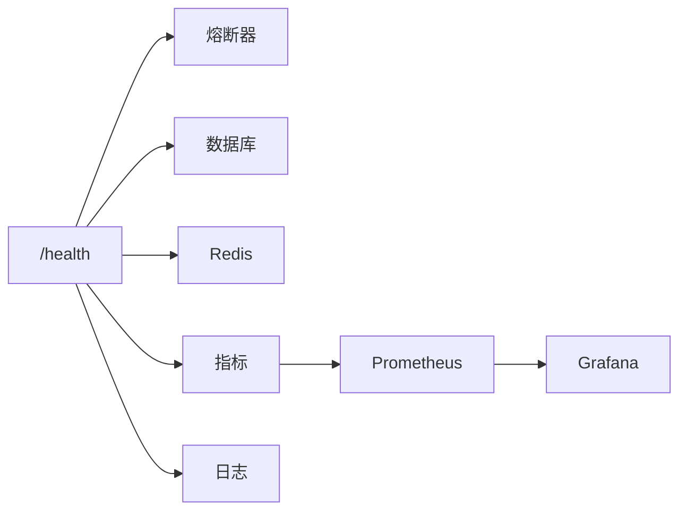

# 健康检查策略

<cite>
**本文引用的文件**   
- [backend_design/nexus/api/routes/health.py](file://backend_design/nexus/api/routes/health.py)
- [backend_design/nexus/core/circuit_breaker.py](file://backend_design/nexus/core/circuit_breaker.py)
- [backend_design/nexus/observability/metrics.py](file://backend_design/nexus/observability/metrics.py)
- [backend_design/nexus/config.py](file://backend_design/nexus/config.py)
- [backend_design/Dockerfile](file://backend_design/Dockerfile)
- [docker-compose.yml](file://docker-compose.yml)
- [config/prometheus/prometheus.yml](file://config/prometheus/prometheus.yml)
- [config/grafana/provisioning/dashboards/nexuscockpit-overview.json](file://config/grafana/provisioning/dashboards/nexuscockpit-overview.json)
- [backend_design/nexus/core/logger.py](file://backend_design/nexus/core/logger.py)
- [backend_design/nexus/core/db_manager.py](file://backend_design/nexus/core/db_manager.py)
- [backend_design/nexus/middleware/redis_cache.py](file://backend_design/nexus/middleware/redis_cache.py)
</cite>

## 目录
1. [简介](#简介)
2. [项目结构](#项目结构)
3. [核心组件](#核心组件)
4. [架构总览](#架构总览)
5. [详细组件分析](#详细组件分析)
6. [依赖关系分析](#依赖关系分析)
7. [性能考虑](#性能考虑)
8. [故障排查指南](#故障排查指南)
9. [结论](#结论)
10. [附录](#附录)

## 简介
本指南面向 NexusCockpit 的健康检查策略，覆盖应用层健康检查端点设计、Docker 健康检查配置、多级健康检查机制（进程级、服务级、依赖级）、自定义健康检查规则（业务逻辑验证、数据源连通性、外部 API 可用性），以及健康检查告警与故障恢复自动化流程。目标是帮助运维与研发人员快速落地可观测、可自愈的高可用方案。

## 项目结构
NexusCockpit 后端基于 Python，提供 REST 接口与中间件能力；前端为 Next.js 应用；部署使用 Docker Compose，并集成 Prometheus/Grafana 进行监控与可视化。与健康检查相关的核心位置如下：
- 应用层健康检查路由：backend_design/nexus/api/routes/health.py
- 熔断器与降级：backend_design/nexus/core/circuit_breaker.py
- 指标采集与暴露：backend_design/nexus/observability/metrics.py
- 配置项：backend_design/nexus/config.py
- 日志与错误记录：backend_design/nexus/core/logger.py
- 数据库连接管理：backend_design/nexus/core/db_manager.py
- Redis 缓存中间件：backend_design/nexus/middleware/redis_cache.py
- 容器镜像构建：backend_design/Dockerfile
- 编排与服务发现：docker-compose.yml
- 监控抓取与仪表盘：config/prometheus/prometheus.yml, config/grafana/provisioning/dashboards/nexuscockpit-overview.json

图表来源
- [backend_design/nexus/api/routes/health.py](file://backend_design/nexus/api/routes/health.py)
- [backend_design/nexus/core/circuit_breaker.py](file://backend_design/nexus/core/circuit_breaker.py)
- [backend_design/nexus/observability/metrics.py](file://backend_design/nexus/observability/metrics.py)
- [backend_design/nexus/config.py](file://backend_design/nexus/config.py)
- [backend_design/nexus/core/logger.py](file://backend_design/nexus/core/logger.py)
- [backend_design/nexus/core/db_manager.py](file://backend_design/nexus/core/db_manager.py)
- [backend_design/nexus/middleware/redis_cache.py](file://backend_design/nexus/middleware/redis_cache.py)
- [config/prometheus/prometheus.yml](file://config/prometheus/prometheus.yml)
- [config/grafana/provisioning/dashboards/nexuscockpit-overview.json](file://config/grafana/provisioning/dashboards/nexuscockpit-overview.json)
- [docker-compose.yml](file://docker-compose.yml)

章节来源
- [backend_design/nexus/api/routes/health.py](file://backend_design/nexus/api/routes/health.py)
- [backend_design/nexus/core/circuit_breaker.py](file://backend_design/nexus/core/circuit_breaker.py)
- [backend_design/nexus/observability/metrics.py](file://backend_design/nexus/observability/metrics.py)
- [backend_design/nexus/config.py](file://backend_design/nexus/config.py)
- [backend_design/nexus/core/logger.py](file://backend_design/nexus/core/logger.py)
- [backend_design/nexus/core/db_manager.py](file://backend_design/nexus/core/db_manager.py)
- [backend_design/nexus/middleware/redis_cache.py](file://backend_design/nexus/middleware/redis_cache.py)
- [config/prometheus/prometheus.yml](file://config/prometheus/prometheus.yml)
- [config/grafana/provisioning/dashboards/nexuscockpit-overview.json](file://config/grafana/provisioning/dashboards/nexuscockpit-overview.json)
- [docker-compose.yml](file://docker-compose.yml)

## 核心组件
- 健康检查路由 /health
  - 职责：聚合进程、服务、依赖健康状态，返回统一的结构化响应；支持细粒度子检查项。
  - 关键行为：读取配置阈值、调用各子系统探针、汇总结果、写入指标与日志。
- 熔断器 circuit_breaker
  - 职责：对下游依赖进行失败率与延迟控制，避免雪崩；与健康检查联动，将“半开/打开”状态纳入整体健康判定。
- 指标采集 metrics
  - 职责：暴露健康相关指标（如健康状态、检查耗时、失败次数等），供 Prometheus 抓取。
- 配置 config
  - 职责：集中管理健康检查间隔、超时、重试、阈值、开关等参数。
- 日志 logger
  - 职责：记录健康检查执行过程、异常与告警事件，便于排障。
- 数据库 db_manager
  - 职责：提供数据库连通性探测与基础元信息（版本、连接池状态）。
- Redis redis_cache
  - 职责：提供缓存连通性探测与基本容量指标。

章节来源
- [backend_design/nexus/api/routes/health.py](file://backend_design/nexus/api/routes/health.py)
- [backend_design/nexus/core/circuit_breaker.py](file://backend_design/nexus/core/circuit_breaker.py)
- [backend_design/nexus/observability/metrics.py](file://backend_design/nexus/observability/metrics.py)
- [backend_design/nexus/config.py](file://backend_design/nexus/config.py)
- [backend_design/nexus/core/logger.py](file://backend_design/nexus/core/logger.py)
- [backend_design/nexus/core/db_manager.py](file://backend_design/nexus/core/db_manager.py)
- [backend_design/nexus/middleware/redis_cache.py](file://backend_design/nexus/middleware/redis_cache.py)

## 架构总览
下图展示从 Docker 到应用层再到监控系统的健康检查链路。

图表来源
- [backend_design/nexus/api/routes/health.py](file://backend_design/nexus/api/routes/health.py)
- [backend_design/nexus/core/db_manager.py](file://backend_design/nexus/core/db_manager.py)
- [backend_design/nexus/middleware/redis_cache.py](file://backend_design/nexus/middleware/redis_cache.py)
- [backend_design/nexus/observability/metrics.py](file://backend_design/nexus/observability/metrics.py)
- [config/prometheus/prometheus.yml](file://config/prometheus/prometheus.yml)
- [config/grafana/provisioning/dashboards/nexuscockpit-overview.json](file://config/grafana/provisioning/dashboards/nexuscockpit-overview.json)
- [docker-compose.yml](file://docker-compose.yml)

## 详细组件分析

### 应用层健康检查端点 /health
- 设计要点
  - 分层检查：进程级（存活、内存/CPU 占用）、服务级（内部模块就绪）、依赖级（数据库、缓存、外部 API）。
  - 阈值与权重：通过配置定义各子检查的权重与阈值，按加权或门限策略得出整体健康。
  - 幂等与低开销：健康检查应快速返回，避免阻塞主请求路径。
  - 可观测性：输出结构化 JSON，包含子检查明细、耗时、错误码与诊断信息；同时更新指标。
- 典型实现流程
  - 读取配置（间隔、超时、阈值）
  - 并行执行子检查（数据库、缓存、外部 API、业务探针）
  - 汇总结果并计算整体健康
  - 写入日志与指标
  - 返回统一响应体

图表来源
- [backend_design/nexus/api/routes/health.py](file://backend_design/nexus/api/routes/health.py)
- [backend_design/nexus/core/db_manager.py](file://backend_design/nexus/core/db_manager.py)
- [backend_design/nexus/middleware/redis_cache.py](file://backend_design/nexus/middleware/redis_cache.py)
- [backend_design/nexus/observability/metrics.py](file://backend_design/nexus/observability/metrics.py)
- [backend_design/nexus/config.py](file://backend_design/nexus/config.py)

章节来源
- [backend_design/nexus/api/routes/health.py](file://backend_design/nexus/api/routes/health.py)
- [backend_design/nexus/core/db_manager.py](file://backend_design/nexus/core/db_manager.py)
- [backend_design/nexus/middleware/redis_cache.py](file://backend_design/nexus/middleware/redis_cache.py)
- [backend_design/nexus/observability/metrics.py](file://backend_design/nexus/observability/metrics.py)
- [backend_design/nexus/config.py](file://backend_design/nexus/config.py)

### 多级健康检查机制
- 进程级
  - 目标：确保应用进程存活且资源占用在合理范围。
  - 指标：进程 PID、内存占用、CPU 使用率、GC/线程数（如适用）。
  - 策略：超过阈值标记为警告或失败，结合熔断器限制流量。
- 服务级
  - 目标：确认核心模块就绪（路由、任务队列、消息通道等）。
  - 指标：模块就绪标志、队列积压、WebSocket 连接数。
  - 策略：任一关键模块不可用则整体不健康。
- 依赖级
  - 目标：校验外部依赖可达性与可用性（数据库、缓存、对象存储、第三方 API）。
  - 指标：连通性、延迟、错误率、熔断状态。
  - 策略：根据权重与阈值决定整体健康；必要时触发降级。

图表来源
- [backend_design/nexus/api/routes/health.py](file://backend_design/nexus/api/routes/health.py)
- [backend_design/nexus/core/circuit_breaker.py](file://backend_design/nexus/core/circuit_breaker.py)
- [backend_design/nexus/core/db_manager.py](file://backend_design/nexus/core/db_manager.py)
- [backend_design/nexus/middleware/redis_cache.py](file://backend_design/nexus/middleware/redis_cache.py)
- [backend_design/nexus/observability/metrics.py](file://backend_design/nexus/observability/metrics.py)

章节来源
- [backend_design/nexus/api/routes/health.py](file://backend_design/nexus/api/routes/health.py)
- [backend_design/nexus/core/circuit_breaker.py](file://backend_design/nexus/core/circuit_breaker.py)
- [backend_design/nexus/core/db_manager.py](file://backend_design/nexus/core/db_manager.py)
- [backend_design/nexus/middleware/redis_cache.py](file://backend_design/nexus/middleware/redis_cache.py)
- [backend_design/nexus/observability/metrics.py](file://backend_design/nexus/observability/metrics.py)

### Docker 健康检查配置
- 建议设置
  - 检查间隔：5–10 秒
  - 超时时间：3–5 秒
  - 重试次数：3–5 次
  - 健康阈值：连续成功次数达到阈值后标记为 healthy
  - 不健康阈值：连续失败次数达到阈值后标记为 unhealthy
- 配置方式
  - 在 Dockerfile 中定义 HEALTHCHECK 指令，指向 /health 端点。
  - 在 docker-compose.yml 中可通过 healthcheck 字段覆盖默认值，并与 depends_on 的 condition 配合启动顺序。
- 注意事项
  - 健康检查应避免重 IO 与长耗时操作。
  - 对于冷启动场景，适当放宽初始阈值。
  - 若使用反向代理，需确保代理层也具备健康检查与优雅退出。

章节来源
- [backend_design/Dockerfile](file://backend_design/Dockerfile)
- [docker-compose.yml](file://docker-compose.yml)

### 自定义健康检查规则
- 业务逻辑验证
  - 示例：关键任务调度器是否运行、最近 N 分钟是否有成功作业、用户会话是否正常创建。
  - 建议：以轻量查询或本地状态为准，避免跨网络调用。
- 数据源连通性
  - 示例：数据库 ping、最小读写事务、索引/表存在性检查；Redis ping 与 key 读写。
  - 建议：区分只读与读写探针，降低写放大。
- 外部 API 可用性
  - 示例：HTTP HEAD/GET 探测、签名校验、限流保护。
  - 建议：结合熔断器与退避重试，失败时降级为只读模式。

图表来源
- [backend_design/nexus/api/routes/health.py](file://backend_design/nexus/api/routes/health.py)
- [backend_design/nexus/core/db_manager.py](file://backend_design/nexus/core/db_manager.py)
- [backend_design/nexus/middleware/redis_cache.py](file://backend_design/nexus/middleware/redis_cache.py)

章节来源
- [backend_design/nexus/api/routes/health.py](file://backend_design/nexus/api/routes/health.py)
- [backend_design/nexus/core/db_manager.py](file://backend_design/nexus/core/db_manager.py)
- [backend_design/nexus/middleware/redis_cache.py](file://backend_design/nexus/middleware/redis_cache.py)

### 健康检查告警与故障恢复自动化
- 告警配置
  - 在 Prometheus 中定义规则，针对健康状态、失败次数、检查耗时等指标触发告警。
  - Grafana 仪表盘用于可视化健康趋势与依赖状态。
- 故障恢复自动化
  - 自动重启：当 Docker 健康检查连续失败超过阈值，由编排层重启容器。
  - 熔断与降级：熔断器打开后，/health 返回部分健康，路由层降级非关键功能。
  - 弹性扩缩容：基于健康与负载指标，由编排平台自动扩容实例。
  - 回滚策略：新版本健康检查失败时，自动回滚到上一稳定版本。

图表来源
- [config/prometheus/prometheus.yml](file://config/prometheus/prometheus/prometheus.yml)
- [config/grafana/provisioning/dashboards/nexuscockpit-overview.json](file://config/grafana/provisioning/dashboards/nexuscockpit-overview.json)
- [docker-compose.yml](file://docker-compose.yml)
- [backend_design/nexus/core/circuit_breaker.py](file://backend_design/nexus/core/circuit_breaker.py)

章节来源
- [config/prometheus/prometheus.yml](file://config/prometheus/prometheus/prometheus.yml)
- [config/grafana/provisioning/dashboards/nexuscockpit-overview.json](file://config/grafana/provisioning/dashboards/nexuscockpit-overview.json)
- [docker-compose.yml](file://docker-compose.yml)
- [backend_design/nexus/core/circuit_breaker.py](file://backend_design/nexus/core/circuit_breaker.py)

## 依赖关系分析
- 组件耦合
  - /health 路由依赖配置、熔断器、数据库、Redis、指标与日志。
  - 熔断器独立于具体依赖，仅关注成功率与延迟统计。
  - 指标与日志作为横切关注点，被多个组件复用。
- 外部依赖
  - Prometheus 抓取指标，Grafana 展示仪表盘。
  - Docker 编排负责健康检查与生命周期管理。

图表来源
- [backend_design/nexus/api/routes/health.py](file://backend_design/nexus/api/routes/health.py)
- [backend_design/nexus/core/circuit_breaker.py](file://backend_design/nexus/core/circuit_breaker.py)
- [backend_design/nexus/core/db_manager.py](file://backend_design/nexus/core/db_manager.py)
- [backend_design/nexus/middleware/redis_cache.py](file://backend_design/nexus/middleware/redis_cache.py)
- [backend_design/nexus/observability/metrics.py](file://backend_design/nexus/observability/metrics.py)
- [config/prometheus/prometheus.yml](file://config/prometheus/prometheus.yml)
- [config/grafana/provisioning/dashboards/nexuscockpit-overview.json](file://config/grafana/provisioning/dashboards/nexuscockpit-overview.json)

章节来源
- [backend_design/nexus/api/routes/health.py](file://backend_design/nexus/api/routes/health.py)
- [backend_design/nexus/core/circuit_breaker.py](file://backend_design/nexus/core/circuit_breaker.py)
- [backend_design/nexus/core/db_manager.py](file://backend_design/nexus/core/db_manager.py)
- [backend_design/nexus/middleware/redis_cache.py](file://backend_design/nexus/middleware/redis_cache.py)
- [backend_design/nexus/observability/metrics.py](file://backend_design/nexus/observability/metrics.py)
- [config/prometheus/prometheus.yml](file://config/prometheus/prometheus.yml)
- [config/grafana/provisioning/dashboards/nexuscockpit-overview.json](file://config/grafana/provisioning/dashboards/nexuscockpit-overview.json)

## 性能考虑
- 健康检查应短小精悍，避免阻塞与重 IO。
- 子检查尽量并行执行，减少端到端延迟。
- 对慢依赖采用熔断与超时控制，防止级联失败。
- 指标采样与日志级别按需调整，避免高吞吐下的额外开销。
- 冷启动阶段放宽健康阈值，缩短就绪等待时间。

## 故障排查指南
- 常见问题定位
  - 健康检查超时：检查网络、依赖端口、防火墙策略。
  - 数据库不可用：查看连接池、认证、权限与锁等待。
  - Redis 不可用：检查密码、ACL、内存与持久化状态。
  - 外部 API 失败：核对签名、限流、证书与域名解析。
- 排障步骤
  - 查看 /health 返回的子检查详情与错误码。
  - 检索日志中的健康检查记录与异常堆栈。
  - 观察 Prometheus 指标与 Grafana 仪表盘的趋势变化。
  - 逐步隔离依赖，定位根因。

章节来源
- [backend_design/nexus/core/logger.py](file://backend_design/nexus/core/logger.py)
- [backend_design/nexus/core/db_manager.py](file://backend_design/nexus/core/db_manager.py)
- [backend_design/nexus/middleware/redis_cache.py](file://backend_design/nexus/middleware/redis_cache.py)
- [backend_design/nexus/observability/metrics.py](file://backend_design/nexus/observability/metrics.py)

## 结论
通过分层健康检查、熔断与指标告警的协同，NexusCockpit 可实现高可用的运行态保障。建议在上线前完成阈值调优与演练，确保在真实故障场景下能快速发现、自动恢复与有效告警。

## 附录
- 最佳实践清单
  - 明确健康检查 SLA（延迟、成功率）。
  - 为每个依赖定义独立的探针与阈值。
  - 将健康检查纳入变更发布流水线，失败即阻断。
  - 定期演练故障注入与恢复流程。
- 参考配置位置
  - 健康检查路由：[backend_design/nexus/api/routes/health.py](file://backend_design/nexus/api/routes/health.py)
  - 熔断器：[backend_design/nexus/core/circuit_breaker.py](file://backend_design/nexus/core/circuit_breaker.py)
  - 指标：[backend_design/nexus/observability/metrics.py](file://backend_design/nexus/observability/metrics.py)
  - 配置：[backend_design/nexus/config.py](file://backend_design/nexus/config.py)
  - 日志：[backend_design/nexus/core/logger.py](file://backend_design/nexus/core/logger.py)
  - 数据库：[backend_design/nexus/core/db_manager.py](file://backend_design/nexus/core/db_manager.py)
  - Redis：[backend_design/nexus/middleware/redis_cache.py](file://backend_design/nexus/middleware/redis_cache.py)
  - Docker 健康检查：[backend_design/Dockerfile](file://backend_design/Dockerfile), [docker-compose.yml](file://docker-compose.yml)
  - 监控与仪表盘：[config/prometheus/prometheus.yml](file://config/prometheus/prometheus.yml), [config/grafana/provisioning/dashboards/nexuscockpit-overview.json](file://config/grafana/provisioning/dashboards/nexuscockpit-overview.json)