# 故障转移与恢复

<cite>
**本文引用的文件**   
- [backend_design/nexus/core/circuit_breaker.py](file://backend_design/nexus/core/circuit_breaker.py)
- [backend_design/nexus/core/db_manager.py](file://backend_design/nexus/core/db_manager.py)
- [backend_design/nexus/middleware/redis_cache.py](file://backend_design/nexus/middleware/redis_cache.py)
- [backend_design/nexus/api/routes/health.py](file://backend_design/nexus/api/routes/health.py)
- [backend_design/nexus/config.py](file://backend_design/nexus/config.py)
- [backend_design/nexus/main.py](file://backend_design/nexus/main.py)
- [backend_design/nexus/observability/metrics.py](file://backend_design/nexus/observability/metrics.py)
- [backend_design/nexus/observability/cockpit_metrics.py](file://backend_design/nexus/observability/cockpit_metrics.py)
- [backend_design/nexus/api/websocket.py](file://backend_design/nexus/api/websocket.py)
- [backend_design/nexus/middleware/task_queue.py](file://backend_design/nexus/middleware/task_queue.py)
- [backend_design/nexus/vehicle/http.py](file://backend_design/nexus/vehicle/http.py)
- [backend_design/nexus/intent/llm_router.py](file://backend_design/nexus/intent/llm_router.py)
- [backend_design/nexus/skills/orchestrator.py](file://backend_design/nexus/skills/orchestrator.py)
- [backend_design/nexus/memory/manager.py](file://backend_design/nexus/memory/manager.py)
- [backend_design/nexus/rag/unified_retriever.py](file://backend_design/nexus/rag/unified_retriever.py)
- [docker-compose.yml](file://docker-compose.yml)
</cite>

## 目录
1. [简介](#简介)
2. [项目结构](#项目结构)
3. [核心组件](#核心组件)
4. [架构总览](#架构总览)
5. [详细组件分析](#详细组件分析)
6. [依赖关系分析](#依赖关系分析)
7. [性能考量](#性能考量)
8. [故障排查指南](#故障排查指南)
9. [结论](#结论)
10. [附录](#附录)

## 简介
本文件聚焦 NexusCockpit 的“故障转移与自动恢复”机制，围绕以下目标展开：
- 服务重启策略配置：自动重启条件、重启延迟、最大重启次数限制。
- 熔断器模式实现：熔断阈值、降级策略、快速失败机制。
- 优雅关闭处理：请求完成等待、资源清理、连接断开。
- 依赖服务故障处理：数据库连接池、缓存失效、外部 API 降级。
- 故障检测与自动恢复流程：异常监控、告警通知、自愈操作。

为便于不同技术背景的读者理解，文档采用由浅入深的层次化组织，并辅以架构图、时序图与流程图进行可视化说明。

## 项目结构
NexusCockpit 后端基于 Python（FastAPI）构建，关键容错能力分布在核心模块、中间件、可观测性与网关层。下图展示与故障转移和恢复相关的核心文件及其职责边界。

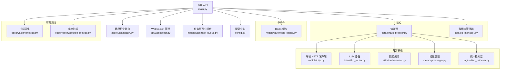

图表来源
- [backend_design/nexus/main.py](file://backend_design/nexus/main.py)
- [backend_design/nexus/api/routes/health.py](file://backend_design/nexus/api/routes/health.py)
- [backend_design/nexus/api/websocket.py](file://backend_design/nexus/api/websocket.py)
- [backend_design/nexus/middleware/task_queue.py](file://backend_design/nexus/middleware/task_queue.py)
- [backend_design/nexus/config.py](file://backend_design/nexus/config.py)
- [backend_design/nexus/core/circuit_breaker.py](file://backend_design/nexus/core/circuit_breaker.py)
- [backend_design/nexus/core/db_manager.py](file://backend_design/nexus/core/db_manager.py)
- [backend_design/nexus/middleware/redis_cache.py](file://backend_design/nexus/middleware/redis_cache.py)
- [backend_design/nexus/observability/metrics.py](file://backend_design/nexus/observability/metrics.py)
- [backend_design/nexus/observability/cockpit_metrics.py](file://backend_design/nexus/observability/cockpit_metrics.py)
- [backend_design/nexus/vehicle/http.py](file://backend_design/nexus/vehicle/http.py)
- [backend_design/nexus/intent/llm_router.py](file://backend_design/nexus/intent/llm_router.py)
- [backend_design/nexus/skills/orchestrator.py](file://backend_design/nexus/skills/orchestrator.py)
- [backend_design/nexus/memory/manager.py](file://backend_design/nexus/memory/manager.py)
- [backend_design/nexus/rag/unified_retriever.py](file://backend_design/nexus/rag/unified_retriever.py)

章节来源
- [backend_design/nexus/main.py](file://backend_design/nexus/main.py)
- [backend_design/nexus/config.py](file://backend_design/nexus/config.py)

## 核心组件
本节概述与故障转移和恢复直接相关的关键组件及其职责。

- 熔断器（Circuit Breaker）
  - 负责对外部依赖调用进行短路、半开探测与快速失败，避免雪崩。
  - 典型状态包括：关闭（正常）、打开（熔断）、半开（试探）。
  - 通过统计错误率/失败次数、时间窗口等触发切换。

- 数据库管理器（DB Manager）
  - 封装连接池生命周期、重试与回退逻辑。
  - 提供健康探针与断线重连能力。

- Redis 缓存中间件
  - 提供读写缓存、失效回退到源数据或默认值。
  - 在缓存不可用时快速失败或走降级路径。

- 健康检查路由
  - 暴露 /health 等端点，聚合各子系统健康状态，供负载均衡与编排系统使用。

- WebSocket 管理
  - 维护长连接会话，支持优雅关闭时的连接清理与消息缓冲策略。

- 任务队列中间件
  - 对耗时任务进行异步化与限流，避免阻塞主线程。
  - 在下游不可用时执行快速失败或本地缓存策略。

- 可观测性（指标与日志）
  - 采集熔断状态、错误率、P99/P95 延迟、连接池状态等指标。
  - 将关键事件上报至监控系统，支撑告警与自愈决策。

章节来源
- [backend_design/nexus/core/circuit_breaker.py](file://backend_design/nexus/core/circuit_breaker.py)
- [backend_design/nexus/core/db_manager.py](file://backend_design/nexus/core/db_manager.py)
- [backend_design/nexus/middleware/redis_cache.py](file://backend_design/nexus/middleware/redis_cache.py)
- [backend_design/nexus/api/routes/health.py](file://backend_design/nexus/api/routes/health.py)
- [backend_design/nexus/api/websocket.py](file://backend_design/nexus/api/websocket.py)
- [backend_design/nexus/middleware/task_queue.py](file://backend_design/nexus/middleware/task_queue.py)
- [backend_design/nexus/observability/metrics.py](file://backend_design/nexus/observability/metrics.py)
- [backend_design/nexus/observability/cockpit_metrics.py](file://backend_design/nexus/observability/cockpit_metrics.py)

## 架构总览
下图展示了从请求进入、经过熔断与降级、到最终返回或失败的完整链路，以及健康检查与可观测性如何贯穿其中。

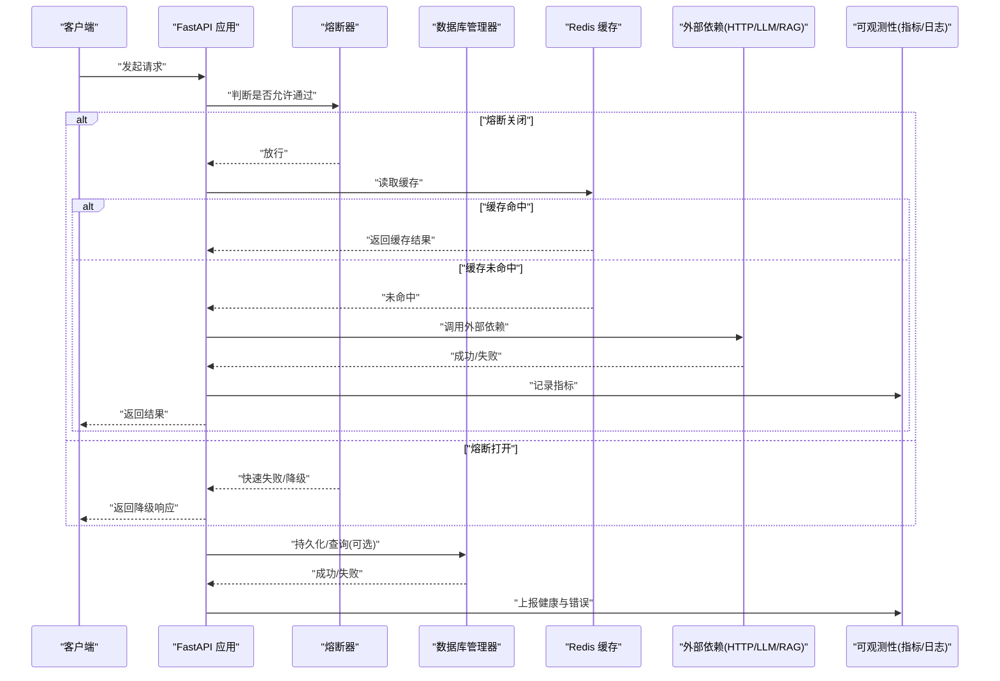

图表来源
- [backend_design/nexus/api/routes/health.py](file://backend_design/nexus/api/routes/health.py)
- [backend_design/nexus/core/circuit_breaker.py](file://backend_design/nexus/core/circuit_breaker.py)
- [backend_design/nexus/core/db_manager.py](file://backend_design/nexus/core/db_manager.py)
- [backend_design/nexus/middleware/redis_cache.py](file://backend_design/nexus/middleware/redis_cache.py)
- [backend_design/nexus/observability/metrics.py](file://backend_design/nexus/observability/metrics.py)

## 详细组件分析

### 熔断器模式（Circuit Breaker）
- 设计要点
  - 状态机：关闭→打开→半开→关闭。
  - 触发条件：错误率/失败次数超过阈值；时间窗口内连续失败。
  - 半开探测：周期性放行少量请求以探测恢复。
  - 快速失败：打开状态下立即返回降级响应，避免放大故障。
- 降级策略
  - 返回默认值或最近一次成功结果。
  - 切换到只读路径或本地缓存。
  - 针对特定依赖（如 LLM、RAG、车辆控制）分别定义降级行为。
- 指标与告警
  - 上报熔断状态、切换次数、错误率、延迟分位。
  - 结合 Prometheus/Grafana 设置阈值告警。

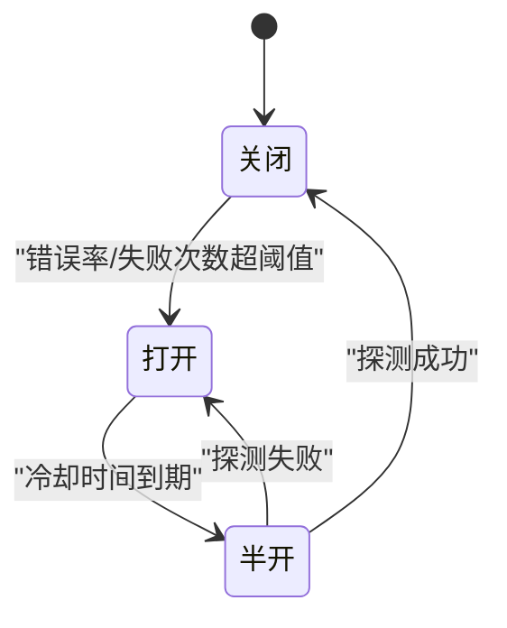

图表来源
- [backend_design/nexus/core/circuit_breaker.py](file://backend_design/nexus/core/circuit_breaker.py)

章节来源
- [backend_design/nexus/core/circuit_breaker.py](file://backend_design/nexus/core/circuit_breaker.py)

### 数据库连接池与重连
- 连接池管理
  - 初始化时建立最小连接数，按需扩容。
  - 定期健康检查，剔除不可用连接。
- 故障处理
  - 连接丢失时自动重连，带指数退避与最大重试次数。
  - 在重连期间对写操作快速失败，读操作可尝试只读副本或缓存。
- 健康探针
  - /health 中集成数据库连通性检查，返回整体健康状态。

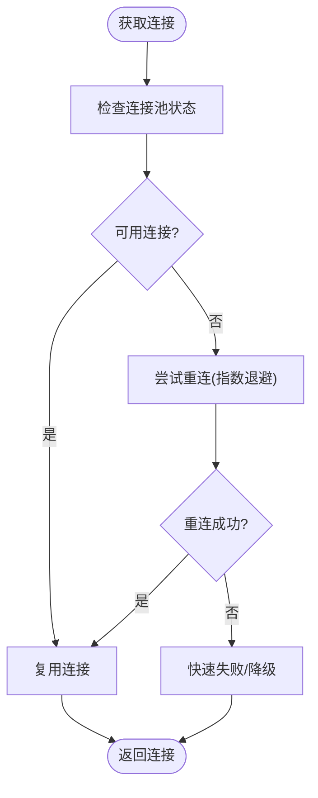

图表来源
- [backend_design/nexus/core/db_manager.py](file://backend_design/nexus/core/db_manager.py)
- [backend_design/nexus/api/routes/health.py](file://backend_design/nexus/api/routes/health.py)

章节来源
- [backend_design/nexus/core/db_manager.py](file://backend_design/nexus/core/db_manager.py)
- [backend_design/nexus/api/routes/health.py](file://backend_design/nexus/api/routes/health.py)

### Redis 缓存失效与降级
- 缓存策略
  - 读多写少场景优先命中缓存。
  - 缓存失效时回源数据或默认值。
- 故障处理
  - 缓存不可用时快速失败，直接走源数据路径或返回降级响应。
  - 对热点键做本地小缓存，降低对远端缓存的依赖。
- 指标与监控
  - 上报命中率、错误率、延迟。

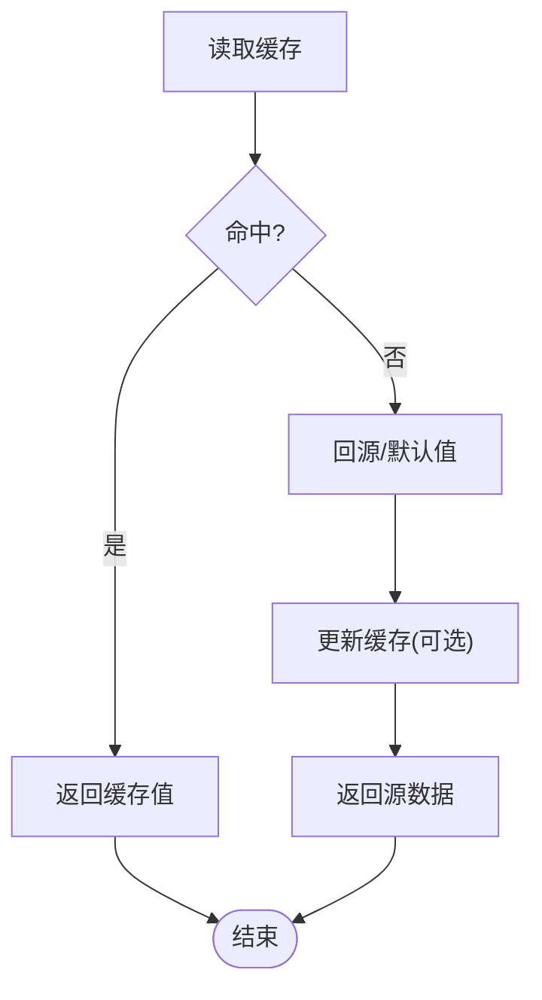

图表来源
- [backend_design/nexus/middleware/redis_cache.py](file://backend_design/nexus/middleware/redis_cache.py)

章节来源
- [backend_design/nexus/middleware/redis_cache.py](file://backend_design/nexus/middleware/redis_cache.py)

### 外部 API 降级（车辆控制、LLM、RAG）
- 车辆 HTTP 客户端
  - 超时、重试、熔断保护。
  - 失败时返回安全默认值或提示用户稍后重试。
- LLM 路由
  - 多模型路由与回退，按质量/成本/可用性选择。
  - 当所有模型不可用时，返回模板化回复或引导离线模式。
- RAG 检索
  - 向量库不可用时回退到关键词检索或静态知识库。
  - 检索失败时返回部分结果并标注置信度。

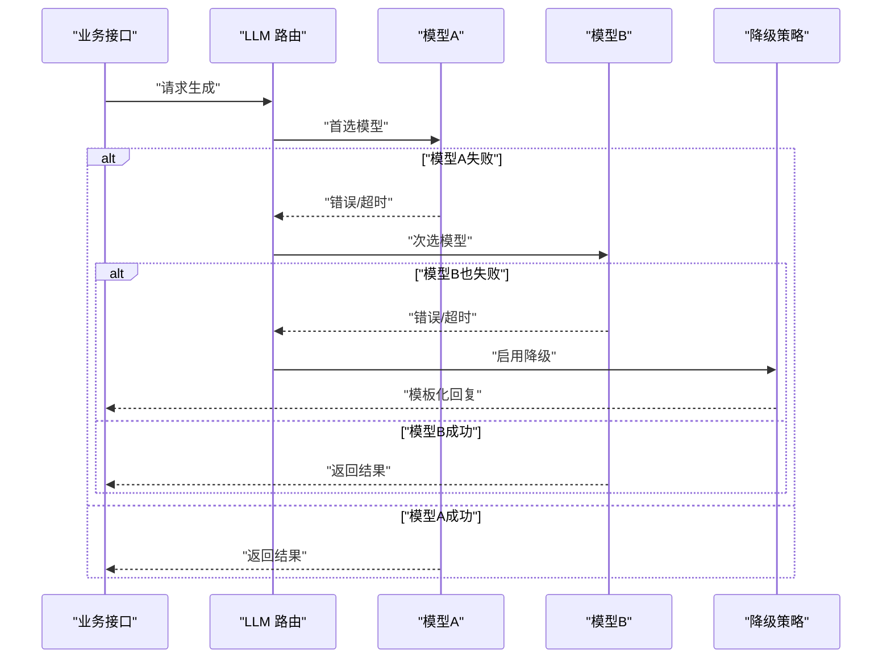

图表来源
- [backend_design/nexus/intent/llm_router.py](file://backend_design/nexus/intent/llm_router.py)
- [backend_design/nexus/vehicle/http.py](file://backend_design/nexus/vehicle/http.py)
- [backend_design/nexus/rag/unified_retriever.py](file://backend_design/nexus/rag/unified_retriever.py)

章节来源
- [backend_design/nexus/intent/llm_router.py](file://backend_design/nexus/intent/llm_router.py)
- [backend_design/nexus/vehicle/http.py](file://backend_design/nexus/vehicle/http.py)
- [backend_design/nexus/rag/unified_retriever.py](file://backend_design/nexus/rag/unified_retriever.py)

### 优雅关闭处理
- 请求完成等待
  - 停止接收新请求，等待已接入请求处理完成。
  - 对长时间运行的任务进行中断或延后处理。
- 资源清理
  - 关闭数据库连接池、释放锁与临时文件。
  - 清空内存中的热点缓存，避免脏数据。
- 连接断开
  - 主动关闭 WebSocket 连接，发送关闭帧并清理会话。
  - 通知上游负载均衡摘除实例。

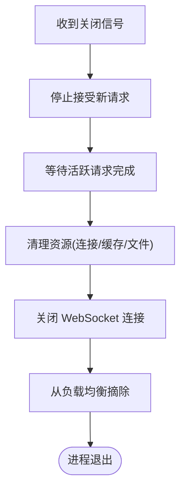

图表来源
- [backend_design/nexus/api/websocket.py](file://backend_design/nexus/api/websocket.py)
- [backend_design/nexus/core/db_manager.py](file://backend_design/nexus/core/db_manager.py)

章节来源
- [backend_design/nexus/api/websocket.py](file://backend_design/nexus/api/websocket.py)
- [backend_design/nexus/core/db_manager.py](file://backend_design/nexus/core/db_manager.py)

### 任务队列与背压
- 异步化
  - 将耗时任务放入队列，避免阻塞主线程。
- 限流与背压
  - 根据队列长度与消费者处理能力动态调整入队速率。
  - 在下游不可用时快速失败或落盘重试。
- 幂等与重试
  - 任务具备唯一 ID，支持幂等处理。
  - 失败时按策略重试，避免重复副作用。

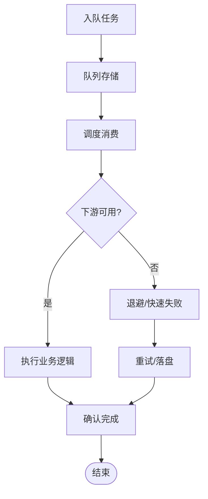

图表来源
- [backend_design/nexus/middleware/task_queue.py](file://backend_design/nexus/middleware/task_queue.py)

章节来源
- [backend_design/nexus/middleware/task_queue.py](file://backend_design/nexus/middleware/task_queue.py)

### 记忆与状态一致性
- 记忆管理
  - 在故障发生时保证会话状态的一致性。
  - 支持快照与增量合并，减少恢复开销。
- 一致性策略
  - 先写缓存再写持久化，失败时补偿。
  - 冲突解决策略：最后写入胜出或合并策略。

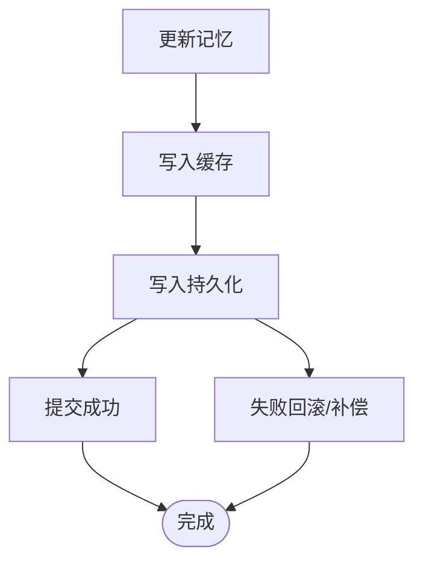

图表来源
- [backend_design/nexus/memory/manager.py](file://backend_design/nexus/memory/manager.py)

章节来源
- [backend_design/nexus/memory/manager.py](file://backend_design/nexus/memory/manager.py)

### 服务重启策略与自愈
- 自动重启条件
  - 进程崩溃、健康检查失败、OOM 等触发重启。
- 重启延迟与最大次数
  - 指数退避防止频繁重启风暴。
  - 设置最大重启次数，超过则告警并人工介入。
- 编排与容器
  - 通过编排系统（如 Docker Compose/Kubernetes）实现重启与滚动升级。

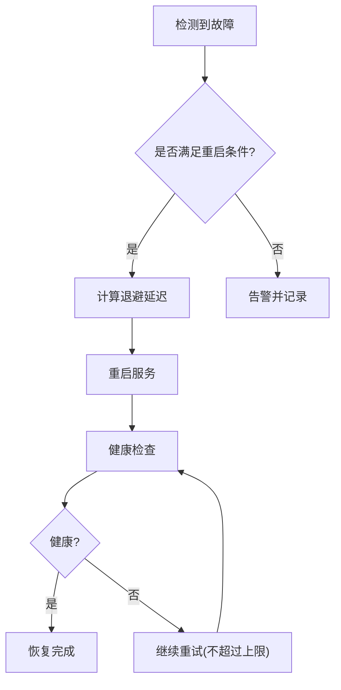

图表来源
- [docker-compose.yml](file://docker-compose.yml)
- [backend_design/nexus/api/routes/health.py](file://backend_design/nexus/api/routes/health.py)

章节来源
- [docker-compose.yml](file://docker-compose.yml)
- [backend_design/nexus/api/routes/health.py](file://backend_design/nexus/api/routes/health.py)

## 依赖关系分析
下图展示关键组件之间的依赖与交互关系，突出熔断、缓存、数据库与外部依赖的耦合点。

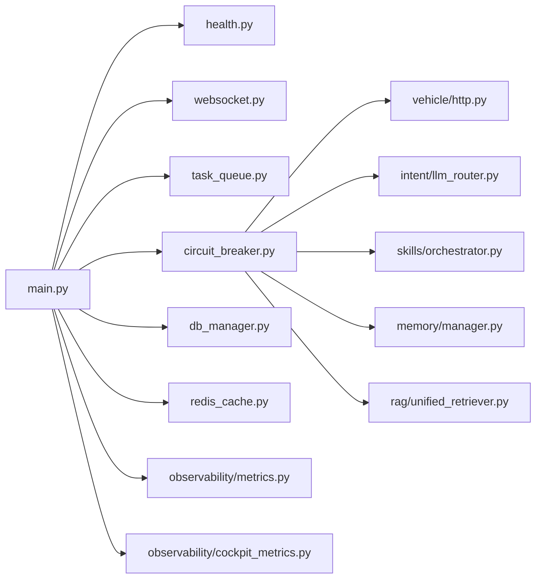

图表来源
- [backend_design/nexus/main.py](file://backend_design/nexus/main.py)
- [backend_design/nexus/api/routes/health.py](file://backend_design/nexus/api/routes/health.py)
- [backend_design/nexus/api/websocket.py](file://backend_design/nexus/api/websocket.py)
- [backend_design/nexus/middleware/task_queue.py](file://backend_design/nexus/middleware/task_queue.py)
- [backend_design/nexus/core/circuit_breaker.py](file://backend_design/nexus/core/circuit_breaker.py)
- [backend_design/nexus/core/db_manager.py](file://backend_design/nexus/core/db_manager.py)
- [backend_design/nexus/middleware/redis_cache.py](file://backend_design/nexus/middleware/redis_cache.py)
- [backend_design/nexus/observability/metrics.py](file://backend_design/nexus/observability/metrics.py)
- [backend_design/nexus/observability/cockpit_metrics.py](file://backend_design/nexus/observability/cockpit_metrics.py)
- [backend_design/nexus/vehicle/http.py](file://backend_design/nexus/vehicle/http.py)
- [backend_design/nexus/intent/llm_router.py](file://backend_design/nexus/intent/llm_router.py)
- [backend_design/nexus/skills/orchestrator.py](file://backend_design/nexus/skills/orchestrator.py)
- [backend_design/nexus/memory/manager.py](file://backend_design/nexus/memory/manager.py)
- [backend_design/nexus/rag/unified_retriever.py](file://backend_design/nexus/rag/unified_retriever.py)

章节来源
- [backend_design/nexus/main.py](file://backend_design/nexus/main.py)

## 性能考量
- 熔断参数调优
  - 合理设置错误率阈值与时间窗口，避免误判与过度敏感。
  - 半开探测频率需平衡恢复速度与稳定性。
- 连接池容量
  - 根据并发量与下游吞吐调整最小/最大连接数。
  - 监控连接等待时间与泄漏风险。
- 缓存命中率
  - 优化 TTL 与预热策略，提升命中率。
  - 关注缓存穿透与雪崩防护。
- 任务队列
  - 根据消费者数量与处理能力调整并行度。
  - 监控队列堆积与消费延迟。

[本节为通用指导，不直接分析具体文件]

## 故障排查指南
- 健康检查
  - 访问 /health 查看各子系统状态，定位故障域。
- 指标与日志
  - 查看熔断状态、错误率、延迟分位、连接池状态等指标。
  - 结合日志追踪关键路径的错误堆栈与上下文。
- 常见症状与对策
  - 高错误率：检查下游依赖、网络抖动、证书过期。
  - 连接池耗尽：增加连接数、优化慢查询、排查连接泄漏。
  - 缓存不可用：启用降级路径、回源数据、本地缓存兜底。
  - 任务堆积：扩容消费者、限流入队、快速失败策略。

章节来源
- [backend_design/nexus/api/routes/health.py](file://backend_design/nexus/api/routes/health.py)
- [backend_design/nexus/observability/metrics.py](file://backend_design/nexus/observability/metrics.py)
- [backend_design/nexus/observability/cockpit_metrics.py](file://backend_design/nexus/observability/cockpit_metrics.py)

## 结论
NexusCockpit 通过熔断器、连接池管理、缓存降级、任务队列与可观测性体系，构建了较为完善的故障转移与自动恢复能力。建议在生产环境中持续优化熔断与连接池参数，完善健康检查与告警规则，并结合编排系统进行自动化重启与滚动升级，以提升整体系统的韧性与可用性。

[本节为总结性内容，不直接分析具体文件]

## 附录
- 配置项参考
  - 熔断器：错误率阈值、时间窗口、半开探测间隔、最大重试次数。
  - 连接池：最小/最大连接数、空闲超时、健康检查周期。
  - 缓存：TTL、最大条目数、回源策略。
  - 任务队列：消费者数量、重试策略、死信队列。
- 部署建议
  - 使用编排系统实现健康检查驱动的自动重启与滚动升级。
  - 分离读写路径，利用只读副本提升容错能力。
  - 对关键依赖实施独立熔断与隔离，避免级联故障。

[本节为补充信息，不直接分析具体文件]