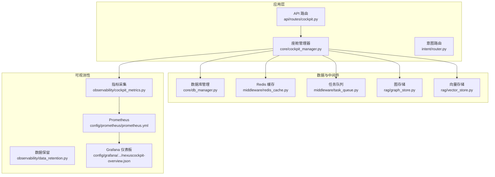
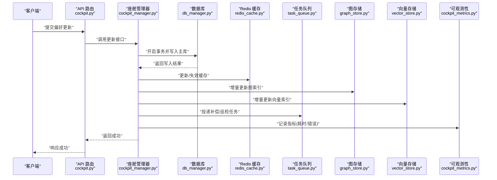
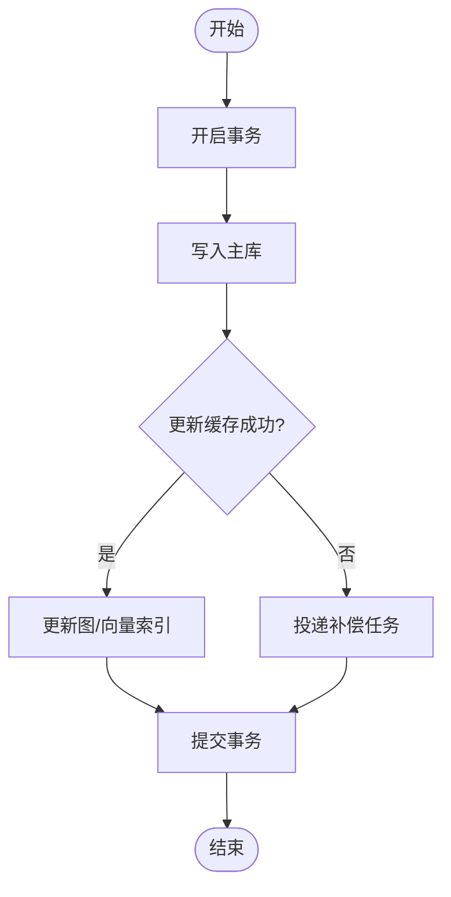
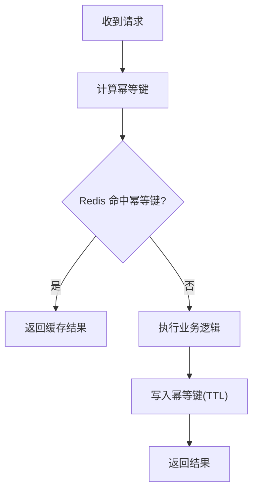
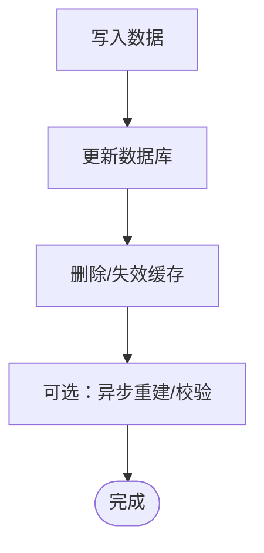
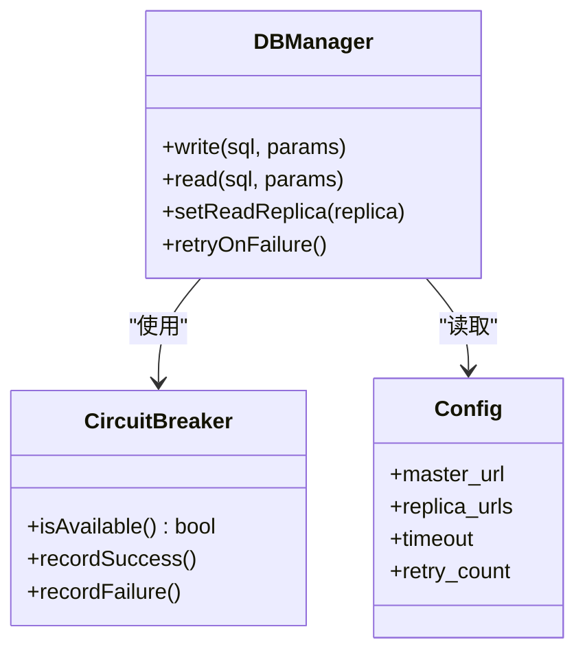
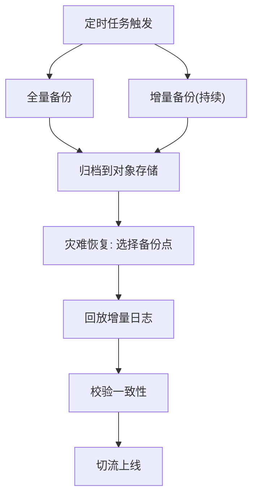
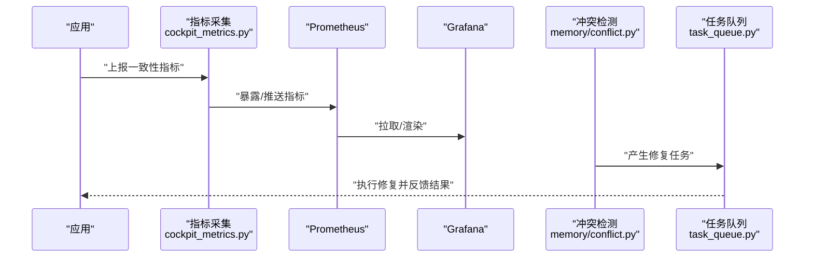
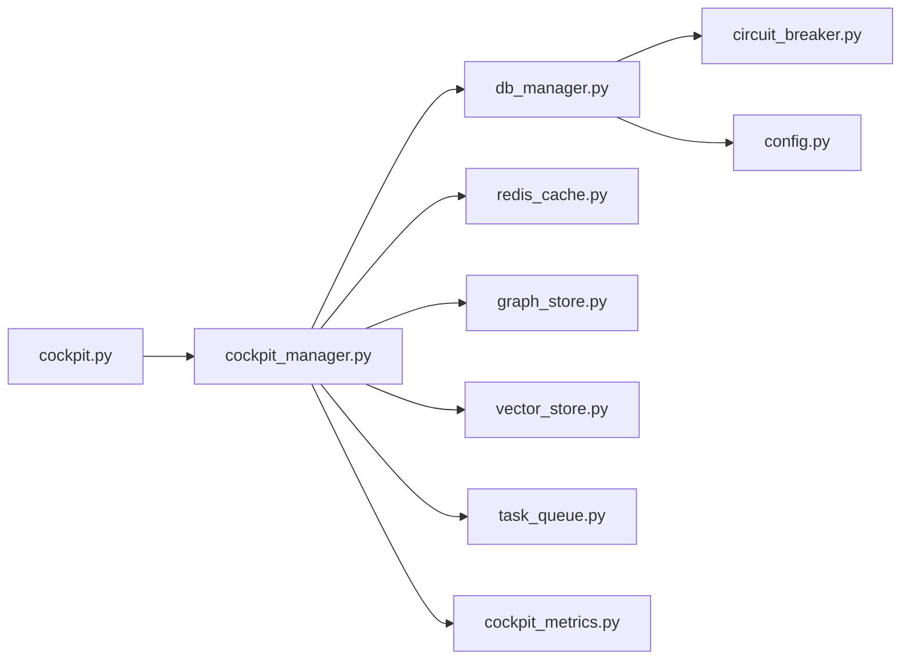

# 数据一致性保障

<cite>
**本文引用的文件**   
- [backend_design/nexus/core/db_manager.py](file://backend_design/nexus/core/db_manager.py)
- [backend_design/nexus/middleware/redis_cache.py](file://backend_design/nexus/middleware/redis_cache.py)
- [backend_design/nexus/memory/conflict.py](file://backend_design/nexus/memory/conflict.py)
- [backend_design/nexus/memory/manager.py](file://backend_design/nexus/memory/manager.py)
- [backend_design/nexus/api/routes/cockpit.py](file://backend_design/nexus/api/routes/cockpit.py)
- [backend_design/nexus/core/cockpit_manager.py](file://backend_design/nexus/core/cockpit_manager.py)
- [backend_design/nexus/observability/cockpit_metrics.py](file://backend_design/nexus/observability/cockpit_metrics.py)
- [backend_design/nexus/observability/data_retention.py](file://backend_design/nexus/observability/data_retention.py)
- [backend_design/nexus/config.py](file://backend_design/nexus/config.py)
- [backend_design/nexus/core/circuit_breaker.py](file://backend_design/nexus/core/circuit_breaker.py)
- [backend_design/nexus/middleware/task_queue.py](file://backend_design/nexus/middleware/task_queue.py)
- [backend_design/nexus/models/state.py](file://backend_design/nexus/models/state.py)
- [backend_design/nexus/models/schemas.py](file://backend_design/nexus/models/schemas.py)
- [backend_design/nexus/intent/router.py](file://backend_design/nexus/intent/router.py)
- [backend_design/nexus/rag/graph_store.py](file://backend_design/nexus/rag/graph_store.py)
- [backend_design/nexus/rag/vector_store.py](file://backend_design/nexus/rag/vector_store.py)
- [docker-compose.yml](file://docker-compose.yml)
- [config/prometheus/prometheus.yml](file://config/prometheus/prometheus.yml)
- [config/grafana/provisioning/dashboards/nexuscockpit-overview.json](file://config/grafana/provisioning/dashboards/nexuscockpit-overview.json)
</cite>

## 目录
1. [简介](#简介)
2. [项目结构](#项目结构)
3. [核心组件](#核心组件)
4. [架构总览](#架构总览)
5. [详细组件分析](#详细组件分析)
6. [依赖关系分析](#依赖关系分析)
7. [性能考量](#性能考量)
8. [故障排查指南](#故障排查指南)
9. [结论](#结论)
10. [附录](#附录)

## 简介
本指南聚焦 NexusCockpit 的数据一致性保障机制，覆盖分布式事务与最终一致性、补偿与幂等设计、缓存一致性策略、数据库主从复制与读写分离、备份与恢复策略，以及数据一致性监控与校验。文档以仓库现有实现为依据，结合可观测性与运维配置，给出端到端的一致性方案与落地建议。

## 项目结构
NexusCockpit 后端采用 Python FastAPI 服务（nexus）与 Go 网关（nexus_gate），通过 docker-compose 编排中间件（Redis、向量/图存储、Prometheus/Grafana）。数据一致性相关的关键位置包括：
- 数据库访问层：db_manager
- 缓存层：redis_cache
- 记忆与冲突处理：memory/conflict, memory/manager
- 业务编排：core/cockpit_manager, api/routes/cockpit
- 可观测性：observability/cockpit_metrics, observability/data_retention
- 配置与熔断：config.py, core/circuit_breaker
- 任务队列：middleware/task_queue
- 模型与状态：models/state.py, models/schemas.py
- 检索与知识：rag/graph_store.py, rag/vector_store.py
- 基础设施编排：docker-compose.yml
- 监控与告警：config/prometheus/prometheus.yml, config/grafana/provisioning/dashboards/nexuscockpit-overview.json

图表来源
- [backend_design/nexus/api/routes/cockpit.py](file://backend_design/nexus/api/routes/cockpit.py)
- [backend_design/nexus/core/cockpit_manager.py](file://backend_design/nexus/core/cockpit_manager.py)
- [backend_design/nexus/core/db_manager.py](file://backend_design/nexus/core/db_manager.py)
- [backend_design/nexus/middleware/redis_cache.py](file://backend_design/nexus/middleware/redis_cache.py)
- [backend_design/nexus/middleware/task_queue.py](file://backend_design/nexus/middleware/task_queue.py)
- [backend_design/nexus/rag/graph_store.py](file://backend_design/nexus/rag/graph_store.py)
- [backend_design/nexus/rag/vector_store.py](file://backend_design/nexus/rag/vector_store.py)
- [backend_design/nexus/observability/cockpit_metrics.py](file://backend_design/nexus/observability/cockpit_metrics.py)
- [backend_design/nexus/observability/data_retention.py](file://backend_design/nexus/observability/data_retention.py)
- [config/prometheus/prometheus.yml](file://config/prometheus/prometheus.yml)
- [config/grafana/provisioning/dashboards/nexuscockpit-overview.json](file://config/grafana/provisioning/dashboards/nexuscockpit-overview.json)

章节来源
- [backend_design/nexus/api/routes/cockpit.py](file://backend_design/nexus/api/routes/cockpit.py)
- [backend_design/nexus/core/cockpit_manager.py](file://backend_design/nexus/core/cockpit_manager.py)
- [backend_design/nexus/core/db_manager.py](file://backend_design/nexus/core/db_manager.py)
- [backend_design/nexus/middleware/redis_cache.py](file://backend_design/nexus/middleware/redis_cache.py)
- [backend_design/nexus/middleware/task_queue.py](file://backend_design/nexus/middleware/task_queue.py)
- [backend_design/nexus/rag/graph_store.py](file://backend_design/nexus/rag/graph_store.py)
- [backend_design/nexus/rag/vector_store.py](file://backend_design/nexus/rag/vector_store.py)
- [backend_design/nexus/observability/cockpit_metrics.py](file://backend_design/nexus/observability/cockpit_metrics.py)
- [backend_design/nexus/observability/data_retention.py](file://backend_design/nexus/observability/data_retention.py)
- [config/prometheus/prometheus.yml](file://config/prometheus/prometheus.yml)
- [config/grafana/provisioning/dashboards/nexuscockpit-overview.json](file://config/grafana/provisioning/dashboards/nexuscockpit-overview.json)

## 核心组件
- 数据库管理（db_manager）：封装连接、会话、事务边界与重试策略，为上层提供一致的持久化能力。
- Redis 缓存（redis_cache）：提供键值存取、过期控制与批量操作，配合业务逻辑实现读多写少场景的缓存策略。
- 记忆与冲突（memory/conflict, memory/manager）：负责用户记忆/偏好数据的合并、冲突检测与版本化更新。
- 座舱管理器（cockpit_manager）：协调 API、DB、缓存、RAG 与任务队列，组织跨资源的一致性流程。
- 任务队列（task_queue）：异步执行补偿、清理、索引重建等后台任务，支撑最终一致性与幂等。
- 可观测性（cockpit_metrics, data_retention）：采集一致性相关指标（延迟、错误率、缓存命中率、冲突数），并实施数据保留策略。
- 配置与熔断（config.py, circuit_breaker）：集中配置关键参数（超时、重试、熔断阈值），在异常时快速降级保护。
- 模型与状态（state.py, schemas.py）：定义领域对象与状态机，约束数据变更路径。
- RAG 存储（graph_store, vector_store）：图与向量索引的写入/查询接口，需与主数据保持一致。

章节来源
- [backend_design/nexus/core/db_manager.py](file://backend_design/nexus/core/db_manager.py)
- [backend_design/nexus/middleware/redis_cache.py](file://backend_design/nexus/middleware/redis_cache.py)
- [backend_design/nexus/memory/conflict.py](file://backend_design/nexus/memory/conflict.py)
- [backend_design/nexus/memory/manager.py](file://backend_design/nexus/memory/manager.py)
- [backend_design/nexus/core/cockpit_manager.py](file://backend_design/nexus/core/cockpit_manager.py)
- [backend_design/nexus/middleware/task_queue.py](file://backend_design/nexus/middleware/task_queue.py)
- [backend_design/nexus/observability/cockpit_metrics.py](file://backend_design/nexus/observability/cockpit_metrics.py)
- [backend_design/nexus/observability/data_retention.py](file://backend_design/nexus/observability/data_retention.py)
- [backend_design/nexus/config.py](file://backend_design/nexus/config.py)
- [backend_design/nexus/core/circuit_breaker.py](file://backend_design/nexus/core/circuit_breaker.py)
- [backend_design/nexus/models/state.py](file://backend_design/nexus/models/state.py)
- [backend_design/nexus/models/schemas.py](file://backend_design/nexus/models/schemas.py)
- [backend_design/nexus/rag/graph_store.py](file://backend_design/nexus/rag/graph_store.py)
- [backend_design/nexus/rag/vector_store.py](file://backend_design/nexus/rag/vector_store.py)

## 架构总览
下图展示一次“更新用户偏好”的一致性流程：API 接收请求，座舱管理器协调 DB 写入、缓存更新、RAG 索引重建与任务队列补偿；可观测性模块记录指标，Prometheus 抓取后由 Grafana 可视化。

图表来源
- [backend_design/nexus/api/routes/cockpit.py](file://backend_design/nexus/api/routes/cockpit.py)
- [backend_design/nexus/core/cockpit_manager.py](file://backend_design/nexus/core/cockpit_manager.py)
- [backend_design/nexus/core/db_manager.py](file://backend_design/nexus/core/db_manager.py)
- [backend_design/nexus/middleware/redis_cache.py](file://backend_design/nexus/middleware/redis_cache.py)
- [backend_design/nexus/middleware/task_queue.py](file://backend_design/nexus/middleware/task_queue.py)
- [backend_design/nexus/rag/graph_store.py](file://backend_design/nexus/rag/graph_store.py)
- [backend_design/nexus/rag/vector_store.py](file://backend_design/nexus/rag/vector_store.py)
- [backend_design/nexus/observability/cockpit_metrics.py](file://backend_design/nexus/observability/cockpit_metrics.py)

## 详细组件分析

### 分布式事务与最终一致性
- 事务边界与重试
  - 使用 db_manager 的事务封装，确保写操作的原子性与回滚语义。
  - 对网络抖动或瞬时失败进行指数退避重试，避免雪崩。
- 最终一致性
  - 将非关键路径（如 RAG 索引重建、统计聚合）下沉到 task_queue 异步执行，保证主链路低延迟。
  - 引入幂等键（如 request_id + 版本号），防止重复消费导致数据漂移。
- 补偿事务
  - 当二级系统（缓存、索引）更新失败时，投递补偿任务，按顺序重试直至成功或达到最大次数。
  - 补偿任务具备去重与幂等检查，避免重复补偿。

图表来源
- [backend_design/nexus/core/db_manager.py](file://backend_design/nexus/core/db_manager.py)
- [backend_design/nexus/middleware/redis_cache.py](file://backend_design/nexus/middleware/redis_cache.py)
- [backend_design/nexus/middleware/task_queue.py](file://backend_design/nexus/middleware/task_queue.py)
- [backend_design/nexus/rag/graph_store.py](file://backend_design/nexus/rag/graph_store.py)
- [backend_design/nexus/rag/vector_store.py](file://backend_design/nexus/rag/vector_store.py)

章节来源
- [backend_design/nexus/core/db_manager.py](file://backend_design/nexus/core/db_manager.py)
- [backend_design/nexus/middleware/task_queue.py](file://backend_design/nexus/middleware/task_queue.py)
- [backend_design/nexus/rag/graph_store.py](file://backend_design/nexus/rag/graph_store.py)
- [backend_design/nexus/rag/vector_store.py](file://backend_design/nexus/rag/vector_store.py)

### 幂等性设计
- 幂等键生成
  - 基于请求唯一标识与业务主键组合，作为幂等键存入 Redis，设置合理 TTL。
- 幂等检查流程
  - 在处理前查询幂等键，命中则直接返回历史结果；未命中则执行业务并落盘幂等键。
- 防抖与限流
  - 结合 rate limiter 与熔断器，降低重复请求带来的压力。

图表来源
- [backend_design/nexus/middleware/redis_cache.py](file://backend_design/nexus/middleware/redis_cache.py)
- [backend_design/nexus/core/circuit_breaker.py](file://backend_design/nexus/core/circuit_breaker.py)

章节来源
- [backend_design/nexus/middleware/redis_cache.py](file://backend_design/nexus/middleware/redis_cache.py)
- [backend_design/nexus/core/circuit_breaker.py](file://backend_design/nexus/core/circuit_breaker.py)

### 缓存一致性策略
- 更新模式
  - 推荐 Cache-Aside：先更新数据库，再删除/失效缓存；必要时采用延迟双删或订阅 Binlog 异步清理。
- 穿透防护
  - 对空结果设置短 TTL 的占位键，限制热点不存在的 key 被反复打到 DB。
- 雪崩避免
  - 为缓存键增加随机抖动 TTL；热点 key 采用本地缓存+多级缓存；批量失效时分批过期。
- 一致性校验
  - 定期比对缓存与数据库差异，触发修复任务。

图表来源
- [backend_design/nexus/middleware/redis_cache.py](file://backend_design/nexus/middleware/redis_cache.py)
- [backend_design/nexus/core/cockpit_manager.py](file://backend_design/nexus/core/cockpit_manager.py)

章节来源
- [backend_design/nexus/middleware/redis_cache.py](file://backend_design/nexus/middleware/redis_cache.py)
- [backend_design/nexus/core/cockpit_manager.py](file://backend_design/nexus/core/cockpit_manager.py)

### 数据库主从复制与读写分离
- 读写分离
  - 写操作走主库，读操作走从库；通过 db_manager 的路由策略选择目标实例。
- 数据同步
  - 依赖底层数据库的主从复制协议，确保主从延迟可控。
- 故障切换
  - 结合熔断器与重试策略，在主库不可用时快速降级或切换到只读模式。
- 配置要点
  - 通过配置文件集中管理主从地址、超时、重试次数、隔离级别等。

图表来源
- [backend_design/nexus/core/db_manager.py](file://backend_design/nexus/core/db_manager.py)
- [backend_design/nexus/core/circuit_breaker.py](file://backend_design/nexus/core/circuit_breaker.py)
- [backend_design/nexus/config.py](file://backend_design/nexus/config.py)

章节来源
- [backend_design/nexus/core/db_manager.py](file://backend_design/nexus/core/db_manager.py)
- [backend_design/nexus/core/circuit_breaker.py](file://backend_design/nexus/core/circuit_breaker.py)
- [backend_design/nexus/config.py](file://backend_design/nexus/config.py)

### 数据备份与恢复策略
- 定期备份
  - 全量备份：每日定时快照，保留 N 天。
  - 增量备份：基于 Binlog/WAL 的增量归档，缩短恢复窗口。
- 灾难恢复流程
  - 选择最近的全量备份点，回放增量日志至目标时间点。
  - 验证数据完整性与一致性后再切流。
- 工具与编排
  - 通过 cron 或任务队列调度备份脚本；备份产物存放于对象存储或独立卷。

图表来源
- [backend_design/nexus/observability/data_retention.py](file://backend_design/nexus/observability/data_retention.py)
- [backend_design/nexus/middleware/task_queue.py](file://backend_design/nexus/middleware/task_queue.py)

章节来源
- [backend_design/nexus/observability/data_retention.py](file://backend_design/nexus/observability/data_retention.py)
- [backend_design/nexus/middleware/task_queue.py](file://backend_design/nexus/middleware/task_queue.py)

### 数据一致性监控与校验
- 指标采集
  - 采集一致性相关指标：事务成功率、重试次数、缓存命中率、冲突计数、索引重建延迟等。
- 冲突检测
  - 在 memory/conflict 中实现版本比较与冲突标记，输出冲突事件供后续处理。
- 自动修复
  - 基于 task_queue 的修复任务，按优先级与幂等键执行修复，避免二次冲突。
- 可视化与告警
  - Prometheus 抓取指标，Grafana 展示仪表盘；设定阈值告警。

图表来源
- [backend_design/nexus/observability/cockpit_metrics.py](file://backend_design/nexus/observability/cockpit_metrics.py)
- [backend_design/nexus/observability/data_retention.py](file://backend_design/nexus/observability/data_retention.py)
- [backend_design/nexus/memory/conflict.py](file://backend_design/nexus/memory/conflict.py)
- [backend_design/nexus/middleware/task_queue.py](file://backend_design/nexus/middleware/task_queue.py)
- [config/prometheus/prometheus.yml](file://config/prometheus/prometheus.yml)
- [config/grafana/provisioning/dashboards/nexuscockpit-overview.json](file://config/grafana/provisioning/dashboards/nexuscockpit-overview.json)

章节来源
- [backend_design/nexus/observability/cockpit_metrics.py](file://backend_design/nexus/observability/cockpit_metrics.py)
- [backend_design/nexus/observability/data_retention.py](file://backend_design/nexus/observability/data_retention.py)
- [backend_design/nexus/memory/conflict.py](file://backend_design/nexus/memory/conflict.py)
- [backend_design/nexus/middleware/task_queue.py](file://backend_design/nexus/middleware/task_queue.py)
- [config/prometheus/prometheus.yml](file://config/prometheus/prometheus.yml)
- [config/grafana/provisioning/dashboards/nexuscockpit-overview.json](file://config/grafana/provisioning/dashboards/nexuscockpit-overview.json)

## 依赖关系分析
- 组件耦合
  - cockpit_manager 作为编排中心，耦合 DB、缓存、RAG、任务队列与可观测性。
  - db_manager 依赖配置与熔断器，屏蔽底层连接细节。
  - redis_cache 与 task_queue 共同支撑幂等与最终一致性。
- 外部依赖
  - 数据库主从、Redis、图/向量存储、Prometheus/Grafana。
- 潜在循环依赖
  - 通过分层与接口抽象避免循环引用；例如将指标上报抽象为可插拔观察者。

图表来源
- [backend_design/nexus/api/routes/cockpit.py](file://backend_design/nexus/api/routes/cockpit.py)
- [backend_design/nexus/core/cockpit_manager.py](file://backend_design/nexus/core/cockpit_manager.py)
- [backend_design/nexus/core/db_manager.py](file://backend_design/nexus/core/db_manager.py)
- [backend_design/nexus/middleware/redis_cache.py](file://backend_design/nexus/middleware/redis_cache.py)
- [backend_design/nexus/rag/graph_store.py](file://backend_design/nexus/rag/graph_store.py)
- [backend_design/nexus/rag/vector_store.py](file://backend_design/nexus/rag/vector_store.py)
- [backend_design/nexus/middleware/task_queue.py](file://backend_design/nexus/middleware/task_queue.py)
- [backend_design/nexus/observability/cockpit_metrics.py](file://backend_design/nexus/observability/cockpit_metrics.py)
- [backend_design/nexus/core/circuit_breaker.py](file://backend_design/nexus/core/circuit_breaker.py)
- [backend_design/nexus/config.py](file://backend_design/nexus/config.py)

章节来源
- [backend_design/nexus/api/routes/cockpit.py](file://backend_design/nexus/api/routes/cockpit.py)
- [backend_design/nexus/core/cockpit_manager.py](file://backend_design/nexus/core/cockpit_manager.py)
- [backend_design/nexus/core/db_manager.py](file://backend_design/nexus/core/db_manager.py)
- [backend_design/nexus/middleware/redis_cache.py](file://backend_design/nexus/middleware/redis_cache.py)
- [backend_design/nexus/rag/graph_store.py](file://backend_design/nexus/rag/graph_store.py)
- [backend_design/nexus/rag/vector_store.py](file://backend_design/nexus/rag/vector_store.py)
- [backend_design/nexus/middleware/task_queue.py](file://backend_design/nexus/middleware/task_queue.py)
- [backend_design/nexus/observability/cockpit_metrics.py](file://backend_design/nexus/observability/cockpit_metrics.py)
- [backend_design/nexus/core/circuit_breaker.py](file://backend_design/nexus/core/circuit_breaker.py)
- [backend_design/nexus/config.py](file://backend_design/nexus/config.py)

## 性能考量
- 事务粒度
  - 缩小事务范围，减少锁持有时间；将非关键路径移出事务。
- 缓存命中率
  - 热点数据优先走缓存；合理设置 TTL 与局部失效策略。
- 重试与熔断
  - 指数退避与抖动避免风暴；熔断快速失败保护下游。
- 索引重建
  - 增量更新优先；批量重建分片并行，限制并发度。
- 资源隔离
  - 读写通道隔离，避免写放大影响读性能。

[本节为通用指导，无需源码引用]

## 故障排查指南
- 常见问题定位
  - 事务失败：查看 db_manager 的重试与回滚日志，确认是否因死锁或超时。
  - 缓存不一致：核对更新顺序与失效策略，检查幂等键是否被提前过期。
  - 索引不同步：观察任务队列积压与补偿任务执行情况。
  - 主从延迟：监控主从复制延迟，必要时降级读流量。
- 可观测性手段
  - 通过 Grafana 仪表盘观察一致性指标趋势与异常峰值。
  - 利用 Prometheus 规则告警，及时通知运维团队。
- 快速恢复
  - 启用熔断与降级开关，优先保障核心读路径。
  - 触发一致性巡检与修复任务，逐步收敛差异。

章节来源
- [backend_design/nexus/core/db_manager.py](file://backend_design/nexus/core/db_manager.py)
- [backend_design/nexus/middleware/redis_cache.py](file://backend_design/nexus/middleware/redis_cache.py)
- [backend_design/nexus/middleware/task_queue.py](file://backend_design/nexus/middleware/task_queue.py)
- [config/grafana/provisioning/dashboards/nexuscockpit-overview.json](file://config/grafana/provisioning/dashboards/nexuscockpit-overview.json)

## 结论
NexusCockpit 通过事务边界、幂等键、补偿任务与多级缓存策略，构建了面向最终一致性的数据一致性体系。结合主从复制、读写分离与熔断降级，系统在可用性与一致性之间取得平衡。完善的监控与校验机制进一步提升了问题发现与自愈能力。建议在容量规划与压测中持续验证一致性 SLA，并根据业务特性优化缓存与索引策略。

[本节为总结性内容，无需源码引用]

## 附录
- 基础设施编排
  - docker-compose.yml 定义了应用与中间件的部署拓扑，便于本地与测试环境复现一致性场景。
- 监控配置
  - prometheus.yml 与 Grafana 仪表盘提供了开箱即用的可视化面板，可直接用于一致性指标的观测。

章节来源
- [docker-compose.yml](file://docker-compose.yml)
- [config/prometheus/prometheus.yml](file://config/prometheus/prometheus.yml)
- [config/grafana/provisioning/dashboards/nexuscockpit-overview.json](file://config/grafana/provisioning/dashboards/nexuscockpit-overview.json)