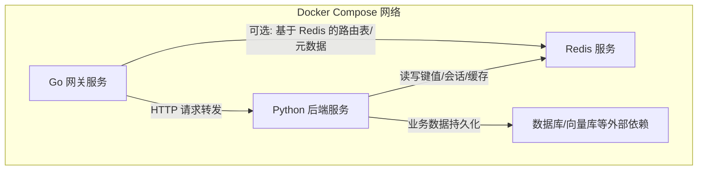
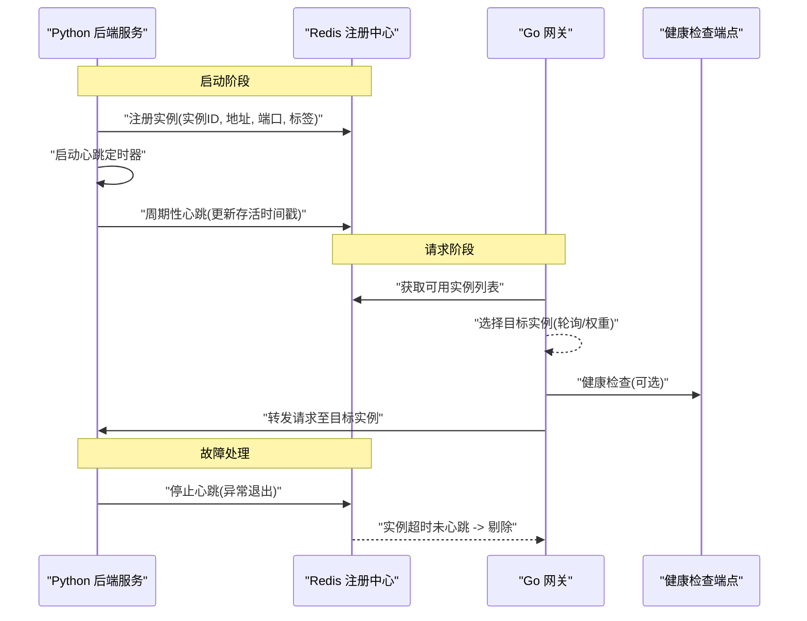
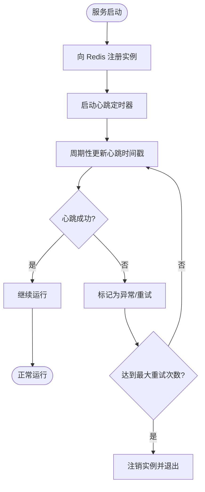
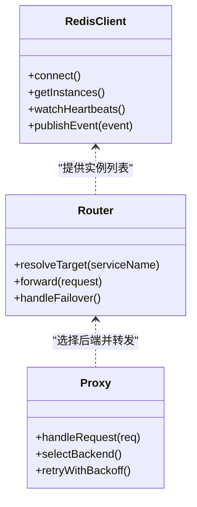
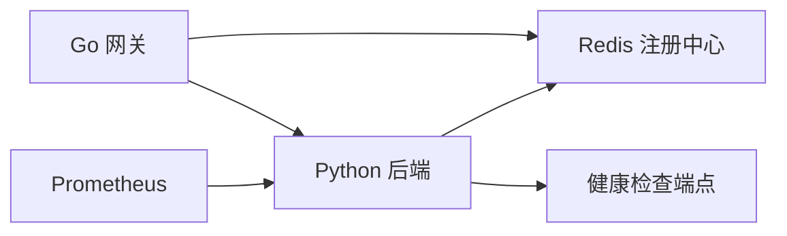

# 服务发现机制

<cite>
**本文引用的文件**   
- [docker-compose.yml](file://docker-compose.yml)
- [backend_design/nexus/main.py](file://backend_design/nexus/main.py)
- [backend_design/nexus/config.py](file://backend_design/nexus/config.py)
- [backend_design/nexus/core/cockpit_manager.py](file://backend_design/nexus/core/cockpit_manager.py)
- [backend_design/nexus/middleware/redis_cache.py](file://backend_design/nexus/middleware/redis_cache.py)
- [backend_design/nexus/api/routes/health.py](file://backend_design/nexus/api/routes/health.py)
- [backend_design/nexus_gate/internal/handlers/redis_client.go](file://backend_design/nexus_gate/internal/handlers/redis_client.go)
- [backend_design/nexus_gate/internal/proxy/proxy.go](file://backend_design/nexus_gate/internal/proxy/proxy.go)
- [backend_design/nexus_gate/internal/router/router.go](file://backend_design/nexus_gate/internal/router/router.go)
- [config/prometheus/prometheus.yml](file://config/prometheus/prometheus.yml)
</cite>

## 目录
1. [简介](#简介)
2. [项目结构](#项目结构)
3. [核心组件](#核心组件)
4. [架构总览](#架构总览)
5. [详细组件分析](#详细组件分析)
6. [依赖关系分析](#依赖关系分析)
7. [性能考量](#性能考量)
8. [故障排查指南](#故障排查指南)
9. [结论](#结论)
10. [附录](#附录)

## 简介
本文件系统性阐述 NexusCockpit 的服务发现机制，覆盖 Docker Compose 内部服务发现、Redis 作为轻量注册中心的使用（注册、注销、心跳）、动态配置更新与热重载、多环境差异化配置、以及最佳实践与排障方法。文档面向不同技术背景的读者，提供从高层到代码级的分层说明与可视化图示。

## 项目结构
NexusCockpit 由 Python 后端服务、Go 网关、前端应用及中间件组成。服务发现相关的关键位置包括：
- 容器编排与网络：docker-compose.yml
- 后端服务入口与配置加载：main.py、config.py
- 健康检查与状态暴露：api/routes/health.py
- Redis 客户端与缓存/会话中间件：middleware/redis_cache.py
- Go 网关的 Redis 客户端与路由转发：nexus_gate/internal/handlers/redis_client.go、proxy/proxy.go、router/router.go
- 监控采集配置：config/prometheus/prometheus.yml

图表来源
- [docker-compose.yml](file://docker-compose.yml)
- [backend_design/nexus/main.py](file://backend_design/nexus/main.py)
- [backend_design/nexus/middleware/redis_cache.py](file://backend_design/nexus/middleware/redis_cache.py)
- [backend_design/nexus_gate/internal/handlers/redis_client.go](file://backend_design/nexus_gate/internal/handlers/redis_client.go)
- [backend_design/nexus_gate/internal/proxy/proxy.go](file://backend_design/nexus_gate/internal/proxy/proxy.go)
- [backend_design/nexus_gate/internal/router/router.go](file://backend_design/nexus_gate/internal/router/router.go)

章节来源
- [docker-compose.yml](file://docker-compose.yml)
- [backend_design/nexus/main.py](file://backend_design/nexus/main.py)
- [backend_design/nexus/config.py](file://backend_design/nexus/config.py)
- [backend_design/nexus/middleware/redis_cache.py](file://backend_design/nexus/middleware/redis_cache.py)
- [backend_design/nexus_gate/internal/handlers/redis_client.go](file://backend_design/nexus_gate/internal/handlers/redis_client.go)
- [backend_design/nexus_gate/internal/proxy/proxy.go](file://backend_design/nexus_gate/internal/proxy/proxy.go)
- [backend_design/nexus_gate/internal/router/router.go](file://backend_design/nexus_gate/internal/router/router.go)

## 核心组件
- Docker Compose 服务发现
  - 通过同一网络下的 DNS 名称解析实现服务间通信，例如以“服务名”访问其他容器。
  - 环境变量注入用于传递连接参数（如 Redis 地址、端口、凭据）。
- Redis 作为轻量注册中心
  - 使用 Redis 存储服务实例元数据（实例 ID、地址、端口、标签、时间戳等）。
  - 通过键空间或过期策略维护实例存活信息，配合定时任务进行心跳检测与剔除。
- 健康检查与状态暴露
  - 后端暴露健康检查端点，供网关或编排系统探测服务可用性。
- 动态配置与热重载
  - 支持从配置文件或外部源读取配置；在运行时监听变更并刷新内存中的配置项。
- 网关侧服务发现
  - Go 网关根据 Redis 中维护的实例列表进行负载均衡与转发。

章节来源
- [docker-compose.yml](file://docker-compose.yml)
- [backend_design/nexus/config.py](file://backend_design/nexus/config.py)
- [backend_design/nexus/middleware/redis_cache.py](file://backend_design/nexus/middleware/redis_cache.py)
- [backend_design/nexus/api/routes/health.py](file://backend_design/nexus/api/routes/health.py)
- [backend_design/nexus_gate/internal/handlers/redis_client.go](file://backend_design/nexus_gate/internal/handlers/redis_client.go)
- [backend_design/nexus_gate/internal/proxy/proxy.go](file://backend_design/nexus_gate/internal/proxy/proxy.go)
- [backend_design/nexus_gate/internal/router/router.go](file://backend_design/nexus_gate/internal/router/router.go)

## 架构总览
下图展示了服务发现的整体流程：服务启动时向 Redis 注册，定期发送心跳；网关从 Redis 拉取可用实例列表并进行转发；当实例不可用时被剔除。

图表来源
- [backend_design/nexus/middleware/redis_cache.py](file://backend_design/nexus/middleware/redis_cache.py)
- [backend_design/nexus/api/routes/health.py](file://backend_design/nexus/api/routes/health.py)
- [backend_design/nexus_gate/internal/handlers/redis_client.go](file://backend_design/nexus_gate/internal/handlers/redis_client.go)
- [backend_design/nexus_gate/internal/proxy/proxy.go](file://backend_design/nexus_gate/internal/proxy/proxy.go)
- [backend_design/nexus_gate/internal/router/router.go](file://backend_design/nexus_gate/internal/router/router.go)

## 详细组件分析

### Docker Compose 内部服务发现
- 容器网络与 DNS
  - 同一 compose 网络内的服务可通过“服务名”互相访问，Compose 自动提供 DNS 解析。
  - 建议为每个服务定义固定端口映射，避免冲突。
- 服务依赖管理
  - 使用 depends_on 声明依赖顺序；对需要等待就绪的外部依赖，可结合健康检查条件确保启动顺序正确。
- 环境变量与配置注入
  - 通过环境变量将 Redis 地址、端口、认证信息等注入到各服务，便于在不同环境中切换。

章节来源
- [docker-compose.yml](file://docker-compose.yml)

### Redis 作为服务注册中心
- 服务注册
  - 服务启动时将自身元数据写入 Redis（如实例 ID、IP、端口、版本、标签、注册时间）。
  - 使用带 TTL 的键或有序集合记录实例存活时间，便于快速判断存活状态。
- 心跳检测
  - 服务进程内启动定时器，周期性更新对应实例的心跳时间戳。
  - 若心跳失败或进程崩溃，TTL 到期后该实例将被视为下线。
- 服务注销
  - 优雅关闭时主动删除注册信息，避免脏数据残留。
- 实例发现与剔除
  - 网关或调度器定期扫描 Redis，剔除超过阈值的心跳超时实例。
  - 可结合健康检查端点进行二次确认，降低误判概率。

图表来源
- [backend_design/nexus/middleware/redis_cache.py](file://backend_design/nexus/middleware/redis_cache.py)

章节来源
- [backend_design/nexus/middleware/redis_cache.py](file://backend_design/nexus/middleware/redis_cache.py)

### 健康检查与状态暴露
- 健康检查端点
  - 后端暴露健康检查接口，返回当前服务状态（如依赖是否可用、负载情况）。
  - 网关或编排系统在转发前调用健康检查，提高转发成功率。
- 指标与可观测性
  - 通过 Prometheus 抓取关键指标，辅助定位问题与服务容量规划。

章节来源
- [backend_design/nexus/api/routes/health.py](file://backend_design/nexus/api/routes/health.py)
- [config/prometheus/prometheus.yml](file://config/prometheus/prometheus.yml)

### 动态配置与热重载
- 配置加载
  - 服务启动时从配置文件或环境变量加载基础配置（如 Redis 连接、日志级别、功能开关）。
- 热重载机制
  - 监听配置变更事件（文件或外部配置中心），在不重启的情况下刷新内存中的配置项。
  - 对于影响路由或限流的配置，需保证原子更新与并发安全。
- 状态同步
  - 配置变更后，通知相关模块重新初始化资源（如连接池、缓存策略）。

章节来源
- [backend_design/nexus/config.py](file://backend_design/nexus/config.py)
- [backend_design/nexus/core/cockpit_manager.py](file://backend_design/nexus/core/cockpit_manager.py)

### Go 网关侧服务发现与转发
- Redis 客户端
  - 网关通过 Redis 客户端读取实例列表与元数据，维护本地缓存以提升查询性能。
- 路由与转发
  - 根据实例列表选择目标后端服务，执行 HTTP 转发；必要时附加鉴权头或追踪标识。
- 容错与降级
  - 对不可用实例进行剔除与退避重试；在极端情况下启用降级策略（如返回友好错误页）。

图表来源
- [backend_design/nexus_gate/internal/handlers/redis_client.go](file://backend_design/nexus_gate/internal/handlers/redis_client.go)
- [backend_design/nexus_gate/internal/router/router.go](file://backend_design/nexus_gate/internal/router/router.go)
- [backend_design/nexus_gate/internal/proxy/proxy.go](file://backend_design/nexus_gate/internal/proxy/proxy.go)

章节来源
- [backend_design/nexus_gate/internal/handlers/redis_client.go](file://backend_design/nexus_gate/internal/handlers/redis_client.go)
- [backend_design/nexus_gate/internal/router/router.go](file://backend_design/nexus_gate/internal/router/router.go)
- [backend_design/nexus_gate/internal/proxy/proxy.go](file://backend_design/nexus_gate/internal/proxy/proxy.go)

### 多环境服务发现配置
- 开发环境
  - 使用本地 Redis 或单节点 Redis；开启详细日志；禁用严格的健康检查。
- 测试环境
  - 模拟多实例部署；启用健康检查与基本限流；配置短 TTL 的心跳以加速故障感知。
- 生产环境
  - 使用高可用 Redis 集群；启用强一致性的实例注册与严格的剔除策略；完善监控告警。
- 差异化管理
  - 通过环境变量或配置中心区分不同环境的连接参数、超时与重试策略。

章节来源
- [docker-compose.yml](file://docker-compose.yml)
- [backend_design/nexus/config.py](file://backend_design/nexus/config.py)

## 依赖关系分析
- 组件耦合
  - 后端服务依赖 Redis 进行注册与心跳；网关依赖 Redis 获取实例列表。
  - 健康检查端点与健康探针共同提升转发可靠性。
- 外部依赖
  - Redis 作为唯一注册中心，需关注其可用性与性能。
  - Prometheus 用于采集指标，辅助运维与容量规划。

图表来源
- [backend_design/nexus/middleware/redis_cache.py](file://backend_design/nexus/middleware/redis_cache.py)
- [backend_design/nexus/api/routes/health.py](file://backend_design/nexus/api/routes/health.py)
- [backend_design/nexus_gate/internal/handlers/redis_client.go](file://backend_design/nexus_gate/internal/handlers/redis_client.go)
- [config/prometheus/prometheus.yml](file://config/prometheus/prometheus.yml)

章节来源
- [backend_design/nexus/middleware/redis_cache.py](file://backend_design/nexus/middleware/redis_cache.py)
- [backend_design/nexus/api/routes/health.py](file://backend_design/nexus/api/routes/health.py)
- [backend_design/nexus_gate/internal/handlers/redis_client.go](file://backend_design/nexus_gate/internal/handlers/redis_client.go)
- [config/prometheus/prometheus.yml](file://config/prometheus/prometheus.yml)

## 性能考量
- 心跳间隔与 TTL
  - 合理设置心跳间隔与 TTL，平衡故障感知速度与 Redis 压力。
- 实例列表缓存
  - 网关侧缓存实例列表，减少频繁查询 Redis 的开销。
- 连接池与并发
  - 后端与网关均使用连接池，控制并发度以避免资源耗尽。
- 健康检查频率
  - 健康检查不宜过于频繁，避免对后端造成额外负担。

[本节为通用指导，不直接分析具体文件]

## 故障排查指南
- 常见问题
  - 服务无法注册：检查 Redis 连通性与权限、实例元数据格式。
  - 心跳丢失：检查定时器是否正常、Redis 网络延迟与超时配置。
  - 实例未被剔除：检查 TTL 设置与剔除逻辑是否正确触发。
  - 转发失败：检查健康检查端点响应、实例状态与网关重试策略。
- 诊断步骤
  - 查看 Redis 中实例键与时间戳，确认注册与心跳是否生效。
  - 检查健康检查端点返回状态码与依赖可用性。
  - 观察网关日志与 Prometheus 指标，定位瓶颈与异常。
- 恢复措施
  - 重启异常实例并确认重新注册成功。
  - 调整心跳间隔与 TTL，优化故障感知速度。
  - 清理脏数据，确保注册中心一致性。

章节来源
- [backend_design/nexus/api/routes/health.py](file://backend_design/nexus/api/routes/health.py)
- [backend_design/nexus/middleware/redis_cache.py](file://backend_design/nexus/middleware/redis_cache.py)
- [backend_design/nexus_gate/internal/handlers/redis_client.go](file://backend_design/nexus_gate/internal/handlers/redis_client.go)
- [config/prometheus/prometheus.yml](file://config/prometheus/prometheus.yml)

## 结论
NexusCockpit 采用 Docker Compose 内置 DNS 与 Redis 轻量注册中心相结合的服务发现方案，具备简洁、易扩展与可观测的特点。通过健康检查、心跳检测与动态配置热重载，系统在稳定性与灵活性之间取得良好平衡。建议在多环境中统一配置管理，完善监控告警与自动化运维能力，进一步提升整体可靠性。

[本节为总结性内容，不直接分析具体文件]

## 附录
- 术语
  - 服务注册：将实例元数据写入注册中心的过程。
  - 心跳检测：周期性更新实例存活信息的机制。
  - 健康检查：对外暴露的状态接口，用于评估服务可用性。
  - 动态配置：可在运行时更新的配置项，无需重启服务。
- 参考路径
  - 服务注册与心跳：[backend_design/nexus/middleware/redis_cache.py](file://backend_design/nexus/middleware/redis_cache.py)
  - 健康检查端点：[backend_design/nexus/api/routes/health.py](file://backend_design/nexus/api/routes/health.py)
  - 网关 Redis 客户端：[backend_design/nexus_gate/internal/handlers/redis_client.go](file://backend_design/nexus_gate/internal/handlers/redis_client.go)
  - 网关路由与转发：[backend_design/nexus_gate/internal/router/router.go](file://backend_design/nexus_gate/internal/router/router.go)、[backend_design/nexus_gate/internal/proxy/proxy.go](file://backend_design/nexus_gate/internal/proxy/proxy.go)
  - 监控采集配置：[config/prometheus/prometheus.yml](file://config/prometheus/prometheus.yml)