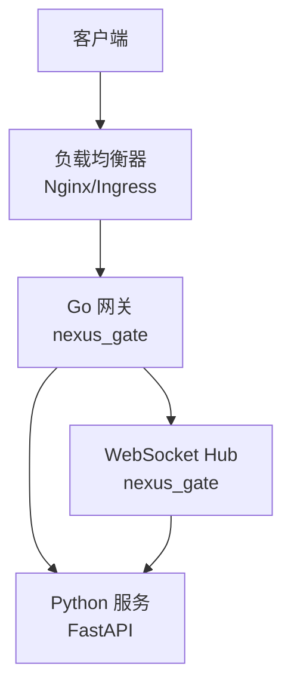
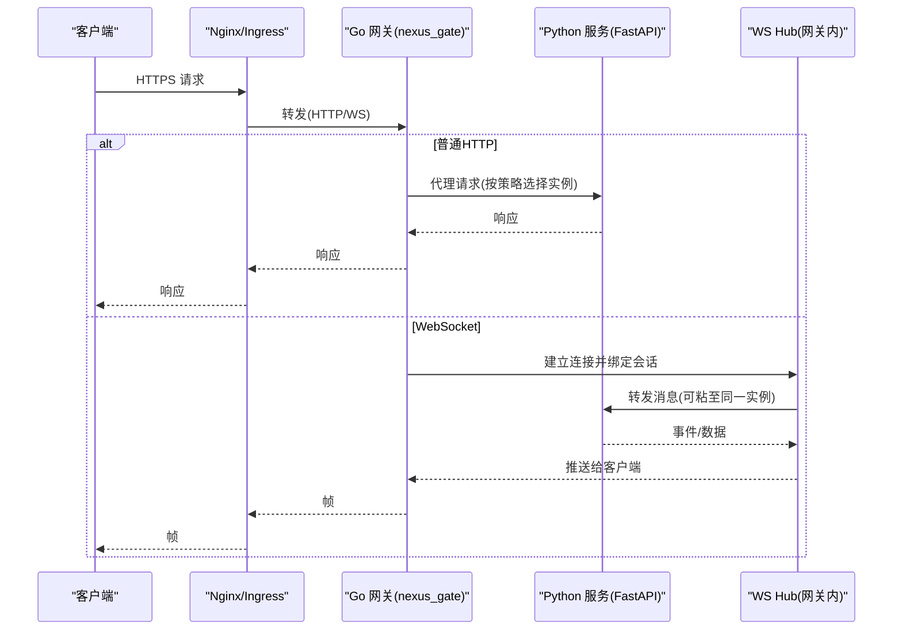
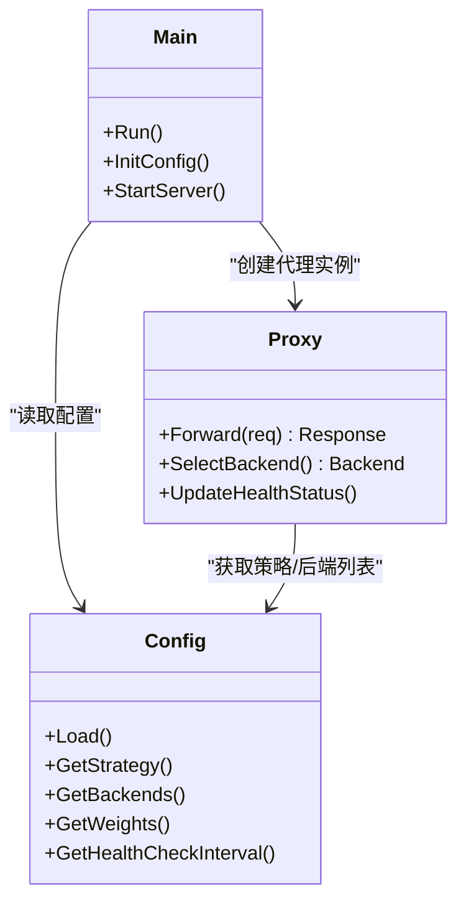
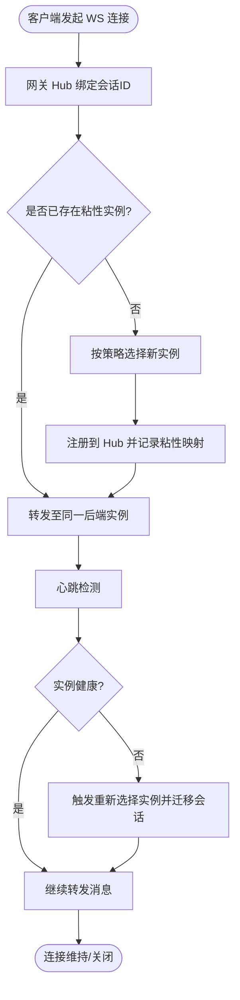
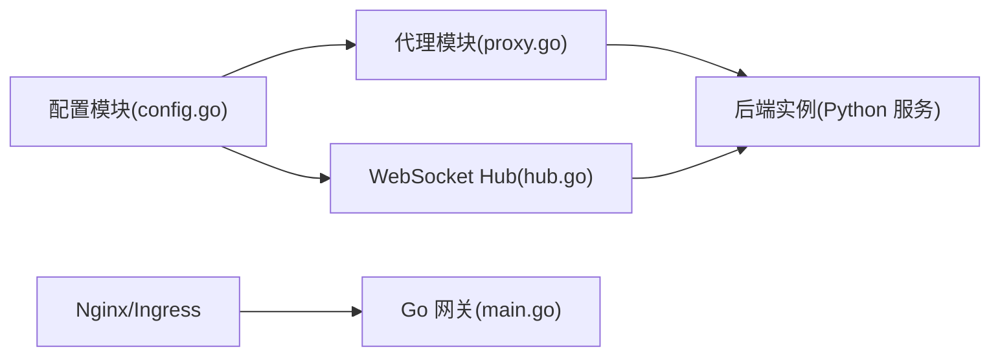

# 负载均衡配置

<cite>
**本文引用的文件**   
- [backend_design/nexus_gate/cmd/main.go](file://backend_design/nexus_gate/cmd/main.go)
- [backend_design/nexus_gate/internal/config/config.go](file://backend_design/nexus_gate/internal/config/config.go)
- [backend_design/nexus_gate/internal/proxy/proxy.go](file://backend_design/nexus_gate/internal/proxy/proxy.go)
- [backend_design/nexus_gate/internal/ws/hub.go](file://backend_design/nexus_gate/internal/ws/hub.go)
- [backend_design/nexus/api/websocket.py](file://backend_design/nexus/api/websocket.py)
- [config/nginx/README.md](file://config/nginx/README.md)
- [docker-compose.yml](file://docker-compose.yml)
</cite>

## 目录
1. [简介](#简介)
2. [项目结构](#项目结构)
3. [核心组件](#核心组件)
4. [架构总览](#架构总览)
5. [详细组件分析](#详细组件分析)
6. [依赖关系分析](#依赖关系分析)
7. [性能考虑](#性能考虑)
8. [故障排查指南](#故障排查指南)
9. [结论](#结论)
10. [附录](#附录)

## 简介
本指南聚焦于 NexusCockpit 的负载均衡与高可用部署，覆盖以下方面：
- Go 网关（nexus_gate）的负载均衡策略与实现要点
- Nginx/Ingress 反向代理的健康检查、会话保持与 SSL 终止
- 服务实例扩缩容（副本数、资源限制、启动探针）
- WebSocket 连接的负载均衡方案（连接粘性、连接池管理、断线重连）
- 性能调优参数（连接超时、请求队列、并发限制等）

## 项目结构
NexusCockpit 采用前后端分离与多语言微服务组合：
- 前端：Next.js 应用
- 后端：Python FastAPI 服务（业务逻辑、WebSocket 服务端）
- 网关：Go 编写的 nexus_gate（鉴权、限流、代理、WebSocket Hub）
- 反向代理：Nginx 或 Kubernetes Ingress（SSL 终止、健康检查、会话保持）
- 编排：Docker Compose（本地/演示环境），生产建议迁移到 K8s

[本节为概念性概述，不直接分析具体文件]

## 核心组件
- Go 网关（nexus_gate）
  - 入口与配置加载
  - HTTP 代理与负载均衡
  - WebSocket Hub 与会话粘性与转发
- Python 服务（nexus）
  - REST API 与 WebSocket 路由
- 反向代理（Nginx/Ingress）
  - 健康检查、会话保持、SSL 终止
- 编排与扩缩容（Docker/K8s）
  - 副本数量、资源限制、探针

**章节来源**
- [backend_design/nexus_gate/cmd/main.go](file://backend_design/nexus_gate/cmd/main.go)
- [backend_design/nexus_gate/internal/config/config.go](file://backend_design/nexus_gate/internal/config/config.go)
- [backend_design/nexus_gate/internal/proxy/proxy.go](file://backend_design/nexus_gate/internal/proxy/proxy.go)
- [backend_design/nexus_gate/internal/ws/hub.go](file://backend_design/nexus_gate/internal/ws/hub.go)
- [backend_design/nexus/api/websocket.py](file://backend_design/nexus/api/websocket.py)

## 架构总览
下图展示从客户端到后端服务的整体流量路径，以及负载均衡在各层的作用点。

**图表来源**
- [backend_design/nexus_gate/cmd/main.go](file://backend_design/nexus_gate/cmd/main.go)
- [backend_design/nexus_gate/internal/proxy/proxy.go](file://backend_design/nexus_gate/internal/proxy/proxy.go)
- [backend_design/nexus_gate/internal/ws/hub.go](file://backend_design/nexus_gate/internal/ws/hub.go)
- [backend_design/nexus/api/websocket.py](file://backend_design/nexus/api/websocket.py)

## 详细组件分析

### Go 网关（nexus_gate）负载均衡策略
- 策略类型
  - 轮询（Round Robin）：将请求均匀分发到后端实例
  - 加权轮询（Weighted Round Robin）：根据实例权重分配更多流量
  - 最少连接数（Least Connections）：优先选择当前活跃连接最少的实例
- 关键实现位置
  - 配置项定义与加载：用于指定策略、权重、健康检查间隔等
  - 代理模块：根据策略选择目标实例并转发请求
  - 入口初始化：注册路由、加载配置、启动监听

**图表来源**
- [backend_design/nexus_gate/internal/config/config.go](file://backend_design/nexus_gate/internal/config/config.go)
- [backend_design/nexus_gate/internal/proxy/proxy.go](file://backend_design/nexus_gate/internal/proxy/proxy.go)
- [backend_design/nexus_gate/cmd/main.go](file://backend_design/nexus_gate/cmd/main.go)

**章节来源**
- [backend_design/nexus_gate/internal/config/config.go](file://backend_design/nexus_gate/internal/config/config.go)
- [backend_design/nexus_gate/internal/proxy/proxy.go](file://backend_design/nexus_gate/internal/proxy/proxy.go)
- [backend_design/nexus_gate/cmd/main.go](file://backend_design/nexus_gate/cmd/main.go)

### Nginx/Ingress 反向代理配置要点
- 健康检查
  - 使用主动探测（如 /healthz）判断后端存活
  - 失败阈值与重试次数控制快速剔除异常节点
- 会话保持
  - Cookie 粘性（ip_hash 或基于 Cookie 的持久化）
  - 适用于需要状态绑定的场景（如未启用外部会话存储时）
- SSL 终止
  - 在 Nginx/Ingress 层卸载 TLS，减轻后端压力
  - 支持现代加密套件与 HSTS
- 示例参考
  - 仓库提供 Nginx 配置目录，可作为基线模板进行扩展

**章节来源**
- [config/nginx/README.md](file://config/nginx/README.md)

### 服务实例扩缩容配置
- 副本数量设置
  - Docker Compose：通过 replicas 或服务定义扩展
  - Kubernetes：Deployment 的 replicas 字段
- 资源限制
  - CPU/内存 requests/limits 确保调度与稳定性
- 启动探针
  - Liveness/Readiness 探针结合 /healthz 端点
  - 避免将未就绪实例纳入负载均衡池

**章节来源**
- [docker-compose.yml](file://docker-compose.yml)

### WebSocket 连接的负载均衡方案
- 连接粘性
  - 网关侧维护 Hub，将同一会话的连接粘至固定后端实例
  - 若需跨实例共享会话，应配合外部会话存储（如 Redis）
- 连接池管理
  - 控制每个后端的最大连接数与空闲回收
  - 防止单实例过载导致雪崩
- 断线重连处理
  - 客户端指数退避重连
  - 网关侧对 Hub 心跳检测，及时清理僵尸连接

**图表来源**
- [backend_design/nexus_gate/internal/ws/hub.go](file://backend_design/nexus_gate/internal/ws/hub.go)
- [backend_design/nexus/api/websocket.py](file://backend_design/nexus/api/websocket.py)

**章节来源**
- [backend_design/nexus_gate/internal/ws/hub.go](file://backend_design/nexus_gate/internal/ws/hub.go)
- [backend_design/nexus/api/websocket.py](file://backend_design/nexus/api/websocket.py)

## 依赖关系分析
- 组件耦合
  - 网关依赖配置模块获取策略与后端列表
  - 代理模块依赖健康检查状态更新
  - WebSocket Hub 依赖会话映射与后端实例选择
- 外部依赖
  - Nginx/Ingress 作为入口层
  - 可选外部会话存储（Redis）用于跨实例会话共享

**图表来源**
- [backend_design/nexus_gate/internal/config/config.go](file://backend_design/nexus_gate/internal/config/config.go)
- [backend_design/nexus_gate/internal/proxy/proxy.go](file://backend_design/nexus_gate/internal/proxy/proxy.go)
- [backend_design/nexus_gate/internal/ws/hub.go](file://backend_design/nexus_gate/internal/ws/hub.go)
- [backend_design/nexus_gate/cmd/main.go](file://backend_design/nexus_gate/cmd/main.go)

**章节来源**
- [backend_design/nexus_gate/internal/config/config.go](file://backend_design/nexus_gate/internal/config/config.go)
- [backend_design/nexus_gate/internal/proxy/proxy.go](file://backend_design/nexus_gate/internal/proxy/proxy.go)
- [backend_design/nexus_gate/internal/ws/hub.go](file://backend_design/nexus_gate/internal/ws/hub.go)
- [backend_design/nexus_gate/cmd/main.go](file://backend_design/nexus_gate/cmd/main.go)

## 性能考虑
- 连接超时
  - 合理设置上游连接与读写超时，避免长尾请求拖垮网关
- 请求队列
  - 控制并发队列长度，防止内存暴涨；必要时引入背压
- 并发限制
  - 基于令牌桶或漏桶的速率限制，保护后端免受突发流量冲击
- 连接复用
  - 启用 HTTP Keep-Alive，减少握手开销
- 监控与告警
  - 暴露指标（QPS、延迟、错误率、连接数），结合 Prometheus/Grafana 观测

[本节为通用指导，不直接分析具体文件]

## 故障排查指南
- 健康检查失败
  - 确认后端 /healthz 可达且返回正常
  - 检查健康检查间隔与失败阈值配置
- 会话丢失
  - 若未启用外部会话存储，请开启 Cookie 粘性
  - 检查 Hub 的粘性映射是否正确更新
- 连接频繁断开
  - 调整客户端重连策略（指数退避）
  - 检查网关心跳检测与僵尸连接清理
- 性能瓶颈
  - 观察后端实例负载差异，评估策略是否合适
  - 调整资源限制与副本数量

**章节来源**
- [backend_design/nexus_gate/internal/config/config.go](file://backend_design/nexus_gate/internal/config/config.go)
- [backend_design/nexus_gate/internal/proxy/proxy.go](file://backend_design/nexus_gate/internal/proxy/proxy.go)
- [backend_design/nexus_gate/internal/ws/hub.go](file://backend_design/nexus_gate/internal/ws/hub.go)

## 结论
通过合理的负载均衡策略、反向代理配置与服务扩缩容，NexusCockpit 可在不同规模下保持稳定与高性能。针对 WebSocket 场景，连接粘性与 Hub 管理是关键；同时配合健康检查与监控告警，可实现快速定位与自愈。

[本节为总结性内容，不直接分析具体文件]

## 附录
- 配置清单建议
  - 网关策略：轮询/加权轮询/最少连接数
  - 健康检查：路径、间隔、失败阈值
  - 会话保持：Cookie 名称与有效期
  - SSL：证书路径、加密套件、HSTS
  - 扩缩容：副本数、CPU/内存限制、探针
  - 性能：超时、队列长度、并发限制

[本节为补充信息，不直接分析具体文件]