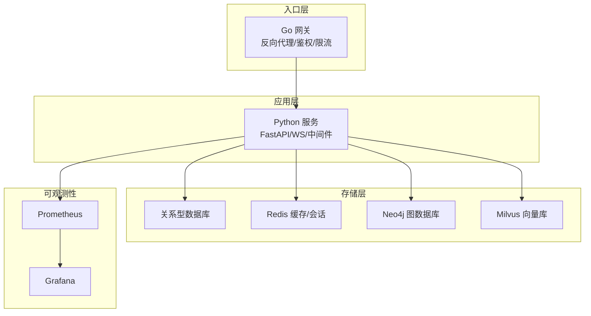
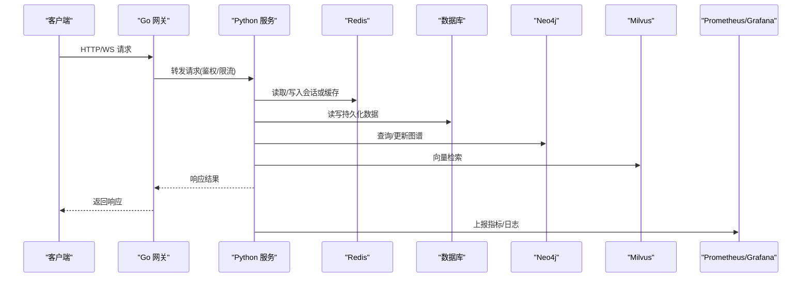
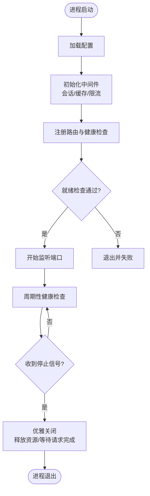
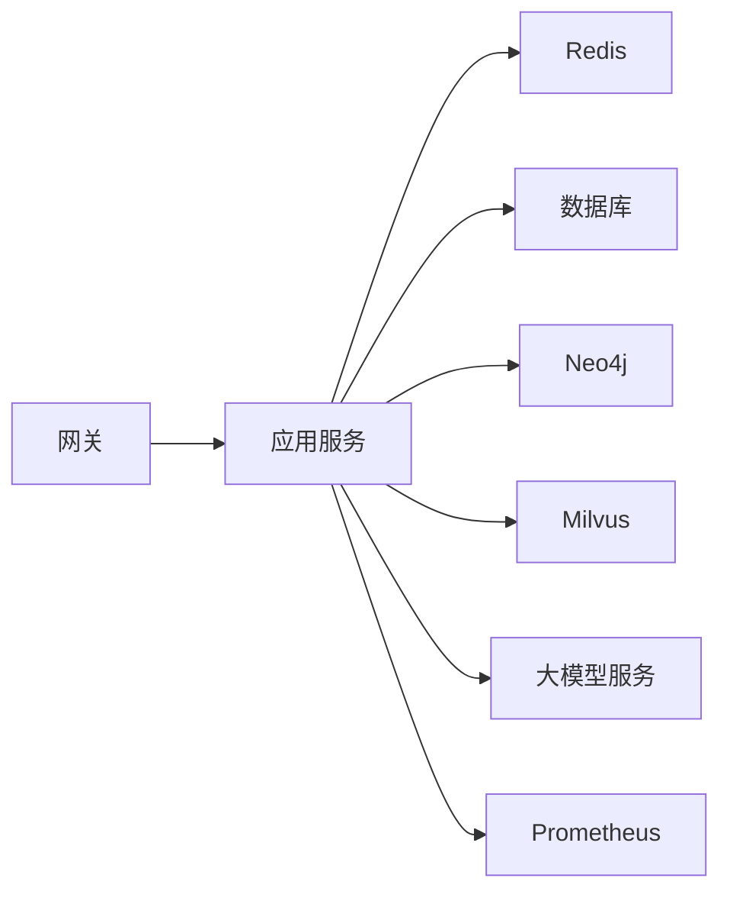
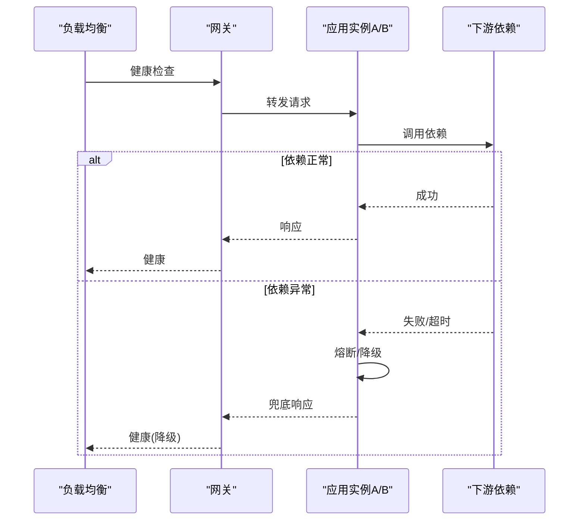
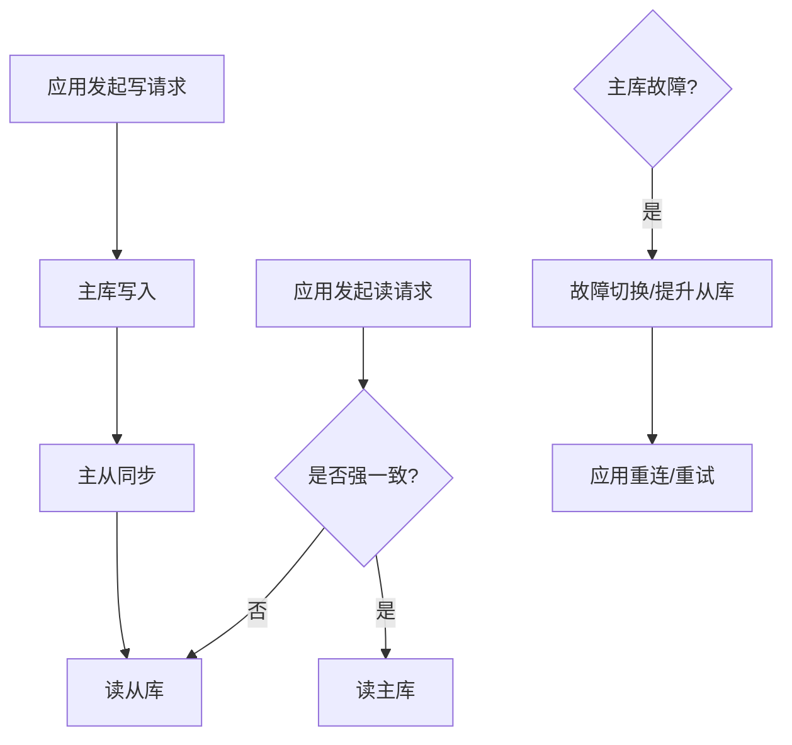
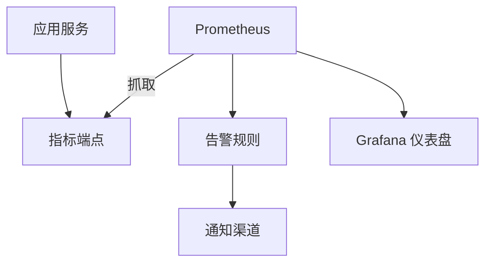

# 高可用架构

<cite>
**本文引用的文件**   
- [docker-compose.yml](file://docker-compose.yml)
- [backend_design/nexus/main.py](file://backend_design/nexus/main.py)
- [backend_design/nexus/config.py](file://backend_design/nexus/config.py)
- [backend_design/nexus/core/db_manager.py](file://backend_design/nexus/core/db_manager.py)
- [backend_design/nexus/middleware/session_store.py](file://backend_design/nexus/middleware/session_store.py)
- [backend_design/nexus/middleware/redis_cache.py](file://backend_design/nexus/middleware/redis_cache.py)
- [backend_design/nexus/api/routes/health.py](file://backend_design/nexus/api/routes/health.py)
- [backend_design/nexus/core/circuit_breaker.py](file://backend_design/nexus/core/circuit_breaker.py)
- [backend_design/nexus/observability/metrics.py](file://backend_design/nexus/observability/metrics.py)
- [backend_design/nexus_gate/internal/proxy/proxy.go](file://backend_design/nexus_gate/internal/proxy/proxy.go)
- [backend_design/nexus_gate/internal/ratelimit/ratelimit.go](file://backend_design/nexus_gate/internal/ratelimit/ratelimit.go)
- [config/prometheus/prometheus.yml](file://config/prometheus/prometheus.yml)
- [config/grafana/provisioning/datasources/prometheus.yml](file://config/grafana/provisioning/datasources/prometheus.yml)
- [config/grafana/provisioning/dashboards/dashboards.yml](file://config/grafana/provisioning/dashboards/dashboards.yml)
- [config/grafana/provisioning/dashboards/nexuscockpit-overview.json](file://config/grafana/provisioning/dashboards/nexuscockpit-overview.json)
- [backend_design/scripts/init_neo4j.py](file://backend_design/scripts/init_neo4j.py)
- [backend_design/scripts/init_milvus.py](file://backend_design/scripts/init_milvus.py)
</cite>

## 目录
1. [简介](#简介)
2. [项目结构](#项目结构)
3. [核心组件](#核心组件)
4. [架构总览](#架构总览)
5. [详细组件分析](#详细组件分析)
6. [依赖关系分析](#依赖关系分析)
7. [性能与扩缩容](#性能与扩缩容)
8. [故障转移与自动恢复](#故障转移与自动恢复)
9. [数据库高可用](#数据库高可用)
10. [监控告警系统](#监控告警系统)
11. [灾难恢复方案](#灾难恢复方案)
12. [结论](#结论)

## 简介
本指南面向 NexusCockpit 的高可用（HA）架构设计与落地实践，覆盖服务集群部署、负载均衡与服务发现、健康检查策略、无状态服务扩缩容、会话共享与数据一致性、故障转移与优雅关闭、数据库主从复制与读写分离、监控告警、以及灾难恢复与业务连续性保障。文档以仓库现有实现为依据，结合通用 HA 最佳实践给出可操作建议与图示说明。

## 项目结构
NexusCockpit 采用前后端分离与多语言微服务组合：
- 后端 Python 服务（FastAPI）提供 API、WebSocket、中间件、可观测性、RAG/向量检索等能力
- Go 网关（nexus_gate）承担反向代理、鉴权、限流、WebSocket Hub 等职责
- 配置与可观测性通过 Prometheus/Grafana 进行指标采集与可视化
- 容器编排使用 docker-compose 定义服务拓扑与启动顺序

**图表来源**
- [docker-compose.yml](file://docker-compose.yml)
- [backend_design/nexus/main.py](file://backend_design/nexus/main.py)
- [backend_design/nexus_gate/internal/proxy/proxy.go](file://backend_design/nexus_gate/internal/proxy/proxy.go)
- [config/prometheus/prometheus.yml](file://config/prometheus/prometheus.yml)

**章节来源**
- [docker-compose.yml](file://docker-compose.yml)
- [backend_design/nexus/main.py](file://backend_design/nexus/main.py)

## 核心组件
- 网关与负载均衡
  - Go 网关作为统一入口，提供反向代理、鉴权、限流与 WebSocket 转发能力，便于横向扩展与流量治理。
- 应用服务
  - Python FastAPI 服务承载业务逻辑、中间件（会话、缓存、任务队列）、可观测性埋点与健康检查接口。
- 中间件与缓存
  - Redis 用于会话共享与热点缓存；任务队列支撑异步处理。
- 数据存储
  - 关系型数据库用于事务型数据；Neo4j 用于知识图谱；Milvus 用于向量检索。
- 可观测性
  - Prometheus 采集指标，Grafana 提供仪表盘与告警。

**章节来源**
- [backend_design/nexus_gate/internal/proxy/proxy.go](file://backend_design/nexus_gate/internal/proxy/proxy.go)
- [backend_design/nexus_gate/internal/ratelimit/ratelimit.go](file://backend_design/nexus_gate/internal/ratelimit/ratelimit.go)
- [backend_design/nexus/middleware/session_store.py](file://backend_design/nexus/middleware/session_store.py)
- [backend_design/nexus/middleware/redis_cache.py](file://backend_design/nexus/middleware/redis_cache.py)
- [backend_design/nexus/observability/metrics.py](file://backend_design/nexus/observability/metrics.py)
- [backend_design/nexus/api/routes/health.py](file://backend_design/nexus/api/routes/health.py)

## 架构总览
下图展示高可用入口到后端、存储与可观测性的整体交互。

**图表来源**
- [backend_design/nexus_gate/internal/proxy/proxy.go](file://backend_design/nexus_gate/internal/proxy/proxy.go)
- [backend_design/nexus/middleware/redis_cache.py](file://backend_design/nexus/middleware/redis_cache.py)
- [backend_design/nexus/core/db_manager.py](file://backend_design/nexus/core/db_manager.py)
- [backend_design/nexus/observability/metrics.py](file://backend_design/nexus/observability/metrics.py)

## 详细组件分析

### 网关与负载均衡
- 功能要点
  - 统一入口、反向代理、鉴权、限流、WebSocket Hub
  - 支持多实例部署，配合外部负载均衡器（如 Nginx/云 LB）实现水平扩展
- 关键实现位置
  - 反向代理与路由：[proxy.go](file://backend_design/nexus_gate/internal/proxy/proxy.go)
  - 限流控制：[ratelimit.go](file://backend_design/nexus_gate/internal/ratelimit/ratelimit.go)
- 部署建议
  - 将网关与后端服务分别独立扩缩容
  - 在网关前放置四层/七层负载均衡，启用健康检查与权重调度

**章节来源**
- [backend_design/nexus_gate/internal/proxy/proxy.go](file://backend_design/nexus_gate/internal/proxy/proxy.go)
- [backend_design/nexus_gate/internal/ratelimit/ratelimit.go](file://backend_design/nexus_gate/internal/ratelimit/ratelimit.go)

### 应用服务与健康检查
- 健康检查
  - 暴露健康检查路由，供负载均衡器探测存活与就绪状态
  - 参考路径：[health.py](file://backend_design/nexus/api/routes/health.py)
- 配置管理
  - 集中配置加载与环境变量注入，便于多环境一致部署
  - 参考路径：[config.py](file://backend_design/nexus/config.py)
- 启动与生命周期
  - 服务启动、中间件注册、路由挂载与优雅关闭钩子
  - 参考路径：[main.py](file://backend_design/nexus/main.py)

**图表来源**
- [backend_design/nexus/main.py](file://backend_design/nexus/main.py)
- [backend_design/nexus/api/routes/health.py](file://backend_design/nexus/api/routes/health.py)
- [backend_design/nexus/config.py](file://backend_design/nexus/config.py)

**章节来源**
- [backend_design/nexus/api/routes/health.py](file://backend_design/nexus/api/routes/health.py)
- [backend_design/nexus/config.py](file://backend_design/nexus/config.py)
- [backend_design/nexus/main.py](file://backend_design/nexus/main.py)

### 会话共享与缓存
- 会话共享
  - 基于 Redis 的会话存储，确保多实例间会话一致性与快速访问
  - 参考路径：[session_store.py](file://backend_design/nexus/middleware/session_store.py)
- 缓存策略
  - 热点数据缓存、失效策略与回源保护
  - 参考路径：[redis_cache.py](file://backend_design/nexus/middleware/redis_cache.py)
- 一致性建议
  - 写扩散优先，读多写少场景下设置合理 TTL 与版本号
  - 对强一致数据避免仅依赖缓存，必要时引入分布式锁或幂等键

**章节来源**
- [backend_design/nexus/middleware/session_store.py](file://backend_design/nexus/middleware/session_store.py)
- [backend_design/nexus/middleware/redis_cache.py](file://backend_design/nexus/middleware/redis_cache.py)

### 熔断与降级
- 熔断器
  - 针对下游依赖（LLM、车辆接口、第三方服务）实现熔断、退避与快速失败
  - 参考路径：[circuit_breaker.py](file://backend_design/nexus/core/circuit_breaker.py)
- 降级策略
  - 在依赖不可用时返回兜底结果或提示，保证核心链路可用
- 适用场景
  - 大模型调用、外部 API 抖动、网络分区等

**章节来源**
- [backend_design/nexus/core/circuit_breaker.py](file://backend_design/nexus/core/circuit_breaker.py)

### 可观测性
- 指标采集
  - 应用侧埋点上报至 Prometheus，涵盖 QPS、延迟、错误率、资源使用等
  - 参考路径：[metrics.py](file://backend_design/nexus/observability/metrics.py)
- 配置与可视化
  - Prometheus 抓取配置、Grafana 数据源与仪表盘
  - 参考路径：
    - [prometheus.yml](file://config/prometheus/prometheus.yml)
    - [datasources/prometheus.yml](file://config/grafana/provisioning/datasources/prometheus.yml)
    - [dashboards/dashboards.yml](file://config/grafana/provisioning/dashboards/dashboards.yml)
    - [dashboards/nexuscockpit-overview.json](file://config/grafana/provisioning/dashboards/nexuscockpit-overview.json)

**章节来源**
- [backend_design/nexus/observability/metrics.py](file://backend_design/nexus/observability/metrics.py)
- [config/prometheus/prometheus.yml](file://config/prometheus/prometheus.yml)
- [config/grafana/provisioning/datasources/prometheus.yml](file://config/grafana/provisioning/datasources/prometheus.yml)
- [config/grafana/provisioning/dashboards/dashboards.yml](file://config/grafana/provisioning/dashboards/dashboards.yml)
- [config/grafana/provisioning/dashboards/nexuscockpit-overview.json](file://config/grafana/provisioning/dashboards/nexuscockpit-overview.json)

## 依赖关系分析
- 组件耦合
  - 网关与应用解耦，通过 HTTP/WS 通信；应用与存储通过驱动/SDK 连接
  - 中间件（会话/缓存）与应用低耦合，可通过配置切换实现
- 外部依赖
  - Redis、Neo4j、Milvus、数据库、LLM 服务等
- 潜在风险
  - 单点依赖（如 Redis/数据库）需做高可用与容灾
  - 大模型/外部 API 需熔断与超时控制

**图表来源**
- [docker-compose.yml](file://docker-compose.yml)
- [backend_design/nexus/core/db_manager.py](file://backend_design/nexus/core/db_manager.py)
- [backend_design/nexus/middleware/redis_cache.py](file://backend_design/nexus/middleware/redis_cache.py)
- [backend_design/nexus/observability/metrics.py](file://backend_design/nexus/observability/metrics.py)

**章节来源**
- [docker-compose.yml](file://docker-compose.yml)
- [backend_design/nexus/core/db_manager.py](file://backend_design/nexus/core/db_manager.py)

## 性能与扩缩容
- 水平扩展
  - 网关与应用均无状态设计，可按 CPU/内存/QPS 指标弹性扩容
  - 通过容器编排或 K8s HPA 自动扩缩容
- 会话共享
  - 使用 Redis 集中式会话存储，避免本地会话导致的不一致
- 缓存优化
  - 多级缓存（本地+Redis），热点数据预取与批量写入
- 连接池与超时
  - 为数据库、Redis、外部 API 配置合理的连接池大小与超时时间
- 背压与限流
  - 网关层限流，应用层令牌桶/漏桶控制，防止雪崩

[本节为通用指导，不直接分析具体文件]

## 故障转移与自动恢复
- 健康检查与剔除
  - 网关/负载均衡定期探测健康端点，异常实例自动剔除
  - 参考路径：[health.py](file://backend_design/nexus/api/routes/health.py)
- 重试与退避
  - 对幂等请求实施指数退避重试，避免放大故障
- 熔断与降级
  - 依赖不可用时快速失败并返回兜底结果
  - 参考路径：[circuit_breaker.py](file://backend_design/nexus/core/circuit_breaker.py)
- 优雅关闭
  - 接收停止信号后拒绝新请求、等待进行中请求完成、释放资源
  - 参考路径：[main.py](file://backend_design/nexus/main.py)

**图表来源**
- [backend_design/nexus/api/routes/health.py](file://backend_design/nexus/api/routes/health.py)
- [backend_design/nexus/core/circuit_breaker.py](file://backend_design/nexus/core/circuit_breaker.py)
- [backend_design/nexus/main.py](file://backend_design/nexus/main.py)

**章节来源**
- [backend_design/nexus/api/routes/health.py](file://backend_design/nexus/api/routes/health.py)
- [backend_design/nexus/core/circuit_breaker.py](file://backend_design/nexus/core/circuit_breaker.py)
- [backend_design/nexus/main.py](file://backend_design/nexus/main.py)

## 数据库高可用
- 主从复制与读写分离
  - 主库负责写，从库负责读；应用层根据操作类型选择目标节点
  - 连接管理与故障切换由数据库驱动或代理层实现
- 故障切换
  - 主库异常时自动提升从库为主，应用层重连与重试
- 数据一致性
  - 强一致读走主库；弱一致读走从库并容忍短暂不一致
- 初始化脚本
  - Neo4j/Milvus 初始化脚本用于环境准备与基线数据导入
  - 参考路径：
    - [init_neo4j.py](file://backend_design/scripts/init_neo4j.py)
    - [init_milvus.py](file://backend_design/scripts/init_milvus.py)

**图表来源**
- [backend_design/nexus/core/db_manager.py](file://backend_design/nexus/core/db_manager.py)
- [backend_design/scripts/init_neo4j.py](file://backend_design/scripts/init_neo4j.py)
- [backend_design/scripts/init_milvus.py](file://backend_design/scripts/init_milvus.py)

**章节来源**
- [backend_design/nexus/core/db_manager.py](file://backend_design/nexus/core/db_manager.py)
- [backend_design/scripts/init_neo4j.py](file://backend_design/scripts/init_neo4j.py)
- [backend_design/scripts/init_milvus.py](file://backend_design/scripts/init_milvus.py)

## 监控告警系统
- 指标采集
  - 应用侧暴露指标端点，Prometheus 定时抓取
  - 参考路径：[metrics.py](file://backend_design/nexus/observability/metrics.py)、[prometheus.yml](file://config/prometheus/prometheus.yml)
- 阈值与告警
  - 在 Grafana/PromQL 中定义阈值规则，结合通知渠道（邮件、企业微信、钉钉等）
- 仪表盘
  - 预置总览仪表盘，便于快速定位问题
  - 参考路径：
    - [dashboards.yml](file://config/grafana/provisioning/dashboards/dashboards.yml)
    - [nexuscockpit-overview.json](file://config/grafana/provisioning/dashboards/nexuscockpit-overview.json)
    - [datasources/prometheus.yml](file://config/grafana/provisioning/datasources/prometheus.yml)

**图表来源**
- [backend_design/nexus/observability/metrics.py](file://backend_design/nexus/observability/metrics.py)
- [config/prometheus/prometheus.yml](file://config/prometheus/prometheus.yml)
- [config/grafana/provisioning/datasources/prometheus.yml](file://config/grafana/provisioning/datasources/prometheus.yml)
- [config/grafana/provisioning/dashboards/dashboards.yml](file://config/grafana/provisioning/dashboards/dashboards.yml)
- [config/grafana/provisioning/dashboards/nexuscockpit-overview.json](file://config/grafana/provisioning/dashboards/nexuscockpit-overview.json)

**章节来源**
- [backend_design/nexus/observability/metrics.py](file://backend_design/nexus/observability/metrics.py)
- [config/prometheus/prometheus.yml](file://config/prometheus/prometheus.yml)
- [config/grafana/provisioning/datasources/prometheus.yml](file://config/grafana/provisioning/datasources/prometheus.yml)
- [config/grafana/provisioning/dashboards/dashboards.yml](file://config/grafana/provisioning/dashboards/dashboards.yml)
- [config/grafana/provisioning/dashboards/nexuscockpit-overview.json](file://config/grafana/provisioning/dashboards/nexuscockpit-overview.json)

## 灾难恢复方案
- 数据备份策略
  - 数据库全量+增量备份，对象存储归档；Neo4j/Milvus 按各自工具导出快照
- 异地容灾
  - 跨机房/跨区域部署，数据同步与只读副本；DNS/全局负载均衡切换
- 业务连续性
  - 关键链路降级、只读模式、灰度发布与快速回滚
- 演练与验证
  - 定期演练故障切换与恢复流程，验证 RTO/RPO 达标

[本节为通用指导，不直接分析具体文件]

## 结论
通过网关与应用的无状态化、Redis 会话共享、熔断降级、健康检查与优雅关闭、数据库主从与读写分离、完善的监控告警与灾难恢复机制，NexusCockpit 可在多实例环境下实现高可用与弹性伸缩。建议在生产环境结合容器编排平台与云原生组件进一步自动化运维与弹性治理。