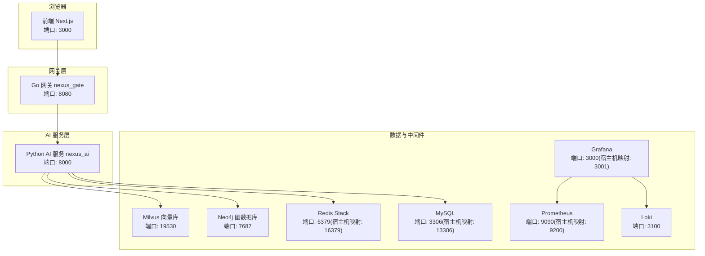
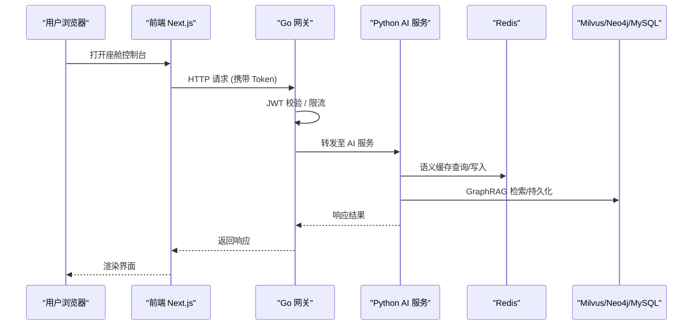
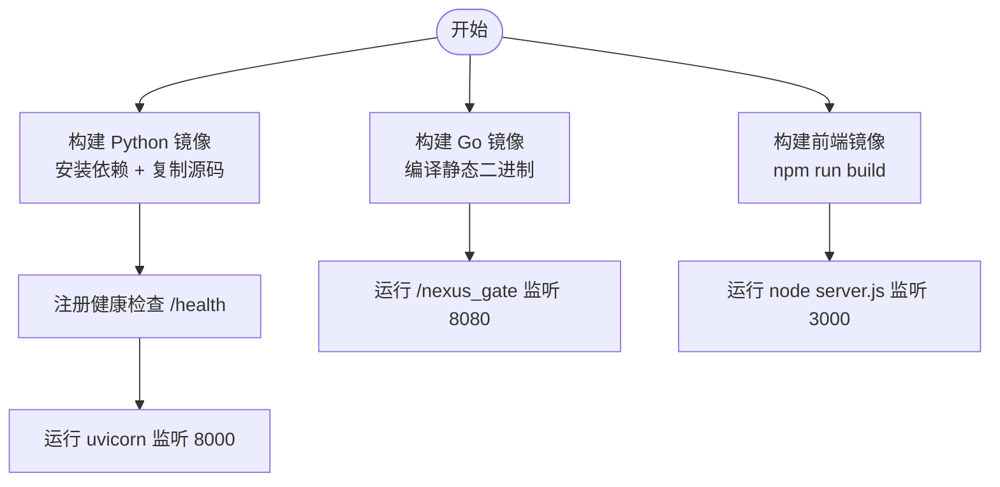
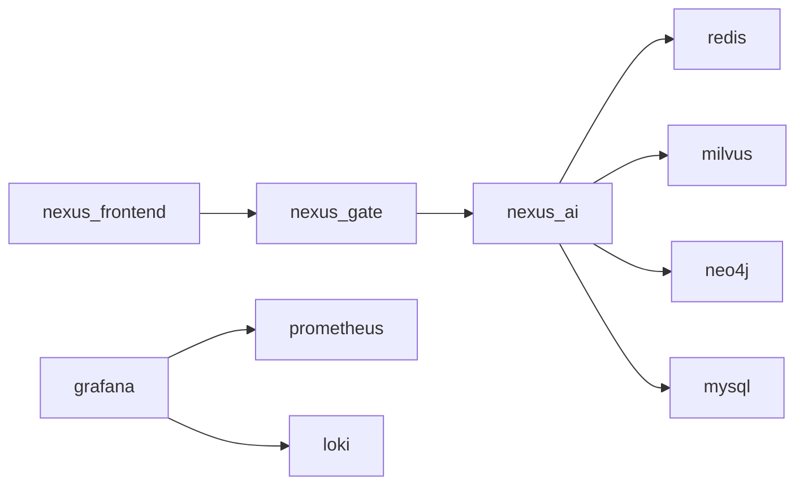
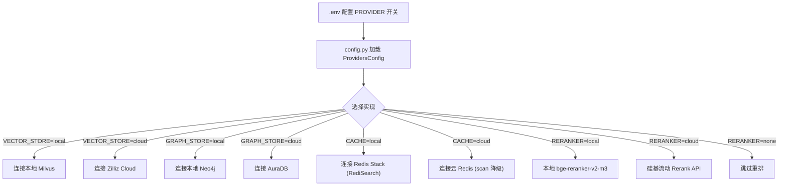
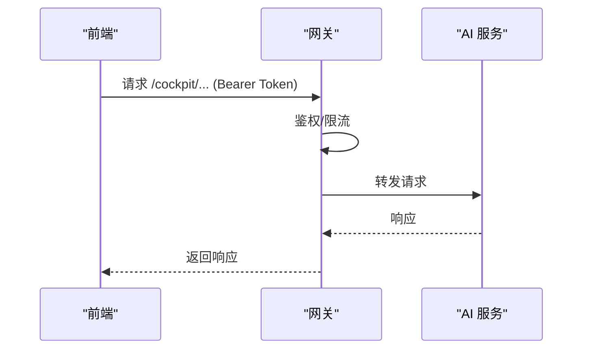
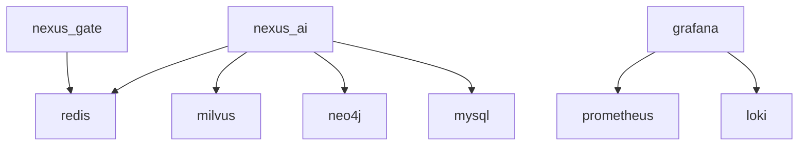

# 部署指南

<cite>
**本文引用的文件**   
- [README.md](file://README.md)
- [docker-compose.yml](file://docker-compose.yml)
- [backend_design/Dockerfile](file://backend_design/Dockerfile)
- [backend_design/nexus_gate/Dockerfile](file://backend_design/nexus_gate/Dockerfile)
- [frontend_design/Dockerfile](file://frontend_design/Dockerfile)
- [backend_design/nexus/config.py](file://backend_design/nexus/config.py)
- [.env.example](file:.env.example)
- [docs/deployment/SETUP.md](file://docs/deployment/SETUP.md)
- [docs/architecture/L5-middleware.md](file://docs/architecture/L5-middleware.md)
- [backend_design/nexus/core/cockpit_manager.py](file://backend_design/nexus/core/cockpit_manager.py)
</cite>

## 目录
1. [简介](#简介)
2. [项目结构](#项目结构)
3. [核心组件](#核心组件)
4. [架构总览](#架构总览)
5. [详细组件分析](#详细组件分析)
6. [依赖关系分析](#依赖关系分析)
7. [性能与容量规划](#性能与容量规划)
8. [安全加固](#安全加固)
9. [监控与告警](#监控与告警)
10. [故障排查手册](#故障排查手册)
11. [回滚与灾难恢复](#回滚与灾难恢复)
12. [结论](#结论)

## 简介
本指南面向希望部署 NexusCockpit 的工程师与运维人员，覆盖三种部署方式：
- 本地开发部署（推荐新手）
- 双模式部署（本地 + 云端混合）
- 全 Docker 生产部署

同时说明容器化架构、镜像构建、服务编排、服务发现与负载均衡策略；提供双模式一键切换机制；给出生产环境性能调优、安全加固、监控告警配置建议；并包含故障排查、回滚策略与灾难恢复方案。

## 项目结构
NexusCockpit 采用前后端分离与多语言微服务组合：
- 前端：Next.js 应用，通过环境变量指向网关地址
- 网关：Go 实现的高并发网关，负责鉴权、限流、WebSocket Hub 与反向代理
- 后端：Python FastAPI AI 服务，集成 Multi-Agent、GraphRAG、语义缓存等能力
- 基础设施：Milvus、Neo4j、Redis、MySQL、Prometheus、Grafana、Loki 等中间件由 docker-compose 统一编排

图示来源
- [docker-compose.yml:1-246](file://docker-compose.yml#L1-L246)
- [backend_design/Dockerfile:1-41](file://backend_design/Dockerfile#L1-L41)
- [backend_design/nexus_gate/Dockerfile:1-22](file://backend_design/nexus_gate/Dockerfile#L1-L22)
- [frontend_design/Dockerfile:1-32](file://frontend_design/Dockerfile#L1-L32)

章节来源
- [README.md:95-140](file://README.md#L95-L140)
- [docker-compose.yml:1-246](file://docker-compose.yml#L1-L246)

## 核心组件
- Go 网关 (nexus_gate)
  - 职责：JWT 鉴权、优先级限流、WebSocket Hub、反向代理到 Python AI 服务
  - 暴露端口：8080
  - 健康检查：/health
- Python AI 服务 (nexus_ai)
  - 职责：FastAPI REST/SSE/WebSocket、Multi-Agent、GraphRAG、语义缓存、ASR/TTS、车控总线适配
  - 暴露端口：8000
  - 健康检查：/health
- 前端 (nexus_frontend)
  - 职责：Next.js 页面与交互，通过 NEXT_PUBLIC_API_URL 访问网关
  - 暴露端口：3000
- 基础设施
  - Milvus、Neo4j、Redis、MySQL、Prometheus、Grafana、Loki 等

章节来源
- [docker-compose.yml:14-89](file://docker-compose.yml#L14-L89)
- [backend_design/Dockerfile:33-41](file://backend_design/Dockerfile#L33-L41)
- [backend_design/nexus_gate/Dockerfile:20-22](file://backend_design/nexus_gate/Dockerfile#L20-L22)
- [frontend_design/Dockerfile:29-32](file://frontend_design/Dockerfile#L29-L32)

## 架构总览
系统采用分层架构与容器编排：
- L0 基础设施层：Docker Compose 编排 Milvus、Neo4j、Redis、MySQL、Prometheus、Grafana、Loki
- L1 核心层：配置中心、日志、异常、熔断器
- L2 数据层：GraphRAG、Memory、向量/图谱存储
- L3 服务层：ASR/TTS、Skills、Vehicle、Intent、MCP
- L4 Agent 层：Supervisor + 专家 Agent 并行执行、Responder、Reviewer
- L5 中间件层：语义缓存、限流、会话存储、异步任务
- L6 API 层：FastAPI REST/SSE/WebSocket + JWT
- L7 可观测层：Langfuse、Prometheus、Grafana

图示来源
- [docker-compose.yml:14-89](file://docker-compose.yml#L14-L89)
- [backend_design/nexus/config.py:458-489](file://backend_design/nexus/config.py#L458-L489)
- [docs/architecture/L5-middleware.md:1-87](file://docs/architecture/L5-middleware.md#L1-L87)

## 详细组件分析

### 容器化与镜像构建
- Python AI 服务镜像
  - 多阶段构建：builder 安装依赖，runner 运行 uvicorn
  - 健康检查：/health
  - 启动命令：uvicorn nexus.main:app --host 0.0.0.0 --port 8000
- Go 网关镜像
  - 多阶段构建：golang:1.22-alpine 编译静态二进制
  - 最小化运行镜像：alpine:3.19
  - 启动命令：/nexus_gate
- 前端镜像
  - 多阶段构建：node:18-alpine 构建产物，standalone 运行
  - 启动命令：node server.js

图示来源
- [backend_design/Dockerfile:1-41](file://backend_design/Dockerfile#L1-L41)
- [backend_design/nexus_gate/Dockerfile:1-22](file://backend_design/nexus_gate/Dockerfile#L1-L22)
- [frontend_design/Dockerfile:1-32](file://frontend_design/Dockerfile#L1-L32)

章节来源
- [backend_design/Dockerfile:1-41](file://backend_design/Dockerfile#L1-L41)
- [backend_design/nexus_gate/Dockerfile:1-22](file://backend_design/nexus_gate/Dockerfile#L1-L22)
- [frontend_design/Dockerfile:1-32](file://frontend_design/Dockerfile#L1-L32)

### 服务编排与服务发现
- 使用 docker-compose.yml 定义所有服务及依赖关系
- 服务发现与网络
  - 同一 compose 网络内，服务名即主机名（如 nexus_ai、redis、milvus、neo4j）
  - 通过环境变量注入连接参数（如 NEXUS_AI_HOST、REDIS_HOST、MILVUS_URI 等）
- 健康检查与启动顺序
  - 各服务定义 healthcheck，depends_on 指定条件为 service_healthy
- 端口映射
  - 宿主机端口映射避免冲突（如 Redis 6379→16379，MySQL 3306→13306，Grafana 3000→3001）

图示来源
- [docker-compose.yml:14-89](file://docker-compose.yml#L14-L89)
- [docker-compose.yml:94-233](file://docker-compose.yml#L94-L233)

章节来源
- [docker-compose.yml:1-246](file://docker-compose.yml#L1-L246)

### 双模式部署（本地 + 云端混合）
- 通过 ProvidersConfig 控制各组件 provider 开关：
  - VECTOR_STORE_PROVIDER：local=本地 Milvus | cloud=Zilliz Cloud
  - GRAPH_STORE_PROVIDER：local=本地 Neo4j | cloud=AuraDB
  - CACHE_PROVIDER：local=本地 Redis Stack | cloud=云 Redis（无 RediSearch 时自动降级 scan）
  - RERANKER_PROVIDER：local=本地 BGE | cloud=硅基流动 Rerank | none=跳过
- 在 .env 中设置对应 provider 与云端凭据（如 Zilliz URI/Token、AuraDB URI/Password、云 Redis Host/Port/Password），代码无需改动
- 语义缓存双模式支持：cloud 模式下跳过 RediSearch 索引初始化，使用 scan 降级模式

图示来源
- [backend_design/nexus/config.py:458-489](file://backend_design/nexus/config.py#L458-L489)
- [docs/architecture/L5-middleware.md:50-58](file://docs/architecture/L5-middleware.md#L50-L58)
- [.env.example](file:.env.example#L125-L150)

章节来源
- [backend_design/nexus/config.py:458-489](file://backend_design/nexus/config.py#L458-L489)
- [.env.example](file:.env.example#L125-L150)
- [docs/architecture/L5-middleware.md:50-58](file://docs/architecture/L5-middleware.md#L50-L58)

### 负载均衡与高可用
- 当前编排为单实例网关与 AI 服务
- 生产扩展建议
  - 网关与 AI 服务水平扩展：多个副本 + 外部负载均衡（如 Nginx/Ingress）
  - 前端静态资源 CDN 加速
  - 中间件集群化：Milvus 分布式、Neo4j 集群、Redis Sentinel/Cluster、MySQL 主从或集群
- 健康检查与滚动更新
  - 利用 healthcheck 与编排平台（Kubernetes）进行就绪探针与滚动升级

章节来源
- [docker-compose.yml:33-38](file://docker-compose.yml#L33-L38)
- [docker-compose.yml:70-74](file://docker-compose.yml#L70-L74)

### 前端与网关通信
- 前端通过 NEXT_PUBLIC_API_URL 指向网关地址
- 网关将请求转发到 nexus_ai 服务

图示来源
- [docker-compose.yml:76-89](file://docker-compose.yml#L76-L89)
- [docker-compose.yml:14-38](file://docker-compose.yml#L14-L38)

章节来源
- [docker-compose.yml:76-89](file://docker-compose.yml#L76-L89)

## 依赖关系分析
- 服务间依赖
  - nexus_gate 依赖 redis（健康检查）
  - nexus_ai 依赖 redis、milvus、mysql（健康检查）
  - grafana 依赖 prometheus、loki
- 端口与网络
  - 宿主机端口映射避免冲突
  - 容器内部通过服务名解析

图示来源
- [docker-compose.yml:14-89](file://docker-compose.yml#L14-L89)
- [docker-compose.yml:94-233](file://docker-compose.yml#L94-L233)

章节来源
- [docker-compose.yml:1-246](file://docker-compose.yml#L1-L246)

## 性能与容量规划
- 中间件容量
  - Redis：maxmemory 与淘汰策略已配置，建议根据 QPS 调整内存上限
  - Milvus：HNSW 索引参数（M、efConstruction、ef）影响召回率与延迟，需按数据规模与延迟目标调优
  - Neo4j：启用 APOC 插件，注意图遍历复杂度
  - MySQL：字符集 utf8mb4，确保索引与查询优化
- 应用层
  - Python 服务 workers 数与并发限制（LLM_CONCURRENCY_LIMIT）
  - 语义缓存阈值与 TTL 分级
  - 限流窗口与令牌桶参数
- 资源预留
  - CPU/内存/磁盘按模型大小与并发量评估，GPU 可选用于 ASR/TTS

章节来源
- [docker-compose.yml:162-175](file://docker-compose.yml#L162-L175)
- [backend_design/nexus/config.py:167-198](file://backend_design/nexus/config.py#L167-L198)
- [docs/architecture/L5-middleware.md:59-87](file://docs/architecture/L5-middleware.md#L59-L87)

## 安全加固
- 密钥管理
  - JWT_SECRET_KEY、MYSQL_PASSWORD、NEO4J_PASSWORD 在生产环境必须修改
  - ARK_API_KEY、TAVILY_API_KEY 等敏感信息通过环境变量注入，不提交仓库
- CORS 与访问控制
  - 生产环境避免 cors_origins 包含 "*"
  - 网关层 JWT 校验与限流
- 网络安全
  - 仅暴露必要端口，使用反向代理与 TLS 终止
  - 中间件启用认证与访问白名单（如 Grafana admin/admin 需修改）

章节来源
- [backend_design/nexus/config.py:633-655](file://backend_design/nexus/config.py#L633-L655)
- [docker-compose.yml:220-233](file://docker-compose.yml#L220-L233)

## 监控与告警
- Prometheus 采集指标，Grafana 可视化看板
- Loki 聚合日志，便于问题定位
- Langfuse 追踪 LLM 调用链路（可选）
- 健康检查与就绪探针用于编排平台

章节来源
- [docker-compose.yml:208-233](file://docker-compose.yml#L208-L233)
- [backend_design/nexus/config.py:395-414](file://backend_design/nexus/config.py#L395-L414)

## 故障排查手册
- 常见问题
  - Docker 启动失败：检查 Docker 状态与端口占用
  - Milvus 连接失败：查看容器日志与等待完全启动
  - 模型加载失败：确认模型路径与权限
  - GPU 不可用：检查 CUDA 驱动与 PyTorch 版本
  - pip 安装超时：使用国内镜像源
- 验证步骤
  - 健康检查接口：/health
  - Swagger UI：/docs
  - Grafana 面板：admin/admin

章节来源
- [docs/deployment/SETUP.md:464-528](file://docs/deployment/SETUP.md#L464-L528)
- [README.md:260-318](file://README.md#L260-L318)

## 回滚与灾难恢复
- 版本回滚
  - 基于镜像标签与编排平台（Compose/K8s）快速回滚到上一稳定版本
  - 前端静态资源与后端 API 保持向后兼容
- 数据备份与恢复
  - 定期备份 Milvus、Neo4j、Redis、MySQL 数据卷
  - 制定恢复演练计划，确保 RTO/RPO 达标
- 降级策略
  - LLM 降级：云端不可用时自动切换到本地 llama.cpp OpenAI 兼容接口
  - 语义缓存降级：云 Redis 无 RediSearch 时自动使用 scan 模式
  - 限流保护：突发流量下触发限流，保障核心功能可用

章节来源
- [backend_design/nexus/config.py:131-146](file://backend_design/nexus/config.py#L131-L146)
- [docs/architecture/L5-middleware.md:50-58](file://docs/architecture/L5-middleware.md#L50-L58)

## 结论
通过本地开发、双模式与全 Docker 三种部署方式，NexusCockpit 可在不同场景下快速落地。容器化与编排提供了良好的可移植性与可扩展性；双模式开关实现了本地与云端的无缝切换；结合监控与告警、安全加固与回滚策略，可满足生产环境的稳定性与安全性要求。