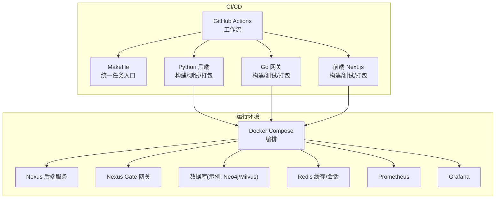
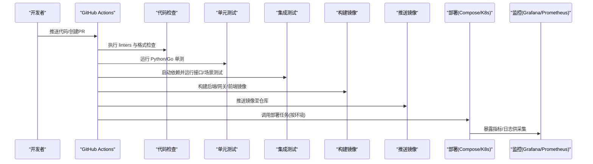
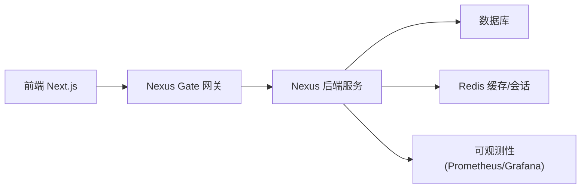

# CI/CD流水线

<cite>
**本文引用的文件**   
- [.github/workflows/ci.yml](file://.github/workflows/ci.yml)
- [Makefile](file://Makefile)
- [docker-compose.yml](file://docker-compose.yml)
- [backend_design/Dockerfile](file://backend_design/Dockerfile)
- [frontend_design/Dockerfile](file://frontend_design/Dockerfile)
- [backend_design/pyproject.toml](file://backend_design/pyproject.toml)
- [backend_design/requirements.txt](file://backend_design/requirements.txt)
- [backend_design/scripts/test_api.py](file://backend_design/scripts/test_api.py)
- [backend_design/tests/test_api.py](file://backend_design/tests/test_api.py)
- [backend_design/tests/test_core.py](file://backend_design/tests/test_core.py)
- [backend_design/tests/test_v21.py](file://backend_design/tests/test_v21.py)
- [backend_design/nexus/main.py](file://backend_design/nexus/main.py)
- [backend_design/nexus/config.py](file://backend_design/nexus/config.py)
- [backend_design/nexus/core/logger.py](file://backend_design/nexus/core/logger.py)
- [backend_design/nexus/core/db_manager.py](file://backend_design/nexus/core/db_manager.py)
- [backend_design/nexus/middleware/session_store.py](file://backend_design/nexus/middleware/session_store.py)
- [backend_design/nexus/middleware/redis_cache.py](file://backend_design/nexus/middleware/redis_cache.py)
- [backend_design/nexus/api/websocket.py](file://backend_design/nexus/api/websocket.py)
- [backend_design/nexus/observability/metrics.py](file://backend_design/nexus/observability/metrics.py)
- [config/prometheus/prometheus.yml](file://config/prometheus/prometheus.yml)
- [config/grafana/provisioning/dashboards/dashboards.yml](file://config/grafana/provisioning/dashboards/dashboards.yml)
- [config/grafana/provisioning/datasources/prometheus.yml](file://config/grafana/provisioning/datasources/prometheus.yml)
- [backend_design/go.mod](file://backend_design/go.mod)
- [backend_design/nexus_gate/Dockerfile](file://backend_design/nexus_gate/Dockerfile)
</cite>

## 目录
1. [简介](#简介)
2. [项目结构](#项目结构)
3. [核心组件](#核心组件)
4. [架构总览](#架构总览)
5. [详细组件分析](#详细组件分析)
6. [依赖关系分析](#依赖关系分析)
7. [性能考量](#性能考量)
8. [故障排查指南](#故障排查指南)
9. [结论](#结论)
10. [附录](#附录)

## 简介
本指南面向开发者与运维人员，系统化说明 NexusCockpit 的 CI/CD 流水线配置与使用方式。内容覆盖：
- GitHub Actions 工作流：代码检查、单元测试、集成测试、构建镜像与自动化部署
- Makefile 自动化任务：本地一键执行构建、测试、部署等流程
- 多环境部署策略：开发、测试、生产环境的差异化配置与发布路径
- 代码质量与静态分析：Python/Go 工具链与规则建议
- 自动化测试执行与结果报告：覆盖率、产物归档与可视化
- 回滚机制与版本管理：基于标签与镜像版本的灰度与回滚最佳实践

## 项目结构
仓库采用前后端分离与网关分层的工程组织方式，CI/CD 相关的关键位置如下：
- .github/workflows/ci.yml：GitHub Actions 主工作流定义
- Makefile：本地与 CI 统一的自动化任务入口
- docker-compose.yml：本地与测试环境编排（含后端、前端、网关、数据库、缓存、可观测性）
- backend_design/*：后端 Python 服务与 Go 网关源码、Dockerfile、依赖与脚本
- frontend_design/*：前端 Next.js 应用与 Dockerfile
- config/*：Prometheus/Grafana 等可观测性配置

图表来源
- [.github/workflows/ci.yml](file://.github/workflows/ci.yml)
- [Makefile](file://Makefile)
- [docker-compose.yml](file://docker-compose.yml)
- [backend_design/Dockerfile](file://backend_design/Dockerfile)
- [backend_design/nexus_gate/Dockerfile](file://backend_design/nexus_gate/Dockerfile)
- [frontend_design/Dockerfile](file://frontend_design/Dockerfile)

章节来源
- [.github/workflows/ci.yml](file://.github/workflows/ci.yml)
- [Makefile](file://Makefile)
- [docker-compose.yml](file://docker-compose.yml)

## 核心组件
- GitHub Actions 工作流
  - 触发条件：push/PR 到主干或特定分支；支持手动触发
  - 矩阵构建：并行构建 Python 后端、Go 网关、前端
  - 步骤：安装依赖、代码检查、单元测试、构建镜像、可选部署
- Makefile 任务
  - 提供 make lint、make test、make build、make deploy 等命令
  - 封装不同环境的变量与环境切换
- 容器化与编排
  - 后端与网关各自独立 Dockerfile
  - docker-compose 编排本地与测试环境，包含中间件与可观测性栈
- 可观测性与监控
  - Prometheus 抓取指标，Grafana 展示仪表盘
  - 日志与链路追踪通过中间件与 SDK 输出

章节来源
- [.github/workflows/ci.yml](file://.github/workflows/ci.yml)
- [Makefile](file://Makefile)
- [backend_design/Dockerfile](file://backend_design/Dockerfile)
- [backend_design/nexus_gate/Dockerfile](file://backend_design/nexus_gate/Dockerfile)
- [frontend_design/Dockerfile](file://frontend_design/Dockerfile)
- [docker-compose.yml](file://docker-compose.yml)

## 架构总览
下图展示了从代码提交到部署上线的端到端流程，以及各阶段产物的流转。

图表来源
- [.github/workflows/ci.yml](file://.github/workflows/ci.yml)
- [Makefile](file://Makefile)
- [docker-compose.yml](file://docker-compose.yml)

## 详细组件分析

### GitHub Actions 工作流
- 触发与并发控制
  - 支持 push/PR 触发，可按分支过滤
  - 设置并发组避免重复构建
- 环境与依赖
  - 为 Python/Go/Node 分别准备运行时与缓存
  - 按需拉取中间件（如 Redis、数据库）用于集成测试
- 任务阶段
  - 代码检查：Python 与 Go 的 linter、格式化、类型检查
  - 单元测试：pytest/unittest 与 go test
  - 集成测试：启动最小依赖集，执行 API/场景用例
  - 构建与打包：生成镜像并打标签（commit/tag）
  - 部署：根据环境变量选择目标环境（dev/staging/prod）
- 产物与报告
  - 上传测试报告与覆盖率
  - 记录关键日志与失败原因

章节来源
- [.github/workflows/ci.yml](file://.github/workflows/ci.yml)

### Makefile 自动化任务
- 常用任务
  - make lint：执行 Python/Go 代码检查与格式化
  - make test：运行单元与集成测试，生成报告
  - make build：构建后端/网关/前端镜像
  - make deploy：结合环境变量进行部署（Compose 或 K8s）
- 多环境支持
  - 通过环境变量区分 dev/staging/prod
  - 针对不同环境加载不同的 compose 扩展或参数
- 本地开发体验
  - 一键拉起依赖与服务
  - 热重载与调试开关

章节来源
- [Makefile](file://Makefile)

### 多环境部署策略
- 环境划分
  - 开发环境：快速迭代，启用详细日志与调试
  - 测试环境：稳定基线，完整集成测试与压测
  - 生产环境：严格准入，灰度发布与回滚能力
- 差异化配置
  - 通过环境变量注入数据库、缓存、鉴权、限流等配置
  - 使用独立的镜像标签与 Helm/Compose 参数
- 发布流程
  - 主干合并后自动构建镜像并推送到制品库
  - 先部署到 staging，验证通过后再滚动更新到 prod

章节来源
- [docker-compose.yml](file://docker-compose.yml)
- [backend_design/nexus/config.py](file://backend_design/nexus/config.py)

### 代码质量与静态分析
- Python
  - 建议使用 ruff/flake8、black/isort、mypy 等工具
  - 在 CI 中统一规则与阈值，失败阻断合并
- Go
  - 建议使用 golangci-lint、go vet、staticcheck
  - 对模块与包级别进行依赖与漏洞扫描
- 前端
  - ESLint + Prettier + TypeScript 类型检查
  - 构建产物体积与依赖审计

章节来源
- [backend_design/pyproject.toml](file://backend_design/pyproject.toml)
- [backend_design/requirements.txt](file://backend_design/requirements.txt)
- [backend_design/go.mod](file://backend_design/go.mod)

### 自动化测试执行与结果报告
- 单元测试
  - Python：pytest/unittest，生成 XML/JSON 报告
  - Go：go test -json，收集覆盖率
- 集成测试
  - 使用 docker-compose 启动依赖，执行 API/场景脚本
  - 断言关键路径与错误恢复逻辑
- 报告与可视化
  - 将测试结果与覆盖率上传至 CI 平台
  - 长期趋势与告警阈值

章节来源
- [backend_design/scripts/test_api.py](file://backend_design/scripts/test_api.py)
- [backend_design/tests/test_api.py](file://backend_design/tests/test_api.py)
- [backend_design/tests/test_core.py](file://backend_design/tests/test_core.py)
- [backend_design/tests/test_v21.py](file://backend_design/tests/test_v21.py)

### 回滚机制与版本管理
- 版本标识
  - 以 Git tag 作为发布版本，镜像标签与 tag 一致
- 灰度与回滚
  - 先小流量灰度，观察指标与错误率
  - 若异常则立即回滚到上一稳定版本
- 数据迁移
  - 迁移脚本幂等设计，支持正向与反向回滚
  - 在部署前完成校验与备份

章节来源
- [backend_design/scripts/v2.1_migration.sql](file://backend_design/scripts/v2.1_migration.sql)

## 依赖关系分析
- 组件耦合
  - 后端依赖数据库、缓存与会话存储
  - 网关负责鉴权、限流与 WebSocket 转发
  - 前端通过 API 与网关交互
- 外部依赖
  - 向量检索、Reranker、ASR/TTS 模型与中间件
  - 可观测性栈（Prometheus/Grafana）

图表来源
- [docker-compose.yml](file://docker-compose.yml)
- [backend_design/nexus_gate/Dockerfile](file://backend_design/nexus_gate/Dockerfile)
- [backend_design/Dockerfile](file://backend_design/Dockerfile)
- [frontend_design/Dockerfile](file://frontend_design/Dockerfile)

章节来源
- [docker-compose.yml](file://docker-compose.yml)

## 性能考量
- 构建优化
  - 利用缓存层加速依赖安装与编译
  - 多阶段构建减小镜像体积
- 运行期优化
  - 合理设置连接池与超时
  - 开启缓存与异步队列提升吞吐
- 监控与告警
  - 关键指标暴露与阈值告警
  - 慢查询与热点接口定位

[本节为通用指导，不直接分析具体文件]

## 故障排查指南
- 常见问题
  - 依赖安装失败：检查网络代理与缓存键
  - 测试失败：查看测试报告与日志片段
  - 部署失败：核对环境变量与镜像版本
- 定位方法
  - 查看 CI 日志与工件
  - 本地复现：使用 docker-compose 拉起最小环境
  - 指标与日志：通过 Grafana/Prometheus 与日志聚合定位

章节来源
- [backend_design/nexus/core/logger.py](file://backend_design/nexus/core/logger.py)
- [backend_design/nexus/core/db_manager.py](file://backend_design/nexus/core/db_manager.py)
- [backend_design/nexus/middleware/session_store.py](file://backend_design/nexus/middleware/session_store.py)
- [backend_design/nexus/middleware/redis_cache.py](file://backend_design/nexus/middleware/redis_cache.py)
- [backend_design/nexus/api/websocket.py](file://backend_design/nexus/api/websocket.py)
- [backend_design/nexus/observability/metrics.py](file://backend_design/nexus/observability/metrics.py)
- [config/prometheus/prometheus.yml](file://config/prometheus/prometheus.yml)
- [config/grafana/provisioning/dashboards/dashboards.yml](file://config/grafana/provisioning/dashboards/dashboards.yml)
- [config/grafana/provisioning/datasources/prometheus.yml](file://config/grafana/provisioning/datasources/prometheus.yml)

## 结论
通过统一的 CI/CD 流水线与 Makefile 任务，本项目实现了从代码检查、测试、构建到部署的全链路自动化。配合多环境策略、完善的可观测性与回滚机制，可有效保障交付质量与稳定性。建议在后续迭代中持续完善静态分析规则、覆盖率门槛与灰度发布流程，进一步提升整体工程效率与可靠性。

## 附录
- 快速上手
  - 本地构建与测试：参考 Makefile 任务
  - 本地编排：使用 docker-compose 拉起依赖与服务
- 参考配置
  - 后端与网关 Dockerfile
  - 可观测性配置文件

章节来源
- [backend_design/Dockerfile](file://backend_design/Dockerfile)
- [backend_design/nexus_gate/Dockerfile](file://backend_design/nexus_gate/Dockerfile)
- [frontend_design/Dockerfile](file://frontend_design/Dockerfile)
- [config/prometheus/prometheus.yml](file://config/prometheus/prometheus.yml)
- [config/grafana/provisioning/dashboards/dashboards.yml](file://config/grafana/provisioning/dashboards/dashboards.yml)
- [config/grafana/provisioning/datasources/prometheus.yml](file://config/grafana/provisioning/datasources/prometheus.yml)