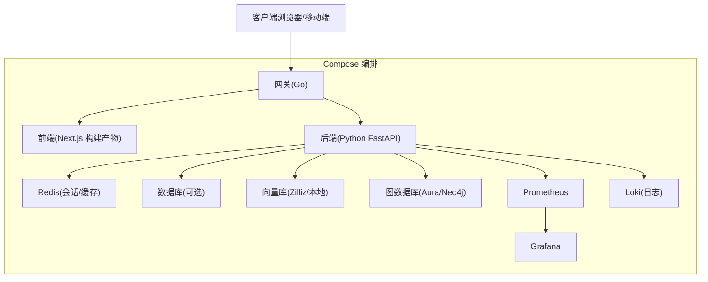
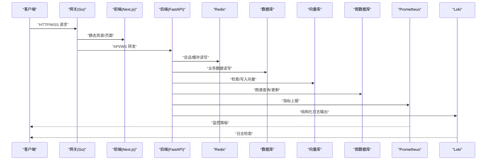
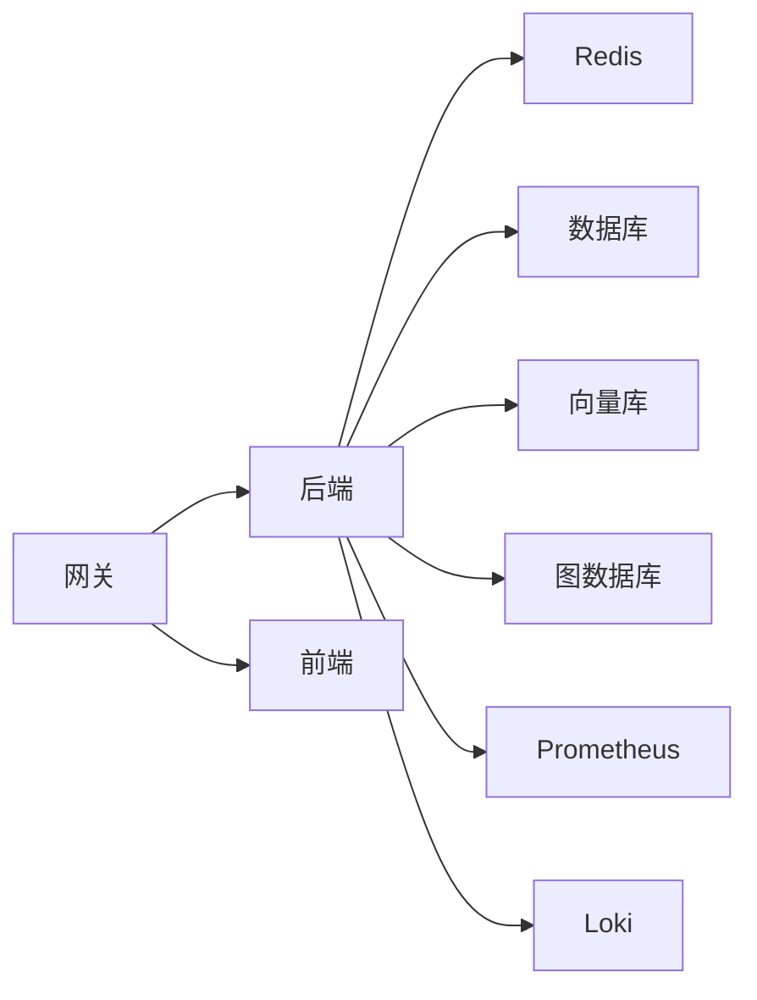

# 容器化部署

<cite>
**本文引用的文件**   
- [docker-compose.yml](file://docker-compose.yml)
- [backend/Dockerfile](file://backend_design/Dockerfile)
- [frontend/Dockerfile](file://frontend_design/Dockerfile)
- [gateway/Dockerfile](file://backend_design/nexus_gate/Dockerfile)
- [config/prometheus/prometheus.yml](file://config/prometheus/prometheus.yml)
- [config/grafana/provisioning/datasources/prometheus.yml](file://config/grafana/provisioning/datasources/prometheus.yml)
- [config/grafana/provisioning/dashboards/dashboards.yml](file://config/grafana/provisioning/dashboards/dashboards.yml)
- [config/grafana/provisioning/dashboards/nexuscockpit-overview.json](file://config/grafana/provisioning/dashboards/nexuscockpit-overview.json)
- [config/loki/loki-config.yml](file://config/loki/loki-config.yml/)
- [backend_design/pyproject.toml](file://backend_design/pyproject.toml)
- [backend_design/requirements.txt](file://backend_design/requirements.txt)
- [backend_design/backend_design/main.py](file://backend_design/nexus/main.py)
- [backend_design/backend_design/config.py](file://backend_design/nexus/config.py)
- [backend_design/backend_design/core/logger.py](file://backend_design/nexus/core/logger.py)
- [backend_design/backend_design/observability/metrics.py](file://backend_design/nexus/observability/metrics.py)
- [backend_design/backend_design/observability/cockpit_metrics.py](file://backend_design/nexus/observability/cockpit_metrics.py)
- [backend_design/backend_design/api/websocket.py](file://backend_design/nexus/api/websocket.py)
- [backend_design/backend_design/middleware/session_store.py](file://backend_design/nexus/middleware/session_store.py)
- [backend_design/backend_design/middleware/redis_cache.py](file://backend_design/nexus/middleware/redis_cache.py)
- [backend_design/backend_design/core/db_manager.py](file://backend_design/nexus/core/db_manager.py)
- [backend_design/backend_design/rag/zilliz_vector_store.py](file://backend_design/nexus/rag/zilliz_vector_store.py)
- [backend_design/backend_design/rag/aura_graph_store.py](file://backend_design/nexus/rag/aura_graph_store.py)
- [backend_design/backend_design/asr/engine.py](file://backend_design/nexus/asr/engine.py)
- [backend_design/backend_design/tts/engine.py](file://backend_design/nexus/tts/engine.py)
- [backend_design/backend_design/skills/orchestrator.py](file://backend_design/nexus/skills/orchestrator.py)
- [backend_design/backend_design/intent/router.py](file://backend_design/nexus/intent/router.py)
- [backend_design/backend_design/vehicle/factory.py](file://backend_design/nexus/vehicle/factory.py)
- [backend_design/backend_design/vehicle/http.py](file://backend_design/nexus/vehicle/http.py)
- [backend_design/backend_design/vehicle/mcp.py](file://backend_design/nexus/vehicle/mcp.py)
- [backend_design/backend_design/vehicle/mock.py](file://backend_design/nexus/vehicle/mock.py)
- [backend_design/backend_design/mcp/gateway.py](file://backend_design/nexus/mcp/gateway.py)
- [backend_design/backend_design/memory/manager.py](file://backend_design/nexus/memory/manager.py)
- [backend_design/backend_design/models/state.py](file://backend_design/nexus/models/state.py)
- [backend_design/backend_design/models/cockpit.py](file://backend_design/nexus/models/cockpit.py)
- [backend_design/backend_design/models/schemas.py](file://backend_design/nexus/models/schemas.py)
- [backend_design/backend_design/core/auth.py](file://backend_design/nexus/core/auth.py)
- [backend_design/backend_design/core/circuit_breaker.py](file://backend_design/nexus/core/circuit breaker.py)
- [backend_design/backend_design/core/personalization.py](file://backend_design/nexus/core/personalization.py)
- [backend_design/backend_design/core/ssl_fix.py](file://backend_design/nexus/core/ssl_fix.py)
- [backend_design/backend_design/core/tenant_context.py](file://backend_design/nexus/core/tenant_context.py)
- [backend_design/backend_design/core/voiceprint.py](file://backend_design/nexus/core/voiceprint.py)
- [backend_design/backend_design/agent/responder.py](file://backend_design/nexus/agent/responder.py)
- [backend_design/backend_design/agent/reviewer.py](file://backend_design/nexus/agent/reviewer.py)
- [backend_design/backend_design/agent/supervisor_graph.py](file://backend_design/nexus/agent/supervisor_graph.py)
- [backend_design/backend_design/agent/experts/chat_expert.py](file://backend_design/nexus/agent/experts/chat_expert.py)
- [backend_design/backend_design/agent/experts/health_expert.py](file://backend_design/nexus/agent/experts/health_expert.py)
- [backend_design/nexus/agent/experts/lifestyle_expert.py](file://backend_design/nexus/agent/experts/lifestyle_expert.py)
- [backend_design/nexus/agent/experts/nav_expert.py](file://backend_design/nexus/agent/experts/nav_expert.py)
- [backend_design/nexus/agent/experts/vehicle_expert.py](file://backend_design/nexus/agent/experts/vehicle_expert.py)
- [backend_design/backend_design/api/routes/admin.py](file://backend_design/nexus/api/routes/admin.py)
- [backend_design/backend_design/api/routes/asr.py](file://backend_design/nexus/api/routes/asr.py)
- [backend_design/backend_design/api/routes/auth.py](file://backend_design/nexus/api/routes/auth.py)
- [backend_design/backend_design/api/routes/chat.py](file://backend_design/nexus/api/routes/chat.py)
- [backend_design/backend_design/api/routes/chat_sessions.py](file://backend_design/nexus/api/routes/chat_sessions.py)
- [backend_design/backend_design/api/routes/cockpit.py](file://backend_design/nexus/api/routes/cockpit.py)
- [backend_design/backend_design/api/routes/dataplatform.py](file://backend_design/nexus/api/routes/dataplatform.py)
- [backend_design/backend_design/api/routes/health.py](file://backend_design/nexus/api/routes/health.py)
- [backend_design/backend_design/api/routes/middleware_status.py](file://backend_design/nexus/api/routes/middleware_status.py)
- [backend_design/backend_design/api/routes/settings.py](file://backend_design/nexus/api/routes/settings.py)
- [backend_design/backend_design/api/routes/vehicle.py](file://backend_design/nexus/api/routes/vehicle.py)
- [backend_design/backend_design/api/__init__.py](file://backend_design/nexus/api/__init__.py)
- [backend_design/backend_design/api/websocket.py](file://backend_design/nexus/api/websocket.py)
- [backend_design/backend_design/asr/__init__.py](file://backend_design/nexus/asr/__init__.py)
- [backend_design/backend_design/asr/engine.py](file://backend_design/nexus/asr/engine.py)
- [backend_design/backend_design/core/__init__.py](file://backend_design/nexus/core/__init__.py)
- [backend_design/backend_design/core/auth.py](file://backend_design/nexus/core/auth.py)
- [backend_design/backend_design/core/circuit_breaker.py](file://backend_design/nexus/core/circuit_breaker.py)
- [backend_design/backend_design/core/cockpit_manager.py](file://backend_design/nexus/core/cockpit_manager.py)
- [backend_design/backend_design/core/db_manager.py](file://backend_design/nexus/core/db_manager.py)
- [backend_design/backend_design/core/exceptions.py](file://backend_design/nexus/core/exceptions.py)
- [backend_design/backend_design/core/logger.py](file://backend_design/nexus/core/logger.py)
- [backend_design/backend_design/core/personalization.py](file://backend_design/nexus/core/personalization.py)
- [backend_design/backend_design/core/ssl_fix.py](file://backend_design/nexus/core/ssl_fix.py)
- [backend_design/backend_design/core/tenant_context.py](file://backend_design/nexus/core/tenant_context.py)
- [backend_design/backend_design/core/voiceprint.py](file://backend_design/nexus/core/voiceprint.py)
- [backend_design/backend_design/intent/__init__.py](file://backend_design/nexus/intent/__init__.py)
- [backend_design/backend_design/intent/heuristic.py](file://backend_design/nexus/intent/heuristic.py)
- [backend_design/backend_design/intent/llm_router.py](file://backend_design/nexus/intent/llm_router.py)
- [backend_design/backend_design/intent/router.py](file://backend_design/nexus/intent/router.py)
- [backend_design/backend_design/mcp/__init__.py](file://backend_design/nexus/mcp/__init__.py)
- [backend_design/backend_design/mcp/gateway.py](file://backend_design/nexus/mcp/gateway.py)
- [backend_design/backend_design/memory/__init__.py](file://backend_design/nexus/memory/__init__.py)
- [backend_design/backend_design/memory/conflict.py](file://backend_design/nexus/memory/conflict.py)
- [backend_design/backend_design/memory/manager.py](file://backend_design/nexus/memory/manager.py)
- [backend_design/backend_design/middleware/__init__.py](file://backend_design/nexus/middleware/__init__.py)
- [backend_design/backend_design/middleware/rate_limiter.py](file://backend_design/nexus/middleware/rate_limiter.py)
- [backend_design/backend_design/middleware/redis_cache.py](file://backend_design/nexus/middleware/redis_cache.py)
- [backend_design/backend_design/middleware/session_store.py](file://backend_design/nexus/middleware/session_store.py)
- [backend_design/backend_design/middleware/task_queue.py](file://backend_design/nexus/middleware/task_queue.py)
- [backend_design/backend_design/models/__init__.py](file://backend_design/nexus/models/__init__.py)
- [backend_design/backend_design/models/cockpit.py](file://backend_design/nexus/models/cockpit.py)
- [backend_design/backend_design/models/schemas.py](file://backend_design/nexus/models/schemas.py)
- [backend_design/backend_design/models/state.py](file://backend_design/nexus/models/state.py)
- [backend_design/backend_design/observability/__init__.py](file://backend_design/nexus/observability/__init__.py)
- [backend_design/backend_design/observability/cockpit_metrics.py](file://backend_design/nexus/observability/cockpit_metrics.py)
- [backend_design/backend_design/observability/data_retention.py](file://backend_design/nexus/observability/data_retention.py)
- [backend_design/backend_design/observability/langfuse.py](file://backend_design/nexus/observability/langfuse.py)
- [backend_design/backend_design/observability/metrics.py](file://backend_design/nexus/observability/metrics.py)
- [backend_design/backend_design/prompts/__init__.py](file://backend_design/nexus/prompts/__init__.py)
- [backend_design/backend_design/prompts/chat.md](file://backend_design/nexus/prompts/chat.md)
- [backend_design/backend_design/prompts/clarification.md](file://backend_design/nexus/prompts/clarification.md)
- [backend_design/backend_design/prompts/memory_extract.md](file://backend_design/nexus/prompts/memory_extract.md)
- [backend_design/backend_design/prompts/vehicle.md](file://backend_design/nexus/prompts/vehicle.md)
- [backend_design/backend_design/rag/__init__.py](file://backend_design/nexus/rag/__init__.py)
- [backend_design/backend_design/rag/aura_graph_store.py](file://backend_design/nexus/rag/aura_graph_store.py)
- [backend_design/backend_design/rag/cherry_kb.py](file://backend_design/nexus/rag/cherry_kb.py)
- [backend_design/backend_design/rag/embedding.py](file://backend_design/nexus/rag/embedding.py)
- [backend_design/backend_design/rag/graph_base.py](file://backend_design/nexus/rag/graph_base.py)
- [backend_design/backend_design/rag/graph_factory.py](file://backend_design/nexus/rag/graph_factory.py)
- [backend_design/backend_design/rag/graph_store.py](file://backend_design/nexus/rag/graph_store.py)
- [backend_design/backend_design/rag/reranker.py](file://backend_design/nexus/rag/reranker.py)
- [backend_design/backend_design/rag/reranker_base.py](file://backend_design/nexus/rag/reranker_base.py)
- [backend_design/backend_design/rag/reranker_factory.py](file://backend_design/nexus/rag/reranker_factory.py)
- [backend_design/backend_design/rag/retriever.py](file://backend_design/nexus/rag/retriever.py)
- [backend_design/backend_design/rag/siliconflow_reranker.py](file://backend_design/nexus/rag/siliconflow_reranker.py)
- [backend_design/backend_design/rag/unified_retriever.py](file://backend_design/nexus/rag/unified_retriever.py)
- [backend_design/backend_design/rag/vector_base.py](file://backend_design/nexus/rag/vector_base.py)
- [backend_design/backend_design/rag/vector_factory.py](file://backend_design/nexus/rag/vector_factory.py)
- [backend_design/backend_design/rag/vector_store.py](file://backend_design/nexus/rag/vector_store.py)
- [backend_design/backend_design/rag/zilliz_vector_store.py](file://backend_design/nexus/rag/zilliz_vector_store.py)
- [backend_design/backend_design/skills/__init__.py](file://backend_design/nexus/skills/__init__.py)
- [backend_design/backend_design/skills/base.py](file://backend_design/nexus/skills/base.py)
- [backend_design/backend_design/skills/habit.py](file://backend_design/nexus/skills/habit.py)
- [backend_design/backend_design/skills/health.py](file://backend_design/nexus/skills/health.py)
- [backend_design/backend_design/skills/orchestrator.py](file://backend_design/nexus/skills/orchestrator.py)
- [backend_design/backend_design/skills/registry.py](file://backend_design/nexus/skills/registry.py)
- [backend_design/backend_design/skills/reminder.py](file://backend_design/nexus/skills/reminder.py)
- [backend_design/backend_design/skills/special.py](file://backend_design/nexus/skills/special.py)
- [backend_design/backend_design/skills/vehicle/__init__.py](file://backend_design/nexus/skills/vehicle/__init__.py)
- [backend_design/backend_design/skills/vehicle/climate.py](file://backend_design/nexus/skills/vehicle/climate.py)
- [backend_design/backend_design/skills/vehicle/media.py](file://backend_design/nexus/skills/vehicle/media.py)
- [backend_design/backend_design/skills/vehicle/navigation.py](file://backend_design/nexus/skills/vehicle/navigation.py)
- [backend_design/backend_design/skills/vehicle/seat.py](file://backend_design/nexus/skills/vehicle/seat.py)
- [backend_design/backend_design/skills/vehicle/status.py](file://backend_design/nexus/skills/vehicle/status.py)
- [backend_design/backend_design/skills/vehicle/window.py](file://backend_design/nexus/skills/vehicle/window.py)
- [backend_design/backend_design/tts/__init__.py](file://backend_design/nexus/tts/__init__.py)
- [backend_design/backend_design/tts/engine.py](file://backend_design/nexus/tts/engine.py)
- [backend_design/backend_design/vehicle/__init__.py](file://backend_design/nexus/vehicle/__init__.py)
- [backend_design/backend_design/vehicle/base.py](file://backend_design/nexus/vehicle/base.py)
- [backend_design/backend_design/vehicle/factory.py](file://backend_design/nexus/vehicle/factory.py)
- [backend_design/backend_design/vehicle/http.py](file://backend_design/nexus/vehicle/http.py)
- [backend_design/backend_design/vehicle/mcp.py](file://backend_design/nexus/vehicle/mcp.py)
- [backend_design/backend_design/vehicle/mock.py](file://backend_design/nexus/vehicle/mock.py)
- [backend_design/backend_design/__init__.py](file://backend_design/nexus/__init__.py)
- [backend_design/backend_design/config.py](file://backend_design/nexus/config.py)
- [backend_design/backend_design/main.py](file://backend_design/nexus/main.py)
- [backend_design/nexus_gate/cmd/main.go](file://backend_design/nexus_gate/cmd/main.go)
- [backend_design/nexus_gate/internal/auth/jwt.go](file://backend_design/nexus_gate/internal/auth/jwt.go)
- [backend_design/nexus_gate/internal/config/config.go](file://backend_design/nexus_gate/internal/config/config.go)
- [backend_design/nexus_gate/internal/handlers/handlers.go](file://backend_design/nexus_gate/internal/handlers/handlers.go)
- [backend_design/nexus_gate/internal/handlers/redis_client.go](file://backend_design/nexus_gate/internal/handlers/redis_client.go)
- [backend_design/nexus_gate/internal/proxy/proxy.go](file://backend_design/nexus_gate/internal/proxy/proxy.go)
- [backend_design/nexus_gate/internal/ratelimit/ratelimit.go](file://backend_design/nexus_gate/internal/ratelimit/ratelimit.go)
- [backend_design/nexus_gate/internal/router/router.go](file://backend_design/nexus_gate/internal/router/router.go)
- [backend_design/nexus_gate/internal/ws/hub.go](file://backend_design/nexus_gate/internal/ws/hub.go)
- [backend_design/nexus_gate/proto/nexus.proto](file://backend_design/nexus_gate/proto/nexus.proto)
- [backend_design/nexus_gate/go.mod](file://backend_design/nexus_gate/go.mod)
- [backend_design/nexus_gate/go.sum](file://backend_design/nexus_gate/go.sum)
- [Makefile](file://Makefile)
- [README.md](file://README.md)
</cite>

## 目录
1. [简介](#简介)
2. [项目结构](#项目结构)
3. [核心组件](#核心组件)
4. [架构总览](#架构总览)
5. [详细组件分析](#详细组件分析)
6. [依赖关系分析](#依赖关系分析)
7. [性能与资源限制](#性能与资源限制)
8. [健康检查、日志与可观测性](#健康检查日志与可观测性)
9. [开发与生产差异化配置](#开发与生产差异化配置)
10. [故障排查指南](#故障排查指南)
11. [结论](#结论)
12. [附录](#附录)

## 简介
本指南聚焦于 NexusCockpit 的容器化部署，覆盖镜像构建与优化（多阶段构建、分层策略、体积优化）、Docker Compose 服务编排（依赖、网络、数据卷、环境变量）、开发/生产环境差异、健康检查、日志收集与存储、资源限制与性能调优、以及编排最佳实践与排障方法。文档以仓库现有 Dockerfile 与 docker-compose.yml 为基础，结合后端 Python 应用与前端 Next.js 应用的运行特征给出落地建议。

## 项目结构
从容器化视角，本项目包含三个主要可容器化单元：
- 后端服务（Python/FastAPI）：提供业务 API、WebSocket、RAG、技能编排、车辆控制等能力
- 网关服务（Go）：鉴权、限流、反向代理、WebSocket Hub
- 前端静态站点（Next.js 构建产物）：由 Nginx 或内置服务器提供静态资源

图表来源
- [docker-compose.yml](file://docker-compose.yml)
- [backend/Dockerfile](file://backend_design/Dockerfile)
- [frontend/Dockerfile](file://frontend_design/Dockerfile)
- [gateway/Dockerfile](file://backend_design/nexus_gate/Dockerfile)

章节来源
- [docker-compose.yml](file://docker-compose.yml)
- [backend/Dockerfile](file://backend_design/Dockerfile)
- [frontend/Dockerfile](file://frontend_design/Dockerfile)
- [gateway/Dockerfile](file://backend_design/nexus_gate/Dockerfile)

## 核心组件
- 后端镜像构建
  - 基于 Python 运行时，安装依赖并拷贝源码，暴露 HTTP/WebSocket 端口
  - 通过环境变量加载配置，支持 Redis、数据库、向量库、图数据库等外部依赖
- 网关镜像构建
  - Go 单二进制镜像，提供鉴权、限流、路由转发与 WebSocket Hub
- 前端镜像构建
  - Node 环境下构建 Next.js 静态资源，最终使用轻量运行时（如 Nginx）提供服务

章节来源
- [backend/Dockerfile](file://backend_design/Dockerfile)
- [gateway/Dockerfile](file://backend_design/nexus_gate/Dockerfile)
- [frontend/Dockerfile](file://frontend_design/Dockerfile)

## 架构总览
下图展示容器间通信与数据流向，包括 API、WebSocket、缓存、持久化与可观测性链路。

图表来源
- [docker-compose.yml](file://docker-compose.yml)
- [backend/Dockerfile](file://backend_design/Dockerfile)
- [gateway/Dockerfile](file://backend_design/nexus_gate/Dockerfile)
- [frontend/Dockerfile](file://frontend_design/Dockerfile)

## 详细组件分析

### 后端镜像构建与优化
- 构建目标
  - 最小化基础镜像、减少层数、避免将敏感信息打入镜像
  - 利用依赖缓存加速构建，分离依赖安装与代码拷贝
- 分层策略
  - 将系统依赖、Python 包安装与源码拷贝分步进行，提升缓存命中率
  - 使用 .dockerignore 排除无关文件（测试、临时文件、模型权重等）
- 体积优化
  - 选择 slim/alpine 变体（需评估 glibc/编译依赖兼容性）
  - 清理 pip/apt 缓存、删除不必要的工具链
  - 仅拷贝必要运行时文件，模型与大型资产通过挂载或对象存储获取
- 安全加固
  - 非 root 用户运行
  - 固定基础镜像版本，定期扫描漏洞

章节来源
- [backend/Dockerfile](file://backend_design/Dockerfile)
- [backend_design/pyproject.toml](file://backend_design/pyproject.toml)
- [backend_design/requirements.txt](file://backend_design/requirements.txt)

### 网关镜像构建与优化
- 构建目标
  - Go 单二进制，极小镜像体积，快速启动
- 分层策略
  - 多阶段构建：在 builder 中编译，在运行时镜像中仅拷贝二进制
- 安全加固
  - 非 root 用户运行，只读根文件系统（可选）

章节来源
- [gateway/Dockerfile](file://backend_design/nexus_gate/Dockerfile)
- [backend_design/nexus_gate/cmd/main.go](file://backend_design/nexus_gate/cmd/main.go)
- [backend_design/nexus_gate/internal/config/config.go](file://backend_design/nexus_gate/internal/config/config.go)

### 前端镜像构建与优化
- 构建目标
  - 在 Node 环境中完成 Next.js 构建，产出静态资源
  - 使用 Nginx 或其他轻量运行时提供静态文件
- 分层策略
  - 将依赖安装与构建步骤拆分，最大化缓存命中
- 体积优化
  - 仅拷贝构建产物到运行时镜像
  - 移除构建期工具与中间文件

章节来源
- [frontend/Dockerfile](file://frontend_design/Dockerfile)

### 服务编排（Docker Compose）
- 服务定义
  - 后端、网关、前端、Redis、数据库、向量库、图数据库、Prometheus、Grafana、Loki 等
- 依赖管理
  - 使用 depends_on 与 healthcheck 确保启动顺序
- 网络配置
  - 自定义桥接网络隔离服务，仅暴露必要端口
- 数据卷挂载
  - 持久化数据库、向量库、图数据库、日志与监控数据
- 环境变量管理
  - 统一通过 .env 或 compose env_file 注入，区分开发/生产

章节来源
- [docker-compose.yml](file://docker-compose.yml)

### 健康检查
- 后端健康端点
  - 提供 /health 或类似接口用于存活与就绪探针
- 网关健康检查
  - 基于内部状态或依赖可达性返回健康
- 第三方依赖健康检查
  - Redis、数据库、向量库、图数据库均可通过 CLI 或 HTTP 探针验证

章节来源
- [backend_design/nexus/api/routes/health.py](file://backend_design/nexus/api/routes/health.py)
- [docker-compose.yml](file://docker-compose.yml)

### 日志与可观测性
- 指标采集
  - Prometheus 抓取后端暴露的指标端点
  - Grafana 可视化仪表盘
- 日志收集
  - Loki 聚合容器标准输出或结构化日志文件
- 链路追踪
  - 可选接入 Langfuse 等 AIOps 平台

章节来源
- [config/prometheus/prometheus.yml](file://config/prometheus/prometheus.yml)
- [config/grafana/provisioning/datasources/prometheus.yml](file://config/grafana/provisioning/datasources/prometheus.yml)
- [config/grafana/provisioning/dashboards/dashboards.yml](file://config/grafana/provisioning/dashboards/dashboards.yml)
- [config/grafana/provisioning/dashboards/nexuscockpit-overview.json](file://config/grafana/provisioning/dashboards/nexuscockpit-overview.json)
- [config/loki/loki-config.yml](file://config/loki/loki-config.yml/)
- [backend_design/nexus/observability/metrics.py](file://backend_design/nexus/observability/metrics.py)
- [backend_design/nexus/observability/cockpit_metrics.py](file://backend_design/nexus/observability/cockpit_metrics.py)
- [backend_design/nexus/observability/langfuse.py](file://backend_design/nexus/observability/langfuse.py)
- [backend_design/nexus/core/logger.py](file://backend_design/nexus/core/logger.py)

### WebSocket 与实时通信
- 网关侧 WebSocket Hub
  - 负责连接管理与消息分发
- 后端侧 WS 处理
  - 与业务逻辑集成，处理语音/聊天等实时场景

章节来源
- [backend_design/nexus_gate/internal/ws/hub.go](file://backend_design/nexus_gate/internal/ws/hub.go)
- [backend_design/nexus/api/websocket.py](file://backend_design/nexus/api/websocket.py)

### 会话与缓存
- 会话存储
  - 基于 Redis 的会话持久化与共享
- 缓存层
  - 热点数据缓存，降低下游压力

章节来源
- [backend_design/nexus/middleware/session_store.py](file://backend_design/nexus/middleware/session_store.py)
- [backend_design/nexus/middleware/redis_cache.py](file://backend_design/nexus/middleware/redis_cache.py)

### 数据访问与 RAG
- 数据库访问
  - 统一的连接管理与事务封装
- 向量检索
  - Zilliz 或本地向量库
- 图谱检索
  - Aura/Neo4j 图数据库

章节来源
- [backend_design/nexus/core/db_manager.py](file://backend_design/nexus/core/db_manager.py)
- [backend_design/nexus/rag/zilliz_vector_store.py](file://backend_design/nexus/rag/zilliz_vector_store.py)
- [backend_design/nexus/rag/aura_graph_store.py](file://backend_design/nexus/rag/aura_graph_store.py)

### ASR/TTS 与技能编排
- 语音识别与合成
  - 引擎抽象与实现
- 技能编排
  - 统一调度各技能模块

章节来源
- [backend_design/nexus/asr/engine.py](file://backend_design/nexus/asr/engine.py)
- [backend_design/nexus/tts/engine.py](file://backend_design/nexus/tts/engine.py)
- [backend_design/nexus/skills/orchestrator.py](file://backend_design/nexus/skills/orchestrator.py)

### 意图路由与车辆控制
- 意图路由
  - 启发式与 LLM 路由策略
- 车辆控制
  - HTTP/MCP/Mock 多种后端适配

章节来源
- [backend_design/nexus/intent/router.py](file://backend_design/nexus/intent/router.py)
- [backend_design/nexus/vehicle/factory.py](file://backend_design/nexus/vehicle/factory.py)
- [backend_design/nexus/vehicle/http.py](file://backend_design/nexus/vehicle/http.py)
- [backend_design/nexus/vehicle/mcp.py](file://backend_design/nexus/vehicle/mcp.py)
- [backend_design/nexus/vehicle/mock.py](file://backend_design/nexus/vehicle/mock.py)

### MCP 网关
- 对外暴露 MCP 协议网关，统一接入与管理

章节来源
- [backend_design/nexus/mcp/gateway.py](file://backend_design/nexus/mcp/gateway.py)

### 记忆与状态
- 记忆冲突解决与状态机管理

章节来源
- [backend_design/nexus/memory/manager.py](file://backend_design/nexus/memory/manager.py)
- [backend_design/nexus/models/state.py](file://backend_design/nexus/models/state.py)

### 认证与安全
- JWT 鉴权、SSL 修复、租户上下文、声纹识别

章节来源
- [backend_design/nexus/core/auth.py](file://backend_design/nexus/core/auth.py)
- [backend_design/nexus/core/ssl_fix.py](file://backend_design/nexus/core/ssl_fix.py)
- [backend_design/nexus/core/tenant_context.py](file://backend_design/nexus/core/tenant_context.py)
- [backend_design/nexus/core/voiceprint.py](file://backend_design/nexus/core/voiceprint.py)
- [backend_design/nexus_gate/internal/auth/jwt.go](file://backend_design/nexus_gate/internal/auth/jwt.go)

### API 路由与中间件
- 路由组织与中间件（限流、速率限制、任务队列等）

章节来源
- [backend_design/nexus/api/routes/*.py](file://backend_design/nexus/api/routes/health.py)
- [backend_design/nexus/middleware/rate_limiter.py](file://backend_design/nexus/middleware/rate_limiter.py)
- [backend_design/nexus/middleware/task_queue.py](file://backend_design/nexus/middleware/task_queue.py)

## 依赖关系分析
- 服务耦合
  - 后端强依赖 Redis、数据库、向量库、图数据库；弱依赖外部 LLM/ASR/TTS 服务
  - 网关依赖 Redis（会话/限流）
  - 前端无运行时依赖，仅静态资源
- 外部依赖
  - Prometheus/Grafana/Loki 为可选的可观测性栈
- 潜在循环依赖
  - 通过 Compose 网络与服务名解耦，避免硬编码 IP

图表来源
- [docker-compose.yml](file://docker-compose.yml)

章节来源
- [docker-compose.yml](file://docker-compose.yml)

## 性能与资源限制
- 镜像体积优化
  - 多阶段构建、精简基础镜像、清理缓存、按需安装依赖
- 启动速度优化
  - 预热依赖、懒加载重型模块、预取模型至挂载卷
- 并发与线程池
  - 根据 CPU 核数调整 Uvicorn workers 与线程池大小
- 内存与 I/O
  - 合理设置 JVM/Python GC 参数（若适用），避免 OOM
- 网络与连接池
  - 数据库/向量库连接池上限与超时配置
- 资源限制（Compose）
  - 为每个服务设置 CPU/内存上限与预留，防止争抢

章节来源
- [docker-compose.yml](file://docker-compose.yml)

## 健康检查、日志与可观测性
- 健康检查
  - 后端 /health 端点、网关内部探针、依赖服务可达性检查
- 日志收集
  - 容器 stdout/stderr 经 Docker 驱动输出至 Loki
  - 应用层结构化日志（JSON）便于解析
- 指标采集
  - 后端暴露指标端点，Prometheus 定时抓取，Grafana 展示
- 告警与看板
  - 关键指标（错误率、延迟、QPS、资源使用）告警规则

章节来源
- [backend_design/nexus/api/routes/health.py](file://backend_design/nexus/api/routes/health.py)
- [config/prometheus/prometheus.yml](file://config/prometheus/prometheus.yml)
- [config/grafana/provisioning/datasources/prometheus.yml](file://config/grafana/provisioning/datasources/prometheus.yml)
- [config/grafana/provisioning/dashboards/dashboards.yml](file://config/grafana/provisioning/dashboards/dashboards.yml)
- [config/grafana/provisioning/dashboards/nexuscockpit-overview.json](file://config/grafana/provisioning/dashboards/nexuscockpit-overview.json)
- [config/loki/loki-config.yml](file://config/loki/loki-config.yml/)
- [backend_design/nexus/core/logger.py](file://backend_design/nexus/core/logger.py)
- [backend_design/nexus/observability/metrics.py](file://backend_design/nexus/observability/metrics.py)
- [backend_design/nexus/observability/cockpit_metrics.py](file://backend_design/nexus/observability/cockpit_metrics.py)

## 开发与生产差异化配置
- 环境变量
  - 使用 .env 或 compose env_file 注入不同环境的配置（数据库地址、密钥、调试开关）
- 镜像标签
  - 开发使用 latest 或 dev 标签，生产使用带 Git SHA 的稳定标签
- 功能开关
  - 通过配置中心或环境变量启用/禁用特性（如调试日志、Mock 模式）
- 数据持久化
  - 开发可使用匿名卷或本地路径，生产使用云盘或托管数据库
- 可观测性
  - 开发开启详细日志与慢查询，生产启用采样与告警

章节来源
- [docker-compose.yml](file://docker-compose.yml)
- [backend_design/nexus/config.py](file://backend_design/nexus/config.py)

## 故障排查指南
- 常见问题定位
  - 启动失败：检查端口占用、依赖不可达、镜像权限
  - 健康检查失败：查看 /health 响应与依赖状态
  - 性能问题：观察 Prometheus 指标与 Grafana 看板
  - 日志缺失：确认日志驱动与 Loki 配置
- 诊断命令
  - 查看容器日志、进入容器执行诊断、检查网络连通性
- 回滚策略
  - 保留历史镜像标签，快速回滚到上一稳定版本

章节来源
- [docker-compose.yml](file://docker-compose.yml)
- [backend_design/nexus/api/routes/health.py](file://backend_design/nexus/api/routes/health.py)
- [config/prometheus/prometheus.yml](file://config/prometheus/prometheus.yml)
- [config/grafana/provisioning/datasources/prometheus.yml](file://config/grafana/provisioning/datasources/prometheus.yml)
- [config/grafana/provisioning/dashboards/dashboards.yml](file://config/grafana/provisioning/dashboards/dashboards.yml)
- [config/grafana/provisioning/dashboards/nexuscockpit-overview.json](file://config/grafana/provisioning/dashboards/nexuscockpit-overview.json)
- [config/loki/loki-config.yml](file://config/loki/loki-config.yml/)

## 结论
通过多阶段构建与分层优化，结合 Compose 的服务编排与健康检查，NexusCockpit 可在开发与生产环境实现一致且高效的容器化部署。配合 Prometheus/Grafana/Loki 的可观测性体系，能够保障系统的稳定性与可维护性。建议在上线前完善资源限制、日志规范与告警规则，持续迭代镜像体积与启动性能。

## 附录
- 构建与运行脚本
  - Makefile 提供常用构建与运行命令
- 参考文档
  - README 与部署文档提供背景与使用说明

章节来源
- [Makefile](file://Makefile)
- [README.md](file://README.md)