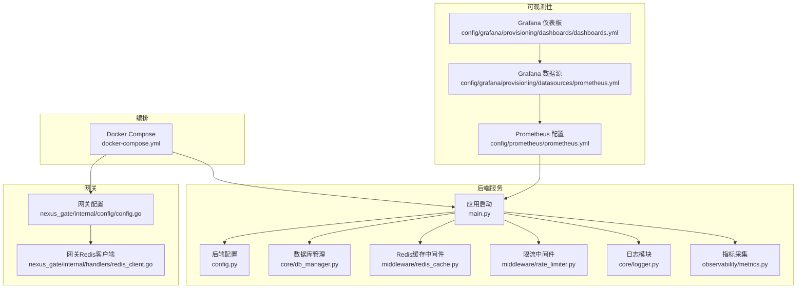
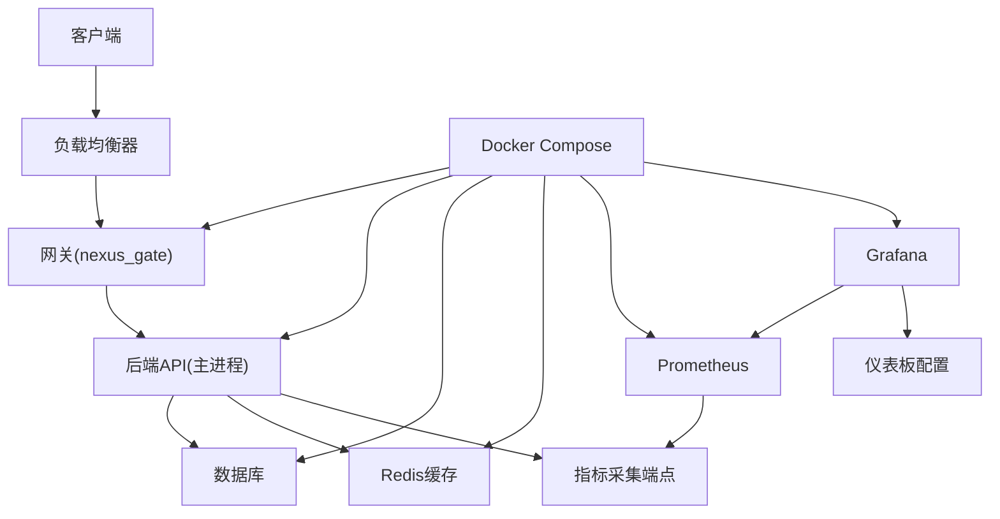
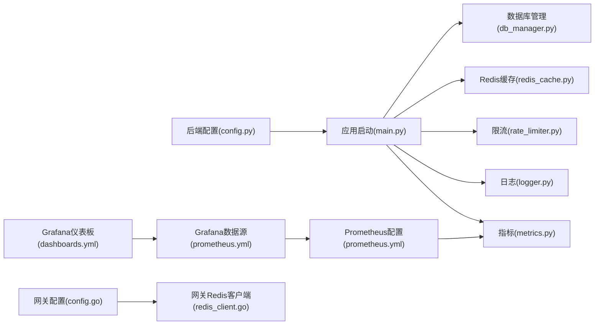

# 生产环境配置

<cite>
**本文引用的文件**   
- [backend_design/nexus/config.py](file://backend_design/nexus/config.py)
- [backend_design/nexus/main.py](file://backend_design/nexus/main.py)
- [backend_design/nexus/core/db_manager.py](file://backend_design/nexus/core/db_manager.py)
- [backend_design/nexus/middleware/redis_cache.py](file://backend_design/nexus/middleware/redis_cache.py)
- [backend_design/nexus/middleware/rate_limiter.py](file://backend_design/nexus/middleware/rate_limiter.py)
- [backend_design/nexus/core/logger.py](file://backend_design/nexus/core/logger.py)
- [backend_design/nexus/observability/metrics.py](file://backend_design/nexus/observability/metrics.py)
- [backend_design/nexus_gate/internal/config/config.go](file://backend_design/nexus_gate/internal/config/config.go)
- [backend_design/nexus_gate/internal/handlers/redis_client.go](file://backend_design/nexus_gate/internal/handlers/redis_client.go)
- [config/prometheus/prometheus.yml](file://config/prometheus/prometheus.yml)
- [config/grafana/provisioning/datasources/prometheus.yml](file://config/grafana/provisioning/datasources/prometheus.yml)
- [config/grafana/provisioning/dashboards/dashboards.yml](file://config/grafana/provisioning/dashboards/dashboards.yml)
- [docker-compose.yml](file://docker-compose.yml)
</cite>

## 目录
1. [简介](#简介)
2. [项目结构](#项目结构)
3. [核心组件](#核心组件)
4. [架构总览](#架构总览)
5. [详细组件分析](#详细组件分析)
6. [依赖分析](#依赖分析)
7. [性能考虑](#性能考虑)
8. [故障排查指南](#故障排查指南)
9. [结论](#结论)
10. [附录](#附录)

## 简介
本手册面向生产环境的部署与运维，聚焦以下主题：环境变量管理与配置文件组织、数据库连接池与缓存配置、中间件参数调优、负载均衡与高可用网络配置、SSL证书与安全通信、日志级别与输出格式、性能监控指标采集与告警阈值、容量规划与资源分配建议。文档内容基于仓库中实际存在的配置与实现进行说明，并提供可操作的调优建议与排障指引。

## 项目结构
本项目包含后端服务（Python）、网关（Go）、可观测性配置（Prometheus/Grafana）以及容器编排（docker-compose）。关键配置位置如下：
- 后端服务配置入口与运行时初始化
- 网关配置与Redis客户端
- 可观测性采集与仪表板配置
- 容器编排中的服务定义与环境变量注入

图表来源
- [backend_design/nexus/config.py](file://backend_design/nexus/config.py)
- [backend_design/nexus/main.py](file://backend_design/nexus/main.py)
- [backend_design/nexus/core/db_manager.py](file://backend_design/nexus/core/db_manager.py)
- [backend_design/nexus/middleware/redis_cache.py](file://backend_design/nexus/middleware/redis_cache.py)
- [backend_design/nexus/middleware/rate_limiter.py](file://backend_design/nexus/middleware/rate_limiter.py)
- [backend_design/nexus/core/logger.py](file://backend_design/nexus/core/logger.py)
- [backend_design/nexus/observability/metrics.py](file://backend_design/nexus/observability/metrics.py)
- [backend_design/nexus_gate/internal/config/config.go](file://backend_design/nexus_gate/internal/config/config.go)
- [backend_design/nexus_gate/internal/handlers/redis_client.go](file://backend_design/nexus_gate/internal/handlers/redis_client.go)
- [config/prometheus/prometheus.yml](file://config/prometheus/prometheus.yml)
- [config/grafana/provisioning/datasources/prometheus.yml](file://config/grafana/provisioning/datasources/prometheus.yml)
- [config/grafana/provisioning/dashboards/dashboards.yml](file://config/grafana/provisioning/dashboards/dashboards.yml)
- [docker-compose.yml](file://docker-compose.yml)

章节来源
- [backend_design/nexus/config.py](file://backend_design/nexus/config.py)
- [backend_design/nexus/main.py](file://backend_design/nexus/main.py)
- [backend_design/nexus/core/db_manager.py](file://backend_design/nexus/core/db_manager.py)
- [backend_design/nexus/middleware/redis_cache.py](file://backend_design/nexus/middleware/redis_cache.py)
- [backend_design/nexus/middleware/rate_limiter.py](file://backend_design/nexus/middleware/rate_limiter.py)
- [backend_design/nexus/core/logger.py](file://backend_design/nexus/core/logger.py)
- [backend_design/nexus/observability/metrics.py](file://backend_design/nexus/observability/metrics.py)
- [backend_design/nexus_gate/internal/config/config.go](file://backend_design/nexus_gate/internal/config/config.go)
- [backend_design/nexus_gate/internal/handlers/redis_client.go](file://backend_design/nexus_gate/internal/handlers/redis_client.go)
- [config/prometheus/prometheus.yml](file://config/prometheus/prometheus.yml)
- [config/grafana/provisioning/datasources/prometheus.yml](file://config/grafana/provisioning/datasources/prometheus.yml)
- [config/grafana/provisioning/dashboards/dashboards.yml](file://config/grafana/provisioning/dashboards/dashboards.yml)
- [docker-compose.yml](file://docker-compose.yml)

## 核心组件
本节概述生产环境的关键配置点与可调优项，涵盖环境变量、数据库连接池、缓存、中间件、日志、指标与编排。

- 环境变量与配置加载
  - 后端通过配置模块集中读取环境变量并构建运行期配置对象，供各子系统使用。
  - 建议在容器环境中以环境变量注入敏感信息（如数据库凭据、Redis地址、密钥等），避免硬编码。
  - 参考路径：[后端配置入口](file://backend_design/nexus/config.py)、[应用启动](file://backend_design/nexus/main.py)。

- 数据库连接池
  - 连接池大小、超时、重试策略由数据库管理模块控制，需根据并发量与数据库能力调整。
  - 建议结合慢查询与锁等待指标动态扩容或缩容。
  - 参考路径：[数据库管理](file://backend_design/nexus/core/db_manager.py)。

- 缓存（Redis）
  - 缓存中间件负责连接、序列化、过期策略与错误降级；网关侧也使用Redis作为共享状态存储。
  - 建议设置合理的最大连接数、读写超时与失败回退策略。
  - 参考路径：[Redis缓存中间件](file://backend_design/nexus/middleware/redis_cache.py)、[网关Redis客户端](file://backend_design/nexus_gate/internal/handlers/redis_client.go)。

- 中间件参数调优
  - 限流中间件用于保护后端免受突发流量冲击，需按业务QPS与上游网关策略协同设定。
  - 参考路径：[限流中间件](file://backend_design/nexus/middleware/rate_limiter.py)。

- 日志级别与输出格式
  - 日志模块支持分级输出与结构化格式，便于接入日志聚合系统。
  - 建议生产环境采用INFO及以上级别，并启用JSON格式以便解析。
  - 参考路径：[日志模块](file://backend_design/nexus/core/logger.py)。

- 性能监控指标采集
  - 指标采集模块暴露标准端点，供Prometheus抓取；Grafana提供数据源与仪表板配置。
  - 建议为关键路径添加自定义指标（请求耗时、错误率、队列长度等）。
  - 参考路径：[指标采集](file://backend_design/nexus/observability/metrics.py)、[Prometheus配置](file://config/prometheus/prometheus.yml)、[Grafana数据源](file://config/grafana/provisioning/datasources/prometheus.yml)、[Grafana仪表板](file://config/grafana/provisioning/dashboards/dashboards.yml)。

- 编排与环境变量注入
  - docker-compose用于统一管理服务、网络与卷挂载，并通过环境变量注入配置。
  - 参考路径：[编排文件](file://docker-compose.yml)。

章节来源
- [backend_design/nexus/config.py](file://backend_design/nexus/config.py)
- [backend_design/nexus/main.py](file://backend_design/nexus/main.py)
- [backend_design/nexus/core/db_manager.py](file://backend_design/nexus/core/db_manager.py)
- [backend_design/nexus/middleware/redis_cache.py](file://backend_design/nexus/middleware/redis_cache.py)
- [backend_design/nexus/middleware/rate_limiter.py](file://backend_design/nexus/middleware/rate_limiter.py)
- [backend_design/nexus/core/logger.py](file://backend_design/nexus/core/logger.py)
- [backend_design/nexus/observability/metrics.py](file://backend_design/nexus/observability/metrics.py)
- [config/prometheus/prometheus.yml](file://config/prometheus/prometheus.yml)
- [config/grafana/provisioning/datasources/prometheus.yml](file://config/grafana/provisioning/datasources/prometheus.yml)
- [config/grafana/provisioning/dashboards/dashboards.yml](file://config/grafana/provisioning/dashboards/dashboards.yml)
- [docker-compose.yml](file://docker-compose.yml)

## 架构总览
下图展示生产环境的服务交互与配置关系，包括后端服务、网关、缓存、数据库、可观测性与编排层。

图表来源
- [backend_design/nexus/main.py](file://backend_design/nexus/main.py)
- [backend_design/nexus_gate/internal/config/config.go](file://backend_design/nexus_gate/internal/config/config.go)
- [backend_design/nexus/observability/metrics.py](file://backend_design/nexus/observability/metrics.py)
- [config/prometheus/prometheus.yml](file://config/prometheus/prometheus.yml)
- [config/grafana/provisioning/datasources/prometheus.yml](file://config/grafana/provisioning/datasources/prometheus.yml)
- [config/grafana/provisioning/dashboards/dashboards.yml](file://config/grafana/provisioning/dashboards/dashboards.yml)
- [docker-compose.yml](file://docker-compose.yml)

## 详细组件分析

### 环境变量与配置组织
- 设计要点
  - 将敏感信息与运行环境差异化的参数通过环境变量注入，避免写入代码或镜像。
  - 配置模块在启动时加载并校验必要字段，缺失则给出明确错误提示。
  - 建议为不同环境（开发、测试、生产）准备独立的环境模板与最小权限原则。
- 关键路径
  - [后端配置入口](file://backend_design/nexus/config.py)
  - [应用启动](file://backend_design/nexus/main.py)
  - [编排文件](file://docker-compose.yml)

章节来源
- [backend_design/nexus/config.py](file://backend_design/nexus/config.py)
- [backend_design/nexus/main.py](file://backend_design/nexus/main.py)
- [docker-compose.yml](file://docker-compose.yml)

### 数据库连接池配置与调优
- 设计要点
  - 连接池大小应与数据库最大连接数、CPU核数与I/O吞吐匹配。
  - 合理设置连接获取超时、空闲回收与重试策略，避免雪崩。
  - 针对慢查询与锁竞争场景，增加监控与自动扩缩容策略。
- 关键路径
  - [数据库管理](file://backend_design/nexus/core/db_manager.py)

章节来源
- [backend_design/nexus/core/db_manager.py](file://backend_design/nexus/core/db_manager.py)

### 缓存（Redis）配置与降级策略
- 设计要点
  - 连接池与读写超时需与Redis集群规模和网络延迟匹配。
  - 设置缓存失效与热点键保护策略，防止穿透与击穿。
  - 当Redis不可用时，应快速失败并回退到直连数据库或本地缓存。
- 关键路径
  - [Redis缓存中间件](file://backend_design/nexus/middleware/redis_cache.py)
  - [网关Redis客户端](file://backend_design/nexus_gate/internal/handlers/redis_client.go)

章节来源
- [backend_design/nexus/middleware/redis_cache.py](file://backend_design/nexus/middleware/redis_cache.py)
- [backend_design/nexus_gate/internal/handlers/redis_client.go](file://backend_design/nexus_gate/internal/handlers/redis_client.go)

### 中间件参数调优（限流）
- 设计要点
  - 限流算法与窗口大小需与业务峰值和网关限流策略协同。
  - 针对不同路由设置差异化配额，保护核心接口。
  - 记录限流事件并上报指标，便于观察与告警。
- 关键路径
  - [限流中间件](file://backend_design/nexus/middleware/rate_limiter.py)

章节来源
- [backend_design/nexus/middleware/rate_limiter.py](file://backend_design/nexus/middleware/rate_limiter.py)

### 日志级别与输出格式
- 设计要点
  - 生产环境建议开启INFO及以上级别，使用结构化JSON输出。
  - 为关键操作与异常路径添加上下文信息（请求ID、租户ID等）。
  - 对接日志聚合系统（如Loki/ELK），实现检索与告警。
- 关键路径
  - [日志模块](file://backend_design/nexus/core/logger.py)

章节来源
- [backend_design/nexus/core/logger.py](file://backend_design/nexus/core/logger.py)

### 性能监控指标采集与告警阈值
- 设计要点
  - 暴露标准指标端点，供Prometheus定期抓取。
  - 为关键路径添加自定义指标（请求耗时、错误率、队列长度、缓存命中率等）。
  - 在Grafana中配置数据源与仪表板，设置告警规则（如错误率>1%、P99>500ms）。
- 关键路径
  - [指标采集](file://backend_design/nexus/observability/metrics.py)
  - [Prometheus配置](file://config/prometheus/prometheus.yml)
  - [Grafana数据源](file://config/grafana/provisioning/datasources/prometheus.yml)
  - [Grafana仪表板](file://config/grafana/provisioning/dashboards/dashboards.yml)

章节来源
- [backend_design/nexus/observability/metrics.py](file://backend_design/nexus/observability/metrics.py)
- [config/prometheus/prometheus.yml](file://config/prometheus/prometheus.yml)
- [config/grafana/provisioning/datasources/prometheus.yml](file://config/grafana/provisioning/datasources/prometheus.yml)
- [config/grafana/provisioning/dashboards/dashboards.yml](file://config/grafana/provisioning/dashboards/dashboards.yml)

### 负载均衡与高可用部署的网络配置
- 设计要点
  - 在网关前部署负载均衡器，启用健康检查与会话保持（如需）。
  - 多实例部署时，确保无状态设计与外部共享状态（Redis/DB）。
  - 网络分区与重试策略需配合熔断与退避机制。
- 关键路径
  - [编排文件](file://docker-compose.yml)
  - [网关配置](file://backend_design/nexus_gate/internal/config/config.go)

章节来源
- [docker-compose.yml](file://docker-compose.yml)
- [backend_design/nexus_gate/internal/config/config.go](file://backend_design/nexus_gate/internal/config/config.go)

### SSL证书配置与安全通信
- 设计要点
  - 在网关或反向代理处终止TLS，分发证书与私钥。
  - 内部服务间通信建议使用mTLS或受控内网访问。
  - 严格限制端口暴露范围，启用最小权限与访问白名单。
- 关键路径
  - [编排文件](file://docker-compose.yml)
  - [网关配置](file://backend_design/nexus_gate/internal/config/config.go)

章节来源
- [docker-compose.yml](file://docker-compose.yml)
- [backend_design/nexus_gate/internal/config/config.go](file://backend_design/nexus_gate/internal/config/config.go)

### 容量规划与资源分配建议
- 设计要点
  - 根据QPS、P99延迟与错误率目标，估算CPU/内存/IO需求。
  - 数据库与Redis按连接数与吞吐预留冗余，避免资源争用。
  - 使用水平扩展与弹性伸缩应对流量波动。
- 关键路径
  - [编排文件](file://docker-compose.yml)
  - [指标采集](file://backend_design/nexus/observability/metrics.py)

章节来源
- [docker-compose.yml](file://docker-compose.yml)
- [backend_design/nexus/observability/metrics.py](file://backend_design/nexus/observability/metrics.py)

## 依赖分析
下图展示后端服务与网关对配置与外部系统的依赖关系，帮助识别耦合点与潜在风险。

图表来源
- [backend_design/nexus/config.py](file://backend_design/nexus/config.py)
- [backend_design/nexus/main.py](file://backend_design/nexus/main.py)
- [backend_design/nexus/core/db_manager.py](file://backend_design/nexus/core/db_manager.py)
- [backend_design/nexus/middleware/redis_cache.py](file://backend_design/nexus/middleware/redis_cache.py)
- [backend_design/nexus/middleware/rate_limiter.py](file://backend_design/nexus/middleware/rate_limiter.py)
- [backend_design/nexus/core/logger.py](file://backend_design/nexus/core/logger.py)
- [backend_design/nexus/observability/metrics.py](file://backend_design/nexus/observability/metrics.py)
- [backend_design/nexus_gate/internal/config/config.go](file://backend_design/nexus_gate/internal/config/config.go)
- [backend_design/nexus_gate/internal/handlers/redis_client.go](file://backend_design/nexus_gate/internal/handlers/redis_client.go)
- [config/prometheus/prometheus.yml](file://config/prometheus/prometheus.yml)
- [config/grafana/provisioning/datasources/prometheus.yml](file://config/grafana/provisioning/datasources/prometheus.yml)
- [config/grafana/provisioning/dashboards/dashboards.yml](file://config/grafana/provisioning/dashboards/dashboards.yml)

章节来源
- [backend_design/nexus/config.py](file://backend_design/nexus/config.py)
- [backend_design/nexus/main.py](file://backend_design/nexus/main.py)
- [backend_design/nexus/core/db_manager.py](file://backend_design/nexus/core/db_manager.py)
- [backend_design/nexus/middleware/redis_cache.py](file://backend_design/nexus/middleware/redis_cache.py)
- [backend_design/nexus/middleware/rate_limiter.py](file://backend_design/nexus/middleware/rate_limiter.py)
- [backend_design/nexus/core/logger.py](file://backend_design/nexus/core/logger.py)
- [backend_design/nexus/observability/metrics.py](file://backend_design/nexus/observability/metrics.py)
- [backend_design/nexus_gate/internal/config/config.go](file://backend_design/nexus_gate/internal/config/config.go)
- [backend_design/nexus_gate/internal/handlers/redis_client.go](file://backend_design/nexus_gate/internal/handlers/redis_client.go)
- [config/prometheus/prometheus.yml](file://config/prometheus/prometheus.yml)
- [config/grafana/provisioning/datasources/prometheus.yml](file://config/grafana/provisioning/datasources/prometheus.yml)
- [config/grafana/provisioning/dashboards/dashboards.yml](file://config/grafana/provisioning/dashboards/dashboards.yml)

## 性能考虑
- 连接池与超时
  - 数据库连接池大小与超时需与数据库最大连接数和负载曲线匹配，避免频繁创建销毁连接。
  - Redis连接池与读写超时应根据网络延迟与集群规模调整。
- 限流与熔断
  - 限流策略需与网关协同，避免重复限流导致误判。
  - 引入熔断与退避，降低级联故障风险。
- 指标与告警
  - 为关键路径添加自定义指标，覆盖延迟、吞吐、错误率与资源利用率。
  - 设置多级告警阈值，区分警告与严重级别，减少误报。
- 水平扩展
  - 无状态服务可横向扩展，结合负载均衡与健康检查提升可用性。
  - 外部依赖（DB/Redis）应具备足够的容量与冗余。

## 故障排查指南
- 常见问题定位
  - 连接失败：检查数据库与Redis地址、端口、凭据与网络连通性。
  - 限流过严：观察限流计数与错误率，适当放宽配额或优化上游流量。
  - 日志缺失：确认日志级别与输出格式，验证日志聚合链路。
  - 指标未采集：核对Prometheus抓取配置与指标端点可达性。
- 关键路径
  - [日志模块](file://backend_design/nexus/core/logger.py)
  - [指标采集](file://backend_design/nexus/observability/metrics.py)
  - [Prometheus配置](file://config/prometheus/prometheus.yml)
  - [Grafana数据源](file://config/grafana/provisioning/datasources/prometheus.yml)

章节来源
- [backend_design/nexus/core/logger.py](file://backend_design/nexus/core/logger.py)
- [backend_design/nexus/observability/metrics.py](file://backend_design/nexus/observability/metrics.py)
- [config/prometheus/prometheus.yml](file://config/prometheus/prometheus.yml)
- [config/grafana/provisioning/datasources/prometheus.yml](file://config/grafana/provisioning/datasources/prometheus.yml)

## 结论
生产环境配置应以“安全、稳定、可观测”为核心原则。通过环境变量与配置中心化管理、合理的连接池与缓存策略、完善的限流与熔断机制、标准化的日志与指标体系，以及均衡的容量规划与弹性伸缩，可有效支撑高并发与高可用的业务场景。建议持续监控与演练，完善告警与应急预案，确保系统在复杂环境下稳健运行。

## 附录
- 术语解释
  - QPS：每秒查询数
  - P99：第99百分位延迟
  - mTLS：双向TLS认证
- 参考路径汇总
  - [后端配置入口](file://backend_design/nexus/config.py)
  - [应用启动](file://backend_design/nexus/main.py)
  - [数据库管理](file://backend_design/nexus/core/db_manager.py)
  - [Redis缓存中间件](file://backend_design/nexus/middleware/redis_cache.py)
  - [限流中间件](file://backend_design/nexus/middleware/rate_limiter.py)
  - [日志模块](file://backend_design/nexus/core/logger.py)
  - [指标采集](file://backend_design/nexus/observability/metrics.py)
  - [网关配置](file://backend_design/nexus_gate/internal/config/config.go)
  - [网关Redis客户端](file://backend_design/nexus_gate/internal/handlers/redis_client.go)
  - [Prometheus配置](file://config/prometheus/prometheus.yml)
  - [Grafana数据源](file://config/grafana/provisioning/datasources/prometheus.yml)
  - [Grafana仪表板](file://config/grafana/provisioning/dashboards/dashboards.yml)
  - [编排文件](file://docker-compose.yml)