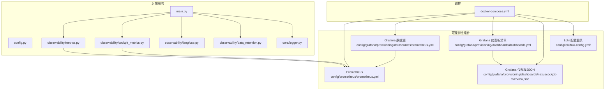
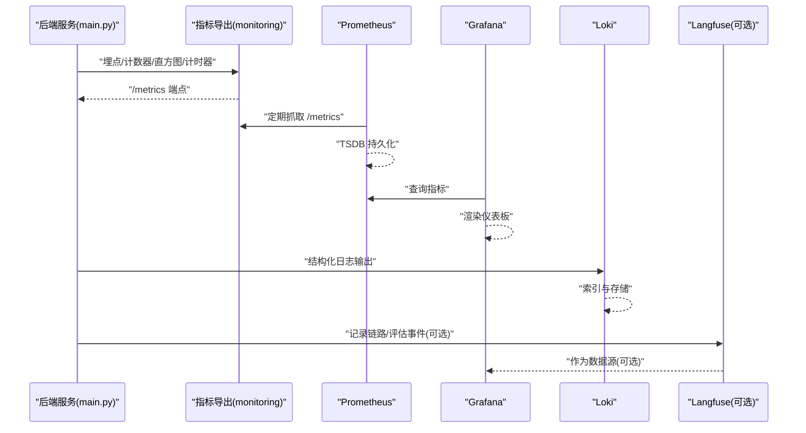
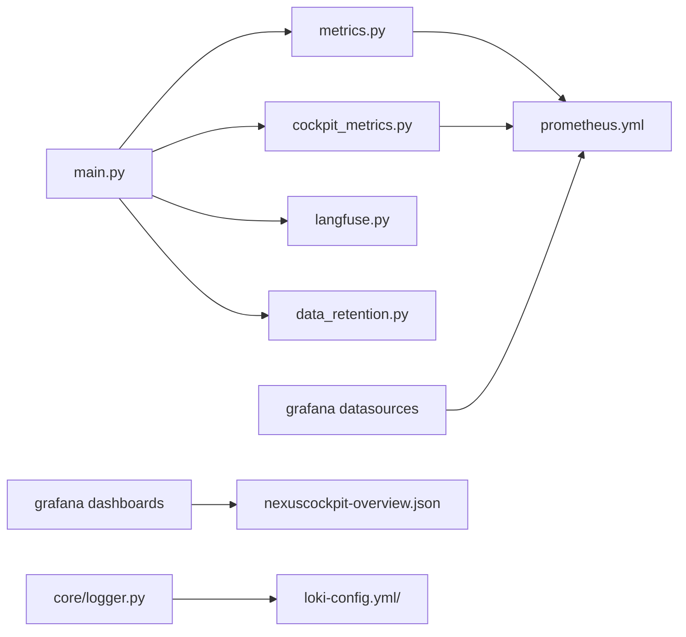

# 监控告警

<cite>
**本文引用的文件**   
- [docker-compose.yml](file://docker-compose.yml)
- [config/prometheus/prometheus.yml](file://config/prometheus/prometheus.yml)
- [config/grafana/provisioning/datasources/prometheus.yml](file://config/grafana/provisioning/datasources/prometheus.yml)
- [config/grafana/provisioning/dashboards/dashboards.yml](file://config/grafana/provisioning/dashboards/dashboards.yml)
- [config/grafana/provisioning/dashboards/nexuscockpit-overview.json](file://config/grafana/provisioning/dashboards/nexuscockpit-overview.json)
- [backend_design/nexus/observability/metrics.py](file://backend_design/nexus/observability/metrics.py)
- [backend_design/nexus/observability/cockpit_metrics.py](file://backend_design/nexus/observability/cockpit_metrics.py)
- [backend_design/nexus/observability/langfuse.py](file://backend_design/nexus/observability/langfuse.py)
- [backend_design/nexus/observability/data_retention.py](file://backend_design/nexus/observability/data_retention.py)
- [backend_design/nexus/config.py](file://backend_design/nexus/config.py)
- [backend_design/nexus/main.py](file://backend_design/nexus/main.py)
- [backend_design/nexus/core/logger.py](file://backend_design/nexus/core/logger.py)
- [config/loki/loki-config.yml/](file://config/loki/loki-config.yml/)
</cite>

## 目录
1. [简介](#简介)
2. [项目结构](#项目结构)
3. [核心组件](#核心组件)
4. [架构总览](#架构总览)
5. [详细组件分析](#详细组件分析)
6. [依赖关系分析](#依赖关系分析)
7. [性能与容量规划](#性能与容量规划)
8. [故障排查指南](#故障排查指南)
9. [结论](#结论)
10. [附录](#附录)

## 简介
本指南面向运维与研发人员，提供基于 Prometheus、Grafana、Loki 以及可选 Langfuse 的监控、日志与链路追踪一体化配置与管理方案。内容覆盖：
- Prometheus 指标采集与持久化配置
- Grafana 数据源与仪表板配置
- Loki 日志聚合与查询语法要点
- 关键业务指标的监控面板定制方法
- 告警规则定义与通知渠道配置
- 分布式/链路追踪集成（Langfuse）
- 监控数据分析与故障定位技巧

## 项目结构
本项目在配置层提供了 Prometheus、Grafana、Loki 的基础配置文件；在后端 Python 服务中实现了应用级指标导出与可观测性能力；并通过 docker-compose 编排各组件。

图表来源
- [docker-compose.yml](file://docker-compose.yml)
- [config/prometheus/prometheus.yml](file://config/prometheus/prometheus.yml)
- [config/grafana/provisioning/datasources/prometheus.yml](file://config/grafana/provisioning/datasources/prometheus.yml)
- [config/grafana/provisioning/dashboards/dashboards.yml](file://config/grafana/provisioning/dashboards/dashboards.yml)
- [config/grafana/provisioning/dashboards/nexuscockpit-overview.json](file://config/grafana/provisioning/dashboards/nexuscockpit-overview.json)
- [backend_design/nexus/main.py](file://backend_design/nexus/main.py)
- [backend_design/nexus/observability/metrics.py](file://backend_design/nexus/observability/metrics.py)
- [backend_design/nexus/observability/cockpit_metrics.py](file://backend_design/nexus/observability/cockpit_metrics.py)
- [backend_design/nexus/observability/langfuse.py](file://backend_design/nexus/observability/langfuse.py)
- [backend_design/nexus/observability/data_retention.py](file://backend_design/nexus/observability/data_retention.py)
- [backend_design/nexus/core/logger.py](file://backend_design/nexus/core/logger.py)

章节来源
- [docker-compose.yml](file://docker-compose.yml)
- [config/prometheus/prometheus.yml](file://config/prometheus/prometheus.yml)
- [config/grafana/provisioning/datasources/prometheus.yml](file://config/grafana/provisioning/datasources/prometheus.yml)
- [config/grafana/provisioning/dashboards/dashboards.yml](file://config/grafana/provisioning/dashboards/dashboards.yml)
- [config/grafana/provisioning/dashboards/nexuscockpit-overview.json](file://config/grafana/provisioning/dashboards/nexuscockpit-overview.json)
- [backend_design/nexus/main.py](file://backend_design/nexus/main.py)
- [backend_design/nexus/observability/metrics.py](file://backend_design/nexus/observability/metrics.py)
- [backend_design/nexus/observability/cockpit_metrics.py](file://backend_design/nexus/observability/cockpit_metrics.py)
- [backend_design/nexus/observability/langfuse.py](file://backend_design/nexus/observability/langfuse.py)
- [backend_design/nexus/observability/data_retention.py](file://backend_design/nexus/observability/data_retention.py)
- [backend_design/nexus/core/logger.py](file://backend_design/nexus/core/logger.py)

## 核心组件
- 指标采集与导出
  - 应用内通过 Python SDK 暴露 /metrics 端点，供 Prometheus 抓取。
  - 内置通用指标与“座舱”业务指标两类，便于统一治理与分层展示。
- 可视化与仪表板
  - Grafana 通过 Provisioning 自动注册 Prometheus 数据源与仪表板清单。
  - 提供“NexusCockpit 概览”仪表板 JSON，可直接导入或自动挂载。
- 日志聚合
  - 提供 Loki 配置目录，用于集中收集与检索应用日志。
- 链路追踪
  - 集成 Langfuse，用于记录大模型调用链路与评估指标。
- 数据生命周期
  - 提供数据保留策略模块，配合存储后端实现指标/日志数据的清理与归档。

章节来源
- [backend_design/nexus/observability/metrics.py](file://backend_design/nexus/observability/metrics.py)
- [backend_design/nexus/observability/cockpit_metrics.py](file://backend_design/nexus/observability/cockpit_metrics.py)
- [config/grafana/provisioning/datasources/prometheus.yml](file://config/grafana/provisioning/datasources/prometheus.yml)
- [config/grafana/provisioning/dashboards/dashboards.yml](file://config/grafana/provisioning/dashboards/dashboards.yml)
- [config/grafana/provisioning/dashboards/nexuscockpit-overview.json](file://config/grafana/provisioning/dashboards/nexuscockpit-overview.json)
- [config/loki/loki-config.yml/](file://config/loki/loki-config.yml/)
- [backend_design/nexus/observability/langfuse.py](file://backend_design/nexus/observability/langfuse.py)
- [backend_design/nexus/observability/data_retention.py](file://backend_design/nexus/observability/data_retention.py)

## 架构总览
下图展示了从应用指标到可视化与告警的整体流程，以及日志与链路追踪的集成位置。

图表来源
- [backend_design/nexus/main.py](file://backend_design/nexus/main.py)
- [backend_design/nexus/observability/metrics.py](file://backend_design/nexus/observability/metrics.py)
- [config/prometheus/prometheus.yml](file://config/prometheus/prometheus.yml)
- [config/grafana/provisioning/datasources/prometheus.yml](file://config/grafana/provisioning/datasources/prometheus.yml)
- [config/grafana/provisioning/dashboards/dashboards.yml](file://config/grafana/provisioning/dashboards/dashboards.yml)
- [config/grafana/provisioning/dashboards/nexuscockpit-overview.json](file://config/grafana/provisioning/dashboards/nexuscockpit-overview.json)
- [config/loki/loki-config.yml/](file://config/loki/loki-config.yml/)
- [backend_design/nexus/observability/langfuse.py](file://backend_design/nexus/observability/langfuse.py)

## 详细组件分析

### Prometheus 指标采集与持久化
- 采集目标
  - 应用服务暴露 /metrics 端点，Prometheus 按 job 配置进行抓取。
  - 建议为每个实例设置唯一标签（如 instance），便于横向扩展与去重。
- 抓取与轮转
  - 合理设置 scrape_interval 与 scrape_timeout，避免对应用造成压力。
  - 结合 retention.time 控制历史数据保留周期，平衡成本与回溯需求。
- 存储与高可用
  - 使用本地磁盘或对象存储卷挂载，确保容器重启不丢数据。
  - 多副本部署时注意 TSDB 路径隔离与外部存储方案。

章节来源
- [config/prometheus/prometheus.yml](file://config/prometheus/prometheus.yml)
- [docker-compose.yml](file://docker-compose.yml)

### Grafana 数据源与仪表板
- 数据源
  - 通过 Provisioning 自动注册 Prometheus 数据源，无需手动登录配置。
  - 校验连接后，可在 UI 中直接创建/编辑查询。
- 仪表板
  - dashboards.yml 管理仪表板清单，支持自动加载本地 JSON 或远程 URL。
  - 已提供“nexuscockpit-overview.json”，可作为系统概览基线。
- 权限与共享
  - 建议启用组织级只读角色，限制修改范围；重要仪表板纳入版本管理。

章节来源
- [config/grafana/provisioning/datasources/prometheus.yml](file://config/grafana/provisioning/datasources/prometheus.yml)
- [config/grafana/provisioning/dashboards/dashboards.yml](file://config/grafana/provisioning/dashboards/dashboards.yml)
- [config/grafana/provisioning/dashboards/nexuscockpit-overview.json](file://config/grafana/provisioning/dashboards/nexuscockpit-overview.json)

### Loki 日志聚合与查询
- 配置要点
  - 使用提供的 loki-config.yml 目录作为基础，按需调整存储后端与索引参数。
  - 将应用日志以结构化格式输出至标准输出，由 sidecar 或 DaemonSet 采集并推送至 Loki。
- 查询语法要点
  - 使用流选择器过滤标签（如 {app="cockpit", env="prod"}）。
  - 使用行过滤器匹配文本（如 |= "error" 或 |~ "regex"）。
  - 组合使用 label 与行过滤提升检索效率。
- 性能建议
  - 合理划分标签维度，避免过多高基数标签。
  - 使用时间窗口与关键字前置过滤减少扫描量。

章节来源
- [config/loki/loki-config.yml/](file://config/loki/loki-config.yml/)
- [backend_design/nexus/core/logger.py](file://backend_design/nexus/core/logger.py)

### 应用指标与业务指标
- 通用指标
  - 进程/运行时指标（CPU、内存、GC 等）由运行时自动暴露。
  - HTTP 请求计数、延迟分布、错误率等通用业务指标。
- 业务指标
  - “座舱”相关指标（如会话数、技能调用次数、失败率等）在 cockpit_metrics 中定义。
  - 建议在关键路径埋点，保证指标具备可解释性与可操作性。
- 指标命名与标签
  - 遵循前缀+领域+度量类型约定，标签保持低基数且稳定。

章节来源
- [backend_design/nexus/observability/metrics.py](file://backend_design/nexus/observability/metrics.py)
- [backend_design/nexus/observability/cockpit_metrics.py](file://backend_design/nexus/observability/cockpit_metrics.py)

### 告警规则与通知渠道
- 规则定义
  - 在 Prometheus 侧定义告警规则（如 SLO 违反、错误率突增、资源水位告警）。
  - 规则应包含清晰阈值、持续时间与标签，便于路由与降噪。
- 通知渠道
  - 使用 Alertmanager 对接邮件、企业微信、钉钉、Slack 等通道。
  - 建议按团队/环境/严重级别进行路由与抑制，避免告警风暴。
- 演练与验证
  - 通过压测与故障注入验证告警触发与恢复逻辑。
  - 建立告警变更评审流程，确保阈值与文案持续有效。

章节来源
- [config/prometheus/prometheus.yml](file://config/prometheus/prometheus.yml)
- [docker-compose.yml](file://docker-compose.yml)

### 分布式/链路追踪集成（Langfuse）
- 集成方式
  - 在应用初始化阶段配置 Langfuse 客户端，开启追踪与评估上报。
  - 将关键 LLM 调用、工具调用、重试与降级路径纳入追踪上下文。
- 可视化与分析
  - 在 Langfuse UI 查看端到端链路、耗时分布与质量评分。
  - 与 Grafana 联动（若提供数据源插件）进行统一视图展示。
- 注意事项
  - 控制采样率与上报频率，避免对主链路产生显著开销。
  - 敏感信息脱敏后再上报。

章节来源
- [backend_design/nexus/observability/langfuse.py](file://backend_design/nexus/observability/langfuse.py)
- [backend_design/nexus/config.py](file://backend_design/nexus/config.py)

### 数据保留与生命周期管理
- 策略设计
  - 依据合规与成本要求，设定指标与日志的保留期。
  - 冷热分层：热数据快速查询，冷数据归档或压缩。
- 自动化清理
  - 通过 data_retention 模块执行定时任务，清理过期数据。
  - 与存储后端 API 集成，实现批量删除与空间回收。
- 回滚与备份
  - 保留快照与增量备份，确保灾难恢复能力。

章节来源
- [backend_design/nexus/observability/data_retention.py](file://backend_design/nexus/observability/data_retention.py)

## 依赖关系分析
- 组件耦合
  - main.py 负责启动与装配，依赖 metrics、cockpit_metrics、langfuse、data_retention 等模块。
  - Grafana 通过 Provisioning 依赖 Prometheus 数据源与仪表板清单。
  - Loki 独立于指标栈，但可通过标签与 TraceID 与指标/链路关联。
- 外部依赖
  - Prometheus/Grafana/Loki 通过 docker-compose 编排，网络互通。
  - Langfuse 为可选外部服务，需配置访问地址与鉴权。

图表来源
- [backend_design/nexus/main.py](file://backend_design/nexus/main.py)
- [backend_design/nexus/observability/metrics.py](file://backend_design/nexus/observability/metrics.py)
- [backend_design/nexus/observability/cockpit_metrics.py](file://backend_design/nexus/observability/cockpit_metrics.py)
- [backend_design/nexus/observability/langfuse.py](file://backend_design/nexus/observability/langfuse.py)
- [backend_design/nexus/observability/data_retention.py](file://backend_design/nexus/observability/data_retention.py)
- [config/prometheus/prometheus.yml](file://config/prometheus/prometheus.yml)
- [config/grafana/provisioning/datasources/prometheus.yml](file://config/grafana/provisioning/datasources/prometheus.yml)
- [config/grafana/provisioning/dashboards/dashboards.yml](file://config/grafana/provisioning/dashboards/dashboards.yml)
- [config/grafana/provisioning/dashboards/nexuscockpit-overview.json](file://config/grafana/provisioning/dashboards/nexuscockpit-overview.json)
- [backend_design/nexus/core/logger.py](file://backend_design/nexus/core/logger.py)
- [config/loki/loki-config.yml/](file://config/loki/loki-config.yml/)

## 性能与容量规划
- 指标采集
  - 根据实例数量与指标基数估算存储增长，预留 2x 冗余。
  - 合理设置 scrape_interval，避免高频抓取导致 CPU/IO 抖动。
- 日志采集
  - 控制标签基数与日志体积，采用异步写入与批处理。
  - 针对热点服务单独扩容 Loki 节点与分片。
- 可视化
  - 复杂查询增加缓存与预聚合视图，降低 Grafana 负载。
  - 仪表板分页与懒加载，避免一次性渲染过多面板。

[本节为通用指导，不涉及具体文件]

## 故障排查指南
- 指标不可用
  - 检查 /metrics 端点可达性与返回状态码。
  - 核对 Prometheus 抓取目标与标签是否一致。
- 仪表板无数据
  - 确认数据源连通性与查询语句正确性。
  - 检查时间范围与指标命名是否匹配。
- 日志缺失
  - 校验日志输出格式与标签完整性。
  - 检查 Loki 接收端与索引健康状态。
- 链路不完整
  - 确认 Langfuse 客户端初始化成功与上报开关。
  - 检查采样率与网络连通性。
- 告警误报/漏报
  - 复核阈值与持续时间，结合业务波动调优。
  - 使用抑制与静默策略避免风暴。

章节来源
- [backend_design/nexus/observability/metrics.py](file://backend_design/nexus/observability/metrics.py)
- [config/prometheus/prometheus.yml](file://config/prometheus/prometheus.yml)
- [config/grafana/provisioning/datasources/prometheus.yml](file://config/grafana/provisioning/datasources/prometheus.yml)
- [config/loki/loki-config.yml/](file://config/loki/loki-config.yml/)
- [backend_design/nexus/observability/langfuse.py](file://backend_design/nexus/observability/langfuse.py)

## 结论
通过将应用指标、日志与链路追踪统一到 Prometheus/Grafana/Loki 生态，并结合 Langfuse 增强大模型链路可观测性，可实现从基础设施到业务全链路的可观测闭环。建议以“最小可用”起步，逐步完善指标体系、告警策略与数据生命周期管理，持续提升稳定性与排障效率。

[本节为总结性内容，不涉及具体文件]

## 附录
- 常用操作
  - 新增指标：在对应模块埋点，重启后在 Grafana 中验证。
  - 新增仪表板：准备 JSON 并加入 dashboards.yml，或通过 UI 导出复用。
  - 新增告警：在 Prometheus 规则文件中添加，经测试后生效。
  - 接入新服务：在 Prometheus 抓取配置中添加目标，并在 Grafana 中创建数据源映射。
- 最佳实践
  - 指标命名规范、标签低基数、告警分级与降噪、日志结构化与脱敏、链路采样与成本权衡。

[本节为补充说明，不涉及具体文件]