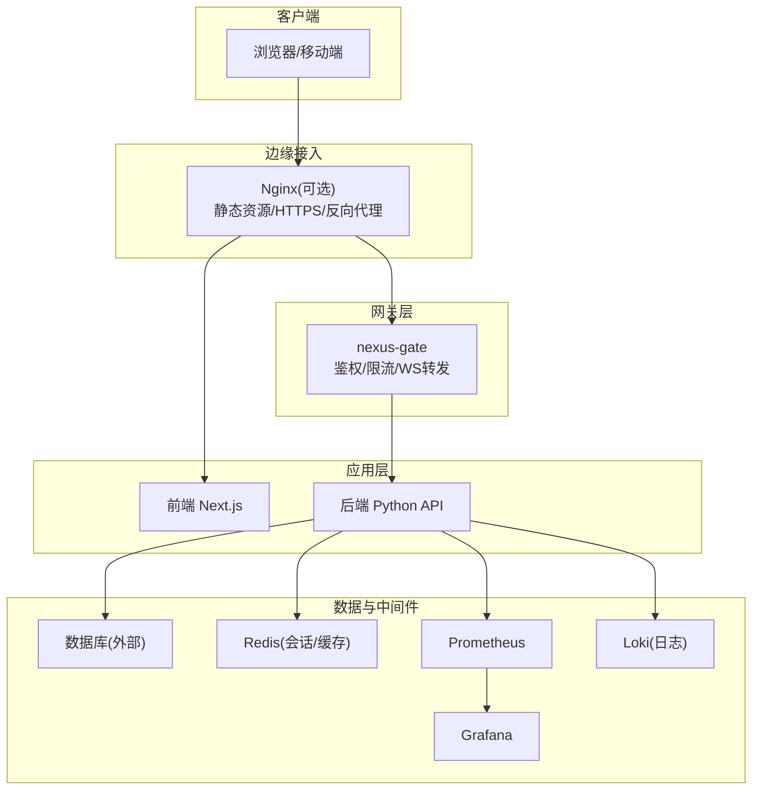
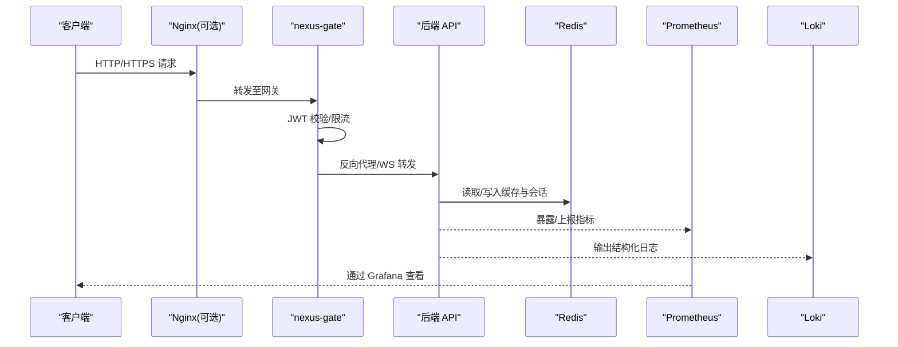
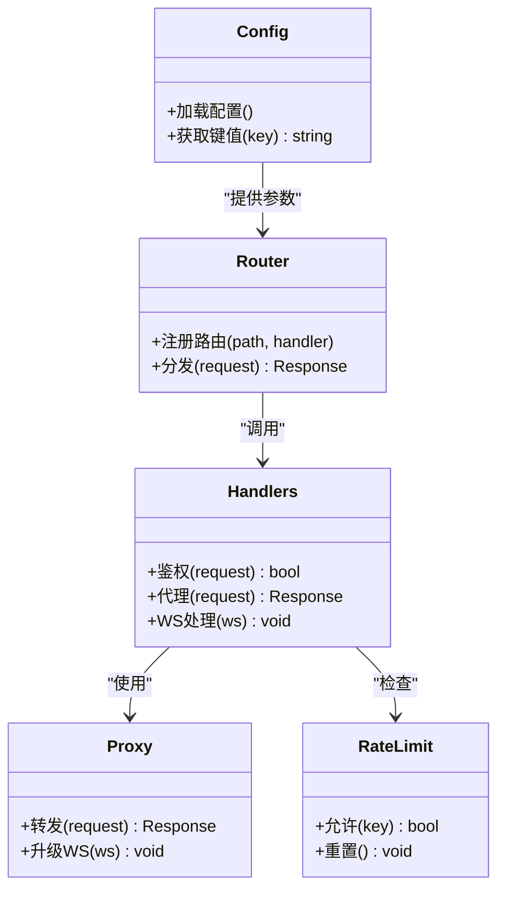
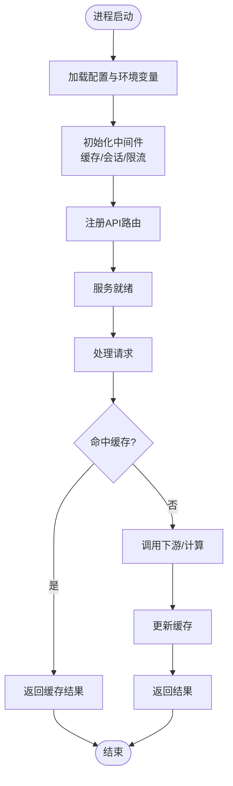
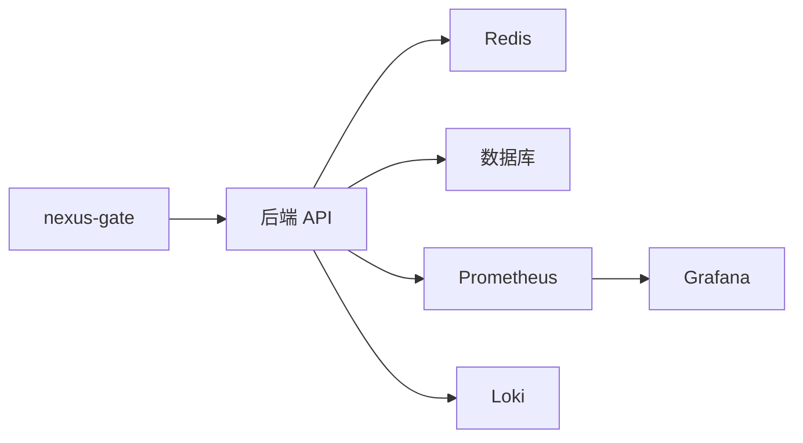

# 部署运维

<cite>
**本文引用的文件**   
- [docker-compose.yml](file://docker-compose.yml)
- [backend Dockerfile](file://backend_design/Dockerfile)
- [gateway Dockerfile](file://backend_design/nexus_gate/Dockerfile)
- [frontend Dockerfile](file://frontend_design/Dockerfile)
- [CI 流水线](file://.github/workflows/ci.yml)
- [后端主入口](file://backend_design/nexus/main.py)
- [后端配置](file://backend_design/nexus/config.py)
- [网关配置](file://backend_design/nexus_gate/internal/config/config.go)
- [网关路由](file://backend_design/nexus_gate/internal/router/router.go)
- [网关处理器](file://backend_design/nexus_gate/internal/handlers/handlers.go)
- [网关代理](file://backend_design/nexus_gate/internal/proxy/proxy.go)
- [网关速率限制](file://backend_design/nexus_gate/internal/ratelimit/ratelimit.go)
- [中间件缓存](file://backend_design/nexus/middleware/redis_cache.py)
- [中间件会话存储](file://backend_design/nexus/middleware/session_store.py)
- [可观测性指标](file://backend_design/nexus/observability/metrics.py)
- [Grafana 数据源](file://config/grafana/provisioning/datasources/prometheus.yml)
- [Grafana 仪表盘](file://config/grafana/provisioning/dashboards/dashboards.yml)
- [Prometheus 配置](file://config/prometheus/prometheus.yml)
- [Loki 配置](file://config/loki/loki-config.yml/)
- [Nginx 配置目录](file://config/nginx/)
- [部署说明](file://docs/deployment/SETUP.md)
- [架构文档 L7-可观测性](file://docs/architecture/L7-observability.md)
</cite>

## 目录
1. [简介](#简介)
2. [项目结构](#项目结构)
3. [核心组件](#核心组件)
4. [架构总览](#架构总览)
5. [详细组件分析](#详细组件分析)
6. [依赖关系分析](#依赖关系分析)
7. [性能考虑](#性能考虑)
8. [故障排查指南](#故障排查指南)
9. [结论](#结论)
10. [附录](#附录)

## 简介
本指南面向生产环境的容器化部署与运维，覆盖镜像构建、服务编排、环境变量与配置管理、CI/CD 自动化、高可用与负载均衡、故障转移、性能调优、备份恢复与灾难恢复、监控告警与排障等主题。文档基于仓库中的实际配置文件与源码路径进行说明，便于读者快速定位实现细节。

## 项目结构
本项目采用前后端分离与网关分层架构：
- 前端：Next.js 应用，提供 Web 控制台与交互界面
- 后端：Python FastAPI 应用，承载业务逻辑、意图识别、RAG、记忆、技能编排、ASR/TTS 集成等
- 网关：Go 实现的轻量网关，负责鉴权、限流、反向代理与 WebSocket 转发
- 可观测性：Prometheus + Grafana + Loki（可选）
- 编排：Docker Compose 一键拉起多服务
- CI/CD：GitHub Actions 流水线

图表来源
- [docker-compose.yml](file://docker-compose.yml)
- [backend Dockerfile](file://backend_design/Dockerfile)
- [gateway Dockerfile](file://backend_design/nexus_gate/Dockerfile)
- [frontend Dockerfile](file://frontend_design/Dockerfile)
- [Grafana 数据源](file://config/grafana/provisioning/datasources/prometheus.yml)
- [Prometheus 配置](file://config/prometheus/prometheus.yml)
- [Loki 配置](file://config/loki/loki-config.yml/)

章节来源
- [docker-compose.yml](file://docker-compose.yml)
- [部署说明](file://docs/deployment/SETUP.md)

## 核心组件
- 网关(nexus-gate)
  - 职责：统一入口、JWT 鉴权、请求限流、WebSocket 代理、到后端的反向代理
  - 关键路径：配置加载、路由分发、处理器、代理转发、限流器
- 后端(nexus)
  - 职责：REST/WebSocket API、意图路由、RAG、记忆、技能编排、ASR/TTS、可观测性埋点
  - 关键路径：主入口启动、配置读取、中间件（缓存/会话）、指标上报
- 前端(frontend)
  - 职责：控制台 UI、语音交互、车辆控制面板
  - 关键路径：构建产物、静态资源、与后端 API 通信
- 可观测性
  - Prometheus 抓取后端指标；Grafana 可视化；Loki 聚合日志

章节来源
- [网关配置](file://backend_design/nexus_gate/internal/config/config.go)
- [网关路由](file://backend_design/nexus_gate/internal/router/router.go)
- [网关处理器](file://backend_design/nexus_gate/internal/handlers/handlers.go)
- [网关代理](file://backend_design/nexus_gate/internal/proxy/proxy.go)
- [网关速率限制](file://backend_design/nexus_gate/internal/ratelimit/ratelimit.go)
- [后端主入口](file://backend_design/nexus/main.py)
- [后端配置](file://backend_design/nexus/config.py)
- [中间件缓存](file://backend_design/nexus/middleware/redis_cache.py)
- [中间件会话存储](file://backend_design/nexus/middleware/session_store.py)
- [可观测性指标](file://backend_design/nexus/observability/metrics.py)

## 架构总览
下图展示从客户端到各服务的调用链路与数据流向，包括鉴权、限流、代理、缓存与会话、指标采集与日志收集。

图表来源
- [网关配置](file://backend_design/nexus_gate/internal/config/config.go)
- [网关路由](file://backend_design/nexus_gate/internal/router/router.go)
- [网关处理器](file://backend_design/nexus_gate/internal/handlers/handlers.go)
- [网关代理](file://backend_design/nexus_gate/internal/proxy/proxy.go)
- [网关速率限制](file://backend_design/nexus_gate/internal/ratelimit/ratelimit.go)
- [后端主入口](file://backend_design/nexus/main.py)
- [中间件缓存](file://backend_design/nexus/middleware/redis_cache.py)
- [中间件会话存储](file://backend_design/nexus/middleware/session_store.py)
- [可观测性指标](file://backend_design/nexus/observability/metrics.py)
- [Prometheus 配置](file://config/prometheus/prometheus.yml)
- [Loki 配置](file://config/loki/loki-config.yml/)

## 详细组件分析

### 网关(nexus-gate)
- 配置加载
  - 支持从环境变量或配置文件注入参数，如监听端口、上游地址、鉴权密钥、限流阈值等
- 路由与处理器
  - 根据路径将请求分发到对应处理器，处理鉴权、代理、WebSocket 升级等
- 代理转发
  - 将请求透明转发到后端服务，保持头部与会话上下文
- 限流
  - 基于令牌桶或滑动窗口策略对接口进行限流，保护后端稳定性

图表来源
- [网关配置](file://backend_design/nexus_gate/internal/config/config.go)
- [网关路由](file://backend_design/nexus_gate/internal/router/router.go)
- [网关处理器](file://backend_design/nexus_gate/internal/handlers/handlers.go)
- [网关代理](file://backend_design/nexus_gate/internal/proxy/proxy.go)
- [网关速率限制](file://backend_design/nexus_gate/internal/ratelimit/ratelimit.go)

章节来源
- [网关配置](file://backend_design/nexus_gate/internal/config/config.go)
- [网关路由](file://backend_design/nexus_gate/internal/router/router.go)
- [网关处理器](file://backend_design/nexus_gate/internal/handlers/handlers.go)
- [网关代理](file://backend_design/nexus_gate/internal/proxy/proxy.go)
- [网关速率限制](file://backend_design/nexus_gate/internal/ratelimit/ratelimit.go)

### 后端(nexus)
- 启动与配置
  - 主入口初始化应用、加载配置、注册路由与中间件
- 中间件
  - Redis 缓存：热点数据缓存、减少下游压力
  - 会话存储：用户会话持久化与过期清理
- 可观测性
  - 指标导出：HTTP 请求数、延迟、错误率、业务指标
  - 日志输出：结构化日志，便于 Loki 采集

图表来源
- [后端主入口](file://backend_design/nexus/main.py)
- [后端配置](file://backend_design/nexus/config.py)
- [中间件缓存](file://backend_design/nexus/middleware/redis_cache.py)
- [中间件会话存储](file://backend_design/nexus/middleware/session_store.py)
- [可观测性指标](file://backend_design/nexus/observability/metrics.py)

章节来源
- [后端主入口](file://backend_design/nexus/main.py)
- [后端配置](file://backend_design/nexus/config.py)
- [中间件缓存](file://backend_design/nexus/middleware/redis_cache.py)
- [中间件会话存储](file://backend_design/nexus/middleware/session_store.py)
- [可观测性指标](file://backend_design/nexus/observability/metrics.py)

### 前端(frontend)
- 构建与运行
  - 使用 Node 环境构建静态资源，由 Nginx 或网关提供静态访问
- 与后端交互
  - 通过 REST/WebSocket 与后端通信，携带鉴权头与会话信息

章节来源
- [frontend Dockerfile](file://frontend_design/Dockerfile)

### 可观测性(Prometheus/Grafana/Loki)
- 指标采集
  - Prometheus 定期抓取后端暴露的指标端点
- 可视化
  - Grafana 预置数据源与仪表盘，快速查看系统健康
- 日志
  - Loki 聚合后端结构化日志，配合 Grafana 检索与分析

章节来源
- [Prometheus 配置](file://config/prometheus/prometheus.yml)
- [Grafana 数据源](file://config/grafana/provisioning/datasources/prometheus.yml)
- [Grafana 仪表盘](file://config/grafana/provisioning/dashboards/dashboards.yml)
- [Loki 配置](file://config/loki/loki-config.yml/)
- [架构文档 L7-可观测性](file://docs/architecture/L7-observability.md)

## 依赖关系分析
- 服务间依赖
  - 网关依赖后端 API；后端依赖 Redis、数据库、外部模型服务（ASR/TTS/RAG）
- 可观测性依赖
  - Prometheus 依赖后端指标端点；Grafana 依赖 Prometheus 数据源；Loki 依赖后端日志输出
- 编排依赖
  - docker-compose 定义服务网络、端口映射、卷挂载与依赖顺序

图表来源
- [docker-compose.yml](file://docker-compose.yml)
- [Prometheus 配置](file://config/prometheus/prometheus.yml)
- [Grafana 数据源](file://config/grafana/provisioning/datasources/prometheus.yml)
- [Loki 配置](file://config/loki/loki-config.yml/)

章节来源
- [docker-compose.yml](file://docker-compose.yml)

## 性能考虑
- 网关层
  - 合理设置并发连接数、超时时间、代理缓冲大小
  - 启用连接复用与 Keep-Alive，降低握手开销
  - 针对高频接口配置更严格的限流策略
- 后端层
  - 调整工作进程/线程池大小，结合 CPU 核数与内存上限
  - 开启响应压缩、HTTP/2，减少带宽占用
  - 缓存热点数据，缩短尾延迟
  - 异步任务队列解耦耗时操作，避免阻塞请求链路
- 中间件
  - Redis 连接池大小与超时配置需与 QPS 匹配
  - 会话存储设置合理的 TTL 与清理策略
- 可观测性
  - 采样率与保留周期按容量规划，避免指标风暴
  - 日志分级输出，仅在生产开启必要级别

[本节为通用指导，不直接分析具体文件]

## 故障排查指南
- 常见问题定位
  - 鉴权失败：检查网关 JWT 配置与后端签名验证一致性
  - 限流触发：观察网关限流计数器与后端错误码，调整阈值
  - 缓存异常：确认 Redis 连通性与键空间是否被误删
  - 会话丢失：检查会话存储 TTL 与跨节点共享策略
  - 指标缺失：核对 Prometheus 抓取目标与健康状态
  - 日志不可见：确认 Loki 配置与后端日志格式一致
- 排障步骤建议
  - 通过 Grafana 仪表盘查看错误率与延迟分布
  - 在 Loki 中按服务名与请求 ID 过滤日志
  - 复现问题并打开调试级别日志，关注关键链路
  - 对网关与后端分别执行健康检查与压测，隔离瓶颈

章节来源
- [网关速率限制](file://backend_design/nexus_gate/internal/ratelimit/ratelimit.go)
- [中间件缓存](file://backend_design/nexus/middleware/redis_cache.py)
- [中间件会话存储](file://backend_design/nexus/middleware/session_store.py)
- [可观测性指标](file://backend_design/nexus/observability/metrics.py)
- [架构文档 L7-可观测性](file://docs/architecture/L7-observability.md)

## 结论
通过网关统一接入、后端模块化设计与可观测性体系完善，本项目具备在生产环境稳定运行的基础能力。结合容器化编排、CI/CD 自动化、高可用与性能调优策略，可进一步提升系统的弹性与可靠性。建议在上线前完成容量评估、演练与回滚预案，确保变更可控与风险最小化。

[本节为总结性内容，不直接分析具体文件]

## 附录

### 容器化部署与镜像构建
- 镜像构建
  - 后端：基于 Python 运行时，安装依赖并拷贝应用代码
  - 网关：基于 Go 多阶段构建，生成精简二进制镜像
  - 前端：Node 构建静态资源，由 Nginx 或网关提供
- 运行参数
  - 通过环境变量注入敏感信息与运行时配置
  - 使用只读根文件系统与非 root 用户提升安全性

章节来源
- [backend Dockerfile](file://backend_design/Dockerfile)
- [gateway Dockerfile](file://backend_design/nexus_gate/Dockerfile)
- [frontend Dockerfile](file://frontend_design/Dockerfile)

### 服务编排与网络拓扑
- 使用 docker-compose 定义服务、网络、卷与依赖
- 对外暴露端口由网关或 Nginx 统一收敛
- 内部服务通过 Compose 网络互通，避免直接暴露数据库与中间件

章节来源
- [docker-compose.yml](file://docker-compose.yml)

### 生产环境配置管理与环境变量
- 配置优先级
  - 默认配置 < 配置文件 < 环境变量 < 启动参数
- 敏感信息
  - 使用密钥管理服务或编排平台 Secret 注入
- 配置校验
  - 启动时校验必填项与取值范围，失败则中止进程

章节来源
- [后端配置](file://backend_design/nexus/config.py)
- [网关配置](file://backend_design/nexus_gate/internal/config/config.go)

### CI/CD 流水线自动化
- 触发条件
  - 推送分支或创建合并请求时自动构建
- 构建步骤
  - 拉取代码、安装依赖、单元测试、构建镜像、推送镜像仓库
- 部署步骤
  - 更新编排清单、滚动重启服务、健康检查通过后切换流量

章节来源
- [CI 流水线](file://.github/workflows/ci.yml)

### 高可用与负载均衡
- 多副本部署
  - 网关与后端均支持水平扩展，通过编排平台管理副本数
- 负载均衡
  - 使用 Ingress/Nginx 做七层负载均衡，健康检查剔除异常实例
- 故障转移
  - 会话外置至 Redis，保证跨实例共享
  - 后端无状态设计，便于快速替换与自愈

章节来源
- [中间件会话存储](file://backend_design/nexus/middleware/session_store.py)
- [Nginx 配置目录](file://config/nginx/)

### 备份恢复与灾难恢复
- 数据备份
  - 数据库定时快照与增量备份，异地容灾存储
  - Redis 持久化与定期 RDB/AOF 备份
- 恢复流程
  - 先恢复中间件与数据库，再启动后端与网关
  - 验证指标与日志正常后再开放流量
- 演练计划
  - 定期演练全量恢复与部分恢复场景，记录 RTO/RPO

[本节为通用指导，不直接分析具体文件]

### 监控告警与排障方法
- 指标与告警
  - 定义 SLO/SLI，设置错误率、延迟、饱和度、流量等阈值告警
- 日志与追踪
  - 统一日志格式，关联请求 ID，便于端到端追踪
- 仪表盘
  - 使用 Grafana 预置仪表盘快速定位问题

章节来源
- [Prometheus 配置](file://config/prometheus/prometheus.yml)
- [Grafana 数据源](file://config/grafana/provisioning/datasources/prometheus.yml)
- [Grafana 仪表盘](file://config/grafana/provisioning/dashboards/dashboards.yml)
- [Loki 配置](file://config/loki/loki-config.yml/)
- [架构文档 L7-可观测性](file://docs/architecture/L7-observability.md)