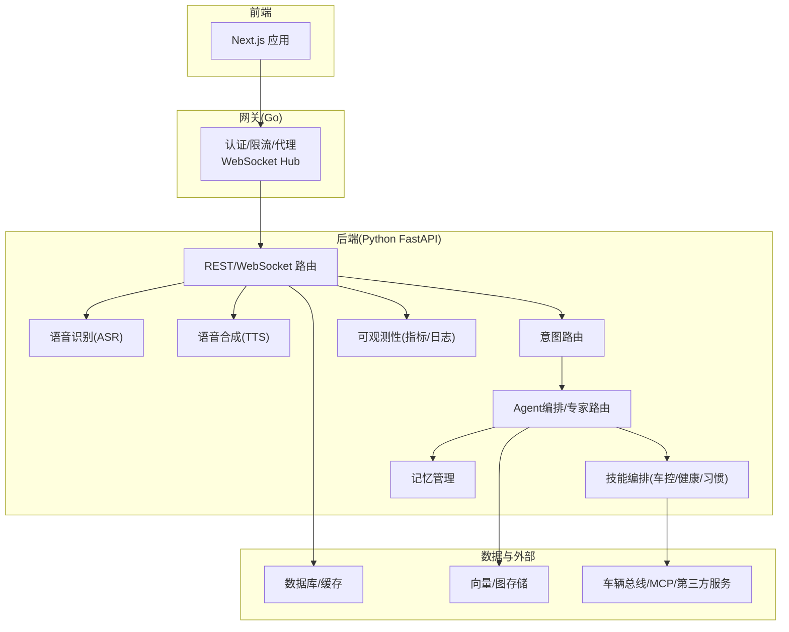
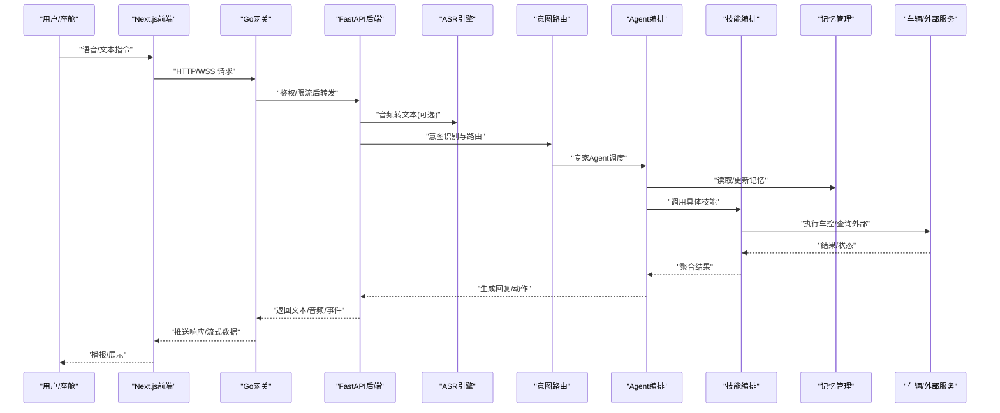
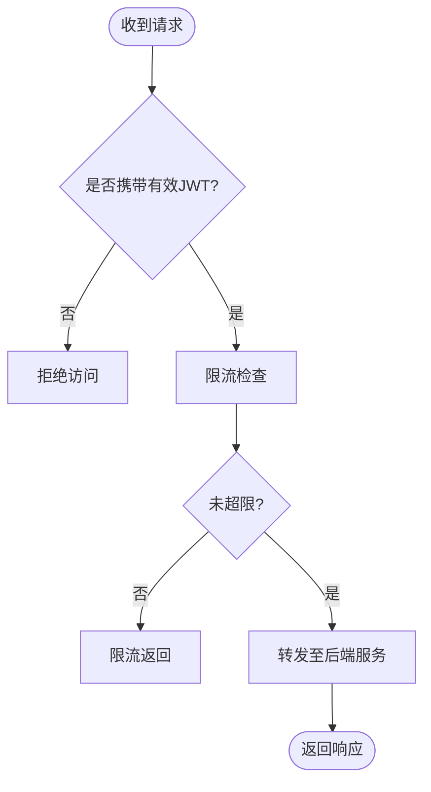
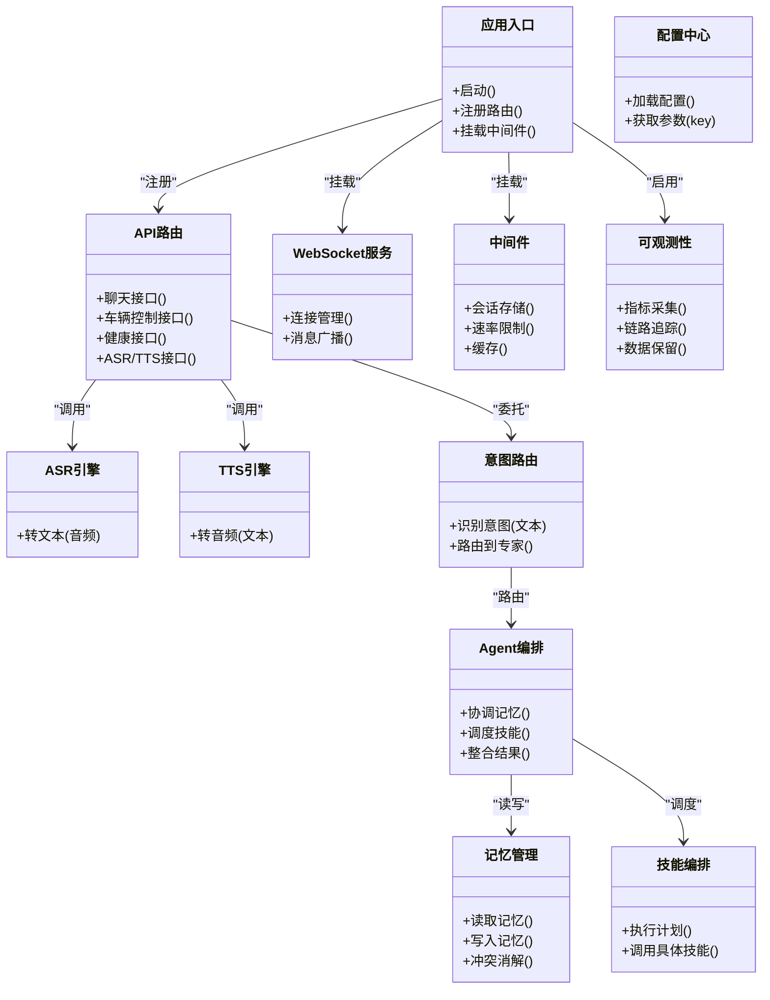
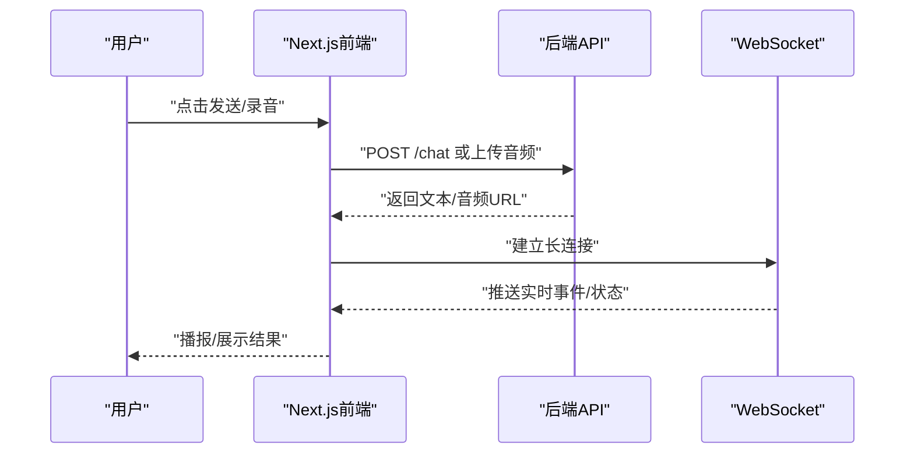
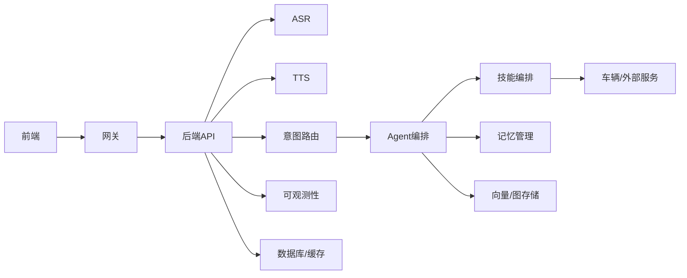

# 项目概述

<cite>
**本文引用的文件**   
- [README.md](file://README.md)
- [backend_design/nexus/main.py](file://backend_design/nexus/main.py)
- [backend_design/nexus/config.py](file://backend_design/nexus/config.py)
- [backend_design/nexus/core/cockpit_manager.py](file://backend_design/nexus/core/cockpit_manager.py)
- [backend_design/nexus/api/routes/chat.py](file://backend_design/nexus/api/routes/chat.py)
- [backend_design/nexus/api/routes/vehicle.py](file://backend_design/nexus/api/routes/vehicle.py)
- [backend_design/nexus/api/routes/health.py](file://backend_design/nexus/api/routes/health.py)
- [backend_design/nexus/api/websocket.py](file://backend_design/nexus/api/websocket.py)
- [backend_design/nexus/asr/engine.py](file://backend_design/nexus/asr/engine.py)
- [backend_design/nexus/tts/engine.py](file://backend_design/nexus/tts/engine.py)
- [backend_design/nexus/intent/router.py](file://backend_design/nexus/intent/router.py)
- [backend_design/nexus/skills/orchestrator.py](file://backend_design/nexus/skills/orchestrator.py)
- [backend_design/nexus/memory/manager.py](file://backend_design/nexus/memory/manager.py)
- [backend_design/nexus/middleware/session_store.py](file://backend_design/nexus/middleware/session_store.py)
- [backend_design/nexus/observability/metrics.py](file://backend_design/nexus/observability/metrics.py)
- [backend_design/nexus_gate/cmd/main.go](file://backend_design/nexus_gate/cmd/main.go)
- [backend_design/nexus_gate/internal/auth/jwt.go](file://backend_design/nexus_gate/internal/auth/jwt.go)
- [backend_design/nexus_gate/internal/proxy/proxy.go](file://backend_design/nexus_gate/internal/proxy/proxy.go)
- [backend_design/nexus_gate/internal/ws/hub.go](file://backend_design/nexus_gate/internal/ws/hub.go)
- [frontend_design/src/app/page.tsx](file://frontend_design/src/app/page.tsx)
- [frontend_design/src/app/chat/page.tsx](file://frontend_design/src/app/chat/page.tsx)
- [frontend_design/src/app/cockpit/page.tsx](file://frontend_design/src/app/cockpit/page.tsx)
- [frontend_design/src/lib/api.ts](file://frontend_design/src/lib/api.ts)
- [frontend_design/src/hooks/use-speech-recognition.ts](file://frontend_design/src/hooks/use-speech-recognition.ts)
- [docker-compose.yml](file://docker-compose.yml)
</cite>

## 目录
1. [简介](#简介)
2. [项目结构](#项目结构)
3. [核心组件](#核心组件)
4. [架构总览](#架构总览)
5. [详细组件分析](#详细组件分析)
6. [依赖关系分析](#依赖关系分析)
7. [性能与可扩展性](#性能与可扩展性)
8. [故障排查指南](#故障排查指南)
9. [结论](#结论)
10. [附录](#附录)

## 简介
NexusCockpit智能座舱系统是一个面向车载场景的AI驱动智能交互平台，提供语音交互、车辆控制、健康管理与个性化记忆等核心能力。系统采用前后端分离与微服务化设计：前端基于Next.js构建响应式座舱界面；后端以Python FastAPI为核心，集成ASR/TTS、意图识别、Agent编排、技能执行与记忆管理；网关使用Go实现高性能鉴权、限流与WebSocket转发；整体通过Docker Compose进行一体化编排部署。

业务价值与应用场景
- 语音交互：端到端语音对话，支持唤醒、打断与多轮澄清，提升驾驶安全性与体验。
- 车辆控制：通过统一技能编排调用空调、导航、媒体、座椅、车窗等子系统。
- 健康管理：结合用户偏好与健康数据，提供饮食建议、运动提醒与状态追踪。
- 个性化记忆：跨会话记忆与冲突消解，实现“越用越懂你”的持续进化体验。
- 可观测性与稳定性：内置指标、日志与降级策略，保障高可用运行。

技术栈选择理由
- Python FastAPI：异步I/O与类型校验友好，便于快速集成AI推理与外部服务。
- Go网关：低延迟、高并发，适合做鉴权、限流、协议转换与长连接转发。
- Next.js前端：SSR/CSR灵活组合，生态完善，利于快速迭代座舱UI。
- AI Agent系统：专家路由+技能编排+记忆检索，形成“感知-理解-决策-执行”闭环。

## 项目结构
仓库采用分层与分域组织方式：
- backend_design/nexus：Python后端主工程，包含API路由、Agent编排、ASR/TTS、意图路由、技能编排、记忆、中间件、可观测性等模块。
- backend_design/nexus_gate：Go语言网关，负责鉴权、限流、反向代理与WebSocket Hub。
- frontend_design：Next.js前端应用，提供聊天、座舱、仪表盘、设置等页面。
- config：监控与日志配置（Prometheus、Grafana、Loki）。
- models：本地模型资源（ASR、TTS、Reranker、声纹等）。
- scripts：初始化脚本、测试与迁移工具。
- docker-compose.yml：一键编排后端、网关、数据库与向量/图数据库等依赖。

图表来源
- [backend_design/nexus/main.py:1-200](file://backend_design/nexus/main.py#L1-L200)
- [backend_design/nexus_gate/cmd/main.go:1-200](file://backend_design/nexus_gate/cmd/main.go#L1-L200)
- [frontend_design/src/app/page.tsx:1-200](file://frontend_design/src/app/page.tsx#L1-L200)

章节来源
- [README.md:1-200](file://README.md#L1-L200)
- [docker-compose.yml:1-200](file://docker-compose.yml#L1-L200)

## 核心组件
- 网关（Go）
  - 功能：JWT鉴权、请求限流、反向代理、WebSocket Hub转发。
  - 关键路径：入口命令、鉴权中间件、代理转发、Hub广播。
- 后端（Python FastAPI）
  - 入口与配置：应用启动、全局配置加载、生命周期钩子。
  - API层：REST与WebSocket路由，承载聊天、车辆控制、健康、ASR/TTS等接口。
  - 语音链路：ASR引擎将音频转文本，TTS引擎将文本转音频。
  - 意图与Agent：意图路由将输入分发至专家Agent，由Agent协调技能与记忆。
  - 技能编排：按领域封装车控、健康、习惯等能力，统一调度。
  - 记忆管理：跨会话持久化、冲突检测与合并。
  - 中间件：会话存储、速率限制、Redis缓存、任务队列。
  - 可观测性：指标采集、Langfuse追踪、数据保留策略。
- 前端（Next.js）
  - 页面：首页、聊天页、座舱页、仪表盘、设置等。
  - 能力：录音与语音识别Hook、TTS播放、API客户端封装、事件总线。

章节来源
- [backend_design/nexus_gate/cmd/main.go:1-200](file://backend_design/nexus_gate/cmd/main.go#L1-L200)
- [backend_design/nexus_gate/internal/auth/jwt.go:1-200](file://backend_design/nexus_gate/internal/auth/jwt.go#L1-L200)
- [backend_design/nexus_gate/internal/proxy/proxy.go:1-200](file://backend_design/nexus_gate/internal/proxy/proxy.go#L1-L200)
- [backend_design/nexus_gate/internal/ws/hub.go:1-200](file://backend_design/nexus_gate/internal/ws/hub.go#L1-L200)
- [backend_design/nexus/main.py:1-200](file://backend_design/nexus/main.py#L1-L200)
- [backend_design/nexus/config.py:1-200](file://backend_design/nexus/config.py#L1-L200)
- [backend_design/nexus/api/websocket.py:1-200](file://backend_design/nexus/api/websocket.py#L1-L200)
- [backend_design/nexus/asr/engine.py:1-200](file://backend_design/nexus/asr/engine.py#L1-L200)
- [backend_design/nexus/tts/engine.py:1-200](file://backend_design/nexus/tts/engine.py#L1-L200)
- [backend_design/nexus/intent/router.py:1-200](file://backend_design/nexus/intent/router.py#L1-L200)
- [backend_design/nexus/skills/orchestrator.py:1-200](file://backend_design/nexus/skills/orchestrator.py#L1-L200)
- [backend_design/nexus/memory/manager.py:1-200](file://backend_design/nexus/memory/manager.py#L1-L200)
- [backend_design/nexus/middleware/session_store.py:1-200](file://backend_design/nexus/middleware/session_store.py#L1-L200)
- [backend_design/nexus/observability/metrics.py:1-200](file://backend_design/nexus/observability/metrics.py#L1-L200)
- [frontend_design/src/app/chat/page.tsx:1-200](file://frontend_design/src/app/chat/page.tsx#L1-L200)
- [frontend_design/src/app/cockpit/page.tsx:1-200](file://frontend_design/src/app/cockpit/page.tsx#L1-L200)
- [frontend_design/src/lib/api.ts:1-200](file://frontend_design/src/lib/api.ts#L1-L200)
- [frontend_design/src/hooks/use-speech-recognition.ts:1-200](file://frontend_design/src/hooks/use-speech-recognition.ts#L1-L200)

## 架构总览
系统遵循“网关-服务-数据”的分层架构，强调高内聚、低耦合与可观测性。

图表来源
- [backend_design/nexus/api/routes/chat.py:1-200](file://backend_design/nexus/api/routes/chat.py#L1-L200)
- [backend_design/nexus/api/websocket.py:1-200](file://backend_design/nexus/api/websocket.py#L1-L200)
- [backend_design/nexus/asr/engine.py:1-200](file://backend_design/nexus/asr/engine.py#L1-L200)
- [backend_design/nexus/intent/router.py:1-200](file://backend_design/nexus/intent/router.py#L1-L200)
- [backend_design/nexus/skills/orchestrator.py:1-200](file://backend_design/nexus/skills/orchestrator.py#L1-L200)
- [backend_design/nexus/memory/manager.py:1-200](file://backend_design/nexus/memory/manager.py#L1-L200)
- [backend_design/nexus_gate/internal/proxy/proxy.go:1-200](file://backend_design/nexus_gate/internal/proxy/proxy.go#L1-L200)
- [backend_design/nexus_gate/internal/ws/hub.go:1-200](file://backend_design/nexus_gate/internal/ws/hub.go#L1-L200)

## 详细组件分析

### 网关（Go）
- 职责
  - 统一入口：集中处理鉴权、限流、协议适配与转发。
  - WebSocket Hub：维护长连接与会话广播，支撑实时语音与事件推送。
- 关键流程
  - 鉴权：解析并验证JWT，注入用户上下文。
  - 代理：根据路由规则将请求转发至后端服务。
  - 限流：基于令牌桶或滑动窗口对接口进行保护。
  - WS转发：将客户端消息广播到目标会话或频道。

图表来源
- [backend_design/nexus_gate/internal/auth/jwt.go:1-200](file://backend_design/nexus_gate/internal/auth/jwt.go#L1-L200)
- [backend_design/nexus_gate/internal/proxy/proxy.go:1-200](file://backend_design/nexus_gate/internal/proxy/proxy.go#L1-L200)
- [backend_design/nexus_gate/internal/ws/hub.go:1-200](file://backend_design/nexus_gate/internal/ws/hub.go#L1-L200)

章节来源
- [backend_design/nexus_gate/cmd/main.go:1-200](file://backend_design/nexus_gate/cmd/main.go#L1-L200)
- [backend_design/nexus_gate/internal/auth/jwt.go:1-200](file://backend_design/nexus_gate/internal/auth/jwt.go#L1-L200)
- [backend_design/nexus_gate/internal/proxy/proxy.go:1-200](file://backend_design/nexus_gate/internal/proxy/proxy.go#L1-L200)
- [backend_design/nexus_gate/internal/ws/hub.go:1-200](file://backend_design/nexus_gate/internal/ws/hub.go#L1-L200)

### 后端（Python FastAPI）
- 入口与配置
  - 应用启动：注册路由、挂载中间件、初始化可观测性与资源。
  - 配置中心：集中加载环境变量与配置文件，提供运行时参数。
- API层
  - REST：聊天、车辆控制、健康、ASR/TTS、设置等接口。
  - WebSocket：实时双向通信，用于语音流、事件推送与状态同步。
- 语音链路
  - ASR：接收音频流，输出文本供后续处理。
  - TTS：将文本转为音频流，支持流式播放。
- 意图与Agent
  - 意图路由：基于启发式与LLM路由，将输入映射到专家Agent。
  - Agent编排：协调记忆检索、技能调用与结果整合。
- 技能编排
  - 统一抽象：按领域封装车控、健康、习惯等技能，提供一致调用契约。
  - 编排器：根据意图与上下文动态组装执行计划。
- 记忆管理
  - 跨会话记忆：持久化用户偏好、历史行为与知识片段。
  - 冲突消解：在合并记忆时解决不一致信息。
- 中间件
  - 会话存储：保存短期会话状态与上下文。
  - 速率限制与缓存：保护后端与加速热点数据访问。
- 可观测性
  - 指标与追踪：暴露Prometheus指标，集成Langfuse进行链路追踪。
  - 数据保留：定义日志与指标数据的保留策略。

图表来源
- [backend_design/nexus/main.py:1-200](file://backend_design/nexus/main.py#L1-L200)
- [backend_design/nexus/config.py:1-200](file://backend_design/nexus/config.py#L1-L200)
- [backend_design/nexus/api/routes/chat.py:1-200](file://backend_design/nexus/api/routes/chat.py#L1-L200)
- [backend_design/nexus/api/routes/vehicle.py:1-200](file://backend_design/nexus/api/routes/vehicle.py#L1-L200)
- [backend_design/nexus/api/routes/health.py:1-200](file://backend_design/nexus/api/routes/health.py#L1-L200)
- [backend_design/nexus/api/websocket.py:1-200](file://backend_design/nexus/api/websocket.py#L1-L200)
- [backend_design/nexus/asr/engine.py:1-200](file://backend_design/nexus/asr/engine.py#L1-L200)
- [backend_design/nexus/tts/engine.py:1-200](file://backend_design/nexus/tts/engine.py#L1-L200)
- [backend_design/nexus/intent/router.py:1-200](file://backend_design/nexus/intent/router.py#L1-L200)
- [backend_design/nexus/skills/orchestrator.py:1-200](file://backend_design/nexus/skills/orchestrator.py#L1-L200)
- [backend_design/nexus/memory/manager.py:1-200](file://backend_design/nexus/memory/manager.py#L1-L200)
- [backend_design/nexus/middleware/session_store.py:1-200](file://backend_design/nexus/middleware/session_store.py#L1-L200)
- [backend_design/nexus/observability/metrics.py:1-200](file://backend_design/nexus/observability/metrics.py#L1-L200)

章节来源
- [backend_design/nexus/main.py:1-200](file://backend_design/nexus/main.py#L1-L200)
- [backend_design/nexus/config.py:1-200](file://backend_design/nexus/config.py#L1-L200)
- [backend_design/nexus/api/routes/chat.py:1-200](file://backend_design/nexus/api/routes/chat.py#L1-L200)
- [backend_design/nexus/api/routes/vehicle.py:1-200](file://backend_design/nexus/api/routes/vehicle.py#L1-L200)
- [backend_design/nexus/api/routes/health.py:1-200](file://backend_design/nexus/api/routes/health.py#L1-L200)
- [backend_design/nexus/api/websocket.py:1-200](file://backend_design/nexus/api/websocket.py#L1-L200)
- [backend_design/nexus/asr/engine.py:1-200](file://backend_design/nexus/asr/engine.py#L1-L200)
- [backend_design/nexus/tts/engine.py:1-200](file://backend_design/nexus/tts/engine.py#L1-L200)
- [backend_design/nexus/intent/router.py:1-200](file://backend_design/nexus/intent/router.py#L1-L200)
- [backend_design/nexus/skills/orchestrator.py:1-200](file://backend_design/nexus/skills/orchestrator.py#L1-L200)
- [backend_design/nexus/memory/manager.py:1-200](file://backend_design/nexus/memory/manager.py#L1-L200)
- [backend_design/nexus/middleware/session_store.py:1-200](file://backend_design/nexus/middleware/session_store.py#L1-L200)
- [backend_design/nexus/observability/metrics.py:1-200](file://backend_design/nexus/observability/metrics.py#L1-L200)

### 前端（Next.js）
- 页面与交互
  - 聊天页：展示对话历史、发送文本/语音、播放TTS。
  - 座舱页：可视化车辆状态与控制面板。
  - 仪表盘：展示系统指标与告警。
- 能力封装
  - API客户端：统一封装REST与WS调用，处理错误与重试。
  - 语音识别Hook：封装浏览器语音识别能力，提供稳定接口。
  - 事件总线：订阅车辆事件与系统通知。

图表来源
- [frontend_design/src/app/chat/page.tsx:1-200](file://frontend_design/src/app/chat/page.tsx#L1-L200)
- [frontend_design/src/app/cockpit/page.tsx:1-200](file://frontend_design/src/app/cockpit/page.tsx#L1-L200)
- [frontend_design/src/lib/api.ts:1-200](file://frontend_design/src/lib/api.ts#L1-L200)
- [frontend_design/src/hooks/use-speech-recognition.ts:1-200](file://frontend_design/src/hooks/use-speech-recognition.ts#L1-L200)

章节来源
- [frontend_design/src/app/page.tsx:1-200](file://frontend_design/src/app/page.tsx#L1-L200)
- [frontend_design/src/app/chat/page.tsx:1-200](file://frontend_design/src/app/chat/page.tsx#L1-L200)
- [frontend_design/src/app/cockpit/page.tsx:1-200](file://frontend_design/src/app/cockpit/page.tsx#L1-L200)
- [frontend_design/src/lib/api.ts:1-200](file://frontend_design/src/lib/api.ts#L1-L200)
- [frontend_design/src/hooks/use-speech-recognition.ts:1-200](file://frontend_design/src/hooks/use-speech-recognition.ts#L1-L200)

## 依赖关系分析
- 组件耦合
  - 网关与后端：通过HTTP与WebSocket解耦，网关仅承担鉴权、限流与转发。
  - 后端内部：API层与Agent/技能编排通过清晰接口协作，降低耦合度。
  - 记忆与技能：记忆作为横切关注点，被Agent与技能按需读取/更新。
- 外部依赖
  - 车辆总线/MCP：通过统一适配器接入不同车型或平台。
  - 向量/图存储：用于RAG检索与知识图谱关联。
  - 监控与日志：Prometheus/Grafana/Loki提供可观测性。

图表来源
- [backend_design/nexus/main.py:1-200](file://backend_design/nexus/main.py#L1-L200)
- [backend_design/nexus_gate/cmd/main.go:1-200](file://backend_design/nexus_gate/cmd/main.go#L1-L200)
- [frontend_design/src/app/page.tsx:1-200](file://frontend_design/src/app/page.tsx#L1-L200)

章节来源
- [docker-compose.yml:1-200](file://docker-compose.yml#L1-L200)

## 性能与可扩展性
- 网关侧
  - 高并发转发与低延迟鉴权，适合车载网络环境。
  - WebSocket Hub支持大规模长连接与广播。
- 后端侧
  - 异步I/O与中间件链优化吞吐。
  - 缓存与限流保护热点接口与外部依赖。
  - 指标与追踪辅助定位瓶颈与容量规划。
- 前端侧
  - 流式播放与增量渲染提升交互流畅度。
  - 事件订阅减少轮询开销。
- 扩展建议
  - 水平扩展网关与后端实例，配合负载均衡。
  - 引入消息队列削峰填谷，增强容错与弹性。
  - 对大模型与RAG检索进行缓存与批处理优化。

[本节为通用指导，不直接分析具体文件]

## 故障排查指南
- 常见问题
  - 鉴权失败：检查JWT签名、过期时间与网关配置。
  - 限流触发：查看网关限流阈值与后端QPS。
  - WebSocket断连：确认Hub心跳与重连逻辑。
  - ASR/TTS异常：核对音频格式、采样率与模型路径。
  - 意图误判：检查提示词与路由策略，必要时引入澄清机制。
  - 记忆冲突：审查冲突消解策略与写入顺序。
- 可观测性
  - 指标：关注网关延迟、后端P95/P99、错误率与资源使用。
  - 日志：结合TraceID定位跨组件问题。
  - 追踪：利用Langfuse查看Agent执行路径与耗时。

章节来源
- [backend_design/nexus_gate/internal/auth/jwt.go:1-200](file://backend_design/nexus_gate/internal/auth/jwt.go#L1-L200)
- [backend_design/nexus_gate/internal/ws/hub.go:1-200](file://backend_design/nexus_gate/internal/ws/hub.go#L1-L200)
- [backend_design/nexus/asr/engine.py:1-200](file://backend_design/nexus/asr/engine.py#L1-L200)
- [backend_design/nexus/tts/engine.py:1-200](file://backend_design/nexus/tts/engine.py#L1-L200)
- [backend_design/nexus/intent/router.py:1-200](file://backend_design/nexus/intent/router.py#L1-L200)
- [backend_design/nexus/memory/manager.py:1-200](file://backend_design/nexus/memory/manager.py#L1-L200)
- [backend_design/nexus/observability/metrics.py:1-200](file://backend_design/nexus/observability/metrics.py#L1-L200)

## 结论
NexusCockpit以“网关-服务-数据”的分层架构与AI Agent为核心，构建了从语音交互到车辆控制的完整闭环。通过清晰的组件边界、完善的可观测性与灵活的编排能力，系统在易用性、可靠性与可扩展性之间取得平衡，适用于多车型、多场景的智能座舱落地。

[本节为总结性内容，不直接分析具体文件]

## 附录
- 术语对照
  - 网关：Go实现的鉴权、限流与代理层。
  - 后端：Python FastAPI提供的业务逻辑与AI能力。
  - 前端：Next.js构建的座舱交互界面。
  - Agent：负责理解、决策与调度的智能体。
  - 技能：封装车控、健康、习惯等能力的可复用单元。
  - 记忆：跨会话的用户偏好与知识片段。
- 参考路径
  - 入口与配置：[backend_design/nexus/main.py](file://backend_design/nexus/main.py)、[backend_design/nexus/config.py](file://backend_design/nexus/config.py)
  - 网关核心：[backend_design/nexus_gate/cmd/main.go](file://backend_design/nexus_gate/cmd/main.go)、[backend_design/nexus_gate/internal/auth/jwt.go](file://backend_design/nexus_gate/internal/auth/jwt.go)
  - 前端页面：[frontend_design/src/app/chat/page.tsx](file://frontend_design/src/app/chat/page.tsx)、[frontend_design/src/app/cockpit/page.tsx](file://frontend_design/src/app/cockpit/page.tsx)