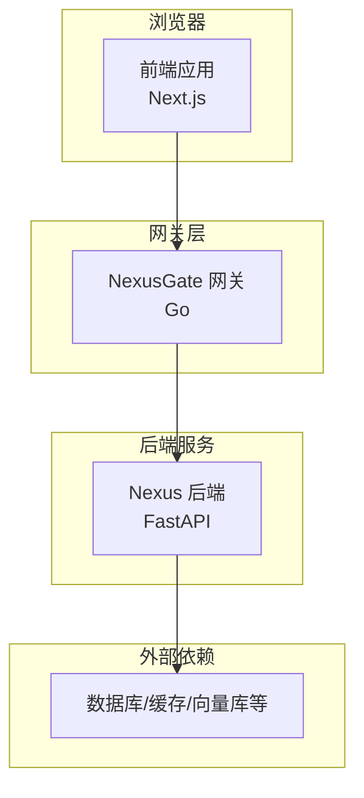
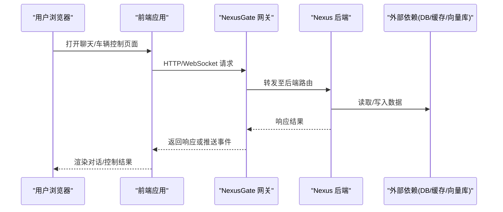
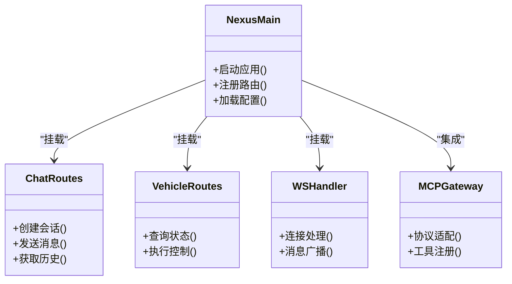
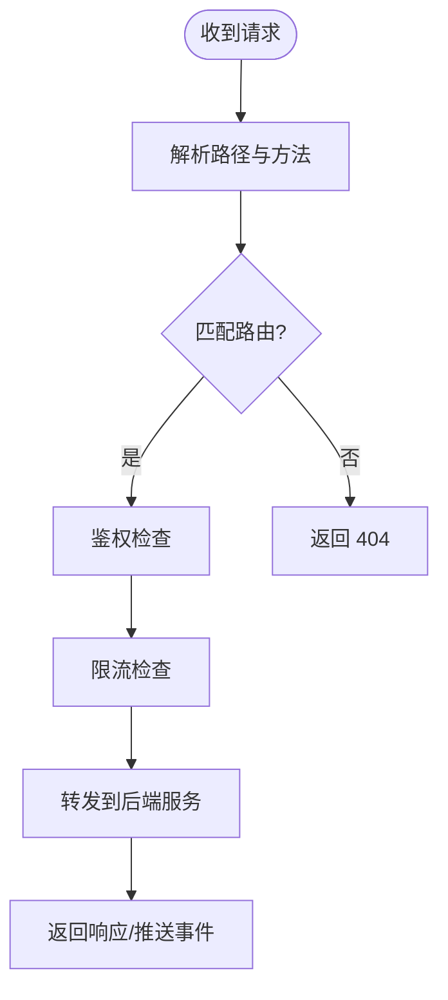
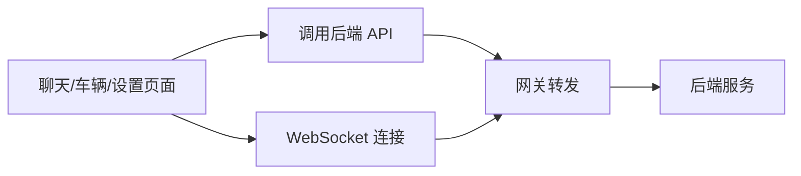
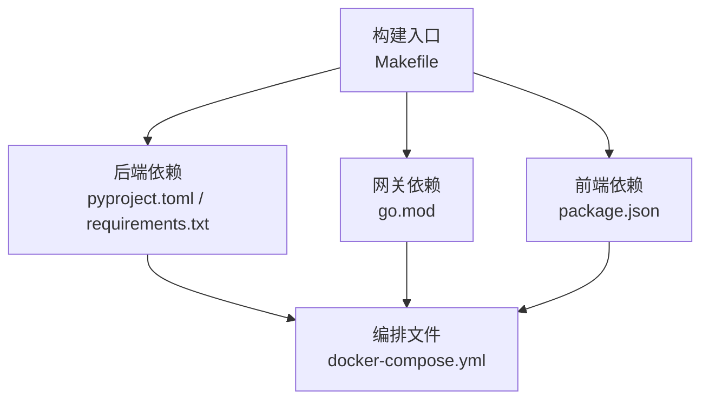

# 快速开始

<cite>
**本文引用的文件**   
- [README.md](file://README.md)
- [docker-compose.yml](file://docker-compose.yml)
- [backend_design/pyproject.toml](file://backend_design/pyproject.toml)
- [backend_design/requirements.txt](file://backend_design/requirements.txt)
- [backend_design/nexus/main.py](file://backend_design/nexus/main.py)
- [backend_design/nexus/config.py](file://backend_design/nexus/config.py)
- [backend_design/nexus/api/routes/chat.py](file://backend_design/nexus/api/routes/chat.py)
- [backend_design/nexus/api/routes/vehicle.py](file://backend_design/nexus/api/routes/vehicle.py)
- [backend_design/nexus/api/websocket.py](file://backend_design/nexus/api/websocket.py)
- [backend_design/nexus/mcp/gateway.py](file://backend_design/nexus/mcp/gateway.py)
- [backend_design/nexus_gate/cmd/main.go](file://backend_design/nexus_gate/cmd/main.go)
- [backend_design/nexus_gate/internal/router/router.go](file://backend_design/nexus_gate/internal/router/router.go)
- [backend_design/nexus_gate/internal/proxy/proxy.go](file://backend_design/nexus_gate/internal/proxy/proxy.go)
- [frontend_design/package.json](file://frontend_design/package.json)
- [frontend_design/Dockerfile](file://frontend_design/Dockerfile)
- [scripts/start-backend.ps1](file://scripts/start-backend.ps1)
- [scripts/start-frontend.ps1](file://scripts/start-frontend.ps1)
- [scripts/start-gateway.ps1](file://scripts/start-gateway.ps1)
- [Makefile](file://Makefile)
</cite>

## 目录
1. [简介](#简介)
2. [项目结构](#项目结构)
3. [核心组件](#核心组件)
4. [架构总览](#架构总览)
5. [详细组件分析](#详细组件分析)
6. [依赖分析](#依赖分析)
7. [性能考虑](#性能考虑)
8. [故障排查指南](#故障排查指南)
9. [结论](#结论)
10. [附录](#附录)

## 简介
本指南面向首次接触 NexusCockpit 智能座舱系统的用户，目标是在 30 分钟内完成环境搭建并运行后端、前端与网关服务，体验对话与车辆控制等核心能力。文档提供：
- 环境准备（Python、Node.js、Docker）
- 一键启动开发环境（含 Docker Compose 与本地脚本）
- 第一个对话示例与车辆控制操作演示
- 常见问题与排障建议

## 项目结构
仓库采用前后端分离与微服务化组织方式：
- 后端服务（Python/FastAPI）：位于 backend_design/nexus，提供聊天、车辆控制、会话管理、ASR/TTS、技能编排、MCP 网关等能力
- 网关服务（Go）：位于 backend_design/nexus_gate，负责路由转发、鉴权、限流与 WebSocket 代理
- 前端应用（Next.js）：位于 frontend_design，提供聊天界面、车辆控制面板、语音助手栏等
- 容器编排：根目录 docker-compose.yml 统一编排后端、网关、前端及外部依赖
- 启动脚本：scripts 下提供 Windows PowerShell 快捷启动脚本；Makefile 提供常用命令入口

图表来源
- [docker-compose.yml](file://docker-compose.yml)
- [backend_design/nexus/main.py](file://backend_design/nexus/main.py)
- [backend_design/nexus_gate/cmd/main.go](file://backend_design/nexus_gate/cmd/main.go)
- [frontend_design/package.json](file://frontend_design/package.json)

章节来源
- [README.md](file://README.md)
- [docker-compose.yml](file://docker-compose.yml)

## 核心组件
- 后端服务（Nexus）
  - 入口与配置：主入口与配置加载逻辑
  - API 路由：聊天、车辆控制、会话、健康检查等
  - WebSocket：实时通信通道
  - MCP 网关：对外暴露的模型/工具协议网关
- 网关服务（NexusGate）
  - 路由与代理：请求转发、WebSocket 代理
  - 鉴权与限流：JWT 鉴权、速率限制
- 前端应用（Next.js）
  - 页面与组件：聊天页、车辆面板、语音助手栏
  - 构建与运行：package.json 定义脚本与依赖

章节来源
- [backend_design/nexus/main.py](file://backend_design/nexus/main.py)
- [backend_design/nexus/config.py](file://backend_design/nexus/config.py)
- [backend_design/nexus/api/routes/chat.py](file://backend_design/nexus/api/routes/chat.py)
- [backend_design/nexus/api/routes/vehicle.py](file://backend_design/nexus/api/routes/vehicle.py)
- [backend_design/nexus/api/websocket.py](file://backend_design/nexus/api/websocket.py)
- [backend_design/nexus/mcp/gateway.py](file://backend_design/nexus/mcp/gateway.py)
- [backend_design/nexus_gate/cmd/main.go](file://backend_design/nexus_gate/cmd/main.go)
- [backend_design/nexus_gate/internal/router/router.go](file://backend_design/nexus_gate/internal/router/router.go)
- [backend_design/nexus_gate/internal/proxy/proxy.go](file://backend_design/nexus_gate/internal/proxy/proxy.go)
- [frontend_design/package.json](file://frontend_design/package.json)

## 架构总览
下图展示了从浏览器到后端服务的完整调用链路，以及网关在后端的代理作用。

图表来源
- [backend_design/nexus_gate/cmd/main.go](file://backend_design/nexus_gate/cmd/main.go)
- [backend_design/nexus_gate/internal/router/router.go](file://backend_design/nexus_gate/internal/router/router.go)
- [backend_design/nexus_gate/internal/proxy/proxy.go](file://backend_design/nexus_gate/internal/proxy/proxy.go)
- [backend_design/nexus/main.py](file://backend_design/nexus/main.py)
- [backend_design/nexus/api/websocket.py](file://backend_design/nexus/api/websocket.py)

## 详细组件分析

### 后端服务（Nexus）
- 入口与生命周期
  - 主入口负责初始化应用、注册路由、加载配置与中间件
  - 配置模块集中管理环境变量与默认值
- API 路由
  - 聊天接口：用于发起对话、获取历史、发送消息
  - 车辆控制接口：用于查询状态、执行控制指令（如空调、车窗、座椅等）
- WebSocket
  - 提供实时双向通信，适合语音流、事件推送
- MCP 网关
  - 作为模型/工具协议的统一接入点，便于扩展第三方能力

图表来源
- [backend_design/nexus/main.py](file://backend_design/nexus/main.py)
- [backend_design/nexus/config.py](file://backend_design/nexus/config.py)
- [backend_design/nexus/api/routes/chat.py](file://backend_design/nexus/api/routes/chat.py)
- [backend_design/nexus/api/routes/vehicle.py](file://backend_design/nexus/api/routes/vehicle.py)
- [backend_design/nexus/api/websocket.py](file://backend_design/nexus/api/websocket.py)
- [backend_design/nexus/mcp/gateway.py](file://backend_design/nexus/mcp/gateway.py)

章节来源
- [backend_design/nexus/main.py](file://backend_design/nexus/main.py)
- [backend_design/nexus/config.py](file://backend_design/nexus/config.py)
- [backend_design/nexus/api/routes/chat.py](file://backend_design/nexus/api/routes/chat.py)
- [backend_design/nexus/api/routes/vehicle.py](file://backend_design/nexus/api/routes/vehicle.py)
- [backend_design/nexus/api/websocket.py](file://backend_design/nexus/api/websocket.py)
- [backend_design/nexus/mcp/gateway.py](file://backend_design/nexus/mcp/gateway.py)

### 网关服务（NexusGate）
- 路由与代理
  - 根据路径将请求转发到后端服务
  - 支持 WebSocket 代理，保持长连接
- 鉴权与限流
  - JWT 校验访问令牌
  - 基于 Redis 的速率限制

图表来源
- [backend_design/nexus_gate/cmd/main.go](file://backend_design/nexus_gate/cmd/main.go)
- [backend_design/nexus_gate/internal/router/router.go](file://backend_design/nexus_gate/internal/router/router.go)
- [backend_design/nexus_gate/internal/proxy/proxy.go](file://backend_design/nexus_gate/internal/proxy/proxy.go)

章节来源
- [backend_design/nexus_gate/cmd/main.go](file://backend_design/nexus_gate/cmd/main.go)
- [backend_design/nexus_gate/internal/router/router.go](file://backend_design/nexus_gate/internal/router/router.go)
- [backend_design/nexus_gate/internal/proxy/proxy.go](file://backend_design/nexus_gate/internal/proxy/proxy.go)

### 前端应用（Next.js）
- 页面与交互
  - 聊天页：展示对话列表、输入框、语音录制
  - 车辆面板：显示车辆状态与控制按钮
  - 语音助手栏：常驻入口，支持语音输入
- 构建与运行
  - package.json 定义了安装、构建、开发服务器启动等脚本

图表来源
- [frontend_design/package.json](file://frontend_design/package.json)

章节来源
- [frontend_design/package.json](file://frontend_design/package.json)

## 依赖分析
- Python 后端
  - 使用 pyproject.toml 与 requirements.txt 声明依赖
  - 通过 Makefile 可快速安装依赖与运行测试
- Go 网关
  - 使用 go.mod 管理依赖
- Node.js 前端
  - 使用 package.json 管理依赖与脚本
- 容器编排
  - docker-compose.yml 统一编排后端、网关、前端与外部依赖

图表来源
- [backend_design/pyproject.toml](file://backend_design/pyproject.toml)
- [backend_design/requirements.txt](file://backend_design/requirements.txt)
- [backend_design/nexus_gate/go.mod](file://backend_design/nexus_gate/go.mod)
- [frontend_design/package.json](file://frontend_design/package.json)
- [docker-compose.yml](file://docker-compose.yml)
- [Makefile](file://Makefile)

章节来源
- [backend_design/pyproject.toml](file://backend_design/pyproject.toml)
- [backend_design/requirements.txt](file://backend_design/requirements.txt)
- [frontend_design/package.json](file://frontend_design/package.json)
- [docker-compose.yml](file://docker-compose.yml)
- [Makefile](file://Makefile)

## 性能考虑
- 网关层
  - 合理设置限流阈值，避免后端过载
  - 启用连接复用与超时控制
- 后端服务
  - 对耗时操作（如 RAG 检索、模型推理）进行异步与缓存优化
  - 使用连接池与批量写入提升 I/O 效率
- 前端应用
  - 减少不必要的重渲染，合理使用虚拟列表
  - 对语音流进行分片与节流上传

[本节为通用指导，不直接分析具体文件]

## 故障排查指南
- 端口冲突
  - 现象：服务无法启动或重复绑定端口
  - 排查：检查 docker-compose.yml 与服务端口映射，必要时修改端口
- 网络连通性
  - 现象：前端无法访问后端或网关
  - 排查：确认网关与后端在同一网络，检查 CORS 与域名配置
- 鉴权失败
  - 现象：请求被网关拒绝
  - 排查：检查 JWT 令牌是否有效、过期时间是否正确
- WebSocket 断连
  - 现象：实时消息无法接收
  - 排查：检查代理配置、心跳机制与防火墙策略
- 依赖缺失
  - 现象：后端或网关启动报错
  - 排查：重新安装依赖（pip install / go mod tidy / npm install），确保版本一致

章节来源
- [docker-compose.yml](file://docker-compose.yml)
- [backend_design/nexus_gate/internal/proxy/proxy.go](file://backend_design/nexus_gate/internal/proxy/proxy.go)
- [backend_design/nexus/api/websocket.py](file://backend_design/nexus/api/websocket.py)

## 结论
通过本指南，您已完成 NexusCockpit 的环境搭建与服务启动，并体验了对话与车辆控制的基本流程。建议在后续使用中结合监控与日志系统，持续优化性能与稳定性。

[本节为总结性内容，不直接分析具体文件]

## 附录

### 环境准备
- 必需软件
  - Python 3.x（后端）
  - Node.js 与 npm（前端）
  - Docker 与 Docker Compose（推荐）
- 可选工具
  - Go 工具链（如需本地编译网关）
  - Git（拉取代码）

[本节为通用指导，不直接分析具体文件]

### 启动开发环境（推荐：Docker Compose）
- 在仓库根目录执行：
  - docker compose up --build
- 说明
  - 该命令会构建并启动后端、网关、前端以及外部依赖
  - 启动完成后，浏览器访问前端地址即可使用

章节来源
- [docker-compose.yml](file://docker-compose.yml)

### 启动开发环境（本地脚本）
- Windows PowerShell 快捷脚本
  - 启动后端：scripts/start-backend.ps1
  - 启动网关：scripts/start-gateway.ps1
  - 启动前端：scripts/start-frontend.ps1
- 说明
  - 脚本内部会安装依赖并启动对应服务
  - 适用于需要本地调试的场景

章节来源
- [scripts/start-backend.ps1](file://scripts/start-backend.ps1)
- [scripts/start-gateway.ps1](file://scripts/start-gateway.ps1)
- [scripts/start-frontend.ps1](file://scripts/start-frontend.ps1)

### 使用 Makefile 快速运行
- 常用命令
  - make dev：启动开发环境
  - make build：构建镜像
  - make test：运行测试
- 说明
  - Makefile 封装了多平台常用命令，简化操作流程

章节来源
- [Makefile](file://Makefile)

### 第一个对话示例
- 步骤
  - 打开前端聊天页面
  - 输入问候语或问题，例如“你好”、“今天天气如何？”
  - 观察后端返回的文本回复与可能的语音输出
- 预期行为
  - 前端通过网关转发请求到后端聊天接口
  - 后端生成回复并通过网关返回给前端

章节来源
- [backend_design/nexus/api/routes/chat.py](file://backend_design/nexus/api/routes/chat.py)
- [backend_design/nexus/api/websocket.py](file://backend_design/nexus/api/websocket.py)
- [frontend_design/package.json](file://frontend_design/package.json)

### 车辆控制基本操作
- 步骤
  - 打开前端车辆面板
  - 点击控制按钮（如空调开关、车窗升降）
  - 观察状态变化与反馈提示
- 预期行为
  - 前端调用车辆控制接口，后端执行相应动作并返回状态

章节来源
- [backend_design/nexus/api/routes/vehicle.py](file://backend_design/nexus/api/routes/vehicle.py)
- [frontend_design/package.json](file://frontend_design/package.json)

### 常见问答
- Q：为什么前端无法连接到后端？
  - A：检查网关与后端是否在同一个网络中，确认端口映射与 CORS 配置
- Q：WebSocket 连接不稳定怎么办？
  - A：检查代理配置与心跳机制，确认防火墙未阻断长连接
- Q：如何查看服务日志？
  - A：使用 docker compose logs 查看各服务日志，定位错误信息

[本节为通用指导，不直接分析具体文件]