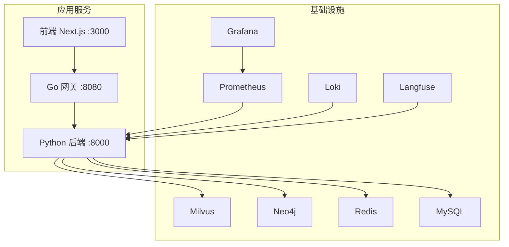
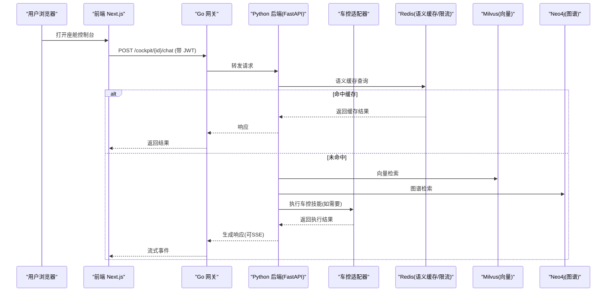
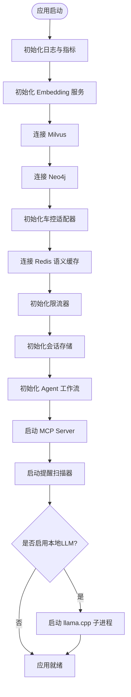
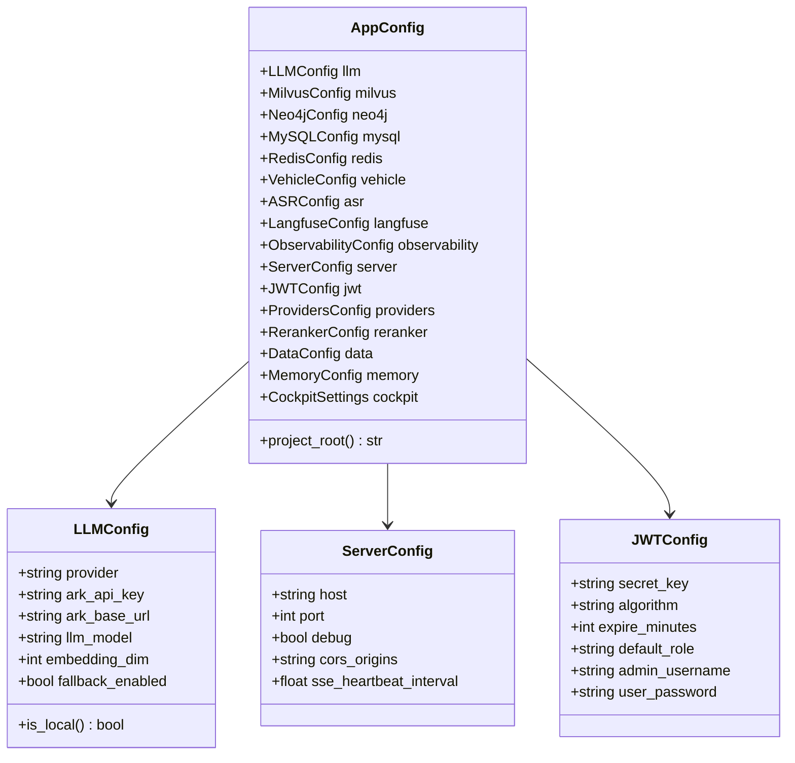
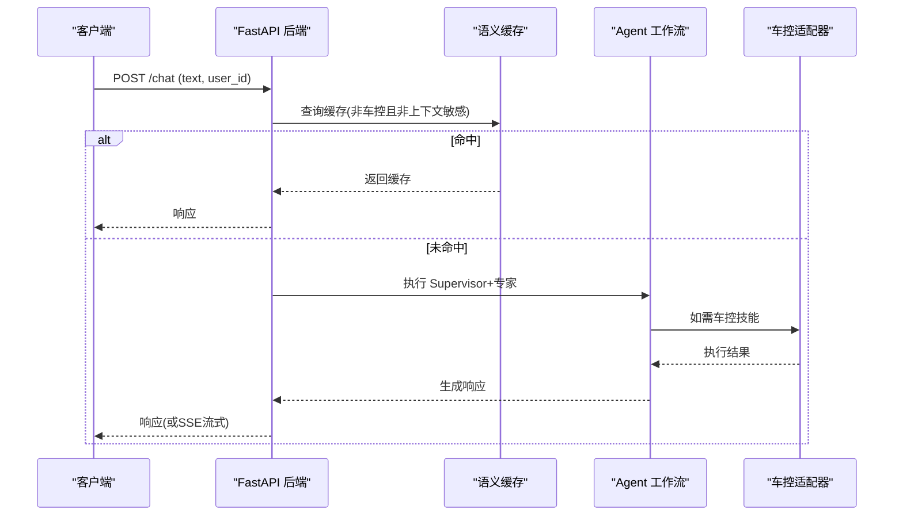
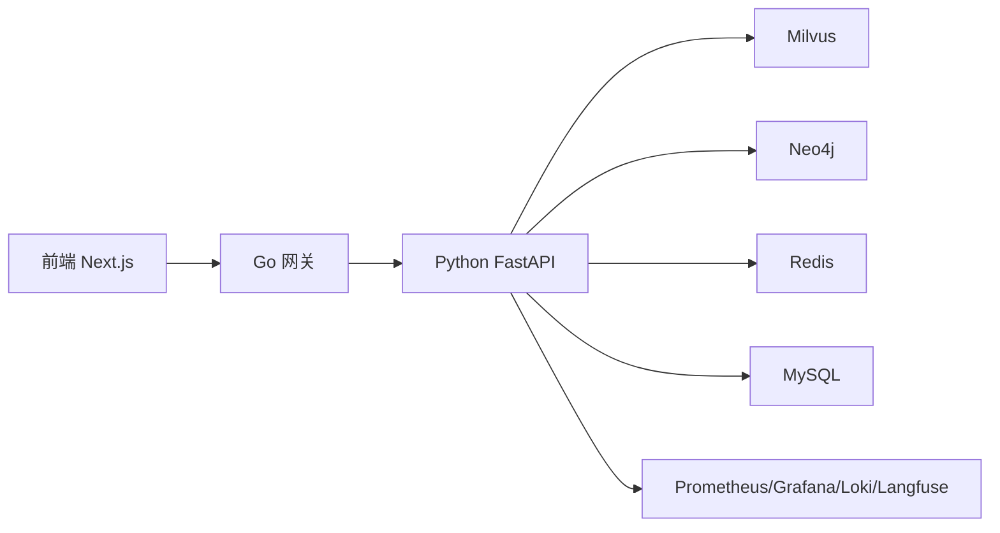

# 快速开始

<cite>
**本文引用的文件**
- [README.md](file://README.md)
- [docker-compose.yml](file://docker-compose.yml)
- [docker-compose.dev.yml](file://docker-compose.dev.yml)
- [Makefile](file://Makefile)
- [backend_design/pyproject.toml](file://backend_design/pyproject.toml)
- [frontend_design/package.json](file://frontend_design/package.json)
- [backend_design/nexus/main.py](file://backend_design/nexus/main.py)
- [backend_design/nexus/config/__init__.py](file://backend_design/nexus/config/__init__.py)
- [backend_design/nexus/config/_common.py](file://backend_design/nexus/config/_common.py)
- [backend_design/nexus/config/llm.py](file://backend_design/nexus/config/llm.py)
- [backend_design/nexus/config/server.py](file://backend_design/nexus/config/server.py)
- [backend_design/nexus/api/routes/chat.py](file://backend_design/nexus/api/routes/chat.py)
- [backend_design/nexus/api/routes/vehicle.py](file://backend_design/nexus/api/routes/vehicle.py)
- [scripts/start-all.ps1](file://scripts/start-all.ps1)
</cite>

## 目录
1. [简介](#简介)
2. [项目结构](#项目结构)
3. [核心组件](#核心组件)
4. [架构总览](#架构总览)
5. [详细组件分析](#详细组件分析)
6. [依赖关系分析](#依赖关系分析)
7. [性能与稳定性建议](#性能与稳定性建议)
8. [故障排查指南](#故障排查指南)
9. [结论](#结论)
10. [附录：15分钟上手清单](#附录15分钟上手清单)

## 简介
本快速开始指南面向首次接触 NexusCockpit 的用户，目标是帮助你在 15 分钟内完成环境搭建、服务启动与验证，并掌握常用 API（文本对话、SSE 流式输出、车控命令、WebSocket 连接）的使用方法。系统采用 Docker 编排基础设施，Python FastAPI 后端、Go 网关与 Next.js 前端协同工作，支持本地模型与云端 LLM 降级。

## 项目结构
NexusCockpit 采用分层与模块化组织：
- 基础设施层：Docker Compose 编排 Milvus、Neo4j、Redis、MySQL、Prometheus、Grafana、Loki、Langfuse 等中间件
- 应用层：Python FastAPI 后端（AI Agent、RAG、ASR/TTS、车控适配）、Go 并发网关（鉴权、限流、WS Hub）、Next.js 前端
- 配置中心：按子系统拆分的环境变量与 Pydantic Settings 管理
- 脚本与工具：一键启动、日志收集、初始化脚本

```mermaid
graph TB
subgraph "基础设施"
M["Milvus"]
N["Neo4j"]
R["Redis"]
DB["MySQL"]
P["Prometheus"]
G["Grafana"]
L["Loki"]
LF["Langfuse"]
end
subgraph "应用服务"
FE["前端 Next.js :3000"]
GW["Go 网关 :8080"]
AI["Python 后端 :8000"]
end
FE --> GW
GW --> AI
AI --> M
AI --> N
AI --> R
AI --> DB
P --> AI
G --> P
L --> AI
LF --> AI
```

图表来源
- [docker-compose.yml](file://docker-compose.yml)
- [docker-compose.dev.yml](file://docker-compose.dev.yml)

章节来源
- [README.md](file://README.md)
- [docker-compose.yml](file://docker-compose.yml)
- [docker-compose.dev.yml](file://docker-compose.dev.yml)

## 核心组件
- 后端入口与生命周期：FastAPI 应用创建、中间件注册、组件初始化（Embedding、向量库、图数据库、车控适配器、语义缓存、限流、会话存储、Agent 工作流、MCP Server、提醒扫描器、llama.cpp 子进程）
- 配置中心：统一 AppConfig 聚合各子系统配置，自动加载 .env.local 或 .env，路径解析与环境覆盖
- API 路由：聊天 REST/SSE、车控命令、认证、中间件状态、设置中心等
- 网关：JWT 鉴权、限流、WebSocket Hub、反向代理到 Python 后端
- 前端：Next.js 开发模式，访问座舱控制台、聊天页、数据中台等

章节来源
- [backend_design/nexus/main.py](file://backend_design/nexus/main.py)
- [backend_design/nexus/config/__init__.py](file://backend_design/nexus/config/__init__.py)
- [backend_design/nexus/config/_common.py](file://backend_design/nexus/config/_common.py)
- [backend_design/nexus/config/llm.py](file://backend_design/nexus/config/llm.py)
- [backend_design/nexus/config/server.py](file://backend_design/nexus/config/server.py)
- [backend_design/nexus/api/routes/chat.py](file://backend_design/nexus/api/routes/chat.py)
- [backend_design/nexus/api/routes/vehicle.py](file://backend_design/nexus/api/routes/vehicle.py)

## 架构总览
下图展示了请求从前端到网关再到后端的调用链，以及关键中间件的交互。

```mermaid
sequenceDiagram
participant U as "用户浏览器"
participant FE as "前端 Next.js"
participant GW as "Go 网关"
participant AI as "Python 后端(FastAPI)"
participant VC as "车控适配器"
participant RS as "Redis(语义缓存/限流)"
participant VS as "Milvus(向量)"
participant GS as "Neo4j(图谱)"
U->>FE : 打开座舱控制台
FE->>GW : POST /cockpit/{id}/chat (带 JWT)
GW->>AI : 转发请求
AI->>RS : 语义缓存查询
alt 命中缓存
RS-->>AI : 返回缓存结果
AI-->>GW : 响应
GW-->>FE : 返回结果
else 未命中
AI->>VS : 向量检索
AI->>GS : 图谱检索
AI->>VC : 执行车控技能(如需要)
VC-->>AI : 返回执行结果
AI-->>GW : 生成响应(可SSE)
GW-->>FE : 流式事件
end
```

图表来源
- [backend_design/nexus/main.py](file://backend_design/nexus/main.py)
- [backend_design/nexus/api/routes/chat.py](file://backend_design/nexus/api/routes/chat.py)
- [backend_design/nexus/api/routes/vehicle.py](file://backend_design/nexus/api/routes/vehicle.py)
- [docker-compose.yml](file://docker-compose.yml)

## 详细组件分析

### 后端启动与初始化流程
- 应用启动时通过 lifespan 钩子依次初始化：
  - 日志与指标
  - Embedding 服务
  - 向量库(Milvus)、图数据库(Neo4j)
  - 车控适配器(Mock/HTTP/MCP)
  - Redis 语义缓存与限流
  - 会话历史存储(Redis/内存降级)
  - Langfuse 追踪
  - Agent 工作流(Supervisor + 专家 Agent)
  - MCP Server、提醒扫描器
  - llama.cpp 子进程（可选）
- 异常处理：全局异常处理器统一错误格式，区分限流、认证、校验失败等

```mermaid
flowchart TD
Start(["应用启动"]) --> InitLog["初始化日志与指标"]
InitLog --> InitEmbed["初始化 Embedding 服务"]
InitEmbed --> InitVector["连接 Milvus"]
InitVector --> InitGraph["连接 Neo4j"]
InitGraph --> InitVehicle["初始化车控适配器"]
InitVehicle --> InitCache["连接 Redis 语义缓存"]
InitCache --> InitRate["初始化限流器"]
InitRate --> InitSession["初始化会话存储"]
InitSession --> InitAgent["初始化 Agent 工作流"]
InitAgent --> InitMCP["启动 MCP Server"]
InitMCP --> InitReminder["启动提醒扫描器"]
InitReminder --> InitLLama{"是否启用本地LLM?"}
InitLLama --> |是| StartLLama["启动 llama.cpp 子进程"]
InitLLama --> |否| Ready["应用就绪"]
StartLLama --> Ready
```

图表来源
- [backend_design/nexus/main.py](file://backend_design/nexus/main.py)

章节来源
- [backend_design/nexus/main.py](file://backend_design/nexus/main.py)

### 配置中心与环境变量
- 配置聚合：AppConfig 聚合 LLM、数据库、缓存、车控、语音、可观测性、服务器与认证、第三方服务、部署模式、数据与记忆、多座舱等
- 环境变量加载策略：优先 .env.local，不存在则 .env；dotenv 覆盖加载确保敏感信息不被默认值覆盖
- LLM 配置：支持 cloud/local 切换，本地模式自动指向 llama-server 兼容接口
- 服务器与认证：监听地址/端口、CORS、JWT 密钥与过期时间、RBAC 默认角色与账号

```mermaid
classDiagram
class AppConfig {
+LLMConfig llm
+MilvusConfig milvus
+Neo4jConfig neo4j
+MySQLConfig mysql
+RedisConfig redis
+VehicleConfig vehicle
+ASRConfig asr
+LangfuseConfig langfuse
+ObservabilityConfig observability
+ServerConfig server
+JWTConfig jwt
+ProvidersConfig providers
+RerankerConfig reranker
+DataConfig data
+MemoryConfig memory
+CockpitSettings cockpit
+project_root() str
}
class LLMConfig {
+string provider
+string ark_api_key
+string ark_base_url
+string llm_model
+int embedding_dim
+bool fallback_enabled
+is_local() bool
}
class ServerConfig {
+string host
+int port
+bool debug
+string cors_origins
+float sse_heartbeat_interval
}
class JWTConfig {
+string secret_key
+string algorithm
+int expire_minutes
+string default_role
+string admin_username
+string user_password
}
AppConfig --> LLMConfig
AppConfig --> ServerConfig
AppConfig --> JWTConfig
```

图表来源
- [backend_design/nexus/config/__init__.py](file://backend_design/nexus/config/__init__.py)
- [backend_design/nexus/config/llm.py](file://backend_design/nexus/config/llm.py)
- [backend_design/nexus/config/server.py](file://backend_design/nexus/config/server.py)
- [backend_design/nexus/config/_common.py](file://backend_design/nexus/config/_common.py)

章节来源
- [backend_design/nexus/config/__init__.py](file://backend_design/nexus/config/__init__.py)
- [backend_design/nexus/config/_common.py](file://backend_design/nexus/config/_common.py)
- [backend_design/nexus/config/llm.py](file://backend_design/nexus/config/llm.py)
- [backend_design/nexus/config/server.py](file://backend_design/nexus/config/server.py)

### 聊天与车控 API
- 聊天接口：REST 非流式与 SSE 流式两种模式，支持语义缓存、上下文敏感跳过缓存、会话历史持久化
- 车控接口：直接执行命令与获取状态，支持多座舱隔离（X-Cockpit-Id），GPS 坐标更新与 IP 降级定位

```mermaid
sequenceDiagram
participant C as "客户端"
participant A as "FastAPI 后端"
participant SC as "语义缓存"
participant AG as "Agent 工作流"
participant VA as "车控适配器"
C->>A : POST /chat (text, user_id)
A->>SC : 查询缓存(非车控且非上下文敏感)
alt 命中
SC-->>A : 返回缓存
A-->>C : 响应
else 未命中
A->>AG : 执行 Supervisor+专家
AG->>VA : 如需车控技能
VA-->>AG : 执行结果
AG-->>A : 生成响应
A-->>C : 响应(或SSE流式)
end
```

图表来源
- [backend_design/nexus/api/routes/chat.py](file://backend_design/nexus/api/routes/chat.py)
- [backend_design/nexus/api/routes/vehicle.py](file://backend_design/nexus/api/routes/vehicle.py)

章节来源
- [backend_design/nexus/api/routes/chat.py](file://backend_design/nexus/api/routes/chat.py)
- [backend_design/nexus/api/routes/vehicle.py](file://backend_design/nexus/api/routes/vehicle.py)

### 前端与网关
- 前端：Next.js 开发模式，端口 3000，通过环境变量配置后端 API 地址
- 网关：Go 实现，端口 8080，负责 JWT 鉴权、限流、WebSocket Hub、反向代理到 Python 后端

章节来源
- [frontend_design/package.json](file://frontend_design/package.json)
- [docker-compose.yml](file://docker-compose.yml)

## 依赖关系分析
- 后端依赖：FastAPI、Uvicorn、WebSockets、Starlette、LangChain/LangGraph、Pymilvus、Neo4j、Redis、aiomysql、Pydantic、FunASR/CosyVoice、Prometheus/Langfuse 等
- 前端依赖：Next.js、React、Zustand、Axios、Tailwind、Three.js 等
- 基础设施：Milvus、Neo4j、Redis、MySQL、Prometheus、Grafana、Loki、Langfuse

```mermaid
graph LR
FE["前端 Next.js"] --> GW["Go 网关"]
GW --> AI["Python FastAPI"]
AI --> VDB["Milvus"]
AI --> GDB["Neo4j"]
AI --> Cache["Redis"]
AI --> SQL["MySQL"]
AI --> Mon["Prometheus/Grafana/Loki/Langfuse"]
```

图表来源
- [backend_design/pyproject.toml](file://backend_design/pyproject.toml)
- [frontend_design/package.json](file://frontend_design/package.json)
- [docker-compose.yml](file://docker-compose.yml)

章节来源
- [backend_design/pyproject.toml](file://backend_design/pyproject.toml)
- [frontend_design/package.json](file://frontend_design/package.json)
- [docker-compose.yml](file://docker-compose.yml)

## 性能与稳定性建议
- 语义缓存：对非车控、非上下文敏感的查询开启缓存，降低 LLM 调用与检索开销
- SSE 心跳：合理设置心跳间隔，避免代理/防火墙超时断连
- 限流：基于 Redis 滑动窗口限流，保护后端资源
- 异步任务：AI 生成任务池与 SSE 解耦，页面切换不中断生成
- 监控：Prometheus 指标采集与 Grafana 看板，关注 API 延迟、Agent 耗时、缓存命中率

[本节为通用指导，无需特定文件引用]

## 故障排查指南
- 健康检查：
  - 后端：http://localhost:8000/health
  - 网关：http://localhost:8080/health
- 常见问题：
  - 网关与后端 JWT 密钥不一致导致 401：确保 Go 网关与 Python 后端使用相同 JWT_SECRET_KEY
  - Milvus/Neo4j 连接失败：检查 docker-compose 服务状态与端口映射
  - Redis 密码与端口：确认 .env 中的 REDIS_PASSWORD 与端口映射（宿主机 16379→容器 6379）
  - 模型下载失败：确保磁盘空间充足，按 README 指引下载 ASR/TTS/声纹模型
  - CORS 跨域问题：调整 ServerConfig.cors_origins 允许前端域名
- 日志位置：
  - 后端：logs/backend_logs/*.log
  - 网关：logs/go_logs/*.log
  - 前端：logs/frontend_logs/*.log

章节来源
- [README.md](file://README.md)
- [docker-compose.yml](file://docker-compose.yml)
- [scripts/start-all.ps1](file://scripts/start-all.ps1)

## 结论
通过本指南，你已了解 NexusCockpit 的整体架构、核心组件与快速上手步骤。建议在熟悉基础流程后，进一步阅读架构文档与 API 协议，结合监控与日志进行深度调试与优化。

[本节为总结，无需特定文件引用]

## 附录：15分钟上手清单
- 环境准备
  - 安装 Docker、Docker Compose、Python 3.10+、Go 1.21+、Node.js 18+
  - 克隆仓库并进入项目根目录
- 启动基础设施
  - 运行 docker compose up -d，等待所有中间件健康
- 安装后端环境
  - 创建虚拟环境并安装依赖（或使用 Makefile install）
- 下载 AI 模型
  - 使用 modelscope 下载 SenseVoice、CAM++、CosyVoice 模型至 models 目录
- 配置环境变量
  - 复制 .env.example 为 .env，填写 ARK_API_KEY、LLM_MODEL、EMBEDDING_MODEL 等
- 启动服务
  - 启动后端：uvicorn nexus.main:app --host 0.0.0.0 --port 8000
  - 启动网关：go run cmd/main.go（确保 JWT_SECRET_KEY 一致）
  - 启动前端：npm run dev
- 验证与访问
  - 健康检查：/health
  - API 文档：http://localhost:8000/docs
  - 前端界面：http://localhost:3000/cockpit
- API 示例
  - 文本对话：POST /cockpit/{id}/chat
  - SSE 流式：POST /cockpit/{id}/chat/stream
  - 车控命令：POST /cockpit/{id}/vehicle/command
  - WebSocket：ws://localhost:8080/cockpit/{id}/ws/chat
  - 获取 Token：POST /auth/token

章节来源
- [README.md](file://README.md)
- [docker-compose.yml](file://docker-compose.yml)
- [Makefile](file://Makefile)
- [scripts/start-all.ps1](file://scripts/start-all.ps1)