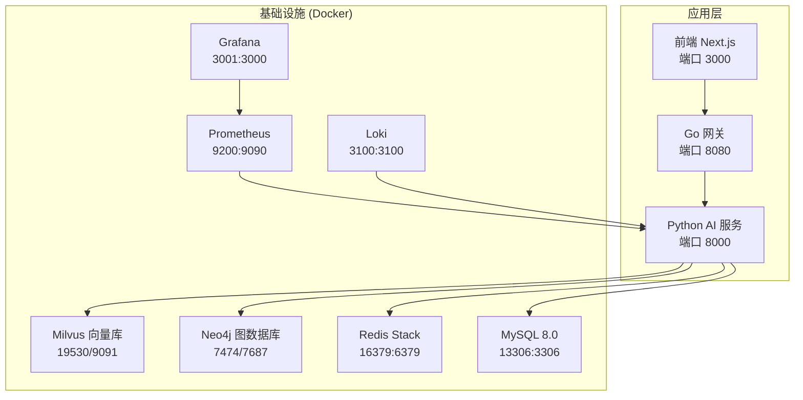
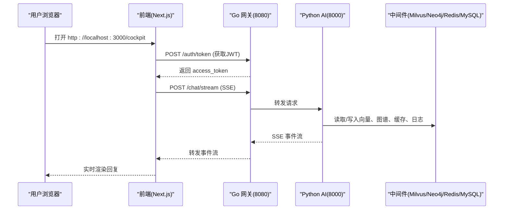
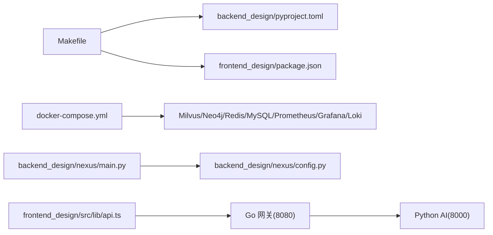

# 快速开始指南

<cite>
**本文引用的文件**   
- [README.md](file://README.md)
- [docker-compose.yml](file://docker-compose.yml)
- [Makefile](file://Makefile)
- [backend_design/pyproject.toml](file://backend_design/pyproject.toml)
- [frontend_design/package.json](file://frontend_design/package.json)
- [backend_design/nexus/main.py](file://backend_design/nexus/main.py)
- [backend_design/nexus/config.py](file://backend_design/nexus/config.py)
- [backend_design/nexus/api/routes/health.py](file://backend_design/nexus/api/routes/health.py)
- [docs/deployment/SETUP.md](file://docs/deployment/SETUP.md)
- [frontend_design/src/lib/api.ts](file://frontend_design/src/lib/api.ts)
</cite>

## 目录
1. [简介](#简介)
2. [项目结构](#项目结构)
3. [核心组件](#核心组件)
4. [架构总览](#架构总览)
5. [详细组件分析](#详细组件分析)
6. [依赖关系分析](#依赖关系分析)
7. [性能与资源建议](#性能与资源建议)
8. [故障排查指南](#故障排查指南)
9. [结论](#结论)
10. [附录：一键启动清单与验证步骤](#附录一键启动清单与验证步骤)

## 简介
本指南面向首次接触 NexusCockpit 的开发者，目标是在 30 分钟内完成环境准备、基础设施拉起、后端与前端运行，并通过 API 和前端界面验证语音对话、车控、监控等核心能力。系统采用“Go 网关 + Python AI 服务 + Next.js 前端”的分层架构，支持本地 Docker 与云端托管的双模式部署。

## 项目结构
- 根目录包含前后端代码、Docker Compose 编排、Makefile 工程化命令、文档与模型数据目录。
- 后端位于 backend_design（Python FastAPI + Go 网关），前端位于 frontend_design（Next.js）。
- 中间件通过 docker-compose.yml 统一编排（Milvus、Neo4j、Redis、MySQL、Prometheus、Grafana、Loki 等）。

图表来源
- [docker-compose.yml:1-246](file://docker-compose.yml#L1-L246)
- [frontend_design/package.json:1-45](file://frontend_design/package.json#L1-L45)
- [backend_design/nexus/main.py:294-452](file://backend_design/nexus/main.py#L294-L452)

章节来源
- [README.md:95-143](file://README.md#L95-L143)
- [docker-compose.yml:1-246](file://docker-compose.yml#L1-L246)

## 核心组件
- 后端服务（FastAPI）：提供 REST/SSE/WebSocket 接口，集成 Multi-Agent、GraphRAG、语义缓存、限流、可观测性等能力。
- Go 网关：负责鉴权、限流、WebSocket Hub、反向代理到后端。
- 前端（Next.js）：座舱控制台、聊天、车控、数据中台、设置中心、中间件监控等页面。
- 基础设施：向量库、图数据库、缓存、关系型数据库、日志与指标采集。

章节来源
- [backend_design/nexus/main.py:294-452](file://backend_design/nexus/main.py#L294-L452)
- [frontend_design/src/lib/api.ts:1-120](file://frontend_design/src/lib/api.ts#L1-L120)
- [docker-compose.yml:1-246](file://docker-compose.yml#L1-L246)

## 架构总览
NexusCockpit 采用分层架构：
- L0 基础设施：Docker Compose 编排 Milvus、Neo4j、Redis、MySQL、Prometheus、Grafana、Loki。
- L1 核心层：配置中心、日志、异常、熔断器。
- L2 数据层：GraphRAG（向量+图谱+全文检索融合）、记忆管理。
- L3 服务层：ASR/TTS、技能、车控、意图路由、MCP。
- L4 Agent 层：Supervisor + 5 Expert Agents + Responder + Reviewer。
- L5 中间件层：语义缓存、限流、会话存储、异步任务。
- L6 API 层：FastAPI REST/SSE/WebSocket + JWT。
- L7 可观测层：Langfuse、Prometheus、Grafana。

图表来源
- [frontend_design/src/lib/api.ts:240-340](file://frontend_design/src/lib/api.ts#L240-L340)
- [backend_design/nexus/main.py:318-340](file://backend_design/nexus/main.py#L318-L340)
- [docker-compose.yml:1-246](file://docker-compose.yml#L1-L246)

## 详细组件分析

### 后端服务（FastAPI）
- 入口与生命周期：在应用启动时初始化 Embedding、向量/图谱存储、车控适配器、语义缓存、限流、会话存储、Langfuse、Agent 工作流、MySQL 管理器、数据保留策略等；关闭时清理资源。
- 路由注册：健康检查、认证、对话、车控、管理、座舱、数据中台、中间件状态、设置、ASR、WebSocket 等。
- 全局异常处理：限流 429、认证 401、其他错误 500。
- Prometheus 指标挂载：/metrics。

章节来源
- [backend_design/nexus/main.py:61-292](file://backend_design/nexus/main.py#L61-L292)
- [backend_design/nexus/main.py:294-452](file://backend_design/nexus/main.py#L294-L452)
- [backend_design/nexus/api/routes/health.py:22-98](file://backend_design/nexus/api/routes/health.py#L22-L98)

### 配置中心（Pydantic Settings）
- 自动加载 .env.local/.env.prod/.env，路径解析基于项目根目录。
- 子配置：LLM、Milvus、Neo4j、Redis、MySQL、JWT、车控、ASR/TTS、Langfuse、可观测性、服务器、Providers（双模式开关）、Reranker、Cockpit 设置等。
- 生产安全警告：默认弱密钥或开放 CORS 时输出告警。

章节来源
- [backend_design/nexus/config.py:31-95](file://backend_design/nexus/config.py#L31-L95)
- [backend_design/nexus/config.py:97-158](file://backend_design/nexus/config.py#L97-L158)
- [backend_design/nexus/config.py:167-247](file://backend_design/nexus/config.py#L167-L247)
- [backend_design/nexus/config.py:253-330](file://backend_design/nexus/config.py#L253-L330)
- [backend_design/nexus/config.py:332-393](file://backend_design/nexus/config.py#L332-L393)
- [backend_design/nexus/config.py:395-414](file://backend_design/nexus/config.py#L395-L414)
- [backend_design/nexus/config.py:416-433](file://backend_design/nexus/config.py#L416-L433)
- [backend_design/nexus/config.py:458-489](file://backend_design/nexus/config.py#L458-L489)
- [backend_design/nexus/config.py:491-504](file://backend_design/nexus/config.py#L491-L504)
- [backend_design/nexus/config.py:506-551](file://backend_design/nexus/config.py#L506-L551)
- [backend_design/nexus/config.py:557-581](file://backend_design/nexus/config.py#L557-L581)
- [backend_design/nexus/config.py:583-599](file://backend_design/nexus/config.py#L583-L599)
- [backend_design/nexus/config.py:601-674](file://backend_design/nexus/config.py#L601-L674)

### 前端（Next.js）
- 环境变量：NEXT_PUBLIC_API_URL 指向网关地址（默认 8080）。
- 自动 Token 管理：开发环境自动调用 /auth/token 获取并缓存，过期自动刷新。
- 流式对话：原生 fetch + ReadableStream 实现 SSE 事件流。
- 统一 API 客户端：axios 实例 + 拦截器附加 Authorization 与 X-Cockpit-Id。

章节来源
- [frontend_design/package.json:1-45](file://frontend_design/package.json#L1-L45)
- [frontend_design/src/lib/api.ts:40-120](file://frontend_design/src/lib/api.ts#L40-L120)
- [frontend_design/src/lib/api.ts:240-340](file://frontend_design/src/lib/api.ts#L240-L340)

### 基础设施（Docker Compose）
- 应用服务（profiles: app）：nexus_gate（Go 网关）、nexus_ai（Python AI）、nexus_frontend（Next.js）。
- 基础设施服务：etcd、minio、milvus、neo4j、redis、mysql、loki、prometheus、grafana。
- 健康检查与依赖：各服务具备 healthcheck，按依赖顺序启动。

章节来源
- [docker-compose.yml:1-246](file://docker-compose.yml#L1-L246)

## 依赖关系分析
- 后端依赖：FastAPI、LangGraph、Pymilvus、Neo4j、Redis、Pydantic、OpenAI SDK、FunASR、CosyVoice、Langfuse、Prometheus 等。
- 前端依赖：Next.js 14、React 18、Zustand、Axios、Tailwind、Three.js 生态等。
- Makefile 提供安装、开发、测试、格式化、Docker 管理等常用命令。

图表来源
- [Makefile:1-139](file://Makefile#L1-L139)
- [backend_design/pyproject.toml:1-86](file://backend_design/pyproject.toml#L1-L86)
- [frontend_design/package.json:1-45](file://frontend_design/package.json#L1-L45)
- [docker-compose.yml:1-246](file://docker-compose.yml#L1-L246)
- [backend_design/nexus/main.py:294-452](file://backend_design/nexus/main.py#L294-L452)
- [backend_design/nexus/config.py:601-674](file://backend_design/nexus/config.py#L601-L674)
- [frontend_design/src/lib/api.ts:1-120](file://frontend_design/src/lib/api.ts#L1-L120)

章节来源
- [backend_design/pyproject.toml:1-86](file://backend_design/pyproject.toml#L1-L86)
- [frontend_design/package.json:1-45](file://frontend_design/package.json#L1-L45)
- [Makefile:1-139](file://Makefile#L1-L139)

## 性能与资源建议
- CPU/内存：最低 4 核/8GB，推荐 8 核+/16GB+。
- 磁盘：至少 20GB，含模型文件建议 50GB+。
- GPU：可选，用于 ASR/TTS 加速；无 GPU 使用 CPU 推理。
- 并发与限流：Go 网关内置 QPS 限流，Redis 滑动窗口限流；合理调整 LLM 并发限制与超时。

[本节为通用指导，不直接分析具体文件]

## 故障排查指南
- 健康检查：访问 /health 查看各组件连接状态。
- 常见错误：
  - Docker 启动失败：检查端口占用与服务状态。
  - Milvus 连接失败：等待容器就绪，查看日志。
  - 模型加载失败：确认 models 目录结构与路径配置。
  - GPU 不可用：检查 CUDA 驱动与 PyTorch 版本。
  - Windows PowerShell 激活失败：修改执行策略后重试。
  - pip 安装超时：切换国内镜像源。

章节来源
- [backend_design/nexus/api/routes/health.py:22-98](file://backend_design/nexus/api/routes/health.py#L22-L98)
- [docs/deployment/SETUP.md:464-528](file://docs/deployment/SETUP.md#L464-L528)

## 结论
通过本指南，你可以在 30 分钟内完成环境准备、基础设施拉起、后端与前端运行，并使用 API 与前端界面验证语音对话、车控、监控等核心功能。系统支持本地与云端双模式部署，便于后续扩展与迁移。

[本节为总结，不直接分析具体文件]

## 附录：一键启动清单与验证步骤

### 环境准备清单
- Python 3.10+
- Go 1.21+
- Node.js 18+
- Docker 24+
- Docker Compose 2.20+
- Git 2.30+

章节来源
- [README.md:146-158](file://README.md#L146-L158)

### 一键启动基础设施
- 拉取并进入项目目录后，执行：
  - docker compose up -d
- 验证所有服务 running：
  - docker compose ps

章节来源
- [README.md:166-178](file://README.md#L166-L178)
- [docker-compose.yml:1-246](file://docker-compose.yml#L1-L246)

### 后端环境安装
- 创建虚拟环境并安装依赖：
  - python -m venv venv
  - source venv/bin/activate（Linux/Mac）或 venv\Scripts\activate（Windows）
  - pip install -r backend_design/requirements.txt
- 或使用 Makefile：
  - make install

章节来源
- [README.md:182-198](file://README.md#L182-L198)
- [Makefile:36-48](file://Makefile#L36-L48)

### 下载 AI 模型
- 安装 ModelScope：
  - pip install modelscope
- 下载 SenseVoice ASR、CAM++ 声纹、CosyVoice TTS 模型到 models 目录：
  - modelscope download --model iic/SenseVoiceSmall --local_dir ./models/asr/sensevoice
  - modelscope download --model iic/speech_campplus_sv_zh-cn_3dspeaker_16k --local_dir ./models/sv/cam_plus
  - modelscope download --model iic/CosyVoice-300M --local_dir ./models/tts/cosyvoice

章节来源
- [README.md:200-216](file://README.md#L200-L216)
- [docs/deployment/SETUP.md:193-236](file://docs/deployment/SETUP.md#L193-L236)

### 环境变量配置
- 复制模板并编辑：
  - cp .env.example .env
- 必填项示例（请替换为你的真实值）：
  - ARK_API_KEY=your_api_key_here
  - ARK_BASE_URL=https://api.siliconflow.cn/v1
  - LLM_MODEL=deepseek-ai/DeepSeek-V3
  - EMBEDDING_MODEL=Qwen/Qwen3-Embedding-4B
  - EMBEDDING_DIM=2560
- 双模式开关（按需改为 cloud）：
  - VECTOR_STORE_PROVIDER=local
  - GRAPH_STORE_PROVIDER=local
  - CACHE_PROVIDER=local
  - RERANKER_PROVIDER=local

章节来源
- [README.md:218-247](file://README.md#L218-L247)
- [backend_design/nexus/config.py:458-489](file://backend_design/nexus/config.py#L458-L489)

### 启动方式

#### 方式一：直接运行
- 后端：
  - cd backend_design
  - uvicorn nexus.main:app --host 0.0.0.0 --port 8000 --reload
- 网关：
  - cd backend_design/nexus_gate
  - go run cmd/main.go
- 前端：
  - cd frontend_design
  - npm install
  - npm run dev

章节来源
- [README.md:249-306](file://README.md#L249-L306)

#### 方式二：Makefile 命令
- 安装与开发：
  - make install
  - make dev
  - make install-frontend
  - make dev-frontend
- 基础设施：
  - make up
  - make down

章节来源
- [Makefile:60-88](file://Makefile#L60-L88)
- [README.md:355-367](file://README.md#L355-L367)

#### 方式三：Docker 容器化部署
- 构建并启动全部服务（含 profiles: app）：
  - docker compose --profile app up -d
- 或通过生产组合文件（如有）：
  - docker compose -f docker-compose.yml -f docker-compose.prod.yml build
  - docker compose -f docker-compose.yml -f docker-compose.prod.yml up -d

章节来源
- [docker-compose.yml:1-246](file://docker-compose.yml#L1-L246)
- [README.md:341-349](file://README.md#L341-L349)

### 验证步骤
- 后端健康检查：
  - curl http://localhost:8000/health
- 网关健康检查：
  - curl http://localhost:8080/health
- 前端访问：
  - http://localhost:3000/cockpit
- API 文档（Swagger）：
  - http://localhost:8000/docs
- Grafana：
  - http://localhost:3001（admin/admin）
- Prometheus：
  - http://localhost:9200

章节来源
- [README.md:260-318](file://README.md#L260-L318)
- [backend_design/nexus/api/routes/health.py:22-98](file://backend_design/nexus/api/routes/health.py#L22-L98)

### API 调用示例
- 文本对话（非流式）：
  - curl -X POST http://localhost:8080/chat \
    -H "Content-Type: application/json" \
    -H "Authorization: Bearer <your_jwt_token>" \
    -d '{"text": "你好", "user_id": "test"}'
- SSE 流式对话：
  - curl -X POST http://localhost:8080/chat/stream \
    -H "Content-Type: application/json" \
    -H "Authorization: Bearer <your_jwt_token>" \
    -d '{"text": "今天天气怎么样", "user_id": "test"}'
- 车控命令：
  - curl -X POST http://localhost:8080/vehicle/command \
    -H "Content-Type: application/json" \
    -H "Authorization: Bearer <your_jwt_token>" \
    -d '{"command": "vehicle_climate", "arguments": {"op": "set_temp", "target_temp": 24}}'
- 获取 JWT Token：
  - curl -X POST http://localhost:8080/auth/token \
    -H "Content-Type: application/json" \
    -d '{"user_id": "user_01", "password": "demo"}'
- WebSocket 连接：
  - const ws = new WebSocket("ws://localhost:8080/ws/chat");
  - ws.send(JSON.stringify({text: "导航到上海虹桥", user_id: "test"}));
  - ws.onmessage = (event) => console.log(JSON.parse(event.data));

章节来源
- [README.md:369-413](file://README.md#L369-L413)
- [frontend_design/src/lib/api.ts:240-340](file://frontend_design/src/lib/api.ts#L240-L340)

### 常见问题排查
- Docker 启动失败：检查端口占用与服务状态。
- Milvus 连接失败：等待容器就绪，查看日志。
- 模型加载失败：确认 models 目录结构与路径配置。
- GPU 不可用：检查 CUDA 驱动与 PyTorch 版本。
- Windows PowerShell 激活失败：修改执行策略后重试。
- pip 安装超时：切换国内镜像源。

章节来源
- [docs/deployment/SETUP.md:464-528](file://docs/deployment/SETUP.md#L464-L528)