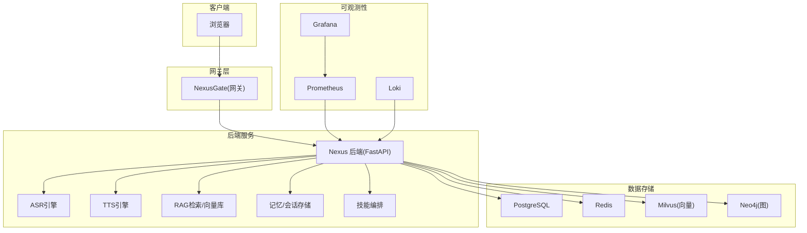
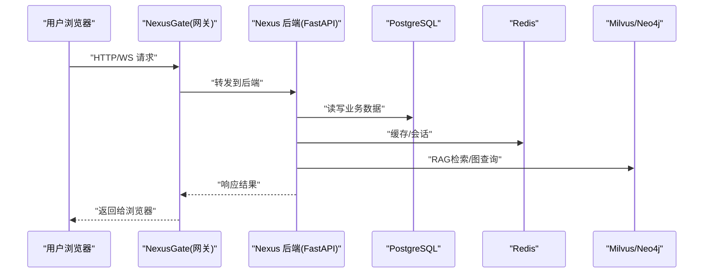
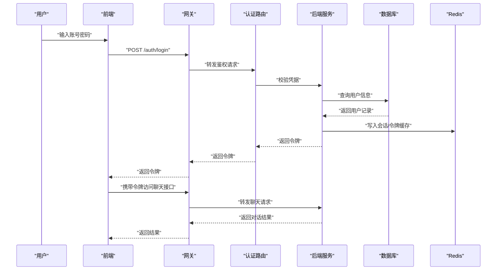
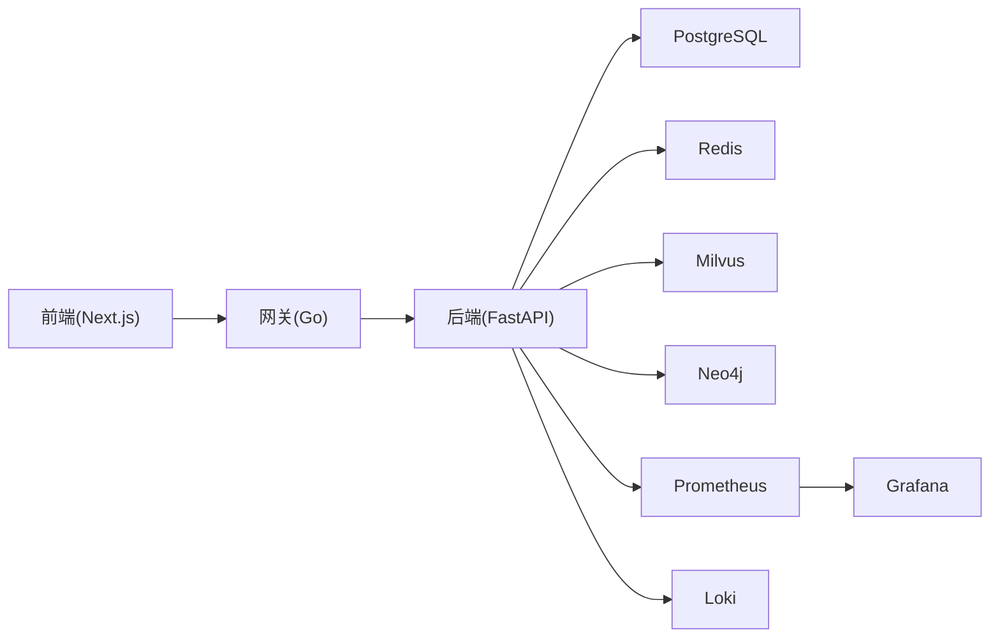

# 快速开始指南

<cite>
**本文引用的文件**   
- [docker-compose.yml](file://docker-compose.yml)
- [README.md](file://README.md)
- [backend_design/nexus/main.py](file://backend_design/nexus/main.py)
- [backend_design/nexus/config.py](file://backend_design/nexus/config.py)
- [backend_design/nexus/core/db_manager.py](file://backend_design/nexus/core/db_manager.py)
- [backend_design/nexus/middleware/redis_cache.py](file://backend_design/nexus/middleware/redis_cache.py)
- [backend_design/nexus/api/routes/auth.py](file://backend_design/nexus/api/routes/auth.py)
- [backend_design/nexus/api/routes/chat.py](file://backend_design/nexus/api/routes/chat.py)
- [backend_design/nexus_gate/cmd/main.go](file://backend_design/nexus_gate/cmd/main.go)
- [backend_design/nexus_gate/internal/proxy/proxy.go](file://backend_design/nexus_gate/internal/proxy/proxy.go)
- [frontend_design/package.json](file://frontend_design/package.json)
- [frontend_design/Dockerfile](file://frontend_design/Dockerfile)
- [config/grafana/provisioning/datasources/prometheus.yml](file://config/grafana/provisioning/datasources/prometheus.yml)
- [config/grafana/provisioning/dashboards/dashboards.yml](file://config/grafana/provisioning/dashboards/dashboards.yml)
</cite>

## 目录
1. [简介](#简介)
2. [项目结构](#项目结构)
3. [核心组件](#核心组件)
4. [架构总览](#架构总览)
5. [详细组件分析](#详细组件分析)
6. [依赖关系分析](#依赖关系分析)
7. [性能与资源建议](#性能与资源建议)
8. [故障排查指南](#故障排查指南)
9. [结论](#结论)
10. [附录](#附录)

## 简介
本指南面向首次接触 NexusCockpit 的用户，目标是帮助你在最短时间内完成环境搭建、一键启动系统并验证核心功能。你将了解：
- 开发环境与依赖要求
- 使用 Docker Compose 一键拉起后端服务、网关、前端应用、数据库、缓存与可观测性组件
- 基本功能验证步骤（登录、对话、仪表盘等）
- 常见问题与排错方法

## 项目结构
NexusCockpit 采用前后端分离与多语言微服务组合的架构：
- 后端服务：Python FastAPI 应用，提供业务 API、中间件、RAG、记忆、技能编排等能力
- 网关服务：Go 实现的轻量网关，负责鉴权、限流、WebSocket 转发与反向代理
- 前端应用：Next.js 构建的前端页面，提供聊天、车辆控制、数据平台、仪表盘等界面
- 基础设施：PostgreSQL、Redis、Milvus、Neo4j、Prometheus/Grafana/Loki 等
- 配置与脚本：容器编排、初始化脚本、监控仪表板定义等

图表来源
- [docker-compose.yml](file://docker-compose.yml)
- [backend_design/nexus/main.py](file://backend_design/nexus/main.py)
- [backend_design/nexus_gate/cmd/main.go](file://backend_design/nexus_gate/cmd/main.go)
- [frontend_design/package.json](file://frontend_design/package.json)

章节来源
- [docker-compose.yml](file://docker-compose.yml)
- [README.md](file://README.md)

## 核心组件
- 后端服务（FastAPI）
  - 入口与路由注册、中间件加载、健康检查、日志与指标暴露
  - 关键模块：认证、聊天、设置、车辆、数据平台、中间件（速率限制、缓存、会话、任务队列）、RAG、记忆、技能编排、语音识别/合成
- 网关服务（Go）
  - 鉴权、限流、WebSocket Hub、反向代理到后端
- 前端应用（Next.js）
  - 页面路由、状态管理、API 调用、语音交互、车辆面板
- 基础设施
  - PostgreSQL（持久化）、Redis（缓存/会话）、Milvus（向量检索）、Neo4j（知识图谱）
  - Prometheus/Grafana/Loki（监控与日志）

章节来源
- [backend_design/nexus/main.py](file://backend_design/nexus/main.py)
- [backend_design/nexus/config.py](file://backend_design/nexus/config.py)
- [backend_design/nexus/core/db_manager.py](file://backend_design/nexus/core/db_manager.py)
- [backend_design/nexus/middleware/redis_cache.py](file://backend_design/nexus/middleware/redis_cache.py)
- [backend_design/nexus/api/routes/auth.py](file://backend_design/nexus/api/routes/auth.py)
- [backend_design/nexus/api/routes/chat.py](file://backend_design/nexus/api/routes/chat.py)
- [backend_design/nexus_gate/cmd/main.go](file://backend_design/nexus_gate/cmd/main.go)
- [backend_design/nexus_gate/internal/proxy/proxy.go](file://backend_design/nexus_gate/internal/proxy/proxy.go)
- [frontend_design/package.json](file://frontend_design/package.json)

## 架构总览
下图展示了从浏览器到各服务的请求路径与依赖关系，便于理解整体运行流程。

图表来源
- [backend_design/nexus_gate/cmd/main.go](file://backend_design/nexus_gate/cmd/main.go)
- [backend_design/nexus_gate/internal/proxy/proxy.go](file://backend_design/nexus_gate/internal/proxy/proxy.go)
- [backend_design/nexus/main.py](file://backend_design/nexus/main.py)
- [backend_design/nexus/core/db_manager.py](file://backend_design/nexus/core/db_manager.py)
- [backend_design/nexus/middleware/redis_cache.py](file://backend_design/nexus/middleware/redis_cache.py)

## 详细组件分析

### 环境准备与依赖
- 操作系统与工具
  - 支持 Linux/macOS/Windows（建议使用 WSL2 或原生 Linux）
  - 安装 Docker 与 Docker Compose（v2）
- 硬件建议
  - 最低 4GB 内存；推荐 8GB+ 以同时运行多个服务
- 网络与端口
  - 默认监听端口见 docker-compose 配置（如 80/443/8080/8000 等），请确保未被占用
- 可选本地开发
  - Node.js（用于前端本地调试）
  - Python 3.10+（用于后端本地调试）

章节来源
- [docker-compose.yml](file://docker-compose.yml)
- [frontend_design/package.json](file://frontend_design/package.json)

### 使用 Docker Compose 一键启动
- 克隆仓库后进入根目录
- 执行启动命令（示例）
  - 前台运行：docker compose up
  - 后台运行：docker compose up -d
- 查看服务状态
  - docker compose ps
- 停止与清理
  - docker compose down
  - 如需删除数据卷：docker compose down -v

提示
- 首次启动会拉取镜像，耗时取决于网络
- 若端口冲突，可在 docker-compose.yml 中调整映射端口

章节来源
- [docker-compose.yml](file://docker-compose.yml)

### 配置文件说明
- 后端配置
  - 环境变量与配置项由后端加载，常见包括数据库连接、Redis、向量库、LLM/TTS/ASR 等
  - 参考后端配置入口与数据库/缓存初始化逻辑
- 网关配置
  - 网关通过配置加载上游地址、鉴权策略、限流参数等
- 前端配置
  - 前端通过环境变量指向网关或后端地址
- 可观测性配置
  - Prometheus/Grafana 的数据源与仪表板定义位于 config 目录

章节来源
- [backend_design/nexus/config.py](file://backend_design/nexus/config.py)
- [backend_design/nexus/core/db_manager.py](file://backend_design/nexus/core/db_manager.py)
- [backend_design/nexus/middleware/redis_cache.py](file://backend_design/nexus/middleware/redis_cache.py)
- [backend_design/nexus_gate/cmd/main.go](file://backend_design/nexus_gate/cmd/main.go)
- [config/grafana/provisioning/datasources/prometheus.yml](file://config/grafana/provisioning/datasources/prometheus.yml)
- [config/grafana/provisioning/dashboards/dashboards.yml](file://config/grafana/provisioning/dashboards/dashboards.yml)

### 基本功能验证
- 访问前端
  - 打开浏览器访问 http://localhost:80（或你配置的端口）
- 登录与鉴权
  - 在登录页输入用户名/密码进行登录
  - 网关将校验令牌并放行至后端
- 发起对话
  - 进入“聊天”页面，发送消息，观察回复与历史
- 仪表盘与车辆
  - 查看仪表盘概览与车辆控制面板（如有可用设备或模拟数据）
- 可观测性
  - 访问 Grafana 查看系统指标与日志

章节来源
- [backend_design/nexus/api/routes/auth.py](file://backend_design/nexus/api/routes/auth.py)
- [backend_design/nexus/api/routes/chat.py](file://backend_design/nexus/api/routes/chat.py)
- [backend_design/nexus_gate/cmd/main.go](file://backend_design/nexus_gate/cmd/main.go)
- [config/grafana/provisioning/datasources/prometheus.yml](file://config/grafana/provisioning/datasources/prometheus.yml)
- [config/grafana/provisioning/dashboards/dashboards.yml](file://config/grafana/provisioning/dashboards/dashboards.yml)

### 关键流程时序（登录与对话）

图表来源
- [backend_design/nexus/api/routes/auth.py](file://backend_design/nexus/api/routes/auth.py)
- [backend_design/nexus/api/routes/chat.py](file://backend_design/nexus/api/routes/chat.py)
- [backend_design/nexus_gate/cmd/main.go](file://backend_design/nexus_gate/cmd/main.go)
- [backend_design/nexus/core/db_manager.py](file://backend_design/nexus/core/db_manager.py)
- [backend_design/nexus/middleware/redis_cache.py](file://backend_design/nexus/middleware/redis_cache.py)

## 依赖关系分析
- 服务间依赖
  - 网关依赖后端服务、Redis（会话/限流）
  - 后端依赖数据库、Redis、向量库/图数据库、语音与 RAG 组件
- 外部依赖
  - 第三方 LLM/TTS/ASR 服务（可按需启用）
- 可观测性
  - 后端暴露指标供 Prometheus 抓取，Grafana 展示仪表板，Loki 收集日志

图表来源
- [docker-compose.yml](file://docker-compose.yml)
- [backend_design/nexus/main.py](file://backend_design/nexus/main.py)
- [backend_design/nexus_gate/cmd/main.go](file://backend_design/nexus_gate/cmd/main.go)
- [frontend_design/package.json](file://frontend_design/package.json)

章节来源
- [docker-compose.yml](file://docker-compose.yml)
- [backend_design/nexus/main.py](file://backend_design/nexus/main.py)
- [backend_design/nexus_gate/cmd/main.go](file://backend_design/nexus_gate/cmd/main.go)
- [frontend_design/package.json](file://frontend_design/package.json)

## 性能与资源建议
- 内存与 CPU
  - 建议至少 8GB 内存，CPU 4 核以上以获得更流畅体验
- 磁盘空间
  - 为模型与数据预留足够空间（尤其是向量库与知识库）
- 网络
  - 确保对外部 LLM/TTS/ASR 的网络可达
- 并发与限流
  - 根据实际负载调整网关限流与后端线程池参数

[本节为通用指导，不直接分析具体文件]

## 故障排查指南
- 服务无法启动
  - 检查端口是否被占用，必要时修改 docker-compose.yml 中的端口映射
  - 查看容器日志：docker compose logs <服务名>
- 数据库/缓存连接失败
  - 确认数据库与 Redis 服务已就绪且网络互通
  - 检查后端配置的环境变量是否正确
- 鉴权失败
  - 确认网关与后端时间同步、密钥一致
  - 检查用户是否存在、密码是否正确
- 对话无响应
  - 检查后端日志与指标，确认 RAG/向量库/图数据库连通性
  - 确认外部语音/大模型服务可用
- 前端无法访问
  - 确认网关与后端服务正常
  - 检查浏览器控制台错误与跨域配置

章节来源
- [backend_design/nexus/core/db_manager.py](file://backend_design/nexus/core/db_manager.py)
- [backend_design/nexus/middleware/redis_cache.py](file://backend_design/nexus/middleware/redis_cache.py)
- [backend_design/nexus/api/routes/auth.py](file://backend_design/nexus/api/routes/auth.py)
- [backend_design/nexus/api/routes/chat.py](file://backend_design/nexus/api/routes/chat.py)
- [backend_design/nexus_gate/cmd/main.go](file://backend_design/nexus_gate/cmd/main.go)

## 结论
通过以上步骤，你可以在本地快速搭建并运行 NexusCockpit 全栈系统，完成登录、对话、仪表盘等核心功能的体验。后续可根据需求扩展模型、接入真实车辆设备、定制技能与 RAG 知识库，并结合可观测性体系进行运维与优化。

## 附录
- 常用命令
  - 启动：docker compose up -d
  - 停止：docker compose down
  - 查看日志：docker compose logs -f <服务名>
  - 重建镜像：docker compose build --no-cache
- 相关文档
  - 部署与验证文档位于 docs/deployment 目录
  - 架构文档位于 docs/architecture 目录

章节来源
- [docker-compose.yml](file://docker-compose.yml)
- [README.md](file://README.md)