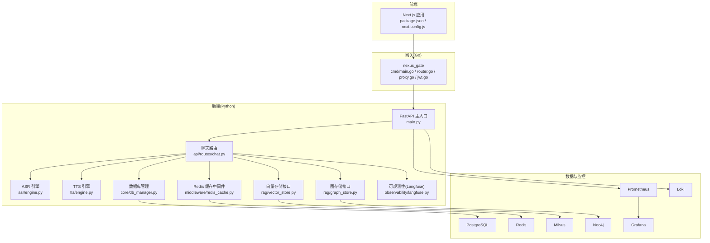
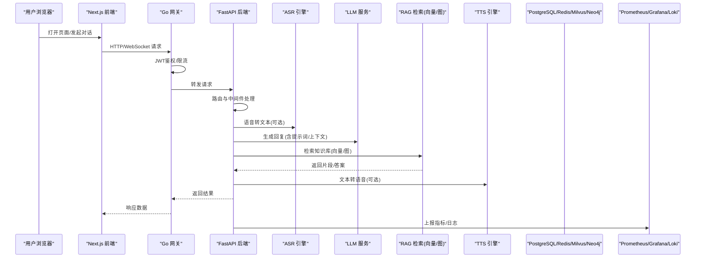
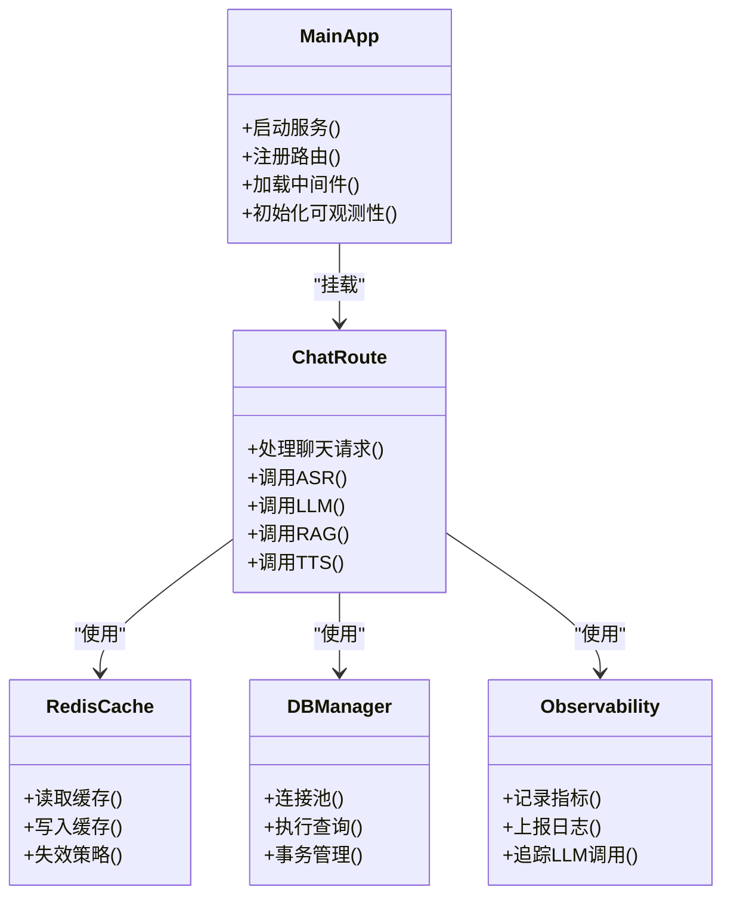
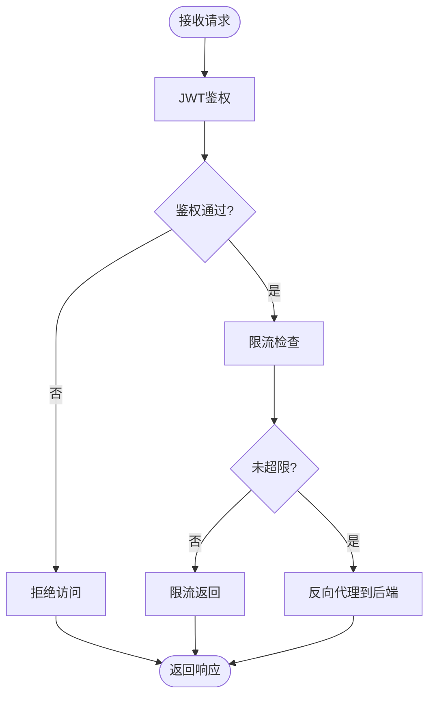
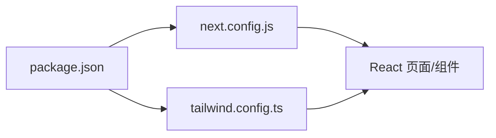
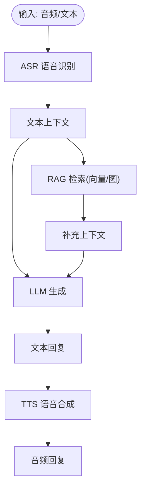
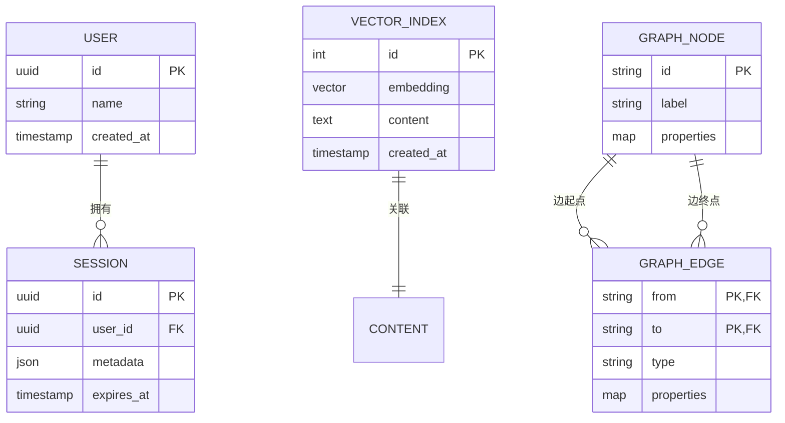
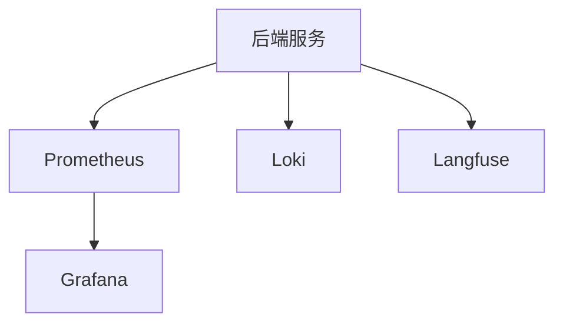
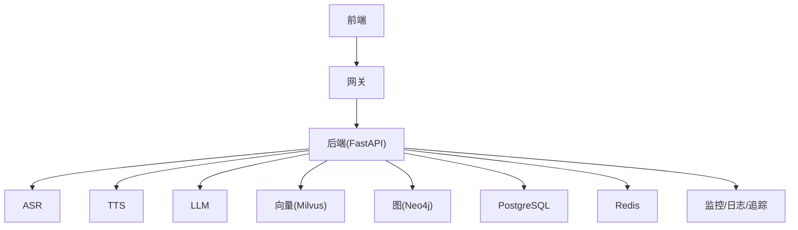

# 技术栈

<cite>
**本文引用的文件**   
- [backend_design/nexus/main.py](file://backend_design/nexus/main.py)
- [backend_design/nexus/config.py](file://backend_design/nexus/config.py)
- [backend_design/nexus/api/routes/chat.py](file://backend_design/nexus/api/routes/chat.py)
- [backend_design/nexus/asr/engine.py](file://backend_design/nexus/asr/engine.py)
- [backend_design/nexus/tts/engine.py](file://backend_design/nexus/tts/engine.py)
- [backend_design/nexus/rag/vector_store.py](file://backend_design/nexus/rag/vector_store.py)
- [backend_design/nexus/rag/graph_store.py](file://backend_design/nexus/rag/graph_store.py)
- [backend_design/nexus/middleware/redis_cache.py](file://backend_design/nexus/middleware/redis_cache.py)
- [backend_design/nexus/core/db_manager.py](file://backend_design/nexus/core/db_manager.py)
- [backend_design/nexus/observability/langfuse.py](file://backend_design/nexus/observability/langfuse.py)
- [backend_design/nexus_gate/cmd/main.go](file://backend_design/nexus_gate/cmd/main.go)
- [backend_design/nexus_gate/internal/router/router.go](file://backend_design/nexus_gate/internal/router/router.go)
- [backend_design/nexus_gate/internal/auth/jwt.go](file://backend_design/nexus_gate/internal/auth/jwt.go)
- [backend_design/nexus_gate/internal/proxy/proxy.go](file://backend_design/nexus_gate/internal/proxy/proxy.go)
- [frontend_design/package.json](file://frontend_design/package.json)
- [frontend_design/next.config.js](file://frontend_design/next.config.js)
- [frontend_design/tailwind.config.ts](file://frontend_design/tailwind.config.ts)
- [config/prometheus/prometheus.yml](file://config/prometheus/prometheus.yml)
- [config/grafana/provisioning/datasources/prometheus.yml](file://config/grafana/provisioning/datasources/prometheus.yml)
- [docker-compose.yml](file://docker-compose.yml)
</cite>

## 目录
1. [简介](#简介)
2. [项目结构](#项目结构)
3. [核心组件](#核心组件)
4. [架构总览](#架构总览)
5. [详细组件分析](#详细组件分析)
6. [依赖关系分析](#依赖关系分析)
7. [性能考量](#性能考量)
8. [故障排查指南](#故障排查指南)
9. [结论](#结论)
10. [附录](#附录)

## 简介
本技术栈文档面向NexusCockpit智能座舱系统，系统性梳理后端Python（FastAPI、LangChain、PyTorch等）、前端Next.js生态（React、TailwindCSS等）以及Go语言网关的技术选型与集成方式。同时覆盖AI相关能力（ASR语音识别、TTS语音合成、LLM大语言模型）、数据存储方案（PostgreSQL、Redis、Milvus、Neo4j）与可观测性工具链（Prometheus、Grafana、Loki），并给出各组件的版本兼容性与选择理由说明。

## 项目结构
仓库采用前后端分离与多服务组织：
- 后端服务：Python FastAPI应用，包含API路由、Agent编排、ASR/TTS引擎、RAG检索、中间件与可观测性等模块。
- 网关服务：Go实现的轻量网关，负责鉴权、限流、反向代理与WebSocket转发。
- 前端应用：基于Next.js的Web界面，使用React与TailwindCSS构建。
- 配置与部署：Prometheus/Grafana/Loki配置文件与Docker Compose编排。

图表来源
- [backend_design/nexus/main.py](file://backend_design/nexus/main.py)
- [backend_design/nexus/api/routes/chat.py](file://backend_design/nexus/api/routes/chat.py)
- [backend_design/nexus/asr/engine.py](file://backend_design/nexus/asr/engine.py)
- [backend_design/nexus/tts/engine.py](file://backend_design/nexus/tts/engine.py)
- [backend_design/nexus/rag/vector_store.py](file://backend_design/nexus/rag/vector_store.py)
- [backend_design/nexus/rag/graph_store.py](file://backend_design/nexus/rag/graph_store.py)
- [backend_design/nexus/middleware/redis_cache.py](file://backend_design/nexus/middleware/redis_cache.py)
- [backend_design/nexus/core/db_manager.py](file://backend_design/nexus/core/db_manager.py)
- [backend_design/nexus/observability/langfuse.py](file://backend_design/nexus/observability/langfuse.py)
- [backend_design/nexus_gate/cmd/main.go](file://backend_design/nexus_gate/cmd/main.go)
- [backend_design/nexus_gate/internal/router/router.go](file://backend_design/nexus_gate/internal/router/router.go)
- [backend_design/nexus_gate/internal/proxy/proxy.go](file://backend_design/nexus_gate/internal/proxy/proxy.go)
- [backend_design/nexus_gate/internal/auth/jwt.go](file://backend_design/nexus_gate/internal/auth/jwt.go)
- [config/prometheus/prometheus.yml](file://config/prometheus/prometheus.yml)
- [config/grafana/provisioning/datasources/prometheus.yml](file://config/grafana/provisioning/datasources/prometheus.yml)
- [docker-compose.yml](file://docker-compose.yml)

章节来源
- [backend_design/nexus/main.py](file://backend_design/nexus/main.py)
- [backend_design/nexus_gate/cmd/main.go](file://backend_design/nexus_gate/cmd/main.go)
- [frontend_design/package.json](file://frontend_design/package.json)
- [frontend_design/next.config.js](file://frontend_design/next.config.js)
- [config/prometheus/prometheus.yml](file://config/prometheus/prometheus.yml)
- [config/grafana/provisioning/datasources/prometheus.yml](file://config/grafana/provisioning/datasources/prometheus.yml)
- [docker-compose.yml](file://docker-compose.yml)

## 核心组件
- 后端框架与运行时
  - Python + FastAPI：提供异步HTTP/WebSocket接口，承载聊天、车辆控制、设置、健康检查等路由。
  - LangChain：用于提示词工程、意图路由与记忆管理等AI编排能力。
  - PyTorch：作为本地推理或向量化模型的底层计算框架（如嵌入、重排序）。
- 网关服务
  - Go：高性能反向代理、鉴权（JWT）、限流、WebSocket Hub转发。
- 前端生态
  - Next.js + React：服务端渲染与客户端交互结合，页面级路由与状态管理。
  - TailwindCSS：原子化样式体系，快速构建响应式UI。
- AI能力
  - ASR：语音转文本，支持本地或远程模型。
  - TTS：文本转语音，支持音色与个性化。
  - LLM：通过统一接口接入不同大模型，支持降级与回退策略。
- 检索增强生成（RAG）
  - 向量检索：Milvus作为向量数据库，配合嵌入模型与重排序器。
  - 图检索：Neo4j作为知识图谱存储，支撑结构化关系查询。
- 数据存储
  - PostgreSQL：业务关系型数据持久化。
  - Redis：会话、缓存、速率限制与任务队列。
- 可观测性
  - Prometheus + Grafana：指标采集与可视化。
  - Loki：日志聚合与检索。
  - Langfuse：LLM调用链路追踪与评估。

章节来源
- [backend_design/nexus/main.py](file://backend_design/nexus/main.py)
- [backend_design/nexus/config.py](file://backend_design/nexus/config.py)
- [backend_design/nexus/api/routes/chat.py](file://backend_design/nexus/api/routes/chat.py)
- [backend_design/nexus/asr/engine.py](file://backend_design/nexus/asr/engine.py)
- [backend_design/nexus/tts/engine.py](file://backend_design/nexus/tts/engine.py)
- [backend_design/nexus/rag/vector_store.py](file://backend_design/nexus/rag/vector_store.py)
- [backend_design/nexus/rag/graph_store.py](file://backend_design/nexus/rag/graph_store.py)
- [backend_design/nexus/middleware/redis_cache.py](file://backend_design/nexus/middleware/redis_cache.py)
- [backend_design/nexus/core/db_manager.py](file://backend_design/nexus/core/db_manager.py)
- [backend_design/nexus/observability/langfuse.py](file://backend_design/nexus/observability/langfuse.py)
- [backend_design/nexus_gate/cmd/main.go](file://backend_design/nexus_gate/cmd/main.go)
- [backend_design/nexus_gate/internal/auth/jwt.go](file://backend_design/nexus_gate/internal/auth/jwt.go)
- [backend_design/nexus_gate/internal/proxy/proxy.go](file://backend_design/nexus_gate/internal/proxy/proxy.go)
- [frontend_design/package.json](file://frontend_design/package.json)
- [frontend_design/next.config.js](file://frontend_design/next.config.js)
- [frontend_design/tailwind.config.ts](file://frontend_design/tailwind.config.ts)
- [config/prometheus/prometheus.yml](file://config/prometheus/prometheus.yml)
- [config/grafana/provisioning/datasources/prometheus.yml](file://config/grafana/provisioning/datasources/prometheus.yml)

## 架构总览
整体采用“前端—网关—后端”三层架构，AI能力以模块化形式集成于后端服务中，并通过统一的RAG接口对接向量与图数据库；可观测性贯穿全链路。

图表来源
- [backend_design/nexus/api/routes/chat.py](file://backend_design/nexus/api/routes/chat.py)
- [backend_design/nexus/asr/engine.py](file://backend_design/nexus/asr/engine.py)
- [backend_design/nexus/tts/engine.py](file://backend_design/nexus/tts/engine.py)
- [backend_design/nexus/rag/vector_store.py](file://backend_design/nexus/rag/vector_store.py)
- [backend_design/nexus/rag/graph_store.py](file://backend_design/nexus/rag/graph_store.py)
- [backend_design/nexus_gate/internal/auth/jwt.go](file://backend_design/nexus_gate/internal/auth/jwt.go)
- [backend_design/nexus_gate/internal/proxy/proxy.go](file://backend_design/nexus_gate/internal/proxy/proxy.go)
- [config/prometheus/prometheus.yml](file://config/prometheus/prometheus.yml)
- [config/grafana/provisioning/datasources/prometheus.yml](file://config/grafana/provisioning/datasources/prometheus.yml)

## 详细组件分析

### 后端服务（Python/FastAPI）
- 入口与配置
  - 主入口负责注册路由、挂载中间件、初始化可观测性与外部依赖。
  - 配置中心集中管理环境变量、数据库连接、模型路径与功能开关。
- 路由层
  - 聊天路由封装了ASR→LLM→RAG→TTS的完整流程，并暴露REST/WebSocket接口。
- 中间件
  - Redis缓存：热点数据与会话缓存，降低数据库压力。
  - 限流与熔断：保护后端资源，提升稳定性。
- 数据访问
  - 数据库管理器封装SQLAlchemy/异步驱动，统一事务与连接池。
- 可观测性
  - Langfuse集成用于LLM调用追踪、质量评估与调试。

图表来源
- [backend_design/nexus/main.py](file://backend_design/nexus/main.py)
- [backend_design/nexus/api/routes/chat.py](file://backend_design/nexus/api/routes/chat.py)
- [backend_design/nexus/middleware/redis_cache.py](file://backend_design/nexus/middleware/redis_cache.py)
- [backend_design/nexus/core/db_manager.py](file://backend_design/nexus/core/db_manager.py)
- [backend_design/nexus/observability/langfuse.py](file://backend_design/nexus/observability/langfuse.py)

章节来源
- [backend_design/nexus/main.py](file://backend_design/nexus/main.py)
- [backend_design/nexus/config.py](file://backend_design/nexus/config.py)
- [backend_design/nexus/api/routes/chat.py](file://backend_design/nexus/api/routes/chat.py)
- [backend_design/nexus/middleware/redis_cache.py](file://backend_design/nexus/middleware/redis_cache.py)
- [backend_design/nexus/core/db_manager.py](file://backend_design/nexus/core/db_manager.py)
- [backend_design/nexus/observability/langfuse.py](file://backend_design/nexus/observability/langfuse.py)

### 网关服务（Go）
- 路由与代理
  - 统一入口，按路径将请求转发至后端服务，支持WebSocket长连接。
- 鉴权与限流
  - JWT校验与签名验证，令牌有效期与权限范围控制。
  - 基于Redis的分布式限流，防止滥用与雪崩。
- 错误与重试
  - 统一错误码与重试策略，保障前端体验稳定。

图表来源
- [backend_design/nexus_gate/cmd/main.go](file://backend_design/nexus_gate/cmd/main.go)
- [backend_design/nexus_gate/internal/router/router.go](file://backend_design/nexus_gate/internal/router/router.go)
- [backend_design/nexus_gate/internal/auth/jwt.go](file://backend_design/nexus_gate/internal/auth/jwt.go)
- [backend_design/nexus_gate/internal/proxy/proxy.go](file://backend_design/nexus_gate/internal/proxy/proxy.go)

章节来源
- [backend_design/nexus_gate/cmd/main.go](file://backend_design/nexus_gate/cmd/main.go)
- [backend_design/nexus_gate/internal/router/router.go](file://backend_design/nexus_gate/internal/router/router.go)
- [backend_design/nexus_gate/internal/auth/jwt.go](file://backend_design/nexus_gate/internal/auth/jwt.go)
- [backend_design/nexus_gate/internal/proxy/proxy.go](file://backend_design/nexus_gate/internal/proxy/proxy.go)

### 前端应用（Next.js生态）
- 技术栈
  - Next.js：SSR/CSR混合渲染，页面级路由与静态资源优化。
  - React：组件化开发，状态管理与事件处理。
  - TailwindCSS：原子化样式，主题与响应式布局。
- 关键配置
  - package.json：声明依赖与脚本命令。
  - next.config.js：代理、环境变量与构建选项。
  - tailwind.config.ts：主题、插件与自定义样式扩展。

图表来源
- [frontend_design/package.json](file://frontend_design/package.json)
- [frontend_design/next.config.js](file://frontend_design/next.config.js)
- [frontend_design/tailwind.config.ts](file://frontend_design/tailwind.config.ts)

章节来源
- [frontend_design/package.json](file://frontend_design/package.json)
- [frontend_design/next.config.js](file://frontend_design/next.config.js)
- [frontend_design/tailwind.config.ts](file://frontend_design/tailwind.config.ts)

### AI能力（ASR/TTS/LLM/RAG）
- ASR
  - 音频输入预处理→模型推理→文本输出，支持本地与云端模型切换。
- TTS
  - 文本规范化→声学模型→声码器→音频流输出，支持音色与情感控制。
- LLM
  - 统一接口抽象，支持多种模型提供商与本地推理，具备降级与回退策略。
- RAG
  - 向量检索：Milvus存储高维向量，结合嵌入与重排序提升召回质量。
  - 图检索：Neo4j存储实体与关系，支持复杂查询与推理。

图表来源
- [backend_design/nexus/asr/engine.py](file://backend_design/nexus/asr/engine.py)
- [backend_design/nexus/tts/engine.py](file://backend_design/nexus/tts/engine.py)
- [backend_design/nexus/rag/vector_store.py](file://backend_design/nexus/rag/vector_store.py)
- [backend_design/nexus/rag/graph_store.py](file://backend_design/nexus/rag/graph_store.py)

章节来源
- [backend_design/nexus/asr/engine.py](file://backend_design/nexus/asr/engine.py)
- [backend_design/nexus/tts/engine.py](file://backend_design/nexus/tts/engine.py)
- [backend_design/nexus/rag/vector_store.py](file://backend_design/nexus/rag/vector_store.py)
- [backend_design/nexus/rag/graph_store.py](file://backend_design/nexus/rag/graph_store.py)

### 数据存储与中间件
- PostgreSQL
  - 业务数据持久化，事务与索引优化，迁移脚本维护版本演进。
- Redis
  - 会话存储、热点缓存、分布式锁与限流计数。
- Milvus
  - 向量相似度检索，支持大规模向量索引与高并发查询。
- Neo4j
  - 知识图谱存储，支持复杂关系查询与路径推理。

图表来源
- [backend_design/nexus/core/db_manager.py](file://backend_design/nexus/core/db_manager.py)
- [backend_design/nexus/middleware/redis_cache.py](file://backend_design/nexus/middleware/redis_cache.py)
- [backend_design/nexus/rag/vector_store.py](file://backend_design/nexus/rag/vector_store.py)
- [backend_design/nexus/rag/graph_store.py](file://backend_design/nexus/rag/graph_store.py)

章节来源
- [backend_design/nexus/core/db_manager.py](file://backend_design/nexus/core/db_manager.py)
- [backend_design/nexus/middleware/redis_cache.py](file://backend_design/nexus/middleware/redis_cache.py)
- [backend_design/nexus/rag/vector_store.py](file://backend_design/nexus/rag/vector_store.py)
- [backend_design/nexus/rag/graph_store.py](file://backend_design/nexus/rag/graph_store.py)

### 监控与可观测性
- Prometheus
  - 抓取后端指标，定义采集目标与保留策略。
- Grafana
  - 仪表盘展示系统运行状况与业务KPI。
- Loki
  - 日志聚合与检索，结合标签进行过滤与分析。
- Langfuse
  - LLM调用链路追踪、提示词版本管理与质量评估。

图表来源
- [config/prometheus/prometheus.yml](file://config/prometheus/prometheus.yml)
- [config/grafana/provisioning/datasources/prometheus.yml](file://config/grafana/provisioning/datasources/prometheus.yml)
- [backend_design/nexus/observability/langfuse.py](file://backend_design/nexus/observability/langfuse.py)

章节来源
- [config/prometheus/prometheus.yml](file://config/prometheus/prometheus.yml)
- [config/grafana/provisioning/datasources/prometheus.yml](file://config/grafana/provisioning/datasources/prometheus.yml)
- [backend_design/nexus/observability/langfuse.py](file://backend_design/nexus/observability/langfuse.py)

## 依赖关系分析
- 组件耦合
  - 网关与后端松耦合，通过HTTP/WebSocket通信；后端内部通过接口抽象解耦ASR/TTS/LLM/RAG。
- 外部依赖
  - 数据库与缓存：PostgreSQL、Redis、Milvus、Neo4j。
  - 监控：Prometheus、Grafana、Loki、Langfuse。
- 潜在风险
  - 向量/图检索延迟影响端到端时延，需引入缓存与降级策略。
  - LLM服务不稳定时需启用回退与缓存命中优先。

图表来源
- [backend_design/nexus/main.py](file://backend_design/nexus/main.py)
- [backend_design/nexus_gate/cmd/main.go](file://backend_design/nexus_gate/cmd/main.go)
- [backend_design/nexus/asr/engine.py](file://backend_design/nexus/asr/engine.py)
- [backend_design/nexus/tts/engine.py](file://backend_design/nexus/tts/engine.py)
- [backend_design/nexus/rag/vector_store.py](file://backend_design/nexus/rag/vector_store.py)
- [backend_design/nexus/rag/graph_store.py](file://backend_design/nexus/rag/graph_store.py)
- [backend_design/nexus/core/db_manager.py](file://backend_design/nexus/core/db_manager.py)
- [backend_design/nexus/middleware/redis_cache.py](file://backend_design/nexus/middleware/redis_cache.py)
- [config/prometheus/prometheus.yml](file://config/prometheus/prometheus.yml)

章节来源
- [backend_design/nexus/main.py](file://backend_design/nexus/main.py)
- [backend_design/nexus_gate/cmd/main.go](file://backend_design/nexus_gate/cmd/main.go)
- [backend_design/nexus/asr/engine.py](file://backend_design/nexus/asr/engine.py)
- [backend_design/nexus/tts/engine.py](file://backend_design/nexus/tts/engine.py)
- [backend_design/nexus/rag/vector_store.py](file://backend_design/nexus/rag/vector_store.py)
- [backend_design/nexus/rag/graph_store.py](file://backend_design/nexus/rag/graph_store.py)
- [backend_design/nexus/core/db_manager.py](file://backend_design/nexus/core/db_manager.py)
- [backend_design/nexus/middleware/redis_cache.py](file://backend_design/nexus/middleware/redis_cache.py)
- [config/prometheus/prometheus.yml](file://config/prometheus/prometheus.yml)

## 性能考量
- 缓存策略
  - 热点问答与用户偏好缓存至Redis，减少DB与RAG调用。
- 批处理与流式
  - TTS与LLM输出采用流式传输，降低首字延迟。
- 索引与分片
  - Milvus与Neo4j合理设计索引与分片，提升查询吞吐。
- 限流与熔断
  - 网关层限流与后端熔断保护，避免级联故障。
- 资源隔离
  - 容器化部署，CPU/内存配额与弹性扩缩容。

[本节为通用指导，不直接分析具体文件]

## 故障排查指南
- 常见问题定位
  - 鉴权失败：检查JWT密钥与过期时间。
  - 限流触发：查看Redis计数与阈值配置。
  - 向量检索超时：检查Milvus连接与索引健康。
  - 图查询缓慢：分析Cypher语句与索引。
  - 日志缺失：确认Loki采集与标签完整性。
- 诊断工具
  - Prometheus指标面板与Grafana告警规则。
  - Langfuse链路追踪与提示词版本对比。
  - 日志检索与错误堆栈分析。

章节来源
- [backend_design/nexus_gate/internal/auth/jwt.go](file://backend_design/nexus_gate/internal/auth/jwt.go)
- [backend_design/nexus/middleware/redis_cache.py](file://backend_design/nexus/middleware/redis_cache.py)
- [backend_design/nexus/rag/vector_store.py](file://backend_design/nexus/rag/vector_store.py)
- [backend_design/nexus/rag/graph_store.py](file://backend_design/nexus/rag/graph_store.py)
- [config/prometheus/prometheus.yml](file://config/prometheus/prometheus.yml)
- [config/grafana/provisioning/datasources/prometheus.yml](file://config/grafana/provisioning/datasources/prometheus.yml)
- [backend_design/nexus/observability/langfuse.py](file://backend_design/nexus/observability/langfuse.py)

## 结论
NexusCockpit采用清晰的分层架构与模块化设计，后端以FastAPI为核心，结合LangChain与PyTorch实现AI能力；前端基于Next.js生态提供高效交互；Go网关承担鉴权与代理职责；数据存储与监控工具链完善，满足智能座舱的高可用与可扩展需求。通过合理的缓存、限流与降级策略，系统在复杂场景下仍保持稳定与低延迟。

[本节为总结性内容，不直接分析具体文件]

## 附录
- 版本兼容性与选择理由
  - Python/FastAPI：异步I/O与类型注解友好，适合AI服务与微服务集成。
  - LangChain：丰富的生态与提示词工程支持，便于快速迭代。
  - PyTorch：广泛社区与模型兼容性，利于本地推理与微调。
  - Next.js/React：成熟的SSR/CSR方案，利于SEO与用户体验。
  - TailwindCSS：原子化样式提高开发效率与一致性。
  - Go网关：高性能与低资源占用，适合边缘与网关场景。
  - PostgreSQL：成熟的关系型数据库，事务与扩展性强。
  - Redis：高性能键值存储，适用于缓存与会话。
  - Milvus：专为向量检索优化，支持大规模相似性搜索。
  - Neo4j：图数据库原生优势，适合复杂关系查询。
  - Prometheus/Grafana/Loki：开源可观测性标准组合，易于集成与扩展。
  - Langfuse：专注LLM可观测性，便于质量评估与调试。

[本节为通用说明，不直接分析具体文件]