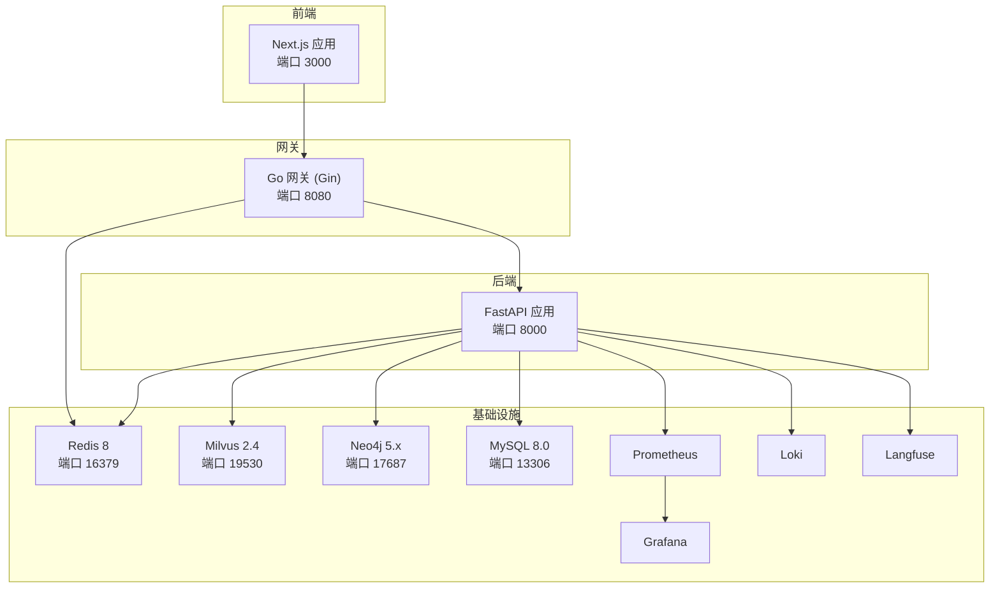
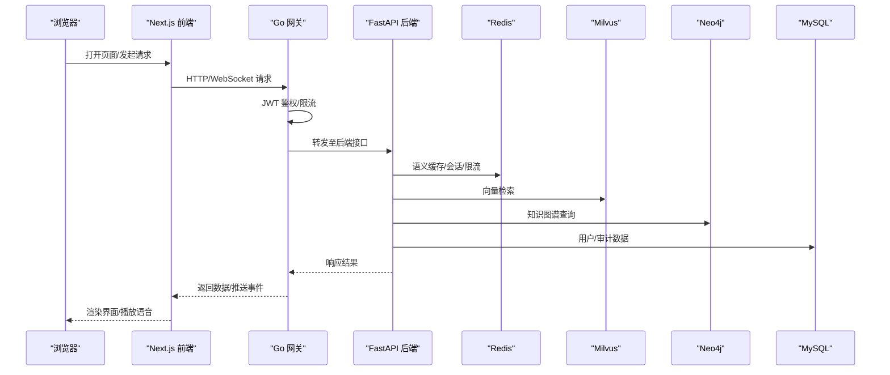
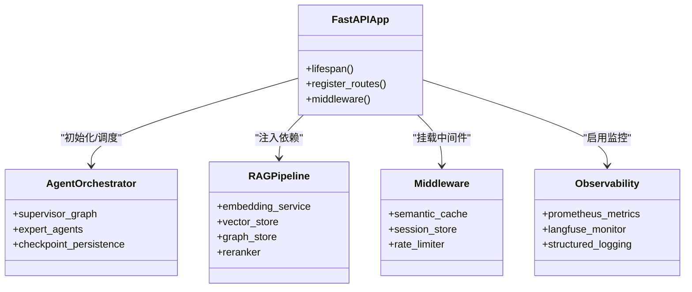
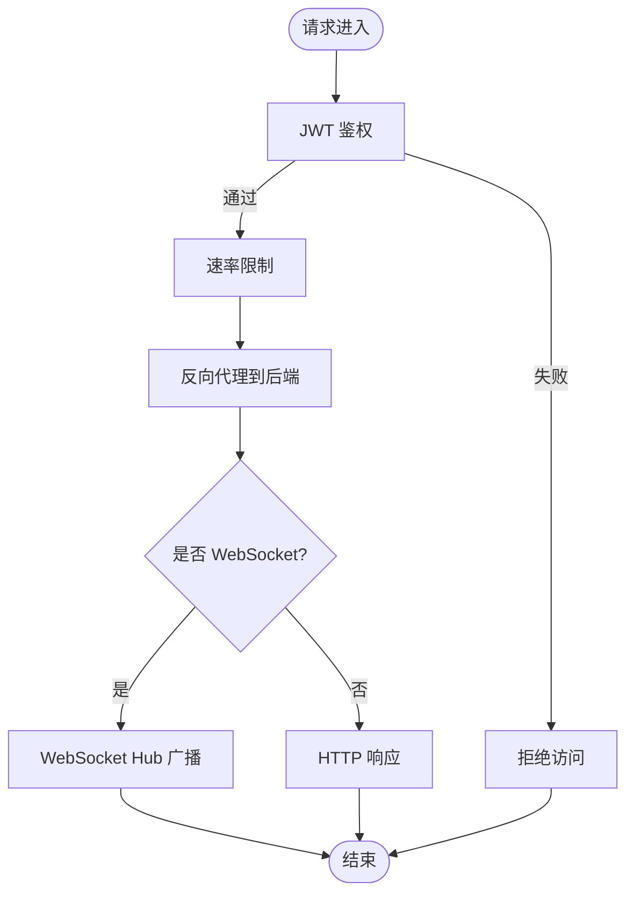
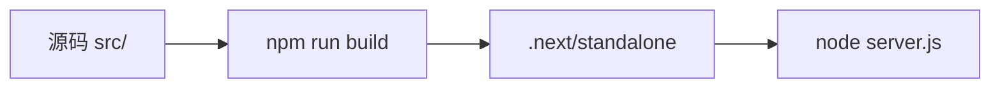
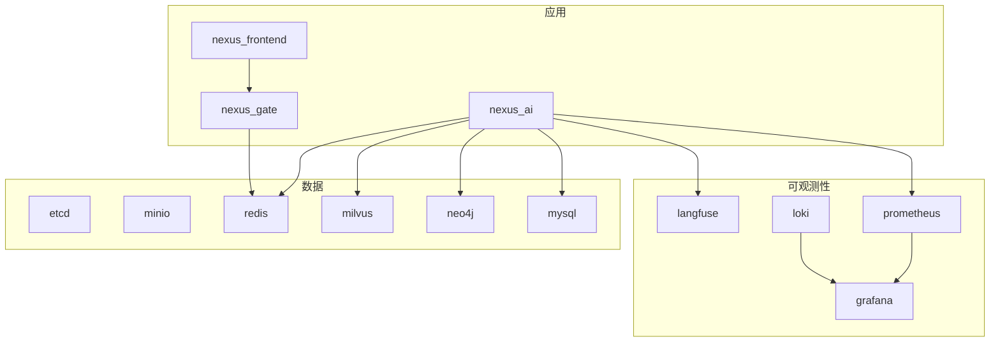
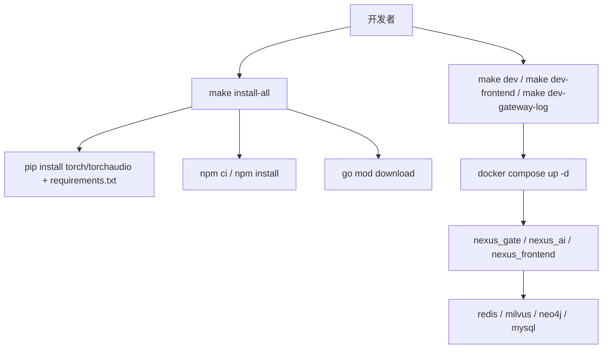

# 技术栈

<cite>
**本文引用的文件**   
- [Makefile](file://Makefile)
- [docker-compose.yml](file://docker-compose.yml)
- [backend_design/pyproject.toml](file://backend_design/pyproject.toml)
- [backend_design/requirements.txt](file://backend_design/requirements.txt)
- [backend_design/Dockerfile](file://backend_design/Dockerfile)
- [frontend_design/package.json](file://frontend_design/package.json)
- [frontend_design/tailwind.config.ts](file://frontend_design/tailwind.config.ts)
- [frontend_design/next.config.js](file://frontend_design/next.config.js)
- [frontend_design/Dockerfile](file://frontend_design/Dockerfile)
- [backend_design/nexus_gate/go.mod](file://backend_design/nexus_gate/go.mod)
- [backend_design/nexus_gate/Dockerfile](file://backend_design/nexus_gate/Dockerfile)
- [.pre-commit-config.yaml](file://.pre-commit-config.yaml)
- [backend_design/nexus/main.py](file://backend_design/nexus/main.py)
</cite>

## 目录
1. [简介](#简介)
2. [项目结构](#项目结构)
3. [核心组件](#核心组件)
4. [架构总览](#架构总览)
5. [详细组件分析](#详细组件分析)
6. [依赖与构建流程](#依赖与构建流程)
7. [性能与可观测性](#性能与可观测性)
8. [故障排查指南](#故障排查指南)
9. [结论](#结论)
10. [附录：环境搭建与最佳实践](#附录环境搭建与最佳实践)

## 简介
本技术栈文档面向 NexusCockpit 开发者，系统梳理后端（Python FastAPI、LangGraph、Pydantic）、前端（Next.js 14、React、Tailwind CSS）与基础设施（Docker、Milvus、Neo4j、Redis、MySQL、Prometheus/Grafana/Loki/Langfuse）的技术选型、版本要求与兼容性。同时覆盖开发工具链（Makefile、pre-commit、linting）、多语言混合架构（Python + Go）的协作模式与通信机制，以及依赖管理、包管理与构建流程的最佳实践，帮助快速完成环境搭建与问题定位。

## 项目结构
NexusCockpit 采用前后端分离与多服务编排：
- 后端 Python（FastAPI）：AI Agent、RAG、车控技能、会话与中间件等
- 网关 Go（Gin）：鉴权、限流、WebSocket、反向代理到后端
- 前端 Next.js：控制台、聊天、座舱控制、数据平台等页面
- 基础设施：Milvus（向量）、Neo4j（图谱）、Redis（缓存/限流/会话）、MySQL（持久化）、Langfuse（LLM 追踪）、Prometheus/Grafana/Loki（指标/日志/可视化）

```mermaid
graph TB
subgraph "前端"
FE["Next.js 应用<br/>端口 3000"]
end
subgraph "网关"
GW["Go 网关 (Gin)<br/>端口 8080"]
end
subgraph "后端"
API["FastAPI 应用<br/>端口 8000"]
end
subgraph "基础设施"
REDIS["Redis 8<br/>端口 16379"]
MILVUS["Milvus 2.4<br/>端口 19530"]
NEO4J["Neo4j 5.x<br/>端口 17687"]
MYSQL["MySQL 8.0<br/>端口 13306"]
PROM["Prometheus"]
GRAF["Grafana"]
LOKI["Loki"]
LF["Langfuse"]
end
FE --> GW
GW --> API
API --> REDIS
API --> MILVUS
API --> NEO4J
API --> MYSQL
GW --> REDIS
API --> PROM
PROM --> GRAF
API --> LOKI
API --> LF
```

图表来源
- [docker-compose.yml:1-292](file://docker-compose.yml#L1-L292)
- [backend_design/Dockerfile:1-58](file://backend_design/Dockerfile#L1-L58)
- [frontend_design/Dockerfile:1-32](file://frontend_design/Dockerfile#L1-L32)
- [backend_design/nexus_gate/Dockerfile:1-22](file://backend_design/nexus_gate/Dockerfile#L1-L22)

章节来源
- [docker-compose.yml:1-292](file://docker-compose.yml#L1-L292)
- [Makefile:1-173](file://Makefile#L1-L173)

## 核心组件
- 后端（Python）
  - Web 框架：FastAPI + Uvicorn（异步 I/O、WebSockets）
  - Agent 编排：LangGraph StateGraph（工作流与检查点持久化）
  - 配置与校验：Pydantic v2（Settings、模型校验）
  - RAG：pymilvus（向量检索）、neo4j（图检索）、sentence-transformers（本地 Embedding/Rerank）
  - 中间件：Redis（语义缓存、会话存储、限流）、aiomysql（异步 MySQL）
  - 可观测性：Langfuse（LLM 追踪）、Prometheus（指标）、structlog（结构化日志）
- 网关（Go）
  - Gin 路由、JWT 鉴权、WebSocket Hub、Prometheus 客户端、Redis 客户端
- 前端（Next.js）
  - React 18、TypeScript、Tailwind CSS、Zustand、Axios、Three.js 生态
- 基础设施
  - Milvus 2.4、Neo4j 5.x、Redis 8、MySQL 8.0、Langfuse、Prometheus/Grafana/Loki

章节来源
- [backend_design/pyproject.toml:10-100](file://backend_design/pyproject.toml#L10-L100)
- [backend_design/requirements.txt:11-105](file://backend_design/requirements.txt#L11-L105)
- [backend_design/nexus_gate/go.mod:1-44](file://backend_design/nexus_gate/go.mod#L1-L44)
- [frontend_design/package.json:1-43](file://frontend_design/package.json#L1-L43)

## 架构总览
NexusCockpit 采用“前端 → Go 网关 → Python 后端 → 基础设施”的分层架构。网关承担鉴权、限流、WebSocket 转发与统一入口；后端承载 AI Agent、RAG、车控技能与业务逻辑；基础设施提供向量、图谱、缓存、关系型数据库与可观测性能力。

```mermaid
sequenceDiagram
participant C as "浏览器"
participant FE as "Next.js 前端"
participant GW as "Go 网关"
participant API as "FastAPI 后端"
participant REDIS as "Redis"
participant MILVUS as "Milvus"
participant NEO4J as "Neo4j"
participant MYSQL as "MySQL"
C->>FE : 打开页面/发起请求
FE->>GW : HTTP/WebSocket 请求
GW->>GW : JWT 鉴权/限流
GW->>API : 转发至后端接口
API->>REDIS : 语义缓存/会话/限流
API->>MILVUS : 向量检索
API->>NEO4J : 知识图谱查询
API->>MYSQL : 用户/审计数据
API-->>GW : 响应结果
GW-->>FE : 返回数据/推送事件
FE-->>C : 渲染界面/播放语音
```

图表来源
- [docker-compose.yml:15-89](file://docker-compose.yml#L15-L89)
- [backend_design/nexus/main.py:75-200](file://backend_design/nexus/main.py#L75-L200)

## 详细组件分析

### 后端（Python FastAPI + LangGraph + Pydantic）
- 启动与生命周期
  - FastAPI 应用通过 lifespan 初始化日志、指标、Embedding、向量/图谱存储、车控适配器、语义缓存、会话存储、限流器、Langfuse 监控与 Agent 工作流
  - 关键入口文件负责注册路由、中间件与异常处理
- Agent 与 RAG
  - 使用 LangGraph StateGraph 编排 Supervisor + 专家 Agent 的多智能体流程
  - RAG 链路：文本切分 → Embedding（本地 bge-m3）→ Milvus 向量检索 → Neo4j 图谱召回 → Reranker → 生成
- 配置与校验
  - Pydantic Settings 集中管理环境变量与默认值，确保强类型校验
- 中间件
  - Redis 语义缓存（基于 Embedding 相似度命中）、会话历史持久化、分布式限流
- 可观测性
  - Prometheus 指标暴露、Langfuse LLM 调用追踪、结构化日志

```mermaid
classDiagram
class FastAPIApp {
+lifespan()
+register_routes()
+middleware()
}
class AgentOrchestrator {
+supervisor_graph
+expert_agents
+checkpoint_persistence
}
class RAGPipeline {
+embedding_service
+vector_store
+graph_store
+reranker
}
class Middleware {
+semantic_cache
+session_store
+rate_limiter
}
class Observability {
+prometheus_metrics
+langfuse_monitor
+structured_logging
}
FastAPIApp --> AgentOrchestrator : "初始化/调度"
FastAPIApp --> RAGPipeline : "注入依赖"
FastAPIApp --> Middleware : "挂载中间件"
FastAPIApp --> Observability : "启用监控"
```

图表来源
- [backend_design/nexus/main.py:75-200](file://backend_design/nexus/main.py#L75-L200)
- [backend_design/pyproject.toml:18-50](file://backend_design/pyproject.toml#L18-L50)

章节来源
- [backend_design/nexus/main.py:1-200](file://backend_design/nexus/main.py#L1-L200)
- [backend_design/pyproject.toml:10-100](file://backend_design/pyproject.toml#L10-L100)
- [backend_design/requirements.txt:11-105](file://backend_design/requirements.txt#L11-L105)

### 网关（Go Gin）
- 职责：统一入口、JWT 鉴权、速率限制、WebSocket Hub、反向代理到 Python 后端、Prometheus 指标导出
- 依赖：Gin、JWT、WebSocket、Prometheus Client、Redis Client
- 构建：CGO_ENABLED=0 静态编译，最小镜像运行

```mermaid
flowchart TD
Start(["请求进入"]) --> Auth["JWT 鉴权"]
Auth --> |通过| RateLimit["速率限制"]
Auth --> |失败| Deny["拒绝访问"]
RateLimit --> Proxy["反向代理到后端"]
Proxy --> WS{"是否 WebSocket?"}
WS --> |是| Hub["WebSocket Hub 广播"]
WS --> |否| Resp["HTTP 响应"]
Hub --> End(["结束"])
Resp --> End
Deny --> End
```

图表来源
- [backend_design/nexus_gate/go.mod:1-44](file://backend_design/nexus_gate/go.mod#L1-L44)
- [backend_design/nexus_gate/Dockerfile:1-22](file://backend_design/nexus_gate/Dockerfile#L1-L22)

章节来源
- [backend_design/nexus_gate/go.mod:1-44](file://backend_design/nexus_gate/go.mod#L1-L44)
- [backend_design/nexus_gate/Dockerfile:1-22](file://backend_design/nexus_gate/Dockerfile#L1-L22)

### 前端（Next.js 14 + React + Tailwind CSS）
- 特性：SSR/独立部署（standalone）、TypeScript、Tailwind 主题扩展、状态管理（Zustand）、图表（Recharts）、3D（Three.js）
- 构建：多阶段 Docker 构建，输出 standalone 产物减小镜像体积
- 样式：Tailwind 自定义颜色、圆角、动画 keyframes

```mermaid
graph LR
SRC["源码 src/"] --> BUILD["npm run build"]
BUILD --> STANDALONE[".next/standalone"]
STANDALONE --> RUNTIME["node server.js"]
```

图表来源
- [frontend_design/package.json:1-43](file://frontend_design/package.json#L1-L43)
- [frontend_design/next.config.js:1-80](file://frontend_design/next.config.js#L1-L80)
- [frontend_design/tailwind.config.ts:1-55](file://frontend_design/tailwind.config.ts#L1-L55)
- [frontend_design/Dockerfile:1-32](file://frontend_design/Dockerfile#L1-L32)

章节来源
- [frontend_design/package.json:1-43](file://frontend_design/package.json#L1-L43)
- [frontend_design/next.config.js:1-80](file://frontend_design/next.config.js#L1-L80)
- [frontend_design/tailwind.config.ts:1-55](file://frontend_design/tailwind.config.ts#L1-L55)
- [frontend_design/Dockerfile:1-32](file://frontend_design/Dockerfile#L1-L32)

### 基础设施（Docker 编排）
- 应用服务：nexus_gate（Go 网关）、nexus_ai（Python 后端）、nexus_frontend（Next.js）
- 数据与缓存：etcd、minio、milvus、neo4j、redis、mysql
- 可观测性：langfuse、loki、prometheus、grafana
- 健康检查与依赖：各服务通过 healthcheck 与 depends_on 保证启动顺序

```mermaid
graph TB
subgraph "应用"
A1["nexus_gate"]
A2["nexus_ai"]
A3["nexus_frontend"]
end
subgraph "数据"
D1["etcd"]
D2["minio"]
D3["milvus"]
D4["neo4j"]
D5["redis"]
D6["mysql"]
end
subgraph "可观测性"
O1["langfuse"]
O2["loki"]
O3["prometheus"]
O4["grafana"]
end
A1 --> D5
A2 --> D5
A2 --> D3
A2 --> D4
A2 --> D6
A3 --> A1
O3 --> O4
O2 --> O4
A2 --> O1
A2 --> O3
```

图表来源
- [docker-compose.yml:1-292](file://docker-compose.yml#L1-L292)

章节来源
- [docker-compose.yml:1-292](file://docker-compose.yml#L1-L292)

## 依赖与构建流程
- 后端（Python）
  - 依赖管理：pyproject.toml 与 requirements.txt 双轨声明，严格锁定关键库版本
  - 构建镜像：多阶段构建，CPU-only PyTorch 显著减小镜像体积
  - 启动命令：uvicorn 运行 FastAPI 应用
- 网关（Go）
  - 依赖管理：go.mod 固定版本，静态编译 CGO_ENABLED=0
  - 构建镜像：builder 编译二进制，runner 仅含运行时依赖
- 前端（Next.js）
  - 依赖管理：package.json + package-lock.json
  - 构建镜像：builder 安装依赖并构建，runner 仅包含 .next/standalone 产物
- Makefile 统一入口
  - 安装：install（后端）、install-gpu（GPU PyTorch）、install-frontend、install-gateway、install-all
  - 开发：dev、dev-frontend、dev-all、带日志捕获的 dev-log 系列
  - 质量：lint（ruff/go vet）、format、check（lint + mypy + pytest + go build）
  - 测试：test、test-cov
  - 清理：clean
  - 数据库初始化：init-db（Milvus/Neo4j）

```mermaid
flowchart TD
Dev["开发者"] --> Make["make install-all"]
Make --> Backend["pip install torch/torchaudio + requirements.txt"]
Make --> Frontend["npm ci / npm install"]
Make --> Gateway["go mod download"]
Dev --> Run["make dev / make dev-frontend / make dev-gateway-log"]
Run --> Infra["docker compose up -d"]
Infra --> Services["nexus_gate / nexus_ai / nexus_frontend"]
Services --> DBs["redis / milvus / neo4j / mysql"]
```

图表来源
- [Makefile:1-173](file://Makefile#L1-L173)
- [backend_design/Dockerfile:1-58](file://backend_design/Dockerfile#L1-L58)
- [backend_design/nexus_gate/Dockerfile:1-22](file://backend_design/nexus_gate/Dockerfile#L1-L22)
- [frontend_design/Dockerfile:1-32](file://frontend_design/Dockerfile#L1-L32)

章节来源
- [Makefile:1-173](file://Makefile#L1-L173)
- [backend_design/pyproject.toml:1-135](file://backend_design/pyproject.toml#L1-L135)
- [backend_design/requirements.txt:1-105](file://backend_design/requirements.txt#L1-L105)
- [backend_design/nexus_gate/go.mod:1-44](file://backend_design/nexus_gate/go.mod#L1-L44)
- [frontend_design/package.json:1-43](file://frontend_design/package.json#L1-L43)

## 性能与可观测性
- 性能优化
  - 异步 I/O：FastAPI/Uvicorn、aiomysql、aiohttp/httpx
  - 缓存：Redis 语义缓存与会话存储，降低重复计算与 IO
  - 构建优化：CPU-only PyTorch、Node/Go 静态编译、Next.js standalone 输出
- 可观测性
  - 指标：Prometheus 采集，Grafana 展示
  - 日志：structlog 结构化日志，Loki 聚合
  - LLM 追踪：Langfuse 本地化部署，记录 Prompt/Token/耗时

章节来源
- [docker-compose.yml:248-292](file://docker-compose.yml#L248-L292)
- [backend_design/nexus/main.py:85-120](file://backend_design/nexus/main.py#L85-L120)

## 故障排查指南
- 常见启动问题
  - Milvus/Neo4j 连接失败：后端启动时记录错误但不阻塞，需检查 docker-compose 健康检查与服务端口映射
  - Redis 认证失败：确认 REDIS_PASSWORD 与容器内 requirepass 一致
  - MySQL 字符集/认证：确保 utf8mb4 与 mysql_native_password 插件启用
- 网关与后端通信
  - 确认 NEXUS_AI_HOST/NEXUS_AI_PORT 环境变量正确指向 nexus_ai:8000
  - 检查 CORS 与跨域策略（前端直连 8080 网关）
- 前端构建与运行
  - NEXT_PUBLIC_API_URL 指向网关地址（默认 http://localhost:8080）
  - standalone 构建产物需 node 运行时，确保端口 3000 未被占用
- 日志定位
  - 后端：logs/backend_logs/*（PowerShell 脚本捕获）
  - 前端：logs/frontend_logs/*（next.config.js 在开发环境写入）
  - 网关：容器标准输出，可通过 docker logs 查看

章节来源
- [docker-compose.yml:15-89](file://docker-compose.yml#L15-L89)
- [backend_design/nexus/main.py:117-132](file://backend_design/nexus/main.py#L117-L132)
- [frontend_design/next.config.js:44-77](file://frontend_design/next.config.js#L44-L77)

## 结论
NexusCockpit 以 FastAPI + LangGraph 为核心构建车载多智能体与 RAG 能力，Go 网关提供高性能鉴权与实时通信，Next.js 前端提供现代化交互体验。依托 Docker Compose 编排 Milvus、Neo4j、Redis、MySQL 与可观测性栈，形成完整的企业级解决方案。通过 Makefile 与 pre-commit 规范开发与质量流程，保障代码一致性与可维护性。

## 附录：环境搭建与最佳实践
- 环境准备
  - Python ≥ 3.10；Node ≥ 18；Go ≥ 1.22；Docker 与 Docker Compose
- 安装依赖
  - 后端：make install 或 make install-gpu（GPU 版）
  - 前端：make install-frontend
  - 网关：make install-gateway
- 启动基础设施
  - docker compose up -d
- 初始化数据库
  - make init-db（Milvus/Neo4j）
- 开发调试
  - 后端：make dev 或 make dev-log
  - 前端：make dev-frontend 或 make dev-frontend-log
  - 网关：make dev-gateway-log
- 代码质量
  - lint：make lint（ruff + go vet）
  - format：make format
  - check：make check（lint + mypy + pytest + go build）
- 依赖与版本管理
  - Python：pyproject.toml + requirements.txt 锁定版本，避免漂移
  - Node：package-lock.json 锁定依赖树
  - Go：go.mod/go.sum 固定模块版本
- 构建与发布
  - 后端：CPU-only PyTorch 镜像，减少体积
  - 前端：standalone 输出，最小运行时
  - 网关：静态编译，无 CGO 依赖

章节来源
- [Makefile:1-173](file://Makefile#L1-L173)
- [backend_design/Dockerfile:1-58](file://backend_design/Dockerfile#L1-L58)
- [frontend_design/Dockerfile:1-32](file://frontend_design/Dockerfile#L1-L32)
- [backend_design/nexus_gate/Dockerfile:1-22](file://backend_design/nexus_gate/Dockerfile#L1-L22)
- [.pre-commit-config.yaml:1-10](file://.pre-commit-config.yaml#L1-L10)