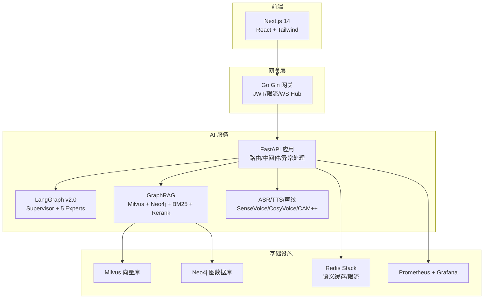
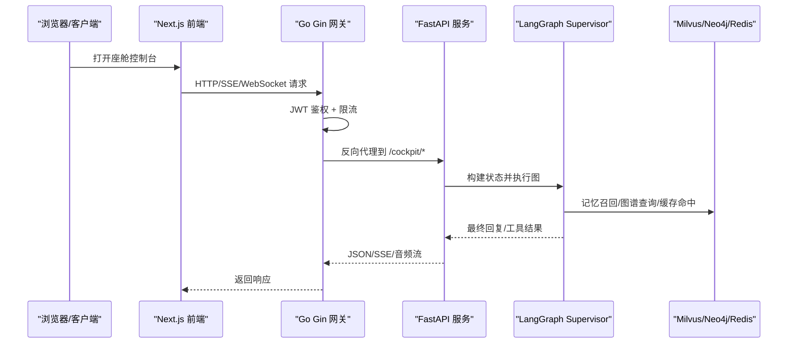
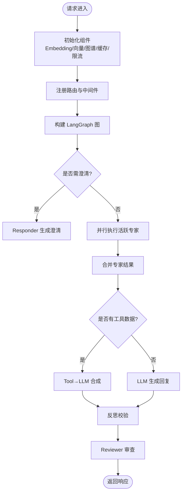
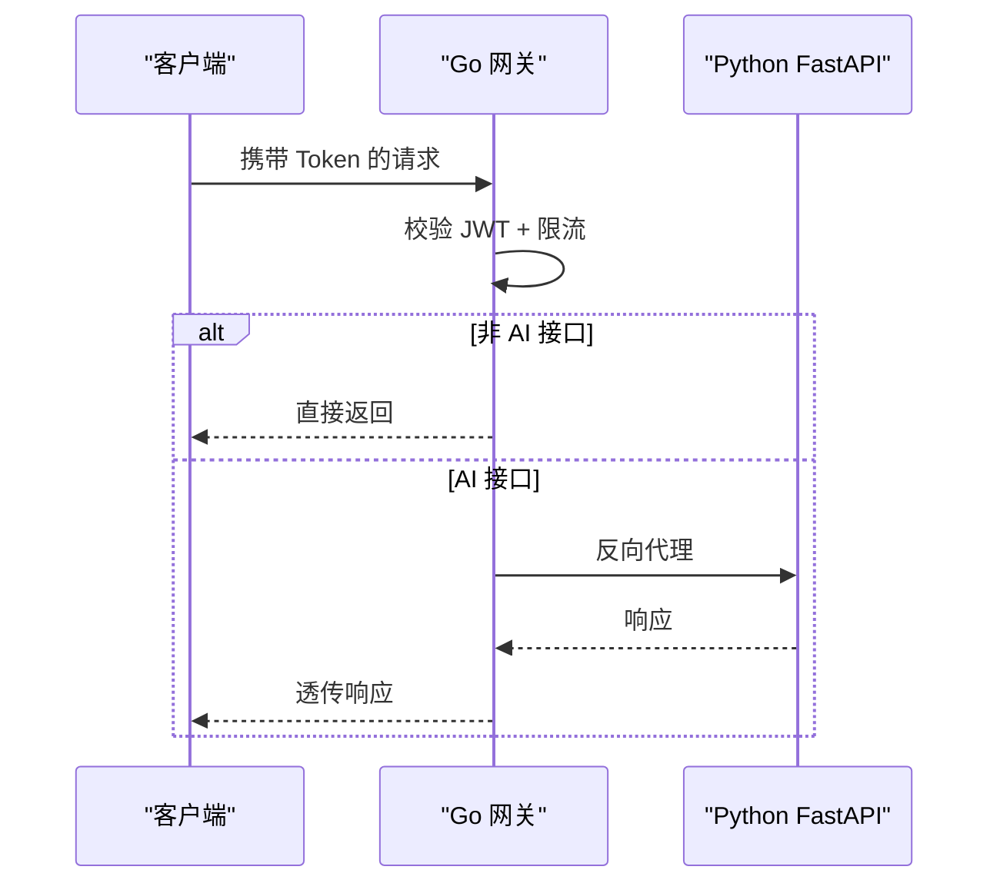
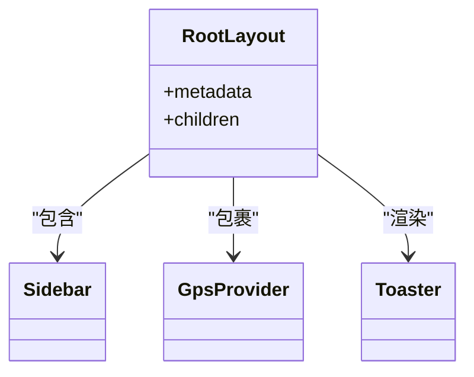
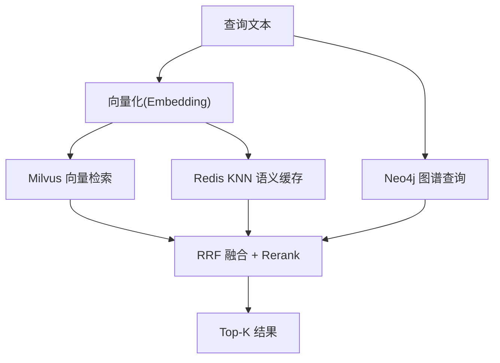
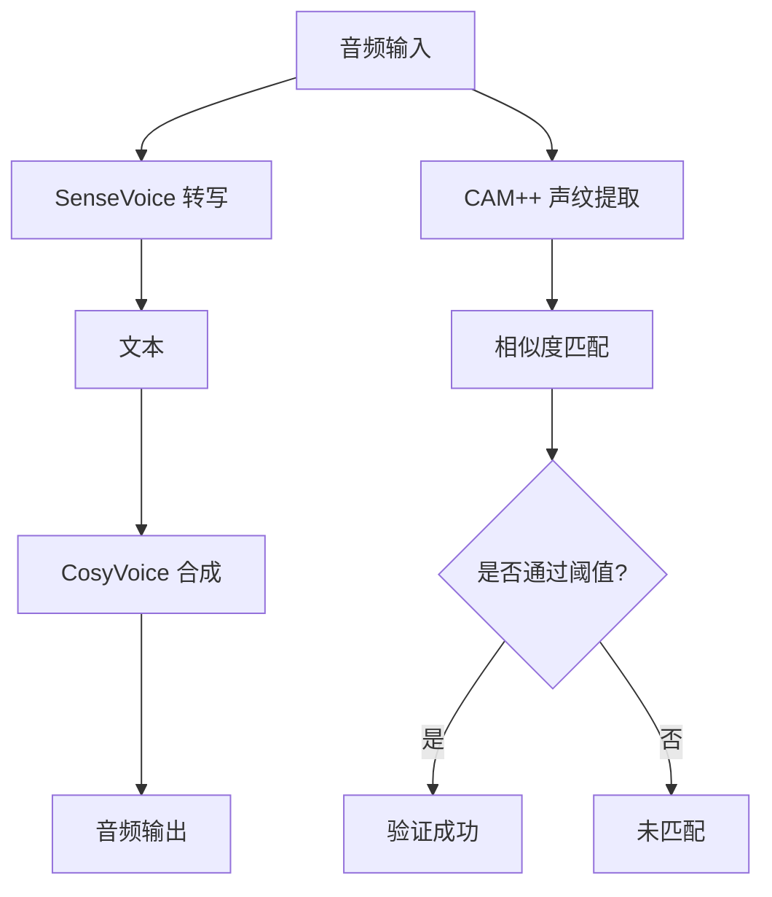
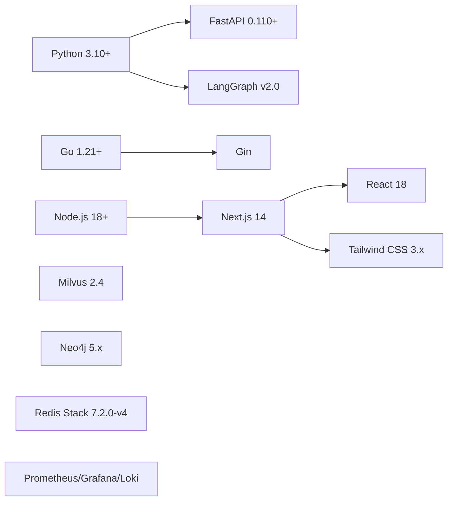

# 技术栈概览

<cite>
**本文引用的文件**   
- [README.md](file://README.md)
- [docker-compose.yml](file://docker-compose.yml)
- [backend_design/nexus/main.py](file://backend_design/nexus/main.py)
- [backend_design/nexus/config.py](file://backend_design/nexus/config.py)
- [backend_design/nexus/rag/vector_store.py](file://backend_design/nexus/rag/vector_store.py)
- [backend_design/nexus/rag/graph_store.py](file://backend_design/nexus/rag/graph_store.py)
- [backend_design/nexus/middleware/redis_cache.py](file://backend_design/nexus/middleware/redis_cache.py)
- [backend_design/nexus/asr/engine.py](file://backend_design/nexus/asr/engine.py)
- [backend_design/nexus/tts/engine.py](file://backend_design/nexus/tts/engine.py)
- [backend_design/nexus/core/voiceprint.py](file://backend_design/nexus/core/voiceprint.py)
- [backend_design/nexus/agent/supervisor_graph.py](file://backend_design/nexus/agent/supervisor_graph.py)
- [backend_design/nexus_gate/cmd/main.go](file://backend_design/nexus_gate/cmd/main.go)
- [frontend_design/package.json](file://frontend_design/package.json)
- [frontend_design/src/app/layout.tsx](file://frontend_design/src/app/layout.tsx)
</cite>

## 目录
1. [简介](#简介)
2. [项目结构](#项目结构)
3. [核心组件](#核心组件)
4. [架构总览](#架构总览)
5. [详细组件分析](#详细组件分析)
6. [依赖关系与兼容性](#依赖关系与兼容性)
7. [性能与可观测性](#性能与可观测性)
8. [故障排查指南](#故障排查指南)
9. [结论](#结论)
10. [附录：版本与配置要点](#附录版本与配置要点)

## 简介
本文件面向开发者，系统性梳理 NexusCockpit 的技术栈选型、协作关系与部署形态，覆盖后端（Python FastAPI + LangGraph v2.0 + Go Gin）、前端（Next.js 14 + React + Tailwind CSS）、AI能力（FunASR SenseVoice、CosyVoice TTS、CAM++ 声纹识别）以及基础设施（Milvus、Neo4j、Redis、Prometheus/Grafana）。文档同时给出架构图、依赖图、关键流程时序图与流程图，帮助理解技术决策与落地方式。

## 项目结构
NexusCockpit 采用前后端分离与多语言服务协同的架构：
- 后端 AI 服务：Python FastAPI，承载 Agent 编排、RAG、语音处理、车控适配等
- 并发网关：Go Gin，负责鉴权、限流、WebSocket Hub 与反向代理
- 前端控制台：Next.js 14 + React + Tailwind CSS，提供座舱控制、聊天、数据中台与监控看板
- 基础设施：Docker Compose 一键编排 Milvus、Neo4j、Redis、MySQL、Prometheus、Grafana、Loki 等

图表来源
- [docker-compose.yml:1-246](file://docker-compose.yml#L1-L246)
- [backend_design/nexus/main.py:294-343](file://backend_design/nexus/main.py#L294-L343)
- [backend_design/nexus_gate/cmd/main.go:30-87](file://backend_design/nexus_gate/cmd/main.go#L30-L87)
- [frontend_design/package.json:12-32](file://frontend_design/package.json#L12-L32)

章节来源
- [README.md:1-140](file://README.md#L1-L140)
- [docker-compose.yml:1-246](file://docker-compose.yml#L1-L246)

## 核心组件
- 后端 API 与服务编排
  - FastAPI 应用入口负责生命周期管理、中间件注册、路由挂载、指标暴露与静态资源挂载
  - LangGraph v2.0 Supervisor 工作流实现意图识别、专家并行、响应合成与反思校验
- 并发网关
  - Go Gin 网关提供 JWT 鉴权、令牌桶限流、WebSocket Hub 与反向代理到 Python 服务
- 前端控制台
  - Next.js 14 App Router 根布局、侧边栏、GPS 提供者与全局通知容器
- 数据与检索
  - Milvus 向量存储（Food_List、User_Memory），Neo4j 图谱（用户画像/关系），Redis Stack 语义缓存（KNN 向量索引）
- 语音与声纹
  - FunASR SenseVoice ASR、CosyVoice TTS、CAM++ 声纹识别（注册/验证/管理）
- 可观测性
  - Prometheus 指标采集与 Grafana 可视化；Langfuse 可选 LLM 追踪

章节来源
- [backend_design/nexus/main.py:294-343](file://backend_design/nexus/main.py#L294-L343)
- [backend_design/nexus/agent/supervisor_graph.py:127-173](file://backend_design/nexus/agent/supervisor_graph.py#L127-L173)
- [backend_design/nexus_gate/cmd/main.go:30-87](file://backend_design/nexus_gate/cmd/main.go#L30-L87)
- [frontend_design/src/app/layout.tsx:29-54](file://frontend_design/src/app/layout.tsx#L29-L54)
- [backend_design/nexus/rag/vector_store.py:38-133](file://backend_design/nexus/rag/vector_store.py#L38-L133)
- [backend_design/nexus/rag/graph_store.py:24-83](file://backend_design/nexus/rag/graph_store.py#L24-L83)
- [backend_design/nexus/middleware/redis_cache.py:55-158](file://backend_design/nexus/middleware/redis_cache.py#L55-L158)
- [backend_design/nexus/asr/engine.py:21-83](file://backend_design/nexus/asr/engine.py#L21-L83)
- [backend_design/nexus/tts/engine.py:21-111](file://backend_design/nexus/tts/engine.py#L21-L111)
- [backend_design/nexus/core/voiceprint.py:42-167](file://backend_design/nexus/core/voiceprint.py#L42-L167)

## 架构总览
系统采用“前端 → Go 网关 → Python AI 服务 → 数据与模型”的分层协作模式。网关承担安全与流量治理，AI 服务承载业务与智能体编排，数据层提供向量/图谱/缓存支撑，可观测性贯穿全链路。

图表来源
- [backend_design/nexus_gate/cmd/main.go:30-87](file://backend_design/nexus_gate/cmd/main.go#L30-L87)
- [backend_design/nexus/main.py:318-343](file://backend_design/nexus/main.py#L318-L343)
- [backend_design/nexus/agent/supervisor_graph.py:127-173](file://backend_design/nexus/agent/supervisor_graph.py#L127-L173)
- [backend_design/nexus/rag/vector_store.py:52-133](file://backend_design/nexus/rag/vector_store.py#L52-L133)
- [backend_design/nexus/rag/graph_store.py:31-83](file://backend_design/nexus/rag/graph_store.py#L31-L83)
- [backend_design/nexus/middleware/redis_cache.py:83-158](file://backend_design/nexus/middleware/redis_cache.py#L83-L158)

## 详细组件分析

### 后端 API 与服务编排（FastAPI + LangGraph v2.0）
- 应用启动与初始化
  - 在 lifespan 中完成 Embedding、向量库、图谱、车控适配器、语义缓存、限流器、会话存储、Langfuse、Agent 图、数据保留策略等的连接与准备
  - 挂载 Prometheus 指标端点与静态音频目录
- 中间件与异常处理
  - CORS、自定义上下文中间件（提取座舱 ID、注入响应耗时头）
  - 统一异常处理器（限流、认证、通用错误）
- LangGraph v2.0 工作流
  - Supervisor 节点：记忆召回 + 用户画像 + 意图路由 + 专家分派
  - 专家并行：vehicle/nav/lifestyle/health/chat 五类专家
  - Responder 汇总：支持 Tool→LLM 合成与搜索专用提示词
  - Reflection 反思：事实性/一致性/无幻觉检查，必要时自动修正
  - Reviewer 审查：质量把关与记忆持久化

图表来源
- [backend_design/nexus/main.py:61-291](file://backend_design/nexus/main.py#L61-L291)
- [backend_design/nexus/main.py:294-343](file://backend_design/nexus/main.py#L294-L343)
- [backend_design/nexus/agent/supervisor_graph.py:127-173](file://backend_design/nexus/agent/supervisor_graph.py#L127-L173)
- [backend_design/nexus/agent/supervisor_graph.py:401-533](file://backend_design/nexus/agent/supervisor_graph.py#L401-L533)
- [backend_design/nexus/agent/supervisor_graph.py:534-752](file://backend_design/nexus/agent/supervisor_graph.py#L534-L752)

章节来源
- [backend_design/nexus/main.py:61-291](file://backend_design/nexus/main.py#L61-L291)
- [backend_design/nexus/main.py:294-343](file://backend_design/nexus/main.py#L294-L343)
- [backend_design/nexus/agent/supervisor_graph.py:127-173](file://backend_design/nexus/agent/supervisor_graph.py#L127-L173)

### 并发网关（Go Gin）
- 职责
  - JWT 鉴权与 cockpit_id 校验
  - 座舱级令牌桶限流
  - WebSocket Hub 管理长连接
  - 非 AI 请求本地处理，AI 请求反向代理至 Python 服务
- 启动流程
  - 解析参数 → 加载配置 → 初始化代理 → 启动 WS Hub → 创建限流器 → 设置路由 → 启动 HTTP 服务 → 优雅关闭

图表来源
- [backend_design/nexus_gate/cmd/main.go:30-87](file://backend_design/nexus_gate/cmd/main.go#L30-L87)

章节来源
- [backend_design/nexus_gate/cmd/main.go:30-87](file://backend_design/nexus_gate/cmd/main.go#L30-L87)

### 前端控制台（Next.js 14 + React + Tailwind）
- 根布局
  - 提供 HTML 骨架、全局样式、侧边栏、主内容区、GPS 提供者与 Toast 通知容器
- 技术栈
  - Next.js 14（App Router）、React 18、Tailwind CSS、Zustand、Axios、Recharts、Three.js 生态等

图表来源
- [frontend_design/src/app/layout.tsx:29-54](file://frontend_design/src/app/layout.tsx#L29-L54)
- [frontend_design/package.json:12-32](file://frontend_design/package.json#L12-L32)

章节来源
- [frontend_design/src/app/layout.tsx:29-54](file://frontend_design/src/app/layout.tsx#L29-L54)
- [frontend_design/package.json:12-32](file://frontend_design/package.json#L12-L32)

### 数据与检索（GraphRAG）
- 向量存储（Milvus）
  - 集合：Food_List、User_Memory；HNSW 索引；按 user_id 过滤检索
- 图谱存储（Neo4j）
  - 用户画像与实体关系；支持 N 阶路径查询与 Milvus ID 双向绑定
- 语义缓存（Redis Stack）
  - RediSearch VECTOR 索引 KNN 检索；按 user_id 分片；TTL 分级；副作用隔离（车控指令不缓存）

图表来源
- [backend_design/nexus/rag/vector_store.py:52-133](file://backend_design/nexus/rag/vector_store.py#L52-L133)
- [backend_design/nexus/rag/graph_store.py:31-133](file://backend_design/nexus/rag/graph_store.py#L31-L133)
- [backend_design/nexus/middleware/redis_cache.py:83-158](file://backend_design/nexus/middleware/redis_cache.py#L83-L158)

章节来源
- [backend_design/nexus/rag/vector_store.py:38-133](file://backend_design/nexus/rag/vector_store.py#L38-L133)
- [backend_design/nexus/rag/graph_store.py:24-133](file://backend_design/nexus/rag/graph_store.py#L24-L133)
- [backend_design/nexus/middleware/redis_cache.py:55-158](file://backend_design/nexus/middleware/redis_cache.py#L55-L158)

### 语音与声纹（ASR/TTS/声纹）
- ASR（FunASR SenseVoice）
  - 支持文件与字节流转写；自动语言检测与后处理
- TTS（CosyVoice）
  - 支持 SFT/Zero-shot 推理与流式输出；保存为 WAV
- 声纹（CAM++）
  - 注册：多次采样 → 特征存储；验证：相似度比对 → 阈值判定；管理：查询/删除

图表来源
- [backend_design/nexus/asr/engine.py:21-83](file://backend_design/nexus/asr/engine.py#L21-L83)
- [backend_design/nexus/tts/engine.py:21-111](file://backend_design/nexus/tts/engine.py#L21-L111)
- [backend_design/nexus/core/voiceprint.py:99-167](file://backend_design/nexus/core/voiceprint.py#L99-L167)

章节来源
- [backend_design/nexus/asr/engine.py:21-83](file://backend_design/nexus/asr/engine.py#L21-L83)
- [backend_design/nexus/tts/engine.py:21-111](file://backend_design/nexus/tts/engine.py#L21-L111)
- [backend_design/nexus/core/voiceprint.py:42-167](file://backend_design/nexus/core/voiceprint.py#L42-L167)

## 依赖关系与兼容性
- 运行时与环境
  - Python 3.10+、Go 1.21+、Node.js 18+、Docker 24+、Docker Compose 2.20+
- 关键依赖与版本
  - FastAPI 0.110+、LangGraph v2.0、Gin（Go）、Next.js 14、React 18、Tailwind CSS 3.x
  - Milvus 2.4、Neo4j 5.x、Redis Stack 7.2.0-v4、Prometheus/Grafana/Loki
- 双模式部署
  - local：本地 Docker 中间件
  - cloud：云端托管（Zilliz/AuraDB/云 Redis/硅基流动 Rerank）

图表来源
- [README.md:1-33](file://README.md#L1-L33)
- [docker-compose.yml:94-175](file://docker-compose.yml#L94-L175)
- [frontend_design/package.json:12-32](file://frontend_design/package.json#L12-L32)

章节来源
- [README.md:1-33](file://README.md#L1-L33)
- [docker-compose.yml:94-175](file://docker-compose.yml#L94-L175)
- [frontend_design/package.json:12-32](file://frontend_design/package.json#L12-L32)

## 性能与可观测性
- 性能优化
  - 语义缓存：RediSearch KNN O(log n)，按用户分片，TTL 分级，副作用隔离
  - 向量检索：HNSW 索引，IP 距离度量，top-k 可调
  - 并发：LangGraph 专家并行执行，异步 I/O
- 可观测性
  - Prometheus 指标端点挂载，Grafana 面板展示 API 延迟、Agent 耗时、缓存命中率等
  - Langfuse 可选 LLM 追踪（需配置公钥/私钥）

章节来源
- [backend_design/nexus/middleware/redis_cache.py:55-158](file://backend_design/nexus/middleware/redis_cache.py#L55-L158)
- [backend_design/nexus/rag/vector_store.py:72-133](file://backend_design/nexus/rag/vector_store.py#L72-L133)
- [backend_design/nexus/main.py:341-343](file://backend_design/nexus/main.py#L341-L343)
- [backend_design/nexus/config.py:395-414](file://backend_design/nexus/config.py#L395-L414)

## 故障排查指南
- 常见问题定位
  - 向量库/图谱连接失败：查看启动日志中的连接错误，确认环境变量与网络可达
  - 语义缓存不可用：若云 Redis 无 RediSearch，将回退 scan 模式；检查索引创建与 TTL
  - ASR/TTS 模型未加载：确认模型路径存在且依赖安装正确
  - 声纹服务不可用：模型未加载时返回未验证状态，跳过验证步骤
- 建议操作
  - 使用健康检查端点验证服务状态
  - 开启 Langfuse 追踪以定位 LLM 调用问题
  - 调整限流阈值与缓存阈值以平衡吞吐与成本

章节来源
- [backend_design/nexus/main.py:89-104](file://backend_design/nexus/main.py#L89-L104)
- [backend_design/nexus/middleware/redis_cache.py:97-110](file://backend_design/nexus/middleware/redis_cache.py#L97-L110)
- [backend_design/nexus/asr/engine.py:32-56](file://backend_design/nexus/asr/engine.py#L32-L56)
- [backend_design/nexus/tts/engine.py:33-61](file://backend_design/nexus/tts/engine.py#L33-L61)
- [backend_design/nexus/core/voiceprint.py:119-135](file://backend_design/nexus/core/voiceprint.py#L119-L135)

## 结论
NexusCockpit 以 FastAPI + LangGraph v2.0 为核心，结合 Go 高并发网关与 Next.js 前端，形成完整的企业级车载语音 Agent 平台。通过 GraphRAG（Milvus + Neo4j + BM25 + Rerank）与 Redis 语义缓存提升检索与响应效率，辅以 ASR/TTS/声纹能力与完善的可观测性体系，满足复杂场景下的稳定性与可扩展性需求。双模式部署与降级策略进一步增强了系统的弹性与可用性。

## 附录：版本与配置要点
- 环境要求
  - Python 3.10+、Go 1.21+、Node.js 18+、Docker 24+、Docker Compose 2.20+
- 关键配置项
  - LLM/Embedding：ARK_API_KEY、ARK_BASE_URL、LLM_MODEL、EMBEDDING_MODEL、EMBEDDING_DIM
  - 向量/图谱/缓存：VECTOR_STORE_PROVIDER、GRAPH_STORE_PROVIDER、CACHE_PROVIDER、RERANKER_PROVIDER
  - 服务端口：FastAPI 8000、Go 网关 8080、前端 3000、Grafana 3001、Prometheus 9090
- 启动与访问
  - 后端：uvicorn nexus.main:app --host 0.0.0.0 --port 8000
  - 网关：go run backend_design/nexus_gate/cmd/main.go
  - 前端：npm run dev（Next.js 14）
  - 健康检查：/health；API 文档：/docs

章节来源
- [README.md:148-318](file://README.md#L148-L318)
- [backend_design/nexus/main.py:440-452](file://backend_design/nexus/main.py#L440-L452)
- [backend_design/nexus_gate/cmd/main.go:30-87](file://backend_design/nexus_gate/cmd/main.go#L30-L87)
- [frontend_design/package.json:5-11](file://frontend_design/package.json#L5-L11)