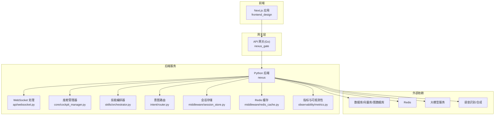
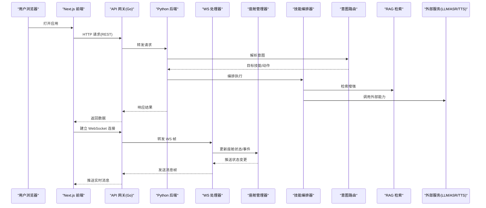
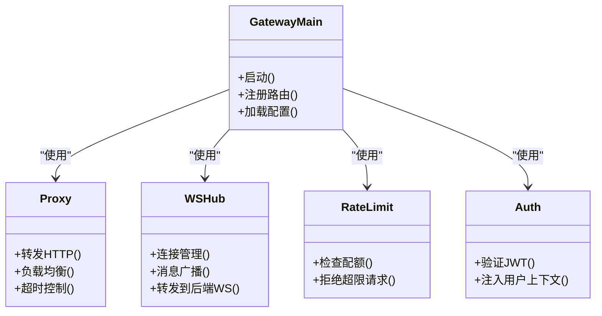
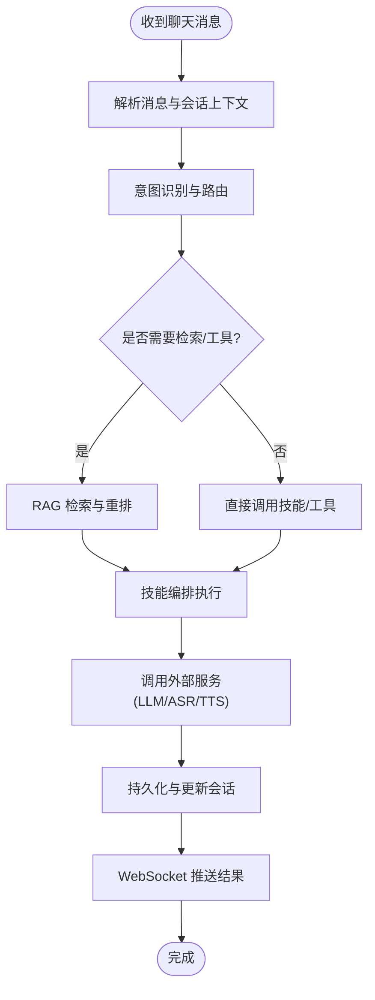
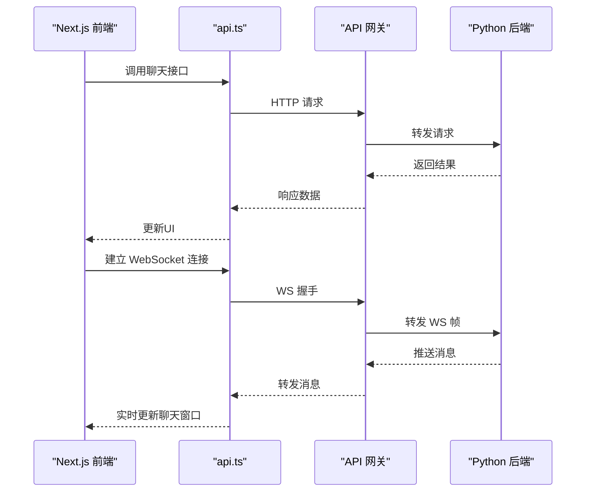
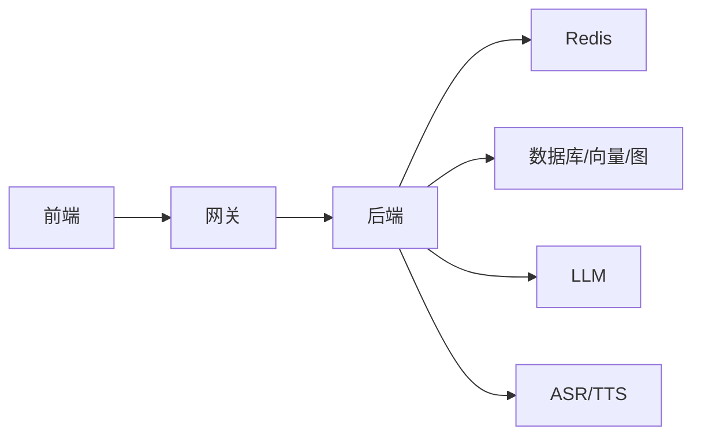
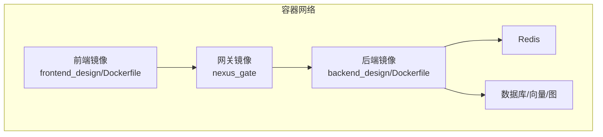

# 架构概览

<cite>
**本文引用的文件**   
- [docker-compose.yml](file://docker-compose.yml)
- [backend_design/nexus/main.py](file://backend_design/nexus/main.py)
- [backend_design/nexus/api/websocket.py](file://backend_design/nexus/api/websocket.py)
- [backend_design/nexus/core/cockpit_manager.py](file://backend_design/nexus/core/cockpit_manager.py)
- [backend_design/nexus/skills/orchestrator.py](file://backend_design/nexus/skills/orchestrator.py)
- [backend_design/nexus/intent/router.py](file://backend_design/nexus/intent/router.py)
- [backend_design/nexus/middleware/session_store.py](file://backend_design/nexus/middleware/session_store.py)
- [backend_design/nexus/middleware/redis_cache.py](file://backend_design/nexus/middleware/redis_cache.py)
- [backend_design/nexus/observability/metrics.py](file://backend_design/nexus/observability/metrics.py)
- [backend_design/nexus_gate/cmd/main.go](file://backend_design/nexus_gate/cmd/main.go)
- [backend_design/nexus_gate/internal/proxy/proxy.go](file://backend_design/nexus_gate/internal/proxy/proxy.go)
- [backend_design/nexus_gate/internal/ws/hub.go](file://backend_design/nexus_gate/internal/ws/hub.go)
- [backend_design/nexus_gate/internal/ratelimit/ratelimit.go](file://backend_design/nexus_gate/internal/ratelimit/ratelimit.go)
- [backend_design/nexus_gate/proto/nexus.proto](file://backend_design/nexus_gate/proto/nexus.proto)
- [frontend_design/src/lib/api.ts](file://frontend_design/src/lib/api.ts)
- [frontend_design/src/components/chat/chat-window.tsx](file://frontend_design/src/components/chat/chat-window.tsx)
- [frontend_design/Dockerfile](file://frontend_design/Dockerfile)
- [backend_design/Dockerfile](file://backend_design/Dockerfile)
</cite>

## 目录
1. [简介](#简介)
2. [项目结构](#项目结构)
3. [核心组件](#核心组件)
4. [架构总览](#架构总览)
5. [详细组件分析](#详细组件分析)
6. [依赖关系分析](#依赖关系分析)
7. [性能与可扩展性](#性能与可扩展性)
8. [故障排查指南](#故障排查指南)
9. [结论](#结论)
10. [附录](#附录)

## 简介
本文件为 NexusCockpit 智能座舱系统的整体架构概览，面向开发者与管理者，帮助快速理解前后端分离的微服务设计、容器化部署拓扑、服务间通信协议以及关键设计模式。系统由以下三大部分组成：
- Python 后端服务：提供业务逻辑、AI 能力编排、技能插件、会话与记忆、RAG 检索、可观测性等。
- Go 语言 API 网关：统一入口、鉴权、限流、反向代理、WebSocket 转发与 gRPC 桥接。
- Next.js 前端应用：管理控制台、聊天界面、车辆控制面板等页面，通过 REST/WebSocket 与后端交互。

## 项目结构
仓库采用多模块分层组织：
- backend_design/nexus：Python 后端主服务，包含路由、中间件、核心引擎、意图识别、技能编排、RAG、可观测性等。
- backend_design/nexus_gate：Go 实现的 API 网关，负责鉴权、限流、代理、WebSocket Hub、gRPC 定义。
- frontend_design：Next.js 前端工程，包含页面、组件、状态管理与 API 客户端封装。
- config：监控与日志配置（Prometheus/Grafana/Loki）。
- scripts：初始化脚本、测试与迁移脚本。
- docker-compose.yml：容器编排入口，定义各服务镜像与网络。

图表来源
- [docker-compose.yml](file://docker-compose.yml)
- [backend_design/nexus/main.py](file://backend_design/nexus/main.py)
- [backend_design/nexus/api/websocket.py](file://backend_design/nexus/api/websocket.py)
- [backend_design/nexus/core/cockpit_manager.py](file://backend_design/nexus/core/cockpit_manager.py)
- [backend_design/nexus/skills/orchestrator.py](file://backend_design/nexus/skills/orchestrator.py)
- [backend_design/nexus/intent/router.py](file://backend_design/nexus/intent/router.py)
- [backend_design/nexus/middleware/session_store.py](file://backend_design/nexus/middleware/session_store.py)
- [backend_design/nexus/middleware/redis_cache.py](file://backend_design/nexus/middleware/redis_cache.py)
- [backend_design/nexus/observability/metrics.py](file://backend_design/nexus/observability/metrics.py)
- [backend_design/nexus_gate/cmd/main.go](file://backend_design/nexus_gate/cmd/main.go)
- [backend_design/nexus_gate/internal/proxy/proxy.go](file://backend_design/nexus_gate/internal/proxy/proxy.go)
- [backend_design/nexus_gate/internal/ws/hub.go](file://backend_design/nexus_gate/internal/ws/hub.go)
- [backend_design/nexus_gate/internal/ratelimit/ratelimit.go](file://backend_design/nexus_gate/internal/ratelimit/ratelimit.go)

章节来源
- [docker-compose.yml](file://docker-compose.yml)
- [backend_design/nexus/main.py](file://backend_design/nexus/main.py)
- [backend_design/nexus_gate/cmd/main.go](file://backend_design/nexus_gate/cmd/main.go)
- [frontend_design/src/lib/api.ts](file://frontend_design/src/lib/api.ts)

## 核心组件
- API 网关（Go）
  - 职责：统一入口、JWT 鉴权、请求限流、反向代理到 Python 后端、WebSocket 连接转发、gRPC 接口定义。
  - 关键点：集中式安全策略与流量治理，降低后端暴露面。
- Python 后端服务
  - 职责：RESTful API 与 WebSocket 服务端点、座舱状态管理、意图识别与路由、技能插件编排、会话与记忆、RAG 检索、可观测性埋点。
  - 关键点：分层清晰、插件化扩展、事件驱动编排。
- Next.js 前端
  - 职责：管理后台、聊天界面、车辆控制面板；封装 REST/WebSocket 调用，维护本地状态。
  - 关键点：组件化 UI、状态管理、实时消息展示。

章节来源
- [backend_design/nexus_gate/cmd/main.go](file://backend_design/nexus_gate/cmd/main.go)
- [backend_design/nexus/main.py](file://backend_design/nexus/main.py)
- [frontend_design/src/lib/api.ts](file://frontend_design/src/lib/api.ts)

## 架构总览
NexusCockpit 采用前后端分离与微服务化设计：
- 前端通过 HTTPS 访问网关，网关完成鉴权与限流后，将 HTTP 请求转发至 Python 后端；WebSocket 请求经网关 Hub 转发至后端 WS 处理器。
- 后端内部按领域分层：API 层 -> 核心域（座舱管理、意图路由）-> 技能编排与工具调用 -> 数据与检索（RAG、向量/图存储）-> 外部服务（LLM、ASR/TTS）。
- 可观测性与中间件贯穿全链路：会话存储、缓存、指标采集。

图表来源
- [backend_design/nexus_gate/cmd/main.go](file://backend_design/nexus_gate/cmd/main.go)
- [backend_design/nexus_gate/internal/proxy/proxy.go](file://backend_design/nexus_gate/internal/proxy/proxy.go)
- [backend_design/nexus_gate/internal/ws/hub.go](file://backend_design/nexus_gate/internal/ws/hub.go)
- [backend_design/nexus/api/websocket.py](file://backend_design/nexus/api/websocket.py)
- [backend_design/nexus/core/cockpit_manager.py](file://backend_design/nexus/core/cockpit_manager.py)
- [backend_design/nexus/skills/orchestrator.py](file://backend_design/nexus/skills/orchestrator.py)
- [backend_design/nexus/intent/router.py](file://backend_design/nexus/intent/router.py)
- [frontend_design/src/lib/api.ts](file://frontend_design/src/lib/api.ts)

## 详细组件分析

### API 网关（Go）
- 功能要点
  - 鉴权：JWT 校验与上下文注入。
  - 限流：基于 Redis 的令牌桶或滑动窗口策略。
  - 反向代理：将 HTTP 请求转发至 Python 后端。
  - WebSocket：Hub 管理连接广播与转发。
  - gRPC：proto 定义用于跨语言服务通信。
- 关键路径
  - 启动与路由注册。
  - 鉴权中间件与限流中间件。
  - 代理与 WS Hub 集成。

图表来源
- [backend_design/nexus_gate/cmd/main.go](file://backend_design/nexus_gate/cmd/main.go)
- [backend_design/nexus_gate/internal/proxy/proxy.go](file://backend_design/nexus_gate/internal/proxy/proxy.go)
- [backend_design/nexus_gate/internal/ws/hub.go](file://backend_design/nexus_gate/internal/ws/hub.go)
- [backend_design/nexus_gate/internal/ratelimit/ratelimit.go](file://backend_design/nexus_gate/internal/ratelimit/ratelimit.go)
- [backend_design/nexus_gate/proto/nexus.proto](file://backend_design/nexus_gate/proto/nexus.proto)

章节来源
- [backend_design/nexus_gate/cmd/main.go](file://backend_design/nexus_gate/cmd/main.go)
- [backend_design/nexus_gate/internal/proxy/proxy.go](file://backend_design/nexus_gate/internal/proxy/proxy.go)
- [backend_design/nexus_gate/internal/ws/hub.go](file://backend_design/nexus_gate/internal/ws/hub.go)
- [backend_design/nexus_gate/internal/ratelimit/ratelimit.go](file://backend_design/nexus_gate/internal/ratelimit/ratelimit.go)
- [backend_design/nexus_gate/proto/nexus.proto](file://backend_design/nexus_gate/proto/nexus.proto)

### Python 后端服务
- 分层与职责
  - API 层：REST 路由与 WebSocket 端点。
  - 核心域：座舱状态管理、会话上下文、个性化设置。
  - 意图识别与路由：启发式与 LLM 路由结合。
  - 技能编排：插件化技能注册与执行。
  - 中间件：会话存储、Redis 缓存、任务队列。
  - RAG：向量/图检索与重排。
  - 可观测性：指标采集与追踪。
- 关键流程（聊天对话）
  - 接收消息 -> 意图识别 -> 技能编排 -> RAG 检索 -> 外部模型/工具调用 -> 生成回复 -> 持久化与会话更新 -> 实时推送。

图表来源
- [backend_design/nexus/api/websocket.py](file://backend_design/nexus/api/websocket.py)
- [backend_design/nexus/intent/router.py](file://backend_design/nexus/intent/router.py)
- [backend_design/nexus/skills/orchestrator.py](file://backend_design/nexus/skills/orchestrator.py)
- [backend_design/nexus/core/cockpit_manager.py](file://backend_design/nexus/core/cockpit_manager.py)
- [backend_design/nexus/middleware/session_store.py](file://backend_design/nexus/middleware/session_store.py)
- [backend_design/nexus/middleware/redis_cache.py](file://backend_design/nexus/middleware/redis_cache.py)
- [backend_design/nexus/observability/metrics.py](file://backend_design/nexus/observability/metrics.py)

章节来源
- [backend_design/nexus/main.py](file://backend_design/nexus/main.py)
- [backend_design/nexus/api/websocket.py](file://backend_design/nexus/api/websocket.py)
- [backend_design/nexus/core/cockpit_manager.py](file://backend_design/nexus/core/cockpit_manager.py)
- [backend_design/nexus/skills/orchestrator.py](file://backend_design/nexus/skills/orchestrator.py)
- [backend_design/nexus/intent/router.py](file://backend_design/nexus/intent/router.py)
- [backend_design/nexus/middleware/session_store.py](file://backend_design/nexus/middleware/session_store.py)
- [backend_design/nexus/middleware/redis_cache.py](file://backend_design/nexus/middleware/redis_cache.py)
- [backend_design/nexus/observability/metrics.py](file://backend_design/nexus/observability/metrics.py)

### Next.js 前端应用
- 职责
  - 页面与组件：聊天窗口、车辆面板、管理后台。
  - 状态管理：本地状态与全局 store。
  - API 客户端：封装 REST 与 WebSocket 调用。
- 交互要点
  - 通过 api.ts 发起请求与订阅事件。
  - chat-window.tsx 负责消息渲染与实时推送。

图表来源
- [frontend_design/src/lib/api.ts](file://frontend_design/src/lib/api.ts)
- [frontend_design/src/components/chat/chat-window.tsx](file://frontend_design/src/components/chat/chat-window.tsx)
- [backend_design/nexus_gate/internal/ws/hub.go](file://backend_design/nexus_gate/internal/ws/hub.go)
- [backend_design/nexus/api/websocket.py](file://backend_design/nexus/api/websocket.py)

章节来源
- [frontend_design/src/lib/api.ts](file://frontend_design/src/lib/api.ts)
- [frontend_design/src/components/chat/chat-window.tsx](file://frontend_design/src/components/chat/chat-window.tsx)

## 依赖关系分析
- 组件耦合
  - 网关与后端松耦合：通过标准 HTTP/WS 协议交互，便于独立扩缩容。
  - 后端内部分层清晰：API 层不直接依赖外部服务，通过中间件与领域对象解耦。
- 外部依赖
  - Redis：会话、缓存、限流计数。
  - 向量/图数据库：RAG 检索与知识图谱。
  - LLM/ASR/TTS：外部 AI 能力。
- 潜在循环依赖
  - 通过明确接口与事件总线避免循环调用。

图表来源
- [docker-compose.yml](file://docker-compose.yml)
- [backend_design/nexus/middleware/redis_cache.py](file://backend_design/nexus/middleware/redis_cache.py)
- [backend_design/nexus/middleware/session_store.py](file://backend_design/nexus/middleware/session_store.py)

章节来源
- [docker-compose.yml](file://docker-compose.yml)
- [backend_design/nexus/middleware/redis_cache.py](file://backend_design/nexus/middleware/redis_cache.py)
- [backend_design/nexus/middleware/session_store.py](file://backend_design/nexus/middleware/session_store.py)

## 性能与可扩展性
- 水平扩展
  - 网关与后端无状态化，支持多实例横向扩展。
  - WebSocket Hub 与后端 WS 处理器均支持集群部署，配合 Redis 进行跨节点广播。
- 缓存与异步
  - Redis 缓存热点数据，减少数据库压力。
  - 任务队列用于耗时操作（如长文本生成、媒体处理）。
- 限流与熔断
  - 网关层限流保护后端；后端内部对关键外部调用实现熔断与降级。
- 可观测性
  - 指标采集与日志聚合，支撑容量规划与问题定位。

[本节为通用指导，无需具体文件引用]

## 故障排查指南
- 常见问题
  - 鉴权失败：检查 JWT 配置与网关中间件日志。
  - 限流触发：查看网关限流统计与 Redis 计数器。
  - WebSocket 断连：确认 Hub 连接数与后端 WS 处理器负载。
  - 意图识别异常：检查路由规则与提示词配置。
  - RAG 检索慢：评估向量索引与重排策略。
- 定位手段
  - 网关与后端日志关联 ID。
  - Prometheus 指标与 Grafana 看板。
  - 分布式追踪链路。

章节来源
- [backend_design/nexus_gate/internal/ratelimit/ratelimit.go](file://backend_design/nexus_gate/internal/ratelimit/ratelimit.go)
- [backend_design/nexus/observability/metrics.py](file://backend_design/nexus/observability/metrics.py)

## 结论
NexusCockpit 以“网关+后端+前端”的分层架构为基础，结合插件化技能、事件驱动编排与完善的可观测性体系，实现了高内聚、低耦合与易扩展的智能座舱平台。通过容器化部署与标准化通信协议，系统具备良好的弹性与可运维性。

[本节为总结性内容，无需具体文件引用]

## 附录
- 容器化部署拓扑
  - 使用 docker-compose 编排前端、网关、后端及依赖服务。
  - 前端静态资源由 Nginx 托管，网关对外暴露端口，后端监听内部网络。

图表来源
- [docker-compose.yml](file://docker-compose.yml)
- [frontend_design/Dockerfile](file://frontend_design/Dockerfile)
- [backend_design/Dockerfile](file://backend_design/Dockerfile)

章节来源
- [docker-compose.yml](file://docker-compose.yml)
- [frontend_design/Dockerfile](file://frontend_design/Dockerfile)
- [backend_design/Dockerfile](file://backend_design/Dockerfile)