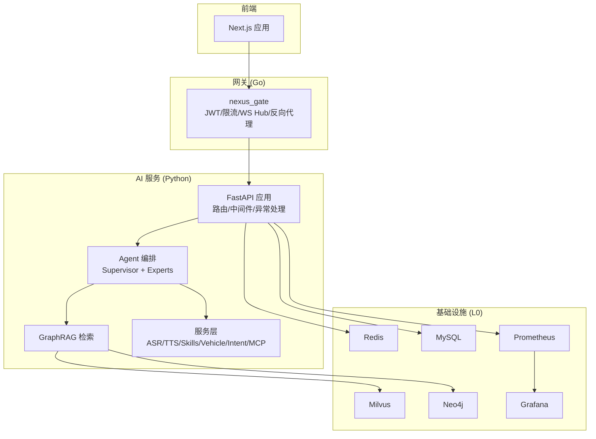
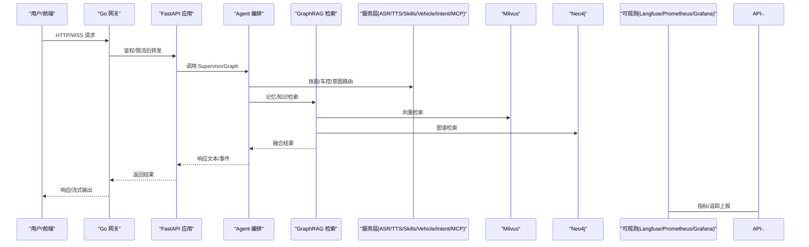
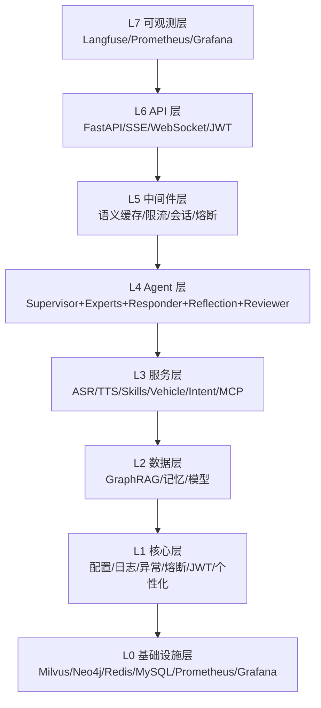
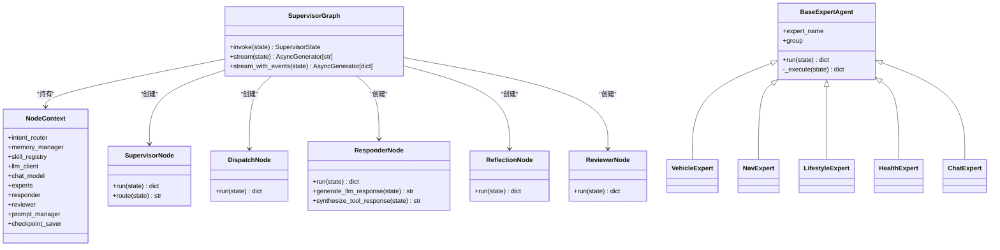
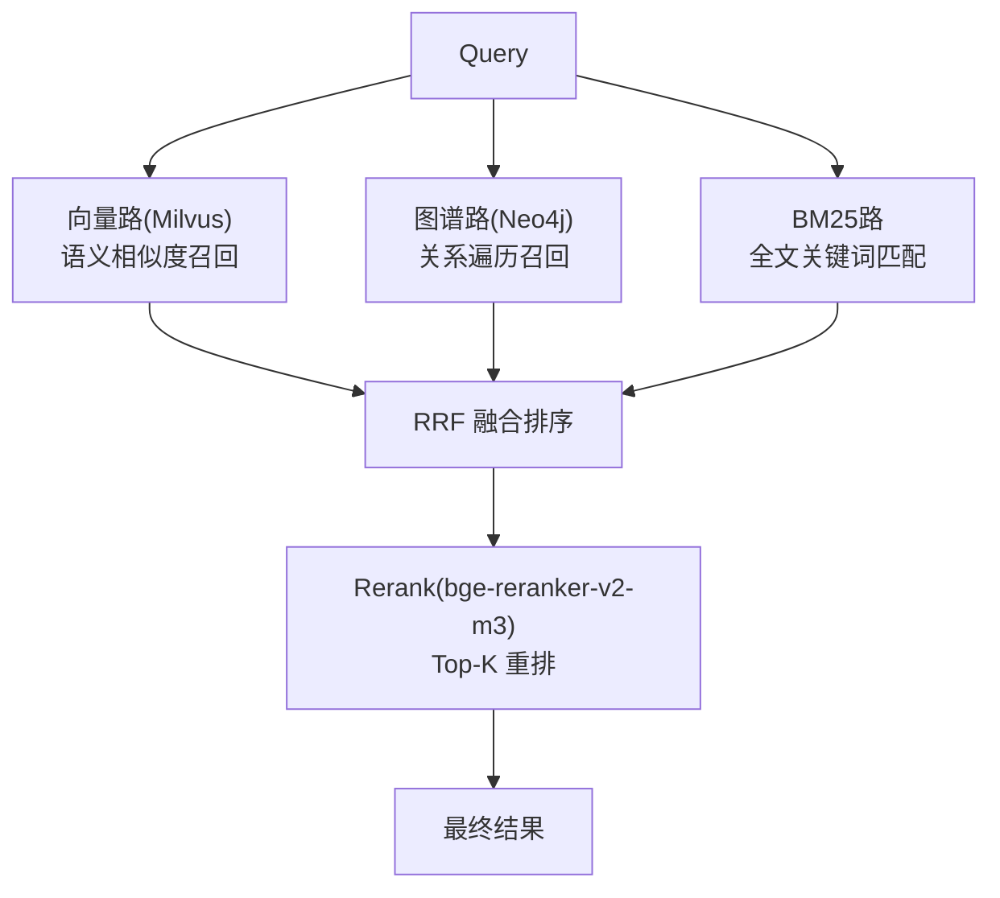
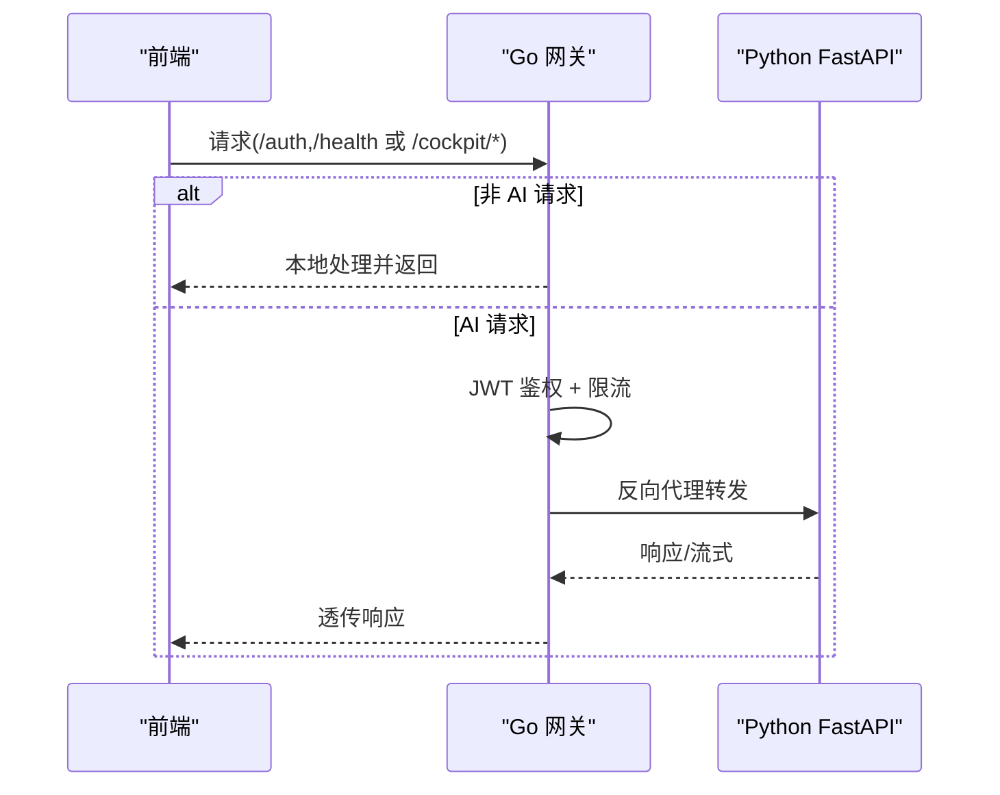
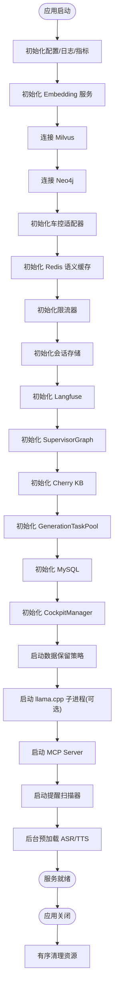
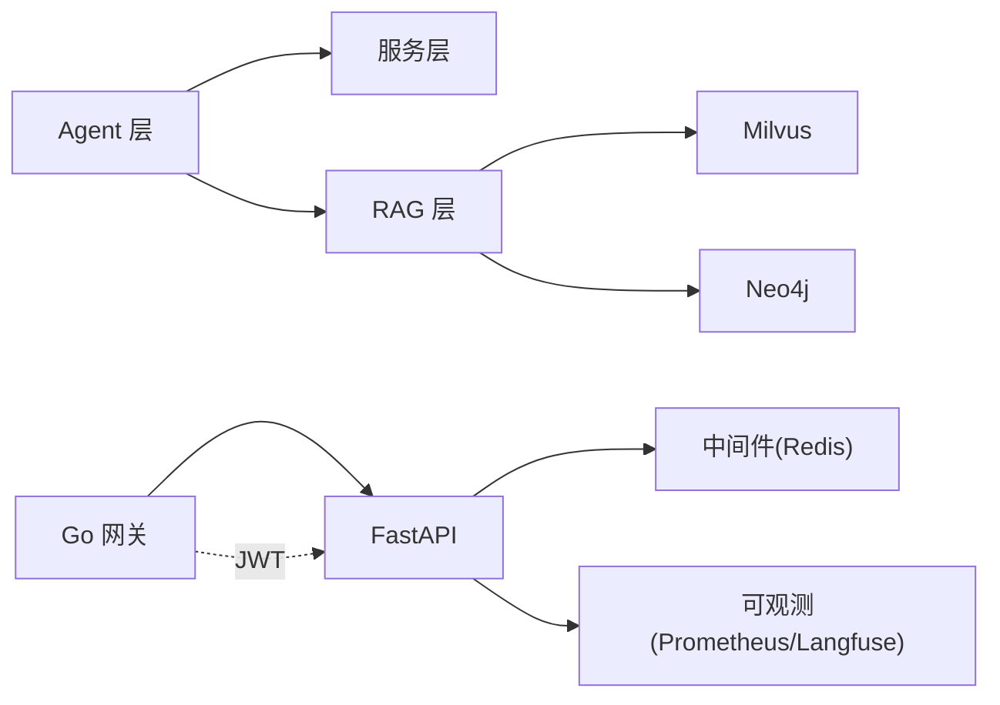

# 架构概览

<cite>
**本文引用的文件**   
- [README.md](file://README.md)
- [main.py](file://backend_design/nexus/main.py)
- [supervisor_graph.py](file://backend_design/nexus/agent/supervisor_graph.py)
- [retriever.py](file://backend_design/nexus/rag/retriever.py)
- [L0-infrastructure.md](file://docs/内部开发存档文档\架构详细设计\L0-infrastructure.md)
- [L1-core.md](file://docs/内部开发存档文档\架构详细设计\L1-core.md)
- [L2-data.md](file://docs/内部开发存档文档\架构详细设计\L2-data.md)
- [L3-service.md](file://docs/内部开发存档文档\架构详细设计\L3-service.md)
- [main.go](file://backend_design/nexus_gate/cmd/main.go)
</cite>

## 目录
1. [引言](#引言)
2. [项目结构](#项目结构)
3. [核心组件](#核心组件)
4. [架构总览](#架构总览)
5. [详细组件分析](#详细组件分析)
6. [依赖关系分析](#依赖关系分析)
7. [性能考量](#性能考量)
8. [故障排查指南](#故障排查指南)
9. [结论](#结论)
10. [附录](#附录)

## 引言
本文件为 NexusCockpit 的架构概览，面向开发者与运维人员，系统性阐述 7 层分层架构（L0-L7）的职责边界、组件关系与数据流；详解 Multi-Agent 工作流（Supervisor + 5 Expert Agents）的设计与执行流程；解释 GraphRAG 三路融合检索（向量+图谱+全文）的实现要点；并说明 Go 并发网关与 Python AI 服务的协作模式。文末提供系统上下文图、组件交互图与关键数据流图，帮助快速建立整体视图。

## 项目结构
NexusCockpit 采用前后端分离与多语言服务组合：
- 前端：Next.js 应用，提供座舱控制台、聊天、数据中台等页面
- 后端：Python FastAPI 服务承载 Agent、RAG、技能、ASR/TTS、MCP 等能力
- 网关：Go 高并发网关，负责鉴权、限流、WebSocket Hub 与反向代理
- 基础设施：Docker Compose 编排 Milvus、Neo4j、Redis、MySQL、Prometheus、Grafana

```mermaid
graph TB
subgraph "前端"
FE["Next.js 应用"]
end
subgraph "网关 (Go)"
GW["nexus_gate<br/>JWT/限流/WS Hub/反向代理"]
end
subgraph "AI 服务 (Python)"
API["FastAPI 应用<br/>路由/中间件/异常处理"]
AG["Agent 编排<br/>Supervisor + Experts"]
RAG["GraphRAG 检索"]
SVC["服务层<br/>ASR/TTS/Skills/Vehicle/Intent/MCP"]
end
subgraph "基础设施 (L0)"
VEC["Milvus"]
GPH["Neo4j"]
RED["Redis"]
DB["MySQL"]
PM["Prometheus"]
GF["Grafana"]
end
FE --> GW
GW --> API
API --> AG
AG --> RAG
AG --> SVC
RAG --> VEC
RAG --> GPH
API --> RED
API --> DB
API --> PM
PM --> GF
```

图表来源
- [main.py:436-658](file://backend_design/nexus/main.py#L436-L658)
- [main.go:134-153](file://backend_design/nexus_gate/cmd/main.go#L134-L153)

章节来源
- [README.md:93-138](file://README.md#L93-L138)

## 核心组件
- 7 层分层架构：从 L0 基础设施到 L7 可观测层，职责清晰、解耦良好
- Multi-Agent 工作流：Supervisor 意图识别与分派，5 位专家并行执行，Responder 汇总生成，Reflection 反思校验，Reviewer 终审与记忆存储
- GraphRAG 检索：向量（Milvus）、图谱（Neo4j）、BM25 全文三路召回，RRF 融合排序，Rerank 重排
- Go 网关：JWT 鉴权、座舱级令牌桶限流、WebSocket Hub、非 AI 请求本地处理、AI 请求反向代理至 FastAPI
- 可观测性：Langfuse 追踪、Prometheus 指标采集与 Grafana 可视化

章节来源
- [README.md:369-439](file://README.md#L369-L439)

## 架构总览
下图展示系统上下文与主要交互路径：前端通过 Go 网关访问 Python 服务；Python 服务内 Agent 编排调用 RAG 与服务层；RAG 对接向量与图谱存储；可观测层贯穿全链路。

```mermaid
sequenceDiagram
participant U as "用户/前端"
participant GW as "Go 网关"
participant API as "FastAPI 应用"
participant AG as "Agent 编排"
participant R as "GraphRAG 检索"
participant S as "服务层(ASR/TTS/Skills/Vehicle/Intent/MCP)"
participant V as "Milvus"
participant G as "Neo4j"
participant O as "可观测(Langfuse/Prometheus/Grafana)"
U->>GW : HTTP/WSS 请求
GW->>API : 鉴权/限流后转发
API->>AG : 调用 SupervisorGraph
AG->>S : 技能/车控/意图路由
AG->>R : 记忆/知识检索
R->>V : 向量检索
R->>G : 图谱检索
R-->>AG : 融合结果
AG-->>API : 响应文本/事件
API-->>GW : 返回结果
GW-->>U : 响应/流式输出
API-.->O : 指标/追踪上报
```

图表来源
- [main.py:436-658](file://backend_design/nexus/main.py#L436-L658)
- [supervisor_graph.py:183-208](file://backend_design/nexus/agent/supervisor_graph.py#L183-L208)
- [retriever.py:128-140](file://backend_design/nexus/rag/retriever.py#L128-L140)

## 详细组件分析

### 7 层分层架构（L0-L7）
- L0 基础设施层：容器化部署 Milvus、Neo4j、Redis、MySQL、Prometheus、Grafana，支持双模式（本地/云端）
- L1 核心层：配置中心、结构化日志、异常体系、熔断器、JWT 认证、个性化服务
- L2 数据层：GraphRAG 引擎、记忆系统、数据模型（状态/Schema）
- L3 服务层：ASR/TTS、Skills、Vehicle、Intent、MCP
- L4 Agent 层：Supervisor + 5 Expert Agents + Responder + Reflection + Reviewer
- L5 中间件层：语义缓存、限流、会话存储、异步任务、熔断器
- L6 API 层：FastAPI REST/SSE/WebSocket、统一错误格式、CORS、指标挂载
- L7 可观测层：Langfuse 追踪、Prometheus 指标、Grafana 面板

```mermaid
flowchart TD
L7["L7 可观测层<br/>Langfuse/Prometheus/Grafana"] --> L6["L6 API 层<br/>FastAPI/SSE/WebSocket/JWT"]
L6 --> L5["L5 中间件层<br/>语义缓存/限流/会话/熔断"]
L5 --> L4["L4 Agent 层<br/>Supervisor+Experts+Responder+Reflection+Reviewer"]
L4 --> L3["L3 服务层<br/>ASR/TTS/Skills/Vehicle/Intent/MCP"]
L3 --> L2["L2 数据层<br/>GraphRAG/记忆/模型"]
L2 --> L1["L1 核心层<br/>配置/日志/异常/熔断/JWT/个性化"]
L1 --> L0["L0 基础设施层<br/>Milvus/Neo4j/Redis/MySQL/Prometheus/Grafana"]
```

图表来源
- [L0-infrastructure.md:1-75](file://docs/内部开发存档文档\架构详细设计\L0-infrastructure.md#L1-L75)
- [L1-core.md:1-131](file://docs/内部开发存档文档\架构详细设计\L1-core.md#L1-L131)
- [L2-data.md:1-241](file://docs/内部开发存档文档\架构详细设计\L2-data.md#L1-L241)
- [L3-service.md:1-198](file://docs/内部开发存档文档\架构详细设计\L3-service.md#L1-L198)

章节来源
- [L0-infrastructure.md:1-75](file://docs/内部开发存档文档\架构详细设计\L0-infrastructure.md#L1-L75)
- [L1-core.md:1-131](file://docs/内部开发存档文档\架构详细设计\L1-core.md#L1-L131)
- [L2-data.md:1-241](file://docs/内部开发存档文档\架构详细设计\L2-data.md#L1-L241)
- [L3-service.md:1-198](file://docs/内部开发存档文档\架构详细设计\L3-service.md#L1-L198)

### Multi-Agent 工作流（Supervisor + 5 Expert Agents）
- 入口：SupervisorGraph 编排 LangGraph StateGraph，定义节点与边
- 节点：SupervisorNode（记忆召回+意图路由+专家分派）、DispatchNode（并行执行）、ResponderNode（汇总+LLM 合成）、ReflectionNode（事实性/一致性/幻觉检查）、ReviewerNode（质量检查+记忆存储）
- 专家：Vehicle、Navigation、Lifestyle、Health、Chat 五类专家，基于 SkillRegistry 调用具体技能
- 输出：全链路强制闭环，所有分支均经过 Reflection + Reviewer + Output Gateway 校验

```mermaid
classDiagram
class SupervisorGraph {
+invoke(state) SupervisorState
+stream(state) AsyncGenerator[str]
+stream_with_events(state) AsyncGenerator[dict]
}
class NodeContext {
+intent_router
+memory_manager
+skill_registry
+llm_client
+chat_model
+experts
+responder
+reviewer
+prompt_manager
+checkpoint_saver
}
class SupervisorNode {
+run(state) dict
+route(state) str
}
class DispatchNode {
+run(state) dict
}
class ResponderNode {
+run(state) dict
+generate_llm_response(state) str
+synthesize_tool_response(state) str
}
class ReflectionNode {
+run(state) dict
}
class ReviewerNode {
+run(state) dict
}
class BaseExpertAgent {
+expert_name
+group
+run(state) dict
-_execute(state) dict
}
class VehicleExpert
class NavExpert
class LifestyleExpert
class HealthExpert
class ChatExpert
SupervisorGraph --> NodeContext : "持有"
SupervisorGraph --> SupervisorNode : "创建"
SupervisorGraph --> DispatchNode : "创建"
SupervisorGraph --> ResponderNode : "创建"
SupervisorGraph --> ReflectionNode : "创建"
SupervisorGraph --> ReviewerNode : "创建"
BaseExpertAgent <|-- VehicleExpert
BaseExpertAgent <|-- NavExpert
BaseExpertAgent <|-- LifestyleExpert
BaseExpertAgent <|-- HealthExpert
BaseExpertAgent <|-- ChatExpert
```

图表来源
- [supervisor_graph.py:93-179](file://backend_design/nexus/agent/supervisor_graph.py#L93-L179)
- [base.py:26-140](file://backend_design/nexus/agent/experts/base.py#L26-L140)

章节来源
- [supervisor_graph.py:183-208](file://backend_design/nexus/agent/supervisor_graph.py#L183-L208)
- [supervisor_graph.py:209-384](file://backend_design/nexus/agent/supervisor_graph.py#L209-L384)
- [supervisor_graph.py:386-617](file://backend_design/nexus/agent/supervisor_graph.py#L386-L617)
- [base.py:26-140](file://backend_design/nexus/agent/experts/base.py#L26-L140)

### GraphRAG 三路融合检索（向量+图谱+全文）
- 三路召回：Milvus 向量检索、Neo4j 图谱关系遍历、BM25 全文匹配
- 融合策略：RRF（Reciprocal Rank Fusion）对三路结果进行加权排序
- 重排：bge-reranker-v2-m3 对 Top-N 结果进行二次重排
- 使用场景：用户记忆召回、食材库检索、混合查询

```mermaid
flowchart TD
Q["Query"] --> V["向量路(Milvus)<br/>语义相似度召回"]
Q --> G["图谱路(Neo4j)<br/>关系遍历召回"]
Q --> B["BM25路<br/>全文关键词匹配"]
V --> F["RRF 融合排序"]
G --> F
B --> F
F --> R["Rerank(bge-reranker-v2-m3)<br/>Top-K 重排"]
R --> OUT["最终结果"]
```

图表来源
- [retriever.py:48-87](file://backend_design/nexus/rag/retriever.py#L48-L87)
- [retriever.py:150-182](file://backend_design/nexus/rag/retriever.py#L150-L182)

章节来源
- [retriever.py:128-140](file://backend_design/nexus/rag/retriever.py#L128-L140)
- [L2-data.md:90-135](file://docs/内部开发存档文档\架构详细设计\L2-data.md#L90-L135)

### Go 并发网关与 Python AI 服务协作
- 网关职责：JWT 鉴权、座舱级令牌桶限流、WebSocket Hub、非 AI 请求本地处理、AI 请求反向代理
- 启动流程：加载 .env → 初始化代理与 WS Hub → 创建限流器 → 设置路由 → 启动 HTTP 服务 → 优雅关闭
- 与 Python 服务集成：共享 JWT 密钥，确保签名一致；健康检查与健康探针独立

```mermaid
sequenceDiagram
participant FE as "前端"
participant GW as "Go 网关"
participant PY as "Python FastAPI"
FE->>GW : 请求(/auth,/health 或 /cockpit/*)
alt 非 AI 请求
GW-->>FE : 本地处理并返回
else AI 请求
GW->>GW : JWT 鉴权 + 限流
GW->>PY : 反向代理转发
PY-->>GW : 响应/流式
GW-->>FE : 透传响应
end
```

图表来源
- [main.go:134-153](file://backend_design/nexus_gate/cmd/main.go#L134-L153)

章节来源
- [main.go:43-153](file://backend_design/nexus_gate/cmd/main.go#L43-L153)

### FastAPI 应用生命周期与中间件
- 生命周期：启动时初始化 Embedding、向量/图谱存储、车控适配器、语义缓存、限流器、会话存储、Langfuse、Agent 工作流、Cherry KB、任务池、MySQL、CockpitManager、数据保留策略、llama.cpp 子进程、MCP Server、提醒扫描器、ASR/TTS 后台预加载；关闭时有序清理资源
- 中间件：CORS、CockpitContextMiddleware（提取 X-Cockpit-Id、计时、Prometheus 指标）、全局异常处理器（统一错误格式）

```mermaid
flowchart TD
Start(["应用启动"]) --> InitCfg["初始化配置/日志/指标"]
InitCfg --> InitEmbed["初始化 Embedding 服务"]
InitEmbed --> InitVec["连接 Milvus"]
InitVec --> InitGraph["连接 Neo4j"]
InitGraph --> InitVehicle["初始化车控适配器"]
InitVehicle --> InitCache["初始化 Redis 语义缓存"]
InitCache --> InitRate["初始化限流器"]
InitRate --> InitSession["初始化会话存储"]
InitSession --> InitLangfuse["初始化 Langfuse"]
InitLangfuse --> InitAgent["初始化 SupervisorGraph"]
InitAgent --> InitKB["初始化 Cherry KB"]
InitKB --> InitTaskPool["初始化 GenerationTaskPool"]
InitTaskPool --> InitDB["初始化 MySQL"]
InitDB --> InitCockpit["初始化 CockpitManager"]
InitCockpit --> InitRetention["启动数据保留策略"]
InitRetention --> InitLlama["启动 llama.cpp 子进程(可选)"]
InitLlama --> InitMCP["启动 MCP Server"]
InitMCP --> InitReminder["启动提醒扫描器"]
InitReminder --> PreloadASR["后台预加载 ASR/TTS"]
PreloadASR --> Ready(["服务就绪"])
Ready --> Shutdown(["应用关闭"])
Shutdown --> Cleanup["有序清理资源"]
```

图表来源
- [main.py:75-433](file://backend_design/nexus/main.py#L75-L433)

章节来源
- [main.py:436-658](file://backend_design/nexus/main.py#L436-L658)

## 依赖关系分析
- 组件耦合：
  - Agent 层依赖 L3 服务层（SkillRegistry、VehicleAdapter、IntentRouter）
  - RAG 层依赖 L0 基础设施（Milvus、Neo4j），并通过工厂抽象实现双模式切换
  - 中间件层（语义缓存、限流、会话存储）依赖 Redis
  - 可观测层通过 Prometheus/Langfuse 收集指标与追踪
- 外部依赖：
  - Go 网关与 Python 服务共享 JWT 密钥
  - ASR/TTS 模型文件位于 models/ 目录，按需加载
  - 中间件通过 Docker Compose 管理

```mermaid
graph LR
AG["Agent 层"] --> SVC["服务层"]
AG --> RAG["RAG 层"]
RAG --> VEC["Milvus"]
RAG --> GPH["Neo4j"]
API["FastAPI"] --> MID["中间件(Redis)"]
API --> OBS["可观测(Prometheus/Langfuse)"]
GW["Go 网关"] --> API
GW -.JWT.-> API
```

图表来源
- [main.py:436-658](file://backend_design/nexus/main.py#L436-L658)
- [retriever.py:48-87](file://backend_design/nexus/rag/retriever.py#L48-L87)

章节来源
- [L2-data.md:1-241](file://docs/内部开发存档文档\架构详细设计\L2-data.md#L1-L241)
- [L3-service.md:1-198](file://docs/内部开发存档文档\架构详细设计\L3-service.md#L1-L198)

## 性能考量
- 并发与流式：Go 网关高并发低内存；Python 侧 SSE 流式输出，GenerationTaskPool 将 pipeline 与 SSE 连接解耦，客户端断连不中断生成
- 缓存与降级：Redis 语义缓存（副作用隔离）、LLM 自动降级（云端→本地 llama.cpp）、向量/图谱连接失败不阻塞启动
- 资源预热：ASR/TTS 模型后台预加载，避免阻塞启动；Checkpoint SQLite 持久化 Agent 状态
- 指标与监控：Prometheus 指标采集覆盖 API 延迟、Agent 耗时、缓存命中率；Grafana 可视化看板

章节来源
- [main.py:317-433](file://backend_design/nexus/main.py#L317-L433)
- [README.md:369-439](file://README.md#L369-L439)

## 故障排查指南
- 常见问题定位：
  - JWT 不一致：确认 Go 网关与 Python 服务使用相同 JWT_SECRET_KEY
  - Milvus/Neo4j 不可用：启动阶段记录警告，运行时降级处理；检查端口与网络
  - LLM 不可用：触发 429 错误短路，走完整 Reviewer + Output Gateway 兜底
  - 语义缓存命中导致车控指令未执行：启动时清理旧缓存条目
- 诊断工具：
  - 健康检查：/health（Python）、/health（Go）
  - 指标端点：/metrics（Prometheus）
  - 日志：结构化日志文件、Go 网关日志文件

章节来源
- [main.py:503-597](file://backend_design/nexus/main.py#L503-L597)
- [main.go:155-201](file://backend_design/nexus_gate/cmd/main.go#L155-L201)

## 结论
NexusCockpit 以清晰的 7 层分层架构为基础，结合 Multi-Agent 协同与 GraphRAG 融合检索，构建了高可用、可扩展的车载语音 Agent 平台。Go 网关与 Python 服务分工明确，前者专注高并发与安全控制，后者聚焦 AI 能力与业务编排。通过完善的可观测性与降级策略，系统在复杂车载场景中具备稳健的运行表现与良好的扩展性。

## 附录
- 技术选型权衡：
  - FastAPI：异步原生、自动文档，适合 AI 服务
  - LangGraph：有状态图与条件路由，适合 Agent 编排
  - Milvus/Neo4j：开源、生态完善，支持本地与云端双模式
  - Redis：语义缓存与限流，轻量高效
  - bge-reranker-v2-m3：高质量重排，提升检索效果
  - Gin/gorilla/websocket：高并发与 WebSocket 支持
  - Next.js/Zustand/Tailwind：现代前端栈，开发体验佳

章节来源
- [README.md:442-461](file://README.md#L442-L461)