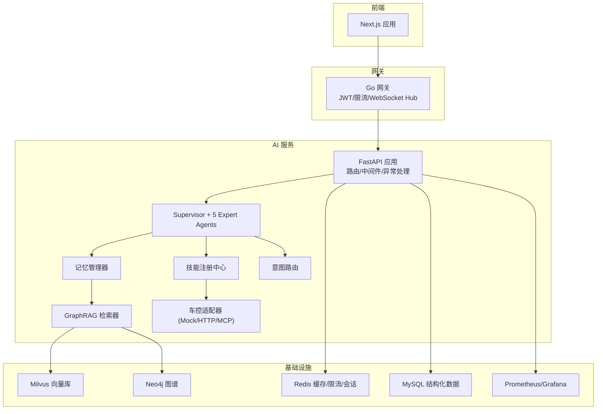
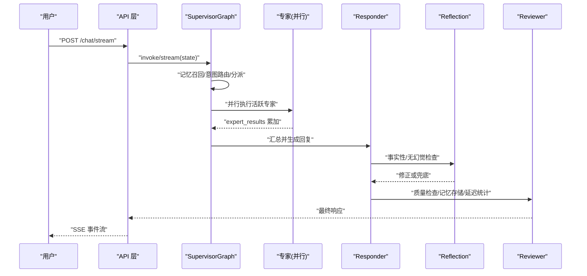
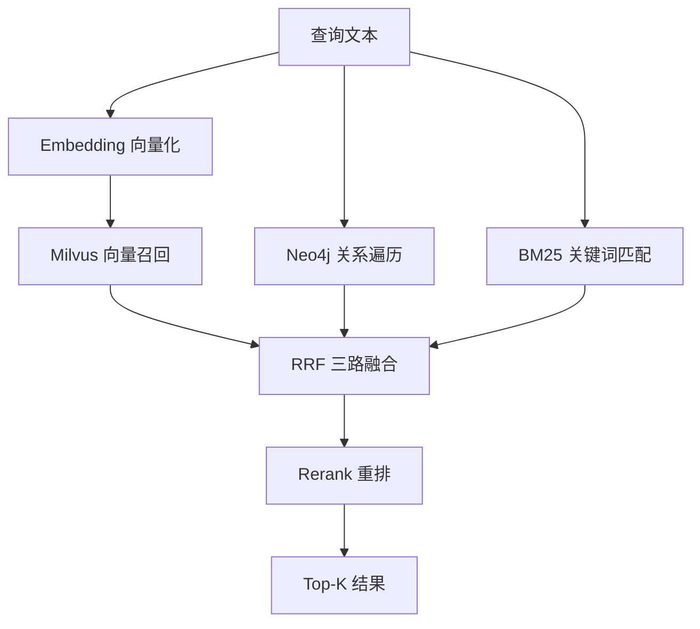
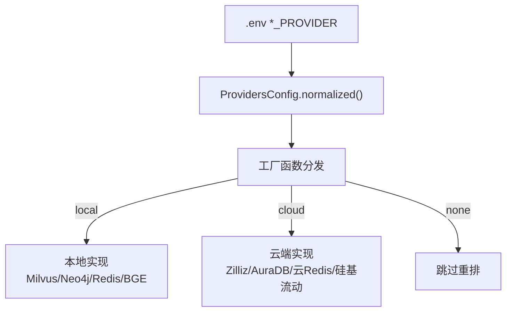
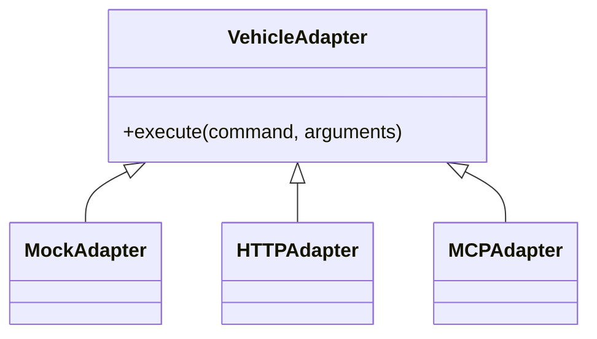
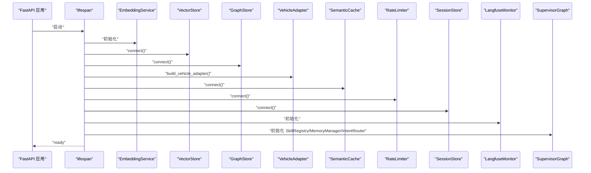
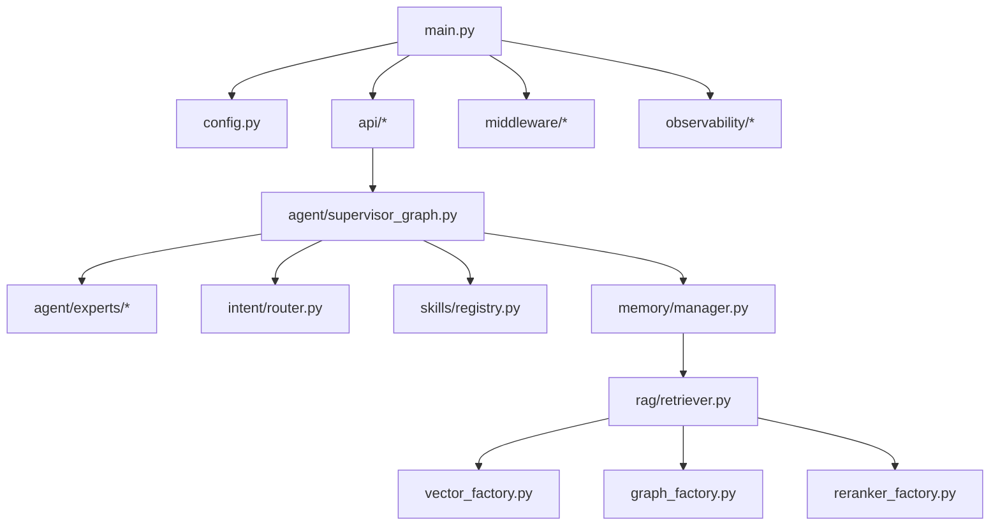

# 架构特色与设计理念

<cite>
**本文引用的文件**   
- [README.md](file://README.md)
- [L0-infrastructure.md](file://docs/architecture/L0-infrastructure.md)
- [L1-core.md](file://docs/architecture/L1-core.md)
- [L2-data.md](file://docs/architecture/L2-data.md)
- [L3-service.md](file://docs/architecture/L3-service.md)
- [L4-agent.md](file://docs/architecture/L4-agent.md)
- [L5-middleware.md](file://docs/architecture/L5-middleware.md)
- [L6-api.md](file://docs/architecture/L6-api.md)
- [L7-observability.md](file://docs/architecture/L7-observability.md)
- [main.py](file://backend_design/nexus/main.py)
- [config.py](file://backend_design/nexus/config.py)
- [supervisor_graph.py](file://backend_design/nexus/agent/supervisor_graph.py)
- [state.py](file://backend_design/nexus/models/state.py)
- [retriever.py](file://backend_design/nexus/rag/retriever.py)
- [unified_retriever.py](file://backend_design/nexus/rag/unified_retriever.py)
- [manager.py](file://backend_design/nexus/memory/manager.py)
- [__init__.py](file://backend_design/nexus/agent/experts/__init__.py)
- [base.py](file://backend_design/nexus/agent/experts/base.py)
</cite>

## 目录
1. [引言](#引言)
2. [项目结构](#项目结构)
3. [核心组件](#核心组件)
4. [架构总览](#架构总览)
5. [详细组件分析](#详细组件分析)
6. [依赖关系分析](#依赖关系分析)
7. [性能与可扩展性](#性能与可扩展性)
8. [故障排查指南](#故障排查指南)
9. [结论](#结论)
10. [附录](#附录)

## 引言
本文件面向架构师与高级开发者，系统性阐述 NexusCockpit 的架构特色与设计理念。重点覆盖：
- 7 层分层架构（L0-L7）的职责划分与边界
- Multi-Agent Supervisor-Expert 模式的设计优势与执行流程
- GraphRAG 三路融合检索的技术创新与数据流
- 双模式部署（本地 Docker ⇄ 云端 API/AK·SK）的适配机制
- MCP 协议适配在车控总线中的角色
- 系统边界、组件交互关系与数据流向图
- 高并发、可扩展性与可维护性的工程实践

## 项目结构
NexusCockpit 采用前后端分离与多语言协作：
- 后端 Python AI 服务（FastAPI + LangGraph）位于 backend_design/nexus
- Go 并发网关位于 backend_design/nexus_gate
- 前端 Next.js 应用位于 frontend_design
- 文档与配置集中于 docs/ 与 config/

图表来源
- [main.py:294-433](file://backend_design/nexus/main.py#L294-L433)
- [L6-api.md:1-237](file://docs/architecture/L6-api.md#L1-L237)
- [L4-agent.md:1-250](file://docs/architecture/L4-agent.md#L1-L250)
- [L2-data.md:1-241](file://docs/architecture/L2-data.md#L1-L241)
- [L3-service.md:1-196](file://docs/architecture/L3-service.md#L1-L196)
- [L0-infrastructure.md:1-75](file://docs/architecture/L0-infrastructure.md#L1-L75)

章节来源
- [README.md:95-142](file://README.md#L95-L142)
- [L0-infrastructure.md:1-75](file://docs/architecture/L0-infrastructure.md#L1-L75)

## 核心组件
- 应用入口与生命周期管理：创建 FastAPI 实例、初始化 Embedding/向量/图谱存储、车控适配器、语义缓存、限流、会话、Langfuse、Agent 工作流、数据保留策略等；注册路由、挂载指标与静态资源、全局异常处理与上下文中间件。
- 配置中心：集中管理 LLM、Milvus、Neo4j、Redis、MySQL、车控、ASR/TTS、可观测性等配置；支持 ProvidersConfig 控制“本地⇄云端”切换。
- Agent 编排：SupervisorGraph 基于 LangGraph StateGraph 构建，负责记忆召回、意图路由、专家分派、并行执行、汇总生成、反思校验与审查。
- GraphRAG 检索：三路融合（向量+图谱+BM25），RRF 融合后 Rerank 重排；统一检索路由支持 memory/knowledge/hybrid/auto。
- 记忆系统：渐进式披露、异步非阻塞存储、冲突检测、上下文压缩。
- 中间件：语义缓存（RediSearch KNN）、滑动窗口限流（Lua 原子化）、会话持久化、进程内异步任务。
- API 层：REST/SSE/WebSocket、JWT 认证、统一响应格式、健康检查、管理接口、座舱级路由。
- 可观测性：Langfuse 追踪、Prometheus 指标、Grafana 面板、结构化日志。

章节来源
- [main.py:61-292](file://backend_design/nexus/main.py#L61-L292)
- [config.py:458-489](file://backend_design/nexus/config.py#L458-L489)
- [supervisor_graph.py:1-75](file://backend_design/nexus/agent/supervisor_graph.py#L1-L75)
- [retriever.py:1-68](file://backend_design/nexus/rag/retriever.py#L1-L68)
- [unified_retriever.py:1-81](file://backend_design/nexus/rag/unified_retriever.py#L1-L81)
- [manager.py:99-131](file://backend_design/nexus/memory/manager.py#L99-L131)
- [L5-middleware.md:1-172](file://docs/architecture/L5-middleware.md#L1-L172)
- [L6-api.md:1-237](file://docs/architecture/L6-api.md#L1-L237)
- [L7-observability.md:1-134](file://docs/architecture/L7-observability.md#L1-L134)

## 架构总览
7 层分层架构职责清晰、边界明确，便于演进与维护：
- L0 基础设施：容器编排与中间件（Milvus/Neo4j/Redis/MySQL/Prometheus/Grafana）
- L1 核心层：配置中心、日志、异常、熔断、JWT、个性化服务
- L2 数据层：GraphRAG、记忆系统、数据模型
- L3 服务层：ASR/TTS、技能系统、车控总线、意图路由、MCP 网关
- L4 Agent 层：Supervisor + 5 Expert Agents、Responder、Reflection、Reviewer
- L5 中间件层：语义缓存、限流、会话、异步任务
- L6 API 层：REST/SSE/WebSocket、JWT、统一错误、健康检查
- L7 可观测层：Langfuse、Prometheus、Grafana、结构化日志

图表来源
- [L0-infrastructure.md:1-75](file://docs/architecture/L0-infrastructure.md#L1-L75)
- [L1-core.md:1-131](file://docs/architecture/L1-core.md#L1-L131)
- [L2-data.md:1-241](file://docs/architecture/L2-data.md#L1-L241)
- [L3-service.md:1-196](file://docs/architecture/L3-service.md#L1-L196)
- [L4-agent.md:1-250](file://docs/architecture/L4-agent.md#L1-L250)
- [L5-middleware.md:1-172](file://docs/architecture/L5-middleware.md#L1-L172)
- [L6-api.md:1-237](file://docs/architecture/L6-api.md#L1-L237)
- [L7-observability.md:1-134](file://docs/architecture/L7-observability.md#L1-L134)

## 详细组件分析

### 7 层分层架构与边界定义
- L0 基础设施：提供 Milvus/Neo4j/Redis/MySQL/Prometheus/Grafana 的容器化部署与健康检查；支持通过 ProvidersConfig 将部分组件切换到云端托管。
- L1 核心层：零业务逻辑、全局单例配置、路径解析、安全警告、双模式开关。
- L2 数据层：GraphRAG 三路融合、Rerank、Cherry KB、UnifiedRetriever、记忆管理器与压缩/冲突检测。
- L3 服务层：ASR/TTS、19 个技能、车控三模适配（Mock/HTTP/MCP）、意图三级降级路由。
- L4 Agent 层：Supervisor 调度、5 专家并行、Responder 汇总、Reflection 事实性检查、Reviewer 质量与记忆存储。
- L5 中间件层：语义缓存（KNN）、限流（Lua 原子化）、会话持久化、进程内异步任务。
- L6 API 层：REST/SSE/WebSocket、JWT、统一响应、健康检查、管理接口、座舱级路由。
- L7 可观测层：Langfuse 全链路追踪、Prometheus 指标、Grafana 面板、结构化日志。

章节来源
- [L0-infrastructure.md:1-75](file://docs/architecture/L0-infrastructure.md#L1-L75)
- [L1-core.md:1-131](file://docs/architecture/L1-core.md#L1-L131)
- [L2-data.md:1-241](file://docs/architecture/L2-data.md#L1-L241)
- [L3-service.md:1-196](file://docs/architecture/L3-service.md#L1-L196)
- [L4-agent.md:1-250](file://docs/architecture/L4-agent.md#L1-L250)
- [L5-middleware.md:1-172](file://docs/architecture/L5-middleware.md#L1-L172)
- [L6-api.md:1-237](file://docs/architecture/L6-api.md#L1-L237)
- [L7-observability.md:1-134](file://docs/architecture/L7-observability.md#L1-L134)

### Multi-Agent Supervisor-Expert 模式
- Supervisor 节点：记忆召回、意图路由、澄清判断、专家分派决策。
- 专家并行：Vehicle/Nav/Lifestyle/Health/Chat 五类专家并行执行，结果自动累加。
- Responder：汇总专家输出，LLM 生成回复，v2.2.5 引入预校验与后校验防止幻觉。
- Reflection/Reviewer：事实性/一致性检查与质量评估，触发记忆存储与延迟统计。

图表来源
- [supervisor_graph.py:1-75](file://backend_design/nexus/agent/supervisor_graph.py#L1-L75)
- [state.py:1-40](file://backend_design/nexus/models/state.py#L1-L40)
- [__init__.py:1-36](file://backend_design/nexus/agent/experts/__init__.py#L1-L36)
- [base.py:1-44](file://backend_design/nexus/agent/experts/base.py#L1-L44)
- [L4-agent.md:1-250](file://docs/architecture/L4-agent.md#L1-L250)

章节来源
- [supervisor_graph.py:1-75](file://backend_design/nexus/agent/supervisor_graph.py#L1-L75)
- [state.py:1-40](file://backend_design/nexus/models/state.py#L1-L40)
- [L4-agent.md:1-250](file://docs/architecture/L4-agent.md#L1-L250)

### GraphRAG 三路融合检索
- 三路召回：向量路（Milvus 语义相似度）、图谱路（Neo4j 关系遍历）、BM25 全文匹配。
- 融合策略：RRF 排名倒数加权求和。
- 二次排序：bge-reranker-v2-m3 对 Top-N 重排。
- 统一路由：根据 query_type 分发至 GraphRAG 或 Cherry KB，支持混合检索。

图表来源
- [retriever.py:1-68](file://backend_design/nexus/rag/retriever.py#L1-L68)
- [unified_retriever.py:1-81](file://backend_design/nexus/rag/unified_retriever.py#L1-L81)
- [L2-data.md:90-127](file://docs/architecture/L2-data.md#L90-L127)

章节来源
- [retriever.py:1-68](file://backend_design/nexus/rag/retriever.py#L1-L68)
- [unified_retriever.py:1-81](file://backend_design/nexus/rag/unified_retriever.py#L1-L81)
- [L2-data.md:90-127](file://docs/architecture/L2-data.md#L90-L127)

### 双模式部署（本地 Docker ⇄ 云端 API）
- 配置开关：ProvidersConfig 控制 vector_store/graph_store/cache/reranker 的 local/cloud/none 模式。
- 工厂分发：build_vector_store/build_graph_store/build_reranker 按环境变量选择实现。
- 连接差异：云端仅覆写 connect() 使用 URI+Token 或加密 URI；云 Redis 无 RediSearch 时自动 scan 降级。
- 一键切换：修改 .env 即可从本地 Docker 切换到 Zilliz/AuraDB/云 Redis/硅基流动 Rerank。

图表来源
- [config.py:458-489](file://backend_design/nexus/config.py#L458-L489)
- [L2-data.md:42-84](file://docs/architecture/L2-data.md#L42-L84)
- [L5-middleware.md:50-58](file://docs/architecture/L5-middleware.md#L50-L58)

章节来源
- [config.py:458-489](file://backend_design/nexus/config.py#L458-L489)
- [L2-data.md:42-84](file://docs/architecture/L2-data.md#L42-L84)
- [L5-middleware.md:50-58](file://docs/architecture/L5-middleware.md#L50-L58)

### MCP 协议适配机制
- 车控总线适配器：MockAdapter/HTTPAdapter/MCPAdapter 统一暴露 execute 接口。
- MCP 网关：工具注册、发现、调用与安全白名单。
- 工厂选择：根据 VEHICLE_ADAPTER 环境变量动态构建适配器。

图表来源
- [L3-service.md:143-162](file://docs/architecture/L3-service.md#L143-L162)
- [L3-service.md:183-196](file://docs/architecture/L3-service.md#L183-L196)

章节来源
- [L3-service.md:143-162](file://docs/architecture/L3-service.md#L143-L162)
- [L3-service.md:183-196](file://docs/architecture/L3-service.md#L183-L196)

### 应用启动与依赖注入
- lifespan 中完成所有关键组件初始化与连接，失败不阻断服务启动但记录告警。
- app.state 注入服务实例，供路由与中间件按需访问。
- 挂载 Prometheus 指标、静态音频、全局异常处理器与上下文中间件。

图表来源
- [main.py:61-292](file://backend_design/nexus/main.py#L61-L292)

章节来源
- [main.py:61-292](file://backend_design/nexus/main.py#L61-L292)

## 依赖关系分析
- 组件耦合：API 层依赖中间件与 Agent 层；Agent 层依赖服务层与数据层；数据层依赖基础设施。
- 直接依赖：main.py 聚合各模块初始化；SupervisorGraph 依赖 IntentRouter、SkillRegistry、MemoryManager。
- 间接依赖：GraphRAG 通过工厂选择具体存储实现；车控适配器通过工厂选择通信协议。
- 外部集成：LLM/Embedding/Rerank 可通过 ProvidersConfig 切换云端；监控通过 Prometheus/Grafana/Langfuse。

图表来源
- [main.py:294-433](file://backend_design/nexus/main.py#L294-L433)
- [supervisor_graph.py:1-75](file://backend_design/nexus/agent/supervisor_graph.py#L1-L75)
- [retriever.py:1-68](file://backend_design/nexus/rag/retriever.py#L1-L68)

章节来源
- [main.py:294-433](file://backend_design/nexus/main.py#L294-L433)
- [supervisor_graph.py:1-75](file://backend_design/nexus/agent/supervisor_graph.py#L1-L75)
- [retriever.py:1-68](file://backend_design/nexus/rag/retriever.py#L1-L68)

## 性能与可扩展性
- 高并发
  - Go 网关：Gin + gorilla/websocket 提供高并发接入与 WebSocket Hub。
  - FastAPI 异步原生：SSE/WebSocket 流式响应，减少阻塞。
  - 语义缓存：RediSearch KNN O(log n)，显著降低 LLM 调用与数据库压力。
  - 限流：Redis Lua 原子化滑动窗口，保护后端稳定。
- 可扩展性
  - 工厂模式：向量/图谱/重排/车控适配器均通过工厂按 Provider 动态选择实现。
  - 技能系统：装饰器自动注册，新增技能无需改动主流程。
  - 多座舱：CockpitContextMiddleware 提取 X-Cockpit-Id，隔离上下文。
- 可维护性
  - 分层清晰：L0-L7 职责单一，便于定位问题与演进。
  - 配置集中：Pydantic Settings 类型安全，生产环境安全检查。
  - 可观测：Langfuse 全链路追踪 + Prometheus 指标 + Grafana 面板。

[本节为通用指导，不直接分析具体文件]

## 故障排查指南
- 启动阶段
  - 向量/图谱连接失败不阻断启动，需检查健康检查端点与日志。
  - Agent 初始化失败会记录错误，聊天功能不可用。
- 运行时
  - 语义缓存未命中：确认 RediSearch 是否可用，必要时回退到 O(n) 模式。
  - 限流触发：检查 RateLimitError 返回码与 Retry-After 头。
  - 鉴权失败：AuthError 返回 401，检查 JWT Secret 与 Token 有效性。
- 可观测
  - 查看 Prometheus 指标与 Grafana 面板，定位延迟热点与错误率。
  - 使用 Langfuse 追踪 LLM 调用链与 Agent 节点耗时。

章节来源
- [main.py:354-396](file://backend_design/nexus/main.py#L354-L396)
- [L5-middleware.md:67-88](file://docs/architecture/L5-middleware.md#L67-L88)
- [L7-observability.md:1-134](file://docs/architecture/L7-observability.md#L1-L134)

## 结论
NexusCockpit 以清晰的 7 层分层架构为基础，结合 Multi-Agent Supervisor-Expert 模式与 GraphRAG 三路融合检索，实现了高可用、高性能与强扩展的车载语音 Agent 平台。双模式部署与 MCP 适配进一步提升了系统的灵活性与生态兼容性。配合完善的可观测体系与工程化规范，系统具备较高的技术成熟度与持续演进潜力。

[本节为总结性内容，不直接分析具体文件]

## 附录
- 快速开始与部署方式详见 README 与部署文档。
- 学习路线图与架构文档索引见 docs/architecture/README.md。

[本节为导航性内容，不直接分析具体文件]