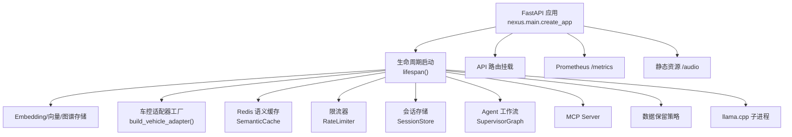
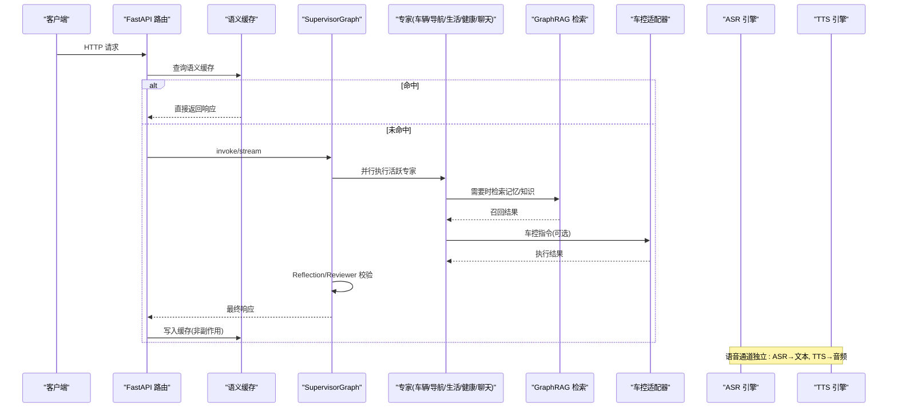
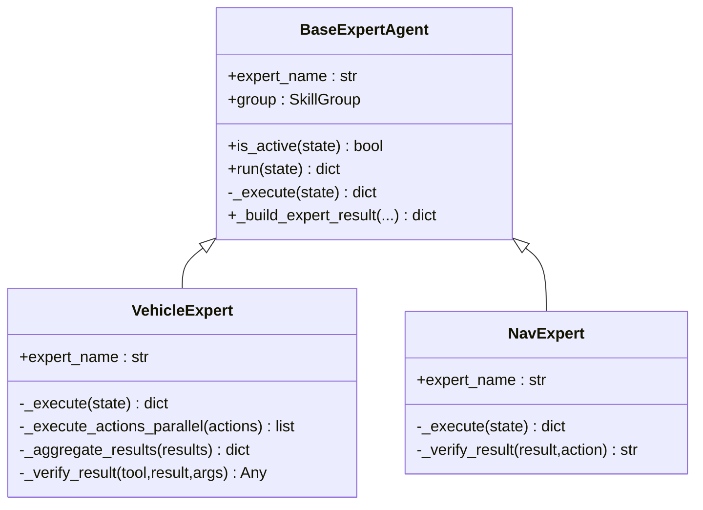
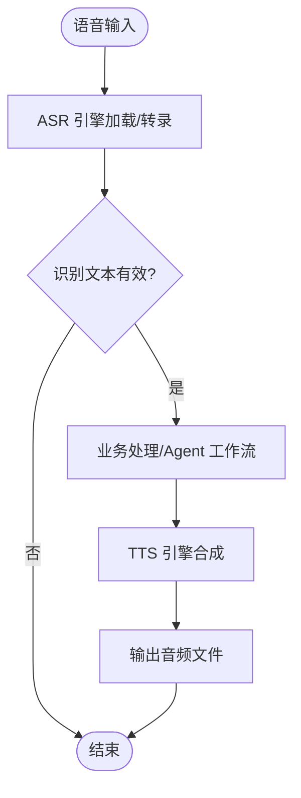
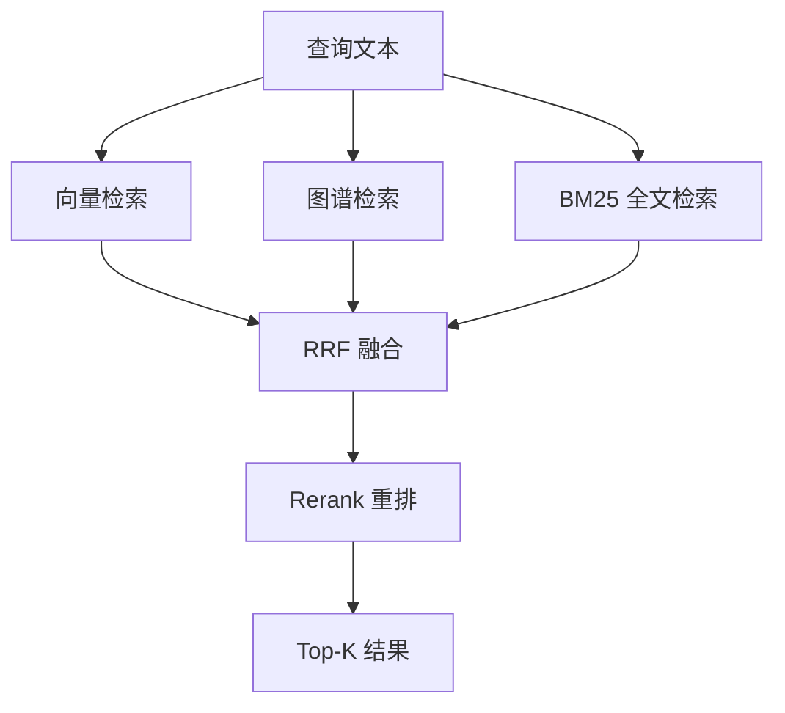
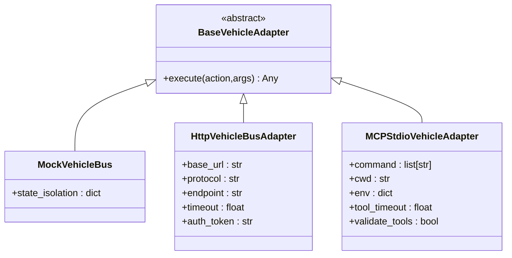
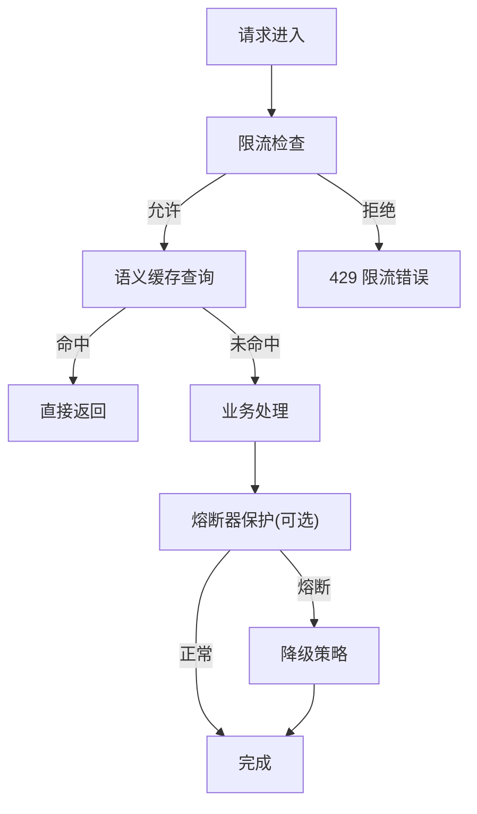
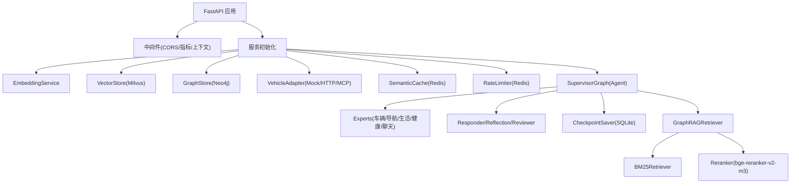

# 核心功能

<cite>
**本文引用的文件**   
- [main.py](file://backend_design/nexus/main.py)
- [supervisor_graph.py](file://backend_design/nexus/agent/supervisor_graph.py)
- [base.py](file://backend_design/nexus/agent/experts/base.py)
- [vehicle_expert.py](file://backend_design/nexus/agent/experts/vehicle_expert.py)
- [nav_expert.py](file://backend_design/nexus/agent/experts/nav_expert.py)
- [engine.py](file://backend_design/nexus/asr/engine.py)
- [engine.py](file://backend_design/nexus/tts/engine.py)
- [voiceprint.py](file://backend_design/nexus/core/voiceprint.py)
- [retriever.py](file://backend_design/nexus/rag/retriever.py)
- [reranker.py](file://backend_design/nexus/rag/reranker.py)
- [factory.py](file://backend_design/nexus/vehicle/factory.py)
- [redis_cache.py](file://backend_design/nexus/middleware/redis_cache.py)
- [rate_limiter.py](file://backend_design/nexus/middleware/rate_limiter.py)
- [circuit_breaker.py](file://backend_design/nexus/core/circuit_breaker.py)
</cite>

## 目录
1. [简介](#简介)
2. [项目结构](#项目结构)
3. [核心组件](#核心组件)
4. [架构总览](#架构总览)
5. [详细组件分析](#详细组件分析)
6. [依赖关系分析](#依赖关系分析)
7. [性能考量](#性能考量)
8. [故障排查指南](#故障排查指南)
9. [结论](#结论)
10. [附录](#附录)

## 简介
本文件面向开发者，系统性介绍 NexusCockpit 的核心能力与实现要点，覆盖以下关键主题：
- Multi-Agent 协同系统：五大专家角色（车辆、导航、生活、健康、聊天）的职责与协作机制。
- 语音交互系统：ASR 识别、TTS 合成与声纹识别的实现原理与配置要点。
- GraphRAG 智能检索：三路融合策略（向量、图谱、BM25）与重排算法（RRF + Rerank）。
- 车控系统适配器：Mock/HTTP/MCP 三模式适配器的设计思路与使用方式。
- 中间件能力：语义缓存、限流保护、熔断降级等保障系统稳定性的关键机制。

每个模块均包含技术实现要点、配置选项与使用示例路径，帮助快速理解与落地应用。

## 项目结构
NexusCockpit 后端以 FastAPI 为入口，通过生命周期管理初始化各子系统（Embedding、向量/图谱存储、车控适配器、Redis 语义缓存、限流器、会话存储、Agent 工作流、MCP Server、数据保留策略、llama.cpp 子进程等），并统一注册 API 路由与异常处理。

**图表来源** 
- [main.py:75-180](file://backend_design/nexus/main.py#L75-L180)
- [main.py:436-502](file://backend_design/nexus/main.py#L436-L502)

**章节来源**
- [main.py:75-180](file://backend_design/nexus/main.py#L75-L180)
- [main.py:436-502](file://backend_design/nexus/main.py#L436-L502)

## 核心组件
- 多智能体编排：SupervisorGraph 负责 Supervisor → 专家并行 → Responder → Reflection → Reviewer 的全链路编排，支持同步与流式两种调用模式。
- 专家体系：BaseExpertAgent 抽象基类，具体专家（车辆、导航、生活、健康、聊天）按意图分派执行技能，返回 partial state update。
- 语音引擎：ASREngine（FunASR SenseVoice）、TTSEngine（CosyVoice）、VoiceprintService（CAM++ 声纹）。
- 检索系统：GraphRAGRetriever 三路召回（向量、图谱、BM25），RRF 融合排序，bge-reranker-v2-m3 重排。
- 车控适配器：Mock/HTTP/MCP 三种模式，按座舱隔离状态或无状态复用。
- 中间件：Redis 语义缓存（KNN 向量索引）、分布式限流（滑动窗口+令牌桶 Lua）、熔断器（CLOSED/OPEN/HALF_OPEN）。

**章节来源**
- [supervisor_graph.py:93-179](file://backend_design/nexus/agent/supervisor_graph.py#L93-L179)
- [base.py:26-87](file://backend_design/nexus/agent/experts/base.py#L26-L87)
- [engine.py:78-178](file://backend_design/nexus/asr/engine.py#L78-L178)
- [engine.py:21-116](file://backend_design/nexus/tts/engine.py#L21-L116)
- [voiceprint.py:43-107](file://backend_design/nexus/core/voiceprint.py#L43-L107)
- [retriever.py:48-189](file://backend_design/nexus/rag/retriever.py#L48-L189)
- [reranker.py:34-148](file://backend_design/nexus/rag/reranker.py#L34-L148)
- [factory.py:38-147](file://backend_design/nexus/vehicle/factory.py#L38-L147)
- [redis_cache.py:57-128](file://backend_design/nexus/middleware/redis_cache.py#L57-L128)
- [rate_limiter.py:117-203](file://backend_design/nexus/middleware/rate_limiter.py#L117-L203)
- [circuit_breaker.py:48-177](file://backend_design/nexus/core/circuit_breaker.py#L48-L177)

## 架构总览
下图展示从请求进入 FastAPI 到 Agent 工作流、检索、车控、语音与中间件的端到端流程。

**图表来源** 
- [main.py:436-502](file://backend_design/nexus/main.py#L436-L502)
- [supervisor_graph.py:183-210](file://backend_design/nexus/agent/supervisor_graph.py#L183-L210)
- [retriever.py:128-141](file://backend_design/nexus/rag/retriever.py#L128-L141)
- [redis_cache.py:213-234](file://backend_design/nexus/middleware/redis_cache.py#L213-L234)

## 详细组件分析

### Multi-Agent 协同系统（五大专家）
- 编排器：SupervisorGraph 构建图节点（Supervisor、Dispatch、Responder、Reflection、Reviewer），提供 invoke 与 stream 接口，保证全链路闭环与输出网关校验。
- 专家基类：BaseExpertAgent 定义 is_active/run/_execute 模板方法，封装计时、错误记录与结果构造。
- 车辆专家：VehicleExpert 支持多动作并行与互斥组串行（空调/车窗/座椅/媒体），沙箱审查、超时控制、结果验证与聚合回复。
- 导航专家：NavExpert 在位置查询时注入缓存 GPS 坐标，避免 IP 定位超时。

**图表来源** 
- [base.py:26-87](file://backend_design/nexus/agent/experts/base.py#L26-L87)
- [vehicle_expert.py:43-116](file://backend_design/nexus/agent/experts/vehicle_expert.py#L43-L116)
- [nav_expert.py:26-82](file://backend_design/nexus/agent/experts/nav_expert.py#L26-L82)

**章节来源**
- [supervisor_graph.py:93-179](file://backend_design/nexus/agent/supervisor_graph.py#L93-L179)
- [base.py:26-87](file://backend_design/nexus/agent/experts/base.py#L26-L87)
- [vehicle_expert.py:43-116](file://backend_design/nexus/agent/experts/vehicle_expert.py#L43-L116)
- [nav_expert.py:26-82](file://backend_design/nexus/agent/experts/nav_expert.py#L26-L82)

### 语音交互系统（ASR/TTS/声纹）
- ASR：基于 FunASR SenseVoice，懒加载模型，抑制噪音日志，过滤纯标点结果，支持 CPU/CUDA 设备选择。
- TTS：基于 CosyVoice，延迟加载，支持说话人列表与零样本推理，保存 WAV 输出。
- 声纹：CAM++（3D-Speaker）提取 embedding，按座舱/用户隔离存储，阈值比对，支持注册/验证/删除/状态查询。

**图表来源** 
- [engine.py:78-178](file://backend_design/nexus/asr/engine.py#L78-L178)
- [engine.py:21-116](file://backend_design/nexus/tts/engine.py#L21-L116)

**章节来源**
- [engine.py:78-178](file://backend_design/nexus/asr/engine.py#L78-L178)
- [engine.py:21-116](file://backend_design/nexus/tts/engine.py#L21-L116)
- [voiceprint.py:108-190](file://backend_design/nexus/core/voiceprint.py#L108-L190)
- [voiceprint.py:192-270](file://backend_design/nexus/core/voiceprint.py#L192-L270)

### GraphRAG 智能检索（三路融合与重排）
- 三路召回：向量（Milvus）、图谱（Neo4j）、BM25（langchain-community.BM25Retriever）。
- 融合策略：RRF（Reciprocal Rank Fusion）对三路结果进行加权融合。
- 重排算法：bge-reranker-v2-m3 对 Top-N 结果二次排序，提升精度。

**图表来源** 
- [retriever.py:128-189](file://backend_design/nexus/rag/retriever.py#L128-L189)
- [reranker.py:79-139](file://backend_design/nexus/rag/reranker.py#L79-L139)

**章节来源**
- [retriever.py:48-189](file://backend_design/nexus/rag/retriever.py#L48-L189)
- [reranker.py:34-148](file://backend_design/nexus/rag/reranker.py#L34-L148)

### 车控系统 Mock/HTTP/MCP 三模式适配器
- 工厂模式：根据配置选择 Mock/HTTP/MCP 适配器；Mock 按座舱隔离状态，HTTP/MCP 无状态复用单例。
- MCP stdio：通过命令行参数解析与标准输入输出通信，支持工具超时与校验。
- 配置项：adapter、api_base_url、protocol、endpoint、timeout、token、mcp_command、mcp_args、mcp_workdir、mcp_validate_tools。

**图表来源** 
- [factory.py:86-147](file://backend_design/nexus/vehicle/factory.py#L86-L147)

**章节来源**
- [factory.py:38-147](file://backend_design/nexus/vehicle/factory.py#L38-L147)

### 中间件能力（语义缓存/限流/熔断）
- 语义缓存：基于 Redis 8 RediSearch VECTOR 索引的 KNN 相似度检索，按 user_id 分片，TTL 分级，副作用隔离（车控不缓存），兼容 FT.* 不可用时的 O(n) 扫描降级。
- 限流保护：Redis Lua 原子滑动窗口与令牌桶算法，支持 check/check_or_raise/token_bucket 接口，失败放行降级。
- 熔断降级：三态转换（CLOSED/OPEN/HALF_OPEN），连续失败触发熔断，恢复期试探成功则闭合。

**图表来源** 
- [redis_cache.py:213-234](file://backend_design/nexus/middleware/redis_cache.py#L213-L234)
- [rate_limiter.py:156-203](file://backend_design/nexus/middleware/rate_limiter.py#L156-L203)
- [circuit_breaker.py:97-177](file://backend_design/nexus/core/circuit_breaker.py#L97-L177)

**章节来源**
- [redis_cache.py:57-128](file://backend_design/nexus/middleware/redis_cache.py#L57-L128)
- [redis_cache.py:213-234](file://backend_design/nexus/middleware/redis_cache.py#L213-L234)
- [rate_limiter.py:117-203](file://backend_design/nexus/middleware/rate_limiter.py#L117-L203)
- [circuit_breaker.py:48-177](file://backend_design/nexus/core/circuit_breaker.py#L48-L177)

## 依赖关系分析
- 应用层依赖：FastAPI 路由 → 中间件（CORS、上下文、指标）→ 服务初始化（Embedding、向量/图谱、车控、缓存、限流、会话、Agent、MCP、数据保留、llama.cpp）。
- Agent 层依赖：SupervisorGraph → NodeContext（intent_router、memory_manager、skill_registry、LLM 客户端、专家集合、Responder、Reviewer、PromptManager、CheckpointSaver）。
- 检索层依赖：GraphRAGRetriever → VectorStore、GraphStore、EmbeddingService、BM25Retriever、Reranker。
- 语音层依赖：ASR/TTS/Voiceprint 各自依赖本地模型与设备能力检测。
- 中间件依赖：Redis（FT.* 命令可用性探测）、Lua 脚本（限流）、EmbeddingService（向量化）。

**图表来源** 
- [main.py:75-180](file://backend_design/nexus/main.py#L75-L180)
- [supervisor_graph.py:140-179](file://backend_design/nexus/agent/supervisor_graph.py#L140-L179)
- [retriever.py:59-87](file://backend_design/nexus/rag/retriever.py#L59-L87)

**章节来源**
- [main.py:75-180](file://backend_design/nexus/main.py#L75-L180)
- [supervisor_graph.py:140-179](file://backend_design/nexus/agent/supervisor_graph.py#L140-L179)
- [retriever.py:59-87](file://backend_design/nexus/rag/retriever.py#L59-L87)

## 性能考量
- 模型懒加载：ASR/TTS/声纹模型按需加载，避免阻塞启动；首次请求前后台预加载。
- 并发优化：专家并行执行（asyncio.gather），互斥组内串行避免硬件冲突。
- 检索优化：RediSearch KNN O(log n)，BM25 中文分词，Rerank 仅对 Top-N 重排。
- 缓存策略：语义缓存 TTL 分级，副作用隔离，Scan 降级保证可用性。
- 限流与熔断：Lua 原子操作保证一致性，熔断防止级联故障。

[本节为通用指导，无需引用具体文件]

## 故障排查指南
- ASR/TTS 模型加载失败：检查模型路径与依赖安装，查看日志中的 ImportError/路径不存在提示。
- Redis 语义缓存不可用：确认 Redis 版本与 FT.* 命令可用性，必要时回退到 Scan 模式。
- 限流频繁触发：调整 max_requests/window_seconds 或 endpoint 维度，观察剩余次数。
- 熔断器频繁打开：检查下游服务稳定性，适当提高 failure_threshold 或 recovery_period。
- 车控指令未生效：确认 has_side_effect 标记与旧缓存清理，检查沙箱审查与超时设置。

**章节来源**
- [engine.py:124-137](file://backend_design/nexus/asr/engine.py#L124-L137)
- [engine.py:58-62](file://backend_design/nexus/tts/engine.py#L58-L62)
- [redis_cache.py:129-162](file://backend_design/nexus/middleware/redis_cache.py#L129-L162)
- [rate_limiter.py:204-211](file://backend_design/nexus/middleware/rate_limiter.py#L204-L211)
- [circuit_breaker.py:147-177](file://backend_design/nexus/core/circuit_breaker.py#L147-L177)

## 结论
NexusCockpit 通过 Multi-Agent 协同、语音交互、GraphRAG 检索、车控适配器与中间件能力，构建了高可用、可扩展的车载智能平台。开发者可依据本文档的技术要点与配置说明，快速集成与定制各项功能。

[本节为总结性内容，无需引用具体文件]

## 附录
- 配置项参考：
  - ASR/TTS：模型路径、设备选择、说话人列表。
  - 检索：向量维度、BM25 开关、Rerank 开关。
  - 车控：adapter 类型、HTTP 地址、MCP 命令与参数。
  - 中间件：Redis URL、缓存阈值与 TTL、限流窗口与容量。
- 使用示例路径：
  - 启动应用：见 main.py 的 create_app 与 lifespan。
  - 调用 Agent：SupervisorGraph.invoke/stream。
  - 检索记忆：GraphRAGRetriever.retrieve_memories。
  - 车控指令：VehicleExpert._execute_actions_parallel。
  - 语音处理：ASREngine.transcribe / TTSEngine.synthesize。
  - 声纹注册/验证：VoiceprintService.enroll/verify。

[本节为补充信息，无需引用具体文件]