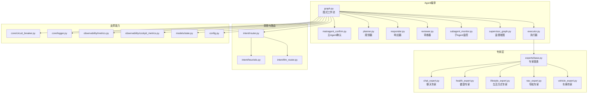
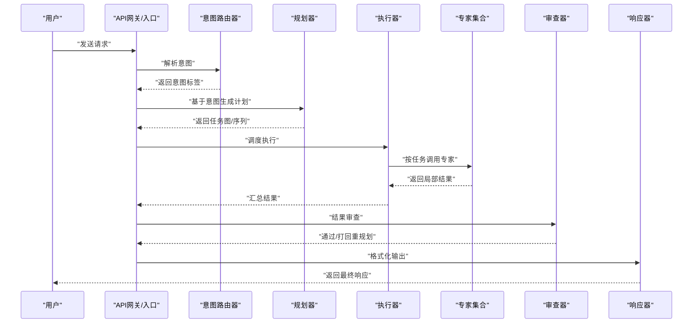
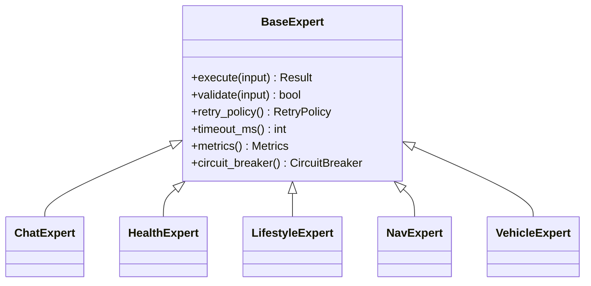
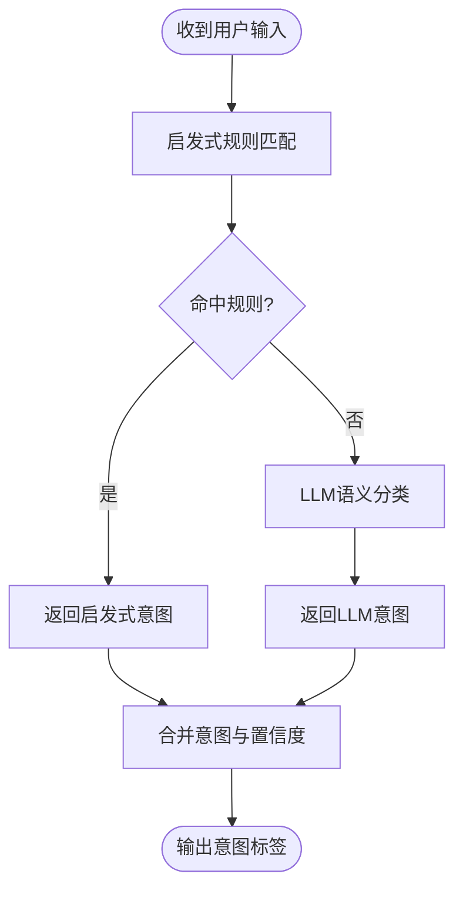
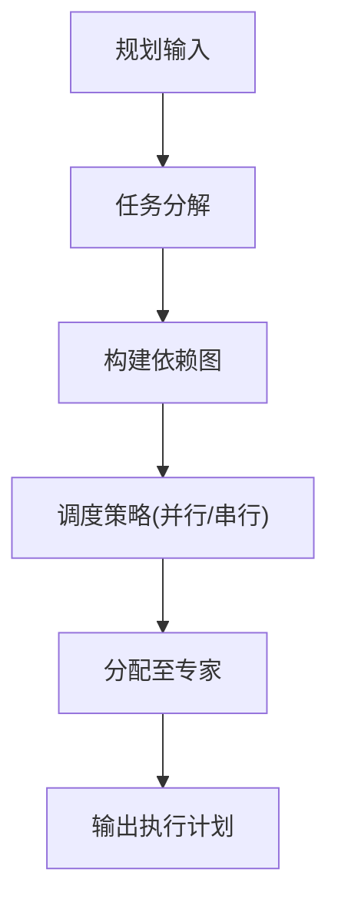
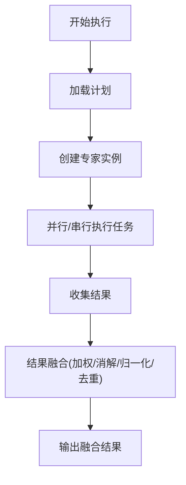
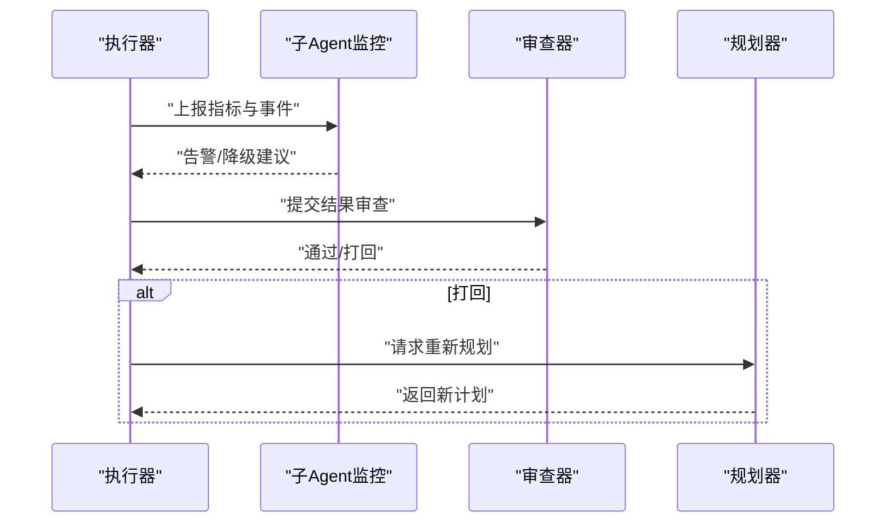
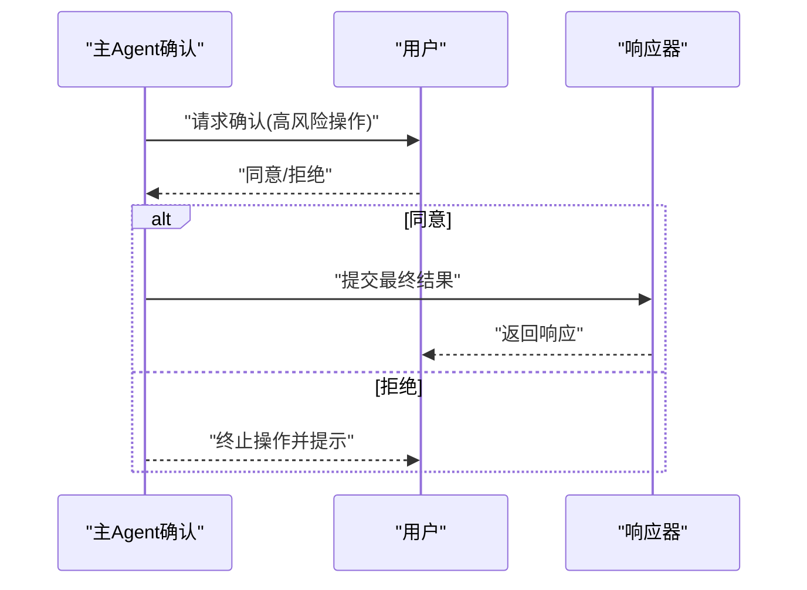
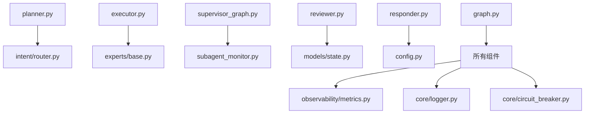

# AI Agent多专家协作系统

<cite>
**本文引用的文件**
- [backend_design/nexus/agent/__init__.py](file://backend_design/nexus/agent/__init__.py)
- [backend_design/nexus/agent/graph.py](file://backend_design/nexus/agent/graph.py)
- [backend_design/nexus/agent/mainagent_confirm.py](file://backend_design/nexus/agent/mainagent_confirm.py)
- [backend_design/nexus/agent/planner.py](file://backend_design/nexus/agent/planner.py)
- [backend_design/nexus/agent/responder.py](file://backend_design/nexus/agent/responder.py)
- [backend_design/nexus/agent/reviewer.py](file://backend_design/nexus/agent/reviewer.py)
- [backend_design/nexus/agent/subagent_monitor.py](file://backend_design/nexus/agent/subagent_monitor.py)
- [backend_design/nexus/agent/supervisor_graph.py](file://backend_design/nexus/agent/supervisor_graph.py)
- [backend_design/nexus/agent/executor.py](file://backend_design/nexus/agent/executor.py)
- [backend_design/nexus/agent/experts/base.py](file://backend_design/nexus/agent/experts/base.py)
- [backend_design/nexus/agent/experts/chat_expert.py](file://backend_design/nexus/agent/experts/chat_expert.py)
- [backend_design/nexus/agent/experts/health_expert.py](file://backend_design/nexus/agent/experts/health_expert.py)
- [backend_design/nexus/agent/experts/lifestyle_expert.py](file://backend_design/nexus/agent/experts/lifestyle_expert.py)
- [backend_design/nexus/agent/experts/nav_expert.py](file://backend_design/nexus/agent/experts/nav_expert.py)
- [backend_design/nexus/agent/experts/vehicle_expert.py](file://backend_design/nexus/agent/experts/vehicle_expert.py)
- [backend_design/nexus/intent/router.py](file://backend_design/nexus/intent/router.py)
- [backend_design/nexus/intent/heuristic.py](file://backend_design/nexus/intent/heuristic.py)
- [backend_design/nexus/intent/llm_router.py](file://backend_design/nexus/intent/llm_router.py)
- [backend_design/nexus/core/circuit_breaker.py](file://backend_design/nexus/core/circuit熔断器.py)
- [backend_design/nexus/core/logger.py](file://backend_design/nexus/core/logger.py)
- [backend_design/nexus/observability/metrics.py](file://backend_design/nexus/observability/metrics.py)
- [backend_design/nexus/observability/cockpit_metrics.py](file://backend_design/nexus/observability/cockpit_metrics.py)
- [backend_design/nexus/models/state.py](file://backend_design/nexus/models/state.py)
- [backend_design/nexus/config.py](file://backend_design/nexus/config.py)
</cite>

## 目录
1. [简介](#简介)
2. [项目结构](#项目结构)
3. [核心组件](#核心组件)
4. [架构总览](#架构总览)
5. [详细组件分析](#详细组件分析)
6. [依赖关系分析](#依赖关系分析)
7. [性能考量](#性能考量)
8. [故障排查指南](#故障排查指南)
9. [结论](#结论)
10. [附录](#附录)

## 简介
本文件面向NexusCockpit的AI Agent多专家协作系统，系统性阐述主Agent协调器、规划器、执行器与监督器的职责分工；详解聊天、健康、生活方式、导航、车辆等专用专家的实现原理与协作机制；说明Agent间通信协议、任务分配策略与结果融合算法；并提供扩展新专家类型、配置与优化性能的实践方法。同时覆盖错误处理、重试机制与监控指标的实现细节，帮助读者快速理解并高效使用该系统。

## 项目结构
围绕Agent系统的核心代码位于 backend_design/nexus/agent 及其子模块：
- agent: 主流程编排（图式工作流）、主Agent确认、规划、响应、审查、子Agent监控、监督者图、执行器等
- experts: 专家基类与各领域专家实现
- intent: 意图识别与路由（启发式与LLM路由）
- core: 通用基础设施（熔断器、日志等）
- observability: 可观测性（指标、仪表盘指标）
- models: 状态模型
- config: 全局配置

图表来源
- [backend_design/nexus/agent/graph.py](file://backend_design/nexus/agent/graph.py)
- [backend_design/nexus/agent/mainagent_confirm.py](file://backend_design/nexus/agent/mainagent_confirm.py)
- [backend_design/nexus/agent/planner.py](file://backend_design/nexus/agent/planner.py)
- [backend_design/nexus/agent/responder.py](file://backend_design/nexus/agent/responder.py)
- [backend_design/nexus/agent/reviewer.py](file://backend_design/nexus/agent/reviewer.py)
- [backend_design/nexus/agent/subagent_monitor.py](file://backend_design/nexus/agent/subagent_monitor.py)
- [backend_design/nexus/agent/supervisor_graph.py](file://backend_design/nexus/agent/supervisor_graph.py)
- [backend_design/nexus/agent/executor.py](file://backend_design/nexus/agent/executor.py)
- [backend_design/nexus/agent/experts/base.py](file://backend_design/nexus/agent/experts/base.py)
- [backend_design/nexus/agent/experts/chat_expert.py](file://backend_design/nexus/agent/experts/chat_expert.py)
- [backend_design/nexus/agent/experts/health_expert.py](file://backend_design/nexus/agent/experts/health_expert.py)
- [backend_design/nexus/agent/experts/lifestyle_expert.py](file://backend_design/nexus/agent/experts/lifestyle_expert.py)
- [backend_design/nexus/agent/experts/nav_expert.py](file://backend_design/nexus/agent/experts/nav_expert.py)
- [backend_design/nexus/agent/experts/vehicle_expert.py](file://backend_design/nexus/agent/experts/vehicle_expert.py)
- [backend_design/nexus/intent/router.py](file://backend_design/nexus/intent/router.py)
- [backend_design/nexus/intent/heuristic.py](file://backend_design/nexus/intent/heuristic.py)
- [backend_design/nexus/intent/llm_router.py](file://backend_design/nexus/intent/llm_router.py)
- [backend_design/nexus/core/circuit_breaker.py](file://backend_design/nexus/core/circuit_breaker.py)
- [backend_design/nexus/core/logger.py](file://backend_design/nexus/core/logger.py)
- [backend_design/nexus/observability/metrics.py](file://backend_design/nexus/observability/metrics.py)
- [backend_design/nexus/observability/cockpit_metrics.py](file://backend_design/nexus/observability/cockpit_metrics.py)
- [backend_design/nexus/models/state.py](file://backend_design/nexus/models/state.py)
- [backend_design/nexus/config.py](file://backend_design/nexus/config.py)

章节来源
- [backend_design/nexus/agent/graph.py](file://backend_design/nexus/agent/graph.py)
- [backend_design/nexus/agent/experts/base.py](file://backend_design/nexus/agent/experts/base.py)
- [backend_design/nexus/intent/router.py](file://backend_design/nexus/intent/router.py)
- [backend_design/nexus/core/circuit_breaker.py](file://backend_design/nexus/core/circuit_breaker.py)
- [backend_design/nexus/observability/metrics.py](file://backend_design/nexus/observability/metrics.py)
- [backend_design/nexus/models/state.py](file://backend_design/nexus/models/state.py)
- [backend_design/nexus/config.py](file://backend_design/nexus/config.py)

## 核心组件
- 主Agent协调器（图式工作流）
  - 负责端到端流程编排：接收输入、触发意图识别、调用规划器生成计划、调度执行器、聚合结果、触发审查与监督、最终由响应器输出。
  - 通过图节点组织各阶段，支持条件分支与并行执行。
- 规划器
  - 将用户请求分解为可执行的专家任务序列或图结构，考虑上下文、历史与约束。
- 执行器
  - 根据计划选择并调用具体专家实例，管理参数传递、并发度、超时与重试。
- 监督器（监督者图）
  - 对执行过程进行质量把关：一致性检查、冲突检测、安全与合规校验、结果收敛判断。
- 审查器
  - 对候选结果进行二次评审，必要时回退到规划器重新规划。
- 响应器
  - 将结构化结果转换为自然语言或前端可渲染的数据格式，附加元数据与追踪信息。
- 子Agent监控
  - 采集专家执行耗时、成功率、错误码分布、资源占用等指标，提供告警与降级策略。

章节来源
- [backend_design/nexus/agent/graph.py](file://backend_design/nexus/agent/graph.py)
- [backend_design/nexus/agent/planner.py](file://backend_design/nexus/agent/planner.py)
- [backend_design/nexus/agent/executor.py](file://backend_design/nexus/agent/executor.py)
- [backend_design/nexus/agent/supervisor_graph.py](file://backend_design/nexus/agent/supervisor_graph.py)
- [backend_design/nexus/agent/reviewer.py](file://backend_design/nexus/agent/reviewer.py)
- [backend_design/nexus/agent/responder.py](file://backend_design/nexus/agent/responder.py)
- [backend_design/nexus/agent/subagent_monitor.py](file://backend_design/nexus/agent/subagent_monitor.py)

## 架构总览
下图展示从用户输入到最终输出的完整链路，包括意图识别、规划、执行、监督、审查与响应。

图表来源
- [backend_design/nexus/agent/graph.py](file://backend_design/nexus/agent/graph.py)
- [backend_design/nexus/intent/router.py](file://backend_design/nexus/intent/router.py)
- [backend_design/nexus/agent/planner.py](file://backend_design/nexus/agent/planner.py)
- [backend_design/nexus/agent/executor.py](file://backend_design/nexus/agent/executor.py)
- [backend_design/nexus/agent/reviewer.py](file://backend_design/nexus/agent/reviewer.py)
- [backend_design/nexus/agent/responder.py](file://backend_design/nexus/agent/responder.py)

## 详细组件分析

### 专家体系与协作机制
- 专家基类
  - 定义统一的接口契约：输入规范、输出结构、元数据、错误码、重试策略、超时控制、指标上报。
  - 提供默认实现：参数校验、日志记录、熔断保护、指标埋点。
- 聊天专家
  - 负责对话式交互、澄清问题、记忆引用与上下文维护。
- 健康专家
  - 对接健康数据源，提供健康建议、指标解读与风险提示。
- 生活方式专家
  - 结合习惯与日程，给出生活建议、提醒与个性化推荐。
- 导航专家
  - 计算路径、预估时间、路况分析与路线优化。
- 车辆专家
  - 控制车辆功能（空调、媒体、座椅、车窗等），读取车辆状态。

图表来源
- [backend_design/nexus/agent/experts/base.py](file://backend_design/nexus/agent/experts/base.py)
- [backend_design/nexus/agent/experts/chat_expert.py](file://backend_design/nexus/agent/experts/chat_expert.py)
- [backend_design/nexus/agent/experts/health_expert.py](file://backend_design/nexus/agent/experts/health_expert.py)
- [backend_design/nexus/agent/experts/lifestyle_expert.py](file://backend_design/nexus/agent/experts/lifestyle_expert.py)
- [backend_design/nexus/agent/experts/nav_expert.py](file://backend_design/nexus/agent/experts/nav_expert.py)
- [backend_design/nexus/agent/experts/vehicle_expert.py](file://backend_design/nexus/agent/experts/vehicle_expert.py)

章节来源
- [backend_design/nexus/agent/experts/base.py](file://backend_design/nexus/agent/experts/base.py)
- [backend_design/nexus/agent/experts/chat_expert.py](file://backend_design/nexus/agent/experts/chat_expert.py)
- [backend_design/nexus/agent/experts/health_expert.py](file://backend_design/nexus/agent/experts/health_expert.py)
- [backend_design/nexus/agent/experts/lifestyle_expert.py](file://backend_design/nexus/agent/experts/lifestyle_expert.py)
- [backend_design/nexus/agent/experts/nav_expert.py](file://backend_design/nexus/agent/experts/nav_expert.py)
- [backend_design/nexus/agent/experts/vehicle_expert.py](file://backend_design/nexus/agent/experts/vehicle_expert.py)

### 意图识别与路由
- 启发式路由
  - 基于关键词、规则与模板匹配快速判定意图，适合高吞吐场景。
- LLM路由
  - 利用大模型进行语义理解与意图分类，适合复杂与模糊表达。
- 统一路由接口
  - 对外暴露一致的接口，内部可切换不同路由策略，支持A/B测试与动态权重。

图表来源
- [backend_design/nexus/intent/heuristic.py](file://backend_design/nexus/intent/heuristic.py)
- [backend_design/nexus/intent/llm_router.py](file://backend_design/nexus/intent/llm_router.py)
- [backend_design/nexus/intent/router.py](file://backend_design/nexus/intent/router.py)

章节来源
- [backend_design/nexus/intent/router.py](file://backend_design/nexus/intent/router.py)
- [backend_design/nexus/intent/heuristic.py](file://backend_design/nexus/intent/heuristic.py)
- [backend_design/nexus/intent/llm_router.py](file://backend_design/nexus/intent/llm_router.py)

### 规划器与任务分配策略
- 任务分解
  - 将复杂请求拆分为多个子任务，标注依赖关系与优先级。
- 并行与串行
  - 无依赖的子任务并行执行，有依赖的任务按拓扑序串行。
- 动态调整
  - 根据实时指标与错误率动态调整并发度与重试次数。

图表来源
- [backend_design/nexus/agent/planner.py](file://backend_design/nexus/agent/planner.py)
- [backend_design/nexus/agent/executor.py](file://backend_design/nexus/agent/executor.py)

章节来源
- [backend_design/nexus/agent/planner.py](file://backend_design/nexus/agent/planner.py)
- [backend_design/nexus/agent/executor.py](file://backend_design/nexus/agent/executor.py)

### 执行器与结果融合
- 执行器职责
  - 加载计划、创建专家实例、参数注入、并发控制、超时与重试、异常捕获与降级。
- 结果融合算法
  - 加权投票：依据专家置信度与历史表现加权。
  - 冲突消解：基于规则与上下文优先级的冲突解决。
  - 归一化：统一输出结构与字段映射。
  - 去重与合并：消除重复信息，保留关键差异点。

图表来源
- [backend_design/nexus/agent/executor.py](file://backend_design/nexus/agent/executor.py)

章节来源
- [backend_design/nexus/agent/executor.py](file://backend_design/nexus/agent/executor.py)

### 监督器与审查器
- 监督器
  - 实时监控执行进度、错误率、延迟与资源使用，触发降级与熔断。
- 审查器
  - 对融合结果进行一致性、安全性与合规性检查，必要时回退到规划器重新规划。

图表来源
- [backend_design/nexus/agent/subagent_monitor.py](file://backend_design/nexus/agent/subagent_monitor.py)
- [backend_design/nexus/agent/reviewer.py](file://backend_design/nexus/agent/reviewer.py)
- [backend_design/nexus/agent/planner.py](file://backend_design/nexus/agent/planner.py)

章节来源
- [backend_design/nexus/agent/subagent_monitor.py](file://backend_design/nexus/agent/subagent_monitor.py)
- [backend_design/nexus/agent/reviewer.py](file://backend_design/nexus/agent/reviewer.py)
- [backend_design/nexus/agent/planner.py](file://backend_design/nexus/agent/planner.py)

### 主Agent确认与响应器
- 主Agent确认
  - 在关键操作前进行确认（如车辆控制），确保用户授权与安全。
- 响应器
  - 将结构化结果转换为自然语言或前端可渲染格式，附加追踪ID、耗时与指标摘要。

图表来源
- [backend_design/nexus/agent/mainagent_confirm.py](file://backend_design/nexus/agent/mainagent_confirm.py)
- [backend_design/nexus/agent/responder.py](file://backend_design/nexus/agent/responder.py)

章节来源
- [backend_design/nexus/agent/mainagent_confirm.py](file://backend_design/nexus/agent/mainagent_confirm.py)
- [backend_design/nexus/agent/responder.py](file://backend_design/nexus/agent/responder.py)

### 扩展新专家类型的步骤
- 继承专家基类
  - 实现 execute 方法与必要的校验逻辑。
- 注册专家
  - 在专家注册表或配置中声明新专家名称与能力描述。
- 更新规划器
  - 在意图到任务的映射中加入新专家的任务节点。
- 更新路由与提示
  - 在意图路由与提示模板中增加对新专家的引导与约束。
- 添加测试与指标
  - 编写单元测试与集成测试，埋点新增指标。

章节来源
- [backend_design/nexus/agent/experts/base.py](file://backend_design/nexus/agent/experts/base.py)
- [backend_design/nexus/agent/planner.py](file://backend_design/nexus/agent/planner.py)
- [backend_design/nexus/intent/router.py](file://backend_design/nexus/intent/router.py)

### 配置与优化方法
- 并发与超时
  - 调整执行器并发度与专家超时阈值，平衡吞吐与稳定性。
- 重试与退避
  - 配置指数退避与最大重试次数，避免雪崩。
- 熔断与降级
  - 设置熔断阈值与冷却时间，失败时切换到降级策略。
- 指标与告警
  - 启用关键指标上报，配置阈值告警与看板。
- 缓存与预取
  - 对热点数据进行缓存，减少外部依赖延迟。

章节来源
- [backend_design/nexus/agent/executor.py](file://backend_design/nexus/agent/executor.py)
- [backend_design/nexus/core/circuit_breaker.py](file://backend_design/nexus/core/circuit_breaker.py)
- [backend_design/nexus/observability/metrics.py](file://backend_design/nexus/observability/metrics.py)
- [backend_design/nexus/config.py](file://backend_design/nexus/config.py)

## 依赖关系分析
- 组件耦合
  - 执行器强依赖专家基类与配置；规划器依赖意图路由；监督器与审查器弱耦合于执行器与规划器。
- 外部依赖
  - 熔断器、日志、指标、状态模型与全局配置被广泛使用。
- 潜在循环依赖
  - 通过接口抽象与事件驱动降低循环风险。

图表来源
- [backend_design/nexus/agent/planner.py](file://backend_design/nexus/agent/planner.py)
- [backend_design/nexus/intent/router.py](file://backend_design/nexus/intent/router.py)
- [backend_design/nexus/agent/executor.py](file://backend_design/nexus/agent/executor.py)
- [backend_design/nexus/agent/experts/base.py](file://backend_design/nexus/agent/experts/base.py)
- [backend_design/nexus/agent/supervisor_graph.py](file://backend_design/nexus/agent/supervisor_graph.py)
- [backend_design/nexus/agent/subagent_monitor.py](file://backend_design/nexus/agent/subagent_monitor.py)
- [backend_design/nexus/agent/reviewer.py](file://backend_design/nexus/agent/reviewer.py)
- [backend_design/nexus/models/state.py](file://backend_design/nexus/models/state.py)
- [backend_design/nexus/agent/responder.py](file://backend_design/nexus/agent/responder.py)
- [backend_design/nexus/config.py](file://backend_design/nexus/config.py)
- [backend_design/nexus/agent/graph.py](file://backend_design/nexus/agent/graph.py)
- [backend_design/nexus/observability/metrics.py](file://backend_design/nexus/observability/metrics.py)
- [backend_design/nexus/core/logger.py](file://backend_design/nexus/core/logger.py)
- [backend_design/nexus/core/circuit_breaker.py](file://backend_design/nexus/core/circuit_breaker.py)

章节来源
- [backend_design/nexus/agent/graph.py](file://backend_design/nexus/agent/graph.py)
- [backend_design/nexus/agent/executor.py](file://backend_design/nexus/agent/executor.py)
- [backend_design/nexus/agent/planner.py](file://backend_design/nexus/agent/planner.py)
- [backend_design/nexus/agent/reviewer.py](file://backend_design/nexus/agent/reviewer.py)
- [backend_design/nexus/agent/responder.py](file://backend_design/nexus/agent/responder.py)
- [backend_design/nexus/agent/supervisor_graph.py](file://backend_design/nexus/agent/supervisor_graph.py)
- [backend_design/nexus/agent/subagent_monitor.py](file://backend_design/nexus/agent/subagent_monitor.py)
- [backend_design/nexus/agent/experts/base.py](file://backend_design/nexus/agent/experts/base.py)
- [backend_design/nexus/intent/router.py](file://backend_design/nexus/intent/router.py)
- [backend_design/nexus/core/circuit_breaker.py](file://backend_design/nexus/core/circuit_breaker.py)
- [backend_design/nexus/core/logger.py](file://backend_design/nexus/core/logger.py)
- [backend_design/nexus/observability/metrics.py](file://backend_design/nexus/observability/metrics.py)
- [backend_design/nexus/models/state.py](file://backend_design/nexus/models/state.py)
- [backend_design/nexus/config.py](file://backend_design/nexus/config.py)

## 性能考量
- 并发控制
  - 合理设置执行器并发度，避免资源争用与OOM。
- 超时与重试
  - 针对外部依赖设置短超时与有限重试，采用指数退避。
- 熔断与隔离
  - 对不稳定服务启用熔断，限制故障扩散。
- 缓存与预取
  - 对高频查询与静态知识进行缓存，降低延迟。
- 指标与观测
  - 采集P95/P99延迟、错误率、吞吐与资源利用率，建立告警与看板。

[本节为通用指导，不直接分析具体文件]

## 故障排查指南
- 常见问题定位
  - 意图识别不准：检查启发式规则与LLM路由权重，查看意图日志与置信度。
  - 规划失败：核对任务依赖与约束，查看规划器日志与中间状态。
  - 执行超时/重试过多：检查专家超时与重试配置，观察熔断器状态。
  - 结果不一致：审查器日志与冲突消解规则，验证融合算法参数。
- 监控与诊断
  - 使用子Agent监控与指标模块定位瓶颈与异常。
  - 结合日志与追踪ID进行全链路排障。

章节来源
- [backend_design/nexus/agent/subagent_monitor.py](file://backend_design/nexus/agent/subagent_monitor.py)
- [backend_design/nexus/observability/metrics.py](file://backend_design/nexus/observability/metrics.py)
- [backend_design/nexus/core/logger.py](file://backend_design/nexus/core/logger.py)
- [backend_design/nexus/core/circuit_breaker.py](file://backend_design/nexus/core/circuit_breaker.py)

## 结论
NexusCockpit的AI Agent多专家协作系统通过图式工作流将意图识别、规划、执行、监督与审查有机串联，形成可扩展、可观测、可治理的智能体平台。借助统一的专家基类与灵活的执行器，系统能够高效承载多领域专家协作，并通过熔断、重试与指标体系保障稳定性与性能。遵循本文档的扩展与优化建议，可快速引入新专家并提升整体服务质量。

## 附录
- 术语
  - 主Agent：协调器，负责端到端编排
  - 规划器：任务分解与计划生成
  - 执行器：任务调度与结果汇聚
  - 监督器：过程监控与质量把关
  - 审查器：结果评审与回退决策
  - 响应器：输出格式化与交付
- 最佳实践
  - 明确专家边界与输入输出契约
  - 为高风险操作增加确认环节
  - 持续完善指标与告警，闭环改进

[本节为概念性内容，不直接分析具体文件]