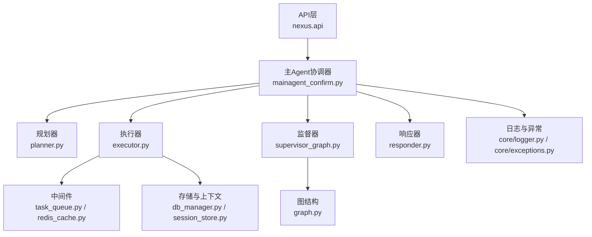
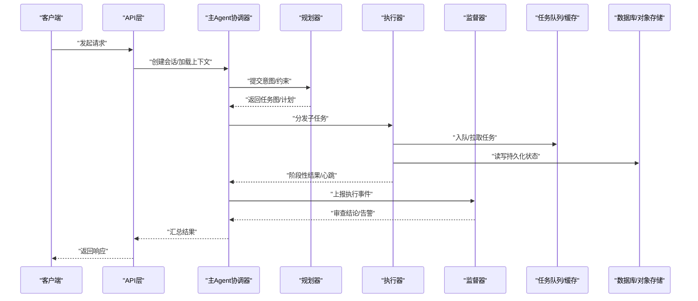
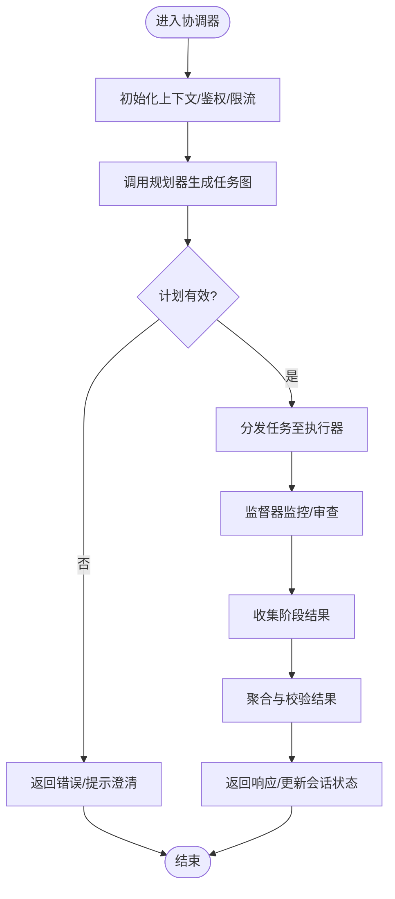
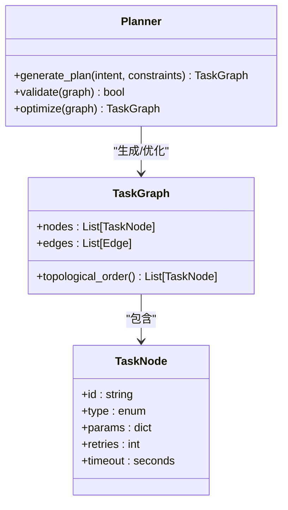
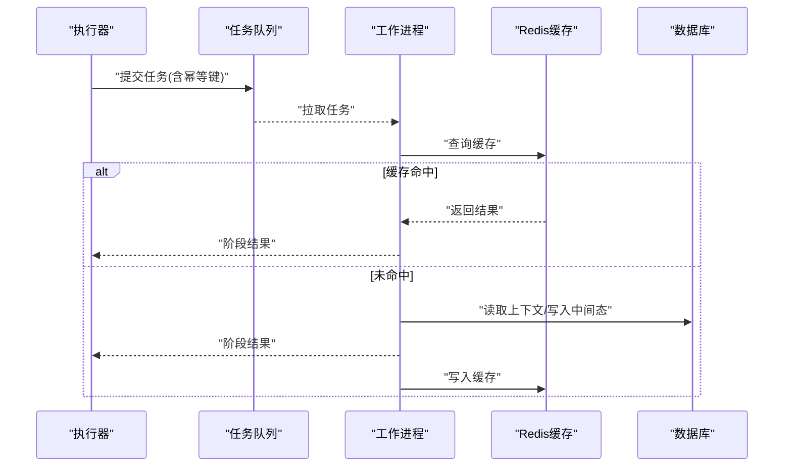
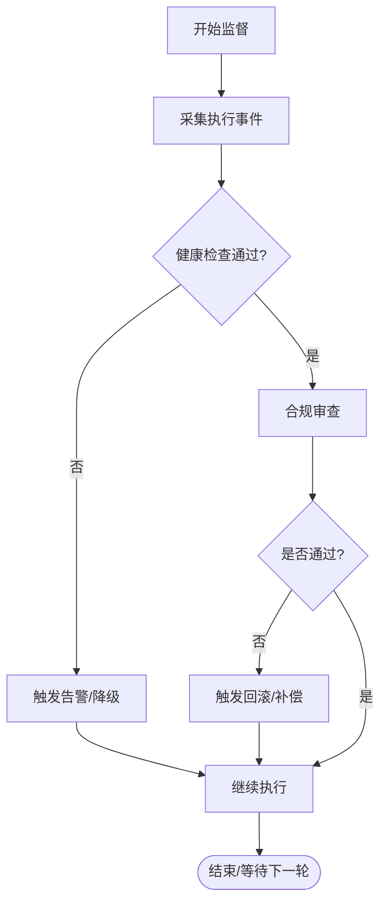
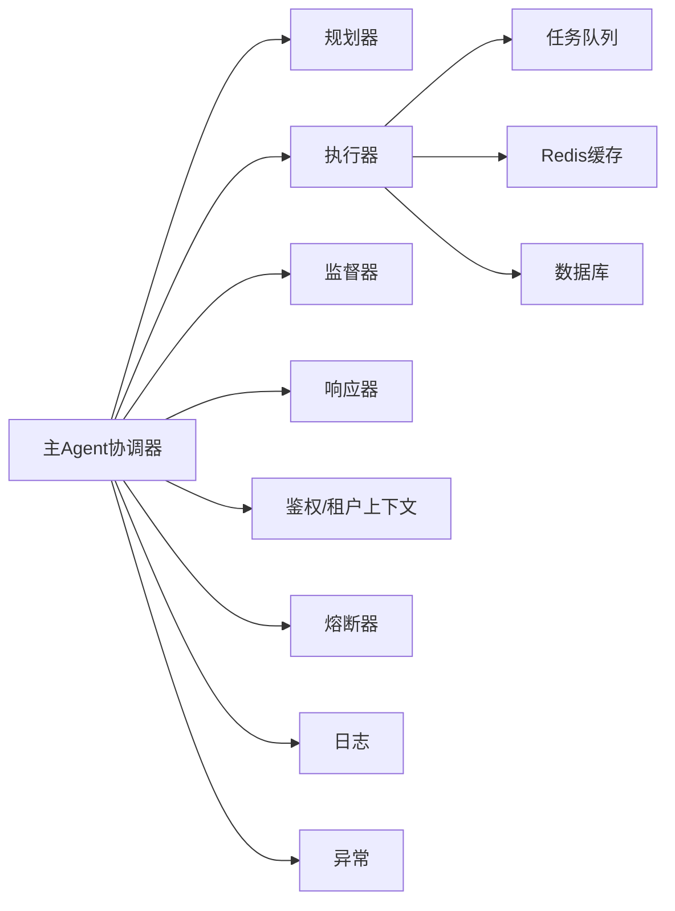

# Agent核心架构设计

<cite>
**本文引用的文件**   
- [mainagent_confirm.py](file://backend_design/nexus/agent/mainagent_confirm.py)
- [planner.py](file://backend_design/nexus/agent/planner.py)
- [executor.py](file://backend_design/nexus/agent/executor.py)
- [supervisor_graph.py](file://backend_design/nexus/agent/supervisor_graph.py)
- [graph.py](file://backend_design/nexus/agent/graph.py)
- [subagent_monitor.py](file://backend_design/nexus/agent/subagent_monitor.py)
- [responder.py](file://backend_design/nexus/agent/responder.py)
- [reviewer.py](file://backend_design/nexus/agent/reviewer.py)
- [__init__.py](file://backend_design/nexus/agent/__init__.py)
- [config.py](file://backend_design/nexus/config.py)
- [logger.py](file://backend_design/nexus/core/logger.py)
- [exceptions.py](file://backend_design/nexus/core/exceptions.py)
- [cockpit_manager.py](file://backend_design/nexus/core/cockpit_manager.py)
- [db_manager.py](file://backend_design/nexus/core/db_manager.py)
- [oss.py](file://backend_design/nexus/core/oss.py)
- [auth.py](file://backend_design/nexus/core/auth.py)
- [circuit_breaker.py](file://backend_design/nexus/core/circuit_breaker.py)
- [tenant_context.py](file://backend_design/nexus/core/tenant_context.py)
- [voiceprint.py](file://backend_design/nexus/core/voiceprint.py)
- [ssl_fix.py](file://backend_design/nexus/core/ssl_fix.py)
- [__init__.py](file://backend_design/nexus/models/__init__.py)
- [schemas.py](file://backend_design/nexus/models/schemas.py)
- [state.py](file://backend_design/nexus/models/state.py)
- [cockpit.py](file://backend_design/nexus/models/cockpit.py)
- [__init__.py](file://backend_design/nexus/middleware/__init__.py)
- [task_queue.py](file://backend_design/nexus/middleware/task_queue.py)
- [session_store.py](file://backend_design/nexus/middleware/session_store.py)
- [redis_cache.py](file://backend_design/nexus/middleware/redis_cache.py)
- [rate_limiter.py](file://backend_design/nexus/middleware/rate_limiter.py)
- [__init__.py](file://backend_design/nexus/memory/__init__.py)
- [manager.py](file://backend_design/nexus/memory/manager.py)
- [compressor.py](file://backend_design/nexus/memory/compressor.py)
- [conflict.py](file://backend_design/nexus/memory/conflict.py)
- [__init__.py](file://backend_design/nexus/intent/__init__.py)
- [router.py](file://backend_design/nexus/intent/router.py)
- [llm_router.py](file://backend_design/nexus/intent/llm_router.py)
- [heuristic.py](file://backend_design/nexus/intent/heuristic.py)
- [__init__.py](file://backend_design/nexus/observability/__init__.py)
- [metrics.py](file://backend_design/nexus/observability/metrics.py)
- [langfuse.py](file://backend_design/nexus/observability/langfuse.py)
- [data_retention.py](file://backend_design/nexus/observability/data_retention.py)
- [cockpit_metrics.py](file://backend_design/nexus/observability/cockpit_metrics.py)
- [main.py](file://backend_design/nexus/main.py)
</cite>

## 更新摘要
**变更内容**   
- 主Agent协调器(mainagent_confirm.py)确认逻辑改进，提供更好的错误处理和状态管理
- 监督器(supervisor_graph.py)图实现更新，增强不同Agent层之间的协调机制
- 更新了架构图和数据流图以反映最新的组件交互关系
- 增强了错误处理策略和状态流转的文档说明

## 目录
1. [简介](#简介)
2. [项目结构](#项目结构)
3. [核心组件](#核心组件)
4. [架构总览](#架构总览)
5. [详细组件分析](#详细组件分析)
6. [依赖关系分析](#依赖关系分析)
7. [性能考量](#性能考量)
8. [故障排查指南](#故障排查指南)
9. [结论](#结论)
10. [附录](#附录)

## 简介
本文件聚焦NexusCockpit的Agent核心架构，围绕主Agent协调器、规划器、执行器与监督器等关键模块，系统阐述其职责边界、交互协议、状态流转与错误处理机制。文档同时提供架构图与数据流图，帮助读者快速理解从任务接收到结果汇总的全链路流程。

**更新** 基于最新代码优化，重点改进了主Agent的确认逻辑和监督器的跨层协调能力，提升了系统的稳定性和可观测性。

## 项目结构
Agent相关代码位于 backend_design/nexus/agent 目录下，采用分层与职责分离的组织方式：
- mainagent_confirm.py：主Agent协调器，负责接收外部请求、编排子任务、汇聚结果并返回响应。
- planner.py：规划器，将复杂意图分解为可执行的子任务序列或图结构。
- executor.py：执行器，负责任务调度、资源管理与并发控制。
- supervisor_graph.py：监督器，基于图结构的监控与审查流程，保障执行质量与合规性。
- graph.py：图结构与节点定义，支撑规划与监督的数据模型。
- subagent_monitor.py：子Agent监控，采集运行指标与健康状态。
- responder.py：响应组装器，统一输出格式与消息路由。
- reviewer.py：审查器，对关键步骤进行校验与回溯。

图表来源
- [mainagent_confirm.py](file://backend_design/nexus/agent/mainagent_confirm.py)
- [planner.py](file://backend_design/nexus/agent/planner.py)
- [executor.py](file://backend_design/nexus/agent/executor.py)
- [supervisor_graph.py](file://backend_design/nexus/agent/supervisor_graph.py)
- [graph.py](file://backend_design/nexus/agent/graph.py)
- [task_queue.py](file://backend_design/nexus/middleware/task_queue.py)
- [redis_cache.py](file://backend_design/nexus/middleware/redis_cache.py)
- [db_manager.py](file://backend_design/nexus/core/db_manager.py)
- [session_store.py](file://backend_design/nexus/middleware/session_store.py)
- [logger.py](file://backend_design/nexus/core/logger.py)
- [exceptions.py](file://backend_design/nexus/core/exceptions.py)

章节来源
- [mainagent_confirm.py](file://backend_design/nexus/agent/mainagent_confirm.py)
- [planner.py](file://backend_design/nexus/agent/planner.py)
- [executor.py](file://backend_design/nexus/agent/executor.py)
- [supervisor_graph.py](file://backend_design/nexus/agent/supervisor_graph.py)
- [graph.py](file://backend_design/nexus/agent/graph.py)
- [subagent_monitor.py](file://backend_design/nexus/agent/subagent_monitor.py)
- [responder.py](file://backend_design/nexus/agent/responder.py)
- [reviewer.py](file://backend_design/nexus/agent/reviewer.py)
- [__init__.py](file://backend_design/nexus/agent/__init__.py)

## 核心组件
- 主Agent协调器（mainagent_confirm.py）
  - 职责：对外暴露统一的入口，解析输入上下文，调用规划器生成任务图，驱动执行器并行/串行执行，收集结果并通过响应器封装返回。
  - 关键点：会话上下文管理、租户隔离、超时与重试策略、结果聚合与去重。
  - **更新** 改进了确认逻辑，增强了错误处理和状态管理的健壮性。
- 规划器（planner.py）
  - 职责：将用户意图或上层指令分解为可执行的子任务；支持顺序、分支、循环与条件判断等模式。
  - 关键点：规则与LLM混合决策、依赖关系构建、最小化副作用的规划验证。
- 执行器（executor.py）
  - 职责：根据任务图调度具体动作，管理并发度、资源配额与失败重试；对接中间件（队列、缓存、会话）。
  - 关键点：背压控制、幂等执行、断点续跑、指标上报。
- 监督器（supervisor_graph.py）
  - 职责：在图级别监控执行进度、健康检查、审计日志与合规校验；触发回滚或降级策略。
  - 关键点：事件总线、阈值告警、快照与回放。
  - **更新** 增强了不同Agent层之间的协调机制，提升了跨层通信的可靠性。

章节来源
- [mainagent_confirm.py](file://backend_design/nexus/agent/mainagent_confirm.py)
- [planner.py](file://backend_design/nexus/agent/planner.py)
- [executor.py](file://backend_design/nexus/agent/executor.py)
- [supervisor_graph.py](file://backend_design/nexus/agent/supervisor_graph.py)

## 架构总览
下图展示从API到Agent核心再到中间件与存储的整体交互。

图表来源
- [main.py](file://backend_design/nexus/main.py)
- [mainagent_confirm.py](file://backend_design/nexus/agent/mainagent_confirm.py)
- [planner.py](file://backend_design/nexus/agent/planner.py)
- [executor.py](file://backend_design/nexus/agent/executor.py)
- [supervisor_graph.py](file://backend_design/nexus/agent/supervisor_graph.py)
- [task_queue.py](file://backend_design/nexus/middleware/task_queue.py)
- [redis_cache.py](file://backend_design/nexus/middleware/redis_cache.py)
- [db_manager.py](file://backend_design/nexus/core/db_manager.py)
- [oss.py](file://backend_design/nexus/core/oss.py)

## 详细组件分析

### 主Agent协调器（mainagent_confirm.py）
- 职责边界
  - 接收并校验请求参数，维护会话与租户上下文。
  - 调用规划器产出任务图，按依赖关系组织执行。
  - 协调执行器与监督器，确保执行过程可控、可观测。
  - 汇总各子任务结果，进行一致性校验与格式化输出。
- 关键流程
  - 初始化阶段：加载配置、建立连接、预热缓存。
  - 规划阶段：意图识别→约束注入→生成计划。
  - 执行阶段：任务派发→进度跟踪→异常捕获→重试与补偿。
  - 收尾阶段：结果聚合→审计记录→清理临时资源。
- 状态管理
  - 使用状态机描述会话生命周期（新建、规划中、执行中、完成、失败、回滚）。
  - 通过持久化存储保存检查点，支持中断恢复。
- 错误处理
  - 区分可重试与不可重试错误，结合熔断与退避策略。
  - 记录结构化日志与追踪ID，便于定位问题。
  - **更新** 改进了确认逻辑，提供更完善的错误分类和处理机制。

图表来源
- [mainagent_confirm.py](file://backend_design/nexus/agent/mainagent_confirm.py)
- [planner.py](file://backend_design/nexus/agent/planner.py)
- [supervisor_graph.py](file://backend_design/nexus/agent/supervisor_graph.py)
- [responder.py](file://backend_design/nexus/agent/responder.py)
- [exceptions.py](file://backend_design/nexus/core/exceptions.py)
- [logger.py](file://backend_design/nexus/core/logger.py)

章节来源
- [mainagent_confirm.py](file://backend_design/nexus/agent/mainagent_confirm.py)
- [responder.py](file://backend_design/nexus/agent/responder.py)
- [exceptions.py](file://backend_design/nexus/core/exceptions.py)
- [logger.py](file://backend_design/nexus/core/logger.py)

### 规划器（planner.py）
- 任务分解算法
  - 基于规则与LLM的混合策略：先以启发式规则快速切分，再由LLM细化依赖与参数。
  - 支持顺序、并行、条件分支、循环与子图复用。
- 执行策略
  - 最小化副作用：优先选择幂等操作；必要时引入事务边界。
  - 依赖解析：拓扑排序保证无环；冲突检测避免资源竞争。
  - 成本优化：估算子任务耗时与资源消耗，动态调整并行度。
- 输出产物
  - 任务图（节点+边），包含输入输出契约、重试策略、超时与优先级。

图表来源
- [planner.py](file://backend_design/nexus/agent/planner.py)
- [graph.py](file://backend_design/nexus/agent/graph.py)

章节来源
- [planner.py](file://backend_design/nexus/agent/planner.py)
- [graph.py](file://backend_design/nexus/agent/graph.py)

### 执行器（executor.py）
- 任务调度机制
  - 基于任务队列的异步调度，支持优先级与权重。
  - 并发控制：令牌桶/信号量限制全局并发，防止过载。
- 资源管理
  - 内存与CPU配额：按任务类型分配资源上限。
  - 缓存命中：读多写少场景下优先命中Redis缓存。
  - 会话与上下文：跨任务共享必要状态，避免重复计算。
- 可靠性
  - 幂等执行：通过唯一任务ID与去重键避免重复处理。
  - 重试与退避：指数退避与抖动，结合熔断器保护下游。
  - 检查点：长任务定期落盘，支持断点续跑。

图表来源
- [executor.py](file://backend_design/nexus/agent/executor.py)
- [task_queue.py](file://backend_design/nexus/middleware/task_queue.py)
- [redis_cache.py](file://backend_design/nexus/middleware/redis_cache.py)
- [db_manager.py](file://backend_design/nexus/core/db_manager.py)

章节来源
- [executor.py](file://backend_design/nexus/agent/executor.py)
- [task_queue.py](file://backend_design/nexus/middleware/task_queue.py)
- [redis_cache.py](file://backend_design/nexus/middleware/redis_cache.py)
- [db_manager.py](file://backend_design/nexus/core/db_manager.py)

### 监督器（supervisor_graph.py）
- 监控与审查流程
  - 事件采集：订阅执行器事件，记录关键里程碑与异常。
  - 健康检查：周期性探测子任务与依赖服务可用性。
  - 合规校验：对敏感操作进行二次确认与审计。
- 干预策略
  - 自动降级：当错误率超阈时切换备用路径或简化计划。
  - 回滚与补偿：对已生效的副作用进行补偿性操作。
  - 告警与通知：推送至监控平台与运维通道。
- **更新** 增强了不同Agent层之间的协调机制，改进了跨层通信的可靠性和错误处理能力。

图表来源
- [supervisor_graph.py](file://backend_design/nexus/agent/supervisor_graph.py)
- [subagent_monitor.py](file://backend_design/nexus/agent/subagent_monitor.py)

章节来源
- [supervisor_graph.py](file://backend_design/nexus/agent/supervisor_graph.py)
- [subagent_monitor.py](file://backend_design/nexus/agent/subagent_monitor.py)

### Agent间通信协议、状态管理与错误处理
- 通信协议
  - 内部消息体：包含任务ID、父任务ID、类型、参数、时间戳与签名。
  - 传输通道：HTTP/WebSocket用于外部，消息队列用于内部。
  - 安全校验：签名与鉴权，防篡改与重放攻击。
- 状态管理
  - 会话状态：新建、规划中、执行中、完成、失败、回滚。
  - 任务状态：待执行、执行中、成功、失败、重试、取消。
  - 持久化：检查点与快照，支持恢复与审计。
- 错误处理
  - 分类：业务错误、系统错误、网络错误、第三方服务错误。
  - 策略：重试、熔断、降级、补偿、告警。
  - 可观测性：结构化日志、指标与分布式追踪。
  - **更新** 基于主Agent确认逻辑的改进，提供了更细粒度的错误分类和处理策略。

章节来源
- [mainagent_confirm.py](file://backend_design/nexus/agent/mainagent_confirm.py)
- [executor.py](file://backend_design/nexus/agent/executor.py)
- [supervisor_graph.py](file://backend_design/nexus/agent/supervisor_graph.py)
- [exceptions.py](file://backend_design/nexus/core/exceptions.py)
- [logger.py](file://backend_design/nexus/core/logger.py)

## 依赖关系分析
- 组件耦合
  - 主Agent协调器强依赖规划器与执行器，弱依赖监督器与响应器。
  - 执行器依赖中间件（队列、缓存、会话）与存储（数据库、对象存储）。
  - 监督器依赖监控与告警子系统。
- 外部依赖
  - 鉴权与租户上下文：确保多租户隔离与安全访问。
  - 熔断器：保护下游服务稳定性。
  - 语音与ASR/TTS：在需要时接入语音能力。

图表来源
- [mainagent_confirm.py](file://backend_design/nexus/agent/mainagent_confirm.py)
- [planner.py](file://backend_design/nexus/agent/planner.py)
- [executor.py](file://backend_design/nexus/agent/executor.py)
- [supervisor_graph.py](file://backend_design/nexus/agent/supervisor_graph.py)
- [responder.py](file://backend_design/nexus/agent/responder.py)
- [task_queue.py](file://backend_design/nexus/middleware/task_queue.py)
- [redis_cache.py](file://backend_design/nexus/middleware/redis_cache.py)
- [db_manager.py](file://backend_design/nexus/core/db_manager.py)
- [auth.py](file://backend_design/nexus/core/auth.py)
- [tenant_context.py](file://backend_design/nexus/core/tenant_context.py)
- [circuit_breaker.py](file://backend_design/nexus/core/circuit_breaker.py)
- [logger.py](file://backend_design/nexus/core/logger.py)
- [exceptions.py](file://backend_design/nexus/core/exceptions.py)

章节来源
- [mainagent_confirm.py](file://backend_design/nexus/agent/mainagent_confirm.py)
- [executor.py](file://backend_design/nexus/agent/executor.py)
- [supervisor_graph.py](file://backend_design/nexus/agent/supervisor_graph.py)
- [auth.py](file://backend_design/nexus/core/auth.py)
- [tenant_context.py](file://backend_design/nexus/core/tenant_context.py)
- [circuit_breaker.py](file://backend_design/nexus/core/circuit_breaker.py)
- [logger.py](file://backend_design/nexus/core/logger.py)
- [exceptions.py](file://backend_design/nexus/core/exceptions.py)

## 性能考量
- 并发与吞吐
  - 合理设置执行器并发度，避免CPU与IO争用。
  - 利用缓存减少重复计算与I/O开销。
- 延迟与稳定性
  - 短路径优先：尽量在缓存与本地计算完成。
  - 熔断与退避：降低雪崩风险，提高整体可用性。
- 资源与成本
  - 任务分级：高优任务抢占资源，低优任务延后执行。
  - 批处理：合并小任务以降低调度开销。

## 故障排查指南
- 常见问题
  - 任务堆积：检查队列消费速率与执行器容量。
  - 频繁重试：查看下游服务健康与熔断状态。
  - 结果不一致：核对幂等键与去重逻辑。
- 定位手段
  - 日志检索：使用任务ID与追踪ID过滤。
  - 指标观察：关注错误率、延迟分布与资源利用率。
  - 快照回放：基于检查点复现问题。
- **更新** 基于改进的错误处理机制，现在可以更精确地定位主Agent确认逻辑和监督器协调过程中的问题。

章节来源
- [logger.py](file://backend_design/nexus/core/logger.py)
- [exceptions.py](file://backend_design/nexus/core/exceptions.py)
- [circuit_breaker.py](file://backend_design/nexus/core/circuit_breaker.py)
- [subagent_monitor.py](file://backend_design/nexus/agent/subagent_monitor.py)

## 结论
NexusCockpit的Agent核心架构以主Agent协调器为中心，通过规划器将复杂意图转化为可执行的任务图，由执行器高效调度与可靠执行，并由监督器全程监控与审查。借助中间件与存储的协同，系统在可扩展性、稳定性与可观测性方面具备良好基础。

**更新** 最近的优化进一步增强了主Agent的确认逻辑和监督器的跨层协调能力，显著提升了系统的稳定性和错误处理能力。后续可在任务图优化、自适应并发与更细粒度的审计方面持续改进。

## 附录
- 配置与环境
  - 核心配置项：队列地址、缓存连接、数据库连接、熔断阈值、日志级别。
  - 环境变量：租户标识、鉴权密钥、监控端点。
- 扩展点
  - 自定义任务类型：实现标准接口以接入新能力。
  - 插件化监督策略：按需启用不同审查规则。
  - 可插拔存储：替换后端存储以适配不同部署环境。