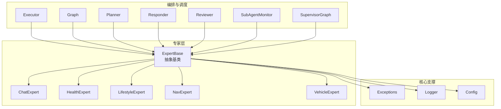
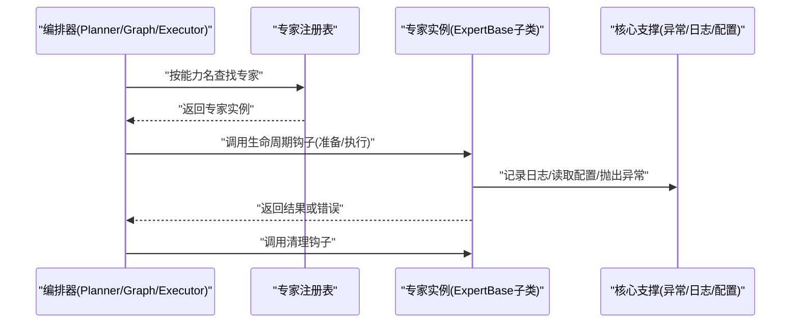
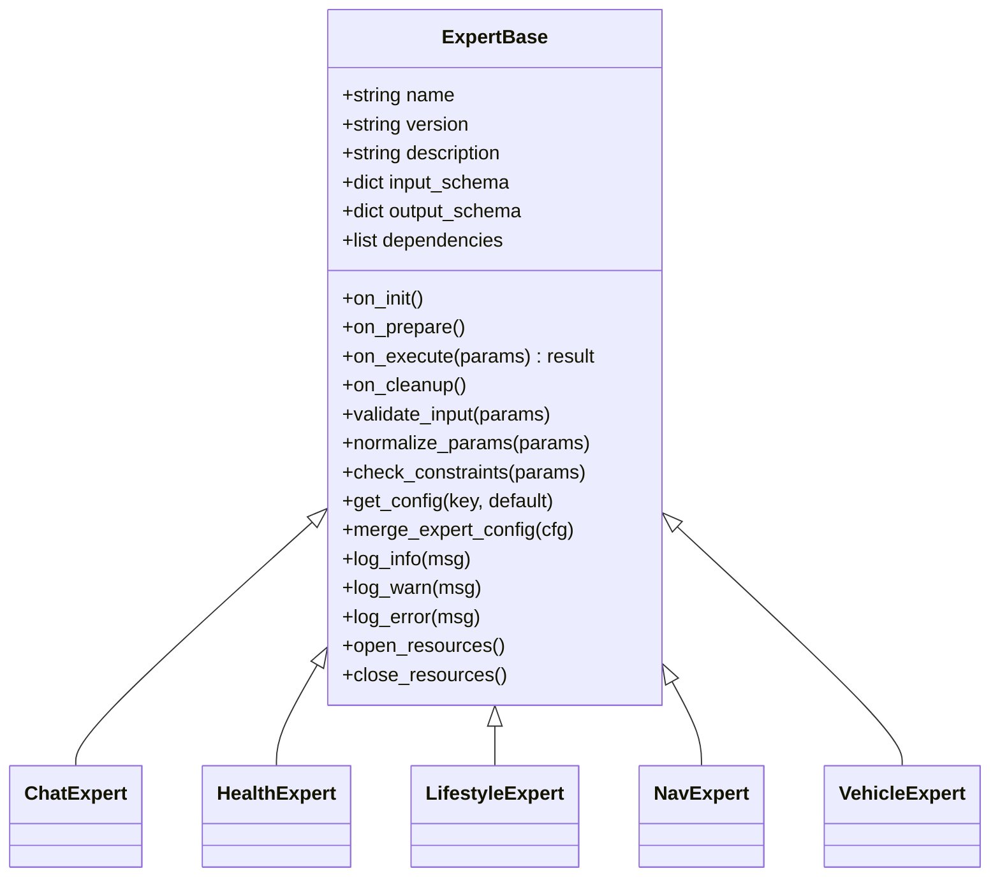
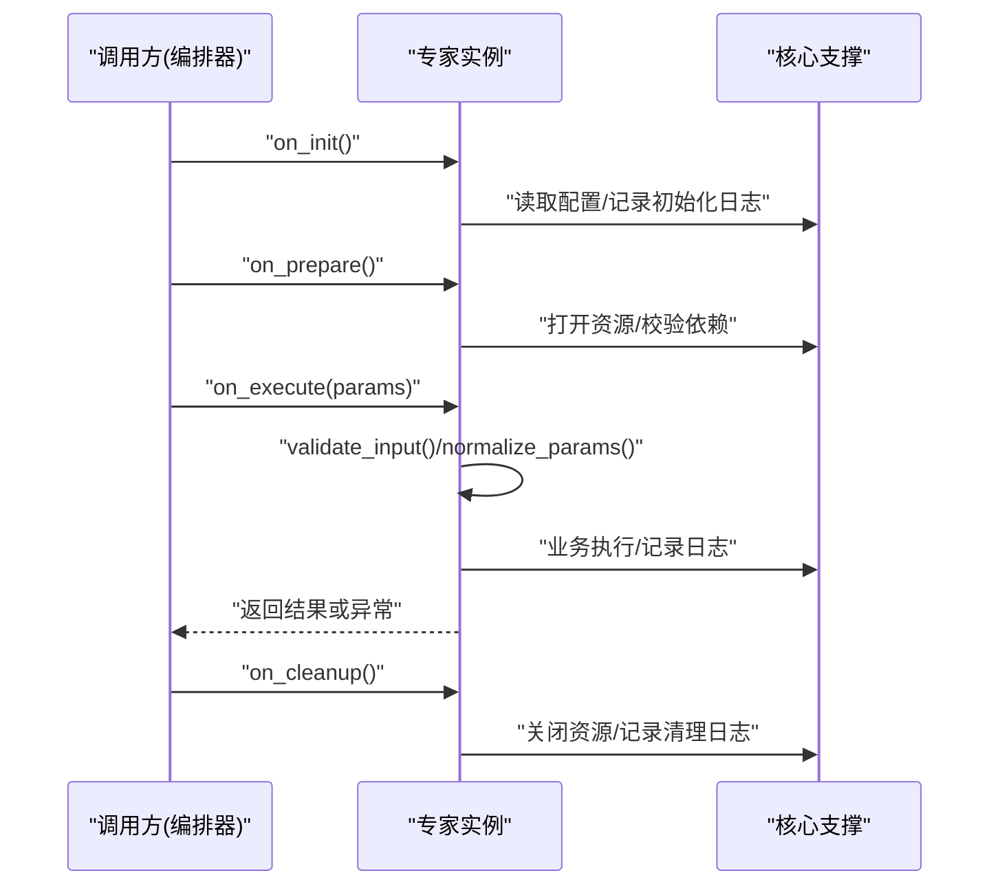
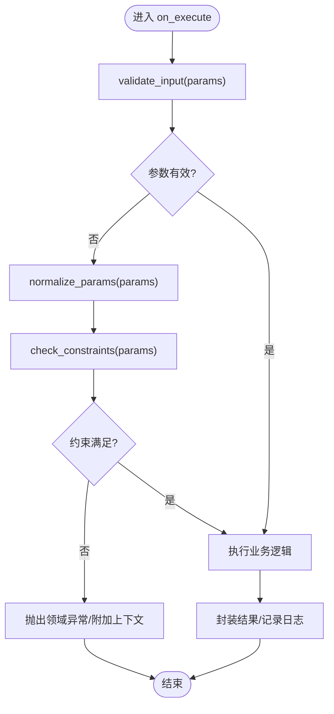
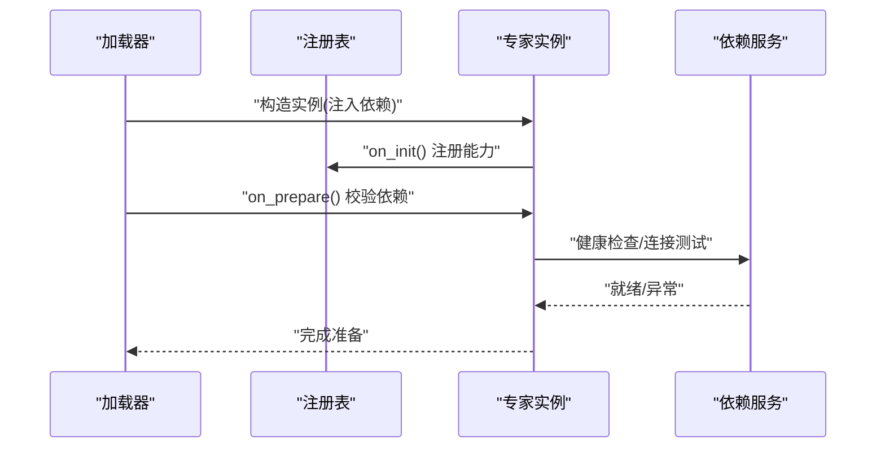
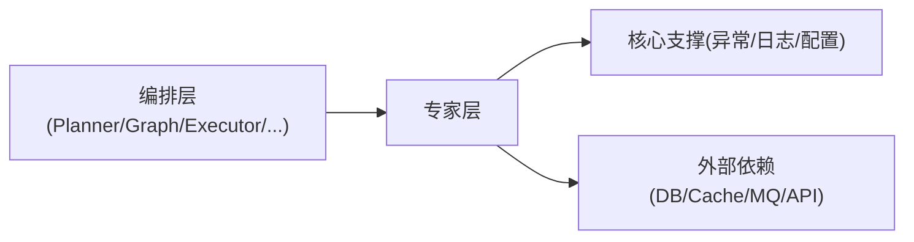

# 专家基类设计

<cite>
**本文引用的文件**   
- [backend_design/nexus/agent/experts/base.py](file://backend_design/nexus/agent/experts/base.py)
- [backend_design/nexus/agent/experts/chat_expert.py](file://backend_design/nexus/agent/experts/chat_expert.py)
- [backend_design/nexus/agent/experts/health_expert.py](file://backend_design/nexus/agent/experts/health_expert.py)
- [backend_design/nexus/agent/experts/lifestyle_expert.py](file://backend_design/nexus/agent/experts/lifestyle_expert.py)
- [backend_design/nexus/agent/experts/nav_expert.py](file://backend_design/nexus/agent/experts/nav_expert.py)
- [backend_design/nexus/agent/experts/vehicle_expert.py](file://backend_design/nexus/agent/experts/vehicle_expert.py)
- [backend_design/nexus/agent/__init__.py](file://backend_design/nexus/agent/__init__.py)
- [backend_design/nexus/agent/executor.py](file://backend_design/nexus/agent/executor.py)
- [backend_design/nexus/agent/graph.py](file://backend_design/nexus/agent/graph.py)
- [backend_design/nexus/agent/planner.py](file://backend_design/nexus/agent/planner.py)
- [backend_design/nexus/agent/responder.py](file://backend_design/nexus/agent/responder.py)
- [backend_design/nexus/agent/reviewer.py](file://backend_design/nexus/agent/reviewer.py)
- [backend_design/nexus/agent/subagent_monitor.py](file://backend_design/nexus/agent/subagent_monitor.py)
- [backend_design/nexus/agent/supervisor_graph.py](file://backend_design/nexus/agent/supervisor_graph.py)
- [backend_design/nexus/core/exceptions.py](file://backend_design/nexus/core/exceptions.py)
- [backend_design/nexus/core/logger.py](file://backend_design/nexus/core/logger.py)
- [backend_design/nexus/config.py](file://backend_design/nexus/config.py)
</cite>

## 目录
1. [简介](#简介)
2. [项目结构](#项目结构)
3. [核心组件](#核心组件)
4. [架构总览](#架构总览)
5. [详细组件分析](#详细组件分析)
6. [依赖关系分析](#依赖关系分析)
7. [性能考虑](#性能考虑)
8. [故障排查指南](#故障排查指南)
9. [结论](#结论)
10. [附录](#附录)

## 简介
本文件面向NexusCockpit的“专家”子系统，聚焦于专家抽象基类 ExpertBase 的设计模式与接口规范。文档将系统阐述：
- 专家生命周期管理（初始化、准备、执行、清理）
- 能力声明机制（元数据、参数契约、版本与兼容性）
- 参数验证与错误处理策略
- 专家注册流程、依赖注入与配置管理
- 扩展指南：如何继承基类创建新专家类型，包括自定义方法、状态管理与资源清理最佳实践

## 项目结构
专家相关代码位于 backend_design/nexus/agent/experts 目录，其中 base.py 定义专家抽象基类，其他文件为具体专家实现；agent 层提供编排、调度与监控等支撑能力。

图表来源
- [backend_design/nexus/agent/experts/base.py](file://backend_design/nexus/agent/experts/base.py)
- [backend_design/nexus/agent/experts/chat_expert.py](file://backend_design/nexus/agent/experts/chat_expert.py)
- [backend_design/nexus/agent/experts/health_expert.py](file://backend_design/nexus/agent/experts/health_expert.py)
- [backend_design/nexus/agent/experts/lifestyle_expert.py](file://backend_design/nexus/agent/experts/lifestyle_expert.py)
- [backend_design/nexus/agent/experts/nav_expert.py](file://backend_design/nexus/agent/experts/nav_expert.py)
- [backend_design/nexus/agent/experts/vehicle_expert.py](file://backend_design/nexus/agent/experts/vehicle_expert.py)
- [backend_design/nexus/agent/executor.py](file://backend_design/nexus/agent/executor.py)
- [backend_design/nexus/agent/graph.py](file://backend_design/nexus/agent/graph.py)
- [backend_design/nexus/agent/planner.py](file://backend_design/nexus/agent/planner.py)
- [backend_design/nexus/agent/responder.py](file://backend_design/nexus/agent/responder.py)
- [backend_design/nexus/agent/reviewer.py](file://backend_design/nexus/agent/reviewer.py)
- [backend_design/nexus/agent/subagent_monitor.py](file://backend_design/nexus/agent/subagent_monitor.py)
- [backend_design/nexus/agent/supervisor_graph.py](file://backend_design/nexus/agent/supervisor_graph.py)
- [backend_design/nexus/core/exceptions.py](file://backend_design/nexus/core/exceptions.py)
- [backend_design/nexus/core/logger.py](file://backend_design/nexus/core/logger.py)
- [backend_design/nexus/config.py](file://backend_design/nexus/config.py)

章节来源
- [backend_design/nexus/agent/experts/base.py](file://backend_design/nexus/agent/experts/base.py)
- [backend_design/nexus/agent/experts/chat_expert.py](file://backend_design/nexus/agent/experts/chat_expert.py)
- [backend_design/nexus/agent/experts/health_expert.py](file://backend_design/nexus/agent/experts/health_expert.py)
- [backend_design/nexus/agent/experts/lifestyle_expert.py](file://backend_design/nexus/agent/experts/lifestyle_expert.py)
- [backend_design/nexus/agent/experts/nav_expert.py](file://backend_design/nexus/agent/experts/nav_expert.py)
- [backend_design/nexus/agent/experts/vehicle_expert.py](file://backend_design/nexus/agent/experts/vehicle_expert.py)
- [backend_design/nexus/agent/executor.py](file://backend_design/nexus/agent/executor.py)
- [backend_design/nexus/agent/graph.py](file://backend_design/nexus/agent/graph.py)
- [backend_design/nexus/agent/planner.py](file://backend_design/nexus/agent/planner.py)
- [backend_design/nexus/agent/responder.py](file://backend_design/nexus/agent/responder.py)
- [backend_design/nexus/agent/reviewer.py](file://backend_design/nexus/agent/reviewer.py)
- [backend_design/nexus/agent/subagent_monitor.py](file://backend_design/nexus/agent/subagent_monitor.py)
- [backend_design/nexus/agent/supervisor_graph.py](file://backend_design/nexus/agent/supervisor_graph.py)
- [backend_design/nexus/core/exceptions.py](file://backend_design/nexus/core/exceptions.py)
- [backend_design/nexus/core/logger.py](file://backend_design/nexus/core/logger.py)
- [backend_design/nexus/config.py](file://backend_design/nexus/config.py)

## 核心组件
- ExpertBase 抽象基类
  - 职责：统一专家的生命周期、能力声明、参数校验、错误处理、日志与配置访问、资源清理等通用能力。
  - 关键接口（概念性说明）：
    - 生命周期钩子：初始化、准备、执行、清理
    - 能力声明：名称、描述、版本、输入输出契约、依赖项
    - 参数验证：入参结构校验、默认值填充、约束检查
    - 错误处理：领域异常抛出、上下文信息附加、可恢复错误标记
    - 配置管理：从全局配置读取专家级配置
    - 日志记录：结构化日志、上下文追踪ID
    - 资源管理：打开/关闭资源、超时控制、优雅退出
- 具体专家实现
  - ChatExpert、HealthExpert、LifestyleExpert、NavExpert、VehicleExpert 等，均继承自 ExpertBase，并实现各自业务逻辑。

章节来源
- [backend_design/nexus/agent/experts/base.py](file://backend_design/nexus/agent/experts/base.py)
- [backend_design/nexus/agent/experts/chat_expert.py](file://backend_design/nexus/agent/experts/chat_expert.py)
- [backend_design/nexus/agent/experts/health_expert.py](file://backend_design/nexus/agent/experts/health_expert.py)
- [backend_design/nexus/agent/experts/lifestyle_expert.py](file://backend_design/nexus/agent/experts/lifestyle_expert.py)
- [backend_design/nexus/agent/experts/nav_expert.py](file://backend_design/nexus/agent/experts/nav_expert.py)
- [backend_design/nexus/agent/experts/vehicle_expert.py](file://backend_design/nexus/agent/experts/vehicle_expert.py)

## 架构总览
专家基类在整体系统中的位置如下：
- 上层编排器（Planner/Graph/Executor/Responder/Reviewer/SubAgentMonitor/SupervisorGraph）通过统一的专家接口调用专家能力
- 专家内部使用核心支撑模块（异常、日志、配置）保证一致性与可观测性

图表来源
- [backend_design/nexus/agent/experts/base.py](file://backend_design/nexus/agent/experts/base.py)
- [backend_design/nexus/agent/planner.py](file://backend_design/nexus/agent/planner.py)
- [backend_design/nexus/agent/graph.py](file://backend_design/nexus/agent/graph.py)
- [backend_design/nexus/agent/executor.py](file://backend_design/nexus/agent/executor.py)
- [backend_design/nexus/core/exceptions.py](file://backend_design/nexus/core/exceptions.py)
- [backend_design/nexus/core/logger.py](file://backend_design/nexus/core/logger.py)
- [backend_design/nexus/config.py](file://backend_design/nexus/config.py)

## 详细组件分析

### ExpertBase 抽象基类
- 设计模式
  - 模板方法模式：定义生命周期骨架（初始化→准备→执行→清理），子类仅实现差异部分
  - 策略模式：能力声明作为策略元数据，供编排器动态选择
  - 工厂/注册表模式：通过注册表集中管理专家实例，支持按需加载与热插拔
- 核心接口规范（概念性）
  - 能力声明：name、version、description、input_schema、output_schema、dependencies
  - 生命周期钩子：on_init、on_prepare、on_execute、on_cleanup
  - 参数验证：validate_input、normalize_params、check_constraints
  - 错误处理：raise_domain_error、attach_context、recoverable标志
  - 配置访问：get_config(key, default)、merge_expert_config
  - 日志记录：log_info、log_warn、log_error、trace_id
  - 资源管理：open_resources、close_resources、timeout_handler
- 扩展点
  - 重写 on_execute 实现业务逻辑
  - 重写 validate_input 进行强类型校验
  - 重写 on_prepare/on_cleanup 管理外部资源（连接池、临时文件等）
  - 重写 dependencies 声明外部服务依赖，便于编排器做前置检查

图表来源
- [backend_design/nexus/agent/experts/base.py](file://backend_design/nexus/agent/experts/base.py)
- [backend_design/nexus/agent/experts/chat_expert.py](file://backend_design/nexus/agent/experts/chat_expert.py)
- [backend_design/nexus/agent/experts/health_expert.py](file://backend_design/nexus/agent/experts/health_expert.py)
- [backend_design/nexus/agent/experts/lifestyle_expert.py](file://backend_design/nexus/agent/experts/lifestyle_expert.py)
- [backend_design/nexus/agent/experts/nav_expert.py](file://backend_design/nexus/agent/experts/nav_expert.py)
- [backend_design/nexus/agent/experts/vehicle_expert.py](file://backend_design/nexus/agent/experts/vehicle_expert.py)

章节来源
- [backend_design/nexus/agent/experts/base.py](file://backend_design/nexus/agent/experts/base.py)

### 专家生命周期管理
- 阶段划分
  - 初始化：加载配置、解析能力元数据、建立基础依赖
  - 准备：打开外部资源、预热缓存、校验环境可用性
  - 执行：参数校验、业务计算、结果封装
  - 清理：释放资源、写审计日志、上报指标
- 时序图（基于实际文件映射）

图表来源
- [backend_design/nexus/agent/experts/base.py](file://backend_design/nexus/agent/experts/base.py)
- [backend_design/nexus/core/logger.py](file://backend_design/nexus/core/logger.py)
- [backend_design/nexus/config.py](file://backend_design/nexus/config.py)

章节来源
- [backend_design/nexus/agent/experts/base.py](file://backend_design/nexus/agent/experts/base.py)

### 能力声明机制
- 目的：为编排器提供静态能力画像，用于路由、校验与可视化
- 内容要点
  - 标识：name、version、description
  - 契约：input_schema、output_schema（字段、类型、必填、默认值）
  - 依赖：dependencies（外部服务、模型、工具）
  - 行为：是否幂等、是否异步、超时阈值、重试策略
- 使用方式
  - 专家在 on_init 中注册自身能力到注册表
  - 编排器根据能力匹配与约束检查选择合适专家

章节来源
- [backend_design/nexus/agent/experts/base.py](file://backend_design/nexus/agent/experts/base.py)

### 参数验证与错误处理策略
- 参数验证流程（流程图）

图表来源
- [backend_design/nexus/agent/experts/base.py](file://backend_design/nexus/agent/experts/base.py)
- [backend_design/nexus/core/exceptions.py](file://backend_design/nexus/core/exceptions.py)

- 错误处理策略
  - 领域异常：区分可恢复与不可恢复错误，附带 trace_id 与上下文
  - 降级与重试：对瞬时失败采用指数退避重试，设置最大次数与超时
  - 熔断保护：对下游依赖失败快速失败，避免雪崩
  - 审计与告警：关键错误写入审计日志并触发告警

章节来源
- [backend_design/nexus/agent/experts/base.py](file://backend_design/nexus/agent/experts/base.py)
- [backend_design/nexus/core/exceptions.py](file://backend_design/nexus/core/exceptions.py)

### 专家注册流程与依赖注入
- 注册流程
  - 专家在 on_init 中向注册表登记能力元数据
  - 注册表维护 name→专家实例映射，支持版本选择与优先级
- 依赖注入
  - 通过构造函数或 on_init 注入共享依赖（如数据库客户端、消息队列、缓存）
  - 依赖校验：在 on_prepare 阶段检查依赖可用性与健康状态

图表来源
- [backend_design/nexus/agent/experts/base.py](file://backend_design/nexus/agent/experts/base.py)
- [backend_design/nexus/agent/__init__.py](file://backend_design/nexus/agent/__init__.py)

章节来源
- [backend_design/nexus/agent/experts/base.py](file://backend_design/nexus/agent/experts/base.py)
- [backend_design/nexus/agent/__init__.py](file://backend_design/nexus/agent/__init__.py)

### 配置管理
- 配置来源
  - 全局配置：config.py 提供的统一配置入口
  - 专家级配置：按专家名隔离的配置段，支持覆盖与合并
- 访问方式
  - get_config(key, default)：安全读取，缺失时回退默认值
  - merge_expert_config(cfg)：合并专家配置到运行时上下文

章节来源
- [backend_design/nexus/config.py](file://backend_design/nexus/config.py)
- [backend_design/nexus/agent/experts/base.py](file://backend_design/nexus/agent/experts/base.py)

### 扩展指南：如何创建新的专家类型
- 步骤概览
  - 新建专家类，继承 ExpertBase
  - 声明能力元数据（name、version、description、schema、dependencies）
  - 实现 on_execute 业务逻辑，必要时重写 validate_input/check_constraints
  - 在 on_prepare/on_cleanup 中管理外部资源
  - 在 on_init 中完成依赖注入与注册
- 最佳实践
  - 幂等性：确保重复调用不会产生副作用
  - 超时与重试：为外部调用设置合理超时与重试策略
  - 日志与追踪：每个关键路径记录结构化日志与 trace_id
  - 错误分类：明确区分用户输入错误、系统错误与第三方错误
  - 资源清理：无论成功或失败都要确保 on_cleanup 被调用

章节来源
- [backend_design/nexus/agent/experts/base.py](file://backend_design/nexus/agent/experts/base.py)

### 具体专家示例（引用路径）
- 聊天专家：[chat_expert.py](file://backend_design/nexus/agent/experts/chat_expert.py)
- 健康专家：[health_expert.py](file://backend_design/nexus/agent/experts/health_expert.py)
- 生活方式专家：[lifestyle_expert.py](file://backend_design/nexus/agent/experts/lifestyle_expert.py)
- 导航专家：[nav_expert.py](file://backend_design/nexus/agent/experts/nav_expert.py)
- 车辆专家：[vehicle_expert.py](file://backend_design/nexus/agent/experts/vehicle_expert.py)

章节来源
- [backend_design/nexus/agent/experts/chat_expert.py](file://backend_design/nexus/agent/experts/chat_expert.py)
- [backend_design/nexus/agent/experts/health_expert.py](file://backend_design/nexus/agent/experts/health_expert.py)
- [backend_design/nexus/agent/experts/lifestyle_expert.py](file://backend_design/nexus/agent/experts/lifestyle_expert.py)
- [backend_design/nexus/agent/experts/nav_expert.py](file://backend_design/nexus/agent/experts/nav_expert.py)
- [backend_design/nexus/agent/experts/vehicle_expert.py](file://backend_design/nexus/agent/experts/vehicle_expert.py)

## 依赖关系分析
- 组件耦合
  - 专家层对核心支撑（异常、日志、配置）存在直接依赖
  - 编排层对专家层存在间接依赖（通过注册表与统一接口）
- 潜在循环依赖
  - 应避免专家反向依赖编排器，保持单向依赖
- 外部依赖
  - 数据库、缓存、消息队列、外部API等应在 on_prepare 中健康检查

图表来源
- [backend_design/nexus/agent/experts/base.py](file://backend_design/nexus/agent/experts/base.py)
- [backend_design/nexus/agent/planner.py](file://backend_design/nexus/agent/planner.py)
- [backend_design/nexus/agent/graph.py](file://backend_design/nexus/agent/graph.py)
- [backend_design/nexus/agent/executor.py](file://backend_design/nexus/agent/executor.py)
- [backend_design/nexus/core/exceptions.py](file://backend_design/nexus/core/exceptions.py)
- [backend_design/nexus/core/logger.py](file://backend_design/nexus/core/logger.py)
- [backend_design/nexus/config.py](file://backend_design/nexus/config.py)

章节来源
- [backend_design/nexus/agent/experts/base.py](file://backend_design/nexus/agent/experts/base.py)
- [backend_design/nexus/agent/planner.py](file://backend_design/nexus/agent/planner.py)
- [backend_design/nexus/agent/graph.py](file://backend_design/nexus/agent/graph.py)
- [backend_design/nexus/agent/executor.py](file://backend_design/nexus/agent/executor.py)
- [backend_design/nexus/core/exceptions.py](file://backend_design/nexus/core/exceptions.py)
- [backend_design/nexus/core/logger.py](file://backend_design/nexus/core/logger.py)
- [backend_design/nexus/config.py](file://backend_design/nexus/config.py)

## 性能考虑
- 参数校验尽量在 on_execute 早期进行，减少无效计算
- 外部依赖调用应复用连接与缓存热点数据
- 批量操作优先使用批接口，降低网络往返
- 合理设置超时与并发度，避免阻塞与资源耗尽
- 使用结构化日志与采样策略，避免日志风暴

## 故障排查指南
- 常见问题定位
  - 参数校验失败：检查 input_schema 与 validate_input 实现
  - 依赖不可用：查看 on_prepare 的健康检查与异常信息
  - 超时与重试：确认超时阈值与重试策略是否符合预期
  - 资源泄漏：确认 on_cleanup 是否在所有分支中被调用
- 诊断手段
  - 启用 trace_id 关联请求链路
  - 增加关键路径的日志级别
  - 使用核心异常类型区分错误类别，便于告警与统计

章节来源
- [backend_design/nexus/core/exceptions.py](file://backend_design/nexus/core/exceptions.py)
- [backend_design/nexus/core/logger.py](file://backend_design/nexus/core/logger.py)
- [backend_design/nexus/agent/experts/base.py](file://backend_design/nexus/agent/experts/base.py)

## 结论
ExpertBase 通过模板方法与统一接口规范，为专家子系统提供了稳定可扩展的基础设施。借助能力声明、参数验证、错误处理与资源管理，专家可以在一致的契约下被编排器动态发现与调用。遵循本文档的最佳实践，可以快速构建高质量、可维护的新专家类型。

## 附录
- 术语
  - 专家：具备特定能力的可执行单元，由 ExpertBase 抽象定义
  - 编排器：负责选择与调度专家的组件（Planner/Graph/Executor 等）
  - 注册表：维护专家能力与实例映射的中央目录
- 参考文件
  - 抽象基类与具体实现：见“详细组件分析”中的文件路径
  - 核心支撑：异常、日志、配置模块见“依赖关系分析”中的文件路径