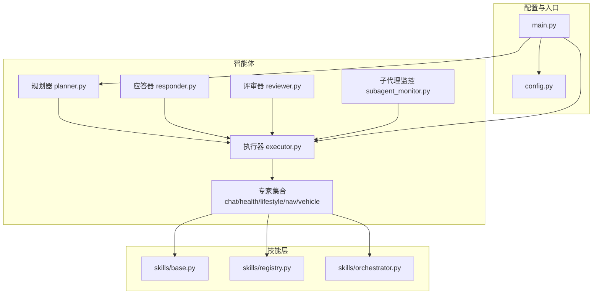
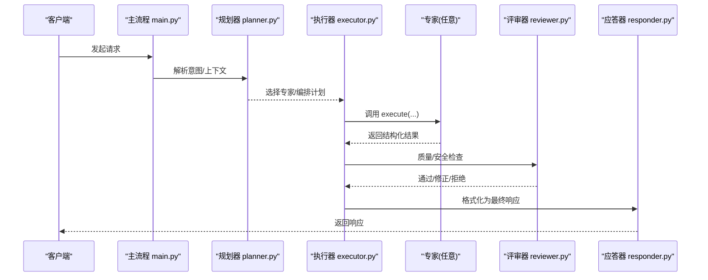
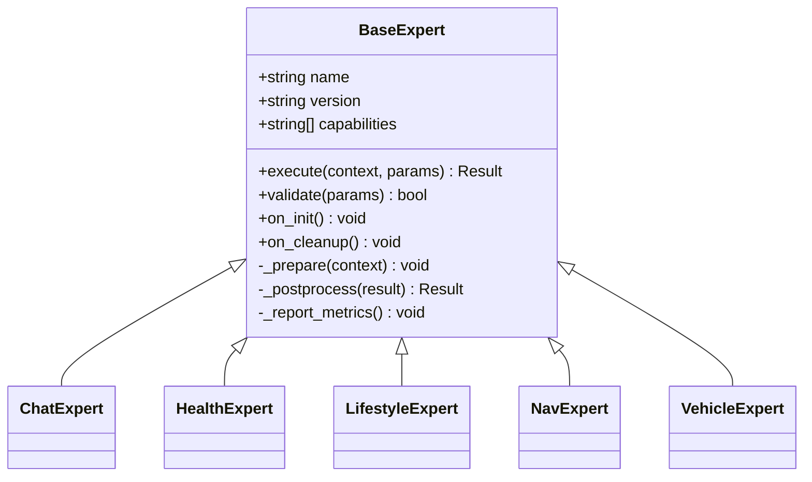
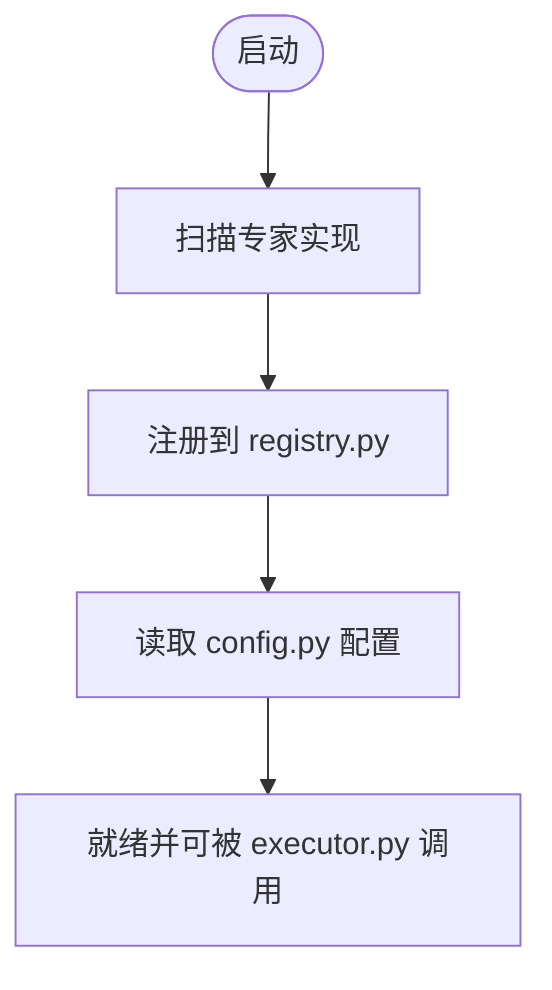
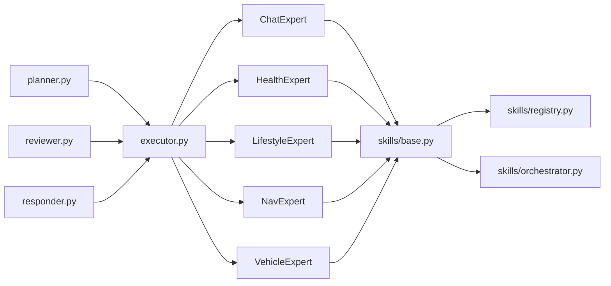

# 专家系统设计

<cite>
**本文引用的文件**   
- [base.py](file://backend_design/nexus/agent/experts/base.py)
- [chat_expert.py](file://backend_design/nexus/agent/experts/chat_expert.py)
- [health_expert.py](file://backend_design/nexus/agent/experts/health_expert.py)
- [lifestyle_expert.py](file://backend_design/nexus/agent/experts/lifestyle_expert.py)
- [nav_expert.py](file://backend_design/nexus/agent/experts/nav_expert.py)
- [vehicle_expert.py](file://backend_design/nexus/agent/experts/vehicle_expert.py)
- [executor.py](file://backend_design/nexus/agent/executor.py)
- [planner.py](file://backend_design/nexus/agent/planner.py)
- [responder.py](file://backend_design/nexus/agent/responder.py)
- [reviewer.py](file://backend_design/nexus/agent/reviewer.py)
- [subagent_monitor.py](file://backend_design/nexus/agent/subagent_monitor.py)
- [__init__.py](file://backend_design/nexus/agent/experts/__init__.py)
- [orchestrator.py](file://backend_design/nexus/skills/orchestrator.py)
- [registry.py](file://backend_design/nexus/skills/registry.py)
- [base.py](file://backend_design/nexus/skills/base.py)
- [config.py](file://backend_design/nexus/config.py)
- [main.py](file://backend_design/nexus/main.py)
</cite>

## 目录
1. [简介](#简介)
2. [项目结构](#项目结构)
3. [核心组件](#核心组件)
4. [架构总览](#架构总览)
5. [详细组件分析](#详细组件分析)
6. [依赖关系分析](#依赖关系分析)
7. [性能考量](#性能考量)
8. [故障排查指南](#故障排查指南)
9. [结论](#结论)
10. [附录：自定义专家开发指南](#附录自定义专家开发指南)

## 简介
本文件面向NexusCockpit的“专家系统”，聚焦于专家基类与各专用专家的设计模式、接口规范与协作协议，并给出注册机制、能力声明与扩展方法。读者将了解聊天、健康、生活方式、导航、车辆五大专家的职责边界与交互方式，以及如何基于统一接口快速实现自定义专家并在系统中注册与部署。

## 项目结构
专家系统位于后端智能体模块中，围绕“专家”这一可插拔单元组织代码：
- 专家基类定义统一的调用契约与元数据（能力、版本、描述等）
- 各专用专家继承基类，实现领域逻辑
- 执行器负责调度、编排与监控
- 技能层提供通用能力（如记忆、RAG、工具调用）与注册中心

图表来源
- [executor.py:1-200](file://backend_design/nexus/agent/executor.py#L1-L200)
- [planner.py:1-200](file://backend_design/nexus/agent/planner.py#L1-L200)
- [responder.py:1-200](file://backend_design/nexus/agent/responder.py#L1-L200)
- [reviewer.py:1-200](file://backend_design/nexus/agent/reviewer.py#L1-L200)
- [subagent_monitor.py:1-200](file://backend_design/nexus/agent/subagent_monitor.py#L1-L200)
- [base.py](file://backend_design/nexus/agent/experts/base.py)
- [base.py](file://backend_design/nexus/skills/base.py)
- [registry.py](file://backend_design/nexus/skills/registry.py)
- [orchestrator.py](file://backend_design/nexus/skills/orchestrator.py)
- [config.py](file://backend_design/nexus/config.py)
- [main.py](file://backend_design/nexus/main.py)

章节来源
- [executor.py:1-200](file://backend_design/nexus/agent/executor.py#L1-L200)
- [planner.py:1-200](file://backend_design/nexus/agent/planner.py#L1-L200)
- [responder.py:1-200](file://backend_design/nexus/agent/responder.py#L1-L200)
- [reviewer.py:1-200](file://backend_design/nexus/agent/reviewer.py#L1-L200)
- [subagent_monitor.py:1-200](file://backend_design/nexus/agent/subagent_monitor.py#L1-L200)
- [base.py](file://backend_design/nexus/agent/experts/base.py)
- [base.py](file://backend_design/nexus/skills/base.py)
- [registry.py](file://backend_design/nexus/skills/registry.py)
- [orchestrator.py](file://backend_design/nexus/skills/orchestrator.py)
- [config.py](file://backend_design/nexus/config.py)
- [main.py](file://backend_design/nexus/main.py)

## 核心组件
- 专家基类：定义专家的统一接口、元数据与生命周期钩子，确保所有专家具备一致的能力声明、输入校验、输出结构与错误处理约定。
- 执行器：负责加载专家、路由请求、并发控制、超时与重试、结果聚合与回退。
- 规划器：根据意图或上下文选择专家或组合多个专家协同完成复杂任务。
- 应答器：对专家输出进行格式化、模板化与多模态适配（文本/语音/结构化）。
- 评审器：对专家输出进行质量检查、安全过滤与合规校验。
- 子代理监控：跟踪专家执行状态、资源使用与异常上报。
- 技能注册中心：集中管理专家与技能的注册、发现与版本兼容。

章节来源
- [base.py](file://backend_design/nexus/agent/experts/base.py)
- [executor.py:1-200](file://backend_design/nexus/agent/executor.py#L1-L200)
- [planner.py:1-200](file://backend_design/nexus/agent/planner.py#L1-L200)
- [responder.py:1-200](file://backend_design/nexus/agent/responder.py#L1-L200)
- [reviewer.py:1-200](file://backend_design/nexus/agent/reviewer.py#L1-L200)
- [subagent_monitor.py:1-200](file://backend_design/nexus/agent/subagent_monitor.py#L1-L200)
- [registry.py](file://backend_design/nexus/skills/registry.py)

## 架构总览
专家系统采用“基类约束 + 插件式注册 + 执行器编排”的架构。专家通过统一接口暴露能力，由执行器在运行时动态发现与调用；规划器决定单专家或多专家协作路径；评审器与监控贯穿全链路保障质量与安全。

图表来源
- [main.py](file://backend_design/nexus/main.py)
- [planner.py:1-200](file://backend_design/nexus/agent/planner.py#L1-L200)
- [executor.py:1-200](file://backend_design/nexus/agent/executor.py#L1-L200)
- [reviewer.py:1-200](file://backend_design/nexus/agent/reviewer.py#L1-L200)
- [responder.py:1-200](file://backend_design/nexus/agent/responder.py#L1-L200)

## 详细组件分析

### 专家基类设计模式与接口规范
- 设计模式
  - 模板方法：基类定义标准执行流程（校验→准备→执行→后处理→上报），子类仅实现核心逻辑。
  - 能力声明：通过元数据描述专家名称、版本、能力标签、输入输出Schema、权限要求等。
  - 生命周期钩子：支持初始化、预热、清理等钩子，便于资源管理与缓存预热。
  - 错误契约：统一异常类型与错误码，便于上层重试与降级。
- 接口要点
  - 输入参数：标准化为强类型对象，包含上下文、用户标识、会话信息、可选外部数据。
  - 输出结果：结构化数据，包含内容、元数据、置信度、建议动作与副作用标记。
  - 副作用：明确标注是否涉及外部系统（如车辆控制、导航下发），以便审批与审计。
  - 可观测性：内置埋点键位，便于指标采集与追踪。

图表来源
- [base.py](file://backend_design/nexus/agent/experts/base.py)

章节来源
- [base.py](file://backend_design/nexus/agent/experts/base.py)

### 聊天专家（chat_expert.py）
- 职责：自然语言对话理解与生成，支持上下文维护、澄清提问、多轮对话策略。
- 关键能力
  - 意图识别与槽位填充
  - 对话状态机（空闲/倾听/澄清/确认/执行）
  - 安全过滤与敏感词检测
  - 多模态输出适配（文本/语音）
- 协作协议
  - 与其他专家协作时，通过“建议动作”字段传递控制权（如转交健康专家）。
  - 输出包含“需要澄清”的提示，驱动规划器进入澄清分支。

章节来源
- [chat_expert.py](file://backend_design/nexus/agent/experts/chat_expert.py)

### 健康专家（health_expert.py）
- 职责：健康咨询与建议，结合用户画像与健康档案，提供个性化指导。
- 关键能力
  - 健康指标解读（心率、血压、睡眠等）
  - 风险预警与阈值告警
  - 建议生成与随访提醒
- 数据与隐私
  - 严格的数据访问控制与最小化原则
  - 输出附带数据来源与可信度评分

章节来源
- [health_expert.py](file://backend_design/nexus/agent/experts/health_expert.py)

### 生活方式专家（lifestyle_expert.py）
- 职责：习惯养成与行为建议，基于历史行为与环境上下文提供个性化方案。
- 关键能力
  - 习惯建模与目标分解
  - 激励策略与反馈闭环
  - 场景化触发（时间/地点/事件）
- 算法要点
  - 规则+模型混合推荐
  - A/B测试与效果评估

章节来源
- [lifestyle_expert.py](file://backend_design/nexus/agent/experts/lifestyle_expert.py)

### 导航专家（nav_expert.py）
- 职责：路径规划与导航下发，支持多目的地、实时路况与偏好设置。
- 关键能力
  - 起点/终点解析与纠偏
  - 多策略路径计算（最短/最少拥堵/最舒适）
  - 导航指令下发与状态同步
- 外部集成
  - 地图服务、交通数据源、车载导航子系统

章节来源
- [nav_expert.py](file://backend_design/nexus/agent/experts/nav_expert.py)

### 车辆专家（vehicle_expert.py）
- 职责：车辆控制与状态查询，涵盖空调、座椅、车窗、媒体等。
- 关键能力
  - 设备抽象与命令封装
  - 权限校验与操作审计
  - 失败重试与状态一致性保障
- 安全与可靠性
  - 关键操作二次确认
  - 熔断与降级策略

章节来源
- [vehicle_expert.py](file://backend_design/nexus/agent/experts/vehicle_expert.py)

### 专家注册机制、能力声明与协作协议
- 注册机制
  - 通过技能注册中心集中登记专家元数据与实现类
  - 启动时自动扫描与加载，支持热更新与版本兼容
- 能力声明
  - 以标签形式声明能力域（如“对话”、“健康”、“导航”、“车控”）
  - 输入输出Schema用于静态校验与可视化编排
- 协作协议
  - 专家间通过“建议动作”与“副作用标记”进行松耦合协作
  - 执行器依据规划器决策进行串行/并行编排与结果融合

图表来源
- [registry.py](file://backend_design/nexus/skills/registry.py)
- [config.py](file://backend_design/nexus/config.py)
- [executor.py:1-200](file://backend_design/nexus/agent/executor.py#L1-L200)

章节来源
- [registry.py](file://backend_design/nexus/skills/registry.py)
- [config.py](file://backend_design/nexus/config.py)
- [executor.py:1-200](file://backend_design/nexus/agent/executor.py#L1-L200)

## 依赖关系分析
- 内部依赖
  - 专家依赖技能基类与注册中心，获取通用能力与发现其他专家
  - 执行器依赖规划器、评审器与监控，形成完整编排链路
- 外部依赖
  - 地图/交通服务（导航专家）
  - 车辆总线/网关（车辆专家）
  - 健康数据源（健康专家）
  - 记忆/RAG（通用）

图表来源
- [base.py](file://backend_design/nexus/agent/experts/base.py)
- [base.py](file://backend_design/nexus/skills/base.py)
- [registry.py](file://backend_design/nexus/skills/registry.py)
- [orchestrator.py](file://backend_design/nexus/skills/orchestrator.py)
- [executor.py:1-200](file://backend_design/nexus/agent/executor.py#L1-L200)
- [planner.py:1-200](file://backend_design/nexus/agent/planner.py#L1-L200)
- [reviewer.py:1-200](file://backend_design/nexus/agent/reviewer.py#L1-L200)
- [responder.py:1-200](file://backend_design/nexus/agent/responder.py#L1-L200)

章节来源
- [base.py](file://backend_design/nexus/agent/experts/base.py)
- [base.py](file://backend_design/nexus/skills/base.py)
- [registry.py](file://backend_design/nexus/skills/registry.py)
- [orchestrator.py](file://backend_design/nexus/skills/orchestrator.py)
- [executor.py:1-200](file://backend_design/nexus/agent/executor.py#L1-L200)
- [planner.py:1-200](file://backend_design/nexus/agent/planner.py#L1-L200)
- [reviewer.py:1-200](file://backend_design/nexus/agent/reviewer.py#L1-L200)
- [responder.py:1-200](file://backend_design/nexus/agent/responder.py#L1-L200)

## 性能考量
- 专家执行
  - 合理拆分长耗时任务，避免阻塞执行器线程
  - 使用连接池与缓存减少外部调用开销
- 并发与限流
  - 按专家能力设置并发上限与队列长度
  - 对第三方服务实施速率限制与熔断
- 结果聚合
  - 并行编排时采用幂等合并策略，避免重复副作用
- 可观测性
  - 关键路径埋点，记录延迟、吞吐与错误率

[本节为通用指导，不直接分析具体文件]

## 故障排查指南
- 常见问题
  - 专家未注册：检查注册中心与启动扫描日志
  - 输入校验失败：核对输入Schema与必填字段
  - 外部依赖超时：查看熔断与重试配置
  - 权限不足：确认操作审计与权限策略
- 定位步骤
  - 从执行器日志入手，定位专家名与请求ID
  - 审查评审器与监控上报的错误码
  - 复现最小用例，逐步隔离问题域

章节来源
- [executor.py:1-200](file://backend_design/nexus/agent/executor.py#L1-L200)
- [reviewer.py:1-200](file://backend_design/nexus/agent/reviewer.py#L1-L200)
- [subagent_monitor.py:1-200](file://backend_design/nexus/agent/subagent_monitor.py#L1-L200)

## 结论
专家系统通过统一基类与注册中心实现了高内聚、低耦合的可插拔架构。各专用专家遵循一致的接口与协作协议，配合执行器、规划器、评审器与监控，形成稳定可靠的智能体运行环境。该设计既满足当前五大专家场景，也为后续扩展提供了清晰路径。

[本节为总结性内容，不直接分析具体文件]

## 附录：自定义专家开发指南
- 接口实现
  - 继承专家基类，实现核心执行方法与输入校验
  - 声明能力标签、版本与副作用标记
  - 实现必要钩子（初始化/清理）以管理资源
- 测试方法
  - 单元测试：覆盖输入校验、正常路径与异常分支
  - 集成测试：模拟外部依赖，验证端到端流程
  - 回归测试：确保与现有专家协作无冲突
- 部署步骤
  - 将新专家放入专家目录并确保导入可见
  - 在注册中心或自动扫描范围内生效
  - 更新配置项（如并发、超时、开关）
  - 启动服务并验证专家可用性与指标上报

章节来源
- [base.py](file://backend_design/nexus/agent/experts/base.py)
- [registry.py](file://backend_design/nexus/skills/registry.py)
- [config.py](file://backend_design/nexus/config.py)
- [executor.py:1-200](file://backend_design/nexus/agent/executor.py#L1-L200)