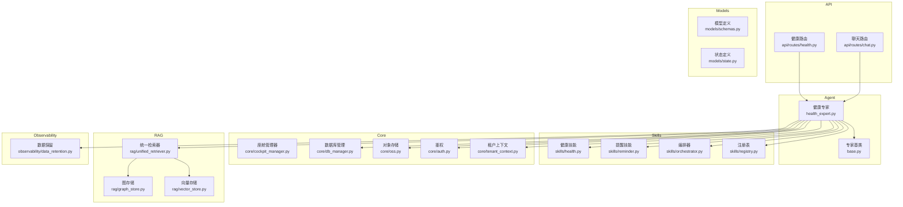
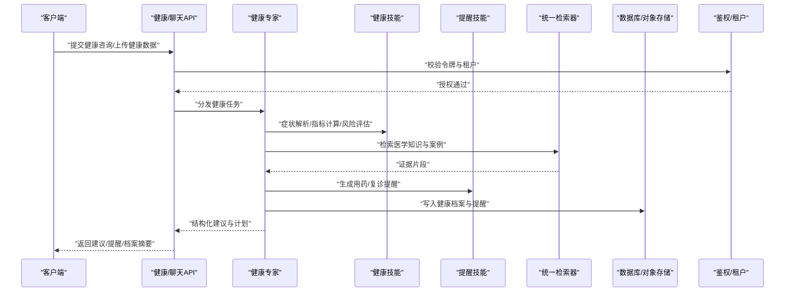
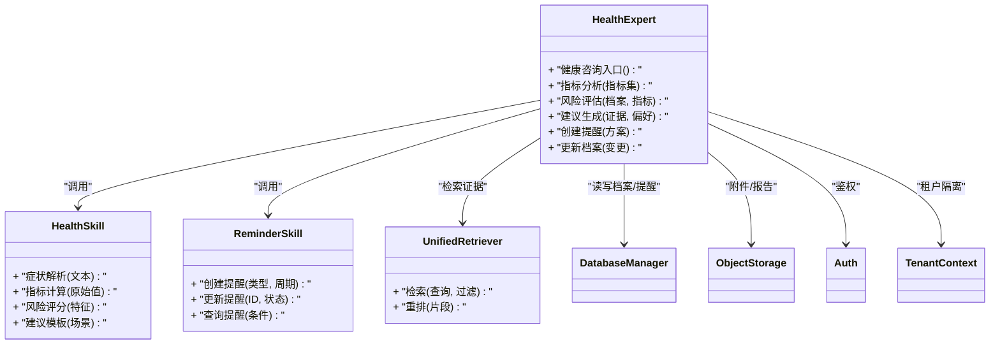
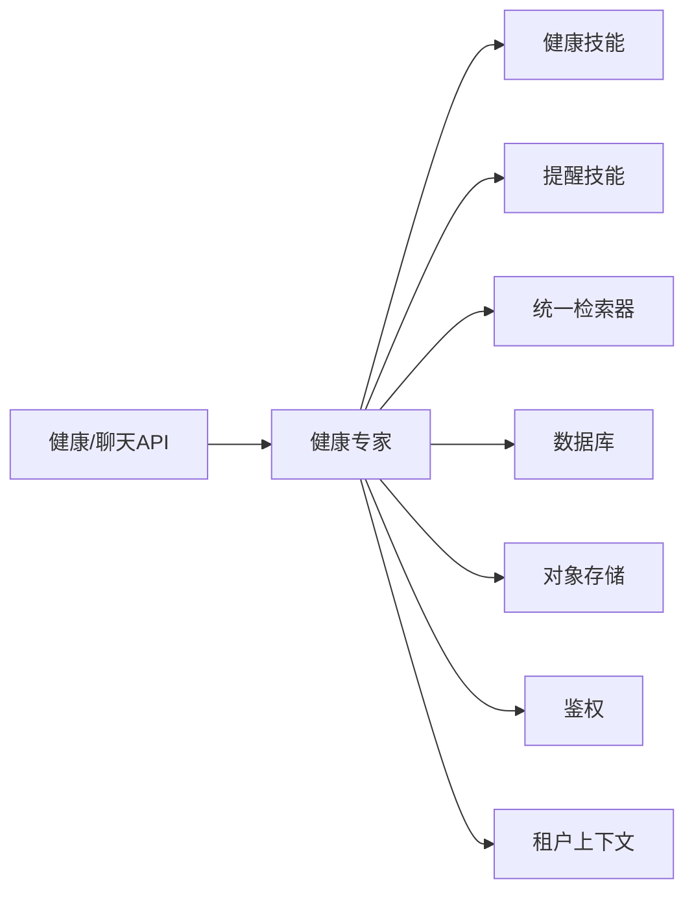
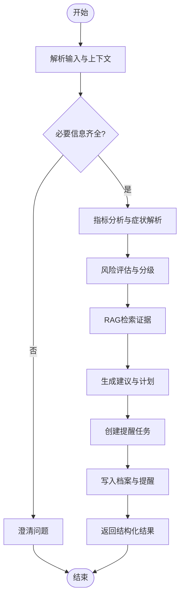

# 健康专家

<cite>
**本文引用的文件**   
- [health_expert.py](file://backend_design/nexus/agent/experts/health_expert.py)
- [base.py](file://backend_design/nexus/agent/experts/base.py)
- [health.py](file://backend_design/nexus/skills/health.py)
- [reminder.py](file://backend_design/nexus/skills/reminder.py)
- [orchestrator.py](file://backend_design/nexus/skills/orchestrator.py)
- [registry.py](file://backend_design/nexus/skills/registry.py)
- [health.py](file://backend_design/nexus/api/routes/health.py)
- [chat.py](file://backend_design/nexus/api/routes/chat.py)
- [schemas.py](file://backend_design/nexus/models/schemas.py)
- [state.py](file://backend_design/nexus/models/state.py)
- [cockpit_manager.py](file://backend_design/nexus/core/cockpit_manager.py)
- [db_manager.py](file://backend_design/nexus/core/db_manager.py)
- [oss.py](file://backend_design/nexus/core/oss.py)
- [auth.py](file://backend_design/nexus/core/auth.py)
- [tenant_context.py](file://backend_design/nexus/core/tenant_context.py)
- [unified_retriever.py](file://backend_design/nexus/rag/unified_retriever.py)
- [graph_store.py](file://backend_design/nexus/rag/graph_store.py)
- [vector_store.py](file://backend_design/nexus/rag/vector_store.py)
- [data_retention.py](file://backend_design/nexus/observability/data_retention.py)
</cite>

## 目录
1. [简介](#简介)
2. [项目结构](#项目结构)
3. [核心组件](#核心组件)
4. [架构总览](#架构总览)
5. [详细组件分析](#详细组件分析)
6. [依赖关系分析](#依赖关系分析)
7. [性能考虑](#性能考虑)
8. [故障排查指南](#故障排查指南)
9. [结论](#结论)
10. [附录](#附录)

## 简介
本文件面向NexusCockpit的“健康专家”能力，系统性阐述其健康咨询逻辑与健康数据管理能力。内容覆盖：
- 健康指标分析与疾病风险评估
- 用药提醒与健康建议生成
- 健康数据存储结构、隐私保护与访问控制
- 健康咨询处理流程（症状分析、健康档案管理、个性化计划）
- 健康API集成示例与数据处理最佳实践

## 项目结构
健康专家相关代码主要分布在以下模块：
- Agent层：健康专家实现与基类
- Skills层：健康技能、提醒编排与注册表
- API层：健康路由与聊天路由
- Models层：请求/响应模型与状态定义
- Core层：数据库、对象存储、认证与租户上下文
- RAG层：统一检索器与图/向量存储
- Observability层：数据保留策略

图表来源
- [health_expert.py](file://backend_design/nexus/agent/experts/health_expert.py)
- [base.py](file://backend_design/nexus/agent/experts/base.py)
- [health.py](file://backend_design/nexus/skills/health.py)
- [reminder.py](file://backend_design/nexus/skills/reminder.py)
- [orchestrator.py](file://backend_design/nexus/skills/orchestrator.py)
- [registry.py](file://backend_design/nexus/skills/registry.py)
- [health.py](file://backend_design/nexus/api/routes/health.py)
- [chat.py](file://backend_design/nexus/api/routes/chat.py)
- [schemas.py](file://backend_design/nexus/models/schemas.py)
- [state.py](file://backend_design/nexus/models/state.py)
- [cockpit_manager.py](file://backend_design/nexus/core/cockpit_manager.py)
- [db_manager.py](file://backend_design/nexus/core/db_manager.py)
- [oss.py](file://backend_design/nexus/core/oss.py)
- [auth.py](file://backend_design/nexus/core/auth.py)
- [tenant_context.py](file://backend_design/nexus/core/tenant_context.py)
- [unified_retriever.py](file://backend_design/nexus/rag/unified_retriever.py)
- [graph_store.py](file://backend_design/nexus/rag/graph_store.py)
- [vector_store.py](file://backend_design/nexus/rag/vector_store.py)
- [data_retention.py](file://backend_design/nexus/observability/data_retention.py)

章节来源
- [health_expert.py](file://backend_design/nexus/agent/experts/health_expert.py)
- [health.py](file://backend_design/nexus/skills/health.py)
- [reminder.py](file://backend_design/nexus/skills/reminder.py)
- [health.py](file://backend_design/nexus/api/routes/health.py)
- [schemas.py](file://backend_design/nexus/models/schemas.py)
- [state.py](file://backend_design/nexus/models/state.py)
- [db_manager.py](file://backend_design/nexus/core/db_manager.py)
- [oss.py](file://backend_design/nexus/core/oss.py)
- [auth.py](file://backend_design/nexus/core/auth.py)
- [tenant_context.py](file://backend_design/nexus/core/tenant_context.py)
- [unified_retriever.py](file://backend_design/nexus/rag/unified_retriever.py)
- [graph_store.py](file://backend_design/nexus/rag/graph_store.py)
- [vector_store.py](file://backend_design/nexus/rag/vector_store.py)
- [data_retention.py](file://backend_design/nexus/observability/data_retention.py)

## 核心组件
- 健康专家（HealthExpert）
  - 职责：承接健康咨询意图，协调健康技能、提醒、RAG检索、持久化与权限校验，输出结构化健康建议与行动计划。
  - 关键能力：症状解析、指标评估、风险分级、建议生成、提醒创建、档案更新。
- 健康技能（Health Skill）
  - 职责：封装健康领域知识、规则与工具调用，提供指标计算、风险评估与建议模板。
- 提醒技能（Reminder Skill）
  - 职责：维护用药与复诊等提醒任务，支持周期、优先级与触发策略。
- 统一检索器（Unified Retriever）
  - 职责：聚合图与向量检索结果，为健康建议提供证据支撑。
- 数据与权限
  - 数据库/对象存储：健康记录、档案、附件与日志。
  - 鉴权与租户：基于JWT与租户上下文的细粒度访问控制。
  - 数据保留：按策略清理过期健康数据。

章节来源
- [health_expert.py](file://backend_design/nexus/agent/experts/health_expert.py)
- [health.py](file://backend_design/nexus/skills/health.py)
- [reminder.py](file://backend_design/nexus/skills/reminder.py)
- [unified_retriever.py](file://backend_design/nexus/rag/unified_retriever.py)
- [db_manager.py](file://backend_design/nexus/core/db_manager.py)
- [oss.py](file://backend_design/nexus/core/oss.py)
- [auth.py](file://backend_design/nexus/core/auth.py)
- [tenant_context.py](file://backend_design/nexus/core/tenant_context.py)
- [data_retention.py](file://backend_design/nexus/observability/data_retention.py)

## 架构总览
健康咨询端到端流程：客户端通过健康或聊天API发起请求，进入健康专家编排；专家调用健康技能进行指标分析与风险评估，结合RAG检索医学知识，生成个性化建议与提醒；最终经鉴权与租户隔离后返回结果，并持久化到数据库与对象存储。

图表来源
- [health.py](file://backend_design/nexus/api/routes/health.py)
- [chat.py](file://backend_design/nexus/api/routes/chat.py)
- [health_expert.py](file://backend_design/nexus/agent/experts/health_expert.py)
- [health.py](file://backend_design/nexus/skills/health.py)
- [reminder.py](file://backend_design/nexus/skills/reminder.py)
- [unified_retriever.py](file://backend_design/nexus/rag/unified_retriever.py)
- [db_manager.py](file://backend_design/nexus/core/db_manager.py)
- [oss.py](file://backend_design/nexus/core/oss.py)
- [auth.py](file://backend_design/nexus/core/auth.py)
- [tenant_context.py](file://backend_design/nexus/core/tenant_context.py)

## 详细组件分析

### 健康专家（HealthExpert）
- 角色定位
  - 作为Agent层的健康领域专家，负责将用户输入转化为可执行的健康任务，协调各子技能完成咨询闭环。
- 关键方法（概念性说明）
  - 健康咨询入口：接收消息、解析意图、加载历史与档案、触发后续流程。
  - 指标分析：调用健康技能对血压、血糖、心率等指标进行趋势与阈值判断。
  - 风险评估：结合年龄、既往史、家族史与当前指标，输出风险等级与依据。
  - 建议生成：融合RAG检索到的权威资料，生成个性化建议与生活方式指导。
  - 提醒创建：根据用药方案与复诊计划，调用提醒技能生成周期性任务。
  - 档案更新：将本次对话要点、指标快照与建议写入健康档案。
- 错误与边界
  - 缺失必要字段时回退澄清问题；异常时降级为通用健康建议并记录日志。

图表来源
- [health_expert.py](file://backend_design/nexus/agent/experts/health_expert.py)
- [health.py](file://backend_design/nexus/skills/health.py)
- [reminder.py](file://backend_design/nexus/skills/reminder.py)
- [unified_retriever.py](file://backend_design/nexus/rag/unified_retriever.py)
- [db_manager.py](file://backend_design/nexus/core/db_manager.py)
- [oss.py](file://backend_design/nexus/core/oss.py)
- [auth.py](file://backend_design/nexus/core/auth.py)
- [tenant_context.py](file://backend_design/nexus/core/tenant_context.py)

章节来源
- [health_expert.py](file://backend_design/nexus/agent/experts/health_expert.py)
- [health.py](file://backend_design/nexus/skills/health.py)
- [reminder.py](file://backend_design/nexus/skills/reminder.py)
- [unified_retriever.py](file://backend_design/nexus/rag/unified_retriever.py)
- [db_manager.py](file://backend_design/nexus/core/db_manager.py)
- [oss.py](file://backend_design/nexus/core/oss.py)
- [auth.py](file://backend_design/nexus/core/auth.py)
- [tenant_context.py](file://backend_design/nexus/core/tenant_context.py)

### 健康技能（Health Skill）
- 功能范围
  - 症状解析：从自然语言中抽取主诉、持续时间、伴随症状等要素。
  - 指标计算：对采集的生理指标进行清洗、归一化与趋势分析。
  - 风险评估：基于规则与特征组合给出风险等级与解释。
  - 建议模板：针对不同场景（如高血压、糖尿病、睡眠障碍）生成建议骨架。
- 数据结构（概念）
  - 症状实体：主诉、时间线、严重度、触发因素。
  - 指标实体：名称、单位、测量时间、参考区间、趋势标签。
  - 风险实体：维度、分数、等级、依据片段。
  - 建议实体：类别、强度、行动项、注意事项。

章节来源
- [health.py](file://backend_design/nexus/skills/health.py)

### 提醒技能（Reminder Skill）
- 功能范围
  - 提醒类型：用药、复诊、运动、饮水、体检等。
  - 调度策略：一次性、每日、每周、自定义周期；支持优先级与重试。
  - 生命周期：创建、激活、暂停、完成、删除。
- 与专家协作
  - 专家在生成用药方案后，自动创建对应提醒；用户修改方案时同步更新提醒。

章节来源
- [reminder.py](file://backend_design/nexus/skills/reminder.py)

### 统一检索器（Unified Retriever）
- 功能范围
  - 多源检索：同时查询图数据库与向量库，合并并去重。
  - 重排：基于相关性、时效性与可信度对片段排序。
  - 过滤：按主题、版本、来源质量筛选。
- 使用场景
  - 为健康建议提供权威证据，确保建议的可追溯性与合规性。

章节来源
- [unified_retriever.py](file://backend_design/nexus/rag/unified_retriever.py)
- [graph_store.py](file://backend_design/nexus/rag/graph_store.py)
- [vector_store.py](file://backend_design/nexus/rag/vector_store.py)

### API层（健康与聊天）
- 健康API
  - 健康咨询：接收用户问题与上下文，返回结构化建议与提醒。
  - 健康数据上报：批量或单条上传指标，返回校验结果与归档位置。
  - 档案查询：按时间范围与指标维度获取健康档案摘要。
- 聊天API
  - 健康话题：在通用聊天流中识别健康意图，委派给健康专家。
- 模型与状态
  - 请求/响应模型：统一参数校验、错误码与分页结构。
  - 会话状态：维持上下文、历史摘要与临时变量。

章节来源
- [health.py](file://backend_design/nexus/api/routes/health.py)
- [chat.py](file://backend_design/nexus/api/routes/chat.py)
- [schemas.py](file://backend_design/nexus/models/schemas.py)
- [state.py](file://backend_design/nexus/models/state.py)

### 数据与权限（Core）
- 数据库与对象存储
  - 健康记录、提醒、档案与附件分别落盘；大文件走对象存储，元数据入库。
- 鉴权与租户
  - JWT校验与租户上下文注入，确保跨租户数据隔离与最小权限访问。
- 数据保留
  - 按策略定期清理过期健康数据，满足合规要求。

章节来源
- [db_manager.py](file://backend_design/nexus/core/db_manager.py)
- [oss.py](file://backend_design/nexus/core/oss.py)
- [auth.py](file://backend_design/nexus/core/auth.py)
- [tenant_context.py](file://backend_design/nexus/core/tenant_context.py)
- [data_retention.py](file://backend_design/nexus/observability/data_retention.py)

## 依赖关系分析
健康专家对外暴露API，对内依赖健康技能、提醒技能、RAG检索与持久化服务，并通过鉴权与租户上下文保障安全。

图表来源
- [health.py](file://backend_design/nexus/api/routes/health.py)
- [chat.py](file://backend_design/nexus/api/routes/chat.py)
- [health_expert.py](file://backend_design/nexus/agent/experts/health_expert.py)
- [health.py](file://backend_design/nexus/skills/health.py)
- [reminder.py](file://backend_design/nexus/skills/reminder.py)
- [unified_retriever.py](file://backend_design/nexus/rag/unified_retriever.py)
- [db_manager.py](file://backend_design/nexus/core/db_manager.py)
- [oss.py](file://backend_design/nexus/core/oss.py)
- [auth.py](file://backend_design/nexus/core/auth.py)
- [tenant_context.py](file://backend_design/nexus/core/tenant_context.py)

章节来源
- [health.py](file://backend_design/nexus/api/routes/health.py)
- [chat.py](file://backend_design/nexus/api/routes/chat.py)
- [health_expert.py](file://backend_design/nexus/agent/experts/health_expert.py)
- [health.py](file://backend_design/nexus/skills/health.py)
- [reminder.py](file://backend_design/nexus/skills/reminder.py)
- [unified_retriever.py](file://backend_design/nexus/rag/unified_retriever.py)
- [db_manager.py](file://backend_design/nexus/core/db_manager.py)
- [oss.py](file://backend_design/nexus/core/oss.py)
- [auth.py](file://backend_design/nexus/core/auth.py)
- [tenant_context.py](file://backend_design/nexus/core/tenant_context.py)

## 性能考虑
- 检索优化
  - 优先命中缓存与近邻索引；对高频查询做预取与批处理。
- 并发与限流
  - 健康API与提醒任务采用队列与限流，避免雪崩。
- 存储分层
  - 热数据入内存/缓存，温冷数据落盘；大附件走对象存储。
- 建议生成
  - 先规则后模型，减少LLM调用次数；对长上下文做摘要压缩。

[本节为通用性能建议，不直接分析具体文件]

## 故障排查指南
- 常见错误
  - 鉴权失败：检查JWT有效性与租户上下文是否正确注入。
  - 数据缺失：确认必填字段与指标单位是否规范。
  - 检索超时：检查图/向量存储连接与索引状态。
  - 提醒未触发：核对周期配置与任务队列状态。
- 定位步骤
  - 查看健康API日志与专家执行轨迹；核对数据库与对象存储写入成功。
  - 使用统一检索器的调试接口验证检索结果与重排顺序。
  - 通过数据保留策略检查是否被误删。

章节来源
- [health.py](file://backend_design/nexus/api/routes/health.py)
- [health_expert.py](file://backend_design/nexus/agent/experts/health_expert.py)
- [unified_retriever.py](file://backend_design/nexus/rag/unified_retriever.py)
- [db_manager.py](file://backend_design/nexus/core/db_manager.py)
- [oss.py](file://backend_design/nexus/core/oss.py)
- [auth.py](file://backend_design/nexus/core/auth.py)
- [tenant_context.py](file://backend_design/nexus/core/tenant_context.py)
- [data_retention.py](file://backend_design/nexus/observability/data_retention.py)

## 结论
健康专家以“技能+检索+持久化+权限”的架构，实现了从症状分析到个性化健康计划的完整闭环。通过统一检索器增强建议的证据基础，借助提醒技能提升依从性，并以严格的鉴权与数据保留策略保障隐私与合规。建议在持续迭代中完善指标标准化、风险模型可解释性与多模态健康数据的接入。

[本节为总结性内容，不直接分析具体文件]

## 附录

### 健康咨询处理流程（算法视角）

图表来源
- [health_expert.py](file://backend_design/nexus/agent/experts/health_expert.py)
- [health.py](file://backend_design/nexus/skills/health.py)
- [reminder.py](file://backend_design/nexus/skills/reminder.py)
- [unified_retriever.py](file://backend_design/nexus/rag/unified_retriever.py)
- [db_manager.py](file://backend_design/nexus/core/db_manager.py)

### 健康API集成示例（概念性）
- 健康咨询
  - 方法：POST /api/health/consult
  - 请求体：包含用户ID、问题文本、可选的历史摘要与指标快照
  - 响应：建议列表、风险等级、提醒清单、档案更新提示
- 健康数据上报
  - 方法：POST /api/health/metrics
  - 请求体：指标数组（名称、数值、单位、时间戳）
  - 响应：校验结果、归档位置、下次建议时间
- 档案查询
  - 方法：GET /api/health/profile?start=&end=&metrics=
  - 响应：时间序列摘要、趋势标签、异常点

章节来源
- [health.py](file://backend_design/nexus/api/routes/health.py)
- [schemas.py](file://backend_design/nexus/models/schemas.py)

### 数据处理最佳实践
- 数据标准化
  - 统一指标命名、单位与参考区间；缺失值与异常值需标注。
- 隐私与安全
  - 传输加密、存储脱敏、最小权限访问；敏感字段单独加密存储。
- 可追溯性
  - 每条建议附带证据片段与版本信息；提醒任务关联方案版本。
- 可观测性
  - 关键路径埋点与指标上报；异常告警与慢查询追踪。

[本节为通用实践建议，不直接分析具体文件]