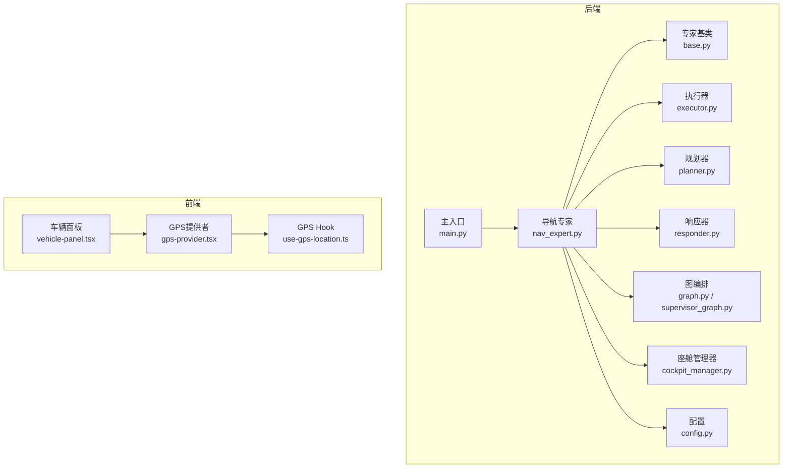
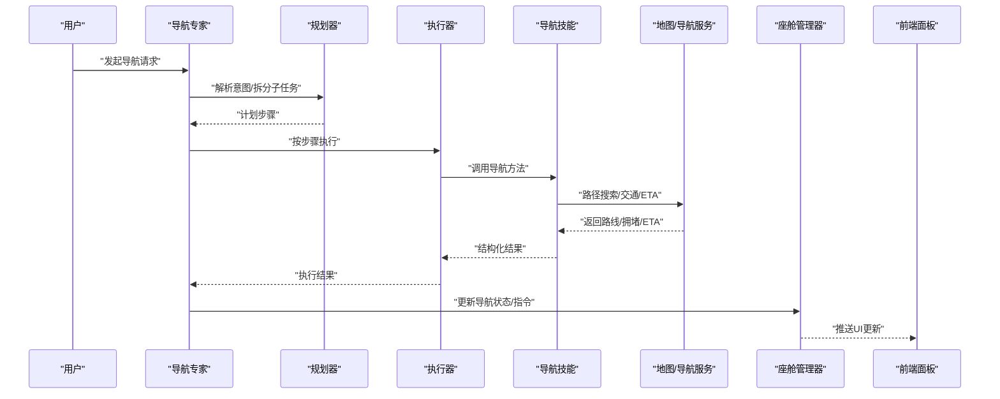
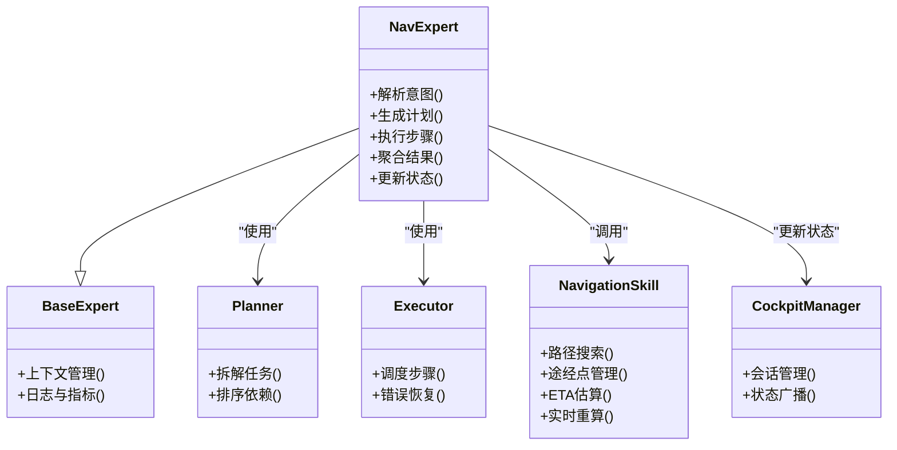
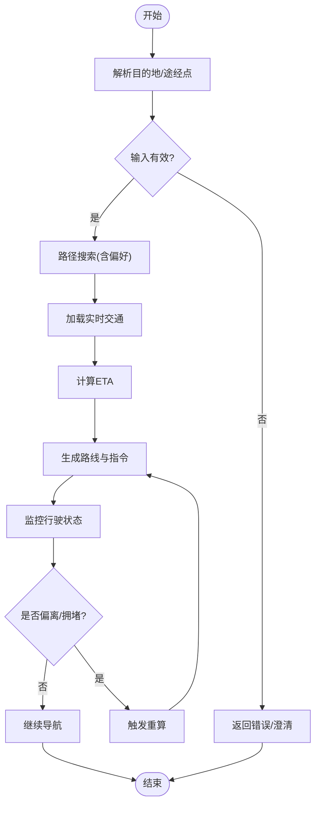
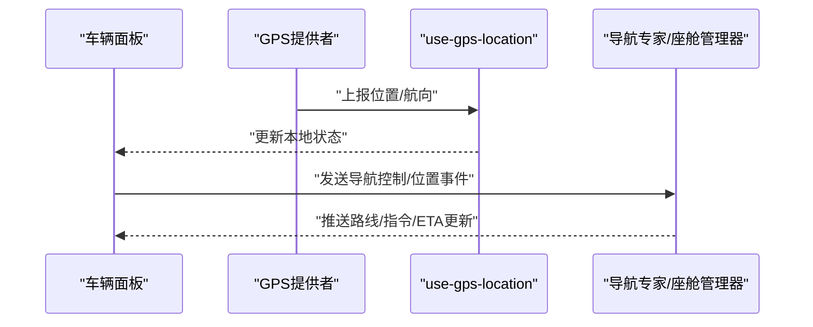
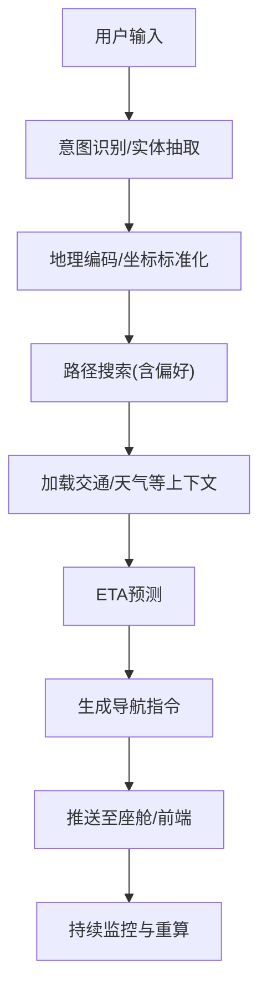
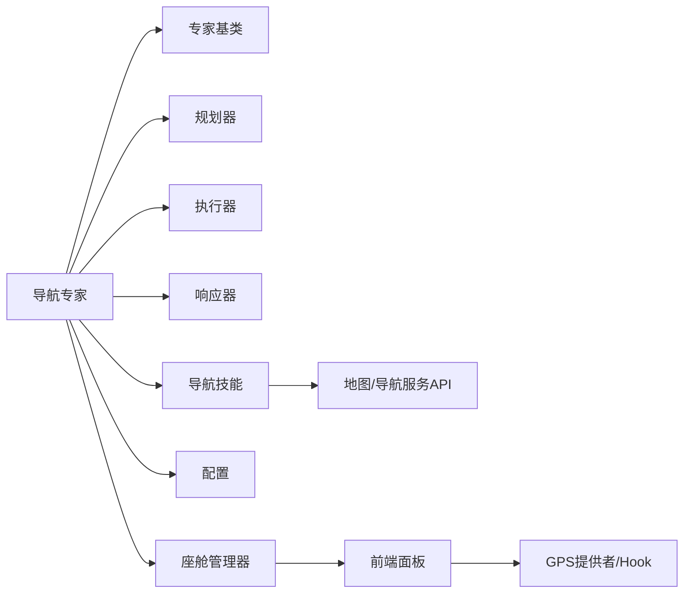

# 导航专家

<cite>
**本文引用的文件**   
- [nav_expert.py](file://backend_design/nexus/agent/experts/nav_expert.py)
- [navigation.py](file://backend_design/nexus/skills/vehicle/navigation.py)
- [base.py](file://backend_design/nexus/agent/experts/base.py)
- [executor.py](file://backend_design/nexus/agent/executor.py)
- [planner.py](file://backend_design/nexus/agent/planner.py)
- [responder.py](file://backend_design/nexus/agent/responder.py)
- [graph.py](file://backend_design/nexus/agent/graph.py)
- [supervisor_graph.py](file://backend_design/nexus/agent/supervisor_graph.py)
- [cockpit_manager.py](file://backend_design/nexus/core/cockpit_manager.py)
- [config.py](file://backend_design/nexus/config.py)
- [main.py](file://backend_design/nexus/main.py)
- [gps-provider.tsx](file://frontend_design/src/components/layout/gps-provider.tsx)
- [use-gps-location.ts](file://frontend_design/src/hooks/use-gps-location.ts)
- [vehicle-panel.tsx](file://frontend_design/src/components/vehicle/vehicle-panel.tsx)
</cite>

## 目录
1. [简介](#简介)
2. [项目结构](#项目结构)
3. [核心组件](#核心组件)
4. [架构总览](#架构总览)
5. [详细组件分析](#详细组件分析)
6. [依赖关系分析](#依赖关系分析)
7. [性能考虑](#性能考虑)
8. [故障排查指南](#故障排查指南)
9. [结论](#结论)
10. [附录](#附录)

## 简介
本文件面向NexusCockpit的“导航专家”（NavExpert）能力，系统化阐述其路径规划与地理信息服务集成的设计、数据流与处理逻辑。文档覆盖以下关键主题：
- 路线计算算法与多点导航规划
- 实时交通信息处理与ETA预测
- 地图数据集成、位置服务API调用与导航状态管理
- 完整导航流程：目的地解析、路线优化、指令生成与实时路径调整
- 地图API集成示例与导航性能优化策略

## 项目结构
导航相关代码主要分布在后端Agent专家层、车辆技能层、前端定位与展示层：
- 后端专家层：定义导航专家及其在智能体编排中的角色
- 车辆技能层：封装导航相关的业务方法与对外接口
- 前端层：提供GPS定位上下文与车载面板展示

图表来源
- [nav_expert.py](file://backend_design/nexus/agent/experts/nav_expert.py)
- [base.py](file://backend_design/nexus/agent/experts/base.py)
- [executor.py](file://backend_design/nexus/agent/executor.py)
- [planner.py](file://backend_design/nexus/agent/planner.py)
- [responder.py](file://backend_design/nexus/agent/responder.py)
- [graph.py](file://backend_design/nexus/agent/graph.py)
- [supervisor_graph.py](file://backend_design/nexus/agent/supervisor_graph.py)
- [cockpit_manager.py](file://backend_design/nexus/core/cockpit_manager.py)
- [config.py](file://backend_design/nexus/config.py)
- [main.py](file://backend_design/nexus/main.py)
- [gps-provider.tsx](file://frontend_design/src/components/layout/gps-provider.tsx)
- [use-gps-location.ts](file://frontend_design/src/hooks/use-gps-location.ts)
- [vehicle-panel.tsx](file://frontend_design/src/components/vehicle/vehicle-panel.tsx)

章节来源
- [nav_expert.py](file://backend_design/nexus/agent/experts/nav_expert.py)
- [navigation.py](file://backend_design/nexus/skills/vehicle/navigation.py)
- [base.py](file://backend_design/nexus/agent/experts/base.py)
- [executor.py](file://backend_design/nexus/agent/executor.py)
- [planner.py](file://backend_design/nexus/agent/planner.py)
- [responder.py](file://backend_design/nexus/agent/responder.py)
- [graph.py](file://backend_design/nexus/agent/graph.py)
- [supervisor_graph.py](file://backend_design/nexus/agent/supervisor_graph.py)
- [cockpit_manager.py](file://backend_design/nexus/core/cockpit_manager.py)
- [config.py](file://backend_design/nexus/config.py)
- [main.py](file://backend_design/nexus/main.py)
- [gps-provider.tsx](file://frontend_design/src/components/layout/gps-provider.tsx)
- [use-gps-location.ts](file://frontend_design/src/hooks/use-gps-location.ts)
- [vehicle-panel.tsx](file://frontend_design/src/components/vehicle/vehicle-panel.tsx)

## 核心组件
- 导航专家（NavExpert）
  - 职责：接收用户自然语言或结构化意图，解析目的地与约束条件，协调路线计算、交通信息、多点规划与ETA预测，并输出导航指令与状态。
  - 协作：通过执行器与规划器进行任务分解与调度；通过响应器生成最终结果；通过座舱管理器更新UI状态。
- 车辆导航技能（Navigation Skill）
  - 职责：封装与地图/导航服务交互的方法，如起点/终点解析、路径搜索、重算、途经点管理、ETA估算等。
- GPS提供者与Hook（前端）
  - 职责：获取设备位置、维护定位上下文、向面板暴露最新位置与航向等信息。
- 座舱管理器
  - 职责：集中管理导航会话、状态机与事件广播，驱动前后端同步。

章节来源
- [nav_expert.py](file://backend_design/nexus/agent/experts/nav_expert.py)
- [navigation.py](file://backend_design/nexus/skills/vehicle/navigation.py)
- [gps-provider.tsx](file://frontend_design/src/components/layout/gps-provider.tsx)
- [use-gps-location.ts](file://frontend_design/src/hooks/use-gps-location.ts)
- [cockpit_manager.py](file://backend_design/nexus/core/cockpit_manager.py)

## 架构总览
导航专家处于Agent编排中心，负责将用户意图转化为可执行的导航任务，并通过车辆技能与外部地图服务交互，最终由座舱管理器统一推送至前端。

图表来源
- [nav_expert.py](file://backend_design/nexus/agent/experts/nav_expert.py)
- [planner.py](file://backend_design/nexus/agent/planner.py)
- [executor.py](file://backend_design/nexus/agent/executor.py)
- [navigation.py](file://backend_design/nexus/skills/vehicle/navigation.py)
- [cockpit_manager.py](file://backend_design/nexus/core/cockpit_manager.py)

## 详细组件分析

### 导航专家（NavExpert）
- 功能要点
  - 意图解析：从对话上下文中抽取目的地、偏好（最短时间/最少拥堵）、途经点、出发时间等。
  - 任务编排：基于规划器生成步骤序列，交由执行器串行/并行执行。
  - 结果聚合：整合路线、交通、ETA与指令，形成最终导航响应。
  - 状态管理：通过座舱管理器维护导航会话与状态机。
- 关键交互
  - 与规划器/执行器协作完成多步任务
  - 与导航技能交互以调用地图服务
  - 与座舱管理器同步状态与事件

图表来源
- [nav_expert.py](file://backend_design/nexus/agent/experts/nav_expert.py)
- [base.py](file://backend_design/nexus/agent/experts/base.py)
- [planner.py](file://backend_design/nexus/agent/planner.py)
- [executor.py](file://backend_design/nexus/agent/executor.py)
- [navigation.py](file://backend_design/nexus/skills/vehicle/navigation.py)
- [cockpit_manager.py](file://backend_design/nexus/core/cockpit_manager.py)

章节来源
- [nav_expert.py](file://backend_design/nexus/agent/experts/nav_expert.py)
- [base.py](file://backend_design/nexus/agent/experts/base.py)
- [planner.py](file://backend_design/nexus/agent/planner.py)
- [executor.py](file://backend_design/nexus/agent/executor.py)
- [navigation.py](file://backend_design/nexus/skills/vehicle/navigation.py)
- [cockpit_manager.py](file://backend_design/nexus/core/cockpit_manager.py)

### 车辆导航技能（Navigation Skill）
- 功能要点
  - 目的地解析：支持地址、POI、坐标等多源输入，标准化为经纬度与语义描述。
  - 路径搜索：根据偏好选择最优路径（时间/距离/避堵）。
  - 多点导航：支持添加/删除途经点，动态重排顺序。
  - ETA预测：结合历史与时变交通数据给出到达时间估计。
  - 实时重算：当偏离路线或交通突变时触发重新规划。
- 外部集成
  - 地图/导航服务API：路径搜索、路况、ETA、地理编码/逆地理编码。
  - 缓存与降级：对热点查询做缓存，失败时回退到默认策略。

图表来源
- [navigation.py](file://backend_design/nexus/skills/vehicle/navigation.py)

章节来源
- [navigation.py](file://backend_design/nexus/skills/vehicle/navigation.py)

### 前端定位与展示（GPS Provider & Vehicle Panel）
- GPS提供者
  - 提供设备位置、速度、航向等上下文，供导航专家与面板消费。
- 车辆面板
  - 展示当前路线、下一步指令、剩余时间与距离、预计到达时间等。
- 数据流
  - 前端周期性上报位置，后端据此进行实时重算与状态更新。

图表来源
- [gps-provider.tsx](file://frontend_design/src/components/layout/gps-provider.tsx)
- [use-gps-location.ts](file://frontend_design/src/hooks/use-gps-location.ts)
- [vehicle-panel.tsx](file://frontend_design/src/components/vehicle/vehicle-panel.tsx)

章节来源
- [gps-provider.tsx](file://frontend_design/src/components/layout/gps-provider.tsx)
- [use-gps-location.ts](file://frontend_design/src/hooks/use-gps-location.ts)
- [vehicle-panel.tsx](file://frontend_design/src/components/vehicle/vehicle-panel.tsx)

### 导航处理完整流程
- 目的地解析
  - 从对话上下文提取地点实体，必要时进行地理编码/反地理编码。
- 路线优化
  - 依据偏好与实时交通选择最优路径，支持多点排序优化。
- 指令生成
  - 将几何路径转换为分步导航指令（转向、车道、限速提示等）。
- 实时路径调整
  - 基于位置漂移、道路封闭、突发拥堵触发重算与指令刷新。

[此图为概念性流程图，不直接映射具体源码文件]

## 依赖关系分析
- 内部依赖
  - 导航专家依赖专家基类、规划器、执行器、响应器、座舱管理器与配置。
  - 导航技能作为独立模块被专家调用，屏蔽外部地图服务细节。
- 外部依赖
  - 地图/导航服务API（路径搜索、交通、ETA、地理编码）。
  - 前端定位服务（浏览器/设备GPS）。
- 潜在耦合点
  - 导航技能对外部地图服务的强耦合，建议通过适配器与重试/熔断机制解耦。
  - 座舱管理器与前端协议需保持稳定，避免频繁变更导致联调成本上升。

图表来源
- [nav_expert.py](file://backend_design/nexus/agent/experts/nav_expert.py)
- [base.py](file://backend_design/nexus/agent/experts/base.py)
- [planner.py](file://backend_design/nexus/agent/planner.py)
- [executor.py](file://backend_design/nexus/agent/executor.py)
- [responder.py](file://backend_design/nexus/agent/responder.py)
- [cockpit_manager.py](file://backend_design/nexus/core/cockpit_manager.py)
- [config.py](file://backend_design/nexus/config.py)
- [navigation.py](file://backend_design/nexus/skills/vehicle/navigation.py)
- [gps-provider.tsx](file://frontend_design/src/components/layout/gps-provider.tsx)
- [use-gps-location.ts](file://frontend_design/src/hooks/use-gps-location.ts)
- [vehicle-panel.tsx](file://frontend_design/src/components/vehicle/vehicle-panel.tsx)

章节来源
- [nav_expert.py](file://backend_design/nexus/agent/experts/nav_expert.py)
- [navigation.py](file://backend_design/nexus/skills/vehicle/navigation.py)
- [gps-provider.tsx](file://frontend_design/src/components/layout/gps-provider.tsx)
- [use-gps-location.ts](file://frontend_design/src/hooks/use-gps-location.ts)
- [vehicle-panel.tsx](file://frontend_design/src/components/vehicle/vehicle-panel.tsx)
- [cockpit_manager.py](file://backend_design/nexus/core/cockpit_manager.py)
- [config.py](file://backend_design/nexus/config.py)

## 性能考虑
- 路由计算与ETA
  - 采用分层路网与预计算启发式加速A*或Dijkstra变体；对热点OD对启用缓存。
  - ETA融合历史分布与时变特征，降低极端波动。
- 实时交通
  - 增量更新路段权重，避免全量重算；设置阈值触发重算，减少抖动。
- 多点规划
  - 使用TSP近似算法（如最近邻+局部搜索）快速求解途经点顺序。
- 前端定位
  - 合理采样间隔与去抖滤波，避免频繁重算；网络异常时降级为离线模式。
- 并发与资源
  - 限制并发地图请求数，配合熔断与退避重试；对长耗时任务异步化。

[本节为通用性能指导，不直接分析具体文件]

## 故障排查指南
- 常见问题
  - 目的地无法解析：检查地理编码/反地理编码链路、输入格式与权限。
  - 路线无结果：确认起点/终点可达性、道路封闭与区域限制。
  - ETA异常：核查交通数据时效性与模型参数。
  - 实时重算频繁：调整重算阈值与去抖策略。
- 诊断手段
  - 查看导航专家日志与座舱状态事件。
  - 校验前端GPS数据质量（精度、更新频率）。
  - 对地图服务调用增加超时与错误码分类统计。

章节来源
- [nav_expert.py](file://backend_design/nexus/agent/experts/nav_expert.py)
- [navigation.py](file://backend_design/nexus/skills/vehicle/navigation.py)
- [cockpit_manager.py](file://backend_design/nexus/core/cockpit_manager.py)

## 结论
导航专家通过清晰的编排与模块化设计，将意图理解、路径规划、交通融合与状态管理有机结合，既保证了用户体验的流畅性，也为后续扩展（如多模态输入、更复杂的偏好与约束）预留了空间。建议在工程落地中强化外部服务适配层、完善观测与容错机制，并持续优化ETA与重算策略以提升整体性能与稳定性。

## 附录
- 地图API集成示例（概念性）
  - 地理编码：将地址文本转为经纬度
  - 路径搜索：传入起点、终点、途经点与偏好，返回几何与元信息
  - 实时交通：拉取路段拥堵指数，用于权重更新
  - ETA：基于当前路况与历史分布预测到达时间
- 导航状态管理（概念性）
  - 状态机：空闲→规划中→导航中→暂停→结束
  - 事件：路线就绪、指令更新、偏离提醒、到达提醒

[本节为概念性附录，不直接分析具体文件]