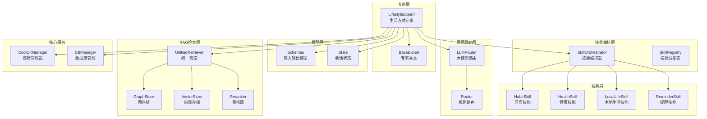
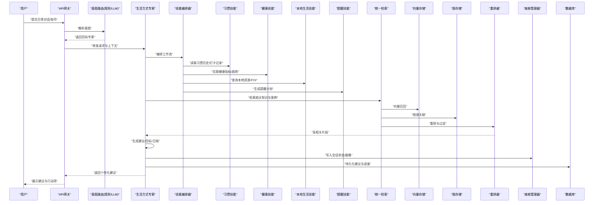
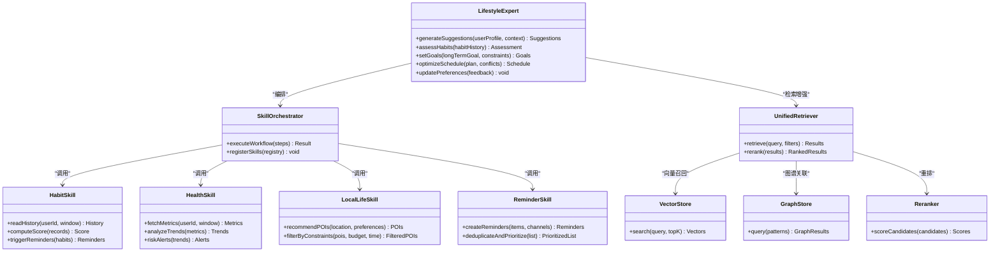
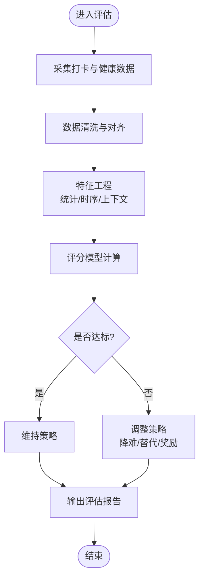
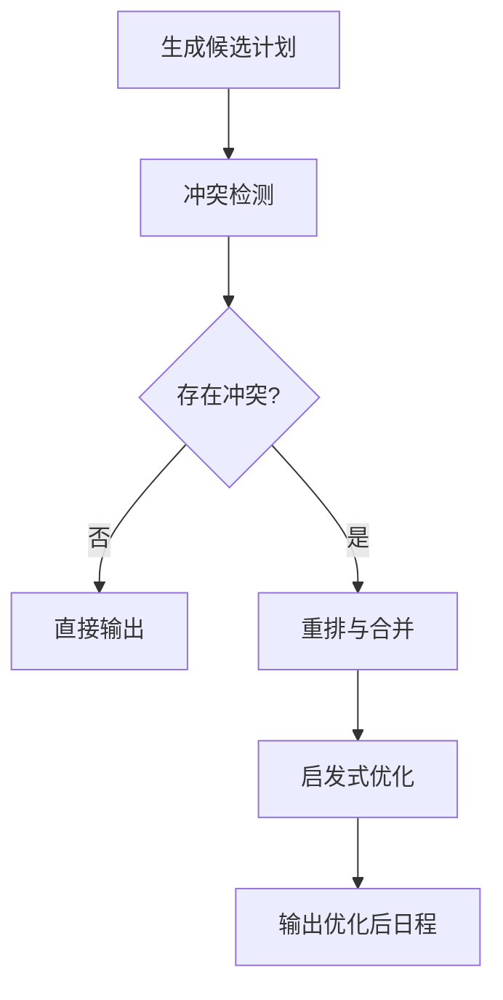
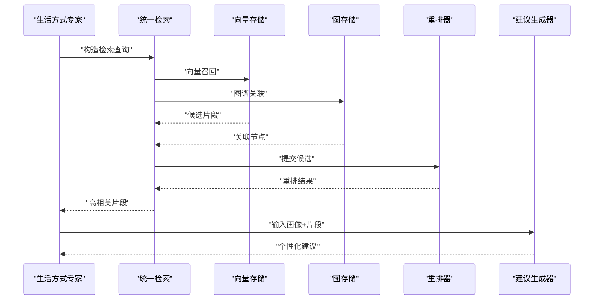
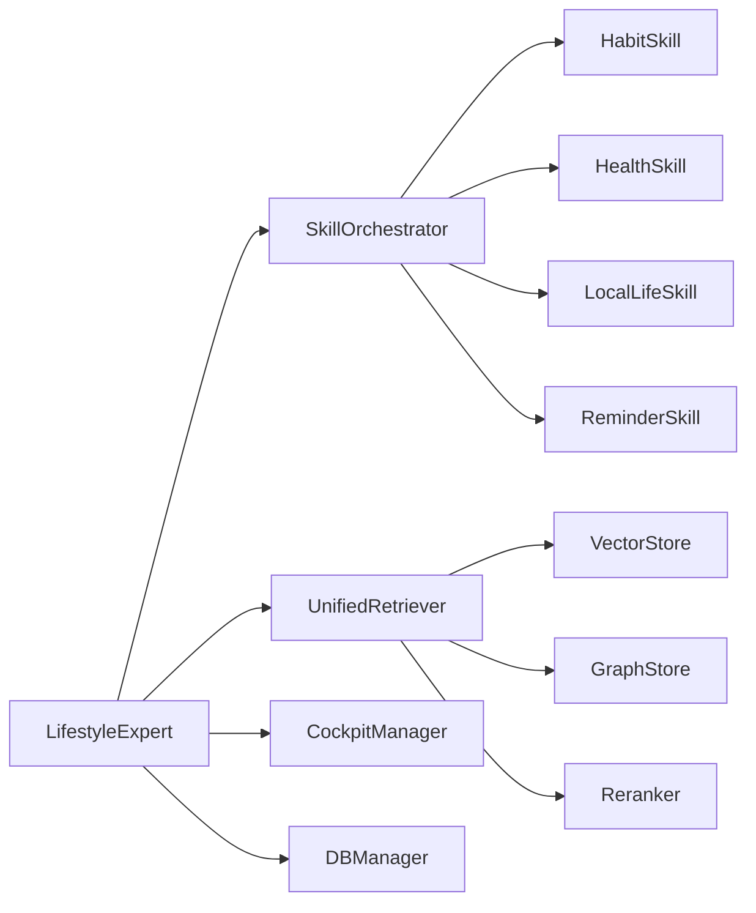

# 生活方式专家

<cite>
**本文引用的文件**   
- [lifestyle_expert.py](file://backend_design/nexus/agent/experts/lifestyle_expert.py)
- [base.py](file://backend_design/nexus/agent/experts/base.py)
- [orchestrator.py](file://backend_design/nexus/skills/orchestrator.py)
- [habit.py](file://backend_design/nexus/skills/habit.py)
- [health.py](file://backend_design/nexus/skills/health.py)
- [local_life.py](file://backend_design/nexus/skills/local_life.py)
- [reminder.py](file://backend_design/nexus/skills/reminder.py)
- [registry.py](file://backend_design/nexus/skills/registry.py)
- [schemas.py](file://backend_design/nexus/models/schemas.py)
- [state.py](file://backend_design/nexus/models/state.py)
- [cockpit_manager.py](file://backend_design/nexus/core/cockpit_manager.py)
- [db_manager.py](file://backend_design/nexus/core/db_manager.py)
- [llm_router.py](file://backend_design/nexus/intent/llm_router.py)
- [router.py](file://backend_design/nexus/intent/router.py)
- [unified_retriever.py](file://backend_design/nexus/rag/unified_retriever.py)
- [graph_store.py](file://backend_design/nexus/rag/graph_store.py)
- [vector_store.py](file://backend_design/nexus/rag/vector_store.py)
- [reranker.py](file://backend_design/nexus/rag/reranker.py)
</cite>

## 目录
1. [简介](#简介)
2. [项目结构](#项目结构)
3. [核心组件](#核心组件)
4. [架构总览](#架构总览)
5. [详细组件分析](#详细组件分析)
6. [依赖关系分析](#依赖关系分析)
7. [性能考量](#性能考量)
8. [故障排查指南](#故障排查指南)
9. [结论](#结论)
10. [附录](#附录)

## 简介
本文件面向NexusCockpit的“生活方式专家”（LifestyleExpert），系统化阐述其习惯建议算法与生活质量优化逻辑，覆盖用户行为模式分析、习惯养成跟踪、日程安排优化与个性化生活建议生成。文档同时给出生活习惯数据模型、偏好学习与推荐算法的实现细节，并描述从习惯评估、目标设定、进度跟踪到调整建议生成的完整处理流程。文末提供用户画像构建示例与推荐系统配置说明，帮助开发者快速落地与扩展。

## 项目结构
围绕“生活方式专家”的关键代码分布在以下模块：
- 专家层：实现具体领域专家能力，包括生活方式专家及其基类
- 技能编排层：负责将多个技能组合为可执行的工作流
- 技能层：涵盖习惯、健康、本地生活、提醒等能力
- 模型层：定义输入输出Schema与状态管理
- 意图路由层：根据用户意图选择合适专家或工具
- RAG检索层：统一向量/图检索与重排，支撑知识增强与建议生成
- 核心服务：会话与上下文管理、数据库访问等

图表来源
- [lifestyle_expert.py:1-200](file://backend_design/nexus/agent/experts/lifestyle_expert.py#L1-L200)
- [base.py:1-120](file://backend_design/nexus/agent/experts/base.py#L1-L120)
- [orchestrator.py:1-150](file://backend_design/nexus/skills/orchestrator.py#L1-L150)
- [habit.py:1-120](file://backend_design/nexus/skills/habit.py#L1-L120)
- [health.py:1-120](file://backend_design/nexus/skills/health.py#L1-L120)
- [local_life.py:1-120](file://backend_design/nexus/skills/local_life.py#L1-L120)
- [reminder.py:1-120](file://backend_design/nexus/skills/reminder.py#L1-L120)
- [schemas.py:1-200](file://backend_design/nexus/models/schemas.py#L1-L200)
- [state.py:1-120](file://backend_design/nexus/models/state.py#L1-L120)
- [llm_router.py:1-120](file://backend_design/nexus/intent/llm_router.py#L1-L120)
- [router.py:1-120](file://backend_design/nexus/intent/router.py#L1-L120)
- [unified_retriever.py:1-150](file://backend_design/nexus/rag/unified_retriever.py#L1-L150)
- [graph_store.py:1-120](file://backend_design/nexus/rag/graph_store.py#L1-L120)
- [vector_store.py:1-120](file://backend_design/nexus/rag/vector_store.py#L1-L120)
- [reranker.py:1-120](file://backend_design/nexus/rag/reranker.py#L1-L120)
- [cockpit_manager.py:1-120](file://backend_design/nexus/core/cockpit_manager.py#L1-L120)
- [db_manager.py:1-120](file://backend_design/nexus/core/db_manager.py#L1-L120)

章节来源
- [lifestyle_expert.py:1-200](file://backend_design/nexus/agent/experts/lifestyle_expert.py#L1-L200)
- [base.py:1-120](file://backend_design/nexus/agent/experts/base.py#L1-L120)
- [orchestrator.py:1-150](file://backend_design/nexus/skills/orchestrator.py#L1-L150)
- [habit.py:1-120](file://backend_design/nexus/skills/habit.py#L1-L120)
- [health.py:1-120](file://backend_design/nexus/skills/health.py#L1-L120)
- [local_life.py:1-120](file://backend_design/nexus/skills/local_life.py#L1-L120)
- [reminder.py:1-120](file://backend_design/nexus/skills/reminder.py#L1-L120)
- [schemas.py:1-200](file://backend_design/nexus/models/schemas.py#L1-L200)
- [state.py:1-120](file://backend_design/nexus/models/state.py#L1-L120)
- [llm_router.py:1-120](file://backend_design/nexus/intent/llm_router.py#L1-L120)
- [router.py:1-120](file://backend_design/nexus/intent/router.py#L1-L120)
- [unified_retriever.py:1-150](file://backend_design/nexus/rag/unified_retriever.py#L1-L150)
- [graph_store.py:1-120](file://backend_design/nexus/rag/graph_store.py#L1-L120)
- [vector_store.py:1-120](file://backend_design/nexus/rag/vector_store.py#L1-L120)
- [reranker.py:1-120](file://backend_design/nexus/rag/reranker.py#L1-L120)
- [cockpit_manager.py:1-120](file://backend_design/nexus/core/cockpit_manager.py#L1-L120)
- [db_manager.py:1-120](file://backend_design/nexus/core/db_manager.py#L1-L120)

## 核心组件
- 生活方式专家（LifestyleExpert）
  - 职责：整合用户画像、历史行为、健康指标与本地资源，生成个性化习惯建议与日程优化方案；驱动技能编排完成评估、目标设定、进度跟踪与调整建议。
  - 关键方法：建议生成、习惯评估、目标分解、日程冲突检测、反馈闭环更新。
- 专家基类（BaseExpert）
  - 职责：提供通用能力如上下文注入、日志、错误处理、外部服务调用封装。
- 技能编排器（SkillOrchestrator）
  - 职责：按策略调度习惯、健康、本地生活、提醒等技能，形成端到端工作流。
- 习惯技能（HabitSkill）
  - 职责：维护习惯生命周期（创建、打卡、评分、复盘）、计算坚持度与复购率、触发奖励与降级策略。
- 健康技能（HealthSkill）
  - 职责：聚合健康指标（睡眠、运动、饮食），进行趋势分析与风险预警，联动习惯建议。
- 本地生活技能（LocalLifeSkill）
  - 职责：基于位置与时间窗口推荐周边活动、餐饮、运动场所，结合偏好与预算约束。
- 提醒技能（ReminderSkill）
  - 职责：生成与推送提醒，支持多通道与智能去重、优先级排序。
- 统一检索（UnifiedRetriever）
  - 职责：融合向量与图检索结果，使用重排器提升相关性，返回高质量参考片段。
- 模型与状态（Schemas, State）
  - 职责：规范输入输出结构与会话状态流转，确保跨模块一致性。

章节来源
- [lifestyle_expert.py:1-200](file://backend_design/nexus/agent/experts/lifestyle_expert.py#L1-L200)
- [base.py:1-120](file://backend_design/nexus/agent/experts/base.py#L1-L120)
- [orchestrator.py:1-150](file://backend_design/nexus/skills/orchestrator.py#L1-L150)
- [habit.py:1-120](file://backend_design/nexus/skills/habit.py#L1-L120)
- [health.py:1-120](file://backend_design/nexus/skills/health.py#L1-L120)
- [local_life.py:1-120](file://backend_design/nexus/skills/local_life.py#L1-L120)
- [reminder.py:1-120](file://backend_design/nexus/skills/reminder.py#L1-L120)
- [unified_retriever.py:1-150](file://backend_design/nexus/rag/unified_retriever.py#L1-L150)
- [schemas.py:1-200](file://backend_design/nexus/models/schemas.py#L1-L200)
- [state.py:1-120](file://backend_design/nexus/models/state.py#L1-L120)

## 架构总览
生活方式专家通过“意图识别—专家路由—技能编排—检索增强—建议生成—反馈学习”的链路，实现从用户输入到个性化建议的全流程自动化。

图表来源
- [llm_router.py:1-120](file://backend_design/nexus/intent/llm_router.py#L1-L120)
- [router.py:1-120](file://backend_design/nexus/intent/router.py#L1-L120)
- [lifestyle_expert.py:1-200](file://backend_design/nexus/agent/experts/lifestyle_expert.py#L1-L200)
- [orchestrator.py:1-150](file://backend_design/nexus/skills/orchestrator.py#L1-L150)
- [habit.py:1-120](file://backend_design/nexus/skills/habit.py#L1-L120)
- [health.py:1-120](file://backend_design/nexus/skills/health.py#L1-L120)
- [local_life.py:1-120](file://backend_design/nexus/skills/local_life.py#L1-L120)
- [reminder.py:1-120](file://backend_design/nexus/skills/reminder.py#L1-L120)
- [unified_retriever.py:1-150](file://backend_design/nexus/rag/unified_retriever.py#L1-L150)
- [vector_store.py:1-120](file://backend_design/nexus/rag/vector_store.py#L1-L120)
- [graph_store.py:1-120](file://backend_design/nexus/rag/graph_store.py#L1-L120)
- [reranker.py:1-120](file://backend_design/nexus/rag/reranker.py#L1-L120)
- [cockpit_manager.py:1-120](file://backend_design/nexus/core/cockpit_manager.py#L1-L120)
- [db_manager.py:1-120](file://backend_design/nexus/core/db_manager.py#L1-L120)

## 详细组件分析

### 生活方式专家（LifestyleExpert）
- 设计要点
  - 以用户画像为核心，融合习惯、健康、本地资源与时间约束，输出可执行的个性化建议。
  - 采用“评估—目标—计划—执行—复盘”的闭环，持续优化建议质量。
- 关键流程
  - 习惯评估：基于打卡频率、完成率、难度匹配度、健康指标变化计算综合评分。
  - 目标设定：将长期目标拆解为短期可量化任务，考虑用户偏好与可用时间窗。
  - 日程优化：检测冲突、平衡强度与恢复时间、动态调整优先级。
  - 建议生成：结合RAG检索到的最佳实践与用户历史，生成自然语言建议与行动清单。
  - 反馈学习：依据用户接受度与执行效果更新偏好权重与推荐策略。
- 交互接口
  - 输入：用户ID、时间范围、当前情境（位置、天气、设备状态）、健康摘要、习惯列表。
  - 输出：建议条目、目标分解、日程计划、提醒设置、风险提示。

图表来源
- [lifestyle_expert.py:1-200](file://backend_design/nexus/agent/experts/lifestyle_expert.py#L1-L200)
- [orchestrator.py:1-150](file://backend_design/nexus/skills/orchestrator.py#L1-L150)
- [habit.py:1-120](file://backend_design/nexus/skills/habit.py#L1-L120)
- [health.py:1-120](file://backend_design/nexus/skills/health.py#L1-L120)
- [local_life.py:1-120](file://backend_design/nexus/skills/local_life.py#L1-L120)
- [reminder.py:1-120](file://backend_design/nexus/skills/reminder.py#L1-L120)
- [unified_retriever.py:1-150](file://backend_design/nexus/rag/unified_retriever.py#L1-L150)
- [vector_store.py:1-120](file://backend_design/nexus/rag/vector_store.py#L1-L120)
- [graph_store.py:1-120](file://backend_design/nexus/rag/graph_store.py#L1-L120)
- [reranker.py:1-120](file://backend_design/nexus/rag/reranker.py#L1-L120)

章节来源
- [lifestyle_expert.py:1-200](file://backend_design/nexus/agent/experts/lifestyle_expert.py#L1-L200)
- [orchestrator.py:1-150](file://backend_design/nexus/skills/orchestrator.py#L1-L150)
- [habit.py:1-120](file://backend_design/nexus/skills/habit.py#L1-L120)
- [health.py:1-120](file://backend_design/nexus/skills/health.py#L1-L120)
- [local_life.py:1-120](file://backend_design/nexus/skills/local_life.py#L1-L120)
- [reminder.py:1-120](file://backend_design/nexus/skills/reminder.py#L1-L120)
- [unified_retriever.py:1-150](file://backend_design/nexus/rag/unified_retriever.py#L1-L150)
- [vector_store.py:1-120](file://backend_design/nexus/rag/vector_store.py#L1-L120)
- [graph_store.py:1-120](file://backend_design/nexus/rag/graph_store.py#L1-L120)
- [reranker.py:1-120](file://backend_design/nexus/rag/reranker.py#L1-L120)

### 习惯养成跟踪与评估算法
- 数据模型
  - 习惯条目：名称、类别、难度、频率、目标时长、开始/结束时间、标签。
  - 打卡记录：时间戳、完成度、主观感受、环境上下文（位置、天气、设备）。
  - 健康指标：睡眠时长、步数、心率变异性、压力指数等。
- 评估维度
  - 坚持度：连续打卡天数、周/月完成率。
  - 难度匹配：目标与实际完成度的偏差、疲劳累积。
  - 健康收益：指标改善幅度与稳定性。
  - 偏好契合：用户偏好权重与推荐命中率的关联。
- 算法流程
  - 数据采集与清洗 → 特征工程（统计、时序、上下文编码）→ 评分模型（加权/机器学习）→ 阈值判定与分级 → 触发干预策略（降难、替代、奖励）。

图表来源
- [habit.py:1-120](file://backend_design/nexus/skills/habit.py#L1-L120)
- [health.py:1-120](file://backend_design/nexus/skills/health.py#L1-L120)
- [schemas.py:1-200](file://backend_design/nexus/models/schemas.py#L1-L200)

章节来源
- [habit.py:1-120](file://backend_design/nexus/skills/habit.py#L1-L120)
- [health.py:1-120](file://backend_design/nexus/skills/health.py#L1-L120)
- [schemas.py:1-200](file://backend_design/nexus/models/schemas.py#L1-L200)

### 日程安排优化与冲突检测
- 优化目标
  - 最大化用户满意度与执行可行性，最小化冲突与疲劳。
- 约束条件
  - 时间窗、地点可达性、健康恢复需求、预算限制、优先级。
- 算法思路
  - 候选计划生成 → 冲突检测（时间重叠、资源占用）→ 重排与合并 → 局部搜索/启发式优化 → 输出可行日程。

图表来源
- [lifestyle_expert.py:1-200](file://backend_design/nexus/agent/experts/lifestyle_expert.py#L1-L200)
- [orchestrator.py:1-150](file://backend_design/nexus/skills/orchestrator.py#L1-L150)

章节来源
- [lifestyle_expert.py:1-200](file://backend_design/nexus/agent/experts/lifestyle_expert.py#L1-L200)
- [orchestrator.py:1-150](file://backend_design/nexus/skills/orchestrator.py#L1-L150)

### 个性化生活建议生成机制
- 输入要素
  - 用户画像（偏好、目标、约束）、当前情境（位置、时间、天气）、健康摘要、习惯历史。
- 检索增强
  - 统一检索融合向量与图谱结果，重排器提升相关性，返回高质量参考片段。
- 生成策略
  - 模板+LLM微调：在结构化骨架中填充个性化内容，保证一致性与可读性。
  - 安全边界：避免高风险建议，遵循健康与安全约束。
- 反馈闭环
  - 用户接受度与执行效果作为信号，更新偏好权重与推荐策略。

图表来源
- [unified_retriever.py:1-150](file://backend_design/nexus/rag/unified_retriever.py#L1-L150)
- [vector_store.py:1-120](file://backend_design/nexus/rag/vector_store.py#L1-L120)
- [graph_store.py:1-120](file://backend_design/nexus/rag/graph_store.py#L1-L120)
- [reranker.py:1-120](file://backend_design/nexus/rag/reranker.py#L1-L120)
- [lifestyle_expert.py:1-200](file://backend_design/nexus/agent/experts/lifestyle_expert.py#L1-L200)

章节来源
- [unified_retriever.py:1-150](file://backend_design/nexus/rag/unified_retriever.py#L1-L150)
- [vector_store.py:1-120](file://backend_design/nexus/rag/vector_store.py#L1-L120)
- [graph_store.py:1-120](file://backend_design/nexus/rag/graph_store.py#L1-L120)
- [reranker.py:1-120](file://backend_design/nexus/rag/reranker.py#L1-L120)
- [lifestyle_expert.py:1-200](file://backend_design/nexus/agent/experts/lifestyle_expert.py#L1-L200)

### 用户画像构建示例
- 画像字段
  - 基本信息：年龄、性别、职业、作息规律。
  - 偏好：饮食口味、运动类型、活动预算、时间段偏好。
  - 目标：减脂、增肌、减压、社交、学习。
  - 约束：时间碎片化程度、健康状况、设备可用性。
  - 行为轨迹：打卡历史、点击/收藏、停留时长、反馈评分。
- 构建流程
  - 数据接入（习惯、健康、本地生活、对话日志）→ 特征抽取 → 画像聚合 → 动态更新（滑动窗口/增量学习）。
- 使用方式
  - 作为建议生成的先验知识，影响推荐权重、难度选择与日程布局。

章节来源
- [schemas.py:1-200](file://backend_design/nexus/models/schemas.py#L1-L200)
- [state.py:1-120](file://backend_design/nexus/models/state.py#L1-L120)
- [habit.py:1-120](file://backend_design/nexus/skills/habit.py#L1-L120)
- [health.py:1-120](file://backend_design/nexus/skills/health.py#L1-L120)
- [local_life.py:1-120](file://backend_design/nexus/skills/local_life.py#L1-L120)

### 推荐系统配置说明
- 配置项
  - 召回策略：向量相似度阈值、TopK数量、图谱深度。
  - 重排策略：相关性分数、多样性惩罚、业务规则权重。
  - 偏好学习：更新频率、衰减因子、探索与利用比例。
  - 安全与合规：敏感词过滤、健康风险提示、地域限制。
- 调优建议
  - 离线评估：AUC/NDCG、覆盖率、多样性。
  - 在线监控：点击率、采纳率、完成率、负反馈率。
  - 迭代策略：A/B测试、灰度发布、回滚预案。

章节来源
- [unified_retriever.py:1-150](file://backend_design/nexus/rag/unified_retriever.py#L1-L150)
- [reranker.py:1-120](file://backend_design/nexus/rag/reranker.py#L1-L120)
- [schemas.py:1-200](file://backend_design/nexus/models/schemas.py#L1-L200)

## 依赖关系分析
- 组件耦合
  - 生活方式专家强依赖技能编排器与各技能，弱依赖RAG与核心服务。
  - 统一检索对向量与图存储解耦，通过接口抽象便于替换实现。
- 外部集成点
  - 数据库用于持久化画像、习惯与健康数据。
  - 座舱管理器用于会话状态与上下文共享。
- 潜在循环依赖
  - 专家与编排器之间单向依赖，避免循环。
  - RAG层内部无循环，检索与重排顺序明确。

图表来源
- [lifestyle_expert.py:1-200](file://backend_design/nexus/agent/experts/lifestyle_expert.py#L1-L200)
- [orchestrator.py:1-150](file://backend_design/nexus/skills/orchestrator.py#L1-L150)
- [habit.py:1-120](file://backend_design/nexus/skills/habit.py#L1-L120)
- [health.py:1-120](file://backend_design/nexus/skills/health.py#L1-L120)
- [local_life.py:1-120](file://backend_design/nexus/skills/local_life.py#L1-L120)
- [reminder.py:1-120](file://backend_design/nexus/skills/reminder.py#L1-L120)
- [unified_retriever.py:1-150](file://backend_design/nexus/rag/unified_retriever.py#L1-L150)
- [vector_store.py:1-120](file://backend_design/nexus/rag/vector_store.py#L1-L120)
- [graph_store.py:1-120](file://backend_design/nexus/rag/graph_store.py#L1-L120)
- [reranker.py:1-120](file://backend_design/nexus/rag/reranker.py#L1-L120)
- [cockpit_manager.py:1-120](file://backend_design/nexus/core/cockpit_manager.py#L1-L120)
- [db_manager.py:1-120](file://backend_design/nexus/core/db_manager.py#L1-L120)

章节来源
- [lifestyle_expert.py:1-200](file://backend_design/nexus/agent/experts/lifestyle_expert.py#L1-L200)
- [orchestrator.py:1-150](file://backend_design/nexus/skills/orchestrator.py#L1-L150)
- [unified_retriever.py:1-150](file://backend_design/nexus/rag/unified_retriever.py#L1-L150)
- [cockpit_manager.py:1-120](file://backend_design/nexus/core/cockpit_manager.py#L1-L120)
- [db_manager.py:1-120](file://backend_design/nexus/core/db_manager.py#L1-L120)

## 性能考量
- 检索性能
  - 向量召回TopK与相似度阈值需权衡召回率与延迟；图查询深度控制复杂度。
  - 重排器批量打分，减少多次往返。
- 编排性能
  - 并行调用独立技能，超时与熔断保护；缓存热点数据（用户画像、常用POI）。
- 生成性能
  - 模板预填充减少LLM调用长度；异步生成与流式返回提升用户体验。
- 存储性能
  - 习惯与健康数据分区与索引优化；定期归档冷数据。

[本节为通用指导，不直接分析具体文件]

## 故障排查指南
- 常见问题
  - 检索为空或低相关：检查向量索引完整性、图谱连通性、重排权重配置。
  - 建议不可执行：校验日程冲突检测逻辑、健康约束与安全边界。
  - 画像更新异常：确认增量更新窗口与衰减因子设置。
- 定位步骤
  - 查看会话状态与中间结果（编排日志、检索结果、重排分数）。
  - 核对输入Schema是否符合约定，缺失字段导致下游失败。
  - 验证外部服务（数据库、向量/图存储）连接与配额。
- 恢复策略
  - 降级到模板建议；启用默认重排策略；回滚最近一次画像更新。

章节来源
- [schemas.py:1-200](file://backend_design/nexus/models/schemas.py#L1-L200)
- [state.py:1-120](file://backend_design/nexus/models/state.py#L1-L120)
- [unified_retriever.py:1-150](file://backend_design/nexus/rag/unified_retriever.py#L1-L150)
- [reranker.py:1-120](file://backend_design/nexus/rag/reranker.py#L1-L120)
- [lifestyle_expert.py:1-200](file://backend_design/nexus/agent/experts/lifestyle_expert.py#L1-L200)

## 结论
生活方式专家通过“评估—目标—计划—执行—复盘”的闭环与检索增强技术，实现了高度个性化的习惯建议与日程优化。借助统一的技能编排与RAG检索，系统在准确性、可解释性与可扩展性方面具备良好基础。后续可在偏好学习、冲突求解与多模态情境感知上进一步演进，以提升整体生活质量优化效果。

[本节为总结，不直接分析具体文件]

## 附录
- 术语表
  - 习惯：可重复的行为单元，具有目标与频率约束。
  - 画像：用户对偏好、目标与约束的结构化表征。
  - 检索增强：通过外部知识库提升生成质量的技术路径。
- 扩展建议
  - 引入更多健康传感器数据（如可穿戴设备）。
  - 强化多目标优化（健康、效率、愉悦感）的求解器。
  - 增加社交与家庭维度的协同规划。

[本节为概念性内容，不直接分析具体文件]