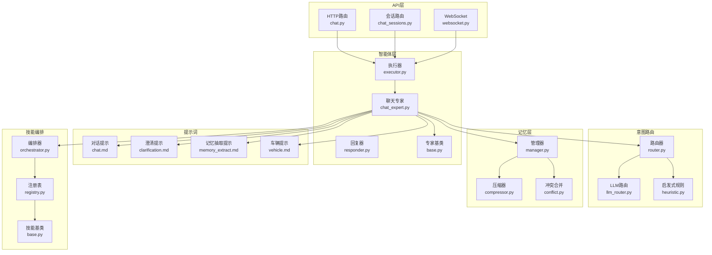
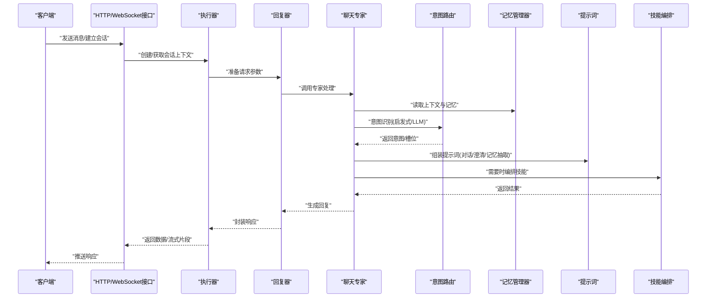
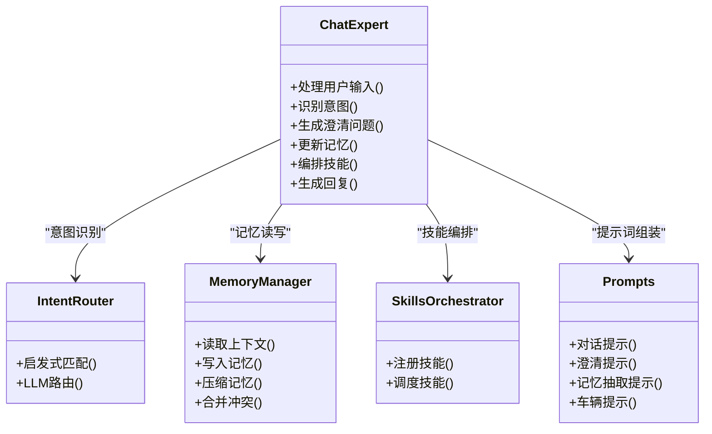
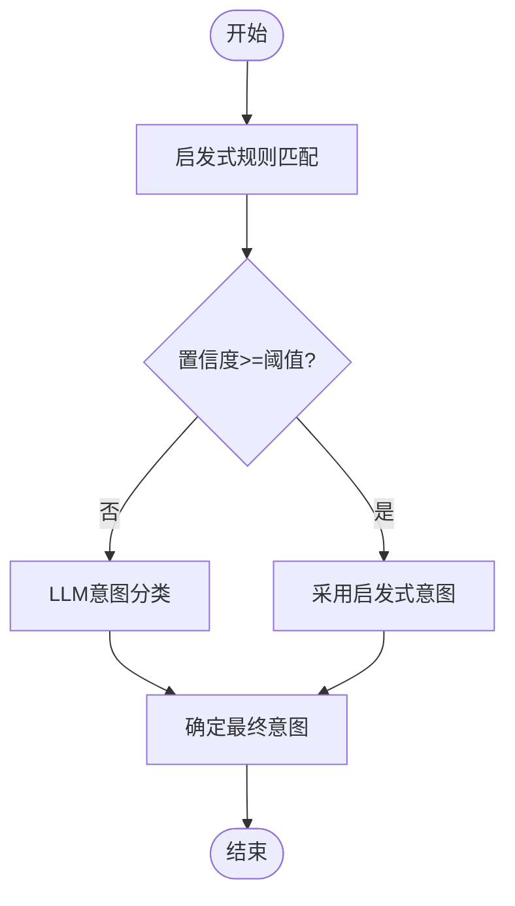
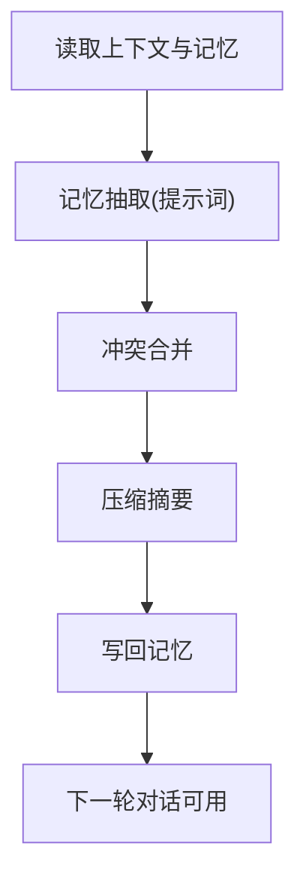
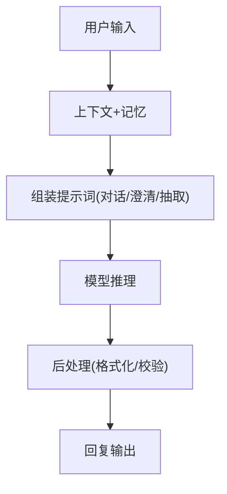
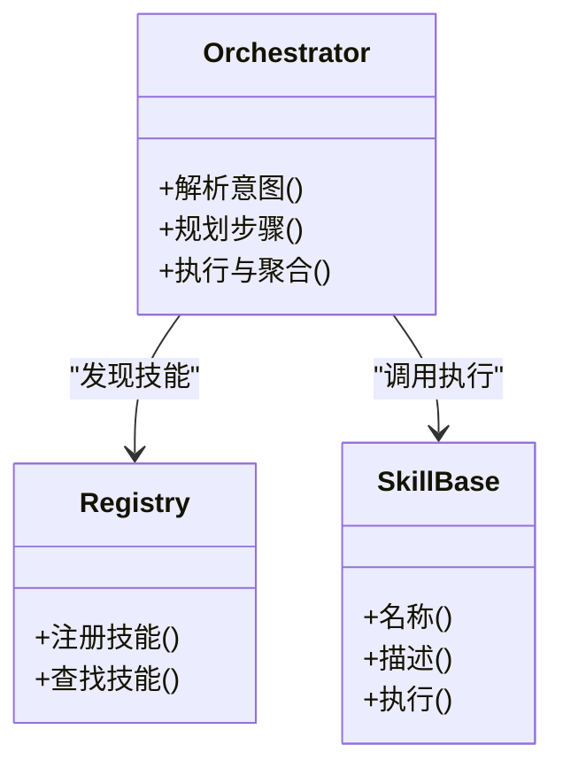
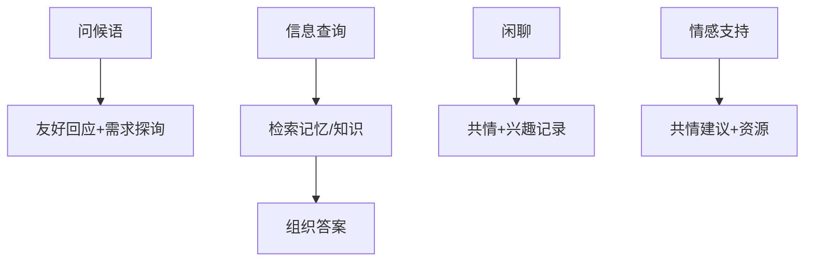
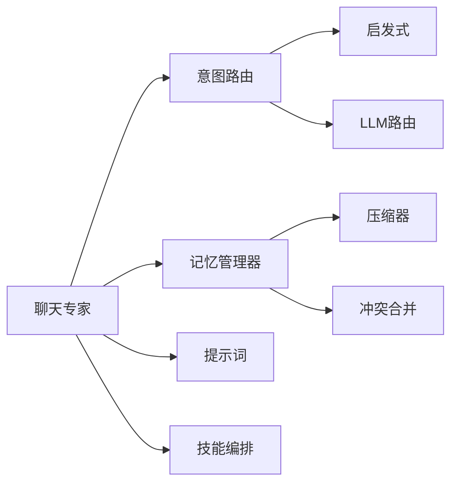

# 聊天专家

<cite>
**本文引用的文件**   
- [chat_expert.py](file://backend_design/nexus/agent/experts/chat_expert.py)
- [base.py](file://backend_design/nexus/agent/experts/base.py)
- [executor.py](file://backend_design/nexus/agent/executor.py)
- [responder.py](file://backend_design/nexus/agent/responder.py)
- [router.py](file://backend_design/nexus/intent/router.py)
- [llm_router.py](file://backend_design/nexus/intent/llm_router.py)
- [heuristic.py](file://backend_design/nexus/intent/heuristic.py)
- [manager.py](file://backend_design/nexus/memory/manager.py)
- [compressor.py](file://backend_design/nexus/memory/compressor.py)
- [conflict.py](file://backend_design/nexus/memory/conflict.py)
- [chat.md](file://backend_design/nexus/prompts/chat.md)
- [clarification.md](file://backend_design/nexus/prompts/clarification.md)
- [memory_extract.md](file://backend_design/nexus/prompts/memory_extract.md)
- [vehicle.md](file://backend_design/nexus/prompts/vehicle.md)
- [chat.py](file://backend_design/nexus/api/routes/chat.py)
- [chat_sessions.py](file://backend_design/nexus/api/routes/chat_sessions.py)
- [websocket.py](file://backend_design/nexus/api/websocket.py)
- [orchestrator.py](file://backend_design/nexus/skills/orchestrator.py)
- [registry.py](file://backend_design/nexus/skills/registry.py)
- [base.py](file://backend_design/nexus/skills/base.py)
- [config.py](file://backend_design/nexus/config.py)
- [main.py](file://backend_design/nexus/main.py)
</cite>

## 目录
1. [简介](#简介)
2. [项目结构](#项目结构)
3. [核心组件](#核心组件)
4. [架构总览](#架构总览)
5. [详细组件分析](#详细组件分析)
6. [依赖关系分析](#依赖关系分析)
7. [性能考虑](#性能考虑)
8. [故障排查指南](#故障排查指南)
9. [结论](#结论)
10. [附录](#附录)

## 简介
本文件面向NexusCockpit的“聊天专家”（ChatExpert），系统性阐述其自然语言处理能力与对话管理逻辑，覆盖上下文理解、情感分析、多轮对话维护与个性化响应。文档同时说明意图识别算法、记忆集成与响应生成策略，并提供典型聊天场景的处理流程（问候语处理、信息查询、闲聊对话、情感支持）以及API调用示例与配置选项说明。

## 项目结构
围绕聊天专家的相关代码主要分布在以下模块：
- 智能体专家层：定义聊天专家及其基类，负责对话编排与技能调度
- 意图路由层：提供启发式与LLM驱动的意图识别与路由
- 记忆层：会话记忆、压缩与冲突合并，支撑长期上下文与个性化
- 提示词层：对话、澄清、记忆抽取与车辆相关提示模板
- API层：HTTP与WebSocket接口，暴露聊天与会话管理能力
- 技能编排层：统一注册与编排各类技能（导航、媒体、健康等）
- 配置与入口：系统配置与主进程启动

图表来源
- [chat.py](file://backend_design/nexus/api/routes/chat.py)
- [chat_sessions.py](file://backend_design/nexus/api/routes/chat_sessions.py)
- [websocket.py](file://backend_design/nexus/api/websocket.py)
- [executor.py](file://backend_design/nexus/agent/executor.py)
- [responder.py](file://backend_design/nexus/agent/responder.py)
- [chat_expert.py](file://backend_design/nexus/agent/experts/chat_expert.py)
- [base.py](file://backend_design/nexus/agent/experts/base.py)
- [router.py](file://backend_design/nexus/intent/router.py)
- [llm_router.py](file://backend_design/nexus/intent/llm_router.py)
- [heuristic.py](file://backend_design/nexus/intent/heuristic.py)
- [manager.py](file://backend_design/nexus/memory/manager.py)
- [compressor.py](file://backend_design/nexus/memory/compressor.py)
- [conflict.py](file://backend_design/nexus/memory/conflict.py)
- [chat.md](file://backend_design/nexus/prompts/chat.md)
- [clarification.md](file://backend_design/nexus/prompts/clarification.md)
- [memory_extract.md](file://backend_design/nexus/prompts/memory_extract.md)
- [vehicle.md](file://backend_design/nexus/prompts/vehicle.md)
- [orchestrator.py](file://backend_design/nexus/skills/orchestrator.py)
- [registry.py](file://backend_design/nexus/skills/registry.py)
- [base.py](file://backend_design/nexus/skills/base.py)

章节来源
- [chat.py](file://backend_design/nexus/api/routes/chat.py)
- [chat_sessions.py](file://backend_design/nexus/api/routes/chat_sessions.py)
- [websocket.py](file://backend_design/nexus/api/websocket.py)
- [executor.py](file://backend_design/nexus/agent/executor.py)
- [responder.py](file://backend_design/nexus/agent/responder.py)
- [chat_expert.py](file://backend_design/nexus/agent/experts/chat_expert.py)
- [base.py](file://backend_design/nexus/agent/experts/base.py)
- [router.py](file://backend_design/nexus/intent/router.py)
- [llm_router.py](file://backend_design/nexus/intent/llm_router.py)
- [heuristic.py](file://backend_design/nexus/intent/heuristic.py)
- [manager.py](file://backend_design/nexus/memory/manager.py)
- [compressor.py](file://backend_design/nexus/memory/compressor.py)
- [conflict.py](file://backend_design/nexus/memory/conflict.py)
- [chat.md](file://backend_design/nexus/prompts/chat.md)
- [clarification.md](file://backend_design/nexus/prompts/clarification.md)
- [memory_extract.md](file://backend_design/nexus/prompts/memory_extract.md)
- [vehicle.md](file://backend_design/nexus/prompts/vehicle.md)
- [orchestrator.py](file://backend_design/nexus/skills/orchestrator.py)
- [registry.py](file://backend_design/nexus/skills/registry.py)
- [base.py](file://backend_design/nexus/skills/base.py)

## 核心组件
- 聊天专家（ChatExpert）
  - 职责：接收用户输入，结合上下文与记忆进行意图识别、澄清、技能编排与回复生成；在多轮对话中维护状态并输出个性化响应。
  - 关键能力：上下文理解、情感分析、多轮对话维护、个性化响应、意图识别、记忆集成、响应生成。
- 意图路由（Intent Router）
  - 职责：将用户输入映射到具体意图或领域，支持启发式规则与LLM路由两种模式。
- 记忆管理器（Memory Manager）
  - 职责：持久化与检索会话记忆，提供压缩与冲突合并，保障长对话的上下文质量与一致性。
- 提示词工程（Prompts）
  - 职责：为对话、澄清、记忆抽取与车辆相关任务提供结构化提示模板，提升模型稳定性与可控性。
- 技能编排（Skills Orchestrator）
  - 职责：统一注册与调度领域技能（如导航、媒体、健康等），实现复杂任务的分解与协作。
- API与传输（API & WebSocket）
  - 职责：对外暴露聊天与会话管理接口，支持流式与非流式交互。

章节来源
- [chat_expert.py](file://backend_design/nexus/agent/experts/chat_expert.py)
- [router.py](file://backend_design/nexus/intent/router.py)
- [llm_router.py](file://backend_design/nexus/intent/llm_router.py)
- [heuristic.py](file://backend_design/nexus/intent/heuristic.py)
- [manager.py](file://backend_design/nexus/memory/manager.py)
- [compressor.py](file://backend_design/nexus/memory/compressor.py)
- [conflict.py](file://backend_design/nexus/memory/conflict.py)
- [chat.md](file://backend_design/nexus/prompts/chat.md)
- [clarification.md](file://backend_design/nexus/prompts/clarification.md)
- [memory_extract.md](file://backend_design/nexus/prompts/memory_extract.md)
- [vehicle.md](file://backend_design/nexus/prompts/vehicle.md)
- [orchestrator.py](file://backend_design/nexus/skills/orchestrator.py)
- [registry.py](file://backend_design/nexus/skills/registry.py)
- [base.py](file://backend_design/nexus/skills/base.py)
- [chat.py](file://backend_design/nexus/api/routes/chat.py)
- [chat_sessions.py](file://backend_design/nexus/api/routes/chat_sessions.py)
- [websocket.py](file://backend_design/nexus/api/websocket.py)

## 架构总览
聊天专家的端到端流程从API层进入，经执行器与回复器到达聊天专家，再由意图路由选择策略，结合记忆与提示词完成响应生成，必要时通过技能编排调用外部能力。

图表来源
- [chat.py](file://backend_design/nexus/api/routes/chat.py)
- [chat_sessions.py](file://backend_design/nexus/api/routes/chat_sessions.py)
- [websocket.py](file://backend_design/nexus/api/websocket.py)
- [executor.py](file://backend_design/nexus/agent/executor.py)
- [responder.py](file://backend_design/nexus/agent/responder.py)
- [chat_expert.py](file://backend_design/nexus/agent/experts/chat_expert.py)
- [router.py](file://backend_design/nexus/intent/router.py)
- [llm_router.py](file://backend_design/nexus/intent/llm_router.py)
- [heuristic.py](file://backend_design/nexus/intent/heuristic.py)
- [manager.py](file://backend_design/nexus/memory/manager.py)
- [chat.md](file://backend_design/nexus/prompts/chat.md)
- [clarification.md](file://backend_design/nexus/prompts/clarification.md)
- [memory_extract.md](file://backend_design/nexus/prompts/memory_extract.md)
- [orchestrator.py](file://backend_design/nexus/skills/orchestrator.py)

## 详细组件分析

### 聊天专家（ChatExpert）
- 角色定位
  - 作为对话中枢，协调意图识别、记忆读写、提示词组装与技能编排，最终生成符合用户期望的回复。
- 关键流程
  - 上下文加载：从会话与记忆中提取历史、偏好与事实。
  - 意图识别：优先使用启发式规则快速匹配，必要时回退至LLM路由提高准确率。
  - 澄清策略：当信息不足时，基于澄清提示生成追问，避免错误假设。
  - 记忆更新：在对话过程中抽取关键事实与偏好，写入记忆并进行冲突合并与压缩。
  - 技能编排：对需要外部能力的任务（如导航、媒体控制）进行分解与调度。
  - 回复生成：结合提示词与技能结果，生成个性化、连贯且安全的回复。
- 情感分析与个性化
  - 在上下文中注入情感信号与用户画像，使回复语气与内容更贴合用户当前情绪与长期偏好。
- 多轮对话维护
  - 通过记忆管理器维持跨轮次的事实与目标，确保对话一致性与可追溯性。

图表来源
- [chat_expert.py](file://backend_design/nexus/agent/experts/chat_expert.py)
- [router.py](file://backend_design/nexus/intent/router.py)
- [llm_router.py](file://backend_design/nexus/intent/llm_router.py)
- [heuristic.py](file://backend_design/nexus/intent/heuristic.py)
- [manager.py](file://backend_design/nexus/memory/manager.py)
- [compressor.py](file://backend_design/nexus/memory/compressor.py)
- [conflict.py](file://backend_design/nexus/memory/conflict.py)
- [chat.md](file://backend_design/nexus/prompts/chat.md)
- [clarification.md](file://backend_design/nexus/prompts/clarification.md)
- [memory_extract.md](file://backend_design/nexus/prompts/memory_extract.md)
- [vehicle.md](file://backend_design/nexus/prompts/vehicle.md)
- [orchestrator.py](file://backend_design/nexus/skills/orchestrator.py)

章节来源
- [chat_expert.py](file://backend_design/nexus/agent/experts/chat_expert.py)
- [base.py](file://backend_design/nexus/agent/experts/base.py)

### 意图识别算法
- 启发式规则
  - 基于关键词、正则与规则树进行快速匹配，适合高频、稳定的意图（如问候、简单查询）。
- LLM路由
  - 将用户输入与候选意图描述交由大模型判断，适用于复杂语义与模糊表达。
- 混合策略
  - 先启发式后LLM，兼顾效率与准确性；当启发式置信度低于阈值时触发LLM路由。

图表来源
- [heuristic.py](file://backend_design/nexus/intent/heuristic.py)
- [llm_router.py](file://backend_design/nexus/intent/llm_router.py)
- [router.py](file://backend_design/nexus/intent/router.py)

章节来源
- [router.py](file://backend_design/nexus/intent/router.py)
- [llm_router.py](file://backend_design/nexus/intent/llm_router.py)
- [heuristic.py](file://backend_design/nexus/intent/heuristic.py)

### 记忆集成与多轮对话维护
- 记忆结构
  - 会话级记忆：短期上下文、当前目标与临时槽位。
  - 长期记忆：用户偏好、事实与历史事件，支持检索与更新。
- 压缩与冲突合并
  - 压缩器对冗余信息进行摘要，降低上下文长度与成本。
  - 冲突合并解决新旧信息不一致，保证事实一致性。
- 记忆抽取
  - 通过专用提示词从对话中提取关键实体与偏好，自动更新长期记忆。

图表来源
- [manager.py](file://backend_design/nexus/memory/manager.py)
- [compressor.py](file://backend_design/nexus/memory/compressor.py)
- [conflict.py](file://backend_design/nexus/memory/conflict.py)
- [memory_extract.md](file://backend_design/nexus/prompts/memory_extract.md)

章节来源
- [manager.py](file://backend_design/nexus/memory/manager.py)
- [compressor.py](file://backend_design/nexus/memory/compressor.py)
- [conflict.py](file://backend_design/nexus/memory/conflict.py)
- [memory_extract.md](file://backend_design/nexus/prompts/memory_extract.md)

### 提示词工程与响应生成策略
- 对话提示
  - 定义角色、风格与约束，确保回复安全、友好与一致。
- 澄清提示
  - 当信息不足时，生成追问以收集必要槽位，减少误解。
- 记忆抽取提示
  - 指导模型从对话中抽取事实与偏好，形成结构化记忆。
- 车辆提示
  - 针对车辆相关任务提供领域知识与操作规范。

图表来源
- [chat.md](file://backend_design/nexus/prompts/chat.md)
- [clarification.md](file://backend_design/nexus/prompts/clarification.md)
- [memory_extract.md](file://backend_design/nexus/prompts/memory_extract.md)
- [vehicle.md](file://backend_design/nexus/prompts/vehicle.md)

章节来源
- [chat.md](file://backend_design/nexus/prompts/chat.md)
- [clarification.md](file://backend_design/nexus/prompts/clarification.md)
- [memory_extract.md](file://backend_design/nexus/prompts/memory_extract.md)
- [vehicle.md](file://backend_design/nexus/prompts/vehicle.md)

### 技能编排与个性化响应
- 技能注册与发现
  - 通过注册表集中管理技能元信息与能力边界。
- 编排与执行
  - 编排器根据意图与槽位分解任务，按依赖顺序调用技能，聚合结果。
- 个性化
  - 结合记忆中的偏好与情感信号，调整回复风格与推荐策略。

图表来源
- [registry.py](file://backend_design/nexus/skills/registry.py)
- [orchestrator.py](file://backend_design/nexus/skills/orchestrator.py)
- [base.py](file://backend_design/nexus/skills/base.py)

章节来源
- [registry.py](file://backend_design/nexus/skills/registry.py)
- [orchestrator.py](file://backend_design/nexus/skills/orchestrator.py)
- [base.py](file://backend_design/nexus/skills/base.py)

### 聊天场景处理流程
- 问候语处理
  - 快速匹配问候意图，返回友好欢迎语，必要时询问用户需求。
- 信息查询
  - 通过意图识别与记忆检索，组织答案并引用来源（如有）。
- 闲聊对话
  - 保持轻松语气，适度引导话题，记录兴趣点用于个性化。
- 情感支持
  - 检测负面情绪，提供共情回应与建议，必要时转人工或资源链接。

[此图为概念流程图，不直接映射具体源码文件]

## 依赖关系分析
- 组件耦合
  - 聊天专家强依赖意图路由与记忆管理器，弱依赖技能编排与提示词。
- 外部依赖
  - 大模型服务（LLM路由）、向量/图存储（RAG，可选）、外部技能接口（车辆、媒体等）。
- 循环依赖
  - 通过分层与接口隔离避免循环依赖；专家层不直接依赖API层。

图表来源
- [chat_expert.py](file://backend_design/nexus/agent/experts/chat_expert.py)
- [router.py](file://backend_design/nexus/intent/router.py)
- [llm_router.py](file://backend_design/nexus/intent/llm_router.py)
- [heuristic.py](file://backend_design/nexus/intent/heuristic.py)
- [manager.py](file://backend_design/nexus/memory/manager.py)
- [compressor.py](file://backend_design/nexus/memory/compressor.py)
- [conflict.py](file://backend_design/nexus/memory/conflict.py)
- [orchestrator.py](file://backend_design/nexus/skills/orchestrator.py)

章节来源
- [chat_expert.py](file://backend_design/nexus/agent/experts/chat_expert.py)
- [router.py](file://backend_design/nexus/intent/router.py)
- [llm_router.py](file://backend_design/nexus/intent/llm_router.py)
- [heuristic.py](file://backend_design/nexus/intent/heuristic.py)
- [manager.py](file://backend_design/nexus/memory/manager.py)
- [compressor.py](file://backend_design/nexus/memory/compressor.py)
- [conflict.py](file://backend_design/nexus/memory/conflict.py)
- [orchestrator.py](file://backend_design/nexus/skills/orchestrator.py)

## 性能考虑
- 意图识别优化
  - 启发式优先，降低LLM调用频率；设置置信度阈值与超时保护。
- 记忆压缩
  - 定期压缩与摘要，控制上下文长度，减少Token消耗与延迟。
- 并发与缓存
  - 对热点问答与静态知识启用缓存；WebSocket流式输出提升用户体验。
- 降级与熔断
  - 当LLM或外部技能不可用时，回退到规则或默认策略，保障可用性。

[本节为通用性能建议，不直接分析具体文件]

## 故障排查指南
- 常见问题
  - 意图误判：检查启发式规则与LLM路由配置，查看日志中的意图得分与路径。
  - 记忆不一致：审查冲突合并策略与抽取提示词，确认更新时机与去重逻辑。
  - 技能调用失败：核对注册表与编排器步骤，检查外部接口连通性与重试策略。
- 诊断要点
  - 关注API层入参与会话ID，追踪执行器与回复器的中间状态。
  - 对比提示词版本与模型版本，确保行为稳定。
  - 监控WebSocket连接状态与消息吞吐，定位阻塞点。

章节来源
- [chat.py](file://backend_design/nexus/api/routes/chat.py)
- [chat_sessions.py](file://backend_design/nexus/api/routes/chat_sessions.py)
- [websocket.py](file://backend_design/nexus/api/websocket.py)
- [executor.py](file://backend_design/nexus/agent/executor.py)
- [responder.py](file://backend_design/nexus/agent/responder.py)
- [chat_expert.py](file://backend_design/nexus/agent/experts/chat_expert.py)
- [manager.py](file://backend_design/nexus/memory/manager.py)
- [conflict.py](file://backend_design/nexus/memory/conflict.py)
- [orchestrator.py](file://backend_design/nexus/skills/orchestrator.py)

## 结论
聊天专家通过意图识别、记忆集成与技能编排，实现了高可用的自然语言对话能力。借助提示词工程与多轮上下文维护，系统在准确性、个性化与可扩展性方面取得良好平衡。未来可进一步优化意图路由精度、记忆压缩策略与技能编排的可观测性。

[本节为总结性内容，不直接分析具体文件]

## 附录

### API调用示例
- HTTP聊天接口
  - 方法：POST
  - 路径：/api/chat
  - 请求体字段：
    - session_id：会话标识
    - user_input：用户输入文本
    - options：可选参数（如是否启用情感分析、是否流式返回）
  - 响应：
    - reply：回复文本
    - intent：识别到的意图
    - memory_delta：本次更新的记忆片段（可选）
- 会话管理接口
  - 方法：GET/POST/DELETE
  - 路径：/api/chat_sessions
  - 功能：创建、查询、删除会话，获取会话历史与记忆快照
- WebSocket实时聊天
  - 协议：ws/wss
  - 通道：/ws/chat
  - 消息类型：
    - text：文本消息
    - control：控制消息（如开始/停止流式输出）
    - status：状态消息（如进度、错误码）

章节来源
- [chat.py](file://backend_design/nexus/api/routes/chat.py)
- [chat_sessions.py](file://backend_design/nexus/api/routes/chat_sessions.py)
- [websocket.py](file://backend_design/nexus/api/websocket.py)

### 配置选项说明
- 意图路由
  - heuristic_enabled：是否启用启发式规则
  - llm_router_model：LLM路由使用的模型标识
  - confidence_threshold：启发式置信度阈值
- 记忆管理
  - memory_max_turns：最大保留轮次
  - compression_interval：压缩周期（分钟）
  - conflict_strategy：冲突合并策略（最新优先/加权投票）
- 提示词
  - prompt_chat_version：对话提示词版本
  - prompt_clarification_version：澄清提示词版本
  - prompt_memory_extract_version：记忆抽取提示词版本
- 技能编排
  - skill_registry_path：注册表配置文件路径
  - orchestrator_timeout：编排超时时间（秒）
- 系统与入口
  - app_port：应用端口
  - log_level：日志级别
  - enable_metrics：是否启用指标采集

章节来源
- [config.py](file://backend_design/nexus/config.py)
- [main.py](file://backend_design/nexus/main.py)
- [chat.md](file://backend_design/nexus/prompts/chat.md)
- [clarification.md](file://backend_design/nexus/prompts/clarification.md)
- [memory_extract.md](file://backend_design/nexus/prompts/memory_extract.md)
- [vehicle.md](file://backend_design/nexus/prompts/vehicle.md)
- [registry.py](file://backend_design/nexus/skills/registry.py)
- [orchestrator.py](file://backend_design/nexus/skills/orchestrator.py)