# 车辆专家

<cite>
**本文引用的文件**   
- [vehicle_expert.py](file://backend_design/nexus/agent/experts/vehicle_expert.py)
- [base.py](file://backend_design/nexus/agent/experts/base.py)
- [orchestrator.py](file://backend_design/nexus/skills/orchestrator.py)
- [registry.py](file://backend_design/nexus/skills/registry.py)
- [status.py](file://backend_design/nexus/skills/vehicle/status.py)
- [climate.py](file://backend_design/nexus/skills/vehicle/climate.py)
- [media.py](file://backend_design/nexus/skills/vehicle/media.py)
- [navigation.py](file://backend_design/nexus/skills/vehicle/navigation.py)
- [seat.py](file://backend_design/nexus/skills/vehicle/seat.py)
- [window.py](file://backend_design/nexus/skills/vehicle/window.py)
- [__init__.py](file://backend_design/nexus/skills/vehicle/__init__.py)
- [vehicle.py](file://backend_design/nexus/api/routes/vehicle.py)
- [http.py](file://backend_design/nexus/vehicle/http.py)
- [mcp.py](file://backend_design/nexus/vehicle/mcp.py)
- [mock.py](file://backend_design/nexus/vehicle/mock.py)
- [factory.py](file://backend_design/nexus/vehicle/factory.py)
- [base.py](file://backend_design/nexus/vehicle/base.py)
- [cockpit_manager.py](file://backend_design/nexus/core/cockpit_manager.py)
- [auth.py](file://backend_design/nexus/core/auth.py)
- [exceptions.py](file://backend_design/nexus/core/exceptions.py)
- [logger.py](file://backend_design/nexus/core/logger.py)
- [task_queue.py](file://backend_design/nexus/middleware/task_queue.py)
- [rate_limiter.py](file://backend_design/nexus/middleware/rate_limiter.py)
- [redis_cache.py](file://backend_design/nexus/middleware/redis_cache.py)
- [session_store.py](file://backend_design/nexus/middleware/session_store.py)
- [metrics.py](file://backend_design/nexus/observability/metrics.py)
- [cockpit_metrics.py](file://backend_design/nexus/observability/cockpit_metrics.py)
- [config.py](file://backend_design/nexus/config.py)
</cite>

## 目录
1. [简介](#简介)
2. [项目结构](#项目结构)
3. [核心组件](#核心组件)
4. [架构总览](#架构总览)
5. [详细组件分析](#详细组件分析)
6. [依赖关系分析](#依赖关系分析)
7. [性能考虑](#性能考虑)
8. [故障排查指南](#故障排查指南)
9. [结论](#结论)
10. [附录](#附录)

## 简介
本文件面向“车辆专家”（VehicleExpert）的开发者与集成者，系统化阐述其在NexusCockpit中的车辆控制逻辑与车载系统集成能力。文档覆盖：
- 车辆状态监控、远程控制命令执行、故障诊断与安全校验机制
- 车辆API抽象层、命令队列管理与状态同步策略
- 完整处理流程：指令解析、权限验证、安全检查、执行与反馈
- API调用示例、错误处理策略与性能监控方案

## 项目结构
围绕“车辆专家”的相关代码主要分布在以下模块：
- 专家层：负责意图理解后的决策与编排
- 技能层：封装具体车辆功能（空调、媒体、导航、座椅、车窗等）
- 车辆抽象层：统一HTTP/MCP/Mock后端接入
- API路由层：对外暴露REST接口
- 中间件与可观测性：限流、缓存、任务队列、指标采集

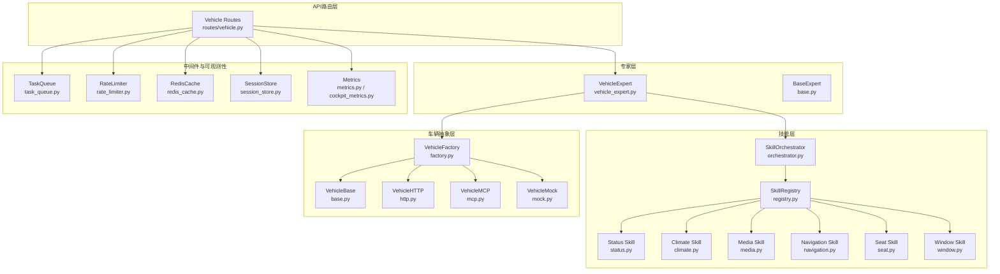

图表来源
- [vehicle_expert.py:1-200](file://backend_design/nexus/agent/experts/vehicle_expert.py#L1-L200)
- [orchestrator.py:1-200](file://backend_design/nexus/skills/orchestrator.py#L1-L200)
- [registry.py:1-200](file://backend_design/nexus/skills/registry.py#L1-L200)
- [status.py:1-200](file://backend_design/nexus/skills/vehicle/status.py#L1-L200)
- [climate.py:1-200](file://backend_design/nexus/skills/vehicle/climate.py#L1-L200)
- [media.py:1-200](file://backend_design/nexus/skills/vehicle/media.py#L1-L200)
- [navigation.py:1-200](file://backend_design/nexus/skills/vehicle/navigation.py#L1-L200)
- [seat.py:1-200](file://backend_design/nexus/skills/vehicle/seat.py#L1-L200)
- [window.py:1-200](file://backend_design/nexus/skills/vehicle/window.py#L1-L200)
- [http.py:1-200](file://backend_design/nexus/vehicle/http.py#L1-L200)
- [mcp.py:1-200](file://backend_design/nexus/vehicle/mcp.py#L1-L200)
- [mock.py:1-200](file://backend_design/nexus/vehicle/mock.py#L1-L200)
- [factory.py:1-200](file://backend_design/nexus/vehicle/factory.py#L1-L200)
- [vehicle.py:1-200](file://backend_design/nexus/api/routes/vehicle.py#L1-L200)
- [task_queue.py:1-200](file://backend_design/nexus/middleware/task_queue.py#L1-L200)
- [rate_limiter.py:1-200](file://backend_design/nexus/middleware/rate_limiter.py#L1-L200)
- [redis_cache.py:1-200](file://backend_design/nexus/middleware/redis_cache.py#L1-L200)
- [session_store.py:1-200](file://backend_design/nexus/middleware/session_store.py#L1-L200)
- [metrics.py:1-200](file://backend_design/nexus/observability/metrics.py#L1-L200)
- [cockpit_metrics.py:1-200](file://backend_design/nexus/observability/cockpit_metrics.py#L1-L200)

章节来源
- [vehicle_expert.py:1-200](file://backend_design/nexus/agent/experts/vehicle_expert.py#L1-L200)
- [orchestrator.py:1-200](file://backend_design/nexus/skills/orchestrator.py#L1-L200)
- [registry.py:1-200](file://backend_design/nexus/skills/registry.py#L1-L200)
- [http.py:1-200](file://backend_design/nexus/vehicle/http.py#L1-L200)
- [mcp.py:1-200](file://backend_design/nexus/vehicle/mcp.py#L1-L200)
- [mock.py:1-200](file://backend_design/nexus/vehicle/mock.py#L1-L200)
- [factory.py:1-200](file://backend_design/nexus/vehicle/factory.py#L1-L200)
- [vehicle.py:1-200](file://backend_design/nexus/api/routes/vehicle.py#L1-L200)
- [task_queue.py:1-200](file://backend_design/nexus/middleware/task_queue.py#L1-L200)
- [rate_limiter.py:1-200](file://backend_design/nexus/middleware/rate_limiter.py#L1-L200)
- [redis_cache.py:1-200](file://backend_design/nexus/middleware/redis_cache.py#L1-L200)
- [session_store.py:1-200](file://backend_design/nexus/middleware/session_store.py#L1-L200)
- [metrics.py:1-200](file://backend_design/nexus/observability/metrics.py#L1-L200)
- [cockpit_metrics.py:1-200](file://backend_design/nexus/observability/cockpit_metrics.py#L1-L200)

## 核心组件
- 车辆专家（VehicleExpert）
  - 职责：接收上层Agent调度，进行意图到技能的映射、参数校验、安全策略检查、并发编排与结果聚合。
  - 关键能力：权限校验、安全检查、命令队列化、状态同步、异常归一化与可观测性埋点。
- 技能编排器（SkillOrchestrator）与注册表（SkillRegistry）
  - 职责：维护技能清单、按名称或类型分发请求、支持动态加载与版本兼容。
- 车辆抽象层（VehicleBase + HTTP/MCP/Mock实现 + Factory）
  - 职责：屏蔽底层差异，提供统一的车辆控制接口；工厂根据配置选择具体实现。
- API路由层（routes/vehicle.py）
  - 职责：对外暴露REST接口，承载鉴权、限流、会话、缓存、异步任务与指标上报。
- 中间件与可观测性
  - 限流、缓存、会话存储、任务队列、指标采集与仪表盘。

章节来源
- [vehicle_expert.py:1-200](file://backend_design/nexus/agent/experts/vehicle_expert.py#L1-L200)
- [orchestrator.py:1-200](file://backend_design/nexus/skills/orchestrator.py#L1-L200)
- [registry.py:1-200](file://backend_design/nexus/skills/registry.py#L1-L200)
- [base.py:1-200](file://backend_design/nexus/vehicle/base.py#L1-L200)
- [http.py:1-200](file://backend_design/nexus/vehicle/http.py#L1-L200)
- [mcp.py:1-200](file://backend_design/nexus/vehicle/mcp.py#L1-L200)
- [mock.py:1-200](file://backend_design/nexus/vehicle/mock.py#L1-L200)
- [factory.py:1-200](file://backend_design/nexus/vehicle/factory.py#L1-L200)
- [vehicle.py:1-200](file://backend_design/nexus/api/routes/vehicle.py#L1-L200)
- [task_queue.py:1-200](file://backend_design/nexus/middleware/task_queue.py#L1-L200)
- [rate_limiter.py:1-200](file://backend_design/nexus/middleware/rate_limiter.py#L1-L200)
- [redis_cache.py:1-200](file://backend_design/nexus/middleware/redis_cache.py#L1-L200)
- [session_store.py:1-200](file://backend_design/nexus/middleware/session_store.py#L1-L200)
- [metrics.py:1-200](file://backend_design/nexus/observability/metrics.py#L1-L200)
- [cockpit_metrics.py:1-200](file://backend_design/nexus/observability/cockpit_metrics.py#L1-L200)

## 架构总览
下图展示从API到车辆后端的端到端路径，以及专家层与技能层的协作方式。

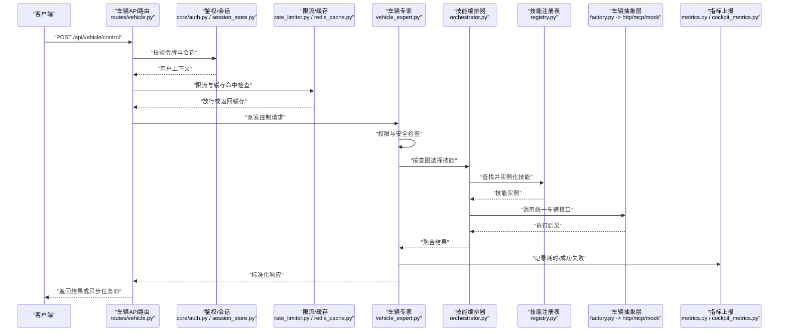

图表来源
- [vehicle.py:1-200](file://backend_design/nexus/api/routes/vehicle.py#L1-L200)
- [auth.py:1-200](file://backend_design/nexus/core/auth.py#L1-L200)
- [session_store.py:1-200](file://backend_design/nexus/middleware/session_store.py#L1-L200)
- [rate_limiter.py:1-200](file://backend_design/nexus/middleware/rate_limiter.py#L1-L200)
- [redis_cache.py:1-200](file://backend_design/nexus/middleware/redis_cache.py#L1-L200)
- [vehicle_expert.py:1-200](file://backend_design/nexus/agent/experts/vehicle_expert.py#L1-L200)
- [orchestrator.py:1-200](file://backend_design/nexus/skills/orchestrator.py#L1-L200)
- [registry.py:1-200](file://backend_design/nexus/skills/registry.py#L1-L200)
- [factory.py:1-200](file://backend_design/nexus/vehicle/factory.py#L1-L200)
- [http.py:1-200](file://backend_design/nexus/vehicle/http.py#L1-L200)
- [mcp.py:1-200](file://backend_design/nexus/vehicle/mcp.py#L1-L200)
- [mock.py:1-200](file://backend_design/nexus/vehicle/mock.py#L1-L200)
- [metrics.py:1-200](file://backend_design/nexus/observability/metrics.py#L1-L200)
- [cockpit_metrics.py:1-200](file://backend_design/nexus/observability/cockpit_metrics.py#L1-L200)

## 详细组件分析

### 车辆专家（VehicleExpert）
- 职责边界
  - 将高层意图转换为具体技能调用
  - 执行权限与安全策略检查
  - 管理命令队列与并发执行
  - 统一异常与指标上报
- 关键流程
  - 指令解析：从请求体提取动作、目标设备与参数
  - 权限验证：基于用户角色与上下文判断是否允许操作
  - 安全检查：对危险操作进行二次确认、阈值限制、白名单校验
  - 执行与反馈：通过编排器调用技能，收集结果并标准化返回
  - 状态同步：必要时触发状态拉取或订阅更新
- 典型方法
  - 入口处理：解析请求、鉴权、安全检查、编排执行、结果聚合
  - 命令入队：将耗时操作放入任务队列，返回任务ID供轮询
  - 状态查询：读取本地缓存或远程车辆状态，合并返回

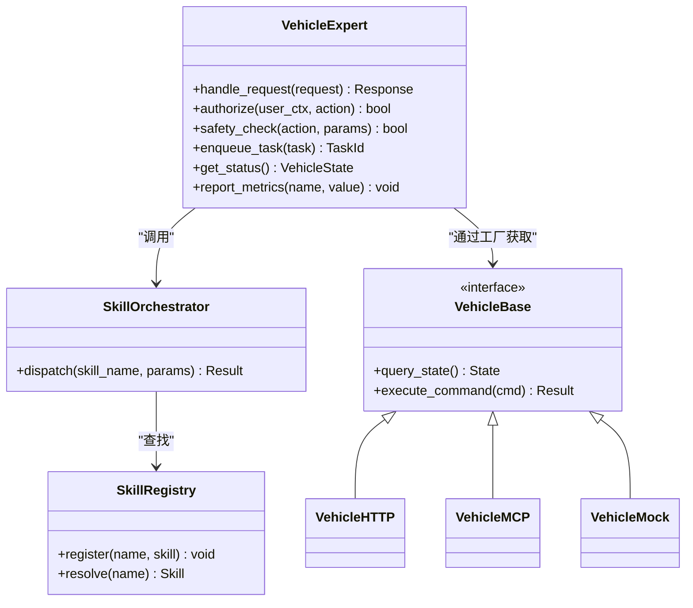

图表来源
- [vehicle_expert.py:1-200](file://backend_design/nexus/agent/experts/vehicle_expert.py#L1-L200)
- [orchestrator.py:1-200](file://backend_design/nexus/skills/orchestrator.py#L1-L200)
- [registry.py:1-200](file://backend_design/nexus/skills/registry.py#L1-L200)
- [base.py:1-200](file://backend_design/nexus/vehicle/base.py#L1-L200)
- [http.py:1-200](file://backend_design/nexus/vehicle/http.py#L1-L200)
- [mcp.py:1-200](file://backend_design/nexus/vehicle/mcp.py#L1-L200)
- [mock.py:1-200](file://backend_design/nexus/vehicle/mock.py#L1-L200)

章节来源
- [vehicle_expert.py:1-200](file://backend_design/nexus/agent/experts/vehicle_expert.py#L1-L200)
- [orchestrator.py:1-200](file://backend_design/nexus/skills/orchestrator.py#L1-L200)
- [registry.py:1-200](file://backend_design/nexus/skills/registry.py#L1-L200)
- [base.py:1-200](file://backend_design/nexus/vehicle/base.py#L1-L200)

### 车辆API抽象层（VehicleBase + 多实现 + 工厂）
- 设计要点
  - 统一接口：所有车辆后端必须实现基础查询与命令执行
  - 多协议适配：HTTP、MCP、Mock三种实现，便于开发与联调
  - 工厂模式：依据配置动态选择后端，支持热切换
- 关键方法
  - 状态查询：返回车辆当前状态（电量、车门、空调、媒体等）
  - 命令执行：下发控制指令并返回执行结果
  - 健康检查：用于服务可用性探测
- 扩展建议
  - 新增后端时继承基类并实现必要方法
  - 在工厂中注册新实现并通过配置启用

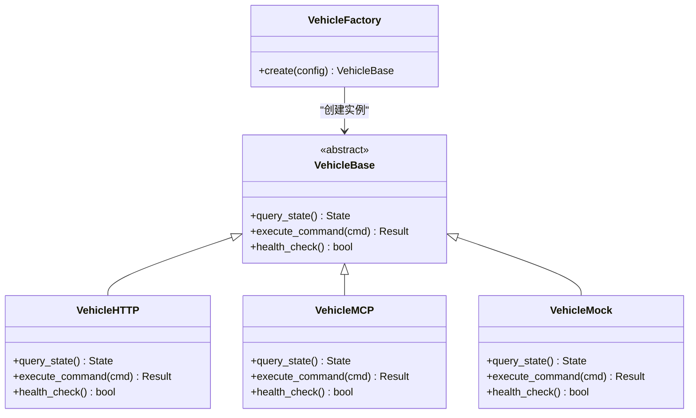

图表来源
- [base.py:1-200](file://backend_design/nexus/vehicle/base.py#L1-L200)
- [http.py:1-200](file://backend_design/nexus/vehicle/http.py#L1-L200)
- [mcp.py:1-200](file://backend_design/nexus/vehicle/mcp.py#L1-L200)
- [mock.py:1-200](file://backend_design/nexus/vehicle/mock.py#L1-L200)
- [factory.py:1-200](file://backend_design/nexus/vehicle/factory.py#L1-L200)

章节来源
- [base.py:1-200](file://backend_design/nexus/vehicle/base.py#L1-L200)
- [http.py:1-200](file://backend_design/nexus/vehicle/http.py#L1-L200)
- [mcp.py:1-200](file://backend_design/nexus/vehicle/mcp.py#L1-L200)
- [mock.py:1-200](file://backend_design/nexus/vehicle/mock.py#L1-L200)
- [factory.py:1-200](file://backend_design/nexus/vehicle/factory.py#L1-L200)

### 技能层（状态、空调、媒体、导航、座椅、车窗）
- 职责
  - 将通用命令映射为具体设备的控制语义
  - 提供领域特定的参数校验与默认值填充
  - 与车辆抽象层交互，完成实际执行
- 编排与注册
  - 通过注册表集中管理技能，支持按需加载与版本兼容
  - 编排器根据意图选择合适技能，支持并行与串行组合

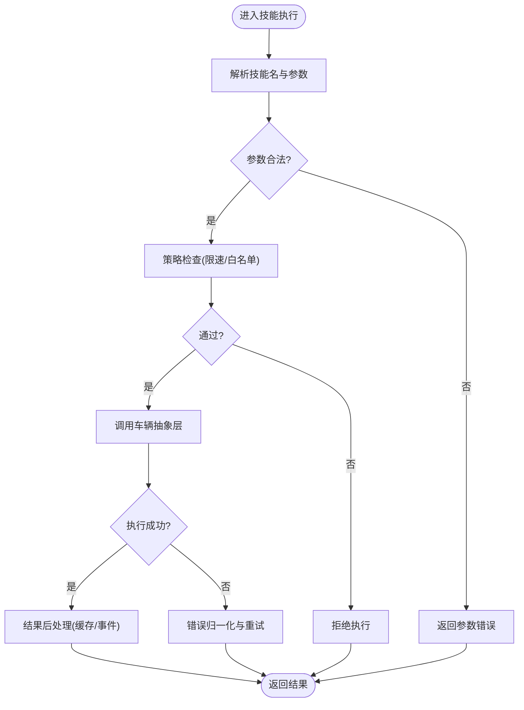

图表来源
- [status.py:1-200](file://backend_design/nexus/skills/vehicle/status.py#L1-L200)
- [climate.py:1-200](file://backend_design/nexus/skills/vehicle/climate.py#L1-L200)
- [media.py:1-200](file://backend_design/nexus/skills/vehicle/media.py#L1-L200)
- [navigation.py:1-200](file://backend_design/nexus/skills/vehicle/navigation.py#L1-L200)
- [seat.py:1-200](file://backend_design/nexus/skills/vehicle/seat.py#L1-L200)
- [window.py:1-200](file://backend_design/nexus/skills/vehicle/window.py#L1-L200)
- [orchestrator.py:1-200](file://backend_design/nexus/skills/orchestrator.py#L1-L200)
- [registry.py:1-200](file://backend_design/nexus/skills/registry.py#L1-L200)

章节来源
- [status.py:1-200](file://backend_design/nexus/skills/vehicle/status.py#L1-L200)
- [climate.py:1-200](file://backend_design/nexus/skills/vehicle/climate.py#L1-L200)
- [media.py:1-200](file://backend_design/nexus/skills/vehicle/media.py#L1-L200)
- [navigation.py:1-200](file://backend_design/nexus/skills/vehicle/navigation.py#L1-L200)
- [seat.py:1-200](file://backend_design/nexus/skills/vehicle/seat.py#L1-L200)
- [window.py:1-200](file://backend_design/nexus/skills/vehicle/window.py#L1-L200)
- [orchestrator.py:1-200](file://backend_design/nexus/skills/orchestrator.py#L1-L200)
- [registry.py:1-200](file://backend_design/nexus/skills/registry.py#L1-L200)

### API路由层（车辆API）
- 职责
  - 暴露REST接口，统一请求入口
  - 集成鉴权、限流、缓存、会话、任务队列与指标上报
- 典型流程
  - 鉴权与会话加载
  - 限流与缓存命中
  - 委派给车辆专家处理
  - 异步任务与轮询支持
  - 指标统计与日志记录

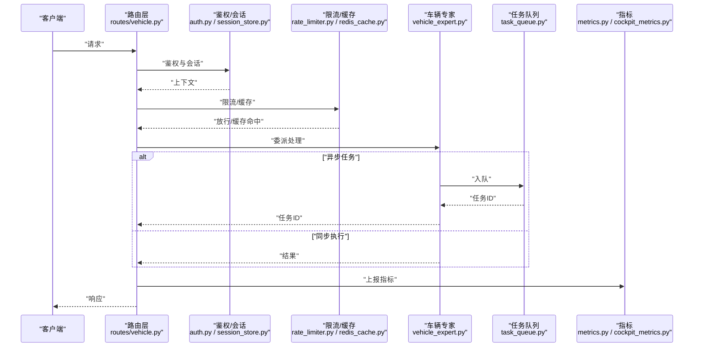

图表来源
- [vehicle.py:1-200](file://backend_design/nexus/api/routes/vehicle.py#L1-L200)
- [auth.py:1-200](file://backend_design/nexus/core/auth.py#L1-L200)
- [session_store.py:1-200](file://backend_design/nexus/middleware/session_store.py#L1-L200)
- [rate_limiter.py:1-200](file://backend_design/nexus/middleware/rate_limiter.py#L1-L200)
- [redis_cache.py:1-200](file://backend_design/nexus/middleware/redis_cache.py#L1-L200)
- [vehicle_expert.py:1-200](file://backend_design/nexus/agent/experts/vehicle_expert.py#L1-L200)
- [task_queue.py:1-200](file://backend_design/nexus/middleware/task_queue.py#L1-L200)
- [metrics.py:1-200](file://backend_design/nexus/observability/metrics.py#L1-L200)
- [cockpit_metrics.py:1-200](file://backend_design/nexus/observability/cockpit_metrics.py#L1-L200)

章节来源
- [vehicle.py:1-200](file://backend_design/nexus/api/routes/vehicle.py#L1-L200)
- [auth.py:1-200](file://backend_design/nexus/core/auth.py#L1-L200)
- [session_store.py:1-200](file://backend_design/nexus/middleware/session_store.py#L1-L200)
- [rate_limiter.py:1-200](file://backend_design/nexus/middleware/rate_limiter.py#L1-L200)
- [redis_cache.py:1-200](file://backend_design/nexus/middleware/redis_cache.py#L1-L200)
- [task_queue.py:1-200](file://backend_design/nexus/middleware/task_queue.py#L1-L200)
- [metrics.py:1-200](file://backend_design/nexus/observability/metrics.py#L1-L200)
- [cockpit_metrics.py:1-200](file://backend_design/nexus/observability/cockpit_metrics.py#L1-L200)

### 指令解析、权限验证、安全检查与执行反馈
- 指令解析
  - 从请求体提取动作、目标设备、参数与上下文
  - 参数规范化与默认值填充
- 权限验证
  - 基于用户角色、会话与租户上下文判断是否允许
- 安全检查
  - 危险操作二次确认、频率限制、范围限制、白名单校验
- 执行与反馈
  - 同步返回或异步任务ID
  - 统一错误码与消息，便于前端展示
  - 指标上报与审计日志

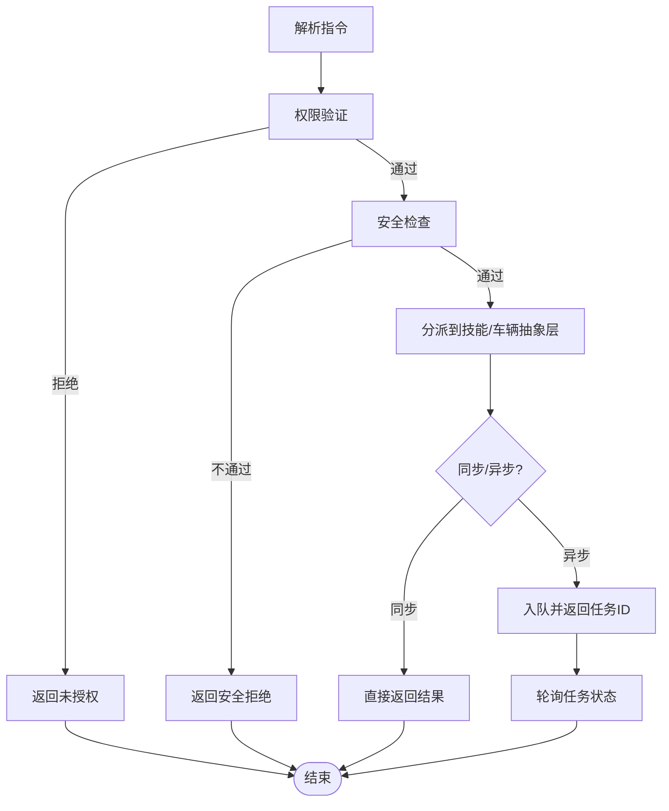

图表来源
- [vehicle_expert.py:1-200](file://backend_design/nexus/agent/experts/vehicle_expert.py#L1-L200)
- [auth.py:1-200](file://backend_design/nexus/core/auth.py#L1-L200)
- [task_queue.py:1-200](file://backend_design/nexus/middleware/task_queue.py#L1-L200)

章节来源
- [vehicle_expert.py:1-200](file://backend_design/nexus/agent/experts/vehicle_expert.py#L1-L200)
- [auth.py:1-200](file://backend_design/nexus/core/auth.py#L1-L200)
- [task_queue.py:1-200](file://backend_design/nexus/middleware/task_queue.py#L1-L200)

### 车辆状态监控与状态同步策略
- 状态来源
  - 本地缓存（Redis）与远程车辆后端（HTTP/MCP）
- 同步策略
  - 主动拉取：定时或事件触发拉取最新状态
  - 被动推送：后端事件驱动更新（如WebSocket或回调）
  - 一致性保障：版本号或时间戳避免脏读
- 监控指标
  - 状态延迟、成功率、错误率、缓存命中率

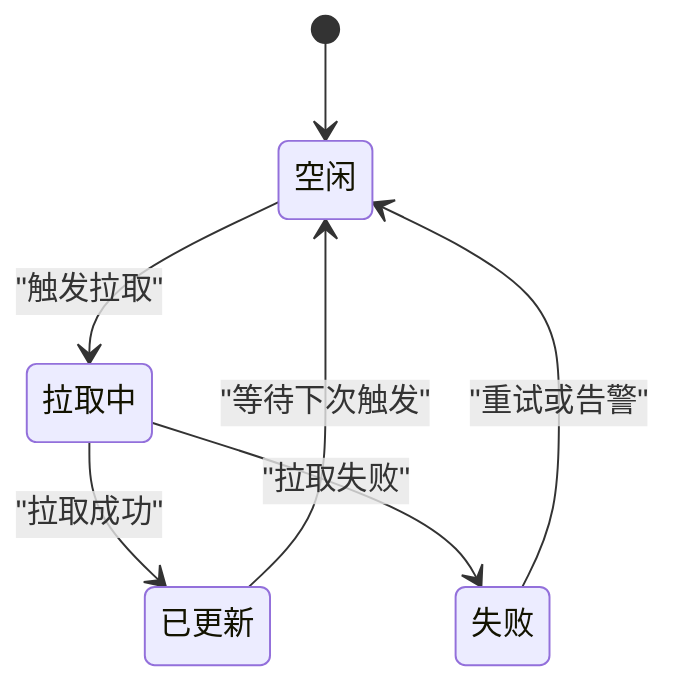

图表来源
- [redis_cache.py:1-200](file://backend_design/nexus/middleware/redis_cache.py#L1-L200)
- [http.py:1-200](file://backend_design/nexus/vehicle/http.py#L1-L200)
- [mcp.py:1-200](file://backend_design/nexus/vehicle/mcp.py#L1-L200)
- [cockpit_metrics.py:1-200](file://backend_design/nexus/observability/cockpit_metrics.py#L1-L200)

章节来源
- [redis_cache.py:1-200](file://backend_design/nexus/middleware/redis_cache.py#L1-L200)
- [http.py:1-200](file://backend_design/nexus/vehicle/http.py#L1-L200)
- [mcp.py:1-200](file://backend_design/nexus/vehicle/mcp.py#L1-L200)
- [cockpit_metrics.py:1-200](file://backend_design/nexus/observability/cockpit_metrics.py#L1-L200)

### 命令队列管理
- 设计要点
  - 持久化任务描述与状态
  - 支持优先级与重试策略
  - 消费者并发与背压控制
- 使用场景
  - 长时间运行的控制命令（如导航规划、批量设置）
  - 需要幂等与可追踪的执行过程

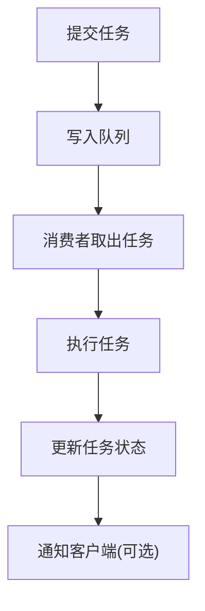

图表来源
- [task_queue.py:1-200](file://backend_design/nexus/middleware/task_queue.py#L1-L200)

章节来源
- [task_queue.py:1-200](file://backend_design/nexus/middleware/task_queue.py#L1-L200)

### 错误处理策略
- 分类
  - 参数错误、权限拒绝、安全检查失败、网络超时、后端不可用
- 策略
  - 统一错误码与消息
  - 重试与退避（指数退避、最大重试次数）
  - 熔断与降级（快速失败、返回缓存或模拟数据）
  - 审计日志与告警

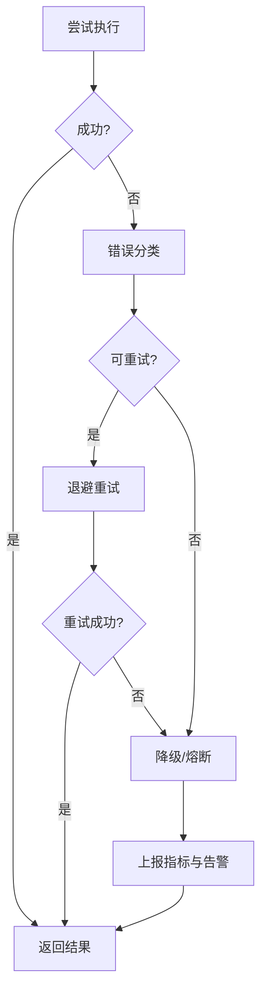

图表来源
- [exceptions.py:1-200](file://backend_design/nexus/core/exceptions.py#L1-L200)
- [circuit_breaker.py:1-200](file://backend_design/nexus/core/circuit_breaker.py#L1-L200)
- [metrics.py:1-200](file://backend_design/nexus/observability/metrics.py#L1-L200)

章节来源
- [exceptions.py:1-200](file://backend_design/nexus/core/exceptions.py#L1-L200)
- [circuit_breaker.py:1-200](file://backend_design/nexus/core/circuit_breaker.py#L1-L200)
- [metrics.py:1-200](file://backend_design/nexus/observability/metrics.py#L1-L200)

### 性能监控方案
- 指标维度
  - 请求量、延迟分布、成功率、错误率、缓存命中率、队列积压
- 采集与可视化
  - 应用内埋点上报Prometheus
  - Grafana仪表盘展示
- 优化建议
  - 热点缓存、批量操作、连接池与超时调优、异步化

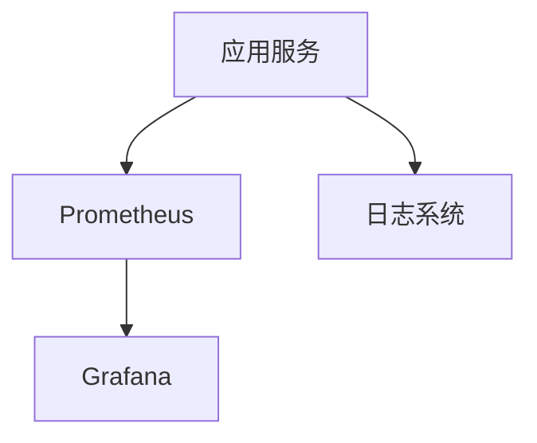

图表来源
- [metrics.py:1-200](file://backend_design/nexus/observability/metrics.py#L1-L200)
- [cockpit_metrics.py:1-200](file://backend_design/nexus/observability/cockpit_metrics.py#L1-L200)
- [config.py:1-200](file://backend_design/nexus/config.py#L1-200)

章节来源
- [metrics.py:1-200](file://backend_design/nexus/observability/metrics.py#L1-L200)
- [cockpit_metrics.py:1-200](file://backend_design/nexus/observability/cockpit_metrics.py#L1-L200)
- [config.py:1-200](file://backend_design/nexus/config.py#L1-200)

## 依赖关系分析
- 组件耦合
  - 车辆专家强依赖编排器与注册表，弱依赖车辆抽象层（通过工厂）
  - API路由层依赖中间件（鉴权、限流、缓存、会话、任务队列）与可观测性
- 外部依赖
  - Redis（缓存与会话）、Prometheus/Grafana（指标与可视化）、日志系统
- 潜在循环依赖
  - 通过分层与接口隔离避免循环引用

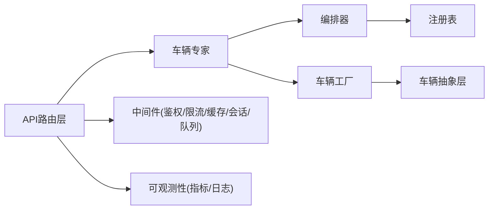

图表来源
- [vehicle.py:1-200](file://backend_design/nexus/api/routes/vehicle.py#L1-L200)
- [vehicle_expert.py:1-200](file://backend_design/nexus/agent/experts/vehicle_expert.py#L1-L200)
- [orchestrator.py:1-200](file://backend_design/nexus/skills/orchestrator.py#L1-L200)
- [registry.py:1-200](file://backend_design/nexus/skills/registry.py#L1-L200)
- [factory.py:1-200](file://backend_design/nexus/vehicle/factory.py#L1-L200)
- [base.py:1-200](file://backend_design/nexus/vehicle/base.py#L1-L200)
- [task_queue.py:1-200](file://backend_design/nexus/middleware/task_queue.py#L1-L200)
- [rate_limiter.py:1-200](file://backend_design/nexus/middleware/rate_limiter.py#L1-L200)
- [redis_cache.py:1-200](file://backend_design/nexus/middleware/redis_cache.py#L1-L200)
- [session_store.py:1-200](file://backend_design/nexus/middleware/session_store.py#L1-L200)
- [metrics.py:1-200](file://backend_design/nexus/observability/metrics.py#L1-L200)
- [cockpit_metrics.py:1-200](file://backend_design/nexus/observability/cockpit_metrics.py#L1-L200)

章节来源
- [vehicle.py:1-200](file://backend_design/nexus/api/routes/vehicle.py#L1-L200)
- [vehicle_expert.py:1-200](file://backend_design/nexus/agent/experts/vehicle_expert.py#L1-L200)
- [orchestrator.py:1-200](file://backend_design/nexus/skills/orchestrator.py#L1-L200)
- [registry.py:1-200](file://backend_design/nexus/skills/registry.py#L1-L200)
- [factory.py:1-200](file://backend_design/nexus/vehicle/factory.py#L1-L200)
- [base.py:1-200](file://backend_design/nexus/vehicle/base.py#L1-L200)
- [task_queue.py:1-200](file://backend_design/nexus/middleware/task_queue.py#L1-L200)
- [rate_limiter.py:1-200](file://backend_design/nexus/middleware/rate_limiter.py#L1-L200)
- [redis_cache.py:1-200](file://backend_design/nexus/middleware/redis_cache.py#L1-L200)
- [session_store.py:1-200](file://backend_design/nexus/middleware/session_store.py#L1-L200)
- [metrics.py:1-200](file://backend_design/nexus/observability/metrics.py#L1-L200)
- [cockpit_metrics.py:1-200](file://backend_design/nexus/observability/cockpit_metrics.py#L1-L200)

## 性能考虑
- 缓存优先：状态查询优先命中缓存，降低远端压力
- 异步化：长耗时操作入队，避免阻塞请求线程
- 连接池与超时：合理设置HTTP/MCP连接池大小与超时时间
- 限流与熔断：保护后端资源，防止雪崩
- 指标与告警：实时监控关键指标，及时发现问题

[本节为通用指导，无需特定文件来源]

## 故障排查指南
- 常见问题
  - 鉴权失败：检查令牌与会话有效性
  - 限流触发：检查请求频率与配额
  - 缓存失效：检查Redis连通性与键空间
  - 任务堆积：检查消费者消费速率与错误重试
  - 后端不可用：检查HTTP/MCP服务健康与网络
- 定位手段
  - 查看指标与日志，关注错误码与堆栈
  - 使用健康检查接口确认服务状态
  - 回放请求与参数，复现问题

章节来源
- [logger.py:1-200](file://backend_design/nexus/core/logger.py#L1-L200)
- [metrics.py:1-200](file://backend_design/nexus/observability/metrics.py#L1-L200)
- [cockpit_metrics.py:1-200](file://backend_design/nexus/observability/cockpit_metrics.py#L1-L200)
- [task_queue.py:1-200](file://backend_design/nexus/middleware/task_queue.py#L1-L200)
- [redis_cache.py:1-200](file://backend_design/nexus/middleware/redis_cache.py#L1-L200)
- [http.py:1-200](file://backend_design/nexus/vehicle/http.py#L1-L200)
- [mcp.py:1-200](file://backend_design/nexus/vehicle/mcp.py#L1-L200)

## 结论
车辆专家通过清晰的层次划分与抽象，实现了灵活可扩展的车辆控制与集成能力。借助技能编排、统一车辆抽象层、完善的中间件与可观测性体系，系统在安全性、可靠性与性能方面具备良好支撑。建议在后续迭代中持续完善错误处理、性能优化与监控告警，以提升整体稳定性与用户体验。

[本节为总结，无需特定文件来源]

## 附录

### 车辆API调用示例（路径参考）
- 查询车辆状态
  - 方法：GET
  - 路径：/api/vehicle/status
  - 说明：返回当前车辆状态，优先从缓存读取
  - 参考路径：[vehicle.py:1-200](file://backend_design/nexus/api/routes/vehicle.py#L1-L200)
- 控制空调
  - 方法：POST
  - 路径：/api/vehicle/climate
  - 说明：设置温度、风量、模式等
  - 参考路径：[climate.py:1-200](file://backend_design/nexus/skills/vehicle/climate.py#L1-L200)
- 控制媒体
  - 方法：POST
  - 路径：/api/vehicle/media
  - 说明：播放、暂停、切歌、音量调节
  - 参考路径：[media.py:1-200](file://backend_design/nexus/skills/vehicle/media.py#L1-L200)
- 设置导航
  - 方法：POST
  - 路径：/api/vehicle/navigation
  - 说明：设置目的地、路线偏好
  - 参考路径：[navigation.py:1-200](file://backend_design/nexus/skills/vehicle/navigation.py#L1-L200)
- 控制座椅
  - 方法：POST
  - 路径：/api/vehicle/seat
  - 说明：位置、加热、通风
  - 参考路径：[seat.py:1-200](file://backend_design/nexus/skills/vehicle/seat.py#L1-L200)
- 控制车窗
  - 方法：POST
  - 路径：/api/vehicle/window
  - 说明：开合比例、速度
  - 参考路径：[window.py:1-200](file://backend_design/nexus/skills/vehicle/window.py#L1-L200)

章节来源
- [vehicle.py:1-200](file://backend_design/nexus/api/routes/vehicle.py#L1-L200)
- [status.py:1-200](file://backend_design/nexus/skills/vehicle/status.py#L1-L200)
- [climate.py:1-200](file://backend_design/nexus/skills/vehicle/climate.py#L1-L200)
- [media.py:1-200](file://backend_design/nexus/skills/vehicle/media.py#L1-L200)
- [navigation.py:1-200](file://backend_design/nexus/skills/vehicle/navigation.py#L1-L200)
- [seat.py:1-200](file://backend_design/nexus/skills/vehicle/seat.py#L1-L200)
- [window.py:1-200](file://backend_design/nexus/skills/vehicle/window.py#L1-L200)