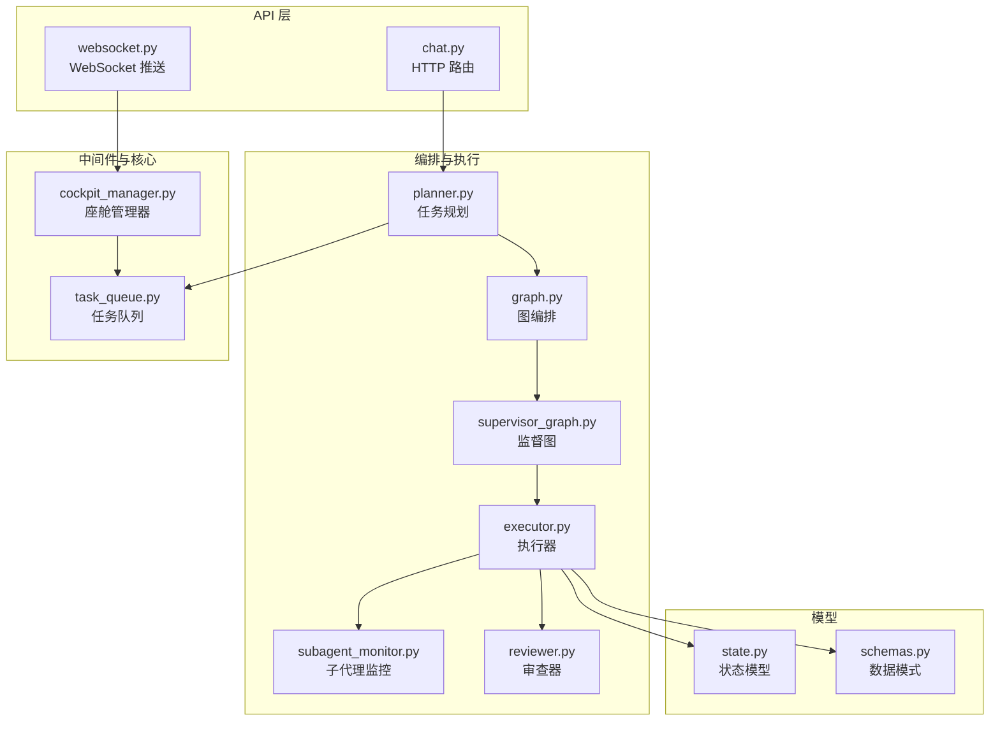
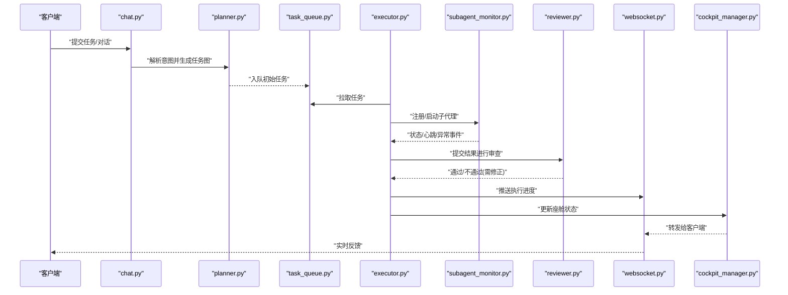
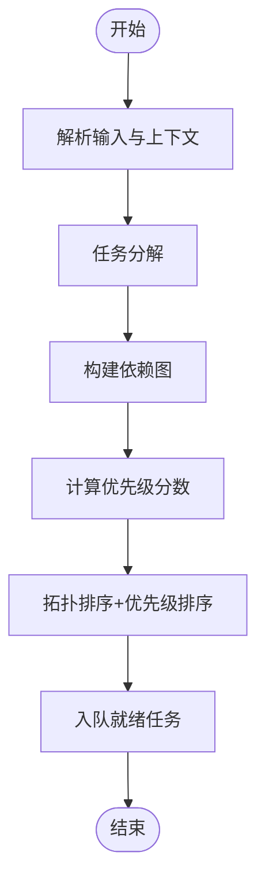
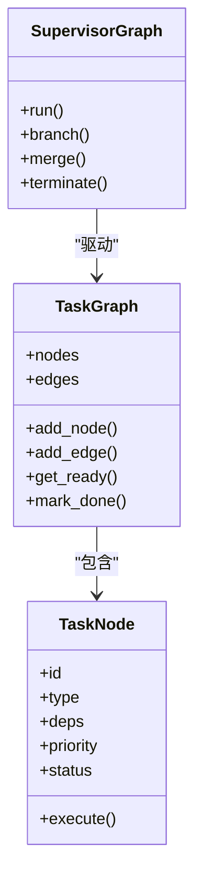
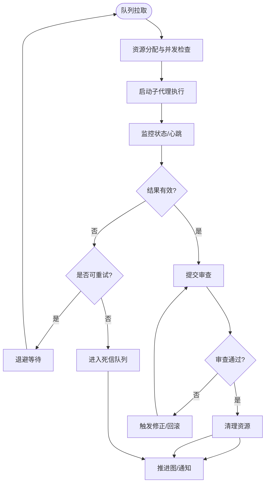
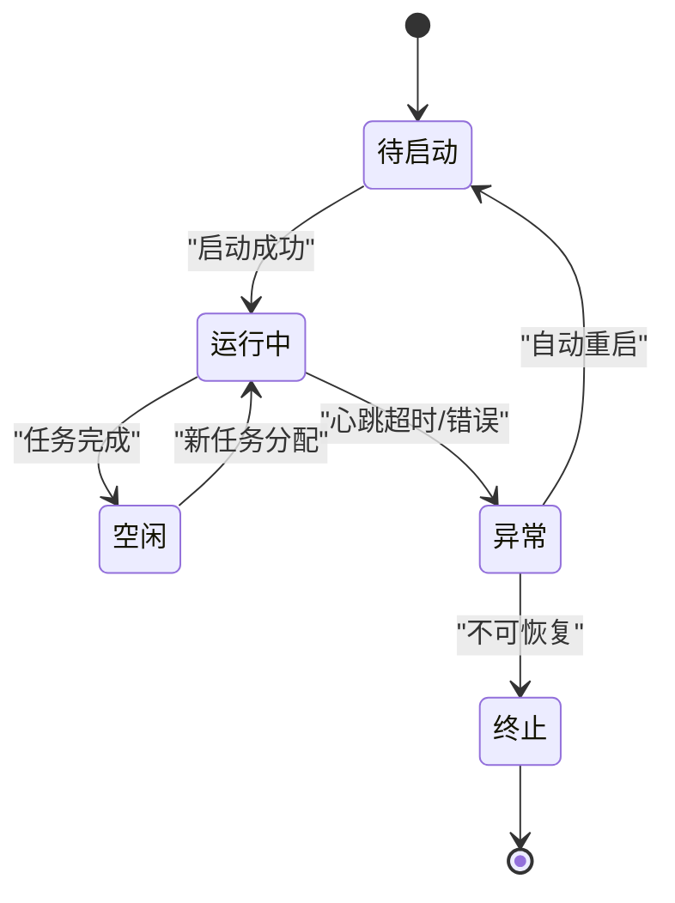
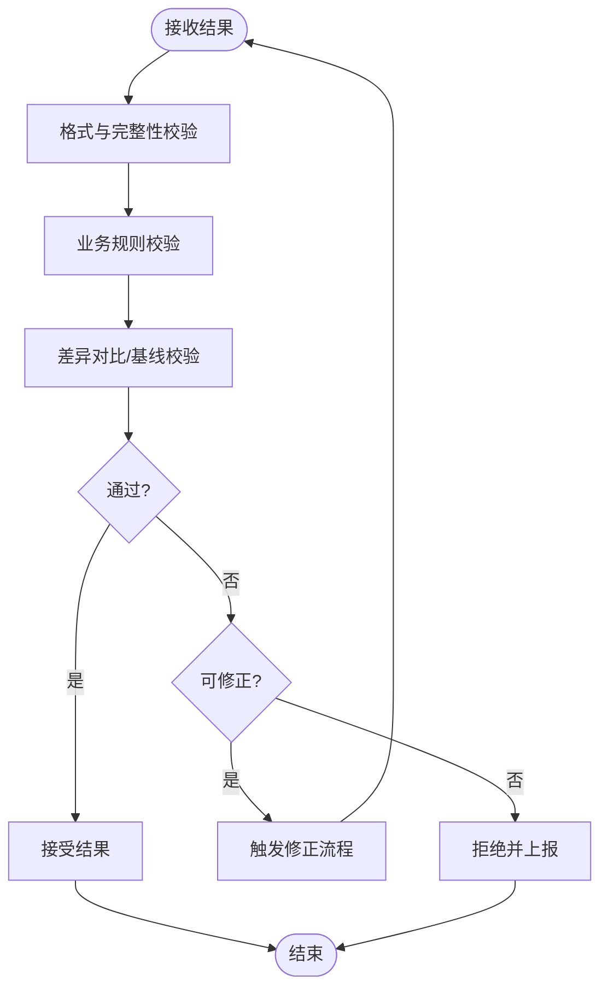
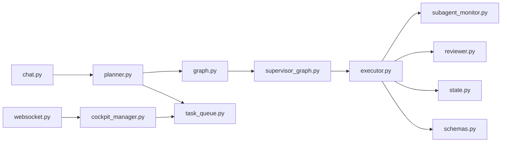

# 任务规划和执行机制

<cite>
**本文引用的文件**   
- [backend_design/nexus/agent/planner.py](file://backend_design/nexus/agent/planner.py)
- [backend_design/nexus/agent/executor.py](file://backend_design/nexus/agent/executor.py)
- [backend_design/nexus/agent/subagent_monitor.py](file://backend_design/nexus/agent/subagent_monitor.py)
- [backend_design/nexus/agent/reviewer.py](file://backend_design/nexus/agent/reviewer.py)
- [backend_design/nexus/agent/graph.py](file://backend_design/nexus/agent/graph.py)
- [backend_design/nexus/agent/supervisor_graph.py](file://backend_design/nexus/agent/supervisor_graph.py)
- [backend_design/nexus/middleware/task_queue.py](file://backend_design/nexus/middleware/task_queue.py)
- [backend_design/nexus/core/cockpit_manager.py](file://backend_design/nexus/core/cockpit_manager.py)
- [backend_design/nexus/models/state.py](file://backend_design/nexus/models/state.py)
- [backend_design/nexus/models/schemas.py](file://backend_design/nexus/models/schemas.py)
- [backend_design/nexus/api/routes/chat.py](file://backend_design/nexus/api/routes/chat.py)
- [backend_design/nexus/api/websocket.py](file://backend_design/nexus/api/websocket.py)
</cite>

## 目录
1. [简介](#简介)
2. [项目结构](#项目结构)
3. [核心组件](#核心组件)
4. [架构总览](#架构总览)
5. [详细组件分析](#详细组件分析)
6. [依赖分析](#依赖分析)
7. [性能考虑](#性能考虑)
8. [故障排查指南](#故障排查指南)
9. [结论](#结论)
10. [附录](#附录)

## 简介
本文件聚焦于 NexusCockpit 的任务规划与执行机制，覆盖以下关键主题：
- 任务规划算法：任务分解、依赖分析与优先级排序
- 执行器调度策略：资源分配与并发控制
- 子代理监控器：状态跟踪与异常检测
- 审查器：质量控制与结果验证
- 任务生命周期管理：启动、监控、重试与清理
- 性能优化建议与故障排查指南

## 项目结构
围绕任务规划与执行的代码主要分布在 agent、middleware、core、models 与 api 层。下图展示了与任务编排相关的关键模块及其关系。

图表来源
- [backend_design/nexus/api/routes/chat.py](file://backend_design/nexus/api/routes/chat.py)
- [backend_design/nexus/api/websocket.py](file://backend_design/nexus/api/websocket.py)
- [backend_design/nexus/agent/planner.py](file://backend_design/nexus/agent/planner.py)
- [backend_design/nexus/agent/graph.py](file://backend_design/nexus/agent/graph.py)
- [backend_design/nexus/agent/supervisor_graph.py](file://backend_design/nexus/agent/supervisor_graph.py)
- [backend_design/nexus/agent/executor.py](file://backend_design/nexus/agent/executor.py)
- [backend_design/nexus/agent/subagent_monitor.py](file://backend_design/nexus/agent/subagent_monitor.py)
- [backend_design/nexus/agent/reviewer.py](file://backend_design/nexus/agent/reviewer.py)
- [backend_design/nexus/middleware/task_queue.py](file://backend_design/nexus/middleware/task_queue.py)
- [backend_design/nexus/core/cockpit_manager.py](file://backend_design/nexus/core/cockpit_manager.py)
- [backend_design/nexus/models/state.py](file://backend_design/nexus/models/state.py)
- [backend_design/nexus/models/schemas.py](file://backend_design/nexus/models/schemas.py)

章节来源
- [backend_design/nexus/agent/planner.py](file://backend_design/nexus/agent/planner.py)
- [backend_design/nexus/agent/executor.py](file://backend_design/nexus/agent/executor.py)
- [backend_design/nexus/agent/subagent_monitor.py](file://backend_design/nexus/agent/subagent_monitor.py)
- [backend_design/nexus/agent/reviewer.py](file://backend_design/nexus/agent/reviewer.py)
- [backend_design/nexus/agent/graph.py](file://backend_design/nexus/agent/graph.py)
- [backend_design/nexus/agent/supervisor_graph.py](file://backend_design/nexus/agent/supervisor_graph.py)
- [backend_design/nexus/middleware/task_queue.py](file://backend_design/nexus/middleware/task_queue.py)
- [backend_design/nexus/core/cockpit_manager.py](file://backend_design/nexus/core/cockpit_manager.py)
- [backend_design/nexus/models/state.py](file://backend_design/nexus/models/state.py)
- [backend_design/nexus/models/schemas.py](file://backend_design/nexus/models/schemas.py)
- [backend_design/nexus/api/routes/chat.py](file://backend_design/nexus/api/routes/chat.py)
- [backend_design/nexus/api/websocket.py](file://backend_design/nexus/api/websocket.py)

## 核心组件
- 任务规划器（planner）：负责将用户意图或上游请求拆解为可执行任务，构建依赖关系并生成优先级序列。
- 图编排（graph/supervisor_graph）：以图的形式组织节点与边，表达任务间的依赖与流转；监督图负责整体流程推进与分支决策。
- 执行器（executor）：从队列中拉取任务，进行资源分配、并发控制、重试与清理，驱动子代理执行。
- 子代理监控器（subagent_monitor）：跟踪子代理运行状态、心跳与异常，提供告警与恢复策略。
- 审查器（reviewer）：对执行结果进行质量校验与一致性检查，必要时触发修正或回滚。
- 任务队列（task_queue）：作为执行器的输入源，承载任务持久化与消费。
- 座舱管理器（cockpit_manager）：协调前端交互与后端执行，通过 WebSocket 推送进度与结果。
- 状态与模式（state/schemas）：定义任务、子代理、执行上下文等数据结构与约束。

章节来源
- [backend_design/nexus/agent/planner.py](file://backend_design/nexus/agent/planner.py)
- [backend_design/nexus/agent/graph.py](file://backend_design/nexus/agent/graph.py)
- [backend_design/nexus/agent/supervisor_graph.py](file://backend_design/nexus/agent/supervisor_graph.py)
- [backend_design/nexus/agent/executor.py](file://backend_design/nexus/agent/executor.py)
- [backend_design/nexus/agent/subagent_monitor.py](file://backend_design/nexus/agent/subagent_monitor.py)
- [backend_design/nexus/agent/reviewer.py](file://backend_design/nexus/agent/reviewer.py)
- [backend_design/nexus/middleware/task_queue.py](file://backend_design/nexus/middleware/task_queue.py)
- [backend_design/nexus/core/cockpit_manager.py](file://backend_design/nexus/core/cockpit_manager.py)
- [backend_design/nexus/models/state.py](file://backend_design/nexus/models/state.py)
- [backend_design/nexus/models/schemas.py](file://backend_design/nexus/models/schemas.py)

## 架构总览
下图展示一次典型的用户请求到任务完成的生命周期，涵盖规划、入队、执行、监控、审查与结果返回。

图表来源
- [backend_design/nexus/api/routes/chat.py](file://backend_design/nexus/api/routes/chat.py)
- [backend_design/nexus/agent/planner.py](file://backend_design/nexus/agent/planner.py)
- [backend_design/nexus/middleware/task_queue.py](file://backend_design/nexus/middleware/task_queue.py)
- [backend_design/nexus/agent/executor.py](file://backend_design/nexus/agent/executor.py)
- [backend_design/nexus/agent/subagent_monitor.py](file://backend_design/nexus/agent/subagent_monitor.py)
- [backend_design/nexus/agent/reviewer.py](file://backend_design/nexus/agent/reviewer.py)
- [backend_design/nexus/api/websocket.py](file://backend_design/nexus/api/websocket.py)
- [backend_design/nexus/core/cockpit_manager.py](file://backend_design/nexus/core/cockpit_manager.py)

## 详细组件分析

### 任务规划器（planner.py）
- 职责
  - 将高层目标分解为原子任务
  - 构建任务依赖图（DAG），识别并行与串行边界
  - 基于业务规则与资源约束计算优先级
- 关键能力
  - 任务分解：按领域专家或技能拆分任务单元
  - 依赖分析：根据前置条件与共享资源建立边关系
  - 优先级排序：结合紧急度、影响面与资源占用打分
- 输出
  - 任务图（节点=任务，边=依赖）
  - 初始入队任务集合（无依赖或依赖已满足）

图表来源
- [backend_design/nexus/agent/planner.py](file://backend_design/nexus/agent/planner.py)

章节来源
- [backend_design/nexus/agent/planner.py](file://backend_design/nexus/agent/planner.py)

### 图编排与监督（graph.py / supervisor_graph.py）
- 职责
  - graph：维护节点与边的结构，支持查询前驱/后继、剪枝与回溯
  - supervisor_graph：驱动图推进，处理分支、合并与终止条件
- 关键能力
  - 动态扩展：运行时新增节点与边
  - 容错推进：失败节点标记与替代路径选择
  - 可视化：导出图结构供调试与审计

图表来源
- [backend_design/nexus/agent/graph.py](file://backend_design/nexus/agent/graph.py)
- [backend_design/nexus/agent/supervisor_graph.py](file://backend_design/nexus/agent/supervisor_graph.py)

章节来源
- [backend_design/nexus/agent/graph.py](file://backend_design/nexus/agent/graph.py)
- [backend_design/nexus/agent/supervisor_graph.py](file://backend_design/nexus/agent/supervisor_graph.py)

### 执行器（executor.py）
- 职责
  - 从任务队列拉取任务
  - 资源分配与并发控制（限流、池化、隔离）
  - 子代理生命周期管理（启动、心跳、停止）
  - 重试与清理（幂等、补偿、资源回收）
- 关键能力
  - 并发策略：基于令牌桶或信号量的并发上限
  - 资源配额：CPU/内存/外部服务调用限额
  - 重试策略：指数退避、最大重试次数、死信队列
  - 清理策略：超时中断、僵尸进程回收、临时文件清理

图表来源
- [backend_design/nexus/agent/executor.py](file://backend_design/nexus/agent/executor.py)
- [backend_design/nexus/middleware/task_queue.py](file://backend_design/nexus/middleware/task_queue.py)

章节来源
- [backend_design/nexus/agent/executor.py](file://backend_design/nexus/agent/executor.py)
- [backend_design/nexus/middleware/task_queue.py](file://backend_design/nexus/middleware/task_queue.py)

### 子代理监控器（subagent_monitor.py）
- 职责
  - 跟踪子代理状态（运行中、空闲、错误、退出）
  - 心跳采集与超时检测
  - 异常分类与告警（网络、资源、逻辑错误）
- 关键能力
  - 健康检查：周期性探测存活与响应时间
  - 异常检测：阈值与模式匹配（如连续失败、内存泄漏迹象）
  - 恢复策略：重启、降级、切换备用实例

图表来源
- [backend_design/nexus/agent/subagent_monitor.py](file://backend_design/nexus/agent/subagent_monitor.py)

章节来源
- [backend_design/nexus/agent/subagent_monitor.py](file://backend_design/nexus/agent/subagent_monitor.py)

### 审查器（reviewer.py）
- 职责
  - 对执行结果进行质量校验（格式、完整性、一致性）
  - 业务规则验证（阈值、范围、关联约束）
  - 触发修正或回滚，保证最终一致性
- 关键能力
  - 多阶段审查：语法/语义/业务三层校验
  - 差异对比：与预期基线或历史快照比对
  - 可观测性：记录审查日志与指标

图表来源
- [backend_design/nexus/agent/reviewer.py](file://backend_design/nexus/agent/reviewer.py)

章节来源
- [backend_design/nexus/agent/reviewer.py](file://backend_design/nexus/agent/reviewer.py)

### 任务队列（task_queue.py）
- 职责
  - 任务持久化与消费
  - 优先级队列与公平调度
  - 重试与死信管理
- 关键能力
  - 分区与分片：水平扩展与负载均衡
  - 幂等键：避免重复执行
  - 延迟队列：用于退避与定时任务

章节来源
- [backend_design/nexus/middleware/task_queue.py](file://backend_design/nexus/middleware/task_queue.py)

### 座舱管理器（cockpit_manager.py）与 WebSocket（websocket.py）
- 职责
  - 协调前后端交互，统一推送执行进度与结果
  - 维护会话上下文与状态同步
- 关键能力
  - 批量推送与去抖
  - 断线重连与状态恢复
  - 权限与租户隔离

章节来源
- [backend_design/nexus/core/cockpit_manager.py](file://backend_design/nexus/core/cockpit_manager.py)
- [backend_design/nexus/api/websocket.py](file://backend_design/nexus/api/websocket.py)

### 状态与模式（state.py / schemas.py）
- 职责
  - 定义任务、子代理、执行上下文的数据结构与约束
  - 提供序列化/反序列化与校验
- 关键能力
  - 版本兼容：字段演进与迁移
  - 强类型：减少运行时错误

章节来源
- [backend_design/nexus/models/state.py](file://backend_design/nexus/models/state.py)
- [backend_design/nexus/models/schemas.py](file://backend_design/nexus/models/schemas.py)

## 依赖分析
下图展示关键模块之间的依赖关系，帮助识别耦合点与潜在循环依赖。

图表来源
- [backend_design/nexus/agent/planner.py](file://backend_design/nexus/agent/planner.py)
- [backend_design/nexus/agent/graph.py](file://backend_design/nexus/agent/graph.py)
- [backend_design/nexus/agent/supervisor_graph.py](file://backend_design/nexus/agent/supervisor_graph.py)
- [backend_design/nexus/agent/executor.py](file://backend_design/nexus/agent/executor.py)
- [backend_design/nexus/agent/subagent_monitor.py](file://backend_design/nexus/agent/subagent_monitor.py)
- [backend_design/nexus/agent/reviewer.py](file://backend_design/nexus/agent/reviewer.py)
- [backend_design/nexus/middleware/task_queue.py](file://backend_design/nexus/middleware/task_queue.py)
- [backend_design/nexus/core/cockpit_manager.py](file://backend_design/nexus/core/cockpit_manager.py)
- [backend_design/nexus/models/state.py](file://backend_design/nexus/models/state.py)
- [backend_design/nexus/models/schemas.py](file://backend_design/nexus/models/schemas.py)
- [backend_design/nexus/api/routes/chat.py](file://backend_design/nexus/api/routes/chat.py)
- [backend_design/nexus/api/websocket.py](file://backend_design/nexus/api/websocket.py)

章节来源
- [backend_design/nexus/agent/planner.py](file://backend_design/nexus/agent/planner.py)
- [backend_design/nexus/agent/executor.py](file://backend_design/nexus/agent/executor.py)
- [backend_design/nexus/agent/subagent_monitor.py](file://backend_design/nexus/agent/subagent_monitor.py)
- [backend_design/nexus/agent/reviewer.py](file://backend_design/nexus/agent/reviewer.py)
- [backend_design/nexus/agent/graph.py](file://backend_design/nexus/agent/graph.py)
- [backend_design/nexus/agent/supervisor_graph.py](file://backend_design/nexus/agent/supervisor_graph.py)
- [backend_design/nexus/middleware/task_queue.py](file://backend_design/nexus/middleware/task_queue.py)
- [backend_design/nexus/core/cockpit_manager.py](file://backend_design/nexus/core/cockpit_manager.py)
- [backend_design/nexus/models/state.py](file://backend_design/nexus/models/state.py)
- [backend_design/nexus/models/schemas.py](file://backend_design/nexus/models/schemas.py)
- [backend_design/nexus/api/routes/chat.py](file://backend_design/nexus/api/routes/chat.py)
- [backend_design/nexus/api/websocket.py](file://backend_design/nexus/api/websocket.py)

## 性能考虑
- 规划阶段
  - 使用增量式依赖更新，避免全量重建图
  - 缓存热点任务的模板与参数，降低重复计算
- 执行阶段
  - 合理设置并发上限，避免资源争用与抖动
  - 采用令牌桶/漏桶限流保护下游服务
  - 批处理与流水线化，提升吞吐
- 监控与审查
  - 异步审查与抽样审查结合，平衡准确性与性能
  - 审查结果缓存与快速路径，减少重复校验
- 队列与存储
  - 分区与分片，避免单点瓶颈
  - 幂等键与去重，防止重复执行导致放大效应
- 前端交互
  - WebSocket 消息聚合与去抖，降低带宽压力
  - 增量更新与差量推送，提升渲染效率

[本节为通用指导，无需特定文件引用]

## 故障排查指南
- 常见问题定位
  - 任务堆积：检查队列消费速率、执行器并发与资源配额
  - 子代理异常：查看心跳超时、错误码与堆栈，确认是否触发自动重启
  - 审查失败：核对业务规则与数据基线，定位不一致字段
  - 前端无响应：检查 WebSocket 连接状态与消息推送链路
- 诊断步骤
  - 查看任务图状态与节点执行日志
  - 检查子代理监控面板的存活与指标
  - 审查器输出差异报告与修正建议
  - 追踪队列深度、重试次数与死信数量
- 恢复策略
  - 手动重试失败任务或调整优先级
  - 扩容执行器或放宽并发限制
  - 修复数据后重新走审查流程
  - 重置卡住的子代理实例

章节来源
- [backend_design/nexus/agent/subagent_monitor.py](file://backend_design/nexus/agent/subagent_monitor.py)
- [backend_design/nexus/agent/reviewer.py](file://backend_design/nexus/agent/reviewer.py)
- [backend_design/nexus/agent/executor.py](file://backend_design/nexus/agent/executor.py)
- [backend_design/nexus/middleware/task_queue.py](file://backend_design/nexus/middleware/task_queue.py)
- [backend_design/nexus/api/websocket.py](file://backend_design/nexus/api/websocket.py)

## 结论
NexusCockpit 的任务规划与执行机制以“规划—编排—执行—监控—审查”为主线，通过图结构与队列实现高内聚、低耦合的可扩展系统。合理的并发控制、健壮的重试与清理策略、以及严格的审查流程共同保障了系统的稳定性与可观测性。持续的性能优化与完善的故障排查手段，有助于在复杂场景下维持高质量的服务体验。

[本节为总结性内容，无需特定文件引用]

## 附录
- 术语表
  - 任务图：由任务节点与依赖边构成的有向无环图
  - 子代理：执行具体任务的轻量级进程或服务
  - 审查器：对执行结果进行质量校验的组件
  - 死信队列：存放无法处理的任务以便后续人工干预
- 参考入口
  - 任务规划：planner.py
  - 图编排：graph.py、supervisor_graph.py
  - 执行器：executor.py
  - 监控：subagent_monitor.py
  - 审查：reviewer.py
  - 队列：task_queue.py
  - 座舱与推送：cockpit_manager.py、websocket.py
  - 模型：state.py、schemas.py

[本节为补充信息，无需特定文件引用]