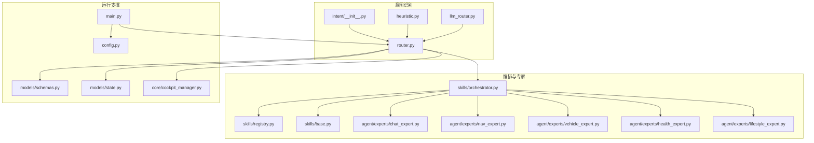
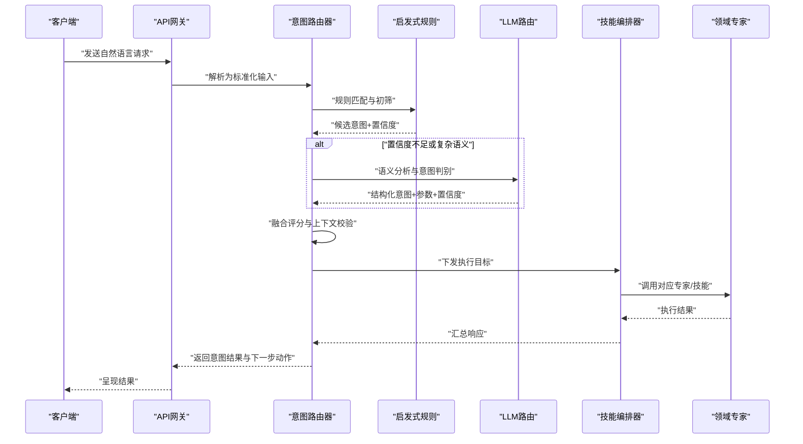
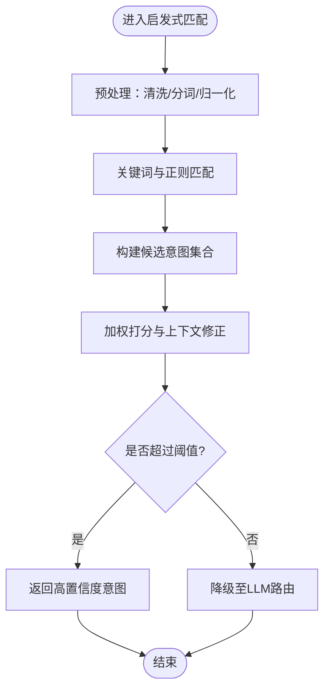
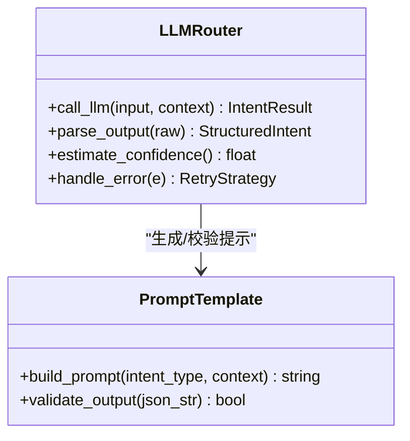
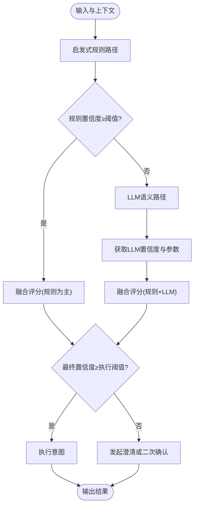
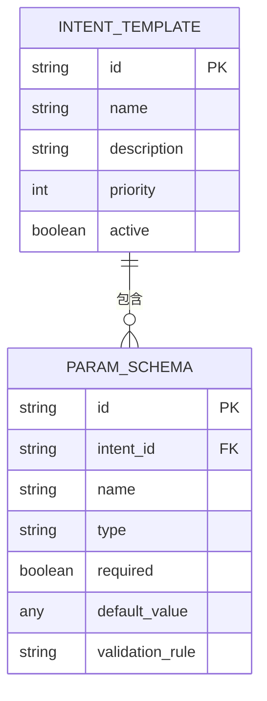
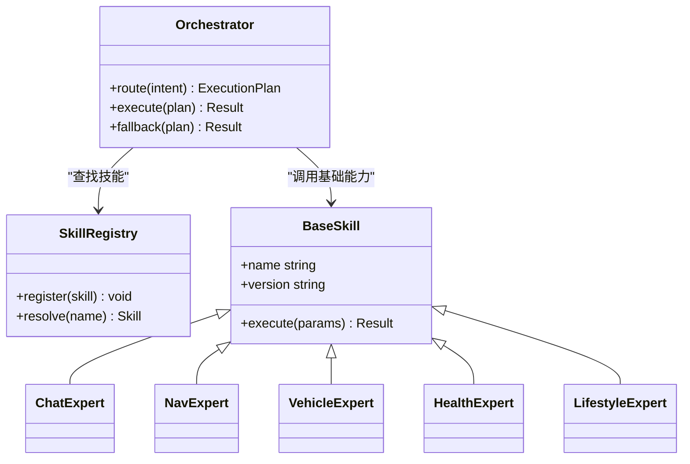
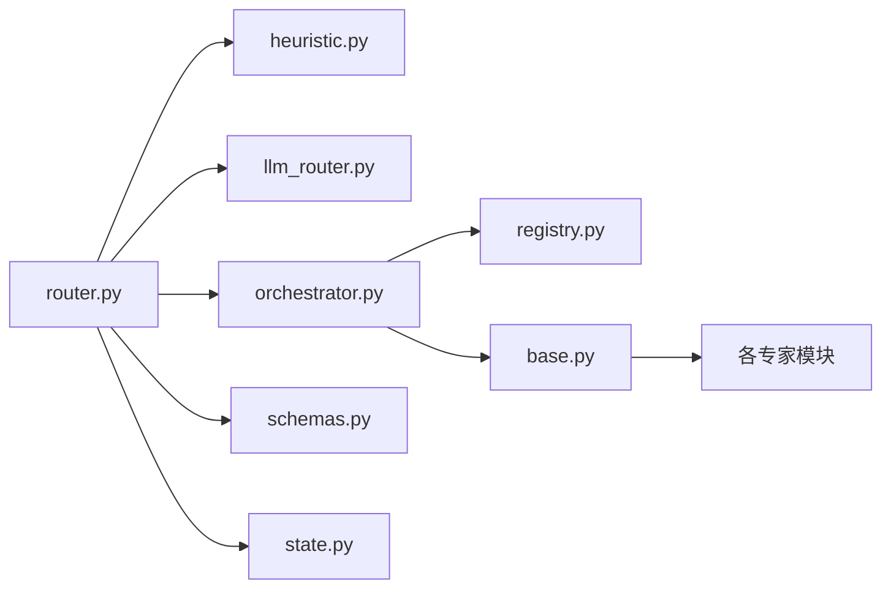

# 意图识别系统

<cite>
**本文引用的文件**   
- [intent/__init__.py](file://backend_design/nexus/intent/__init__.py)
- [heuristic.py](file://backend_design/nexus/intent/heuristic.py)
- [llm_router.py](file://backend_design/nexus/intent/llm_router.py)
- [router.py](file://backend_design/nexus/intent/router.py)
- [main.py](file://backend_design/nexus/main.py)
- [config.py](file://backend_design/nexus/config.py)
- [schemas.py](file://backend_design/nexus/models/schemas.py)
- [state.py](file://backend_design/nexus/models/state.py)
- [cockpit_manager.py](file://backend_design/nexus/core/cockpit_manager.py)
- [orchestrator.py](file://backend_design/nexus/skills/orchestrator.py)
- [registry.py](file://backend_design/nexus/skills/registry.py)
- [base.py](file://backend_design/nexus/skills/base.py)
- [chat_expert.py](file://backend_design/nexus/agent/experts/chat_expert.py)
- [nav_expert.py](file://backend_design/nexus/agent/experts/nav_expert.py)
- [vehicle_expert.py](file://backend_design/nexus/agent/experts/vehicle_expert.py)
- [health_expert.py](file://backend_design/nexus/agent/experts/health_expert.py)
- [lifestyle_expert.py](file://backend_design/nexus/agent/experts/lifestyle_expert.py)
</cite>

## 目录
1. [简介](#简介)
2. [项目结构](#项目结构)
3. [核心组件](#核心组件)
4. [架构总览](#架构总览)
5. [详细组件分析](#详细组件分析)
6. [依赖关系分析](#依赖关系分析)
7. [性能与可观测性](#性能与可观测性)
8. [故障排查指南](#故障排查指南)
9. [结论](#结论)
10. [附录：自定义意图开发指南](#附录自定义意图开发指南)

## 简介
本文件面向NexusCockpit的“意图识别系统”，聚焦于如何结合启发式规则与大模型（LLM）路由策略，实现高精度的用户意图理解。文档覆盖以下关键主题：
- 意图分类算法：规则匹配、语义分析与上下文理解的协同机制
- 路由器决策流程：从输入到最终执行目标的端到端路径
- 意图模板定义、参数提取与置信度评估
- 自定义意图类型的开发与测试方法
- 准确率优化、误识别处理与性能监控的实现细节

## 项目结构
意图识别相关代码位于 backend_design/nexus/intent 目录，并与技能编排、专家代理、配置与数据模型等模块紧密协作。整体结构如下：
- intent：意图识别核心（启发式、LLM路由、统一入口）
- agent/experts：领域专家（导航、车辆、健康、生活方式、聊天等）
- skills：技能注册与编排（用于将意图映射到具体能力）
- models：数据模式与状态管理
- core：运行时上下文与外部服务集成
- config：配置项加载与默认值

图表来源
- [intent/__init__.py](file://backend_design/nexus/intent/__init__.py)
- [heuristic.py](file://backend_design/nexus/intent/heuristic.py)
- [llm_router.py](file://backend_design/nexus/intent/llm_router.py)
- [router.py](file://backend_design/nexus/intent/router.py)
- [orchestrator.py](file://backend_design/nexus/skills/orchestrator.py)
- [registry.py](file://backend_design/nexus/skills/registry.py)
- [base.py](file://backend_design/nexus/skills/base.py)
- [chat_expert.py](file://backend_design/nexus/agent/experts/chat_expert.py)
- [nav_expert.py](file://backend_design/nexus/agent/experts/nav_expert.py)
- [vehicle_expert.py](file://backend_design/nexus/agent/experts/vehicle_expert.py)
- [health_expert.py](file://backend_design/nexus/agent/experts/health_expert.py)
- [lifestyle_expert.py](file://backend_design/nexus/agent/experts/lifestyle_expert.py)
- [main.py](file://backend_design/nexus/main.py)
- [config.py](file://backend_design/nexus/config.py)
- [schemas.py](file://backend_design/nexus/models/schemas.py)
- [state.py](file://backend_design/nexus/models/state.py)
- [cockpit_manager.py](file://backend_design/nexus/core/cockpit_manager.py)

章节来源
- [intent/__init__.py](file://backend_design/nexus/intent/__init__.py)
- [heuristic.py](file://backend_design/nexus/intent/heuristic.py)
- [llm_router.py](file://backend_design/nexus/intent/llm_router.py)
- [router.py](file://backend_design/nexus/intent/router.py)
- [main.py](file://backend_design/nexus/main.py)
- [config.py](file://backend_design/nexus/config.py)
- [schemas.py](file://backend_design/nexus/models/schemas.py)
- [state.py](file://backend_design/nexus/models/state.py)
- [cockpit_manager.py](file://backend_design/nexus/core/cockpit_manager.py)
- [orchestrator.py](file://backend_design/nexus/skills/orchestrator.py)
- [registry.py](file://backend_design/nexus/skills/registry.py)
- [base.py](file://backend_design/nexus/skills/base.py)
- [chat_expert.py](file://backend_design/nexus/agent/experts/chat_expert.py)
- [nav_expert.py](file://backend_design/nexus/agent/experts/nav_expert.py)
- [vehicle_expert.py](file://backend_design/nexus/agent/experts/vehicle_expert.py)
- [health_expert.py](file://backend_design/nexus/agent/experts/health_expert.py)
- [lifestyle_expert.py](file://backend_design/nexus/agent/experts/lifestyle_expert.py)

## 核心组件
- 启发式规则引擎：基于关键词、正则、短语模板与上下文特征进行快速初筛，输出候选意图及置信度。
- LLM路由：在规则不确定或复杂语义场景下，调用大模型进行语义分析与意图判别，返回结构化意图与参数。
- 统一路由器：协调启发式与LLM两条路径，融合评分、上下文与业务策略，做出最终决策。
- 意图模板与参数提取：通过模板描述约束参数类型、必填性与取值范围，支持多轮澄清与补全。
- 置信度评估：综合规则匹配得分、LLM概率、上下文一致性与历史行为，计算最终置信度并触发不同分支（直接执行、二次确认、澄清）。

章节来源
- [heuristic.py](file://backend_design/nexus/intent/heuristic.py)
- [llm_router.py](file://backend_design/nexus/intent/llm_router.py)
- [router.py](file://backend_design/nexus/intent/router.py)
- [schemas.py](file://backend_design/nexus/models/schemas.py)
- [state.py](file://backend_design/nexus/models/state.py)

## 架构总览
意图识别系统采用“规则优先、LLM兜底”的双通道架构，配合统一的评分与决策层，确保高吞吐与高准确率的平衡。

图表来源
- [router.py](file://backend_design/nexus/intent/router.py)
- [heuristic.py](file://backend_design/nexus/intent/heuristic.py)
- [llm_router.py](file://backend_design/nexus/intent/llm_router.py)
- [orchestrator.py](file://backend_design/nexus/skills/orchestrator.py)
- [chat_expert.py](file://backend_design/nexus/agent/experts/chat_expert.py)
- [nav_expert.py](file://backend_design/nexus/agent/experts/nav_expert.py)
- [vehicle_expert.py](file://backend_design/nexus/agent/experts/vehicle_expert.py)
- [health_expert.py](file://backend_design/nexus/agent/experts/health_expert.py)
- [lifestyle_expert.py](file://backend_design/nexus/agent/experts/lifestyle_expert.py)

## 详细组件分析

### 启发式规则引擎
- 功能要点
  - 关键词与正则匹配：针对高频指令与固定句式建立匹配表
  - 短语模板：支持带占位符的模板，便于参数抽取
  - 上下文特征：结合会话历史、用户偏好、设备状态提升命中率
  - 置信度打分：按命中数量、权重、上下文一致性加权计算
- 复杂度与优化
  - 时间复杂度近似 O(n·k)，n为规则数，k为文本长度；可通过索引化与缓存降低开销
  - 对长文本进行分块与去噪，减少无效匹配
- 错误处理
  - 规则冲突时按优先级与最近使用频率消解
  - 低置信度自动降级至LLM路由

图表来源
- [heuristic.py](file://backend_design/nexus/intent/heuristic.py)

章节来源
- [heuristic.py](file://backend_design/nexus/intent/heuristic.py)

### LLM路由
- 功能要点
  - 语义分析：将自然语言转换为结构化意图表示
  - 参数抽取：依据意图模板与上下文约束，抽取必要参数
  - 置信度估计：提供概率或相对置信度，供路由器融合
  - 容错与重试：网络异常、超时与格式错误的恢复策略
- 提示工程与模板
  - 通过提示模板引导模型输出稳定结构，减少幻觉
  - 结合领域知识增强召回与精度
- 性能考量
  - 并发控制与限流，避免后端过载
  - 结果缓存与短路径复用，降低延迟

图表来源
- [llm_router.py](file://backend_design/nexus/intent/llm_router.py)

章节来源
- [llm_router.py](file://backend_design/nexus/intent/llm_router.py)

### 统一路由器
- 决策流程
  - 接收标准化输入与上下文
  - 先走启发式规则，若置信度达标则直接返回
  - 否则调用LLM路由，得到结构化意图与置信度
  - 融合评分：结合规则得分、LLM置信度、上下文一致性与历史行为
  - 决策分支：直接执行、二次确认、澄清追问
- 上下文理解
  - 维护会话状态与短期记忆，辅助歧义消解
  - 根据用户画像与设备状态调整权重
- 错误与降级
  - LLM不可用时回退到规则路径
  - 规则失败时尝试简化输入或缩短上下文窗口

图表来源
- [router.py](file://backend_design/nexus/intent/router.py)
- [heuristic.py](file://backend_design/nexus/intent/heuristic.py)
- [llm_router.py](file://backend_design/nexus/intent/llm_router.py)
- [state.py](file://backend_design/nexus/models/state.py)

章节来源
- [router.py](file://backend_design/nexus/intent/router.py)
- [state.py](file://backend_design/nexus/models/state.py)

### 意图模板与参数提取
- 模板定义
  - 意图标识、名称、描述、适用场景
  - 参数列表：名称、类型、是否必填、默认值、取值范围、校验规则
  - 示例语句与负例，用于训练与评测
- 参数提取
  - 规则阶段：正则与模板占位符抽取
  - LLM阶段：结构化输出与类型转换
  - 校验与补全：缺失必填参数时触发澄清
- 置信度评估
  - 参数完整度、类型正确率、上下文一致性
  - 与历史相似意图对比，动态调整权重

图表来源
- [schemas.py](file://backend_design/nexus/models/schemas.py)

章节来源
- [schemas.py](file://backend_design/nexus/models/schemas.py)

### 编排与专家
- 编排器负责将意图映射到具体技能或专家，协调多步任务与并行执行
- 专家模块封装领域能力（导航、车辆控制、健康建议、生活方式、聊天），对外暴露统一接口
- 注册中心集中管理技能与专家，支持热插拔与版本管理

图表来源
- [orchestrator.py](file://backend_design/nexus/skills/orchestrator.py)
- [registry.py](file://backend_design/nexus/skills/registry.py)
- [base.py](file://backend_design/nexus/skills/base.py)
- [chat_expert.py](file://backend_design/nexus/agent/experts/chat_expert.py)
- [nav_expert.py](file://backend_design/nexus/agent/experts/nav_expert.py)
- [vehicle_expert.py](file://backend_design/nexus/agent/experts/vehicle_expert.py)
- [health_expert.py](file://backend_design/nexus/agent/experts/health_expert.py)
- [lifestyle_expert.py](file://backend_design/nexus/agent/experts/lifestyle_expert.py)

章节来源
- [orchestrator.py](file://backend_design/nexus/skills/orchestrator.py)
- [registry.py](file://backend_design/nexus/skills/registry.py)
- [base.py](file://backend_design/nexus/skills/base.py)
- [chat_expert.py](file://backend_design/nexus/agent/experts/chat_expert.py)
- [nav_expert.py](file://backend_design/nexus/agent/experts/nav_expert.py)
- [vehicle_expert.py](file://backend_design/nexus/agent/experts/vehicle_expert.py)
- [health_expert.py](file://backend_design/nexus/agent/experts/health_expert.py)
- [lifestyle_expert.py](file://backend_design/nexus/agent/experts/lifestyle_expert.py)

## 依赖关系分析
- 内部依赖
  - 路由器依赖启发式与LLM路由，二者相互补充
  - 编排器依赖注册中心与基础技能抽象，扩展新意图无需改动核心逻辑
  - 数据模型与状态管理贯穿整个流程，保证一致性与可追踪性
- 外部依赖
  - LLM服务：需考虑超时、重试、熔断与降级
  - 设备与车辆接口：由专家模块封装，屏蔽差异
- 潜在循环依赖
  - 通过接口抽象与分层设计避免循环引用
  - 注册中心解耦技能发现与调用

图表来源
- [router.py](file://backend_design/nexus/intent/router.py)
- [heuristic.py](file://backend_design/nexus/intent/heuristic.py)
- [llm_router.py](file://backend_design/nexus/intent/llm_router.py)
- [orchestrator.py](file://backend_design/nexus/skills/orchestrator.py)
- [registry.py](file://backend_design/nexus/skills/registry.py)
- [base.py](file://backend_design/nexus/skills/base.py)
- [schemas.py](file://backend_design/nexus/models/schemas.py)
- [state.py](file://backend_design/nexus/models/state.py)

章节来源
- [router.py](file://backend_design/nexus/intent/router.py)
- [heuristic.py](file://backend_design/nexus/intent/heuristic.py)
- [llm_router.py](file://backend_design/nexus/intent/llm_router.py)
- [orchestrator.py](file://backend_design/nexus/skills/orchestrator.py)
- [registry.py](file://backend_design/nexus/skills/registry.py)
- [base.py](file://backend_design/nexus/skills/base.py)
- [schemas.py](file://backend_design/nexus/models/schemas.py)
- [state.py](file://backend_design/nexus/models/state.py)

## 性能与可观测性
- 性能优化
  - 规则路径优先，减少LLM调用次数
  - 结果缓存：相同或高度相似的输入命中缓存
  - 并发与批处理：对独立子任务并行执行
  - 资源限制：对LLM与服务调用设置超时与限流
- 可观测性
  - 指标采集：意图识别耗时、成功率、降级比例、澄清率
  - 日志记录：关键决策点与参数快照，便于回溯
  - 链路追踪：跨模块的请求ID透传

章节来源
- [main.py](file://backend_design/nexus/main.py)
- [config.py](file://backend_design/nexus/config.py)
- [cockpit_manager.py](file://backend_design/nexus/core/cockpit_manager.py)

## 故障排查指南
- 常见问题
  - 规则误判：检查关键词库与权重，增加负例与边界用例
  - LLM不稳定：查看超时、重试与熔断配置，必要时切换模型或降级
  - 参数缺失：完善模板校验与澄清流程，收集缺失参数分布
  - 上下文不一致：审查会话状态管理与清理策略
- 定位步骤
  - 启用调试日志，捕获输入、中间结果与最终决策
  - 复现问题用例，逐步关闭启发式或LLM路径以隔离根因
  - 对比历史相似案例，验证置信度阈值是否需要调整

章节来源
- [router.py](file://backend_design/nexus/intent/router.py)
- [heuristic.py](file://backend_design/nexus/intent/heuristic.py)
- [llm_router.py](file://backend_design/nexus/intent/llm_router.py)
- [state.py](file://backend_design/nexus/models/state.py)

## 结论
NexusCockpit的意图识别系统通过“规则优先、LLM兜底”的双通道设计与统一路由器，实现了在高吞吐场景下的精准意图理解。借助意图模板、参数提取与置信度评估，系统在易用性与可靠性之间取得良好平衡。持续优化方向包括：扩充规则与模板、改进提示工程、引入更多上下文信号与在线学习机制，以及完善监控与自动化回归测试。

## 附录：自定义意图开发指南
- 新增意图模板
  - 在数据模式中定义意图标识、名称、描述与优先级
  - 为每个参数定义类型、必填性、默认值与校验规则
  - 提供正例与负例语句，用于规则与LLM调优
- 编写启发式规则
  - 添加关键词与正则表达式，明确匹配条件与权重
  - 结合上下文特征（如设备状态、用户偏好）提升命中率
  - 设置合理的置信度阈值，避免过度自信
- 配置LLM路由
  - 设计提示模板，约束输出结构与字段
  - 指定模型参数（温度、最大令牌数等）与重试策略
  - 增加输出校验与错误恢复逻辑
- 注册与编排
  - 在注册中心登记新意图对应的技能或专家
  - 在编排器中定义执行计划与回退策略
- 测试方法
  - 单元测试：覆盖规则匹配、参数抽取与校验
  - 集成测试：端到端验证从输入到执行的完整链路
  - A/B测试：对比规则路径与LLM路径的准确率与延迟
  - 回归测试：定期用真实语料集评估指标变化
- 监控与优化
  - 采集关键指标：识别耗时、成功率、降级比例、澄清率
  - 分析误识别样本，迭代规则与提示模板
  - 动态调整置信度阈值与权重，保持系统稳定性

章节来源
- [schemas.py](file://backend_design/nexus/models/schemas.py)
- [heuristic.py](file://backend_design/nexus/intent/heuristic.py)
- [llm_router.py](file://backend_design/nexus/intent/llm_router.py)
- [registry.py](file://backend_design/nexus/skills/registry.py)
- [orchestrator.py](file://backend_design/nexus/skills/orchestrator.py)
- [base.py](file://backend_design/nexus/skills/base.py)