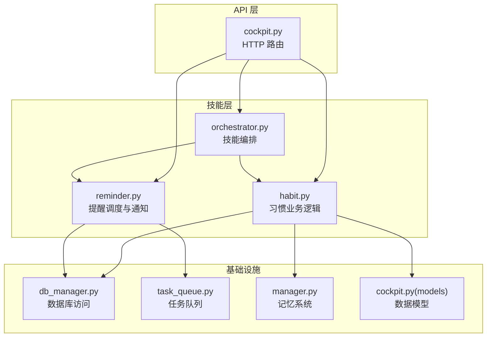
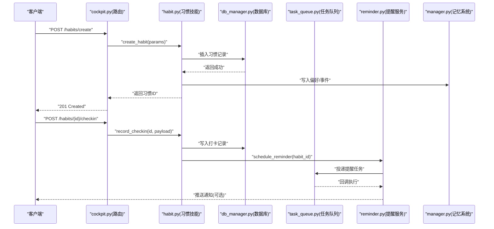
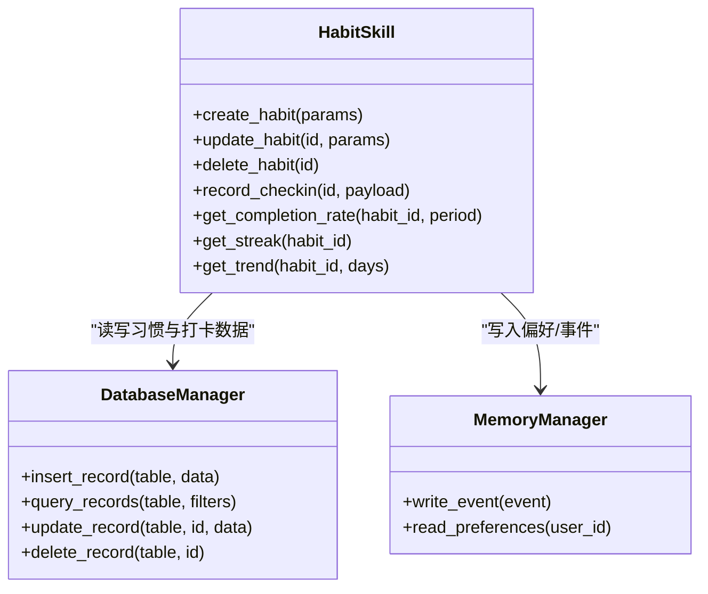
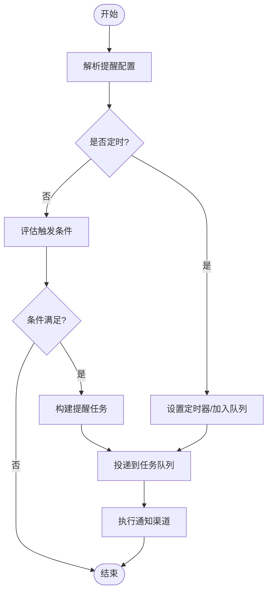
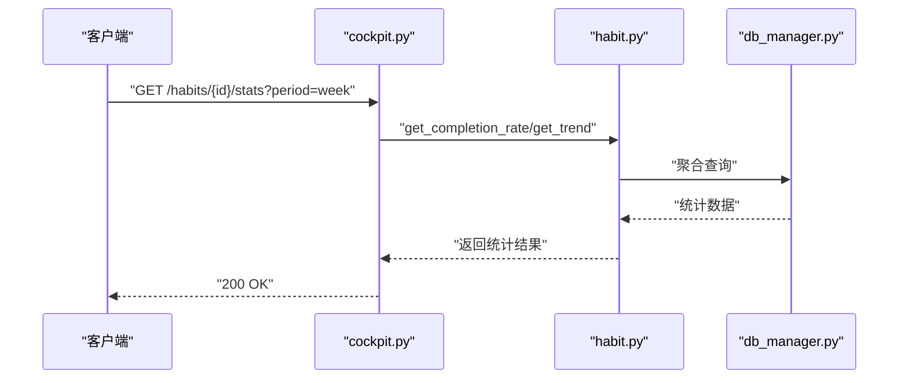
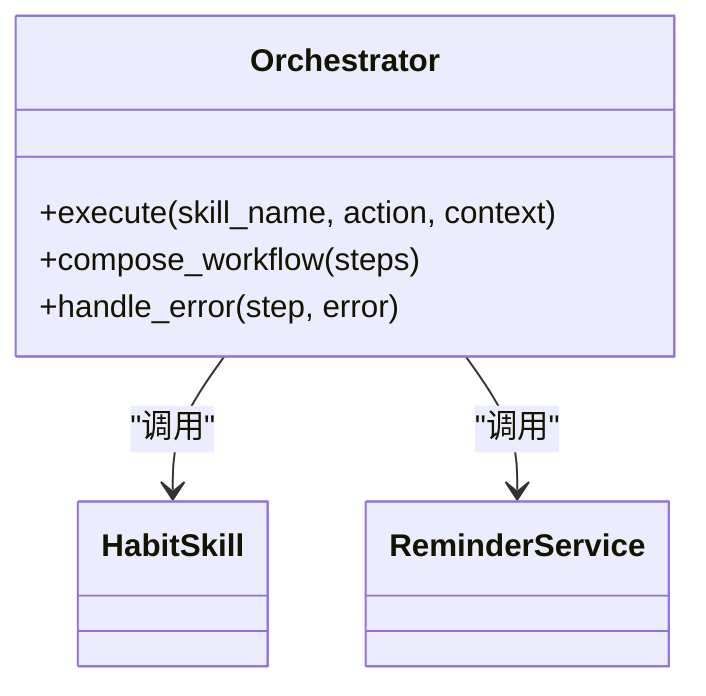
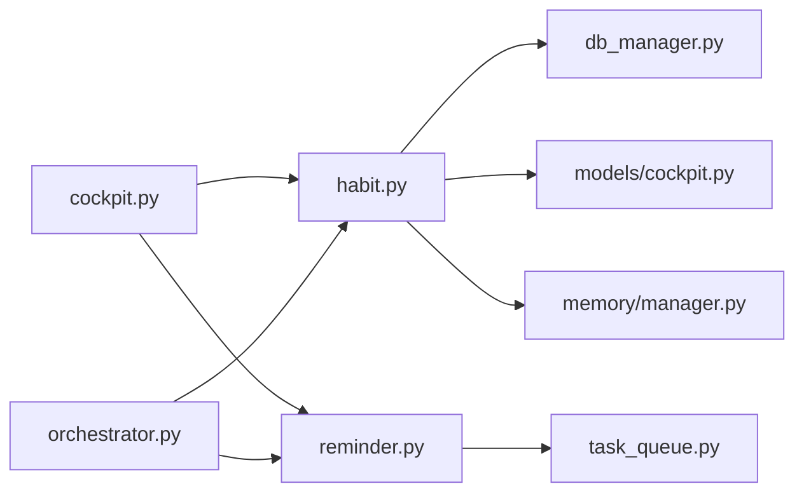

# 习惯养成技能

<cite>
**本文引用的文件**   
- [backend_design/nexus/skills/habit.py](file://backend_design/nexus/skills/habit.py)
- [backend_design/nexus/skills/reminder.py](file://backend_design/nexus/skills/reminder.py)
- [backend_design/nexus/skills/orchestrator.py](file://backend_design/nexus/skills/orchestrator.py)
- [backend_design/nexus/api/routes/cockpit.py](file://backend_design/nexus/api/routes/cockpit.py)
- [backend_design/nexus/core/db_manager.py](file://backend_design/nexus/core/db_manager.py)
- [backend_design/nexus/memory/manager.py](file://backend_design/nexus/memory/manager.py)
- [backend_design/nexus/models/cockpit.py](file://backend_design/nexus/models/cockpit.py)
- [backend_design/nexus/middleware/task_queue.py](file://backend_design/nexus/middleware/task_queue.py)
</cite>

## 目录
1. [简介](#简介)
2. [项目结构](#项目结构)
3. [核心组件](#核心组件)
4. [架构总览](#架构总览)
5. [详细组件分析](#详细组件分析)
6. [依赖关系分析](#依赖关系分析)
7. [性能考虑](#性能考虑)
8. [故障排查指南](#故障排查指南)
9. [结论](#结论)
10. [附录](#附录) 

## 简介
本文件为 NexusCockpit 的“习惯养成”技能提供完整使用文档，覆盖以下能力：
- 习惯创建、进度记录与完成状态管理
- 统计与分析：完成率、连续打卡、趋势分析
- 提醒机制：定时提醒、条件触发、多渠道通知
- API 参考：习惯 CRUD、统计查询、配置参数
- 实际使用示例、错误处理策略与性能优化建议
- 与记忆系统的集成方式与数据持久化机制

## 项目结构
习惯养成技能位于后端 skills 层，通过 cockpit API 暴露接口，并借助数据库与任务队列实现持久化与异步执行。关键路径如下：
- 技能实现：skills/habit.py
- 提醒服务：skills/reminder.py
- 编排器：skills/orchestrator.py
- API 路由：api/routes/cockpit.py
- 数据库访问：core/db_manager.py
- 记忆系统：memory/manager.py
- 模型定义：models/cockpit.py
- 任务队列：middleware/task_queue.py

**图表来源** 
- [backend_design/nexus/api/routes/cockpit.py](file://backend_design/nexus/api/routes/cockpit.py)
- [backend_design/nexus/skills/habit.py](file://backend_design/nexus/skills/habit.py)
- [backend_design/nexus/skills/reminder.py](file://backend_design/nexus/skills/reminder.py)
- [backend_design/nexus/skills/orchestrator.py](file://backend_design/nexus/skills/orchestrator.py)
- [backend_design/nexus/core/db_manager.py](file://backend_design/nexus/core/db_manager.py)
- [backend_design/nexus/middleware/task_queue.py](file://backend_design/nexus/middleware/task_queue.py)
- [backend_design/nexus/memory/manager.py](file://backend_design/nexus/memory/manager.py)
- [backend_design/nexus/models/cockpit.py](file://backend_design/nexus/models/cockpit.py)

**章节来源**
- [backend_design/nexus/skills/habit.py](file://backend_design/nexus/skills/habit.py)
- [backend_design/nexus/skills/reminder.py](file://backend_design/nexus/skills/reminder.py)
- [backend_design/nexus/skills/orchestrator.py](file://backend_design/nexus/skills/orchestrator.py)
- [backend_design/nexus/api/routes/cockpit.py](file://backend_design/nexus/api/routes/cockpit.py)
- [backend_design/nexus/core/db_manager.py](file://backend_design/nexus/core/db_manager.py)
- [backend_design/nexus/memory/manager.py](file://backend_design/nexus/memory/manager.py)
- [backend_design/nexus/models/cockpit.py](file://backend_design/nexus/models/cockpit.py)
- [backend_design/nexus/middleware/task_queue.py](file://backend_design/nexus/middleware/task_queue.py)

## 核心组件
- 习惯技能（habit.py）
  - 负责习惯的创建、更新、删除、打卡记录、完成状态判定与统计计算
  - 与数据库交互进行持久化，并与记忆系统同步关键事件
- 提醒服务（reminder.py）
  - 支持定时提醒与条件触发，将提醒任务投递到任务队列，并通过多渠道发送通知
- 编排器（orchestrator.py）
  - 协调各子技能，统一入口，处理跨技能的调用链路与上下文传递
- API 路由（cockpit.py）
  - 暴露 RESTful 接口，接收请求、校验参数、转发至对应技能方法
- 数据库管理器（db_manager.py）
  - 封装数据库连接、事务、读写操作，保障一致性与并发安全
- 任务队列（task_queue.py）
  - 异步执行耗时任务（如批量统计、通知发送），提高响应性
- 记忆系统（manager.py）
  - 持久化用户偏好、历史事件等，供分析与个性化推荐使用
- 数据模型（models/cockpit.py）
  - 定义习惯、打卡记录、统计结果等数据结构

**章节来源**
- [backend_design/nexus/skills/habit.py](file://backend_design/nexus/skills/habit.py)
- [backend_design/nexus/skills/reminder.py](file://backend_design/nexus/skills/reminder.py)
- [backend_design/nexus/skills/orchestrator.py](file://backend_design/nexus/skills/orchestrator.py)
- [backend_design/nexus/api/routes/cockpit.py](file://backend_design/nexus/api/routes/cockpit.py)
- [backend_design/nexus/core/db_manager.py](file://backend_design/nexus/core/db_manager.py)
- [backend_design/nexus/middleware/task_queue.py](file://backend_design/nexus/middleware/task_queue.py)
- [backend_design/nexus/memory/manager.py](file://backend_design/nexus/memory/manager.py)
- [backend_design/nexus/models/cockpit.py](file://backend_design/nexus/models/cockpit.py)

## 架构总览
下图展示了从 HTTP 请求到数据持久化与提醒触发的端到端流程。

**图表来源** 
- [backend_design/nexus/api/routes/cockpit.py](file://backend_design/nexus/api/routes/cockpit.py)
- [backend_design/nexus/skills/habit.py](file://backend_design/nexus/skills/habit.py)
- [backend_design/nexus/core/db_manager.py](file://backend_design/nexus/core/db_manager.py)
- [backend_design/nexus/middleware/task_queue.py](file://backend_design/nexus/middleware/task_queue.py)
- [backend_design/nexus/skills/reminder.py](file://backend_design/nexus/skills/reminder.py)
- [backend_design/nexus/memory/manager.py](file://backend_design/nexus/memory/manager.py)

## 详细组件分析

### 习惯技能（habit.py）
职责与能力：
- 习惯生命周期管理：创建、更新、删除、启用/禁用
- 打卡记录：按日/周/月维度记录完成状态
- 完成状态判定：基于规则（如时间窗口、次数阈值）自动判定是否完成
- 统计与分析：
  - 完成率：周期内完成次数/计划次数
  - 连续打卡：最长连续天数/当前连续天数
  - 趋势分析：近 N 天完成率曲线、环比变化
- 与记忆系统集成：将重要里程碑或异常行为写入记忆，用于后续个性化

**图表来源** 
- [backend_design/nexus/skills/habit.py](file://backend_design/nexus/skills/habit.py)
- [backend_design/nexus/core/db_manager.py](file://backend_design/nexus/core/db_manager.py)
- [backend_design/nexus/memory/manager.py](file://backend_design/nexus/memory/manager.py)

**章节来源**
- [backend_design/nexus/skills/habit.py](file://backend_design/nexus/skills/habit.py)
- [backend_design/nexus/core/db_manager.py](file://backend_design/nexus/core/db_manager.py)
- [backend_design/nexus/memory/manager.py](file://backend_design/nexus/memory/manager.py)

### 提醒服务（reminder.py）
能力说明：
- 定时提醒：支持 cron 表达式或固定间隔
- 条件触发：当满足特定条件（如未打卡超过阈值）时触发
- 多渠道通知：站内消息、邮件、短信、推送等
- 任务编排：将提醒任务投递到任务队列，避免阻塞主流程

**图表来源** 
- [backend_design/nexus/skills/reminder.py](file://backend_design/nexus/skills/reminder.py)
- [backend_design/nexus/middleware/task_queue.py](file://backend_design/nexus/middleware/task_queue.py)

**章节来源**
- [backend_design/nexus/skills/reminder.py](file://backend_design/nexus/skills/reminder.py)
- [backend_design/nexus/middleware/task_queue.py](file://backend_design/nexus/middleware/task_queue.py)

### API 路由（cockpit.py）
职责：
- 暴露 RESTful 接口：习惯 CRUD、打卡、统计查询、提醒配置
- 参数校验与错误码映射
- 权限与租户隔离（如有）

**图表来源** 
- [backend_design/nexus/api/routes/cockit.py](file://backend_design/nexus/api/routes/cockpit.py)
- [backend_design/nexus/skills/habit.py](file://backend_design/nexus/skills/habit.py)
- [backend_design/nexus/core/db_manager.py](file://backend_design/nexus/core/db_manager.py)

**章节来源**
- [backend_design/nexus/api/routes/cockpit.py](file://backend_design/nexus/api/routes/cockpit.py)
- [backend_design/nexus/skills/habit.py](file://backend_design/nexus/skills/habit.py)
- [backend_design/nexus/core/db_manager.py](file://backend_design/nexus/core/db_manager.py)

### 编排器（orchestrator.py）
职责：
- 统一入口，协调 habit 与 reminder 等子技能
- 维护调用上下文（用户 ID、租户、会话信息）
- 处理跨技能的事务与补偿逻辑

**图表来源** 
- [backend_design/nexus/skills/orchestrator.py](file://backend_design/nexus/skills/orchestrator.py)
- [backend_design/nexus/skills/habit.py](file://backend_design/nexus/skills/habit.py)
- [backend_design/nexus/skills/reminder.py](file://backend_design/nexus/skills/reminder.py)

**章节来源**
- [backend_design/nexus/skills/orchestrator.py](file://backend_design/nexus/skills/orchestrator.py)
- [backend_design/nexus/skills/habit.py](file://backend_design/nexus/skills/habit.py)
- [backend_design/nexus/skills/reminder.py](file://backend_design/nexus/skills/reminder.py)

## 依赖关系分析
- 低耦合高内聚：API 路由仅做参数校验与转发；具体业务在 habit.py 中实现
- 外部依赖：
  - 数据库：通过 db_manager.py 抽象，便于替换存储后端
  - 任务队列：通过 task_queue.py 解耦提醒执行
  - 记忆系统：通过 manager.py 提供偏好与事件存取
- 潜在循环依赖：应避免 habit 直接导入 orchestrator，改为由 orchestrator 调用 habit

**图表来源** 
- [backend_design/nexus/api/routes/cockpit.py](file://backend_design/nexus/api/routes/cockpit.py)
- [backend_design/nexus/skills/habit.py](file://backend_design/nexus/skills/habit.py)
- [backend_design/nexus/skills/reminder.py](file://backend_design/nexus/skills/reminder.py)
- [backend_design/nexus/core/db_manager.py](file://backend_design/nexus/core/db_manager.py)
- [backend_design/nexus/models/cockpit.py](file://backend_design/nexus/models/cockpit.py)
- [backend_design/nexus/memory/manager.py](file://backend_design/nexus/memory/manager.py)
- [backend_design/nexus/middleware/task_queue.py](file://backend_design/nexus/middleware/task_queue.py)
- [backend_design/nexus/skills/orchestrator.py](file://backend_design/nexus/skills/orchestrator.py)

**章节来源**
- [backend_design/nexus/api/routes/cockpit.py](file://backend_design/nexus/api/routes/cockpit.py)
- [backend_design/nexus/skills/habit.py](file://backend_design/nexus/skills/habit.py)
- [backend_design/nexus/skills/reminder.py](file://backend_design/nexus/skills/reminder.py)
- [backend_design/nexus/core/db_manager.py](file://backend_design/nexus/core/db_manager.py)
- [backend_design/nexus/models/cockpit.py](file://backend_design/nexus/models/cockpit.py)
- [backend_design/nexus/memory/manager.py](file://backend_design/nexus/memory/manager.py)
- [backend_design/nexus/middleware/task_queue.py](file://backend_design/nexus/middleware/task_queue.py)
- [backend_design/nexus/skills/orchestrator.py](file://backend_design/nexus/skills/orchestrator.py)

## 性能考虑
- 批量统计与趋势分析：
  - 使用数据库聚合查询减少应用层计算
  - 对高频查询字段建立索引（如 habit_id、date）
- 异步化：
  - 提醒任务与通知发送走任务队列，避免阻塞主线程
- 缓存：
  - 对热点统计结果短期缓存（如最近 7 天完成率）
- 幂等性：
  - 打卡接口需支持幂等，防止重复提交导致数据不一致

[本节为通用指导，不直接分析具体文件]

## 故障排查指南
常见问题与定位步骤：
- 打卡失败
  - 检查数据库连接与事务回滚日志
  - 确认 habit_id 是否存在且处于启用状态
- 提醒未触发
  - 查看任务队列消费日志与重试策略
  - 验证提醒配置（cron/条件）是否正确
- 统计结果异常
  - 核对时间窗口与过滤条件
  - 检查是否有脏数据或缺失打卡记录

**章节来源**
- [backend_design/nexus/core/db_manager.py](file://backend_design/nexus/core/db_manager.py)
- [backend_design/nexus/middleware/task_queue.py](file://backend_design/nexus/middleware/task_queue.py)
- [backend_design/nexus/skills/habit.py](file://backend_design/nexus/skills/habit.py)
- [backend_design/nexus/skills/reminder.py](file://backend_design/nexus/skills/reminder.py)

## 结论
习惯养成技能以清晰的分层架构实现了习惯全生命周期管理与统计分析，结合提醒服务与任务队列提供了良好的用户体验与可扩展性。通过合理的索引与异步化策略，可在高并发场景下保持稳定性能。与记忆系统的集成进一步增强了个性化能力。

[本节为总结，不直接分析具体文件]

## 附录

### API 接口参考
- 习惯管理
  - POST /habits/create
    - 请求体：名称、目标频率、时间窗口、提醒配置等
    - 响应：习惯 ID、创建时间
  - PUT /habits/{id}
    - 请求体：可更新的字段
    - 响应：更新后的习惯信息
  - DELETE /habits/{id}
    - 响应：删除成功
- 打卡记录
  - POST /habits/{id}/checkin
    - 请求体：打卡时间、备注、附件等
    - 响应：打卡记录 ID、完成状态
- 统计查询
  - GET /habits/{id}/stats?period=week|month|year
    - 响应：完成率、连续打卡、趋势数据
- 提醒配置
  - POST /habits/{id}/reminders
    - 请求体：类型（定时/条件）、触发规则、通知渠道
    - 响应：提醒任务 ID

**章节来源**
- [backend_design/nexus/api/routes/cockpit.py](file://backend_design/nexus/api/routes/cockpit.py)
- [backend_design/nexus/skills/habit.py](file://backend_design/nexus/skills/habit.py)
- [backend_design/nexus/skills/reminder.py](file://backend_design/nexus/skills/reminder.py)

### 数据模型概览
- 习惯表
  - 字段：id、名称、频率、时间窗口、状态、创建时间、更新时间
- 打卡记录表
  - 字段：id、habit_id、打卡时间、备注、附件、状态
- 统计结果表（可选）
  - 字段：habit_id、周期、完成率、连续天数、趋势快照

**章节来源**
- [backend_design/nexus/models/cockpit.py](file://backend_design/nexus/models/cockpit.py)

### 与记忆系统集成
- 写入偏好：用户偏好的习惯类型、提醒渠道偏好
- 事件记录：里程碑达成、连续打卡突破、异常中断
- 读取偏好：根据偏好调整提醒策略与内容

**章节来源**
- [backend_design/nexus/memory/manager.py](file://backend_design/nexus/memory/manager.py)
- [backend_design/nexus/skills/habit.py](file://backend_design/nexus/skills/habit.py)