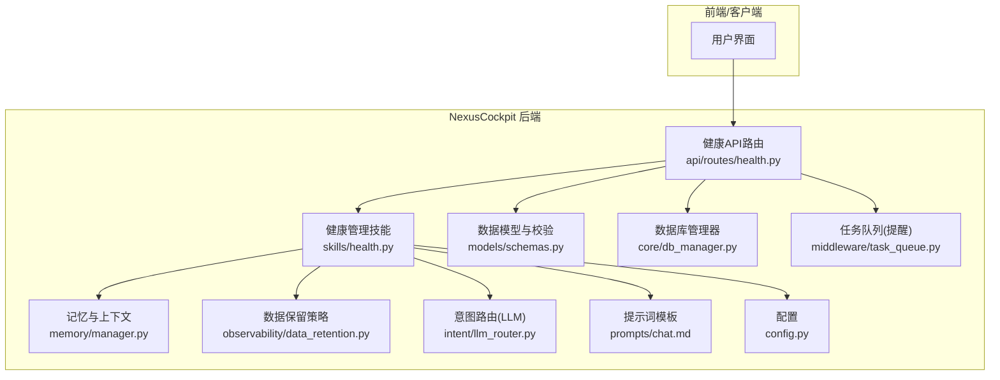
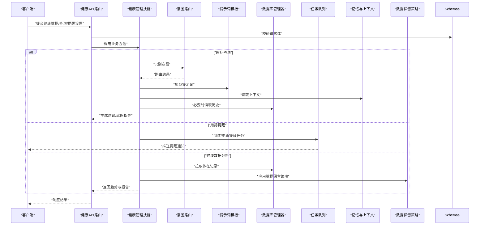
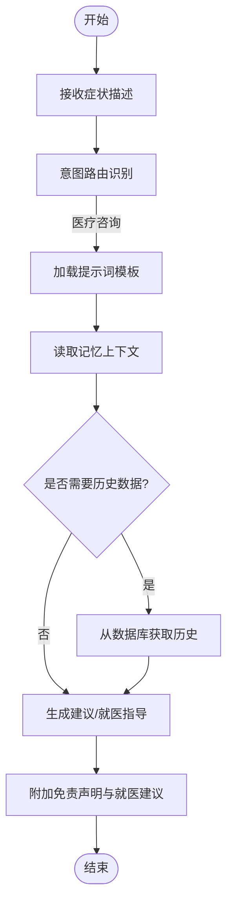
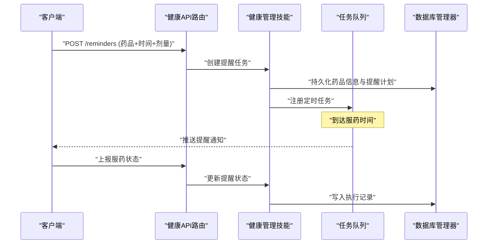
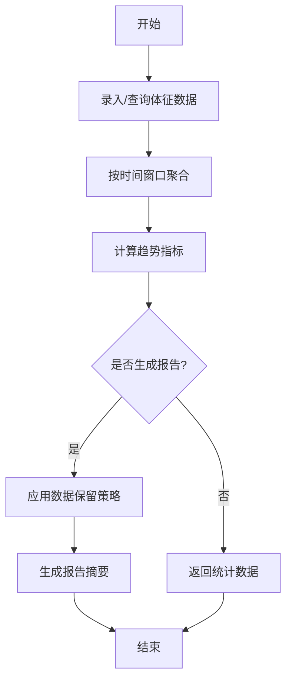
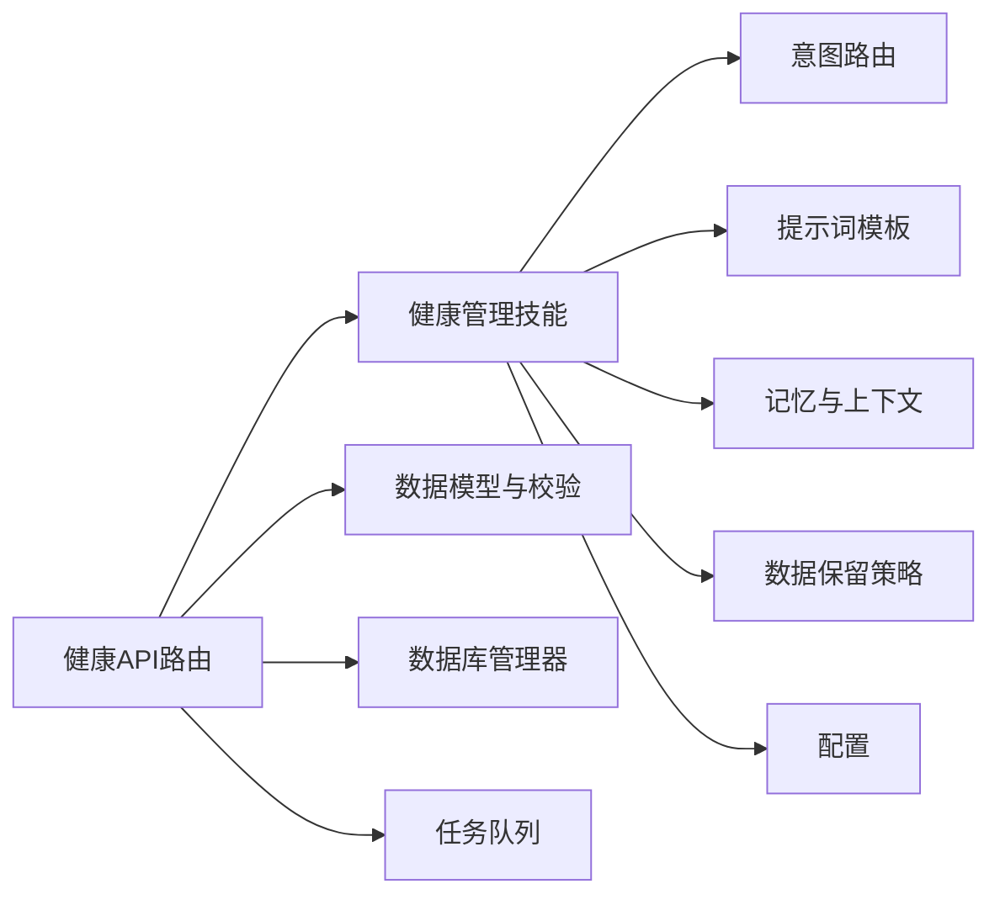

# 健康管理技能

<cite>
**本文引用的文件**   
- [backend_design/nexus/skills/health.py](file://backend_design/nexus/skills/health.py)
- [backend_design/nexus/api/routes/health.py](file://backend_design/nexus/api/routes/health.py)
- [backend_design/nexus/models/schemas.py](file://backend_design/nexus/models/schemas.py)
- [backend_design/nexus/core/db_manager.py](file://backend_design/nexus/core/db_manager.py)
- [backend_design/nexus/core/exceptions.py](file://backend_design/nexus/core/exceptions.py)
- [backend_design/nexus/middleware/task_queue.py](file://backend_design/nexus/middleware/task_queue.py)
- [backend_design/nexus/memory/manager.py](file://backend_design/nexus/memory/manager.py)
- [backend_design/nexus/observability/data_retention.py](file://backend_design/nexus/observability/data_retention.py)
- [backend_design/nexus/intent/llm_router.py](file://backend_design/nexus/intent/llm_router.py)
- [backend_design/nexus/prompts/chat.md](file://backend_design/nexus/prompts/chat.md)
- [backend_design/nexus/config.py](file://backend_design/nexus/config.py)
</cite>

## 目录
1. [简介](#简介)
2. [项目结构](#项目结构)
3. [核心组件](#核心组件)
4. [架构总览](#架构总览)
5. [详细组件分析](#详细组件分析)
6. [依赖关系分析](#依赖关系分析)
7. [性能考虑](#性能考虑)
8. [故障排查指南](#故障排查指南)
9. [结论](#结论)
10. [附录](#附录)

## 简介
本文件为 NexusCockpit 的“健康管理技能”提供完整使用文档，覆盖以下能力：
- 医疗咨询：症状分析、健康建议与就医指导
- 用药提醒：药品信息管理、服药时间设置与剂量控制
- 健康数据分析：体征记录、趋势分析与健康报告生成
- API 接口参考：健康数据录入、查询统计与提醒管理
- 实际使用示例、隐私保护与合规要求
- 外部医疗服务集成方式与数据安全机制

## 项目结构
健康管理技能位于后端模块中，主要涉及如下路径：
- 技能实现：skills/health.py
- HTTP 路由：api/routes/health.py
- 数据模型与校验：models/schemas.py
- 数据库访问：core/db_manager.py
- 异常定义：core/exceptions.py
- 任务队列（异步提醒）：middleware/task_queue.py
- 记忆与上下文：memory/manager.py
- 数据保留策略：observability/data_retention.py
- 意图路由（LLM 路由）：intent/llm_router.py
- 提示词模板：prompts/chat.md
- 配置项：config.py

图表来源
- [backend_design/nexus/api/routes/health.py](file://backend_design/nexus/api/routes/health.py)
- [backend_design/nexus/skills/health.py](file://backend_design/nexus/skills/health.py)
- [backend_design/nexus/models/schemas.py](file://backend_design/nexus/models/schemas.py)
- [backend_design/nexus/core/db_manager.py](file://backend_design/nexus/core/db_manager.py)
- [backend_design/nexus/middleware/task_queue.py](file://backend_design/nexus/middleware/task_queue.py)
- [backend_design/nexus/memory/manager.py](file://backend_design/nexus/memory/manager.py)
- [backend_design/nexus/observability/data_retention.py](file://backend_design/nexus/observability/data_retention.py)
- [backend_design/nexus/intent/llm_router.py](file://backend_design/nexus/intent/llm_router.py)
- [backend_design/nexus/prompts/chat.md](file://backend_design/nexus/prompts/chat.md)
- [backend_design/nexus/config.py](file://backend_design/nexus/config.py)

章节来源
- [backend_design/nexus/skills/health.py](file://backend_design/nexus/skills/health.py)
- [backend_design/nexus/api/routes/health.py](file://backend_design/nexus/api/routes/health.py)
- [backend_design/nexus/models/schemas.py](file://backend_design/nexus/models/schemas.py)
- [backend_design/nexus/core/db_manager.py](file://backend_design/nexus/core/db_manager.py)
- [backend_design/nexus/middleware/task_queue.py](file://backend_design/nexus/middleware/task_queue.py)
- [backend_design/nexus/memory/manager.py](file://backend_design/nexus/memory/manager.py)
- [backend_design/nexus/observability/data_retention.py](file://backend_design/nexus/observability/data_retention.py)
- [backend_design/nexus/intent/llm_router.py](file://backend_design/nexus/intent/llm_router.py)
- [backend_design/nexus/prompts/chat.md](file://backend_design/nexus/prompts/chat.md)
- [backend_design/nexus/config.py](file://backend_design/nexus/config.py)

## 核心组件
- 健康管理技能（skills/health.py）
  - 职责：封装医疗咨询、用药提醒与健康数据分析的业务逻辑；协调意图路由、提示词、记忆与数据保留策略。
  - 关键能力：
    - 症状分析与就医建议：结合 LLM 路由与提示词模板进行推理与回答
    - 用药提醒：基于任务队列定时触发提醒，支持药品信息、时间与剂量管理
    - 健康数据分析：读取体征记录，计算趋势并生成报告摘要
- 健康API路由（api/routes/health.py）
  - 职责：暴露 RESTful 接口，负责请求解析、参数校验、调用技能层与返回结果
- 数据模型与校验（models/schemas.py）
  - 职责：定义健康数据、用药提醒、报告等输入输出结构的 Pydantic 模型，确保一致性
- 数据库管理器（core/db_manager.py）
  - 职责：统一数据库连接与读写操作，供技能与路由持久化健康数据
- 任务队列（middleware/task_queue.py）
  - 职责：承载用药提醒等异步任务，保障可靠性与可重试
- 记忆与上下文（memory/manager.py）
  - 职责：维护会话级或用户级健康上下文，辅助连续对话与个性化建议
- 数据保留策略（observability/data_retention.py）
  - 职责：按策略清理过期健康数据，满足合规与存储成本优化
- 意图路由（intent/llm_router.py）
  - 职责：将自然语言意图分发到合适的处理流程（如医疗咨询、提醒管理等）
- 提示词模板（prompts/chat.md）
  - 职责：为医疗咨询场景提供结构化提示词，保证回答质量与合规性
- 配置（config.py）
  - 职责：集中管理健康相关开关、阈值、超时、队列大小等运行参数

章节来源
- [backend_design/nexus/skills/health.py](file://backend_design/nexus/skills/health.py)
- [backend_design/nexus/api/routes/health.py](file://backend_design/nexus/api/routes/health.py)
- [backend_design/nexus/models/schemas.py](file://backend_design/nexus/models/schemas.py)
- [backend_design/nexus/core/db_manager.py](file://backend_design/nexus/core/db_manager.py)
- [backend_design/nexus/middleware/task_queue.py](file://backend_design/nexus/middleware/task_queue.py)
- [backend_design/nexus/memory/manager.py](file://backend_design/nexus/memory/manager.py)
- [backend_design/nexus/observability/data_retention.py](file://backend_design/nexus/observability/data_retention.py)
- [backend_design/nexus/intent/llm_router.py](file://backend_design/nexus/intent/llm_router.py)
- [backend_design/nexus/prompts/chat.md](file://backend_design/nexus/prompts/chat.md)
- [backend_design/nexus/config.py](file://backend_design/nexus/config.py)

## 架构总览
下图展示从客户端到技能层的端到端调用链，以及数据与任务的流转。

图表来源
- [backend_design/nexus/api/routes/health.py](file://backend_design/nexus/api/routes/health.py)
- [backend_design/nexus/skills/health.py](file://backend_design/nexus/skills/health.py)
- [backend_design/nexus/intent/llm_router.py](file://backend_design/nexus/intent/llm_router.py)
- [backend_design/nexus/prompts/chat.md](file://backend_design/nexus/prompts/chat.md)
- [backend_design/nexus/core/db_manager.py](file://backend_design/nexus/core/db_manager.py)
- [backend_design/nexus/middleware/task_queue.py](file://backend_design/nexus/middleware/task_queue.py)
- [backend_design/nexus/memory/manager.py](file://backend_design/nexus/memory/manager.py)
- [backend_design/nexus/observability/data_retention.py](file://backend_design/nexus/observability/data_retention.py)

## 详细组件分析

### 医疗咨询功能
- 能力说明
  - 症状分析：根据用户描述的症状，结合历史上下文与知识库提示词，给出初步分析与风险提示
  - 健康建议：提供生活方式、饮食运动等非处方建议
  - 就医指导：在高风险情况下引导就医，明确警示语与免责声明
- 关键流程
  - 接收用户输入后，通过意图路由判断是否为医疗咨询
  - 加载提示词模板，结合记忆上下文与必要历史数据，生成结构化回答
  - 对敏感或高风险内容附加免责声明与就医建议
- 安全与合规
  - 所有建议均标注“非诊断、非治疗”，必要时强烈建议线下就医
  - 遵循最小数据原则，仅保留必要的上下文用于提升体验

图表来源
- [backend_design/nexus/intent/llm_router.py](file://backend_design/nexus/intent/llm_router.py)
- [backend_design/nexus/prompts/chat.md](file://backend_design/nexus/prompts/chat.md)
- [backend_design/nexus/memory/manager.py](file://backend_design/nexus/memory/manager.py)
- [backend_design/nexus/core/db_manager.py](file://backend_design/nexus/core/db_manager.py)

章节来源
- [backend_design/nexus/skills/health.py](file://backend_design/nexus/skills/health.py)
- [backend_design/nexus/intent/llm_router.py](file://backend_design/nexus/intent/llm_router.py)
- [backend_design/nexus/prompts/chat.md](file://backend_design/nexus/prompts/chat.md)
- [backend_design/nexus/memory/manager.py](file://backend_design/nexus/memory/manager.py)
- [backend_design/nexus/core/db_manager.py](file://backend_design/nexus/core/db_manager.py)

### 用药提醒系统
- 能力说明
  - 药品信息管理：登记药品名称、规格、用法用量、注意事项等
  - 服药时间设置：支持单次、重复周期、自定义时间段
  - 剂量控制：校验每日最大剂量与间隔，防止过量
- 关键流程
  - 通过 API 创建或更新提醒任务
  - 任务队列按调度规则触发提醒，推送通知给用户
  - 支持状态跟踪（未服、已服、漏服）与补提醒策略
- 错误处理
  - 剂量冲突、时间冲突时返回明确错误码与修复建议
  - 任务失败自动重试与告警

图表来源
- [backend_design/nexus/api/routes/health.py](file://backend_design/nexus/api/routes/health.py)
- [backend_design/nexus/skills/health.py](file://backend_design/nexus/skills/health.py)
- [backend_design/nexus/middleware/task_queue.py](file://backend_design/nexus/middleware/task_queue.py)
- [backend_design/nexus/core/db_manager.py](file://backend_design/nexus/core/db_manager.py)

章节来源
- [backend_design/nexus/skills/health.py](file://backend_design/nexus/skills/health.py)
- [backend_design/nexus/api/routes/health.py](file://backend_design/nexus/api/routes/health.py)
- [backend_design/nexus/middleware/task_queue.py](file://backend_design/nexus/middleware/task_queue.py)
- [backend_design/nexus/core/db_manager.py](file://backend_design/nexus/core/db_manager.py)

### 健康数据分析能力
- 能力说明
  - 体征记录：血压、心率、血糖、体重、睡眠时长等
  - 趋势分析：按日/周/月维度计算均值、峰值、变化率
  - 健康报告：生成可读摘要，包含异常指标提示与建议
- 关键流程
  - 批量录入或单条录入体征数据
  - 查询统计接口返回聚合结果与可视化所需序列
  - 报告生成前应用数据保留策略，剔除过期数据

图表来源
- [backend_design/nexus/api/routes/health.py](file://backend_design/nexus/api/routes/health.py)
- [backend_design/nexus/skills/health.py](file://backend_design/nexus/skills/health.py)
- [backend_design/nexus/core/db_manager.py](file://backend_design/nexus/core/db_manager.py)
- [backend_design/nexus/observability/data_retention.py](file://backend_design/nexus/observability/data_retention.py)

章节来源
- [backend_design/nexus/skills/health.py](file://backend_design/nexus/skills/health.py)
- [backend_design/nexus/api/routes/health.py](file://backend_design/nexus/api/routes/health.py)
- [backend_design/nexus/core/db_manager.py](file://backend_design/nexus/core/db_manager.py)
- [backend_design/nexus/observability/data_retention.py](file://backend_design/nexus/observability/data_retention.py)

### API 接口参考
以下为健康管理技能对外提供的典型接口类别与字段约定（以 models/schemas.py 中的模型为准）。具体路径与HTTP方法请参考 api/routes/health.py。

- 健康数据录入
  - 用途：新增或批量新增体征记录
  - 关键字段：类型（如血压/心率/血糖/体重/睡眠）、数值、单位、时间戳、备注
  - 校验：必填字段、范围检查、时间格式
- 健康数据查询与统计
  - 用途：按时间范围、类型筛选，返回序列与聚合指标
  - 关键字段：起止时间、数据类型、聚合粒度（日/周/月）
  - 返回：列表、均值、最大值、最小值、变化率
- 用药提醒管理
  - 创建提醒：药品名、规格、剂量、频次、开始/结束时间、注意事项
  - 更新提醒：修改时间或剂量，冲突检测
  - 删除提醒：软删除或硬删除策略
  - 上报服药状态：已服/漏服/延迟，附带备注
- 医疗咨询
  - 输入：症状描述、既往史（可选）、当前用药（可选）
  - 输出：分析要点、风险提示、就医建议、免责声明
- 错误码与异常
  - 参考 core/exceptions.py 定义的异常类型与消息规范

章节来源
- [backend_design/nexus/api/routes/health.py](file://backend_design/nexus/api/routes/health.py)
- [backend_design/nexus/models/schemas.py](file://backend_design/nexus/models/schemas.py)
- [backend_design/nexus/core/exceptions.py](file://backend_design/nexus/core/exceptions.py)

### 实际使用示例
- 症状分析
  - 步骤：调用医疗咨询接口，传入症状描述与必要上下文
  - 预期：返回分析要点、风险提示与就医建议，并附带免责声明
- 用药提醒
  - 步骤：创建提醒任务，等待触发；收到通知后上报服药状态
  - 预期：状态同步至数据库，支持后续统计与漏服提醒
- 健康报告
  - 步骤：选择时间范围与数据类型，请求统计与报告
  - 预期：返回趋势指标与可读摘要，突出异常指标

[本节为概念性示例，不直接分析具体文件]

### 隐私保护措施与合规要求
- 数据最小化：仅收集与提供服务必需的健康数据
- 加密传输与存储：HTTPS 传输，敏感字段加密存储
- 访问控制：基于租户/用户的鉴权与权限隔离
- 数据保留：按策略定期清理过期数据，降低泄露风险
- 审计与日志：记录关键操作，避免记录敏感明文
- 合规：遵循个人信息保护与医疗健康数据相关法规

章节来源
- [backend_design/nexus/observability/data_retention.py](file://backend_design/nexus/observability/data_retention.py)
- [backend_design/nexus/config.py](file://backend_design/nexus/config.py)

### 与外部医疗服务的集成方式与数据安全机制
- 集成方式
  - 通过 API 网关或 MCP 网关对接第三方医疗机构服务
  - 采用标准化协议与幂等设计，支持重试与回滚
- 数据安全
  - 双向认证与令牌轮换
  - 数据脱敏与最小可见范围
  - 传输链路加密与签名校验
  - 审计追踪与异常告警

章节来源
- [backend_design/nexus/mcp/gateway.py](file://backend_design/nexus/mcp/gateway.py)
- [backend_design/nexus/config.py](file://backend_design/nexus/config.py)

## 依赖关系分析

图表来源
- [backend_design/nexus/api/routes/health.py](file://backend_design/nexus/api/routes/health.py)
- [backend_design/nexus/skills/health.py](file://backend_design/nexus/skills/health.py)
- [backend_design/nexus/models/schemas.py](file://backend_design/nexus/models/schemas.py)
- [backend_design/nexus/core/db_manager.py](file://backend_design/nexus/core/db_manager.py)
- [backend_design/nexus/middleware/task_queue.py](file://backend_design/nexus/middleware/task_queue.py)
- [backend_design/nexus/intent/llm_router.py](file://backend_design/nexus/intent/llm_router.py)
- [backend_design/nexus/prompts/chat.md](file://backend_design/nexus/prompts/chat.md)
- [backend_design/nexus/memory/manager.py](file://backend_design/nexus/memory/manager.py)
- [backend_design/nexus/observability/data_retention.py](file://backend_design/nexus/observability/data_retention.py)
- [backend_design/nexus/config.py](file://backend_design/nexus/config.py)

章节来源
- [backend_design/nexus/api/routes/health.py](file://backend_design/nexus/api/routes/health.py)
- [backend_design/nexus/skills/health.py](file://backend_design/nexus/skills/health.py)
- [backend_design/nexus/models/schemas.py](file://backend_design/nexus/models/schemas.py)
- [backend_design/nexus/core/db_manager.py](file://backend_design/nexus/core/db_manager.py)
- [backend_design/nexus/middleware/task_queue.py](file://backend_design/nexus/middleware/task_queue.py)
- [backend_design/nexus/intent/llm_router.py](file://backend_design/nexus/intent/llm_router.py)
- [backend_design/nexus/prompts/chat.md](file://backend_design/nexus/prompts/chat.md)
- [backend_design/nexus/memory/manager.py](file://backend_design/nexus/memory/manager.py)
- [backend_design/nexus/observability/data_retention.py](file://backend_design/nexus/observability/data_retention.py)
- [backend_design/nexus/config.py](file://backend_design/nexus/config.py)

## 性能考虑
- 缓存热点数据：对常用提示词与静态配置进行缓存
- 批处理与分页：健康数据查询与报表生成采用分页与聚合优化
- 异步任务：用药提醒与报告生成走任务队列，避免阻塞主线程
- 连接池与超时：数据库与外部服务调用使用连接池与合理超时
- 监控与度量：关键路径埋点，观察延迟与错误率

[本节为通用性能建议，不直接分析具体文件]

## 故障排查指南
- 常见问题
  - 提醒未触发：检查任务队列状态、调度时间与重试策略
  - 数据不一致：核对事务边界与幂等键，确认并发写入顺序
  - 咨询回答异常：检查提示词模板与上下文完整性
- 定位手段
  - 查看异常类型与错误码（core/exceptions.py）
  - 检查数据库写入与读取日志（core/db_manager.py）
  - 审查任务队列消费与重试记录（middleware/task_queue.py）
  - 验证数据保留策略是否误删必要数据（observability/data_retention.py）

章节来源
- [backend_design/nexus/core/exceptions.py](file://backend_design/nexus/core/exceptions.py)
- [backend_design/nexus/core/db_manager.py](file://backend_design/nexus/core/db_manager.py)
- [backend_design/nexus/middleware/task_queue.py](file://backend_design/nexus/middleware/task_queue.py)
- [backend_design/nexus/observability/data_retention.py](file://backend_design/nexus/observability/data_retention.py)

## 结论
健康管理技能围绕“医疗咨询、用药提醒、健康数据分析”三大能力构建，通过清晰的层次化架构与完善的错误处理、数据保留与监控机制，提供稳定、安全、可扩展的服务。建议在上线前完成接口契约测试、压力测试与合规评审，并在生产环境持续观测关键指标。

[本节为总结性内容，不直接分析具体文件]

## 附录
- 术语表
  - 体征：血压、心率、血糖、体重、睡眠时长等生理指标
  - 提醒：基于时间的用药或健康行为提示
  - 报告：对健康数据的汇总与分析结果
- 版本与变更
  - 关注数据模型与接口的向后兼容性与迁移脚本

[本节为补充信息，不直接分析具体文件]