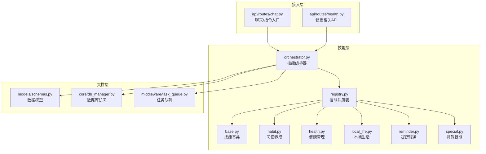
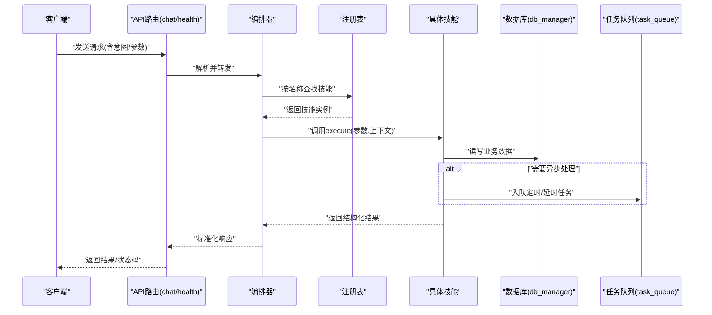
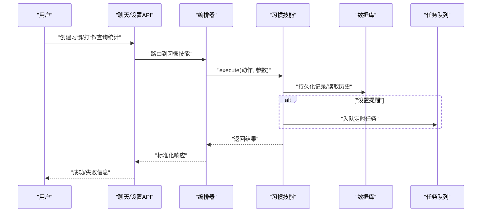
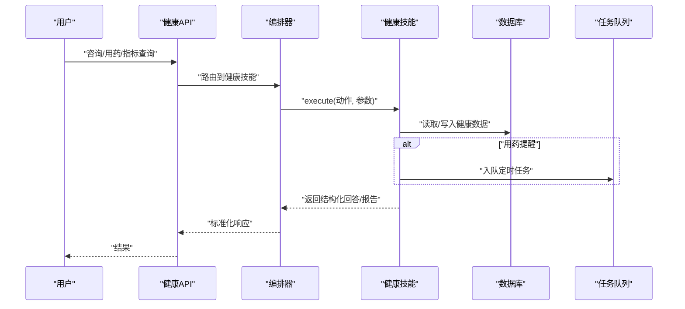
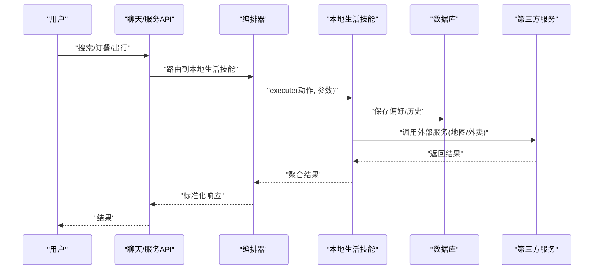
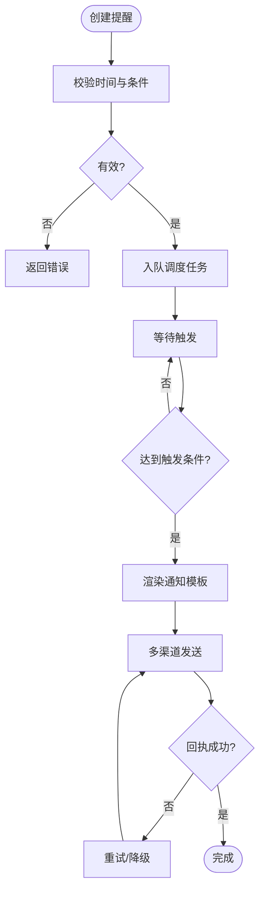
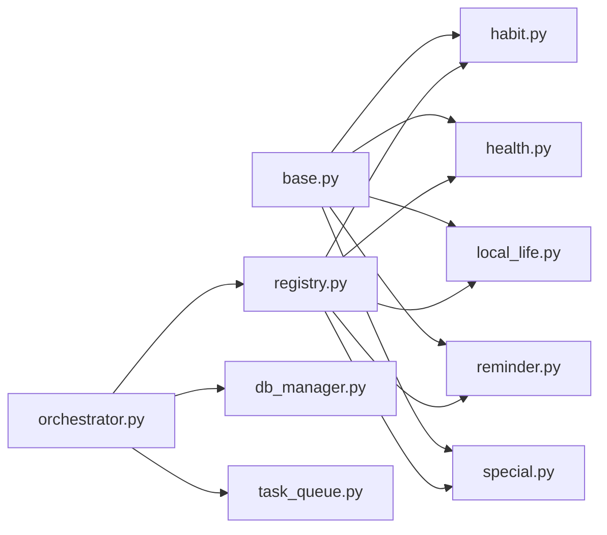

# 内置技能

<cite>
**本文引用的文件**   
- [backend_design/nexus/skills/habit.py](file://backend_design/nexus/skills/habit.py)
- [backend_design/nexus/skills/health.py](file://backend_design/nexus/skills/health.py)
- [backend_design/nexus/skills/local_life.py](file://backend_design/nexus/skills/local_life.py)
- [backend_design/nexus/skills/reminder.py](file://backend_design/nexus/skills/reminder.py)
- [backend_design/nexus/skills/special.py](file://backend_design/nexus/skills/special.py)
- [backend_design/nexus/skills/base.py](file://backend_design/nexus/skills/base.py)
- [backend_design/nexus/skills/orchestrator.py](file://backend_design/nexus/skills/orchestrator.py)
- [backend_design/nexus/skills/registry.py](file://backend_design/nexus/skills/registry.py)
- [backend_design/nexus/api/routes/chat.py](file://backend_design/nexus/api/routes/chat.py)
- [backend_design/nexus/api/routes/health.py](file://backend_design/nexus/api/routes/health.py)
- [backend_design/nexus/models/schemas.py](file://backend_design/nexus/models/schemas.py)
- [backend_design/nexus/core/db_manager.py](file://backend_design/nexus/core/db_manager.py)
- [backend_design/nexus/middleware/task_queue.py](file://backend_design/nexus/middleware/task_queue.py)
</cite>

## 目录
1. [简介](#简介)
2. [项目结构](#项目结构)
3. [核心组件](#核心组件)
4. [架构总览](#架构总览)
5. [详细组件分析](#详细组件分析)
6. [依赖关系分析](#依赖关系分析)
7. [性能考虑](#性能考虑)
8. [故障排查指南](#故障排查指南)
9. [结论](#结论)
10. [附录：API参考与配置](#附录api参考与配置)

## 简介
本文件为 NexusCockpit 的“内置技能”提供完整使用文档，覆盖以下能力域：
- 习惯养成：习惯跟踪、进度统计、提醒设置
- 健康管理：医疗咨询、用药提醒、健康数据分析
- 本地生活服务：周边搜索、外卖订餐、出行规划
- 提醒服务：时间管理、事件触发、多渠道通知
- 特殊技能：高级功能与定制化选项

文档面向开发者与运营人员，既包含高层架构说明，也提供逐技能的 API 参考、配置参数、错误处理与最佳实践。

## 项目结构
NexusCockpit 的技能体系位于 backend_design/nexus/skills 目录下，采用“基类 + 注册表 + 编排器”的统一模式，各技能以独立模块实现，并通过统一接口暴露给上层路由与服务。

图表来源
- [backend_design/nexus/skills/base.py](file://backend_design/nexus/skills/base.py)
- [backend_design/nexus/skills/registry.py](file://backend_design/nexus/skills/registry.py)
- [backend_design/nexus/skills/orchestrator.py](file://backend_design/nexus/skills/orchestrator.py)
- [backend_design/nexus/skills/habit.py](file://backend_design/nexus/skills/habit.py)
- [backend_design/nexus/skills/health.py](file://backend_design/nexus/skills/health.py)
- [backend_design/nexus/skills/local_life.py](file://backend_design/nexus/skills/local_life.py)
- [backend_design/nexus/skills/reminder.py](file://backend_design/nexus/skills/reminder.py)
- [backend_design/nexus/skills/special.py](file://backend_design/nexus/skills/special.py)
- [backend_design/nexus/api/routes/chat.py](file://backend_design/nexus/api/routes/chat.py)
- [backend_design/nexus/api/routes/health.py](file://backend_design/nexus/api/routes/health.py)
- [backend_design/nexus/models/schemas.py](file://backend_design/nexus/models/schemas.py)
- [backend_design/nexus/core/db_manager.py](file://backend_design/nexus/core/db_manager.py)
- [backend_design/nexus/middleware/task_queue.py](file://backend_design/nexus/middleware/task_queue.py)

章节来源
- [backend_design/nexus/skills/base.py](file://backend_design/nexus/skills/base.py)
- [backend_design/nexus/skills/registry.py](file://backend_design/nexus/skills/registry.py)
- [backend_design/nexus/skills/orchestrator.py](file://backend_design/nexus/skills/orchestrator.py)
- [backend_design/nexus/api/routes/chat.py](file://backend_design/nexus/api/routes/chat.py)
- [backend_design/nexus/api/routes/health.py](file://backend_design/nexus/api/routes/health.py)
- [backend_design/nexus/models/schemas.py](file://backend_design/nexus/models/schemas.py)
- [backend_design/nexus/core/db_manager.py](file://backend_design/nexus/core/db_manager.py)
- [backend_design/nexus/middleware/task_queue.py](file://backend_design/nexus/middleware/task_queue.py)

## 核心组件
- 技能基类：定义统一的技能生命周期、上下文传递、结果序列化与错误约定，确保所有技能具备一致的调用契约。
- 注册表：集中维护技能名称到实现的映射，支持动态发现与加载，便于扩展新技能。
- 编排器：根据意图或路由将请求分发至具体技能，负责参数校验、上下文组装、并发控制与结果聚合。
- 数据模型：通过 schemas 定义输入输出结构，保证跨模块的数据一致性。
- 持久化与任务：db_manager 提供数据存取；task_queue 用于异步执行耗时任务（如提醒调度、批量统计）。

章节来源
- [backend_design/nexus/skills/base.py](file://backend_design/nexus/skills/base.py)
- [backend_design/nexus/skills/registry.py](file://backend_design/nexus/skills/registry.py)
- [backend_design/nexus/skills/orchestrator.py](file://backend_design/nexus/skills/orchestrator.py)
- [backend_design/nexus/models/schemas.py](file://backend_design/nexus/models/schemas.py)
- [backend_design/nexus/core/db_manager.py](file://backend_design/nexus/core/db_manager.py)
- [backend_design/nexus/middleware/task_queue.py](file://backend_design/nexus/middleware/task_queue.py)

## 架构总览
下图展示从 API 到技能执行的端到端流程，包括参数校验、路由分发、技能执行、持久化与异步任务。

图表来源
- [backend_design/nexus/api/routes/chat.py](file://backend_design/nexus/api/routes/chat.py)
- [backend_design/nexus/api/routes/health.py](file://backend_design/nexus/api/routes/health.py)
- [backend_design/nexus/skills/orchestrator.py](file://backend_design/nexus/skills/orchestrator.py)
- [backend_design/nexus/skills/registry.py](file://backend_design/nexus/skills/registry.py)
- [backend_design/nexus/core/db_manager.py](file://backend_design/nexus/core/db_manager.py)
- [backend_design/nexus/middleware/task_queue.py](file://backend_design/nexus/middleware/task_queue.py)

## 详细组件分析

### 习惯养成技能
- 能力概览
  - 习惯跟踪：记录每日/每周完成度、连续打卡天数、目标设定与变更
  - 进度统计：生成周期报表、趋势指标、完成率与达成率
  - 提醒设置：基于时间的重复提醒、条件触发（如连续未达标）
- 关键流程
  - 创建/更新习惯：校验参数、写入存储、返回唯一ID
  - 打卡记录：幂等写入、去重、更新累计与连续计数
  - 统计查询：按时间窗口聚合、缓存热点指标
  - 提醒调度：入队定时任务，到期触发通知
- 典型交互序列

图表来源
- [backend_design/nexus/skills/habit.py](file://backend_design/nexus/skills/habit.py)
- [backend_design/nexus/skills/orchestrator.py](file://backend_design/nexus/skills/orchestrator.py)
- [backend_design/nexus/core/db_manager.py](file://backend_design/nexus/core/db_manager.py)
- [backend_design/nexus/middleware/task_queue.py](file://backend_design/nexus/middleware/task_queue.py)

- API 参考（习惯）
  - 创建习惯
    - 方法：POST /api/habits
    - 请求体字段：名称、类型、频率、开始时间、结束时间、提醒开关、提醒时间
    - 响应：习惯ID、状态、消息
  - 打卡记录
    - 方法：POST /api/habits/{id}/checkin
    - 请求体字段：日期、备注、评分
    - 响应：打卡ID、连续天数、完成率
  - 查询统计
    - 方法：GET /api/habits/{id}/stats?start=&end=
    - 响应：完成率、趋势、连续天数、缺失次数
  - 更新/删除
    - 方法：PUT /api/habits/{id}、DELETE /api/habits/{id}
    - 响应：操作结果
- 配置参数
  - 默认提醒策略：是否开启、默认提前量、重复规则
  - 统计粒度：日/周/月
  - 数据保留期：历史数据清理策略
- 错误处理
  - 参数校验失败：返回明确字段级错误
  - 重复打卡：幂等提示
  - 提醒入队失败：降级为同步提醒或重试队列
- 最佳实践
  - 高频打卡建议批量提交
  - 统计查询增加时间范围限制与分页
  - 提醒任务需具备幂等与重试机制

章节来源
- [backend_design/nexus/skills/habit.py](file://backend_design/nexus/skills/habit.py)
- [backend_design/nexus/models/schemas.py](file://backend_design/nexus/models/schemas.py)
- [backend_design/nexus/core/db_manager.py](file://backend_design/nexus/core/db_manager.py)
- [backend_design/nexus/middleware/task_queue.py](file://backend_design/nexus/middleware/task_queue.py)

### 健康管理技能
- 能力概览
  - 医疗咨询：基于知识库与对话上下文的问答与建议
  - 用药提醒：按时服药、剂量核对、漏服告警
  - 健康数据分析：体征指标趋势、异常检测、报告导出
- 关键流程
  - 咨询会话：上下文注入、检索增强、答案结构化
  - 用药计划：周期、频次、剂量、禁忌校验
  - 指标采集：上传/拉取设备数据、清洗与聚合
- 典型交互序列

图表来源
- [backend_design/nexus/skills/health.py](file://backend_design/nexus/skills/health.py)
- [backend_design/nexus/api/routes/health.py](file://backend_design/nexus/api/routes/health.py)
- [backend_design/nexus/skills/orchestrator.py](file://backend_design/nexus/skills/orchestrator.py)
- [backend_design/nexus/core/db_manager.py](file://backend_design/nexus/core/db_manager.py)
- [backend_design/nexus/middleware/task_queue.py](file://backend_design/nexus/middleware/task_queue.py)

- API 参考（健康）
  - 医疗咨询
    - 方法：POST /api/health/consult
    - 请求体：问题、上下文ID、偏好设置
    - 响应：答案、引用来源、置信度
  - 用药提醒
    - 方法：POST /api/health/meds/remind
    - 请求体：药品名、剂量、频次、开始/结束时间
    - 响应：提醒ID、下次时间
  - 健康指标
    - 方法：POST /api/health/metrics
    - 请求体：指标类型、数值、单位、时间戳
    - 响应：入库确认、异常标记
    - 查询：GET /api/health/metrics?user_id=&type=&start=&end=
- 配置参数
  - 知识源开关、相似度阈值、最大引用数
  - 用药规则库版本、禁忌检查开关
  - 指标阈值、异常判定策略
- 错误处理
  - 敏感词/合规拦截：返回安全提示
  - 数据越界或缺失：给出补全建议
  - 外部服务不可用：熔断与降级
- 最佳实践
  - 咨询结果附带可追溯引用
  - 用药提醒具备强一致性与重试
  - 指标数据定期归档与压缩

章节来源
- [backend_design/nexus/skills/health.py](file://backend_design/nexus/skills/health.py)
- [backend_design/nexus/api/routes/health.py](file://backend_design/nexus/api/routes/health.py)
- [backend_design/nexus/models/schemas.py](file://backend_design/nexus/models/schemas.py)
- [backend_design/nexus/core/db_manager.py](file://backend_design/nexus/core/db_manager.py)
- [backend_design/nexus/middleware/task_queue.py](file://backend_design/nexus/middleware/task_queue.py)

### 本地生活服务技能
- 能力概览
  - 周边搜索：POI检索、距离排序、筛选条件
  - 外卖订餐：商家列表、下单、订单状态追踪
  - 出行规划：路线计算、多方式组合、实时路况
- 关键流程
  - 搜索：位置上下文、关键词、过滤条件
  - 订餐：库存/价格校验、支付回调、履约跟踪
  - 出行：起点终点、偏好、预计到达时间
- 典型交互序列

图表来源
- [backend_design/nexus/skills/local_life.py](file://backend_design/nexus/skills/local_life.py)
- [backend_design/nexus/skills/orchestrator.py](file://backend_design/nexus/skills/orchestrator.py)
- [backend_design/nexus/core/db_manager.py](file://backend_design/nexus/core/db_manager.py)

- API 参考（本地生活）
  - 周边搜索
    - 方法：GET /api/life/search?lat=&lon=&keyword=&radius=
    - 响应：地点列表、距离、评分
  - 外卖订餐
    - 方法：POST /api/life/order
    - 请求体：商家ID、菜品、数量、地址、支付方式
    - 响应：订单号、预计送达时间
    - 查询：GET /api/life/orders/{id}
  - 出行规划
    - 方法：POST /api/life/route
    - 请求体：起点、终点、交通方式、偏好
    - 响应：路线段、时长、费用估算
- 配置参数
  - 第三方服务密钥、超时与重试次数
  - 搜索默认半径、排序权重
  - 订单状态轮询间隔
- 错误处理
  - 外部服务限流：退避重试与降级
  - 地址解析失败：引导用户修正
  - 支付回调丢失：对账补偿
- 最佳实践
  - 搜索结果分页与缓存
  - 订单状态采用事件驱动更新
  - 路线规划支持离线备选方案

章节来源
- [backend_design/nexus/skills/local_life.py](file://backend_design/nexus/skills/local_life.py)
- [backend_design/nexus/models/schemas.py](file://backend_design/nexus/models/schemas.py)
- [backend_design/nexus/core/db_manager.py](file://backend_design/nexus/core/db_manager.py)

### 提醒服务技能
- 能力概览
  - 时间管理：一次性/周期性/相对时间任务
  - 事件触发：条件满足时自动执行
  - 多渠道通知：站内信、短信、邮件、推送
- 关键流程
  - 任务创建：校验时间、去重、优先级
  - 调度执行：延迟队列、重试、失败告警
  - 通知投递：模板渲染、渠道选择、回执处理
- 流程图

图表来源
- [backend_design/nexus/skills/reminder.py](file://backend_design/nexus/skills/reminder.py)
- [backend_design/nexus/middleware/task_queue.py](file://backend_design/nexus/middleware/task_queue.py)

- API 参考（提醒）
  - 创建提醒
    - 方法：POST /api/reminders
    - 请求体：标题、内容、触发时间/周期、渠道、条件
    - 响应：提醒ID、下次触发时间
  - 查询/修改/取消
    - 方法：GET /api/reminders/{id}、PUT /api/reminders/{id}、DELETE /api/reminders/{id}
    - 响应：操作结果
  - 回执与日志
    - 方法：GET /api/reminders/{id}/logs
    - 响应：发送记录、状态码、错误信息
- 配置参数
  - 渠道开关、模板路径、重试策略
  - 队列容量、消费并行度
  - 时区与夏令时处理
- 错误处理
  - 时间非法：拒绝并提示
  - 渠道不可用：切换备用渠道
  - 队列积压：限速与告警
- 最佳实践
  - 提醒内容模板化与A/B测试
  - 幂等发送与去重键
  - 失败快速回滚与人工介入

章节来源
- [backend_design/nexus/skills/reminder.py](file://backend_design/nexus/skills/reminder.py)
- [backend_design/nexus/middleware/task_queue.py](file://backend_design/nexus/middleware/task_queue.py)
- [backend_design/nexus/models/schemas.py](file://backend_design/nexus/models/schemas.py)

### 特殊技能
- 能力概览
  - 高级功能：复杂工作流编排、插件式扩展、自定义策略
  - 定制化选项：策略参数、行为开关、权限控制
- 设计要点
  - 通过注册表动态加载，避免硬编码
  - 使用编排器进行步骤串联与分支判断
  - 结合任务队列实现长耗时与异步逻辑
- 使用示例（概念）
  - 创建工作流：定义节点、条件、回调
  - 配置策略：权重、阈值、超时
  - 监控与审计：记录执行轨迹与指标

章节来源
- [backend_design/nexus/skills/special.py](file://backend_design/nexus/skills/special.py)
- [backend_design/nexus/skills/registry.py](file://backend_design/nexus/skills/registry.py)
- [backend_design/nexus/skills/orchestrator.py](file://backend_design/nexus/skills/orchestrator.py)

## 依赖关系分析
- 内聚与耦合
  - 各技能仅依赖基类、注册表、编排器与通用支撑（数据库、队列），保持低耦合
  - 编排器作为中心枢纽，屏蔽具体实现差异
- 外部依赖
  - 第三方服务（地图、外卖、推送）通过适配器隔离，便于替换与降级
- 潜在循环依赖
  - 当前分层清晰，未见循环导入风险

图表来源
- [backend_design/nexus/skills/base.py](file://backend_design/nexus/skills/base.py)
- [backend_design/nexus/skills/registry.py](file://backend_design/nexus/skills/registry.py)
- [backend_design/nexus/skills/orchestrator.py](file://backend_design/nexus/skills/orchestrator.py)
- [backend_design/nexus/skills/habit.py](file://backend_design/nexus/skills/habit.py)
- [backend_design/nexus/skills/health.py](file://backend_design/nexus/skills/health.py)
- [backend_design/nexus/skills/local_life.py](file://backend_design/nexus/skills/local_life.py)
- [backend_design/nexus/skills/reminder.py](file://backend_design/nexus/skills/reminder.py)
- [backend_design/nexus/skills/special.py](file://backend_design/nexus/skills/special.py)
- [backend_design/nexus/core/db_manager.py](file://backend_design/nexus/core/db_manager.py)
- [backend_design/nexus/middleware/task_queue.py](file://backend_design/nexus/middleware/task_queue.py)

章节来源
- [backend_design/nexus/skills/base.py](file://backend_design/nexus/skills/base.py)
- [backend_design/nexus/skills/registry.py](file://backend_design/nexus/skills/registry.py)
- [backend_design/nexus/skills/orchestrator.py](file://backend_design/nexus/skills/orchestrator.py)
- [backend_design/nexus/core/db_manager.py](file://backend_design/nexus/core/db_manager.py)
- [backend_design/nexus/middleware/task_queue.py](file://backend_design/nexus/middleware/task_queue.py)

## 性能考虑
- 缓存策略：热点统计与搜索结果缓存，降低数据库压力
- 批处理：批量打卡、批量统计、批量提醒合并
- 异步化：耗时操作入队，提升响应速度
- 限流与熔断：对外部服务调用进行保护
- 索引优化：常用查询字段建立索引，缩短扫描时间

[本节为通用指导，不直接分析具体文件]

## 故障排查指南
- 常见问题
  - 技能未注册：检查注册表初始化与命名一致性
  - 参数校验失败：对照 schemas 字段要求逐项排查
  - 提醒未触发：查看任务队列堆积与重试日志
  - 外部服务超时：检查密钥、网络连通与熔断状态
- 定位手段
  - 启用链路追踪与结构化日志
  - 关注队列消费速率与失败率
  - 数据库慢查询分析与索引优化
- 恢复策略
  - 重试与退避
  - 降级与只读模式
  - 人工干预与补偿任务

章节来源
- [backend_design/nexus/models/schemas.py](file://backend_design/nexus/models/schemas.py)
- [backend_design/nexus/middleware/task_queue.py](file://backend_design/nexus/middleware/task_queue.py)
- [backend_design/nexus/core/db_manager.py](file://backend_design/nexus/core/db_manager.py)

## 结论
NexusCockpit 的内置技能通过统一基类、注册表与编排器实现了高内聚、低耦合的可扩展架构。各技能围绕各自领域提供完整的 API、配置与错误处理策略，配合任务队列与数据库支撑，能够满足习惯养成、健康管理、本地生活与提醒服务等多样化场景。建议在上线前完善监控与告警，持续优化性能与稳定性。

[本节为总结性内容，不直接分析具体文件]

## 附录：API参考与配置
- 统一规范
  - 请求头：鉴权令牌、租户标识、语言偏好
  - 响应格式：标准状态码、消息、数据体
  - 错误码：业务错误码与系统错误码分离
- 公共配置项
  - 日志级别、采样率
  - 队列大小、消费者数量
  - 数据库连接池、超时
- 各技能专属配置
  - 习惯：统计粒度、提醒策略、数据保留期
  - 健康：知识源、阈值、报告模板
  - 本地生活：第三方密钥、重试次数、缓存TTL
  - 提醒：渠道开关、模板路径、重试策略
  - 特殊：策略参数、权限矩阵、审计开关

章节来源
- [backend_design/nexus/models/schemas.py](file://backend_design/nexus/models/schemas.py)
- [backend_design/nexus/skills/habit.py](file://backend_design/nexus/skills/habit.py)
- [backend_design/nexus/skills/health.py](file://backend_design/nexus/skills/health.py)
- [backend_design/nexus/skills/local_life.py](file://backend_design/nexus/skills/local_life.py)
- [backend_design/nexus/skills/reminder.py](file://backend_design/nexus/skills/reminder.py)
- [backend_design/nexus/skills/special.py](file://backend_design/nexus/skills/special.py)